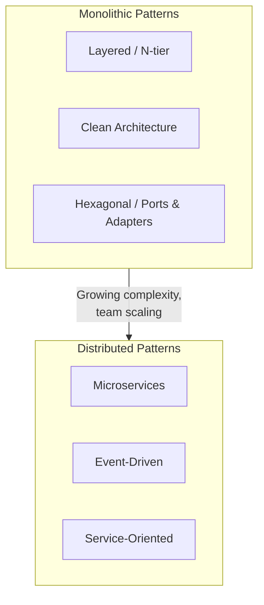
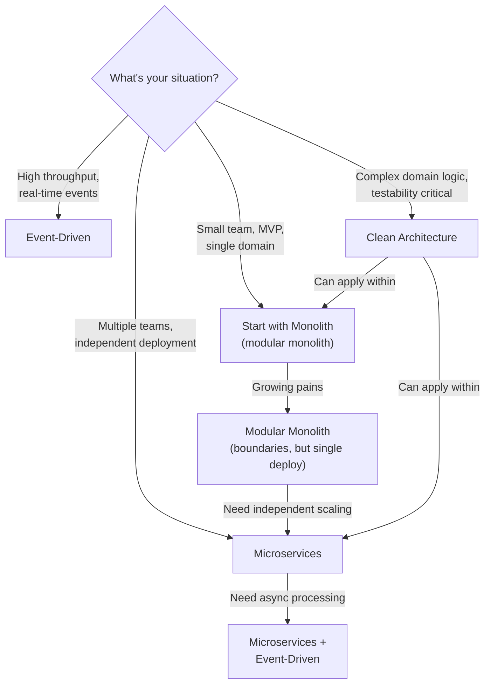

# 🏛 Architecture Patterns

> **The blueprint for building software systems.** Architecture patterns provide proven approaches to structuring applications. Choosing the right pattern determines how well your system scales, evolves, and handles failure.

---

## 📑 Table of Contents

- [What is Software Architecture?](#-what-is-software-architecture)
- [Architecture Patterns](#-architecture-patterns)
- [Comparison Table](#-comparison-table)
- [When to Use Which Pattern](#-when-to-use-which-pattern)
- [Related Topics](#-related-topics)

---

## 🧠 What is Software Architecture?

Software architecture is the set of fundamental decisions about how a system is organized: its components, their relationships, and the principles guiding their design and evolution.

**Good architecture:**
- Makes the system easy to understand and modify
- Supports the required quality attributes (performance, scalability, reliability)
- Allows independent team development and deployment
- Makes trade-offs explicit

**Architecture is NOT about:**
- Choosing frameworks or libraries (those are implementation details)
- Getting it perfect upfront (it evolves)
- Following patterns dogmatically (understand trade-offs)

---

## 📚 Architecture Patterns

| Pattern | Description | Key Topics |
|---------|-------------|------------|
| [Microservices](microservices.md) | Independent, loosely coupled services | Service discovery, API gateway, resilience |
| [Event-Driven](event-driven.md) | Asynchronous communication via events | Event sourcing, CQRS, message brokers |
| [Clean Architecture](clean-architecture.md) | Dependency inversion, layered boundaries | Entities, use cases, ports & adapters |

---

## ⚖️ Comparison Table

| Aspect | Monolith | Microservices | Event-Driven | Clean Architecture |
|--------|----------|---------------|-------------|-------------------|
| **Deployment** | Single unit | Independent services | Event producers/consumers | Single unit (typically) |
| **Scaling** | Whole app | Per-service | Per-consumer | Whole app |
| **Complexity** | Low initially | High (distributed systems) | High (async, ordering) | Medium (structure overhead) |
| **Team size** | Small teams | Large teams, many squads | Cross-functional | Any size |
| **Data** | Shared database | Database per service | Event store / per-service | Single database (typically) |
| **Consistency** | Strong (single DB) | Eventual | Eventual | Strong (single DB) |
| **Testing** | Simple | Complex (contract, integration) | Complex (event flows) | Easy (dependency injection) |
| **Latency** | Low (in-process) | Higher (network calls) | Variable (async) | Low (in-process) |
| **Best for** | Small-medium apps, MVPs | Large-scale, multi-team | Real-time, high throughput | Domain-heavy business logic |

---

## 🔍 When to Use Which Pattern

### Decision Guide

| Start With | When | Evolve To |
|-----------|------|-----------|
| **Monolith** | New project, small team, unclear domain boundaries | Modular monolith → microservices |
| **Modular Monolith** | Known domain boundaries, single team | Microservices when teams scale |
| **Microservices** | Multiple teams, well-understood domains | Add event-driven for async flows |
| **Event-Driven** | High throughput, loose coupling needed | Combine with microservices |
| **Clean Architecture** | Complex business logic, needs testability | Apply within monolith or microservices |

> **Start simple, evolve as needed.** The biggest mistake is starting with microservices before understanding domain boundaries. A well-structured monolith is better than a poorly-designed distributed system.

---

## 🔗 Related Topics

- [System Design](../system-design/) — System design fundamentals and case studies
- [Microservices](microservices.md) — Microservice architecture deep dive
- [Event-Driven](event-driven.md) — Event-driven architecture patterns
- [Clean Architecture](clean-architecture.md) — Clean architecture and hexagonal patterns
- [Distributed Systems](../distributed-systems/) — Consensus, replication, partitioning
- [Databases](../databases/) — Database design for different architectures
- [DevOps](../devops/) — Deployment strategies for different architectures
- [Engineering](../engineering/) — Testing, logging, and performance practices

---

> **Architecture is about trade-offs, not best practices.** Every pattern has strengths and weaknesses. The goal is to choose the architecture that best aligns with your team size, domain complexity, scalability requirements, and organizational structure. Remember Conway's Law: your architecture will mirror your organization.
