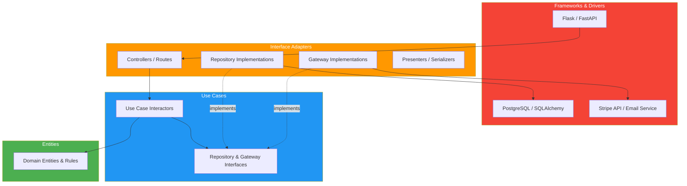
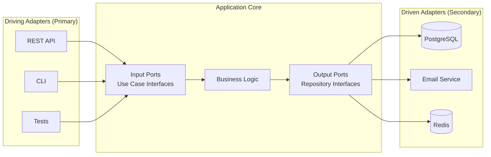

# Clean Architecture

> **Separate business logic from infrastructure.** Clean Architecture organizes code so that the core domain logic is independent of frameworks, databases, and external services — making systems testable, maintainable, and adaptable to change.

---

## 📑 Table of Contents

- [What is Clean Architecture?](#-what-is-clean-architecture)
- [The Dependency Rule](#-the-dependency-rule)
- [Layers](#-layers)
- [Architecture Diagram](#-architecture-diagram)
- [Implementation Example](#-implementation-example)
- [Hexagonal Architecture](#-hexagonal-architecture-ports-and-adapters)
- [Benefits and Trade-offs](#-benefits-and-trade-offs)
- [When to Use](#-when-to-use-and-when-its-overkill)
- [Testing Approach](#-testing-approach)
- [Related Topics](#-related-topics)

---

## 🧠 What is Clean Architecture?

Proposed by Robert C. Martin (Uncle Bob), Clean Architecture enforces a strict separation of concerns through concentric layers. The core idea: **dependencies point inward** — inner layers know nothing about outer layers.

**Goals:**
- Business logic is independent of UI, database, and frameworks
- Business logic is testable without external dependencies
- The system is adaptable — swap databases, frameworks, or delivery mechanisms without changing core logic

---

## 🔄 The Dependency Rule

> **Source code dependencies must point inward only.** Nothing in an inner layer can know anything about an outer layer.

```text
❌ Wrong: Entity imports SQLAlchemy model
❌ Wrong: Use case calls Flask request object
❌ Wrong: Domain logic depends on Redis client

✅ Right: Entity defines a pure data class
✅ Right: Use case calls an abstract repository interface
✅ Right: Infrastructure implements the repository interface
```

**Inversion of Control:** Inner layers define interfaces (ports). Outer layers implement them (adapters). This is the Dependency Inversion Principle from SOLID.

---

## 🏛 Layers

### Layer 1: Entities (Enterprise Business Rules)

The innermost layer. Pure business objects and rules that would exist even without software.

```python
# entities/order.py
from dataclasses import dataclass
from enum import Enum

class OrderStatus(Enum):
    PENDING = "pending"
    CONFIRMED = "confirmed"
    SHIPPED = "shipped"
    DELIVERED = "delivered"
    CANCELLED = "cancelled"

@dataclass
class Order:
    id: str
    user_id: str
    items: list
    total: float
    status: OrderStatus = OrderStatus.PENDING

    def confirm(self) -> None:
        if self.status != OrderStatus.PENDING:
            raise ValueError(f"Cannot confirm order in {self.status} state")
        self.status = OrderStatus.CONFIRMED

    def cancel(self) -> None:
        if self.status in (OrderStatus.SHIPPED, OrderStatus.DELIVERED):
            raise ValueError("Cannot cancel shipped/delivered order")
        self.status = OrderStatus.CANCELLED
```

**Entities have NO dependencies** — no framework imports, no database imports, no HTTP imports.

### Layer 2: Use Cases (Application Business Rules)

Orchestrate entities to fulfill application-specific business rules. Define **input/output boundaries**.

```python
# use_cases/create_order.py
from dataclasses import dataclass
from abc import ABC, abstractmethod

@dataclass
class CreateOrderRequest:
    user_id: str
    items: list[dict]

@dataclass
class CreateOrderResponse:
    order_id: str
    total: float
    status: str

class OrderRepository(ABC):
    """Port — interface defined by use case, implemented by infrastructure."""
    @abstractmethod
    def save(self, order: Order) -> None: ...

    @abstractmethod
    def find_by_id(self, order_id: str) -> Order | None: ...

class PaymentGateway(ABC):
    """Port for payment processing."""
    @abstractmethod
    def charge(self, user_id: str, amount: float) -> bool: ...

class CreateOrderUseCase:
    def __init__(self, order_repo: OrderRepository, payment: PaymentGateway):
        self.order_repo = order_repo
        self.payment = payment

    def execute(self, request: CreateOrderRequest) -> CreateOrderResponse:
        # Business logic — no framework dependencies
        total = sum(item["price"] * item["quantity"] for item in request.items)
        order = Order(
            id=generate_id(),
            user_id=request.user_id,
            items=request.items,
            total=total,
        )

        if not self.payment.charge(request.user_id, total):
            raise PaymentFailedError("Payment declined")

        order.confirm()
        self.order_repo.save(order)

        return CreateOrderResponse(
            order_id=order.id,
            total=order.total,
            status=order.status.value,
        )
```

### Layer 3: Interface Adapters

Convert data between the format used by use cases and the format used by external agencies (DB, web, etc.).

```python
# adapters/api/order_controller.py (Flask adapter)
from flask import Blueprint, request, jsonify

order_bp = Blueprint("orders", __name__)

@order_bp.route("/orders", methods=["POST"])
def create_order():
    data = request.get_json()
    use_case = get_create_order_use_case()  # Dependency injection

    req = CreateOrderRequest(
        user_id=data["user_id"],
        items=data["items"],
    )
    response = use_case.execute(req)

    return jsonify({
        "order_id": response.order_id,
        "total": response.total,
        "status": response.status,
    }), 201
```

```python
# adapters/repositories/postgres_order_repo.py
class PostgresOrderRepository(OrderRepository):
    def __init__(self, session):
        self.session = session

    def save(self, order: Order) -> None:
        record = OrderModel(
            id=order.id,
            user_id=order.user_id,
            items=order.items,
            total=order.total,
            status=order.status.value,
        )
        self.session.add(record)
        self.session.commit()

    def find_by_id(self, order_id: str) -> Order | None:
        record = self.session.query(OrderModel).get(order_id)
        if not record:
            return None
        return Order(
            id=record.id,
            user_id=record.user_id,
            items=record.items,
            total=record.total,
            status=OrderStatus(record.status),
        )
```

### Layer 4: Frameworks & Drivers

The outermost layer. Frameworks, databases, web servers, external APIs. This code is "glue" that connects everything.

```python
# main.py — composition root
from flask import Flask
from adapters.repositories.postgres_order_repo import PostgresOrderRepository
from adapters.payment.stripe_gateway import StripePaymentGateway
from use_cases.create_order import CreateOrderUseCase

app = Flask(__name__)
db_session = create_db_session()

# Wire dependencies
order_repo = PostgresOrderRepository(db_session)
payment = StripePaymentGateway(api_key="sk_...")

def get_create_order_use_case():
    return CreateOrderUseCase(order_repo, payment)
```

---

## 📊 Architecture Diagram



**Dependency direction:** Outer → Inner (always). Never Inner → Outer.

---

## 📁 Implementation Example

### Python Project Structure

```text
src/
├── entities/                 # Layer 1: Enterprise business rules
│   ├── order.py
│   ├── user.py
│   └── product.py
├── use_cases/                # Layer 2: Application business rules
│   ├── create_order.py
│   ├── get_order.py
│   ├── cancel_order.py
│   └── ports/                # Interfaces (abstract classes)
│       ├── order_repository.py
│       └── payment_gateway.py
├── adapters/                 # Layer 3: Interface adapters
│   ├── api/                  # Web controllers
│   │   ├── order_controller.py
│   │   └── user_controller.py
│   ├── repositories/         # Database implementations
│   │   ├── postgres_order_repo.py
│   │   └── models.py         # SQLAlchemy models
│   └── gateways/             # External service implementations
│       ├── stripe_payment.py
│       └── sendgrid_email.py
├── frameworks/               # Layer 4: Frameworks & drivers
│   ├── flask_app.py          # Flask setup
│   ├── database.py           # DB connection
│   └── config.py             # Configuration
└── main.py                   # Composition root

tests/
├── unit/
│   ├── test_entities/
│   └── test_use_cases/       # Test with mocked ports
├── integration/
│   └── test_repositories/    # Test with real DB
└── e2e/
    └── test_api/             # Test full HTTP flow
```

### Go Project Structure

```text
internal/
├── domain/                   # Entities
│   ├── order.go
│   └── user.go
├── usecase/                  # Use cases + port interfaces
│   ├── order/
│   │   ├── create.go
│   │   ├── get.go
│   │   └── repository.go    # Interface
│   └── payment/
│       └── gateway.go        # Interface
├── adapter/                  # Interface adapters
│   ├── handler/              # HTTP handlers
│   │   └── order_handler.go
│   ├── repository/           # DB implementations
│   │   └── postgres_order.go
│   └── gateway/              # External services
│       └── stripe_payment.go
└── infrastructure/           # Frameworks & drivers
    ├── server/
    │   └── http.go
    ├── database/
    │   └── postgres.go
    └── config/
        └── config.go
cmd/
└── api/
    └── main.go               # Composition root
```

---

## 🔷 Hexagonal Architecture (Ports and Adapters)

Hexagonal Architecture (by Alistair Cockburn) is closely related to Clean Architecture. The core idea is the same: separate the application core from external concerns using **ports** (interfaces) and **adapters** (implementations).



### Clean vs Hexagonal

| Aspect | Clean Architecture | Hexagonal Architecture |
|--------|-------------------|----------------------|
| Origin | Robert C. Martin (2012) | Alistair Cockburn (2005) |
| Structure | Concentric layers | Hexagon with ports/adapters |
| Ports | Implicit (use case interfaces) | Explicit (primary + secondary) |
| Layers | 4 explicit layers | Core + adapters |
| Core idea | Same: dependency inversion | Same: dependency inversion |

In practice, they're nearly identical. Clean Architecture provides more specific layer guidance; Hexagonal is more flexible about internal structure.

---

## ⚖️ Benefits and Trade-offs

### Benefits

| Benefit | Description |
|---------|-------------|
| **Testability** | Business logic tested without DB, web, or external services |
| **Independence** | Swap databases, frameworks, or APIs without changing core logic |
| **Maintainability** | Clear boundaries make code easier to navigate and modify |
| **Focus on domain** | Forces you to think about business rules first |
| **Parallel development** | Teams can work on different layers independently |

### Trade-offs

| Trade-off | Description |
|-----------|-------------|
| **More code** | Interfaces, DTOs, mappers add boilerplate |
| **Indirection** | Following the flow requires jumping between files |
| **Over-engineering** | For simple CRUD, it's overkill |
| **Learning curve** | Team needs to understand and follow the patterns |
| **Mapping overhead** | Converting between entity, model, and DTO objects |

---

## 🤔 When to Use and When It's Overkill

### Use Clean Architecture When

- **Complex domain logic** — Many business rules, validations, workflows
- **Long-lived project** — Will be maintained and extended for years
- **Testability is critical** — Need to test business logic in isolation
- **Team is growing** — Clear boundaries help onboarding and parallel work
- **Database might change** — Need to decouple from specific DB technology
- **Multiple delivery mechanisms** — Same logic served via REST, gRPC, CLI, events

### It's Overkill When

- **Simple CRUD** — If your service is mostly reading/writing to a database
- **Prototype or MVP** — Speed of development is more important
- **Small, short-lived project** — Won't benefit from the upfront investment
- **Small team** — Overhead isn't justified for 1-2 developers
- **Framework-heavy apps** — If the framework IS the application (WordPress, Django admin)

### Middle Ground: Modular Architecture

For projects that don't justify full Clean Architecture, use a modular approach:

```text
src/
├── orders/           # Feature module
│   ├── models.py     # Domain + DB model (acceptable coupling)
│   ├── service.py    # Business logic
│   ├── routes.py     # HTTP handlers
│   └── tests/
├── payments/
│   ├── models.py
│   ├── service.py
│   ├── routes.py
│   └── tests/
└── shared/
    ├── database.py
    └── auth.py
```

---

## 🧪 Testing Approach

### Unit Tests (Entities + Use Cases)

Test business logic with mocked dependencies — fast, no infrastructure needed.

```python
# tests/unit/test_create_order.py
from unittest.mock import Mock
from use_cases.create_order import CreateOrderUseCase, CreateOrderRequest

def test_create_order_success():
    # Arrange — mock the ports
    mock_repo = Mock()
    mock_payment = Mock()
    mock_payment.charge.return_value = True

    use_case = CreateOrderUseCase(mock_repo, mock_payment)
    request = CreateOrderRequest(
        user_id="user_123",
        items=[{"product_id": "prod_1", "quantity": 2, "price": 29.99}],
    )

    # Act
    response = use_case.execute(request)

    # Assert
    assert response.total == 59.98
    assert response.status == "confirmed"
    mock_repo.save.assert_called_once()
    mock_payment.charge.assert_called_once_with("user_123", 59.98)

def test_create_order_payment_failure():
    mock_repo = Mock()
    mock_payment = Mock()
    mock_payment.charge.return_value = False

    use_case = CreateOrderUseCase(mock_repo, mock_payment)
    request = CreateOrderRequest(user_id="user_123", items=[...])

    with pytest.raises(PaymentFailedError):
        use_case.execute(request)

    mock_repo.save.assert_not_called()  # Order not saved
```

### Integration Tests (Adapters)

Test adapter implementations with real infrastructure.

```python
# tests/integration/test_postgres_order_repo.py
def test_save_and_retrieve_order(db_session):
    repo = PostgresOrderRepository(db_session)
    order = Order(id="ord_1", user_id="user_1", items=[], total=0.0)

    repo.save(order)
    retrieved = repo.find_by_id("ord_1")

    assert retrieved is not None
    assert retrieved.id == "ord_1"
```

### Key Testing Principle

> **Mock the boundaries, not the internals.** Mock ports (repository interfaces, gateway interfaces) in unit tests. Use real implementations in integration tests. This gives you fast unit tests AND confidence in infrastructure integration.

---

## 🔗 Related Topics

- [Microservices](microservices.md) — Clean architecture within microservices
- [Event-Driven Architecture](event-driven.md) — Event handling in clean architecture
- [System Design](../system-design/) — System-level design decisions
- [API Design](../system-design/api-design.md) — API as a delivery mechanism
- [Engineering](../engineering/) — Testing strategies and best practices
- [Languages: Python](../languages/python/) — Python project structure
- [Languages: Go](../languages/go/) — Go project structure
- [Databases](../databases/) — Repository pattern implementations

---

> **Clean Architecture is about protecting your business logic.** Frameworks change, databases change, APIs change — but your core business rules should remain stable. By inverting dependencies, you make the most important code in your system the most independent and testable. Use it when the domain complexity justifies the structural investment.
