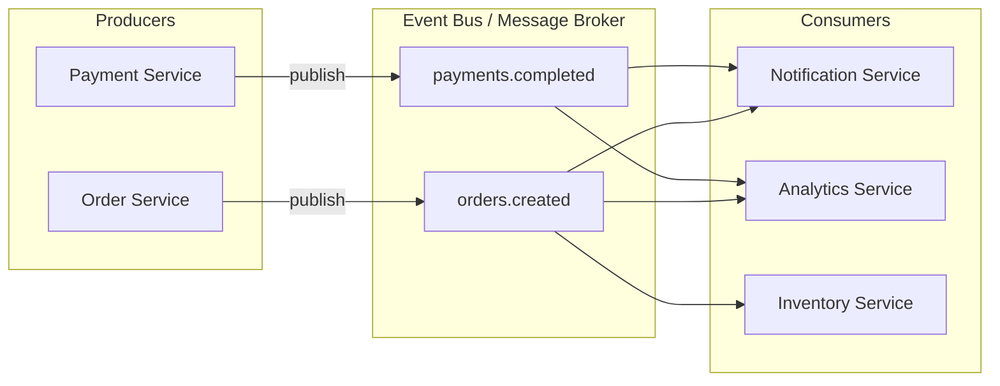
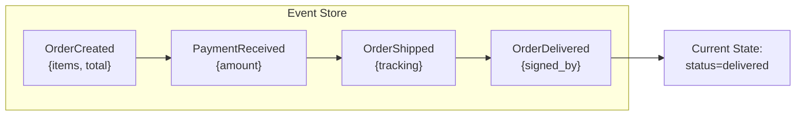
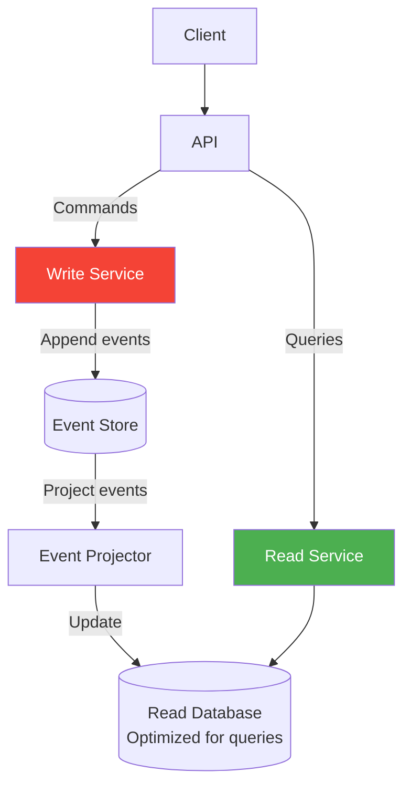
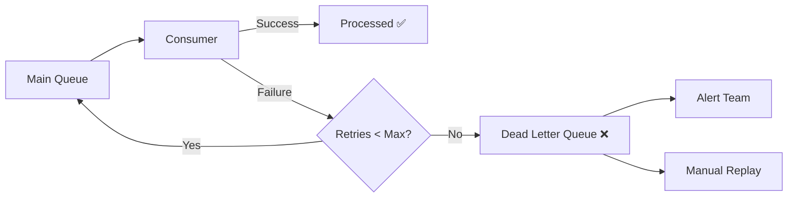

# Event-Driven Architecture

> **Decouple systems through asynchronous events.** Event-driven architecture (EDA) is a pattern where components communicate by producing and consuming events — enabling loose coupling, scalability, and real-time responsiveness.

---

## 📑 Table of Contents

- [What is Event-Driven Architecture?](#-what-is-event-driven-architecture)
- [Core Concepts](#-core-concepts)
- [Patterns](#-patterns)
- [Technologies](#-technologies)
- [Event Schema Design](#-event-schema-design)
- [Exactly-Once Processing](#-exactly-once-processing)
- [Ordering Guarantees](#-ordering-guarantees)
- [Dead Letter Queues](#-dead-letter-queues)
- [Benefits and Drawbacks](#-benefits-and-drawbacks)
- [When to Use](#-when-to-use)
- [Related Topics](#-related-topics)

---

## 🧠 What is Event-Driven Architecture?

In EDA, components interact by producing and reacting to **events** — facts about things that have happened. Instead of services calling each other directly, they publish events that other services can subscribe to.



**Key shift:** Services don't tell other services what to do. They announce what happened, and interested services react.

---

## 🔑 Core Concepts

### Events

An event is an immutable record of something that happened.

```json
{
  "event_id": "evt_abc123",
  "event_type": "order.created",
  "timestamp": "2026-08-31T12:00:00Z",
  "source": "order-service",
  "data": {
    "order_id": "ORD-456",
    "user_id": "user_789",
    "items": [
      { "product_id": "prod_1", "quantity": 2, "price": 29.99 }
    ],
    "total": 59.98
  },
  "metadata": {
    "correlation_id": "req_xyz",
    "version": "1.0"
  }
}
```

### Event Types

| Type | Description | Example |
|------|-------------|---------|
| **Domain event** | Business fact | `order.created`, `payment.completed` |
| **Integration event** | Cross-service communication | `user.registered` (triggers welcome email) |
| **System event** | Infrastructure fact | `service.started`, `deployment.completed` |
| **Command event** | Request to perform action | `send.email` (a command disguised as an event) |

### Producers, Consumers, and Brokers

| Component | Role | Example |
|-----------|------|---------|
| **Producer** | Publishes events | Order Service publishes `order.created` |
| **Consumer** | Subscribes and reacts to events | Notification Service sends email on `order.created` |
| **Broker** | Routes events from producers to consumers | Kafka, RabbitMQ, Redis Streams |
| **Event Store** | Persists events for replay | EventStoreDB, Kafka (with retention) |

---

## 🏗 Patterns

### Event Notification

Minimal event that notifies something happened. Consumers query the source for details.

```json
{
  "event_type": "order.created",
  "data": { "order_id": "ORD-456" }
}
// Consumer calls Order Service: GET /orders/ORD-456 for details
```

**Pros:** Small events, source of truth stays in original service.
**Cons:** Consumer depends on source service being available.

### Event-Carried State Transfer

Event contains all the data consumers need — no callbacks required.

```json
{
  "event_type": "order.created",
  "data": {
    "order_id": "ORD-456",
    "user_id": "user_789",
    "user_email": "alice@example.com",
    "items": [...],
    "total": 59.98,
    "shipping_address": { ... }
  }
}
// Consumer has everything it needs — no callback to source
```

**Pros:** Full decoupling, consumers can work offline.
**Cons:** Larger events, potential data duplication, staleness.

### Event Sourcing

Store the state of an entity as a sequence of events rather than the current state.



```text
Traditional CRUD:
  UPDATE orders SET status='shipped' WHERE id=123

Event Sourcing:
  APPEND TO events: {type: "OrderShipped", order_id: 123, tracking: "ABC"}
  Current state = fold(all events for order 123)
```

**Benefits:**
- Complete audit trail
- Can replay events to rebuild state
- Can create different views (projections) from same events
- Time travel — see state at any point in time

**Drawbacks:**
- Complexity: event versioning, schema evolution
- Eventually consistent reads (projections may lag)
- Harder to query (need projections or read models)

### CQRS (Command Query Responsibility Segregation)

Separate the write model (commands) from the read model (queries).



**CQRS + Event Sourcing:**

- Write side appends events to event store
- Read side projects events into denormalized read models
- Read models are optimized for specific query patterns
- Multiple read models can exist for different use cases

**Use when:**
- Read and write patterns are very different
- Need complex querying on eventually consistent data
- Want full audit trail (with event sourcing)

---

## 🛠 Technologies

### Technology Comparison

| Feature | Kafka | RabbitMQ | Redis Streams | AWS SQS/SNS |
|---------|-------|----------|---------------|-------------|
| **Model** | Log-based (pull) | Queue-based (push) | Log-based (pull) | Queue + pub/sub |
| **Throughput** | Very high (millions/sec) | High (100K/sec) | High | High (managed) |
| **Ordering** | Per-partition | Per-queue | Per-stream | FIFO available |
| **Persistence** | Configurable retention | Optional | Optional | Yes |
| **Replay** | Yes (offset-based) | No | Yes (ID-based) | No |
| **Consumer groups** | Yes | Yes | Yes | Yes |
| **Complexity** | High (cluster management) | Medium | Low | Low (managed) |
| **Best for** | High-throughput streaming, event sourcing | Task queues, RPC | Simple streaming, caching layer | Cloud-native, serverless |

### Kafka

**Best for:** High-throughput event streaming, event sourcing, real-time data pipelines.

```text
Key concepts:
  - Topics: named channels for events
  - Partitions: parallel units within a topic
  - Consumer Groups: parallel consumers that share work
  - Offsets: position tracking per consumer per partition
  - Retention: events kept for configurable period (or forever)
```

→ See [Distributed Systems](../distributed-systems/) for Kafka deep dive

### RabbitMQ

**Best for:** Task queues, request-reply, routing patterns.

```text
Key concepts:
  - Exchanges: route messages to queues (direct, fanout, topic, headers)
  - Queues: store messages until consumed
  - Bindings: rules connecting exchanges to queues
  - Acknowledgments: consumer confirms processing
```

### Cloud Services

```text
AWS:    SNS (pub/sub) + SQS (queues) + EventBridge (event bus)
GCP:    Cloud Pub/Sub + Cloud Tasks
Azure:  Event Grid + Service Bus + Event Hubs
```

---

## 📋 Event Schema Design

### Schema Versioning

Events evolve over time. Handle schema changes gracefully.

```text
Strategies:
  1. Always backwards compatible (add fields, never remove/rename)
  2. Version in event type: "order.created.v2"
  3. Schema registry (Confluent Schema Registry, AWS Glue)
```

**Backwards compatible changes (safe):**
- Adding optional fields
- Adding new event types

**Breaking changes (require versioning):**
- Removing fields
- Renaming fields
- Changing field types

### CloudEvents Specification

Standard format for event metadata:

```json
{
  "specversion": "1.0",
  "type": "com.example.order.created",
  "source": "/order-service",
  "id": "evt_abc123",
  "time": "2026-08-31T12:00:00Z",
  "datacontenttype": "application/json",
  "data": {
    "order_id": "ORD-456"
  }
}
```

---

## 🎯 Exactly-Once Processing

In distributed systems, exactly-once delivery is extremely hard. Most systems provide at-least-once delivery and use idempotency for exactly-once processing.

### Idempotency

Make processing the same event multiple times produce the same result.

```python
def process_payment(event: dict) -> None:
    """Idempotent payment processing."""
    event_id = event["event_id"]

    # Check if already processed
    if db.exists("processed_events", event_id):
        return  # Already processed, skip

    # Process the payment
    payment = create_payment(event["data"])

    # Mark as processed (in same transaction as business logic)
    db.insert("processed_events", {"event_id": event_id, "processed_at": now()})
    db.commit()
```

### Deduplication

```text
Approaches:
  1. Store processed event IDs in database (idempotency table)
  2. Use natural idempotency keys (order_id for payment processing)
  3. Database unique constraints (prevent duplicate records)
  4. Kafka transactional outbox pattern
```

---

## 📊 Ordering Guarantees

### Per-Partition Ordering (Kafka)

```text
Partition key: order_id

Events for order ORD-123 always go to same partition:
  Partition 3: [OrderCreated, PaymentReceived, OrderShipped] ← ordered!

Events for different orders may be in different partitions:
  Partition 3: [ORD-123 events...]
  Partition 7: [ORD-456 events...]
```

### Total Ordering

All events in a single partition/queue. Limits throughput.

### Causal Ordering

Events that are causally related maintain their order.

```text
Use case: Chat messages
  Guarantee: if Alice sees Bob's message and replies, everyone sees Bob's message before Alice's reply.
  Implementation: Vector clocks, causal consistency protocols.
```

---

## 📬 Dead Letter Queues

Events that fail processing repeatedly go to a DLQ for investigation.



**DLQ best practices:**

1. Log the failure reason with the event
2. Alert on DLQ depth increase
3. Monitor DLQ regularly
4. Provide tooling for manual replay
5. Set retention policy on DLQ (don't let it grow forever)

---

## ✅ Benefits and Drawbacks

### Benefits

| Benefit | Description |
|---------|-------------|
| **Loose coupling** | Producers don't know about consumers |
| **Scalability** | Add consumers independently |
| **Resilience** | Broker buffers events during outages |
| **Extensibility** | Add new consumers without changing producers |
| **Real-time** | React to events as they happen |
| **Audit trail** | Events provide natural history (with event sourcing) |

### Drawbacks

| Drawback | Description |
|----------|-------------|
| **Eventual consistency** | Data may be stale temporarily |
| **Complexity** | Harder to debug, trace, and test |
| **Ordering** | Guaranteeing event order is challenging |
| **Debugging** | Distributed debugging across async flows |
| **Testing** | Integration tests require broker setup |
| **Error handling** | Failed events need DLQ, retry strategies |

---

## 🤔 When to Use

### Good Fit

- **Decoupled microservices** — Services need to react to each other without tight coupling
- **Real-time processing** — React to events as they happen (notifications, analytics)
- **High throughput** — System must handle millions of events per second
- **Fan-out** — One event triggers multiple independent actions
- **Audit requirements** — Need complete history of all changes
- **CQRS** — Separate read and write models

### Not Ideal For

- **Simple CRUD applications** — Adds unnecessary complexity
- **Strong consistency required** — Request-response is simpler
- **Low latency synchronous workflows** — Event processing adds latency
- **Small teams** — Operational overhead isn't justified
- **Debugging-heavy development** — Async flows are harder to trace

---

## 🔗 Related Topics

- [Microservices](microservices.md) — Microservices using event-driven communication
- [Clean Architecture](clean-architecture.md) — Event handling in clean architecture
- [System Design Fundamentals](../system-design/fundamentals.md) — Event-driven as a design pattern
- [Notification System](../system-design/case-studies/notification-system.md) — EDA in practice
- [Distributed Systems](../distributed-systems/) — Kafka, consensus, ordering guarantees
- [Scalability](../system-design/scalability.md) — Message queues for decoupling
- [Observability](../observability/) — Tracing async event flows
- [Databases](../databases/) — Event stores and projections

---

> **Events are the truth; state is derived.** Event-driven architecture shifts your thinking from "what is the current state?" to "what happened?" This subtle shift enables powerful patterns like event sourcing, CQRS, and temporal queries. But it comes with complexity — use it when the benefits justify the cost.
