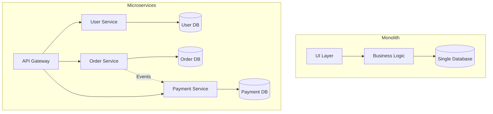
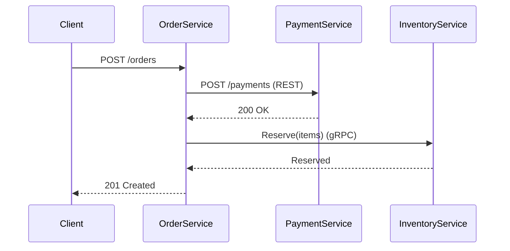
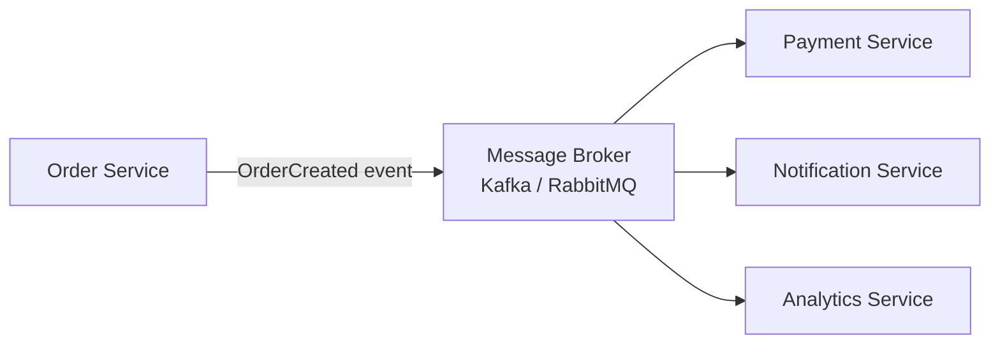
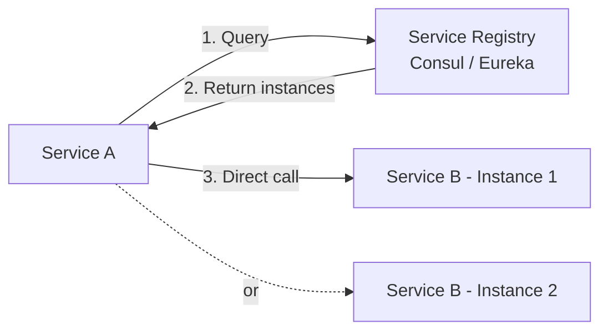
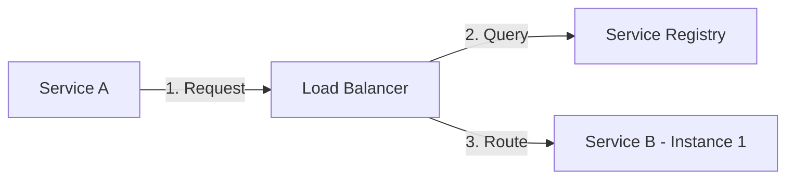
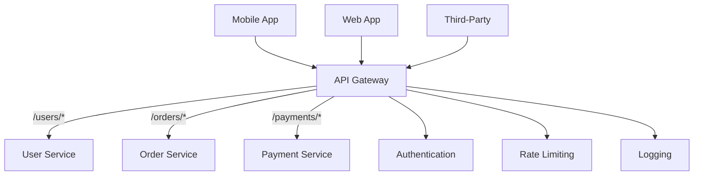
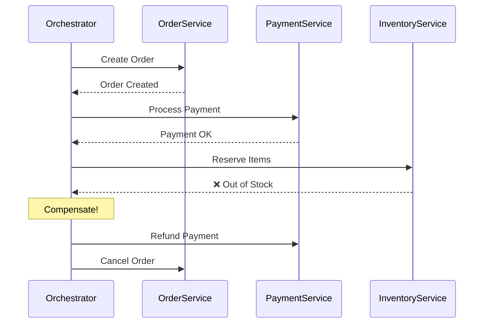

# Microservices Architecture

> **Build systems as a collection of small, independent services.** Microservices decompose a monolithic application into loosely coupled services that can be developed, deployed, and scaled independently by different teams.

---

## 📑 Table of Contents

- [What are Microservices?](#-what-are-microservices)
- [When to Use (and When NOT to)](#-when-to-use-and-when-not-to)
- [Design Principles](#-design-principles)
- [Communication](#-communication)
- [Service Discovery](#-service-discovery)
- [API Gateway Pattern](#-api-gateway-pattern)
- [Data Management](#-data-management)
- [Resilience Patterns](#-resilience-patterns)
- [Observability](#-observability)
- [Deployment](#-deployment)
- [Testing](#-testing)
- [Anti-patterns](#-anti-patterns)
- [Production Tips](#-production-tips)
- [Related Topics](#-related-topics)

---

## 🧠 What are Microservices?

Microservices is an architectural style where an application is composed of small, autonomous services that:
- Own their data and business logic
- Communicate over well-defined APIs
- Can be deployed independently
- Are organized around business capabilities

### Monolith vs Microservices

| Aspect | Monolith | Microservices |
|--------|----------|---------------|
| **Deployment** | Single deployable unit | Each service deployed independently |
| **Scaling** | Scale entire application | Scale individual services |
| **Technology** | Single tech stack | Polyglot (each service can use different tech) |
| **Data** | Single shared database | Database per service |
| **Team structure** | Feature teams work on same codebase | Teams own individual services |
| **Failure isolation** | One bug can crash everything | Failures are contained to service |
| **Complexity** | In the code | In the infrastructure |
| **Development speed** | Fast initially, slows over time | Slower initially, faster long-term |
| **Testing** | Simple (in-process) | Complex (distributed) |
| **Debugging** | Single process, easy | Distributed tracing needed |



---

## ✅ When to Use (and When NOT to)

### Use Microservices When

- Multiple teams need to work independently
- Different parts of the system have different scaling requirements
- You need independent deployment cycles
- You have well-understood domain boundaries
- You need technology diversity (different languages/frameworks per service)
- Failure isolation is critical

### DO NOT Use Microservices When

- You're a small team (< 5-10 engineers)
- Domain boundaries are unclear
- You're building an MVP or prototype
- You don't have infrastructure automation (CI/CD, container orchestration)
- Your application doesn't have clear scaling bottlenecks
- You can't afford the operational complexity

> **Conway's Law:** Organizations design systems that mirror their communication structure. Microservices work best when team boundaries align with service boundaries.

---

## 🎯 Design Principles

### 1. Single Responsibility

Each service does one thing well and owns its domain.

```text
✅ Good service boundaries:
  - User Service: user registration, profiles, authentication
  - Order Service: order creation, status tracking
  - Payment Service: payment processing, refunds

❌ Bad boundaries:
  - UserOrderPaymentService: does everything
  - DataAccessService: generic CRUD for all entities
```

### 2. Decentralized Data Management

Each service owns its data. No shared databases.

```text
✅ Each service has its own database:
  User Service → users_db (PostgreSQL)
  Order Service → orders_db (PostgreSQL)
  Search Service → search_index (Elasticsearch)

❌ Shared database:
  All services → single_monolith_db
```

### 3. API-First Design

Define the API contract before implementing the service.

```text
1. Design the API (OpenAPI spec or protobuf definition)
2. Agree on the contract with consumers
3. Implement the service
4. Test against the contract
```

### 4. Design for Failure

Assume any service call can fail and design accordingly.

```text
Every external call should have:
  - Timeout
  - Retry logic (with backoff)
  - Circuit breaker
  - Fallback response
```

---

## 📡 Communication

### Synchronous Communication



| Protocol | When to Use | Pros | Cons |
|----------|-------------|------|------|
| **REST** | Public APIs, CRUD, simple requests | Universal, cacheable, easy to debug | Higher latency, less efficient |
| **gRPC** | Internal service-to-service, high throughput | Fast, typed contracts, streaming | Harder to debug, needs proxy for browsers |

### Asynchronous Communication



| Pattern | When to Use | Pros | Cons |
|---------|-------------|------|------|
| **Message Queue** | Task processing, load leveling | Decoupled, resilient, buffering | Eventual consistency, complexity |
| **Event Bus** | Fan-out, event notification | Loose coupling, extensible | Ordering challenges |
| **Request-Reply** | Async with response needed | Non-blocking | Correlation tracking needed |

### Sync vs Async

| Aspect | Synchronous | Asynchronous |
|--------|-------------|-------------|
| Latency | Predictable | Variable |
| Coupling | Temporal (caller waits) | Loose (fire and forget) |
| Error handling | Immediate | Delayed (DLQ, retries) |
| Consistency | Easier to reason about | Eventual consistency |
| Scalability | Limited by slowest service | Better (buffering, fan-out) |

→ See [Event-Driven Architecture](event-driven.md) for event patterns in depth

---

## 🔍 Service Discovery

How do services find each other?

### Client-Side Discovery

Client queries a service registry and picks an instance.



### Server-Side Discovery

Load balancer queries the registry and routes the request.



### DNS-Based Discovery

Use DNS to resolve service names to IP addresses.

```text
service-b.namespace.svc.cluster.local → 10.0.1.5, 10.0.1.6

Kubernetes uses this natively with Service resources.
```

| Approach | Pros | Cons | Examples |
|----------|------|------|---------|
| Client-side | Flexible, no proxy overhead | Client complexity | Eureka, Consul |
| Server-side | Simple client, centralized | Extra hop, LB management | AWS ALB, Nginx |
| DNS-based | Simple, universal | Caching delays, no health awareness | Kubernetes DNS, Consul DNS |

---

## 🚪 API Gateway Pattern

Single entry point for all clients, routing requests to appropriate services.



**API Gateway responsibilities:**
- Request routing
- Authentication and authorization
- Rate limiting
- Request/response transformation
- Protocol translation (REST → gRPC)
- Response aggregation (BFF — Backend for Frontend)
- SSL termination
- Caching

**Technologies:** Kong, AWS API Gateway, Envoy, Nginx, Traefik, Spring Cloud Gateway.

---

## 🗄 Data Management

### Database per Service

```text
✅ Each service owns its data:
  User Service → PostgreSQL (users, profiles)
  Order Service → PostgreSQL (orders, line items)
  Product Service → MongoDB (product catalog)
  Search Service → Elasticsearch (search index)

Cross-service data access via APIs, not direct DB queries.
```

### Saga Pattern

Manage distributed transactions across services without 2PC.



### Event Sourcing

Store state changes as a sequence of events instead of current state.

```text
Traditional: UPDATE orders SET status = 'shipped' WHERE id = 123

Event Sourcing:
  Event 1: OrderCreated { id: 123, items: [...] }
  Event 2: PaymentProcessed { id: 123, amount: 99.99 }
  Event 3: OrderShipped { id: 123, tracking: "ABC123" }

Current state = replay all events
```

### CQRS

Separate the read model from the write model.

→ See [Event-Driven Architecture](event-driven.md) for event sourcing and CQRS details
→ See [System Design Fundamentals](../system-design/fundamentals.md) for Saga pattern details

---

## 🛡 Resilience Patterns

### Circuit Breaker

Prevent cascading failures by stopping calls to a failing service.

```text
States:
  CLOSED    → Normal, requests pass through
  OPEN      → Service is down, fail fast
  HALF-OPEN → Test with limited requests

  CLOSED → OPEN:      After 5 failures in 10 seconds
  OPEN → HALF-OPEN:   After 30 second timeout
  HALF-OPEN → CLOSED: After 3 successes
  HALF-OPEN → OPEN:   After any failure
```

```python
# Conceptual circuit breaker
class CircuitBreaker:
    def __init__(self, failure_threshold: int = 5, recovery_timeout: int = 30):
        self.failures = 0
        self.failure_threshold = failure_threshold
        self.recovery_timeout = recovery_timeout
        self.state = "CLOSED"
        self.last_failure_time = None

    def call(self, func, *args, **kwargs):
        if self.state == "OPEN":
            if time.time() - self.last_failure_time > self.recovery_timeout:
                self.state = "HALF_OPEN"
            else:
                raise CircuitOpenError("Circuit is open")

        try:
            result = func(*args, **kwargs)
            self._on_success()
            return result
        except Exception as e:
            self._on_failure()
            raise

    def _on_success(self):
        self.failures = 0
        self.state = "CLOSED"

    def _on_failure(self):
        self.failures += 1
        self.last_failure_time = time.time()
        if self.failures >= self.failure_threshold:
            self.state = "OPEN"
```

### Retry with Backoff

```text
Attempt 1: Immediate
Attempt 2: Wait 1s
Attempt 3: Wait 2s
Attempt 4: Wait 4s + random jitter
Max attempts: 4, then fail
```

### Timeout

Always set timeouts on external calls.

```text
HTTP client timeout: 5s
Database query timeout: 10s
Inter-service call timeout: 3s
```

### Bulkhead

Isolate resources so one failing component doesn't exhaust all resources.

```text
Thread pools per dependency:
  User Service calls: 10 threads
  Order Service calls: 10 threads
  Payment Service calls: 5 threads

If Payment Service is slow, only its 5 threads are affected.
Other services continue to operate normally.
```

### Rate Limiting

Protect services from being overwhelmed.

→ See [API Design](../system-design/api-design.md) for rate limiting algorithms

---

## 📊 Observability

### Distributed Tracing

Track requests as they flow across services.

```text
Request-ID: req_abc123

User Service → [Span 1: 5ms] →
  Order Service → [Span 2: 15ms] →
    Payment Service → [Span 3: 200ms] →
    Inventory Service → [Span 4: 8ms]
Total: 228ms

Traces reveal: Payment Service is the bottleneck.
```

**Tools:** OpenTelemetry, Jaeger, Zipkin, AWS X-Ray.

### Centralized Logging

All services log to a central system with correlation IDs.

```text
Structured log format:
{
  "timestamp": "2026-08-31T12:00:00Z",
  "service": "order-service",
  "level": "INFO",
  "message": "Order created",
  "trace_id": "abc123",
  "order_id": "ORD-456",
  "user_id": "user_789"
}
```

**Tools:** ELK Stack (Elasticsearch, Logstash, Kibana), Loki + Grafana.

### Metrics

Collect and alert on service health metrics.

```text
Key metrics per service:
  - Request rate (RPS)
  - Error rate (5xx)
  - Latency (p50, p95, p99)
  - Saturation (CPU, memory, connections)
```

**RED method:** Rate, Errors, Duration (for request-driven services).
**USE method:** Utilization, Saturation, Errors (for resources).

→ See [Observability](../observability/) for Prometheus, Grafana, and OpenTelemetry

---

## 🚀 Deployment

### Containers and Orchestration

```text
Each microservice:
  → Dockerfile → Container Image → Container Registry
  → Kubernetes Deployment → Pods → Service → Ingress
```

### Service Mesh

Infrastructure layer that handles service-to-service communication.

```text
Service mesh provides (without code changes):
  - mTLS (mutual TLS between services)
  - Traffic management (canary, blue-green)
  - Observability (automatic tracing, metrics)
  - Retry and circuit breaking
  - Rate limiting

Tools: Istio, Linkerd, Consul Connect
```

→ See [Kubernetes](../devops/kubernetes/) for container orchestration
→ See [Docker](../devops/docker/) for containerization

---

## 🧪 Testing

### Testing Pyramid for Microservices

| Level | What | Tools | Speed |
|-------|------|-------|-------|
| **Unit tests** | Service business logic | pytest, Go testing | Fast |
| **Integration tests** | Service + its database/cache | Testcontainers | Medium |
| **Contract tests** | API contracts between services | Pact | Medium |
| **End-to-end tests** | Full user journeys | Selenium, Cypress | Slow |
| **Chaos engineering** | Resilience under failures | Chaos Monkey, Litmus | Slow |

### Contract Testing

Verify that service API contracts remain compatible.

```text
Consumer (Order Service) defines:
  "I expect Payment Service to accept POST /payments
   with body {amount, currency, order_id}
   and return {payment_id, status}"

Provider (Payment Service) verifies:
  "I can handle the requests my consumers expect"
```

---

## ⚠️ Anti-patterns

| Anti-pattern | Description | Fix |
|-------------|-------------|-----|
| **Distributed monolith** | Services tightly coupled, must deploy together | Proper service boundaries, async communication |
| **Shared database** | Multiple services access the same database | Database per service, APIs for data access |
| **Chatty services** | Too many synchronous calls between services | Batch calls, async events, BFF pattern |
| **Service bloat** | Services that are too large | Decompose further along domain boundaries |
| **Nano services** | Services that are too small | Merge related services, avoid one-function services |
| **No API versioning** | Breaking changes without version | Always version APIs, deprecation policies |

---

## 🏭 Production Tips

1. **Start with a monolith** if unsure about domain boundaries — extract services later
2. **Use feature flags** for gradual rollouts and A/B testing
3. **Implement health checks** (liveness + readiness) for every service
4. **Set resource limits** (CPU, memory) for every container
5. **Use structured logging** with trace IDs across all services
6. **Automate everything** — CI/CD, infrastructure as code, database migrations
7. **Monitor the four golden signals**: latency, traffic, errors, saturation
8. **Practice chaos engineering** — inject failures regularly
9. **Document service ownership** — every service has a team and on-call rotation
10. **Keep services small enough to rewrite** — not refactor, rewrite

---

## 🔗 Related Topics

- [Event-Driven Architecture](event-driven.md) — Async communication patterns
- [Clean Architecture](clean-architecture.md) — Internal service structure
- [System Design](../system-design/) — System design fundamentals
- [Scalability](../system-design/scalability.md) — Scaling patterns
- [Load Balancing](../system-design/load-balancing.md) — Service traffic distribution
- [API Design](../system-design/api-design.md) — REST, gRPC, API gateway
- [Caching](../system-design/caching.md) — Per-service caching strategies
- [Kubernetes](../devops/kubernetes/) — Container orchestration
- [Docker](../devops/docker/) — Containerization
- [Observability](../observability/) — Distributed tracing, metrics, logging
- [Distributed Systems](../distributed-systems/) — Consensus, partitioning

---

> **Microservices are an organizational pattern as much as a technical one.** They work best when team boundaries, service boundaries, and domain boundaries are aligned. The technical complexity of microservices is the price you pay for organizational scalability. Make sure you need that scalability before paying that price.
