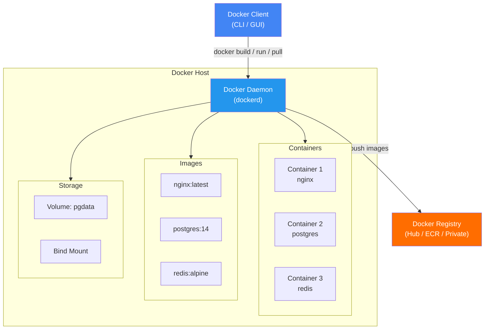
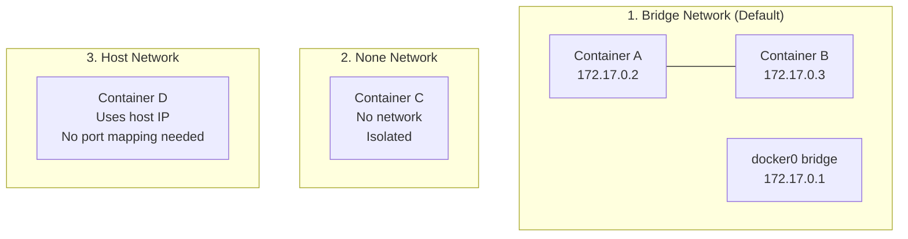

# 🐳 Docker — Comprehensive Reference

> **Build, ship, and run containers.** From images and containers to networking, storage, Compose, and production best practices — the complete Docker CLI reference.

---

## 📑 Table of Contents

- [Concepts & Terminology](#-concepts--terminology)
- [Architecture](#-architecture)
- [Images](#-images)
- [Containers — Lifecycle](#-containers--lifecycle)
- [Executing Commands in Containers](#-executing-commands-in-containers)
- [Logs & Inspection](#-logs--inspection)
- [Port Mapping & Networking](#-port-mapping--networking)
- [Volumes & Storage](#-volumes--storage)
- [Environment Variables](#-environment-variables)
- [Building Images — Dockerfile](#-building-images--dockerfile)
- [CMD vs ENTRYPOINT](#-cmd-vs-entrypoint)
- [Copying Files](#-copying-files)
- [Docker Compose](#-docker-compose)
- [System Management & Cleanup](#-system-management--cleanup)
- [Image Import/Export](#-image-importexport)
- [Troubleshooting](#-troubleshooting)
- [Production Tips](#-production-tips)
- [Related Topics](#-related-topics)

---

## 💡 Concepts & Terminology

| Term | Description |
|------|-------------|
| **Image** | The blueprint of an application — a read-only template that forms the basis of containers. Downloaded with `docker pull`. |
| **Container** | A running instance created from a Docker image. Containers run the actual application. A container only lives as long as the process inside it is alive. |
| **Docker Daemon** | Background service running on the host that manages building, running, and distributing Docker containers. The process that clients talk to. |
| **Docker Client** | The CLI tool (`docker`) that allows users to interact with the daemon. GUIs like Docker Desktop also act as clients. |
| **Docker Hub** | Public registry of Docker images. You can host your own private registries and pull images from them. |
| **Dockerfile** | A text file with instructions to build a Docker image. Composed of **Instructions** (left side, CAPS: `FROM`, `RUN`, `COPY`, etc.) and **Arguments** (their values). |
| **Registry** | A directory/store of Docker images (Docker Hub, ECR, GCR, Harbor, etc.) |

### Key Principles

- **Containers are NOT meant to host an OS.** They are meant to run a specific task or process — a web server, database, analytics job, etc.
- **Once the task completes, the container exits.** A container only lives as long as the process inside it is alive.
- **Each container has its own filesystem.** Any changes to files happen within the container (unless using volumes).
- **Docker can containerize anything** — not just web apps. Browsers, Spotify, curl, development tools — anything.

---

## 🏗️ Architecture



---


## 🖼️ Images

### Pulling Images

```bash
docker pull nginx                   # Pull latest from Docker Hub
docker pull redis:4.0               # Pull specific version/tag
docker pull busybox                 # Lightweight Linux with shell commands
```

> If `docker run` is used and the image is not found locally, Docker automatically pulls it from Docker Hub.

### Listing Images

```bash
docker images                       # List all local images
docker images -q                    # Only image IDs
```

**Example output:**

```
$ docker images
REPOSITORY          TAG       IMAGE ID       CREATED        SIZE
nginx               latest    a6bd71f48f68   2 days ago     187MB
redis               alpine    3900abf41552   5 days ago     37.8MB
postgres            14        1ea2be1a6338   1 week ago     379MB 
```

### Image History

Shows the layered build architecture — each instruction in a Dockerfile creates a new layer with its own ID and size.

```bash
docker history nginx
docker history new_myansible
```

**Example output:**

```bash
$ docker history new_myansible
IMAGE               CREATED       CREATED BY                                      SIZE      COMMENT
a0967c827609        2 days ago    /bin/bash                                       1.52kB    test image
bf74bd9701cb        2 days ago    /bin/bash                                       983B
c0814b11c786        2 weeks ago   /bin/sh -c pip3 install paramiko && pip3...     78.9MB
86ce23341144        2 weeks ago   /bin/sh -c apt-get update && apt-get -y inst…   120MB
d44ab0648e76        2 weeks ago   /bin/sh -c pip3 install ansible==2.9.9 &…      152MB
fa38a11831cb        2 weeks ago   /bin/sh -c apt-get update && apt-get ins…       57.6MB
```

### Removing Images

```bash
docker rmi nginx                    # Remove image by name
docker rmi <image-id>               # Remove image by ID
docker rmi $(docker images -q)      # Remove all images
```

---

## 🚀 Containers — Lifecycle

### Running Containers

```bash
# Basic run
docker run nginx                    # Run (pulls if not present)
docker run redis:4.0                # Run specific version

# Run with a command
docker run busybox ls               # Run and execute ls
docker run busybox echo "hello"     # Run and echo

# Detached mode (background)
docker run -d nginx                 # Run in background
docker run -d -P --name static-site amolpratap1995/static-site
#   -d    Detach terminal (run in background)
#   -P    Publish all exposed ports to random host ports
#   --name  Give container a custom name

# Interactive mode
docker run -it mongo bash           # Interactive terminal with bash
docker run -it ubuntu /bin/bash     # Interactive shell
#   -i    Interactive mode (keep STDIN open)
#   -t    Allocate a pseudo-TTY terminal

# Auto-remove on exit
docker run --rm nginx               # Container removed after it stops
```

### Listing Containers

```bash
docker ps                           # Running containers only
docker ps -a                        # All containers (running + stopped)
docker ps --all                     # Same as -a
docker container ls                 # Alternative syntax
```

**Example output:**

```bash
$ docker ps -a
CONTAINER ID   IMAGE         COMMAND                  CREATED          STATUS                    PORTS        NAMES
ec046efb54f3   mongo         "docker-entrypoint.s…"   1 minute ago     Up About a minute         27017/tcp    epic_noyce
1022a388fada   mongo         "docker-entrypoint.s…"   2 minutes ago    Up 2 minutes              27017/tcp    angry_haibt
99df4c1af77c   busybox       "ls"                     11 hours ago     Exited (0) 11 hours ago                frosty_roentgen
1a049e943ed1   hello-world   "/hello"                 12 hours ago     Exited (0) 12 hours ago                hungry_wozniak
```

### Start, Stop, and Remove

```bash
# Start a stopped container
docker start <container-id>         # Returns container ID
docker start ec046efb54f3

# Stop containers
docker stop <container-id>          # Graceful stop (SIGTERM, then SIGKILL)
docker kill <container-id>          # Immediate stop (SIGKILL)

# Remove containers
docker rm <container-id>            # Remove a stopped container
docker rm 305297d7a235

# Remove all exited containers
docker rm $(docker ps -a -q -f status=exited)
#   -q    Only return numeric IDs
#   -f    Filter output based on conditions

# Remove all stopped containers
docker container prune

# Remove all containers, networks, and dangling images
docker system prune
```

> **Tip:** Running `docker run` many times leaves stray containers that eat up disk space. Clean up containers once you're done with them.

### Exiting Containers

| Action | Effect |
|--------|--------|
| `Ctrl+D` or type `exit` | Exit and stop the container |
| `Ctrl+P` then `Ctrl+Q` | Detach — exit shell but keep container running in background |

---

## 💻 Executing Commands in Containers

```bash
# Run a command in a running container
docker exec <container> <command>
docker exec epic_noyce cat /etc/hosts
```

**Example output:**

```bash
$ docker exec ea45a0555a42 cat /etc/hosts
127.0.0.1         localhost
::1	              localhost ip6-localhost ip6-loopback
fe00::	          ip6-localnet
172.17.0.2	      ea45a0555a42
```

```bash
# Get an interactive shell inside a running container
docker exec -it <container-id> bash
docker exec -it ea45a0555a42 bash
docker exec -it <container-id> sh       # Use sh if bash is unavailable
docker exec -it <container-id> zsh      # Or zsh, powershell, etc.

# Alternative: start a new container with interactive shell
docker run -it mongo bash
docker run -it centos:latest /bin/bash
```

---

## 📋 Logs & Inspection

### Container Logs

```bash
docker logs <container-id>          # View logs
docker logs ec046efb54f3
docker logs -f <container>          # Follow logs (live stream)
docker logs --tail 100 <container>  # Last 100 lines
docker logs --since 1h <container>  # Logs from last hour
```

### Inspect (Detailed JSON Info)

Returns full container details in JSON format — state, config, network, mounts, environment variables, and more.

```bash
docker inspect <container-id>
docker inspect ea45a0555a42
```

**Example output:**

```json
[
  {
    "Id": "ea45a0555a42893a2ff84a55db8c3a03d6d4fb385e282a671c1495e986a872cb",
    "Created": "2025-12-31T09:00:37.619666009Z",
    "Path": "/bin/bash",
    "State": {
        "Status": "running",
        "Running": true,
        "Paused": false,
        "Restarting": false,
        "OOMKilled": false,
        "Dead": false,
        "Pid": 673,
        "ExitCode": 0,
        "Error": "",
        "StartedAt": "2026-09-05T07:48:59.674446254Z",
        "FinishedAt": "2026-09-05T07:16:27.596416877Z"
    }
  }
]
```

> **Tip:** To find environment variables used by a container, check the `Config` key in `docker inspect` output.

### Port Mapping Info

```bash
docker port <container-name>        # Show port mappings
docker port postgresdb
```

**Example output:**

```bash
docker port postgresdb
5432/tcp -> 0.0.0.0:5432
5432/tcp -> [::]:5432
```

### Resource Usage

```bash
docker stats                        # Live resource usage for all containers
docker stats <container>            # Specific container
```

---

## 🌐 Port Mapping & Networking

### Port Mapping

```bash
# Map specific host port to container port
docker run -p <host_port>:<container_port> <image>
docker run -p 8080:8000 amolpratap/nodeapp
docker run -p 8888:80 amolpratap1995/static-site

# Publish all exposed ports to random host ports
docker run -d -P <image>
```

### Docker Networks

When Docker is installed, it automatically creates three networks:



| Network | Command | Description |
|---------|---------|-------------|
| **Bridge** | `docker run ubuntu` | Default network. Private internal network on host. Containers get IPs in 172.17.x.x range. |
| **None** | `docker run ubuntu --network=none` | No network. Container is completely isolated. No one can access it. |
| **Host** | `docker run ubuntu --network=host` | Container shares host's network directly. No port mapping needed. Same port cannot be reused by other containers. |

### Network Management

```bash
# List all networks
docker network ls

# Create a custom network
docker network create --driver bridge --subnet 182.18.0.0/16 custom-isolated-network

# Run container on custom network
docker run --network=custom-isolated-network nginx

# Inspect network
docker network inspect bridge
```

### Docker Embedded DNS

Docker has a built-in DNS server that allows containers to resolve each other by name.

```
┌─────────────────────────────────┐
│         Docker Host             │
│                                 │
│  ┌──────────┐    ┌──────────┐   │
│  │ web-app  │    │ database │   │
│  │172.17.0.2│    │172.17.0.3│   │
│  └────┬─────┘    └────┬─────┘   │
│       │               │         │
│       └────  DNS  ────┘         │
│    (resolves by container name) │
│                                 │
│  DNS Server: 127.0.0.11         │
└─────────────────────────────────┘
```

> **Note:** Containers can reach each other using their names. Docker's built-in DNS server always runs at `127.0.0.11` inside containers. System DNS runs at `127.0.0.1`.

### Linking Containers (Legacy)

```bash
# Link containers by name (deprecated — use networks instead)
docker run -d --name=redis redis
docker run -d --name=vote -p 5000:80 --link redis:redis voting-app
docker run -d --name=result -p 5001:80 --link db:db result-app
docker run -d --name=worker --link db:db --link redis:redis worker
```

---

## 💾 Volumes & Storage

### Docker File System

Docker stores all data at `/var/lib/docker/`:
```
/var/lib/docker/
├── aufs/           # Storage driver layers
├── containers/     # Container-specific data
├── image/          # Image layers and metadata
└── volumes/        # Named volumes
```

### Docker Layered Architecture

When Docker builds images, it uses a **layered architecture**. Each instruction in a Dockerfile creates a new layer. Layers are cached and reused across images for efficiency.

### Volume Mounting

```bash
# Named volume
docker run -v pgdata:/var/lib/postgresql/data postgres

# Bind mount — map host directory to container directory
docker run -it -v "/sify/playbook:/ansi" sify_custom_ansible /bin/bash
docker run -it -v "/etc/ansible/project:/data/playbook" new_myansible /bin/bash
docker run -it -v "/sify/discon_playbook:/discon_playbook" sify_custom_ansible /bin/bash

# With host networking and volume
docker run -it --net=host -v "/sify/playbook:/ansi" sify_custom_ansible /bin/bash

# Modern syntax (--mount)
docker run --mount type=bind,source=/host/path,target=/container/path nginx

docker run --mount type=volume,source=mydata,target=/data nginx
```

| Mount Type | Syntax | Use Case |
|-----------|--------|----------|
| **Volume** | `-v name:/path` | Persistent data (databases, uploads) |
| **Bind Mount** | `-v /host/path:/container/path` | Development, sharing config |
| **tmpfs** | `--tmpfs /path` | Temporary in-memory storage |

---

## 🔑 Environment Variables

```bash
# Pass environment variables
docker run -e APP_COLOR=green simplewebapp
docker run -e DB_HOST=localhost -e DB_PORT=5432 myapp

# Multiple environment variables
docker run -e VAR1=val1 -e VAR2=val2 myapp

# Environment file
docker run --env-file .env myapp
```

> **Tip:** To find environment variables used by a running container, check the `Config` section in `docker inspect` output.

---

## 🏗️ Building Images — Dockerfile

### Steps to Containerize an Application

1. Create a `Dockerfile` with build instructions
2. Build the image with `docker build`
3. Run the container with `docker run`
4. (Optional) Push to a registry with `docker push`

### Build Commands

```bash
# Build from current directory
docker build .

# Build with name and tag
docker build -t username/imagename:tag .
docker build -t amolpratap/mymongo:latest .
docker build -t amolpratap/mysqlversion:v1 .

# Build with no cache (clean build)
docker build --no-cache -t myapp:latest .

# Build with secrets (BuildKit)
docker build --no-cache \
  --secret id=gerrit_username,src=/home/user/secrets/gerrit_username.txt \
  --secret id=gerrit_password,src=/home/user/secrets/gerrit_password.txt \
  --progress=plain \
  -f dockers/my-service/Dockerfile.dev.debug .

# Run the built image
docker run amolpratap/mymongo
docker run -p 8000:8000 amolpratap/nodeapp
```

### Dockerfile Example (Node.js)

Steps to containerize a Node app:
1. Bring base image (Ubuntu, Debian, or Node itself)
2. Create a working directory
3. Bring all files
4. Run installer
5. Default command

```dockerfile
FROM node:18-alpine
WORKDIR /app
COPY package*.json ./
RUN npm install
COPY . .
EXPOSE 8000
CMD ["npm", "start"]
```

### Push to Registry

```bash
docker push new_myansible           # Push to Docker Hub
docker push username/imagename:tag  # Push tagged image
# Verify on Docker Hub after execution
```

### Commit a Running Container as New Image

```bash
docker commit <container-id> <new-image-name>:<tag>
docker commit 583d08e8dd4b test:latest
docker commit -m="This is a test image" centos_test new_centos_image
```

**Example workflow:**
```bash
# Start a container, make changes, save as new image
docker run -it --name="centos_test" centos:latest /bin/bash
# Inside container:
mkdir test_dir && echo "Sample text" > test_dir/test_file
# Exit, then commit:
docker commit -m="This a test image" centos_test new_centos_image
# sha256:93603e53ff5329b314da097e3e5607b60cd1ce126f48cae542c083c715f069f7
```

---

## ⚡ CMD vs ENTRYPOINT

This is a critical Dockerfile concept that affects how containers start.

| Aspect | CMD | ENTRYPOINT |
|--------|-----|------------|
| **Purpose** | Default command/arguments | Main executable |
| **Override** | Completely replaced by `docker run` args | Args appended to it |
| **Syntax** | `CMD ["sleep", "5"]` | `ENTRYPOINT ["sleep"]` |

### CMD — Default Command (Replaceable)

```dockerfile
CMD ["sleep", "5"]
# or
CMD sleep 5
```

```bash
docker run ubuntu-sleeper           # Runs: sleep 5
docker run ubuntu-sleeper sleep 10  # Runs: sleep 10 (CMD fully replaced)
```

### ENTRYPOINT — Fixed Command (Appendable)

```dockerfile
ENTRYPOINT ["sleep"]
```

```bash
docker run ubuntu-sleeper 10        # Runs: sleep 10 (10 appended)
docker run ubuntu-sleeper           # ERROR: missing operand (no default)
```

### Best Practice — Combine Both

```dockerfile
ENTRYPOINT ["sleep"]
CMD ["5"]
```

```bash
docker run ubuntu-sleeper           # Runs: sleep 5 (CMD provides default)
docker run ubuntu-sleeper 10        # Runs: sleep 10 (CMD overridden)
```

### Override ENTRYPOINT at Runtime

```bash
docker run --entrypoint sleep2.0 ubuntu-sleeper 10
# Runs: sleep2.0 10 (ENTRYPOINT replaced)
```

---

## 📋 Copying Files

```bash
# Copy from host to container
docker cp <host-file-or-dir> <container>:/path/in/container
docker cp /ntc-templates ec046efb54f3:/etc/ansible/

# Copy from container to host
docker cp <container>:<container-path> /host/path
docker cp ec046efb54f3:/etc/ansible/ansible.cfg /tmp/
```

---

## 🎼 Docker Compose

If you need to set up a complex application running multiple services, Docker Compose provides a better way. Define all services in a single YAML file and manage them together.

### Without Compose (Individual Runs)

```bash
docker run -d --name=redis redis
docker run -d --name=db postgres:9.4
docker run -d --name=vote -p 5000:80 --link redis:redis voting-app
docker run -d --name=result -p 5001:80 --link db:db result-app
docker run -d --name=worker --link db:db --link redis:redis worker
```

### With Compose — Version 1

```yaml
# docker-compose.yml (version 1 - simplified)
redis:
  image: redis
db:
  image: postgres:9.4
vote:
  image: voting-app
  ports:
    - 5000:80
  links:
    - redis
result:
  image: result-app
  ports:
    - 5001:80
  links:
    - db
worker:
  image: worker
  links:
    - db
    - redis
```

### With Compose — Version 2+

Version 2 introduced the `services:` section and automatic networking (no more `links` needed):

```yaml
# docker-compose.yml (version 2+)
version: "2"
services:
  redis:
    image: redis
  db:
    image: postgres:9.4
  vote:
    image: voting-app
    ports:
      - 5000:80
  result:
    image: result-app
    ports:
      - 5001:80
  worker:
    image: worker
```

### Compose Commands

```bash
docker compose up                   # Bring up the entire stack
docker compose up -d                # Detached mode
docker compose down                 # Stop and remove everything
docker compose ps                   # List running services
docker compose logs -f              # Follow all service logs
docker compose build                # Build/rebuild services
docker compose version              # Check compose version
```

> **Note:** Docker Compose is applicable for running containers on a single Docker host. For multi-host orchestration, use Docker Swarm or Kubernetes.

---

## 🧹 System Management & Cleanup

### Check Docker Usage

```bash
docker system df
```

**Example output:**
```
TYPE            TOTAL     ACTIVE    SIZE      RECLAIMABLE
Images          1         1         1.951GB   0B (0%)
Containers      1         1         102.9MB   0B (0%)
Local Volumes   1         1         0B        0B
Build Cache     52        0         13.77GB   13.77GB
```

### Build Cache

The build cache is stored by BuildKit at `/var/lib/docker/buildkit/`. Each cached layer speeds up subsequent builds.

```bash
# Remove build cache only
docker builder prune -f

# Remove unused cache older than 24 hours
docker builder prune --filter "until=24h" -f
```

### Cleanup Commands

```bash
# Remove stopped containers
docker container prune

# Remove unused images
docker image prune               # Dangling images only
docker image prune -a            # All unused images

# Remove unused volumes
docker volume prune

# Remove everything unused (containers, networks, images, cache)
docker system prune

# Nuclear option — everything including volumes
docker system prune -a --volumes -f
```

| Command | What It Removes |
|---------|----------------|
| `docker container prune` | Stopped containers |
| `docker image prune` | Dangling images |
| `docker image prune -a` | All unused images |
| `docker volume prune` | Unused volumes |
| `docker builder prune` | Build cache |
| `docker system prune` | Containers + networks + dangling images |
| `docker system prune -a --volumes` | Everything unused |

---

## 📦 Image Import/Export

```bash
# Save image to tar file
docker save -o myansible.tar myansible

# Load image from tar file
docker load < sify_custom_ansible.tar

# Import from tar (creates new image)
docker import sify_custom_ansible.tar sify_custom_ansible:latest
```

| Command | Use Case |
|---------|----------|
| `docker save` / `docker load` | Full image with layers and metadata |
| `docker export` / `docker import` | Container filesystem as flat archive |

---

## 🐛 Troubleshooting

### Container Won't Start

```bash
# Check container logs for errors
docker logs <container>

# Inspect container state
docker inspect <container> | jq '.[0].State'

# Check if port is already in use
docker ps -a | grep <port>
ss -tlnp | grep <port>
```

### Common Issues

| Problem | Diagnosis | Solution |
|---------|-----------|----------|
| Container exits immediately | Process completes/crashes | Check logs: `docker logs <id>`. Ensure CMD runs a long-lived process |
| Port already in use | Another container/process using port | `docker ps` to find conflict, stop or remap |
| Image not found | Typo or not pulled | `docker pull <image>` first |
| Permission denied | Docker socket access | Add user to docker group: `sudo usermod -aG docker $USER` |
| Disk space full | Accumulated images/containers | `docker system prune -a` |
| Build cache too large | BuildKit caching | `docker builder prune -f` |
| Network connectivity | DNS or network misconfiguration | Check `docker network inspect`, verify DNS |
| "No space left on device" | Docker storage full | `docker system df` to diagnose, prune unused resources |

### Debugging a Running Container

```bash
# Shell into container
docker exec -it <container> bash
docker exec -it <container> sh

# Check processes inside container
docker exec <container> ps aux

# Check network inside container
docker exec <container> cat /etc/hosts
docker exec <container> cat /etc/resolv.conf

# Check resource usage
docker stats <container>
```

---

## 🏭 Production Tips

### Image Best Practices

- **Use specific tags** — never use `:latest` in production (`redis:7.2-alpine`, not `redis:latest`)
- **Use small base images** — prefer `alpine` variants to reduce attack surface and size
- **Multi-stage builds** — separate build and runtime stages to keep images small
- **Order Dockerfile instructions** — put least-changing layers first (maximize cache hits)
- **One process per container** — follow the single-responsibility principle
- **Don't store data in containers** — use volumes for persistent data

### Security

- **Don't run as root** — add `USER nonroot` in Dockerfile
- **Use read-only filesystem** — `docker run --read-only`
- **Scan images** — use `docker scout` or Trivy for vulnerability scanning
- **Don't store secrets in images** — use Docker secrets or mount at runtime
- **Use BuildKit secrets** for build-time credentials (never `ARG` for secrets)

### Resource Limits

```bash
# Memory limits
docker run -m 512m nginx
docker run --memory=1g --memory-swap=2g nginx

# CPU limits
docker run --cpus=0.5 nginx
docker run --cpu-shares=512 nginx
```

### Logging

```bash
# Default log driver
docker info | grep "Logging Driver"

# Set log options
docker run --log-driver json-file \
  --log-opt max-size=10m \
  --log-opt max-file=3 nginx
```

### Health Checks

```dockerfile
HEALTHCHECK --interval=30s --timeout=10s --retries=3 \
  CMD curl -f http://localhost:8080/health || exit 1
```

---

## 🔗 Related Topics

- [🧰 CLI Command Center](../) — All CLI tool references
- [🚀 DevOps — Docker](../../devops/docker/) — Docker in DevOps workflows
- [🐛 Troubleshooting — Docker](../../troubleshooting/docker/) — Docker debugging guides
- [kubectl](../kubectl/) — Kubernetes container orchestration
- [Helm](../helm/) — Kubernetes package management
- [🔐 Security](../../security/) — Container security, image scanning

---

### 📚 Learning Resources

- [Docker Official Documentation](https://docs.docker.com/)
- [Docker Labs (Collabnix)](https://dockerlabs.collabnix.com/)
- [Dockerfile Best Practices](https://docs.docker.com/develop/develop-images/dockerfile_best-practices/)

---

> **Remember:** Containers are ephemeral by design. Always use volumes for data that must persist, and always clean up unused resources to prevent disk bloat.
