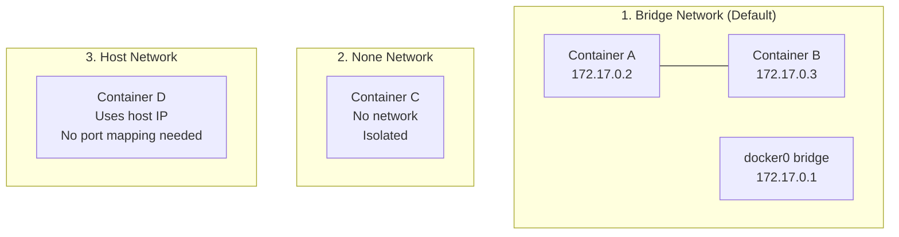

# 🐳 Docker — Comprehensive Reference

> **Build, ship, and run containers.** From images and containers to networking, storage, Compose, and production best practices — the complete Docker CLI reference.

---

## 🖼️ Images

### Pulling Images

```bash
docker pull nginx                   # Pull latest from Docker Hub
docker pull redis:4.0               # Pull specific version/tag
docker pull busybox                 # Lightweight Linux with shell commands
```

> If `docker run` is used and the image is not found locally, Docker automatically pulls it from Docker Hub.

### Listing Images

```bash
docker images                       # List all local images
docker images -q                    # Only image IDs
```

**Example output:**

```
$ docker images
REPOSITORY          TAG       IMAGE ID       CREATED        SIZE
nginx               latest    a6bd71f48f68   2 days ago     187MB
redis               alpine    3900abf41552   5 days ago     37.8MB
postgres            14        1ea2be1a6338   1 week ago     379MB 
```

### Image History

Shows the layered build architecture — each instruction in a Dockerfile creates a new layer with its own ID and size.

```bash
docker history nginx
docker history new_myansible
```

**Example output:**

```bash
$ docker history new_myansible
IMAGE               CREATED       CREATED BY                                      SIZE      COMMENT
a0967c827609        2 days ago    /bin/bash                                       1.52kB    test image
bf74bd9701cb        2 days ago    /bin/bash                                       983B
c0814b11c786        2 weeks ago   /bin/sh -c pip3 install paramiko && pip3...     78.9MB
86ce23341144        2 weeks ago   /bin/sh -c apt-get update && apt-get -y inst…   120MB
d44ab0648e76        2 weeks ago   /bin/sh -c pip3 install ansible==2.9.9 &…      152MB
fa38a11831cb        2 weeks ago   /bin/sh -c apt-get update && apt-get ins…       57.6MB
```

### Removing Images

```bash
docker rmi nginx                    # Remove image by name
docker rmi <image-id>               # Remove image by ID
docker rmi $(docker images -q)      # Remove all images
```

---

## 🚀 Containers — Lifecycle

### Running Containers

```bash
# Basic run
docker run nginx                    # Run (pulls if not present)
docker run redis:4.0                # Run specific version

# Run with a command
docker run busybox ls               # Run and execute ls
docker run busybox echo "hello"     # Run and echo

# Detached mode (background)
docker run -d nginx                 # Run in background
docker run -d -P --name static-site amolpratap1995/static-site
#   -d    Detach terminal (run in background)
#   -P    Publish all exposed ports to random host ports
#   --name  Give container a custom name

# Interactive mode
docker run -it mongo bash           # Interactive terminal with bash
docker run -it ubuntu /bin/bash     # Interactive shell
#   -i    Interactive mode (keep STDIN open)
#   -t    Allocate a pseudo-TTY terminal

# Auto-remove on exit
docker run --rm nginx               # Container removed after it stops
```

### Listing Containers

```bash
docker ps                           # Running containers only
docker ps -a                        # All containers (running + stopped)
docker ps --all                     # Same as -a
docker container ls                 # Alternative syntax
```

**Example output:**

```bash
$ docker ps -a
CONTAINER ID   IMAGE     COMMAND                  CREATED          STATUS                    PORTS        NAMES
ec046efb54f3   mongo     "docker-entrypoint.s…"   1 minute ago     Up About a minute         27017/tcp    epic_noyce
1022a388fada   mongo     "docker-entrypoint.s…"   2 minutes ago    Up 2 minutes              27017/tcp    angry_haibt
99df4c1af77c   busybox   "ls"                     11 hours ago     Exited (0) 11 hours ago                frosty_roentgen
1a049e943ed1   hello-world "/hello"               12 hours ago     Exited (0) 12 hours ago                hungry_wozniak
```

### Start, Stop, and Remove

```bash
# Start a stopped container
docker start <container-id>         # Returns container ID
docker start ec046efb54f3

# Stop containers
docker stop <container-id>          # Graceful stop (SIGTERM, then SIGKILL)
docker kill <container-id>          # Immediate stop (SIGKILL)

# Remove containers
docker rm <container-id>            # Remove a stopped container
docker rm 305297d7a235

# Remove all exited containers
docker rm $(docker ps -a -q -f status=exited)
#   -q    Only return numeric IDs
#   -f    Filter output based on conditions

# Remove all stopped containers
docker container prune

# Remove all containers, networks, and dangling images
docker system prune
```

> **Tip:** Running `docker run` many times leaves stray containers that eat up disk space. Clean up containers once you're done with them.

### Exiting Containers

| Action | Effect |
|--------|--------|
| `Ctrl+D` or type `exit` | Exit and stop the container |
| `Ctrl+P` then `Ctrl+Q` | Detach — exit shell but keep container running in background |

---

## 💻 Executing Commands in Containers

```bash
# Run a command in a running container
docker exec <container> <command>
docker exec epic_noyce cat /etc/hosts
```

**Example output:**

```bash
$ docker exec ea45a0555a42 cat /etc/hosts
127.0.0.1         localhost
::1	              localhost ip6-localhost ip6-loopback
fe00::	          ip6-localnet
172.17.0.2	      ea45a0555a42
```

```bash
# Get an interactive shell inside a running container
docker exec -it <container-id> bash
docker exec -it ea45a0555a42 bash
docker exec -it <container-id> sh       # Use sh if bash is unavailable
docker exec -it <container-id> zsh      # Or zsh, powershell, etc.

# Alternative: start a new container with interactive shell
docker run -it mongo bash
docker run -it centos:latest /bin/bash
```

---

## 📋 Logs & Inspection

### Container Logs

```bash
docker logs <container-id>          # View logs
docker logs ec046efb54f3
docker logs -f <container>          # Follow logs (live stream)
docker logs --tail 100 <container>  # Last 100 lines
docker logs --since 1h <container>  # Logs from last hour
```

### Inspect (Detailed JSON Info)

Returns full container details in JSON format — state, config, network, mounts, environment variables, and more.

```bash
docker inspect <container-id>
docker inspect ea45a0555a42
```

**Example output:**

```json
[
  {
    "Id": "ea45a0555a42893a2ff84a55db8c3a03d6d4fb385e282a671c1495e986a872cb",
    "Created": "2025-12-31T09:00:37.619666009Z",
    "Path": "/bin/bash",
    "State": {
        "Status": "running",
            "Running": true,
            "Paused": false,
            "Restarting": false,
            "OOMKilled": false,
            "Dead": false,
            "Pid": 673,
            "ExitCode": 0,
            "Error": "",
            "StartedAt": "2026-09-05T07:48:59.674446254Z",
            "FinishedAt": "2026-09-05T07:16:27.596416877Z"
        }
  }
]
```

> **Tip:** To find environment variables used by a container, check the `Config` key in `docker inspect` output.

### Port Mapping Info

```bash
docker port <container-name>        # Show port mappings
docker port postgresdb
```

**Example output:**

```bash
docker port postgresdb
5432/tcp -> 0.0.0.0:5432
5432/tcp -> [::]:5432
```

### Resource Usage

```bash
docker stats                        # Live resource usage for all containers
docker stats <container>            # Specific container
```

---

## 🌐 Port Mapping & Networking

### Port Mapping

```bash
# Map specific host port to container port
docker run -p <host_port>:<container_port> <image>
docker run -p 8080:8000 amolpratap/nodeapp
docker run -p 8888:80 amolpratap1995/static-site

# Publish all exposed ports to random host ports
docker run -d -P <image>
```

### Docker Networks

When Docker is installed, it automatically creates three networks:



| Network | Command | Description |
|---------|---------|-------------|
| **Bridge** | `docker run ubuntu` | Default network. Private internal network on host. Containers get IPs in 172.17.x.x range. |
| **None** | `docker run ubuntu --network=none` | No network. Container is completely isolated. No one can access it. |
| **Host** | `docker run ubuntu --network=host` | Container shares host's network directly. No port mapping needed. Same port cannot be reused by other containers. |

### Network Management

```bash
# List all networks
docker network ls
