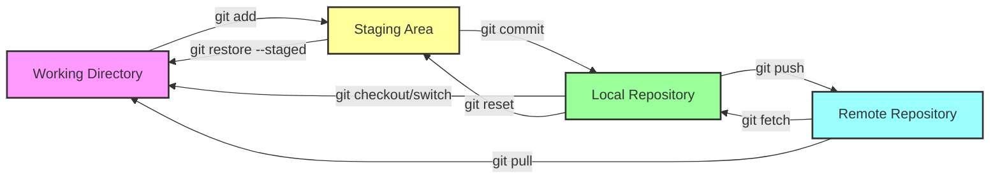
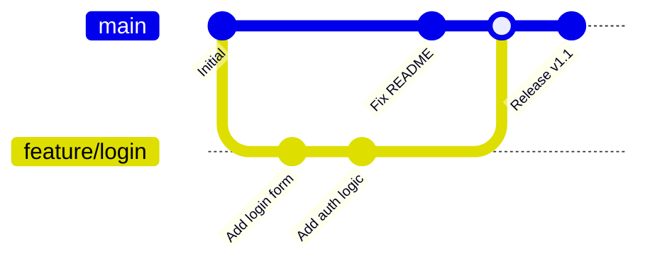

# 🔀 Git — Comprehensive Reference

> **Distributed version control for every developer.** From daily commits to advanced history surgery — everything you need to manage code confidently.

---

## 📑 Table of Contents

- [Concepts](#-concepts)
- [Setup & Configuration](#-setup--configuration)
- [Daily Workflow](#-daily-workflow)
- [Branching](#-branching)
- [History & Diffs](#-history--diffs)
- [Stashing](#-stashing)
- [Rebasing](#-rebasing)
- [Undoing Changes](#-undoing-changes)
- [Remote Operations](#-remote-operations)
- [Tags](#-tags)
- [Advanced](#-advanced)
- [Troubleshooting](#-troubleshooting)
- [Production Tips](#-production-tips)
- [Related Topics](#-related-topics)

---

## 💡 Concepts

Git is a **distributed version control system** where every clone is a full repository with complete history. Key concepts:

| Concept | Description |
|---------|-------------|
| **Working Directory** | Files on disk you are currently editing |
| **Staging Area (Index)** | Snapshot of changes prepared for next commit |
| **Local Repository** | Full history stored in `.git/` |
| **Remote Repository** | Shared repository (GitHub, GitLab, etc.) |
| **HEAD** | Pointer to the current commit/branch |
| **Branch** | Lightweight movable pointer to a commit |
| **Tag** | Fixed pointer to a specific commit (release marker) |
| **Commit** | Immutable snapshot of staged changes with metadata |

### Git Workflow Diagram



### Three-Tree Architecture

```
Working Directory    Staging Area (Index)    HEAD (Repository)
     ├── file.txt         ├── file.txt           ├── file.txt
     ├── new.txt          └── ...                 └── ...
     └── ...
          │                    │                       │
          └── git add ────────►│                       │
                               └── git commit ────────►│
```

---

## ⚙️ Setup & Configuration

### Initial Configuration

```bash
# Identity (required for commits)
git config --global user.name "Your Name"
git config --global user.email "you@example.com"

# Default branch name
git config --global init.defaultBranch main

# Editor
git config --global core.editor "vim"

# Useful aliases
git config --global alias.co checkout
git config --global alias.br branch
git config --global alias.ci commit
git config --global alias.st status
git config --global alias.lg "log --oneline --graph --decorate --all"

# Auto-setup remote tracking
git config --global push.autoSetupRemote true
```

### Configuration Levels

| Level | Flag | File | Scope |
|-------|------|------|-------|
| System | `--system` | `/etc/gitconfig` | All users |
| Global | `--global` | `~/.gitconfig` | Current user |
| Local | `--local` | `.git/config` | Current repo |

```bash
# View all configuration
git config --list --show-origin

# View specific setting
git config user.email
```

### Initialize or Clone

```bash
# New repository
git init
git init my-project

# Clone existing
git clone https://github.com/user/repo.git
git clone git@github.com:user/repo.git
git clone --depth 1 https://github.com/user/repo.git   # Shallow clone
git clone -b develop https://github.com/user/repo.git   # Specific branch
```

---

## 📅 Daily Workflow

### Status

```bash
git status                  # Full status
git status -s               # Short format
git status -sb              # Short format with branch info
```

**Example output:**
```
$ git status -sb
## main...origin/main [ahead 2]
 M src/app.py
A  src/new-feature.py
?? docs/notes.txt
```

| Symbol | Meaning |
|--------|---------|
| `M` | Modified |
| `A` | Added (staged) |
| `D` | Deleted |
| `R` | Renamed |
| `??` | Untracked |
| `UU` | Merge conflict |

### Adding Changes

```bash
git add file.txt            # Stage specific file
git add src/                # Stage entire directory
git add -A                  # Stage all changes (new, modified, deleted)
git add -p                  # Interactive partial staging (hunk by hunk)
git add -u                  # Stage modified and deleted (not new files)
```

> **Tip:** `git add -p` is one of the most useful commands for crafting clean commits. It lets you stage individual hunks within a file.

### Committing

```bash
git commit -m "Add user authentication"     # Commit with message
git commit                                   # Opens editor for message
git commit -am "Fix typo"                    # Stage tracked + commit
git commit --amend                           # Modify last commit
git commit --amend --no-edit                 # Amend without changing message
git commit --allow-empty -m "Trigger CI"     # Empty commit
```

### Push & Pull

```bash
# Push
git push                            # Push current branch
git push -u origin feature/login    # Push and set upstream
git push origin --delete old-branch # Delete remote branch

# Pull (fetch + merge)
git pull                            # Pull from tracking branch
git pull --rebase                   # Pull with rebase instead of merge
git pull origin main                # Pull specific branch

# Fetch (download without merging)
git fetch                           # Fetch all remotes
git fetch origin                    # Fetch specific remote
git fetch --prune                   # Fetch and remove stale tracking branches
```

---

## 🌿 Branching

### Branch Management

```bash
# List branches
git branch                  # Local branches
git branch -a               # All branches (local + remote)
git branch -v               # Branches with last commit
git branch --merged         # Branches merged into current
git branch --no-merged      # Unmerged branches

# Create branch
git branch feature/login                # Create without switching
git checkout -b feature/login           # Create and switch (classic)
git switch -c feature/login             # Create and switch (modern)

# Switch branch
git checkout main
git switch main                         # Modern alternative

# Rename branch
git branch -m old-name new-name         # Rename
git branch -m new-name                  # Rename current branch

# Delete branch
git branch -d feature/login             # Delete (safe - checks merge)
git branch -D feature/login             # Force delete
git push origin --delete feature/login  # Delete remote branch
```

### Merging

```bash
# Merge branch into current
git merge feature/login

# Merge with commit message
git merge --no-ff feature/login         # Force merge commit (no fast-forward)

# Merge strategies
git merge --squash feature/login        # Squash all commits into one
git merge --abort                       # Abort ongoing merge

# Check merge status
git merge-base main feature/login       # Common ancestor
```

### Branch Workflow Diagram



---

## 📜 History & Diffs

### Log

```bash
# Basic log
git log                                 # Full log
git log --oneline                       # Compact one-line format
git log --oneline -10                   # Last 10 commits
git log --oneline --graph --all         # ASCII graph of all branches
git log --oneline --graph --decorate --all  # Full visual log

# Filtering
git log --author="John"                 # By author
git log --since="2024-01-01"            # Since date
git log --until="2024-06-01"            # Until date
git log --grep="fix"                    # By commit message
git log -- src/app.py                   # Changes to specific file
git log -S "functionName"              # Commits adding/removing string (pickaxe)
git log -p                              # Show diffs in log
git log --stat                          # Show file change stats

# Pretty formats
git log --pretty=format:"%h %an %ar - %s"
git log --pretty=format:"%C(yellow)%h%C(reset) %C(blue)%an%C(reset) %s"
```

**Example output:**
```
$ git log --oneline --graph --all -8
* a1b2c3d (HEAD -> main) Merge feature/auth
|\
| * d4e5f6g Add JWT validation
| * h7i8j9k Add login endpoint
|/
* k1l2m3n Fix database connection
* o4p5q6r Update dependencies
* s7t8u9v Initial commit
```

### Diff

```bash
git diff                        # Working directory vs staging
git diff --staged               # Staging vs last commit
git diff HEAD                   # Working directory vs last commit
git diff main..feature          # Between branches
git diff HEAD~3..HEAD           # Last 3 commits
git diff --stat                 # Summary of changes
git diff --name-only            # Only file names
git diff --word-diff            # Word-level diff
```

### Blame

```bash
git blame file.py               # Who changed each line
git blame -L 10,20 file.py      # Blame specific line range
git blame -w file.py            # Ignore whitespace changes
git blame -C file.py            # Detect code moved between files
```

**Example output:**
```
$ git blame -L 5,10 src/app.py
a1b2c3d4 (Alice  2024-03-15 10:23:45 +0000  5) def create_app():
a1b2c3d4 (Alice  2024-03-15 10:23:45 +0000  6)     app = Flask(__name__)
f5e6d7c8 (Bob    2024-04-01 14:30:00 +0000  7)     app.config.from_object(Config)
f5e6d7c8 (Bob    2024-04-01 14:30:00 +0000  8)     db.init_app(app)
a1b2c3d4 (Alice  2024-03-15 10:23:45 +0000  9)     return app
```

### Bisect — Binary Search for Bugs

```bash
git bisect start
git bisect bad                   # Current commit is broken
git bisect good v1.0             # Known good commit/tag
# Git checks out a middle commit — test it and mark:
git bisect good                  # This commit is fine
git bisect bad                   # This commit is broken
# Repeat until the first bad commit is found
git bisect reset                 # Return to original HEAD

# Automated bisect with a test script
git bisect start HEAD v1.0
git bisect run ./test.sh         # Script must exit 0=good, 1=bad
```

---

## 📦 Stashing

Save work-in-progress without committing.

```bash
# Save changes
git stash                       # Stash tracked modifications
git stash -u                    # Include untracked files
git stash -a                    # Include ignored files too
git stash push -m "WIP: login"  # Stash with description
git stash push src/app.py       # Stash specific file

# List stashes
git stash list
# stash@{0}: WIP on main: a1b2c3d WIP: login
# stash@{1}: WIP on main: d4e5f6g Fix API

# Restore stash
git stash pop                   # Apply and remove latest stash
git stash apply                 # Apply but keep stash
git stash apply stash@{1}       # Apply specific stash
git stash pop stash@{1}         # Pop specific stash

# Inspect
git stash show                  # Summary of stash changes
git stash show -p               # Full diff of stash
git stash show -p stash@{1}     # Full diff of specific stash

# Clean up
git stash drop stash@{0}        # Remove specific stash
git stash clear                 # Remove ALL stashes
```

> **Warning:** `git stash clear` is irreversible. Dropped stashes can only be recovered via `git fsck --unreachable`.

---

## 🔄 Rebasing

Rebase replays commits onto a new base, creating a linear history.

### Basic Rebase

```bash
# Rebase current branch onto main
git rebase main

# Continue after resolving conflicts
git rebase --continue

# Abort rebase
git rebase --abort

# Skip current conflict
git rebase --skip
```

### Interactive Rebase

```bash
git rebase -i HEAD~5            # Rebase last 5 commits
git rebase -i main              # Rebase onto main interactively
```

Interactive rebase opens an editor with available actions:

```
pick a1b2c3d Add user model
pick d4e5f6g Add user controller
pick h7i8j9k Fix typo in model
pick k1l2m3n Add user tests
pick o4p5q6r Update docs

# Commands:
# p, pick   = use commit as-is
# r, reword = edit commit message
# e, edit   = stop for amending
# s, squash = combine with previous commit (keep message)
# f, fixup  = combine with previous commit (discard message)
# d, drop   = remove commit
# x, exec   = run shell command
```

**Common recipes:**

```bash
# Squash last 3 commits into one
git rebase -i HEAD~3
# Change 'pick' to 'squash' (or 'f') for commits 2 and 3

# Reorder commits
git rebase -i HEAD~4
# Move lines around in the editor

# Edit a commit message
git rebase -i HEAD~2
# Change 'pick' to 'reword' for the target commit
```

> **Rule:** Never rebase commits that have been pushed to a shared branch. Rebasing rewrites history and will cause problems for other developers.

---

## ↩️ Undoing Changes

### Unstage Files

```bash
git restore --staged file.txt       # Modern: unstage file
git reset HEAD file.txt             # Classic: unstage file
```

### Discard Working Directory Changes

```bash
git restore file.txt                # Modern: discard changes
git checkout -- file.txt            # Classic: discard changes
git restore .                       # Discard all working directory changes
```

### Reset (Move HEAD)

```bash
# Soft: keep changes staged
git reset --soft HEAD~1

# Mixed (default): keep changes unstaged
git reset HEAD~1
git reset --mixed HEAD~1

# Hard: discard all changes (DESTRUCTIVE)
git reset --hard HEAD~1
git reset --hard origin/main        # Reset to remote state
```

| Reset Mode | HEAD | Staging | Working Dir |
|-----------|------|---------|-------------|
| `--soft` | ✅ Moves | ❌ Unchanged | ❌ Unchanged |
| `--mixed` | ✅ Moves | ✅ Reset | ❌ Unchanged |
| `--hard` | ✅ Moves | ✅ Reset | ✅ Reset |

### Revert (Safe Undo)

```bash
git revert HEAD                 # Revert last commit (creates new commit)
git revert <commit-hash>        # Revert specific commit
git revert HEAD~3..HEAD         # Revert last 3 commits
git revert --no-commit HEAD     # Revert without auto-committing
```

> **Best practice:** Use `revert` on shared branches (preserves history). Use `reset` only on local/private branches.

---

## 🌍 Remote Operations

```bash
# List remotes
git remote -v

# Add remote
git remote add origin https://github.com/user/repo.git
git remote add upstream https://github.com/org/repo.git

# Change remote URL
git remote set-url origin git@github.com:user/repo.git

# Remove remote
git remote remove upstream

# Fetch and prune
git fetch --all --prune

# Track remote branch
git checkout --track origin/feature
git switch --track origin/feature

# Push to specific remote
git push upstream main
```

### Fork Workflow

```bash
# Setup
git clone https://github.com/you/fork.git
git remote add upstream https://github.com/org/original.git

# Sync fork with upstream
git fetch upstream
git checkout main
git merge upstream/main
git push origin main
```

---

## 🏷️ Tags

```bash
# List tags
git tag
git tag -l "v1.*"               # Filter with pattern

# Create tags
git tag v1.0.0                              # Lightweight tag
git tag -a v1.0.0 -m "Release version 1.0" # Annotated tag (recommended)
git tag -a v1.0.0 <commit-hash>            # Tag specific commit

# View tag details
git show v1.0.0

# Push tags
git push origin v1.0.0          # Push specific tag
git push origin --tags          # Push all tags

# Delete tags
git tag -d v1.0.0               # Delete local tag
git push origin --delete v1.0.0 # Delete remote tag
```

> **Convention:** Use annotated tags (`-a`) for releases — they store tagger info, date, and message.

---

## 🔬 Advanced

### Cherry-Pick

```bash
git cherry-pick <commit-hash>               # Apply commit to current branch
git cherry-pick <hash1> <hash2>             # Multiple commits
git cherry-pick --no-commit <hash>          # Apply without committing
git cherry-pick --abort                     # Abort cherry-pick
```

### Reflog — Recovery Safety Net

Git keeps a log of all HEAD movements for 90 days.

```bash
git reflog                      # Show reflog
git reflog show feature/login   # Reflog for specific branch
```

**Example output:**
```
$ git reflog -5
a1b2c3d (HEAD -> main) HEAD@{0}: merge feature/login: Fast-forward
d4e5f6g HEAD@{1}: checkout: moving from feature/login to main
h7i8j9k HEAD@{2}: commit: Add auth middleware
k1l2m3n HEAD@{3}: commit: Add login endpoint
o4p5q6r HEAD@{4}: checkout: moving from main to feature/login
```

```bash
# Recover deleted branch
git checkout -b recovered-branch HEAD@{3}

# Undo a hard reset
git reset --hard HEAD@{1}
```

### Worktree — Multiple Working Directories

```bash
git worktree add ../hotfix main             # New worktree from main
git worktree add ../feature feature/login   # New worktree from branch
git worktree list                           # List worktrees
git worktree remove ../hotfix               # Remove worktree
```

### Clean — Remove Untracked Files

```bash
git clean -n                    # Dry run (show what would be deleted)
git clean -f                    # Remove untracked files
git clean -fd                   # Remove untracked files and directories
git clean -fX                   # Remove only ignored files
```

---

## 🐛 Troubleshooting

### Merge Conflicts

```bash
# View conflicted files
git status

# In the file, conflict markers look like:
<<<<<<< HEAD
your changes
=======
their changes
>>>>>>> feature/login

# Resolve manually, then:
git add resolved-file.txt
git commit

# Use a merge tool
git mergetool

# Abort the merge
git merge --abort
```

### Detached HEAD

```
$ git checkout a1b2c3d
Note: switching to 'a1b2c3d'.
You are in 'detached HEAD' state...
```

```bash
# Create a branch to save work done in detached HEAD
git checkout -b save-my-work

# Return to a branch
git checkout main
```

### Force Push Recovery

```bash
# If someone force-pushed and overwrote your work:
git fetch origin
git reflog                          # Find your original commit
git reset --hard HEAD@{n}           # Reset to your version

# If YOU accidentally force-pushed:
git reflog                          # Find the pre-push commit
git push --force-with-lease origin main  # Use the original commit
```

### Common Issues

| Problem | Solution |
|---------|----------|
| Committed to wrong branch | `git reset --soft HEAD~1`, switch branch, commit |
| Need to change last commit message | `git commit --amend` |
| Accidentally deleted branch | `git reflog`, then `git checkout -b branch HEAD@{n}` |
| Large file committed | `git filter-branch` or `git-filter-repo` to remove |
| Permission denied (ssh) | Check `ssh-add -l`, verify key in remote service |
| Push rejected (non-fast-forward) | `git pull --rebase` then push again |
| Staged wrong file | `git restore --staged <file>` |

---

## 🏭 Production Tips

### Commit Message Conventions

Follow the [Conventional Commits](https://www.conventionalcommits.org/) standard:

```
<type>(<scope>): <description>

[optional body]

[optional footer(s)]
```

| Type | Description |
|------|-------------|
| `feat` | New feature |
| `fix` | Bug fix |
| `docs` | Documentation changes |
| `style` | Formatting, no code change |
| `refactor` | Code change, no feature/fix |
| `perf` | Performance improvement |
| `test` | Adding/updating tests |
| `chore` | Maintenance tasks |
| `ci` | CI/CD changes |

**Examples:**
```
feat(auth): add JWT token refresh endpoint
fix(api): handle null response from payment gateway
docs(readme): update installation instructions
refactor(db): extract connection pooling into module
```

### Branch Naming

```
feature/TICKET-123-add-user-auth
bugfix/TICKET-456-fix-login-redirect
hotfix/TICKET-789-patch-sql-injection
release/v1.2.0
chore/update-dependencies
```

### PR Workflow

```bash
# 1. Create feature branch
git switch -c feature/TICKET-123-add-auth

# 2. Make changes, commit with good messages
git add -p
git commit -m "feat(auth): add login endpoint"

# 3. Keep branch updated
git fetch origin
git rebase origin/main

# 4. Push and create PR
git push -u origin feature/TICKET-123-add-auth
gh pr create --title "feat: Add authentication" --body "Closes #123"

# 5. After review, squash merge (keep main history clean)
```

### .gitignore Best Practices

```bash
# Use global gitignore for editor/OS files
git config --global core.excludesfile ~/.gitignore_global

# Common patterns in .gitignore
*.log
*.env
node_modules/
__pycache__/
.pytest_cache/
dist/
build/
*.pyc
.DS_Store
```

---

## 🔗 Related Topics

- [🧰 CLI Command Center](../) — All CLI tool references
- [🚀 DevOps](../../devops/) — CI/CD pipelines and workflows
- [⚙️ Engineering](../../engineering/) — Code review and development practices
- [🔐 Security](../../security/) — SSH keys, GPG signing commits

---

> **Remember:** `git reflog` is your safety net. Almost nothing in Git is truly lost — reflog keeps 90 days of history. When in doubt, check the reflog before panicking.
