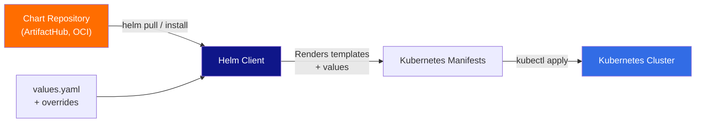

# ⎈ Helm — Comprehensive Reference

> **The Kubernetes package manager.** Install, upgrade, rollback, and manage applications on Kubernetes using reusable, versioned chart packages.

---

## 📑 Table of Contents

- [Concepts](#-concepts)
- [Installation & Setup](#-installation--setup)
- [Repository Management](#-repository-management)
- [Chart Operations](#-chart-operations)
- [Inspecting Releases](#-inspecting-releases)
- [Chart Development](#-chart-development)
- [Values & Templating](#-values--templating)
- [Dependencies](#-dependencies)
- [Hooks](#-hooks)
- [Troubleshooting](#-troubleshooting)
- [Production Tips](#-production-tips)
- [Related Topics](#-related-topics)

---

## 💡 Concepts



| Term | Description |
|------|-------------|
| **Chart** | A package of pre-configured Kubernetes resources. A directory with templates, values, and metadata. |
| **Release** | A running instance of a chart in a cluster. Each install creates a new release. |
| **Repository** | A collection of packaged charts served over HTTP (like apt repos for Debian). |
| **Values** | Configuration for a chart. Default values in `values.yaml`, overridden at install/upgrade time. |
| **Template** | Kubernetes manifest files with Go template syntax. Rendered with values to produce final manifests. |
| **Revision** | A versioned snapshot of a release. Each upgrade or rollback creates a new revision. |
| **Hook** | A mechanism to intervene at certain points in a release lifecycle (pre-install, post-upgrade, etc.). |

### Chart Structure

```
my-chart/
├── Chart.yaml          # Chart metadata (name, version, dependencies)
├── Chart.lock          # Locked dependency versions
├── values.yaml         # Default configuration values
├── values.schema.json  # JSON schema for values validation (optional)
├── templates/          # Kubernetes manifest templates
│   ├── deployment.yaml
│   ├── service.yaml
│   ├── ingress.yaml
│   ├── _helpers.tpl    # Template helper functions
│   ├── NOTES.txt       # Post-install/upgrade user notes
│   └── tests/          # Test templates
│       └── test-connection.yaml
├── charts/             # Dependency charts (subcharts)
├── crds/               # Custom Resource Definitions
└── README.md           # Chart documentation
```

---

## 🚀 Installation & Setup

### Install Helm

```bash
# Using script
curl https://raw.githubusercontent.com/helm/helm/main/scripts/get-helm-3 | bash

# macOS
brew install helm

# Verify
helm version
```

### Shell Completion

```bash
# Bash
source <(helm completion bash)
echo 'source <(helm completion bash)' >> ~/.bashrc

# Zsh
source <(helm completion zsh)
```

---

## 📚 Repository Management

```bash
# Add repositories
helm repo add bitnami https://charts.bitnami.com/bitnami
helm repo add prometheus-community https://prometheus-community.github.io/helm-charts
helm repo add ingress-nginx https://kubernetes.github.io/ingress-nginx
helm repo add jetstack https://charts.jetstack.io

# Update repositories (fetch latest charts)
helm repo update

# List repositories
helm repo list

# Search charts in repos
helm search repo nginx                    # Search added repos
helm search repo bitnami/postgres         # Search specific repo
helm search repo redis --versions         # Show all versions

# Search ArtifactHub (online)
helm search hub prometheus

# Remove repository
helm repo remove bitnami
```

**Example output:**
```
$ helm search repo nginx
NAME                       CHART VERSION   APP VERSION   DESCRIPTION
bitnami/nginx              15.4.4          1.25.3        NGINX Open Source for Kubernetes
ingress-nginx/ingress-nginx 4.8.3          1.9.4         Ingress controller for Kubernetes
```

---

## 📦 Chart Operations

### Install

```bash
# Install from repo
helm install my-release bitnami/nginx
helm install my-release bitnami/nginx -n production     # In namespace
helm install my-release bitnami/nginx --create-namespace -n staging

# Install from local chart
helm install my-release ./my-chart/

# Install from URL
helm install my-release https://example.com/charts/myapp-1.0.0.tgz

# Install with custom values
helm install my-release bitnami/nginx -f custom-values.yaml
helm install my-release bitnami/nginx --set replicaCount=3
helm install my-release bitnami/nginx --set-string image.tag="1.25"
helm install my-release bitnami/nginx -f values-prod.yaml --set ingress.enabled=true

# Install with specific chart version
helm install my-release bitnami/nginx --version 15.4.4

# Dry run (preview without installing)
helm install my-release bitnami/nginx --dry-run
helm install my-release bitnami/nginx --dry-run --debug   # With debug output

# Wait for all resources to be ready
helm install my-release bitnami/nginx --wait --timeout 5m

# Generate a unique release name
helm install bitnami/nginx --generate-name
```

### Upgrade

```bash
# Upgrade release
helm upgrade my-release bitnami/nginx
helm upgrade my-release ./my-chart/ -f new-values.yaml

# Upgrade with new values
helm upgrade my-release bitnami/nginx --set replicaCount=5

# Install if doesn't exist, upgrade if it does
helm upgrade --install my-release bitnami/nginx

# Reuse values from current release + apply changes
helm upgrade my-release bitnami/nginx --reuse-values --set image.tag=1.26

# Reset values to defaults + apply overrides
helm upgrade my-release bitnami/nginx --reset-values -f new-values.yaml

# Wait for upgrade to complete
helm upgrade my-release bitnami/nginx --wait --timeout 10m

# Atomic — rollback on failure
helm upgrade my-release bitnami/nginx --atomic --timeout 5m
```

### Rollback

```bash
# Rollback to previous revision
helm rollback my-release

# Rollback to specific revision
helm rollback my-release 2

# Rollback with wait
helm rollback my-release 2 --wait --timeout 5m

# Check history first
helm history my-release
```

**Example output:**
```
$ helm history my-release
REVISION    UPDATED                     STATUS        CHART           APP VERSION   DESCRIPTION
1           Mon Aug 12 10:00:00 2024    superseded    nginx-15.4.0    1.25.0        Install complete
2           Tue Aug 13 14:30:00 2024    superseded    nginx-15.4.2    1.25.2        Upgrade complete
3           Wed Aug 14 09:15:00 2024    deployed      nginx-15.4.4    1.25.3        Upgrade complete
```

### Uninstall

```bash
helm uninstall my-release
helm uninstall my-release -n production
helm uninstall my-release --keep-history    # Keep release history for rollback
```

### List Releases

```bash
helm list                               # Releases in current namespace
helm list -A                            # All releases across namespaces
helm list -n production                 # Releases in specific namespace
helm list --all                         # Include failed, pending, etc.
helm list -q                            # Names only
helm list --filter 'nginx'              # Filter by name pattern
helm list --deployed                    # Only deployed releases
helm list --failed                      # Only failed releases
```

---

## 🔎 Inspecting Releases

```bash
# Release status
helm status my-release
helm status my-release -n production

# Get current values (user-supplied)
helm get values my-release
helm get values my-release -a             # All values (including defaults)

# Get rendered manifests
helm get manifest my-release

# Get release notes
helm get notes my-release

# Get all release info
helm get all my-release

# Get hooks
helm get hooks my-release

# Show chart info (before install)
helm show chart bitnami/nginx             # Chart.yaml content
helm show values bitnami/nginx            # Default values.yaml
helm show readme bitnami/nginx            # Chart README
helm show all bitnami/nginx               # Everything
```

---

## 🛠️ Chart Development

### Create a New Chart

```bash
helm create my-chart
```

This generates a complete chart scaffold:
```
my-chart/
├── Chart.yaml
├── values.yaml
├── templates/
│   ├── deployment.yaml
│   ├── service.yaml
│   ├── serviceaccount.yaml
│   ├── ingress.yaml
│   ├── hpa.yaml
│   ├── _helpers.tpl
│   ├── NOTES.txt
│   └── tests/
│       └── test-connection.yaml
└── charts/
```

### Template Rendering

```bash
# Render templates locally (without installing)
helm template my-release ./my-chart/
helm template my-release ./my-chart/ -f custom-values.yaml
helm template my-release ./my-chart/ --set replicaCount=3

# Render specific template
helm template my-release ./my-chart/ -s templates/deployment.yaml

# Show computed values
helm template my-release ./my-chart/ --show-only templates/deployment.yaml

# Debug template rendering
helm template my-release ./my-chart/ --debug
```

### Lint

```bash
helm lint ./my-chart/                     # Check for issues
helm lint ./my-chart/ -f custom-values.yaml  # Lint with specific values
helm lint ./my-chart/ --strict            # Treat warnings as errors
```

### Package

```bash
helm package ./my-chart/                  # Create .tgz package
helm package ./my-chart/ --version 1.2.3  # Override version
helm package ./my-chart/ -d ./packages/   # Custom destination
```

### Test

```bash
helm test my-release                      # Run chart tests
helm test my-release --logs               # Show test logs
```

### Template Syntax Quick Reference

```yaml
# Values access
{{ .Values.replicaCount }}
{{ .Release.Name }}
{{ .Release.Namespace }}
{{ .Chart.Name }}

# Conditionals
{{- if .Values.ingress.enabled }}
apiVersion: networking.k8s.io/v1
kind: Ingress
...
{{- end }}

# Loops
{{- range .Values.env }}
- name: {{ .name }}
  value: {{ .value | quote }}
{{- end }}

# Default values
{{ .Values.image.tag | default .Chart.AppVersion }}

# Include helpers
{{ include "my-chart.fullname" . }}
{{ include "my-chart.labels" . | nindent 4 }}

# Required values (fail if not set)
{{ required "A valid .Values.database.host is required!" .Values.database.host }}

# Quotes and types
{{ .Values.port }}              # Unquoted (number)
{{ .Values.name | quote }}      # Quoted (string)
{{ toYaml .Values.resources | nindent 12 }}  # YAML block
```

---

## 📦 Dependencies

### Define Dependencies (Chart.yaml)

```yaml
# Chart.yaml
dependencies:
  - name: postgresql
    version: "12.x.x"
    repository: "https://charts.bitnami.com/bitnami"
    condition: postgresql.enabled
  - name: redis
    version: "17.x.x"
    repository: "https://charts.bitnami.com/bitnami"
    condition: redis.enabled
    alias: cache
```

### Manage Dependencies

```bash
helm dependency update ./my-chart/        # Download dependencies
helm dependency build ./my-chart/         # Rebuild from Chart.lock
helm dependency list ./my-chart/          # List dependencies
```

### Override Subchart Values

```yaml
# values.yaml
postgresql:
  enabled: true
  auth:
    username: myapp
    database: mydb
  primary:
    persistence:
      size: 10Gi

redis:
  enabled: true
  architecture: standalone
```

---

## 🪝 Hooks

Hooks allow running jobs at specific lifecycle points.

| Hook | When |
|------|------|
| `pre-install` | Before any resources are installed |
| `post-install` | After all resources are installed |
| `pre-delete` | Before deletion begins |
| `post-delete` | After deletion completes |
| `pre-upgrade` | Before upgrade begins |
| `post-upgrade` | After upgrade completes |
| `pre-rollback` | Before rollback begins |
| `post-rollback` | After rollback completes |
| `test` | When `helm test` is run |

### Hook Example

```yaml
apiVersion: batch/v1
kind: Job
metadata:
  name: "{{ .Release.Name }}-db-migrate"
  annotations:
    "helm.sh/hook": pre-upgrade
    "helm.sh/hook-weight": "0"
    "helm.sh/hook-delete-policy": hook-succeeded
spec:
  template:
    spec:
      containers:
        - name: migrate
          image: "{{ .Values.image.repository }}:{{ .Values.image.tag }}"
          command: ["python", "manage.py", "migrate"]
      restartPolicy: Never
  backoffLimit: 1
```

| Delete Policy | Description |
|---------------|-------------|
| `hook-succeeded` | Delete after hook succeeds |
| `hook-failed` | Delete after hook fails |
| `before-hook-creation` | Delete old hook before new one runs |

---

## 🐛 Troubleshooting

### Failed Releases

```bash
# Check release status
helm status my-release

# View history (find failed revisions)
helm history my-release

# Get rendered manifests
helm get manifest my-release

# Debug installation
helm install my-release ./my-chart/ --dry-run --debug

# Check Kubernetes events
kubectl get events --sort-by='.lastTimestamp' -n <namespace>
```

### Common Issues

| Problem | Diagnosis | Solution |
|---------|-----------|----------|
| `UPGRADE FAILED: has no deployed releases` | First install failed | `helm uninstall <release>`, then install again |
| `cannot re-use a name that is still in use` | Release exists | `helm uninstall <release>` first, or use different name |
| `rendered manifests contain a resource that already exists` | Resource created outside Helm | Delete resource or adopt it with labels |
| Template rendering errors | Syntax issue | `helm template --debug`, check Go template syntax |
| Values not applied | Wrong values path | `helm get values -a` to see all values, check nesting |
| Timeout on install/upgrade | Resources slow to become ready | Increase `--timeout`, check pod events |
| `INSTALLATION FAILED: Kubernetes cluster unreachable` | No cluster connection | Check `kubectl config current-context`, verify connection |
| Hook fails | Pre/post job error | `kubectl logs job/<hook-job>`, check hook-delete-policy |
| Rollback fails | State inconsistency | Check `helm history`, may need to uninstall and reinstall |

### Values Debugging

```bash
# See what values are being used
helm get values my-release -a             # All values for running release

# Compare with chart defaults
helm show values bitnami/nginx > defaults.yaml
helm get values my-release > current.yaml
diff defaults.yaml current.yaml

# Preview how values merge
helm template my-release ./my-chart/ -f custom-values.yaml --debug

# Validate values against schema
helm lint ./my-chart/ -f custom-values.yaml
```

---

## 🏭 Production Tips

### Release Management

- **Always use `--atomic`** for production upgrades — auto-rollback on failure
- **Use `--wait`** to ensure resources are healthy before marking success
- **Pin chart versions** — never use latest in production
- **Store values files in version control** — track configuration changes
- **Use `helm diff` plugin** to preview changes before upgrading

```bash
# Install helm-diff plugin
helm plugin install https://github.com/databus23/helm-diff

# Preview upgrade changes
helm diff upgrade my-release bitnami/nginx -f values.yaml
```

### Naming Conventions

```bash
# Pattern: <team>-<service>-<environment>
helm install platform-nginx-prod bitnami/nginx -n production
helm install platform-nginx-staging bitnami/nginx -n staging
```

### Values File Organization

```
values/
├── values.yaml           # Base/default values
├── values-dev.yaml       # Development overrides
├── values-staging.yaml   # Staging overrides
└── values-prod.yaml      # Production overrides
```

```bash
# Use base + environment-specific
helm upgrade my-release ./my-chart/ -f values.yaml -f values-prod.yaml
```

### Security

- **Never put secrets in values.yaml** — use Kubernetes secrets or external secrets managers
- **Review chart templates** before installing third-party charts
- **Use `--verify`** with signed charts for supply chain security
- **Set `automountServiceAccountToken: false`** unless needed

### Useful Plugins

```bash
helm plugin install https://github.com/databus23/helm-diff      # Diff before upgrade
helm plugin install https://github.com/jkroepke/helm-secrets    # Encrypted values
helm plugin install https://github.com/chartmuseum/helm-push     # Push to ChartMuseum
```

---

## 🔗 Related Topics

- [🧰 CLI Command Center](../) — All CLI tool references
- [kubectl](../kubectl/) — Kubernetes cluster management
- [Docker](../docker/) — Container runtime
- [🚀 DevOps — Helm](../../devops/helm/) — Helm in CI/CD pipelines
- [🚀 DevOps — Kubernetes](../../devops/kubernetes/) — Kubernetes concepts

---

> **Remember:** `helm template` + `helm lint` before every install/upgrade. Catch errors locally, not in production.
