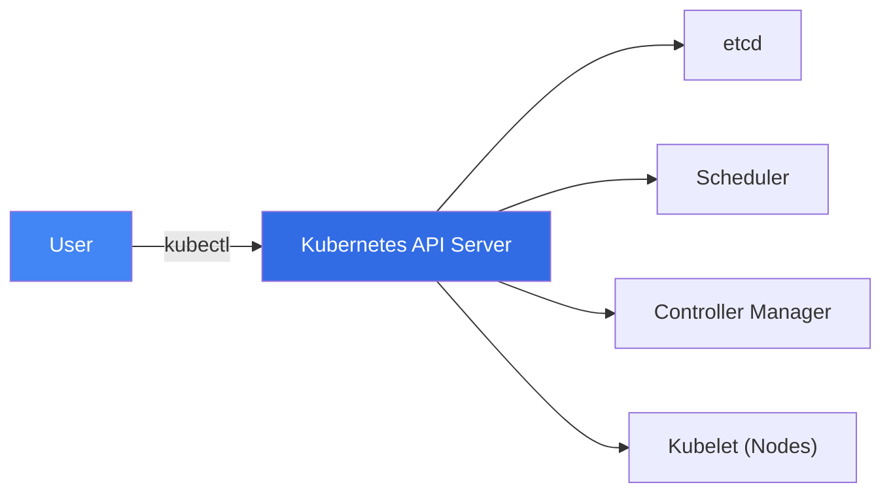
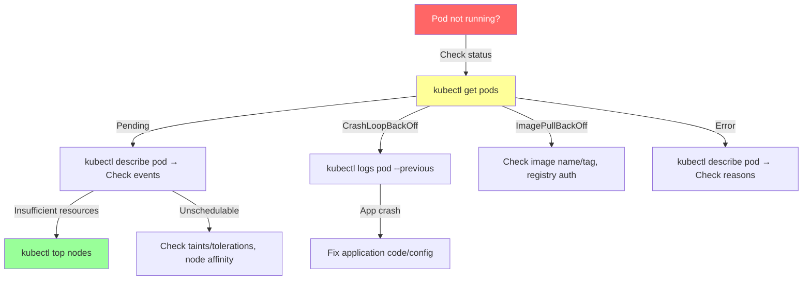

# ☸️ kubectl — Comprehensive Reference

> **The Kubernetes command-line tool.** Manage clusters, deploy workloads, debug pods, and inspect resources — everything you need for daily Kubernetes operations.

---

## 📑 Table of Contents

- [Concepts](#-concepts)
- [Getting Started](#-getting-started)
- [Resource Management](#-resource-management)
- [Debugging & Troubleshooting](#-debugging--troubleshooting)
- [Configuration & Contexts](#-configuration--contexts)
- [Output Formatting](#-output-formatting)
- [Labels & Selectors](#-labels--selectors)
- [Namespace Operations](#-namespace-operations)
- [Rollouts & Deployments](#-rollouts--deployments)
- [Scaling](#-scaling)
- [Advanced Operations](#-advanced-operations)
- [Resource Type Quick Reference](#-resource-type-quick-reference)
- [Troubleshooting](#-troubleshooting)
- [Production Tips](#-production-tips)
- [Related Topics](#-related-topics)

---

## 💡 Concepts

`kubectl` communicates with the Kubernetes API server to manage cluster resources. It uses a **kubeconfig** file (default: `~/.kube/config`) that contains cluster connection info, credentials, and context definitions.



### Command Structure

```
kubectl [command] [TYPE] [NAME] [flags]
```

| Component | Example | Description |
|-----------|---------|-------------|
| `command` | `get`, `describe`, `apply` | Operation to perform |
| `TYPE` | `pods`, `svc`, `deploy` | Resource type |
| `NAME` | `my-pod`, `nginx-deploy` | Resource name (optional) |
| `flags` | `-n default`, `-o yaml` | Options and modifiers |

---

## 🚀 Getting Started

### Verify Connection

```bash
kubectl cluster-info                     # Cluster endpoint info
kubectl version                          # Client and server versions
kubectl api-versions                     # Supported API versions
kubectl get nodes                        # List cluster nodes
```

**Example output:**
```
$ kubectl get nodes
NAME           STATUS   ROLES           AGE   VERSION
control-01     Ready    control-plane   45d   v1.28.4
worker-01      Ready    <none>          45d   v1.28.4
worker-02      Ready    <none>          45d   v1.28.4
```

### Shell Completion & Aliases

```bash
# Enable bash completion
source <(kubectl completion bash)
echo 'source <(kubectl completion bash)' >> ~/.bashrc

# Alias (widely used)
alias k=kubectl
complete -o default -F __start_kubectl k

# Zsh completion
source <(kubectl completion zsh)
```

---

## 📦 Resource Management

### Get Resources

```bash
# Basic get
kubectl get pods                         # Pods in current namespace
kubectl get pods -A                      # Pods across ALL namespaces
kubectl get pods -n kube-system          # Pods in specific namespace
kubectl get pods -o wide                 # Extra info (node, IP)
kubectl get pods --show-labels           # Show labels

# Multiple resources
kubectl get pods,svc,deploy             # Multiple types at once
kubectl get all                          # Common resources (pods, svc, deploy, rs)

# Sorting
kubectl get pods --sort-by='.status.phase'
kubectl get pods --sort-by='.metadata.creationTimestamp'

# Field selectors
kubectl get pods --field-selector status.phase=Running
kubectl get pods --field-selector spec.nodeName=worker-01
```

**Example output:**
```
$ kubectl get pods -o wide
NAME                     READY   STATUS    RESTARTS   AGE   IP            NODE
nginx-7c5ddbdf54-k8p2n  1/1     Running   0          2d    10.244.1.15   worker-01
redis-5d8b6bb7f9-m4x7q  1/1     Running   0          5d    10.244.2.22   worker-02
api-6f8c9d4b5-tn9r2     2/2     Running   1          1d    10.244.1.18   worker-01
```

### Describe Resources

Shows detailed information including events — essential for debugging.

```bash
kubectl describe pod nginx-7c5ddbdf54-k8p2n
kubectl describe node worker-01
kubectl describe svc my-service
kubectl describe deploy my-deployment
```

**Example output (Events section):**
```
Events:
  Type     Reason     Age   From               Message
  ----     ------     ----  ----               -------
  Normal   Scheduled  2m    default-scheduler  Successfully assigned default/nginx to worker-01
  Normal   Pulling    2m    kubelet            Pulling image "nginx:1.25"
  Normal   Pulled     1m    kubelet            Successfully pulled image
  Normal   Created    1m    kubelet            Created container nginx
  Normal   Started    1m    kubelet            Started container nginx
```

### Create & Apply

```bash
# Declarative (recommended) — apply manifest
kubectl apply -f deployment.yaml
kubectl apply -f ./manifests/                # Apply all files in directory
kubectl apply -f https://url/to/manifest.yaml
kubectl apply -k ./kustomize/               # Apply with Kustomize

# Imperative — create directly
kubectl create deployment nginx --image=nginx:1.25
kubectl create service clusterip my-svc --tcp=80:8080
kubectl create namespace staging
kubectl create configmap my-config --from-literal=key=value
kubectl create secret generic my-secret --from-literal=password=s3cr3t

# Dry run (generate YAML without creating)
kubectl create deployment nginx --image=nginx --dry-run=client -o yaml > deploy.yaml
kubectl run debug-pod --image=busybox --dry-run=client -o yaml > pod.yaml
```

### Delete Resources

```bash
kubectl delete pod my-pod
kubectl delete -f deployment.yaml
kubectl delete deploy,svc my-app                 # Delete multiple types
kubectl delete pods --all -n staging              # All pods in namespace
kubectl delete pods -l app=old-version            # Delete by label
kubectl delete pod my-pod --grace-period=0 --force  # Force delete (stuck pods)
```

---

## 🔍 Debugging & Troubleshooting

### Logs

```bash
kubectl logs my-pod                          # Pod logs
kubectl logs my-pod -c my-container          # Specific container in multi-container pod
kubectl logs my-pod -f                       # Follow/stream logs
kubectl logs my-pod --tail=100               # Last 100 lines
kubectl logs my-pod --since=1h               # Logs from last hour
kubectl logs my-pod --previous               # Logs from previous (crashed) instance
kubectl logs -l app=nginx                    # Logs from all pods with label
kubectl logs deploy/my-deployment            # Logs from deployment
```

### Exec — Run Commands in Pods

```bash
kubectl exec my-pod -- ls /app               # Run command
kubectl exec my-pod -c sidecar -- cat /etc/config  # In specific container
kubectl exec -it my-pod -- /bin/sh           # Interactive shell
kubectl exec -it my-pod -- bash              # Interactive bash (if available)
```

### Port Forwarding

```bash
kubectl port-forward pod/my-pod 8080:80      # Forward local 8080 → pod 80
kubectl port-forward svc/my-service 8080:80  # Forward to service
kubectl port-forward deploy/my-deploy 8080:80 # Forward to deployment
```

### Debug Containers (Ephemeral)

```bash
# Attach debug container to running pod
kubectl debug my-pod -it --image=busybox
kubectl debug my-pod -it --image=nicolaka/netshoot  # Network debugging

# Debug a node
kubectl debug node/worker-01 -it --image=ubuntu

# Copy pod with debug container
kubectl debug my-pod -it --copy-to=debug-pod --container=debug --image=busybox
```

### Resource Usage

```bash
kubectl top pods                             # Pod CPU/memory
kubectl top pods -A                          # All namespaces
kubectl top pods --sort-by=memory            # Sort by memory
kubectl top nodes                            # Node resource usage
kubectl top pod my-pod --containers          # Per-container usage
```

### Events

```bash
kubectl get events                           # Namespace events
kubectl get events -A                        # All namespace events
kubectl get events --sort-by='.lastTimestamp' # Chronological
kubectl get events --field-selector type=Warning  # Warnings only
```

---

## ⚙️ Configuration & Contexts

### Kubeconfig Management

```bash
# View config
kubectl config view                          # Current kubeconfig
kubectl config view --minify                 # Current context only
kubectl config view --raw                    # Include secrets

# Contexts
kubectl config get-contexts                  # List all contexts
kubectl config current-context               # Show current context
kubectl config use-context production        # Switch context
kubectl config set-context --current --namespace=staging  # Set default namespace

# Manage clusters and users
kubectl config set-cluster my-cluster --server=https://k8s.example.com
kubectl config set-credentials admin --token=<token>
kubectl config set-context my-ctx --cluster=my-cluster --user=admin --namespace=default
```

**Example output:**
```
$ kubectl config get-contexts
CURRENT   NAME         CLUSTER      AUTHINFO   NAMESPACE
*         production   prod-k8s     admin      default
          staging      stage-k8s    dev-user   staging
          dev          dev-k8s      dev-user   development
```

### Multiple Kubeconfig Files

```bash
# Merge multiple configs
export KUBECONFIG=~/.kube/config:~/.kube/prod-config:~/.kube/staging-config

# Use specific config for one command
kubectl --kubeconfig=/path/to/config get pods
```

---

## 📊 Output Formatting

### Common Output Formats

```bash
kubectl get pods -o wide                     # Extra columns
kubectl get pod my-pod -o yaml               # Full YAML
kubectl get pod my-pod -o json               # Full JSON
kubectl get pods -o name                     # Resource names only
```

### JSONPath

```bash
# Extract specific fields
kubectl get pods -o jsonpath='{.items[*].metadata.name}'
kubectl get pods -o jsonpath='{.items[*].status.phase}'

# Formatted output
kubectl get pods -o jsonpath='{range .items[*]}{.metadata.name}{"\t"}{.status.phase}{"\n"}{end}'

# Node IPs
kubectl get nodes -o jsonpath='{.items[*].status.addresses[?(@.type=="InternalIP")].address}'

# Pod images
kubectl get pods -o jsonpath='{.items[*].spec.containers[*].image}'
```

### Custom Columns

```bash
kubectl get pods -o custom-columns=\
NAME:.metadata.name,\
STATUS:.status.phase,\
NODE:.spec.nodeName,\
IP:.status.podIP
```

**Example output:**
```
NAME                     STATUS    NODE        IP
nginx-7c5ddbdf54-k8p2n  Running   worker-01   10.244.1.15
redis-5d8b6bb7f9-m4x7q  Running   worker-02   10.244.2.22
```

### Combining with jq

```bash
# Pretty JSON
kubectl get pod my-pod -o json | jq '.'

# Extract container statuses
kubectl get pods -o json | jq '.items[] | {name: .metadata.name, phase: .status.phase}'

# Get all container images across all pods
kubectl get pods -A -o json | jq -r '.items[].spec.containers[].image' | sort -u
```

---

## 🏷️ Labels & Selectors

### Managing Labels

```bash
# Add label
kubectl label pod my-pod env=production
kubectl label node worker-01 disk=ssd

# Update label (overwrite)
kubectl label pod my-pod env=staging --overwrite

# Remove label
kubectl label pod my-pod env-
```

### Selecting by Labels

```bash
# Equality-based
kubectl get pods -l app=nginx
kubectl get pods -l 'app=nginx,tier=frontend'
kubectl get pods -l 'app!=nginx'

# Set-based
kubectl get pods -l 'env in (production,staging)'
kubectl get pods -l 'env notin (dev)'
kubectl get pods -l 'app,!canary'              # Has 'app' label, no 'canary'

# Combined with other commands
kubectl delete pods -l app=old-version
kubectl logs -l app=nginx --all-containers
```

### Annotations

```bash
kubectl annotate pod my-pod description="Main web server"
kubectl annotate pod my-pod description-                    # Remove
```

---

## 🗂️ Namespace Operations

```bash
# List namespaces
kubectl get namespaces
kubectl get ns

# Create namespace
kubectl create namespace staging

# Set default namespace for current context
kubectl config set-context --current --namespace=staging

# Operations in specific namespace
kubectl get pods -n kube-system
kubectl apply -f deploy.yaml -n production

# All namespaces
kubectl get pods -A
kubectl get pods --all-namespaces
```

---

## 🔄 Rollouts & Deployments

### Rollout Management

```bash
# Check rollout status
kubectl rollout status deploy/my-app
kubectl rollout status daemonset/my-ds

# View rollout history
kubectl rollout history deploy/my-app
kubectl rollout history deploy/my-app --revision=3

# Rollback
kubectl rollout undo deploy/my-app                   # Previous revision
kubectl rollout undo deploy/my-app --to-revision=2   # Specific revision

# Pause/Resume
kubectl rollout pause deploy/my-app
kubectl rollout resume deploy/my-app

# Restart (rolling restart)
kubectl rollout restart deploy/my-app
```

**Example output:**
```
$ kubectl rollout history deploy/my-app
REVISION  CHANGE-CAUSE
1         Initial deployment
2         kubectl set image deploy/my-app app=myapp:v2
3         kubectl set image deploy/my-app app=myapp:v3

$ kubectl rollout status deploy/my-app
deployment "my-app" successfully rolled out
```

### Update Deployment Image

```bash
kubectl set image deploy/my-app app=myapp:v2
kubectl set image deploy/my-app app=myapp:v2 --record  # Record change cause
```

---

## 📈 Scaling

```bash
# Scale deployment
kubectl scale deploy/my-app --replicas=5

# Scale statefulset
kubectl scale statefulset/my-db --replicas=3

# Autoscale (HPA)
kubectl autoscale deploy/my-app --min=2 --max=10 --cpu-percent=80

# Check HPA
kubectl get hpa
kubectl describe hpa my-app
```

---

## 🔬 Advanced Operations

### Patch Resources

```bash
# Strategic merge patch
kubectl patch deploy my-app -p '{"spec":{"replicas":3}}'

# JSON patch
kubectl patch pod my-pod --type='json' -p='[{"op":"replace","path":"/spec/containers/0/image","value":"nginx:1.26"}]'

# Patch node (e.g., add taint)
kubectl taint nodes worker-01 dedicated=special:NoSchedule
```

### Explain — API Documentation

```bash
kubectl explain pod                          # Pod spec overview
kubectl explain pod.spec                     # Pod spec details
kubectl explain pod.spec.containers          # Container spec
kubectl explain pod.spec.containers.resources  # Resource requirements
kubectl explain deploy.spec.strategy         # Deployment strategy
```

### API Resources

```bash
kubectl api-resources                        # All resource types
kubectl api-resources --namespaced=true      # Namespaced resources
kubectl api-resources --namespaced=false     # Cluster-scoped resources
kubectl api-resources --verbs=list           # Listable resources
```

### Run Temporary Pods

```bash
# Quick debug pod
kubectl run debug --image=busybox -it --rm -- sh
kubectl run debug --image=nicolaka/netshoot -it --rm -- bash

# Run a specific command
kubectl run curl --image=curlimages/curl -it --rm -- curl http://my-service:80

# DNS debugging
kubectl run dns-test --image=busybox -it --rm -- nslookup kubernetes
```

### Copy Files

```bash
kubectl cp my-pod:/var/log/app.log ./app.log    # From pod
kubectl cp ./config.yaml my-pod:/app/config.yaml  # To pod
kubectl cp my-pod:/data ./data -c my-container    # Specific container
```

---

## 📋 Resource Type Quick Reference

| Short | Full Name | API Group | Namespaced |
|-------|-----------|-----------|------------|
| `po` | pods | core | Yes |
| `svc` | services | core | Yes |
| `deploy` | deployments | apps | Yes |
| `rs` | replicasets | apps | Yes |
| `ds` | daemonsets | apps | Yes |
| `sts` | statefulsets | apps | Yes |
| `cm` | configmaps | core | Yes |
| `secret` | secrets | core | Yes |
| `pvc` | persistentvolumeclaims | core | Yes |
| `pv` | persistentvolumes | core | No |
| `ing` | ingresses | networking.k8s.io | Yes |
| `ns` | namespaces | core | No |
| `no` | nodes | core | No |
| `sa` | serviceaccounts | core | Yes |
| `hpa` | horizontalpodautoscalers | autoscaling | Yes |
| `job` | jobs | batch | Yes |
| `cj` | cronjobs | batch | Yes |
| `ep` | endpoints | core | Yes |
| `sc` | storageclasses | storage.k8s.io | No |
| `netpol` | networkpolicies | networking.k8s.io | Yes |

---

## 🐛 Troubleshooting

### Common Debugging Workflow



### Common Issues

| Problem | Diagnosis | Solution |
|---------|-----------|----------|
| Pod `Pending` | `kubectl describe pod` — check events | Insufficient resources, unschedulable nodes, PVC not bound |
| `CrashLoopBackOff` | `kubectl logs --previous` | Fix app crash, check config, verify CMD/ENTRYPOINT |
| `ImagePullBackOff` | `kubectl describe pod` | Wrong image name/tag, missing imagePullSecret |
| `OOMKilled` | `kubectl describe pod` | Increase memory limits |
| Service not reachable | `kubectl get endpoints` | Check label selectors match, ports correct |
| DNS not resolving | `kubectl run dns -- --rm -it busybox -- nslookup svc` | Check CoreDNS pods, service name |
| Node `NotReady` | `kubectl describe node` | Check kubelet, network plugin, disk pressure |
| `Forbidden` errors | Check RBAC | `kubectl auth can-i --list` |

---

## 🏭 Production Tips

### Useful Aliases

```bash
alias k='kubectl'
alias kgp='kubectl get pods'
alias kga='kubectl get all'
alias kgpa='kubectl get pods -A'
alias kdp='kubectl describe pod'
alias kl='kubectl logs'
alias klf='kubectl logs -f'
alias ke='kubectl exec -it'
alias kaf='kubectl apply -f'
alias kdf='kubectl delete -f'
```

### Security Best Practices

```bash
# Check your permissions
kubectl auth can-i create deployments
kubectl auth can-i '*' '*'                   # Am I cluster admin?
kubectl auth can-i list pods --as=dev-user   # Impersonate user

# Check who can do what
kubectl auth can-i --list --namespace=production
```

### Resource Management Tips

- Always set resource **requests** and **limits** on containers
- Use **LimitRanges** and **ResourceQuotas** per namespace
- Use `--dry-run=client -o yaml` to generate manifests
- Prefer `kubectl apply` (declarative) over `kubectl create` (imperative)
- Use `kubectl diff -f manifest.yaml` to preview changes before applying

### Backup & Export

```bash
# Export all resources in namespace
kubectl get all -n myapp -o yaml > backup.yaml

# Export specific resource
kubectl get deploy my-app -o yaml > deploy-backup.yaml
```

---

## 🔗 Related Topics

- [🧰 CLI Command Center](../) — All CLI tool references
- [Helm](../helm/) — Kubernetes package management
- [Docker](../docker/) — Container runtime
- [🚀 DevOps — Kubernetes](../../devops/kubernetes/) — Kubernetes concepts and architecture
- [🐛 Troubleshooting — Kubernetes](../../troubleshooting/kubernetes/) — K8s debugging guides
- [jq](../jq/) — JSON processing for kubectl output

---

> **Tip:** Master `kubectl explain`, `--dry-run=client -o yaml`, and JSONPath queries — these three techniques will make you dramatically faster at Kubernetes operations.
