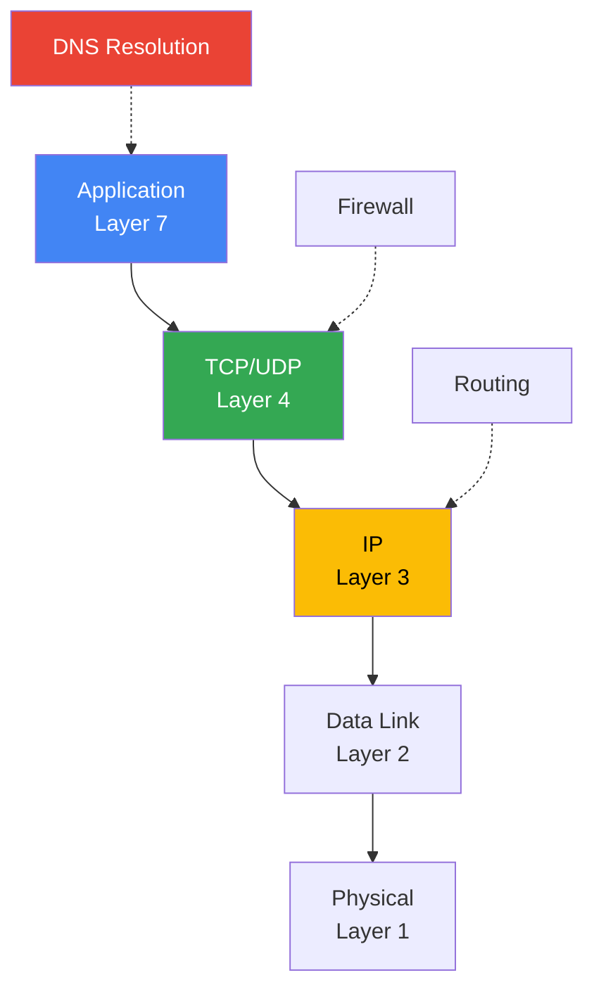
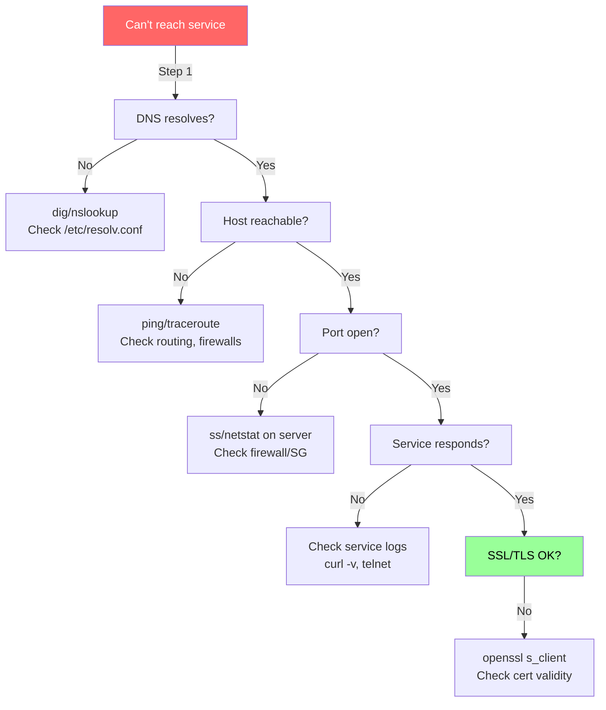

# 🌐 Networking Tools — Comprehensive Reference

> **Diagnose, debug, and understand network issues.** DNS resolution, connectivity testing, port inspection, traffic analysis, and network configuration — all from the command line.

---

## 📑 Table of Contents

- [Concepts](#-concepts)
- [DNS Tools](#-dns-tools)
- [Connectivity Testing](#-connectivity-testing)
- [Ports & Sockets](#-ports--sockets)
- [Traffic Analysis](#-traffic-analysis)
- [Network Configuration](#-network-configuration)
- [HTTP Testing](#-http-testing)
- [Troubleshooting Common Issues](#-troubleshooting-common-issues)
- [Production Tips](#-production-tips)
- [Related Topics](#-related-topics)

---

## 💡 Concepts



### Debugging by Layer

| Layer | What to Check | Tools |
|-------|--------------|-------|
| **DNS** | Name resolution | `dig`, `nslookup`, `host` |
| **Connectivity** | Can I reach the host? | `ping`, `traceroute`, `mtr` |
| **Transport** | Is the port open/listening? | `ss`, `netstat`, `lsof`, `nc` |
| **Application** | Is the service responding? | `curl`, `telnet`, `openssl` |
| **Traffic** | What's on the wire? | `tcpdump`, `wireshark` |

---

## 🔍 DNS Tools

### dig — DNS Lookup

The most comprehensive DNS tool. Provides detailed query and response information.

```bash
# Basic lookup (A record)
dig example.com

# Specific record types
dig example.com A                    # IPv4 address
dig example.com AAAA                 # IPv6 address
dig example.com MX                   # Mail servers
dig example.com NS                   # Nameservers
dig example.com TXT                  # TXT records
dig example.com CNAME                # Canonical name
dig example.com SOA                  # Start of Authority
dig example.com ANY                  # All records

# Short output (just the answer)
dig +short example.com
dig +short example.com MX

# Query specific DNS server
dig @8.8.8.8 example.com
dig @1.1.1.1 example.com

# Trace DNS resolution path
dig +trace example.com

# Reverse lookup (IP → hostname)
dig -x 93.184.216.34

# No recursion (query authoritative only)
dig +norecurse example.com

# Show only answer section
dig +noall +answer example.com

# Check TTL
dig +nocmd +noall +answer +ttlid example.com
```

**Example output:**
```
$ dig +noall +answer example.com
example.com.		3600	IN	A	93.184.216.34

$ dig +short example.com MX
10 mail.example.com.
20 backup-mail.example.com.

$ dig +trace example.com
; <<>> DiG 9.18.18 <<>> +trace example.com
.			86400	IN	NS	a.root-servers.net.
...
example.com.		86400	IN	NS	ns1.example.com.
example.com.		3600	IN	A	93.184.216.34
```

### nslookup — Simple DNS Query

```bash
# Basic lookup
nslookup example.com

# Query specific DNS server
nslookup example.com 8.8.8.8

# Reverse lookup
nslookup 93.184.216.34

# Specific record type
nslookup -type=MX example.com
nslookup -type=TXT example.com
```

**Example output:**
```
$ nslookup example.com
Server:		127.0.0.53
Address:	127.0.0.53#53

Non-authoritative answer:
Name:	example.com
Address: 93.184.216.34
```

### host — Concise DNS Lookup

```bash
host example.com                     # A record
host -t MX example.com               # MX records
host -t NS example.com               # NS records
host 93.184.216.34                   # Reverse lookup
host -a example.com                  # All records
```

**Example output:**
```
$ host example.com
example.com has address 93.184.216.34
example.com has IPv6 address 2606:2800:220:1:248:1893:25c8:1946
example.com mail is handled by 10 mail.example.com.
```

### DNS Quick Comparison

| Tool | Best For |
|------|----------|
| `dig` | Detailed debugging, trace, specific servers |
| `nslookup` | Quick interactive queries |
| `host` | Simple, concise lookups |

---

## 🏓 Connectivity Testing

### ping — ICMP Connectivity

```bash
# Basic ping
ping example.com

# Limit count
ping -c 4 example.com                # Send 4 pings and stop

# Set interval
ping -i 0.5 example.com              # Ping every 0.5 seconds

# Quiet mode (summary only)
ping -q -c 10 example.com

# Set packet size
ping -s 1400 example.com             # Test MTU issues

# Set timeout per packet
ping -W 2 example.com                # 2-second timeout

# Don't resolve hostnames
ping -n example.com
```

**Example output:**
```
$ ping -c 4 example.com
PING example.com (93.184.216.34) 56(84) bytes of data.
64 bytes from 93.184.216.34: icmp_seq=1 ttl=56 time=12.3 ms
64 bytes from 93.184.216.34: icmp_seq=2 ttl=56 time=11.8 ms
64 bytes from 93.184.216.34: icmp_seq=3 ttl=56 time=12.1 ms
64 bytes from 93.184.216.34: icmp_seq=4 ttl=56 time=11.9 ms

--- example.com ping statistics ---
4 packets transmitted, 4 received, 0% packet loss, time 3005ms
rtt min/avg/max/mdev = 11.800/12.025/12.300/0.183 ms
```

> **Note:** Many cloud providers block ICMP. A failed ping doesn't necessarily mean the host is down — try `curl` or `nc` on the application port.

### traceroute — Network Path

```bash
# Show hops to destination
traceroute example.com

# Use TCP instead of UDP (often works better with firewalls)
traceroute -T example.com

# Use ICMP
traceroute -I example.com

# Specific port
traceroute -p 443 example.com

# Max hops
traceroute -m 20 example.com

# No hostname resolution (faster)
traceroute -n example.com
```

**Example output:**
```
$ traceroute -n example.com
traceroute to example.com (93.184.216.34), 30 hops max, 60 byte packets
 1  10.0.0.1      1.234 ms  1.100 ms  1.050 ms
 2  172.16.0.1    5.432 ms  5.200 ms  5.150 ms
 3  203.0.113.1   8.765 ms  8.600 ms  8.550 ms
 4  * * *
 5  93.184.216.34 12.345 ms 12.200 ms 12.150 ms
```

### mtr — Combined Ping + Traceroute

`mtr` is an interactive tool that continuously pings each hop and shows statistics.

```bash
# Interactive mode
mtr example.com

# Report mode (non-interactive)
mtr -r -c 100 example.com           # 100 pings, report format

# Report with wide output
mtr -rw -c 50 example.com

# No DNS (faster)
mtr -n example.com

# TCP mode
mtr --tcp -P 443 example.com
```

**Example report:**
```
$ mtr -r -c 10 example.com
HOST:                      Loss%   Snt   Last   Avg  Best  Wrst StDev
  1. gateway               0.0%    10    1.2    1.1   0.9   1.5   0.2
  2. isp-router             0.0%    10    5.4    5.2   4.8   6.1   0.4
  3. core-router            0.0%    10    8.7    8.5   8.0   9.2   0.3
  4. ???                   100.0    10    0.0    0.0   0.0   0.0   0.0
  5. example.com            0.0%    10   12.3   12.1  11.8  12.8   0.3
```

---

## 🔌 Ports & Sockets

### ss — Socket Statistics (Modern)

`ss` is the modern replacement for `netstat`. Faster and more feature-rich.

```bash
# Listening TCP ports
ss -tlnp
#   -t  TCP only
#   -l  Listening only
#   -n  Numeric (no DNS)
#   -p  Show process

# Listening UDP ports
ss -ulnp

# All TCP connections
ss -tnp

# All connections with state
ss -tna

# Filter by port
ss -tlnp | grep :8080
ss -tnp 'sport = :443'

# Filter by state
ss -tn state established
ss -tn state time-wait
ss -tn state close-wait

# Count connections by state
ss -tn | awk '{print $1}' | sort | uniq -c | sort -rn

# Connections to specific IP
ss -tn dst 10.0.0.5

# Summary statistics
ss -s
```

**Example output:**
```
$ ss -tlnp
State    Recv-Q   Send-Q    Local Address:Port    Peer Address:Port   Process
LISTEN   0        128       0.0.0.0:22             0.0.0.0:*          users:(("sshd",pid=1234,fd=3))
LISTEN   0        511       0.0.0.0:80             0.0.0.0:*          users:(("nginx",pid=5678,fd=6))
LISTEN   0        128       127.0.0.1:5432         0.0.0.0:*          users:(("postgres",pid=9012,fd=4))
LISTEN   0        128       [::]:443               [::]:*             users:(("nginx",pid=5678,fd=7))
```

### netstat — Network Statistics (Legacy)

```bash
# Listening ports
netstat -tlnp

# All connections
netstat -anp

# Network interface statistics
netstat -i

# Routing table
netstat -rn

# Connection count by state
netstat -tn | awk '{print $6}' | sort | uniq -c | sort -rn
```

### lsof — List Open Files (Network)

```bash
# Processes using a specific port
lsof -i :80
lsof -i :8080

# All network connections for a process
lsof -i -p <pid>

# All TCP connections
lsof -i TCP

# Connections to specific host
lsof -i @10.0.0.5

# Established connections
lsof -i TCP -sTCP:ESTABLISHED

# Files opened by process
lsof -p <pid>
```

### nc (netcat) — Network Swiss Army Knife

```bash
# Test if port is open
nc -zv hostname 80
nc -zv hostname 443

# Port range scan
nc -zv hostname 20-100

# Listen on a port
nc -l 8080

# Simple chat (two terminals)
nc -l 8080              # Terminal 1: listen
nc localhost 8080       # Terminal 2: connect

# Send data
echo "GET / HTTP/1.0\r\n\r\n" | nc hostname 80

# Transfer a file
nc -l 9999 > received.file     # Receiver
nc hostname 9999 < send.file   # Sender

# Test TCP connection with timeout
nc -zv -w 5 hostname 443       # 5-second timeout
```

### telnet — Test Port Connectivity

```bash
# Test if port is reachable
telnet hostname 80
telnet hostname 443

# If it connects, you see: "Connected to hostname."
# Press Ctrl+] then type 'quit' to exit
```

---

## 📡 Traffic Analysis

### tcpdump — Packet Capture

```bash
# Capture on interface
sudo tcpdump -i eth0

# Capture specific port
sudo tcpdump -i eth0 port 443
sudo tcpdump -i eth0 port 80 or port 443

# Capture by host
sudo tcpdump -i eth0 host 10.0.0.5
sudo tcpdump -i eth0 src host 10.0.0.5
sudo tcpdump -i eth0 dst host 10.0.0.5

# Capture DNS queries
sudo tcpdump -i eth0 port 53

# Verbose with packet content
sudo tcpdump -i eth0 -A port 80     # ASCII
sudo tcpdump -i eth0 -X port 80     # Hex + ASCII

# Capture to file (for Wireshark analysis)
sudo tcpdump -i eth0 -w capture.pcap port 443

# Read capture file
sudo tcpdump -r capture.pcap

# Limit packet count
sudo tcpdump -i eth0 -c 100 port 80

# Filter by TCP flags
sudo tcpdump -i eth0 'tcp[tcpflags] & (tcp-syn) != 0'  # SYN packets
sudo tcpdump -i eth0 'tcp[tcpflags] & (tcp-rst) != 0'  # RST packets

# Show only IPs (no DNS resolution)
sudo tcpdump -i eth0 -nn port 80
```

**Example output:**
```
$ sudo tcpdump -i eth0 -nn port 80 -c 3
tcpdump: verbose output suppressed, use -v for full details
14:23:45.123456 IP 10.0.0.10.54321 > 93.184.216.34.80: Flags [S], seq 12345
14:23:45.135789 IP 93.184.216.34.80 > 10.0.0.10.54321: Flags [S.], seq 67890, ack 12346
14:23:45.135890 IP 10.0.0.10.54321 > 93.184.216.34.80: Flags [.], ack 67891
```

### TCP Flags

| Flag | Symbol | Meaning |
|------|--------|---------|
| SYN | `[S]` | Connection initiation |
| SYN-ACK | `[S.]` | Connection accepted |
| ACK | `[.]` | Acknowledgment |
| FIN | `[F]` | Connection termination |
| RST | `[R]` | Connection reset |
| PSH | `[P]` | Push (data delivery) |

---

## 🔧 Network Configuration

### ip — Network Interface Management (Modern)

```bash
# Show all interfaces
ip addr show
ip a                                 # Short form

# Show specific interface
ip addr show eth0

# Show only IPv4
ip -4 addr show

# Show routing table
ip route show
ip route get 8.8.8.8                 # Route for specific destination

# Show ARP table
ip neigh show

# Show link statistics
ip -s link show eth0
```

**Example output:**
```
$ ip addr show eth0
2: eth0: <BROADCAST,MULTICAST,UP,LOWER_UP> mtu 1500 qdisc fq_codel state UP
    link/ether 02:42:ac:11:00:02 brd ff:ff:ff:ff:ff:ff
    inet 172.17.0.2/16 brd 172.17.255.255 scope global eth0
       valid_lft forever preferred_lft forever
    inet6 fe80::42:acff:fe11:2/64 scope link
       valid_lft forever preferred_lft forever
```

### ifconfig — Interface Configuration (Legacy)

```bash
ifconfig                             # All interfaces
ifconfig eth0                        # Specific interface
```

### DNS Configuration

```bash
# Check DNS resolver
cat /etc/resolv.conf

# systemd-resolved status
resolvectl status
systemd-resolve --status

# Flush DNS cache (systemd-resolved)
sudo resolvectl flush-caches
sudo systemd-resolve --flush-caches
```

### /etc/hosts

```bash
# View local hostname overrides
cat /etc/hosts

# Add entry (requires root)
echo "10.0.0.5 myservice.local" | sudo tee -a /etc/hosts
```

---

## 🌐 HTTP Testing

See the full [curl Reference](../curl/) for comprehensive HTTP testing.

```bash
# Quick HTTP checks
curl -s -o /dev/null -w "%{http_code}" https://api.example.com/health
curl -I https://example.com          # Response headers

# Test with SSL/TLS verification
openssl s_client -connect example.com:443 -servername example.com </dev/null
openssl s_client -connect example.com:443 2>/dev/null | openssl x509 -text -noout

# Check certificate expiry
echo | openssl s_client -connect example.com:443 -servername example.com 2>/dev/null | \
  openssl x509 -noout -enddate
```

---

## 🐛 Troubleshooting Common Issues

### Systematic Network Debugging



### Quick Diagnostic Script

```bash
#!/bin/bash
HOST=${1:-"example.com"}
PORT=${2:-443}

echo "=== DNS Resolution ==="
dig +short "$HOST"

echo -e "\n=== Ping Test ==="
ping -c 3 -W 2 "$HOST" 2>&1 | tail -2

echo -e "\n=== Port Check ==="
nc -zv -w 5 "$HOST" "$PORT" 2>&1

echo -e "\n=== HTTP Check ==="
curl -s -o /dev/null -w "HTTP %{http_code} in %{time_total}s\n" \
  --connect-timeout 5 "https://$HOST:$PORT"

echo -e "\n=== TLS Certificate ==="
echo | openssl s_client -connect "$HOST:$PORT" -servername "$HOST" 2>/dev/null | \
  openssl x509 -noout -subject -enddate 2>/dev/null
```

### Common Issues Reference

| Symptom | Likely Cause | Tools & Fix |
|---------|-------------|-------------|
| `Name or service not known` | DNS failure | `dig @8.8.8.8 host`, check `/etc/resolv.conf` |
| `No route to host` | Routing / firewall | `ip route`, `traceroute`, check security groups |
| `Connection refused` | Service not listening | `ss -tlnp` on server, check if service is running |
| `Connection timed out` | Firewall blocking | Check iptables/nftables, cloud security groups |
| `Connection reset` | Service crashed / firewall RST | `tcpdump` for RST packets, check service logs |
| `SSL handshake failure` | TLS version/cipher mismatch | `openssl s_client`, try `--tlsv1.2` |
| `Certificate expired` | Certificate not renewed | `openssl x509 -enddate`, renew certificate |
| `Slow DNS` | DNS server issues | `dig +stats`, try different DNS server |
| `High latency` | Network path issue | `mtr`, check for packet loss |
| `Too many TIME_WAIT` | Connection churn | `ss -tn state time-wait \| wc -l`, tune sysctl |
| `Too many CLOSE_WAIT` | Application not closing sockets | Fix application code, check for resource leaks |

### Firewall Debugging

```bash
# Check iptables rules
sudo iptables -L -n -v
sudo iptables -L -n -v -t nat       # NAT rules

# Check nftables
sudo nft list ruleset

# Check if specific port is blocked (from outside)
# From another machine:
nc -zv target-host 8080
nmap -p 8080 target-host
```

### Connection State Analysis

```bash
# Count connections by state
ss -tn | awk 'NR>1 {print $1}' | sort | uniq -c | sort -rn

# Expected states:
# ESTABLISHED — Active connections
# TIME_WAIT — Recently closed (normal, short-lived)
# CLOSE_WAIT — Remote closed, local hasn't (potential bug)
# SYN_SENT — Connecting (many = target unreachable)
```

---

## 🏭 Production Tips

### Network Monitoring

```bash
# Real-time bandwidth per interface
iftop -i eth0                        # Interactive bandwidth monitor
nload eth0                           # Incoming/outgoing bandwidth
sar -n DEV 1 5                       # Network device statistics

# Connection tracking
conntrack -L | wc -l                 # Total tracked connections (NAT/firewall)
```

### Performance Tuning

```bash
# Check TCP settings
sysctl net.ipv4.tcp_max_syn_backlog
sysctl net.core.somaxconn
sysctl net.ipv4.ip_local_port_range

# Common tuning (add to /etc/sysctl.conf)
# net.core.somaxconn = 65535
# net.ipv4.tcp_max_syn_backlog = 65535
# net.ipv4.ip_local_port_range = 1024 65535
# net.ipv4.tcp_tw_reuse = 1
```

### Useful Aliases

```bash
alias ports='ss -tlnp'
alias conns='ss -tn | awk "NR>1 {print \$1}" | sort | uniq -c | sort -rn'
alias myip='curl -s ifconfig.me'
alias dns='dig +short'
alias pingt='ping -c 4'
```

---

## 🔗 Related Topics

- [🧰 CLI Command Center](../) — All CLI tool references
- [curl](../curl/) — Comprehensive HTTP client
- [SSH](../ssh/) — Secure connections and tunneling
- [Linux](../linux/) — System administration
- [🔐 Security](../../security/) — TLS, certificates
- [🐛 Troubleshooting — Networking](../../troubleshooting/networking/) — Network debugging guides
- [🐛 Troubleshooting — DNS](../../troubleshooting/dns/) — DNS debugging
- [🐛 Troubleshooting — Certificates](../../troubleshooting/certificates/) — Certificate debugging

---

> **Tip:** When debugging network issues, work from the bottom layer up: DNS → connectivity → ports → application → TLS. This methodical approach saves time.
