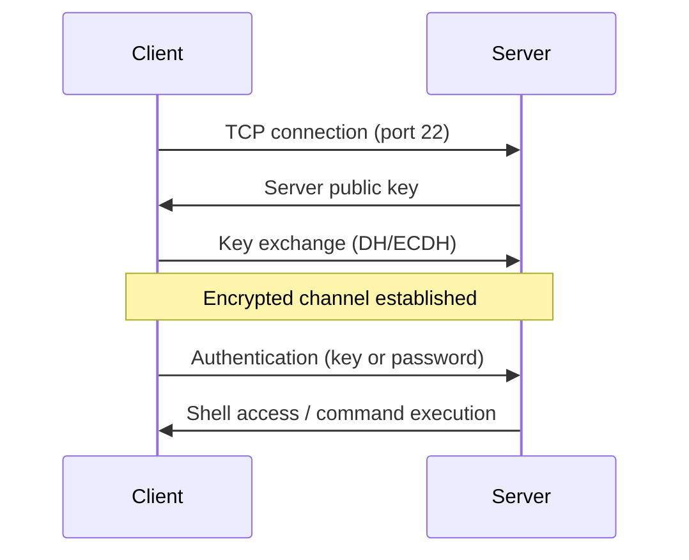

# 🔑 SSH — Secure Shell Reference

> **Secure remote access, tunneling, and file transfer.** Connect to servers, manage keys, forward ports, transfer files, and configure jump hosts — securely.

---

## 📑 Table of Contents

- [Concepts](#-concepts)
- [Basic Connections](#-basic-connections)
- [Key Management](#-key-management)
- [SSH Config File](#-ssh-config-file)
- [Tunneling & Port Forwarding](#-tunneling--port-forwarding)
- [SCP & SFTP](#-scp--sftp)
- [Jump Hosts (Bastion)](#-jump-hosts-bastion)
- [SSH Agent](#-ssh-agent)
- [Advanced Usage](#-advanced-usage)
- [Troubleshooting](#-troubleshooting)
- [Security Best Practices](#-security-best-practices)
- [Related Topics](#-related-topics)

---

## 💡 Concepts

SSH (Secure Shell) provides encrypted communication between two hosts over an insecure network. It uses public-key cryptography for authentication and encrypts all traffic.



### Key Terms

| Term | Description |
|------|-------------|
| **Public Key** | Shared freely, placed on servers (`~/.ssh/authorized_keys`) |
| **Private Key** | Kept secret on client (`~/.ssh/id_ed25519`) |
| **Known Hosts** | Trusted server fingerprints (`~/.ssh/known_hosts`) |
| **SSH Agent** | Daemon that caches decrypted private keys in memory |
| **Port Forwarding** | Tunneling traffic through SSH connection |
| **Bastion/Jump Host** | Intermediate server used to reach internal hosts |

### Important Files

| File | Location | Purpose |
|------|----------|---------|
| `~/.ssh/id_ed25519` | Client | Private key |
| `~/.ssh/id_ed25519.pub` | Client | Public key |
| `~/.ssh/config` | Client | Connection configuration |
| `~/.ssh/known_hosts` | Client | Trusted server fingerprints |
| `~/.ssh/authorized_keys` | Server | Authorized public keys |
| `/etc/ssh/sshd_config` | Server | SSH server configuration |

---

## 🔌 Basic Connections

```bash
# Connect with default user
ssh hostname

# Connect with specific user
ssh user@hostname
ssh -l user hostname

# Connect on non-standard port
ssh -p 2222 user@hostname

# Run a single command
ssh user@hostname 'uptime'
ssh user@hostname 'df -h && free -h'

# Run command with sudo
ssh user@hostname 'sudo systemctl restart nginx'

# Pipe data through SSH
cat local-file.txt | ssh user@hostname 'cat > /tmp/remote-file.txt'
ssh user@hostname 'cat /var/log/app.log' | grep "ERROR"

# Compressed connection (useful for slow links)
ssh -C user@hostname

# Force specific identity file
ssh -i ~/.ssh/my-key user@hostname

# Force IPv4 or IPv6
ssh -4 user@hostname
ssh -6 user@hostname

# Disable host key checking (INSECURE — scripting/ephemeral hosts only)
ssh -o StrictHostKeyChecking=no -o UserKnownHostsFile=/dev/null user@hostname
```

---

## 🔐 Key Management

### Generate Keys

```bash
# Ed25519 (recommended — modern, fast, secure)
ssh-keygen -t ed25519 -C "your_email@example.com"

# RSA (widely compatible, use 4096 bits)
ssh-keygen -t rsa -b 4096 -C "your_email@example.com"

# Custom filename
ssh-keygen -t ed25519 -f ~/.ssh/my-project-key -C "project-key"

# Generate without passphrase (for automation — less secure)
ssh-keygen -t ed25519 -f ~/.ssh/deploy-key -N ""
```

**Interactive output:**
```
$ ssh-keygen -t ed25519 -C "user@example.com"
Generating public/private ed25519 key pair.
Enter file in which to save the key (/home/user/.ssh/id_ed25519):
Enter passphrase (empty for no passphrase):
Enter same passphrase again:
Your identification has been saved in /home/user/.ssh/id_ed25519
Your public key has been saved in /home/user/.ssh/id_ed25519.pub
The key fingerprint is:
SHA256:AbCdEfGhIjKlMnOpQrStUvWxYz1234567890abcdef user@example.com
```

### Copy Key to Server

```bash
# Automatic method (preferred)
ssh-copy-id user@hostname
ssh-copy-id -i ~/.ssh/my-key.pub user@hostname
ssh-copy-id -p 2222 user@hostname

# Manual method
cat ~/.ssh/id_ed25519.pub | ssh user@hostname 'mkdir -p ~/.ssh && chmod 700 ~/.ssh && cat >> ~/.ssh/authorized_keys && chmod 600 ~/.ssh/authorized_keys'
```

### Key Fingerprints

```bash
# View key fingerprint
ssh-keygen -lf ~/.ssh/id_ed25519.pub

# View server's key fingerprint
ssh-keygen -lf /etc/ssh/ssh_host_ed25519_key.pub

# SHA256 format (default)
ssh-keygen -lf ~/.ssh/id_ed25519.pub
# 256 SHA256:AbCdEf... user@example.com (ED25519)

# Verify remote host fingerprint
ssh-keyscan hostname 2>/dev/null | ssh-keygen -lf -
```

### Change Key Passphrase

```bash
ssh-keygen -p -f ~/.ssh/id_ed25519
```

### Required Permissions

```bash
chmod 700 ~/.ssh
chmod 600 ~/.ssh/id_ed25519          # Private key
chmod 644 ~/.ssh/id_ed25519.pub      # Public key
chmod 600 ~/.ssh/authorized_keys     # Server-side
chmod 644 ~/.ssh/known_hosts
chmod 644 ~/.ssh/config
```

> **Critical:** SSH will refuse to use a private key with wrong permissions (too open). Always `chmod 600` private keys.

---

## ⚙️ SSH Config File

The SSH config (`~/.ssh/config`) simplifies connections by storing host-specific settings.

### Basic Config

```
# ~/.ssh/config

# Simple host alias
Host webserver
    HostName 10.0.1.50
    User deploy
    Port 22
    IdentityFile ~/.ssh/deploy-key

# Production bastion
Host bastion-prod
    HostName bastion.prod.example.com
    User ec2-user
    IdentityFile ~/.ssh/prod-key
    ForwardAgent yes

# Connect to internal hosts via bastion
Host prod-app-*
    User ec2-user
    ProxyJump bastion-prod
    IdentityFile ~/.ssh/prod-key

Host prod-app-1
    HostName 10.0.1.100

Host prod-app-2
    HostName 10.0.1.101

# Wildcard — defaults for all hosts
Host *
    ServerAliveInterval 60
    ServerAliveCountMax 3
    AddKeysToAgent yes
    IdentitiesOnly yes
```

Now you can just type:
```bash
ssh webserver               # Instead of: ssh -i ~/.ssh/deploy-key deploy@10.0.1.50
ssh prod-app-1              # Auto-jumps through bastion
```

### Common Config Options

| Option | Description |
|--------|-------------|
| `HostName` | Actual hostname or IP |
| `User` | Login username |
| `Port` | SSH port |
| `IdentityFile` | Path to private key |
| `ProxyJump` | Jump host(s) |
| `ForwardAgent` | Forward SSH agent to remote |
| `ServerAliveInterval` | Keepalive interval (seconds) |
| `ServerAliveCountMax` | Max missed keepalives before disconnect |
| `StrictHostKeyChecking` | `yes`, `no`, or `ask` |
| `AddKeysToAgent` | Auto-add keys to agent |
| `LocalForward` | Persistent local port forward |
| `RemoteForward` | Persistent remote port forward |
| `Compression` | Enable compression |
| `IdentitiesOnly` | Only use specified identity files |

---

## 🚇 Tunneling & Port Forwarding

### Local Port Forwarding (-L)

Forward a local port to a remote destination through the SSH server.

```
Local Machine:8080 → SSH Server → Remote Service:80
```


```bash
# Access remote database from local machine
ssh -L 5432:db.internal:5432 user@bastion

# Access remote web service
ssh -L 8080:localhost:80 user@webserver

# Background tunnel (no shell)
ssh -L 5432:db.internal:5432 -N -f user@bastion
#   -N  Don't execute remote command
#   -f  Go to background

# Multiple forwards
ssh -L 5432:db.internal:5432 -L 6379:redis.internal:6379 user@bastion
```

### Remote Port Forwarding (-R)

Make a local service accessible from the remote server.

```
Remote Server:9090 → SSH Tunnel → Local Machine:3000
```

```bash
# Expose local dev server to remote
ssh -R 9090:localhost:3000 user@remote-server

# Anyone on remote network can access your local app at remote-server:9090
```

### Dynamic Port Forwarding (SOCKS Proxy)

Create a SOCKS proxy through the SSH connection.

```bash
# Start SOCKS proxy on local port 1080
ssh -D 1080 user@remote-server

# Background SOCKS proxy
ssh -D 1080 -N -f user@remote-server

# Use with curl
curl --socks5 localhost:1080 https://internal.example.com

# Use with browser (configure SOCKS proxy: localhost:1080)
```

### Persistent Tunnels in Config

```
# ~/.ssh/config
Host tunnel-db
    HostName bastion.example.com
    User ec2-user
    LocalForward 5432 db.internal:5432
    LocalForward 6379 redis.internal:6379
    IdentityFile ~/.ssh/prod-key
    ServerAliveInterval 30
```

```bash
ssh -N tunnel-db              # Start tunnel (no shell)
```

---

## 📁 SCP & SFTP

### SCP (Secure Copy)

```bash
# Copy local file to remote
scp file.txt user@host:/path/to/dest/
scp -P 2222 file.txt user@host:/tmp/     # Non-standard port

# Copy remote file to local
scp user@host:/var/log/app.log ./

# Copy directory recursively
scp -r ./project/ user@host:/opt/deploy/

# Copy between two remote hosts
scp user@host1:/data/file.txt user@host2:/backup/

# With specific key
scp -i ~/.ssh/my-key file.txt user@host:/tmp/

# Preserve timestamps and permissions
scp -p file.txt user@host:/tmp/
```

### SFTP (Secure FTP)

```bash
# Connect
sftp user@host

# Interactive commands
sftp> ls                        # List remote files
sftp> lls                       # List local files
sftp> cd /var/log               # Change remote directory
sftp> lcd /tmp                  # Change local directory
sftp> get remote-file.txt       # Download file
sftp> put local-file.txt        # Upload file
sftp> mget *.log                # Download multiple files
sftp> mput *.conf               # Upload multiple files
sftp> mkdir new-dir             # Create remote directory
sftp> rm old-file.txt           # Delete remote file
sftp> exit                      # Disconnect
```

### rsync over SSH (Preferred for Large Transfers)

```bash
# Sync directory to remote
rsync -avz --progress ./project/ user@host:/opt/deploy/

# Sync with delete (mirror)
rsync -avz --delete ./project/ user@host:/opt/deploy/

# Dry run first
rsync -avzn ./project/ user@host:/opt/deploy/

# With specific SSH key
rsync -avz -e "ssh -i ~/.ssh/my-key" ./data/ user@host:/backup/
```

---

## 🏰 Jump Hosts (Bastion)

### ProxyJump (Modern — Recommended)

```bash
# Command line
ssh -J bastion-user@bastion target-user@internal-host

# Multiple jumps
ssh -J bastion1,bastion2 user@final-host

# In config
# ~/.ssh/config
Host internal-server
    HostName 10.0.1.100
    User ec2-user
    ProxyJump bastion-user@bastion.example.com
```

### ProxyCommand (Legacy)

```bash
# In config
Host internal-server
    HostName 10.0.1.100
    User ec2-user
    ProxyCommand ssh -W %h:%p bastion-user@bastion.example.com
```

### SCP Through Jump Host

```bash
scp -J bastion-user@bastion file.txt target-user@10.0.1.100:/tmp/
```

---

## 🕵️ SSH Agent

SSH Agent caches decrypted private keys in memory so you don't retype passphrases.

```bash
# Start agent (usually auto-started by desktop environment)
eval "$(ssh-agent -s)"

# Add key to agent
ssh-add ~/.ssh/id_ed25519
ssh-add ~/.ssh/my-project-key

# Add with timeout (8 hours)
ssh-add -t 8h ~/.ssh/id_ed25519

# List cached keys
ssh-add -l

# Remove specific key
ssh-add -d ~/.ssh/id_ed25519

# Remove all keys
ssh-add -D

# Agent forwarding (use local keys on remote hosts)
ssh -A user@bastion                 # Forward agent to bastion
# Now on bastion, you can ssh to other hosts using your local keys
```

> **Warning:** Agent forwarding (`-A` / `ForwardAgent yes`) exposes your keys to the remote host's admin. Only use with trusted hosts. Consider `ProxyJump` instead.

---

## 🔬 Advanced Usage

### Multiplexing (Connection Sharing)

```
# ~/.ssh/config
Host *
    ControlMaster auto
    ControlPath ~/.ssh/sockets/%r@%h-%p
    ControlPersist 600
```

```bash
mkdir -p ~/.ssh/sockets
# First connection creates a master socket
# Subsequent connections reuse it (instant login, no auth)
```

### Escape Sequences

While in an SSH session:

| Sequence | Action |
|----------|--------|
| `~.` | Disconnect (kill hung session) |
| `~^Z` | Suspend SSH |
| `~#` | List forwarded connections |
| `~&` | Background SSH (when waiting for forwarding) |
| `~?` | Show escape help |
| `~C` | Open command line (add forwards dynamically) |

> Press `Enter` first, then the escape sequence.

### X11 Forwarding

```bash
ssh -X user@host                    # Forward X11 (with security restrictions)
ssh -Y user@host                    # Trusted X11 forwarding (less secure)

# Run graphical app on remote, display locally
ssh -X user@host 'firefox'
```

### SSH Certificates (Enterprise)

```bash
# Sign a public key with a CA
ssh-keygen -s ca-key -I "user@company" -n user -V +52w user-key.pub

# Verify certificate
ssh-keygen -Lf user-key-cert.pub
```

---

## 🐛 Troubleshooting

### Verbose Debugging

```bash
ssh -v user@host                    # Basic debug
ssh -vv user@host                   # More verbose
ssh -vvv user@host                  # Maximum verbosity
```

### Common Issues

| Problem | Diagnosis | Solution |
|---------|-----------|----------|
| `Permission denied (publickey)` | Key not accepted | Check key permissions (`chmod 600`), verify key in `authorized_keys`, check username |
| `Connection refused` | SSH not running or wrong port | Verify sshd is running, check port (`ss -tlnp \| grep ssh`) |
| `Connection timed out` | Firewall or network issue | Check security groups/firewall, verify IP/hostname |
| `Host key verification failed` | Server key changed | Remove old key: `ssh-keygen -R hostname`, then reconnect |
| `Too many authentication failures` | Too many keys offered | Use `IdentitiesOnly yes` and specify `IdentityFile` |
| Slow connection | DNS reverse lookup | Add `UseDNS no` in `/etc/ssh/sshd_config` |
| Session hangs on disconnect | Dead connections | Set `ServerAliveInterval 60` in config |
| `Agent refused operation` | Agent key issue | Check `ssh-add -l`, re-add key |
| Broken pipe / disconnect | Idle timeout | Set keepalive: `ServerAliveInterval 60` |

### Permission Check Workflow

```bash
# On client
ls -la ~/.ssh/
# drwx------ (700) for .ssh/
# -rw------- (600) for private keys
# -rw-r--r-- (644) for public keys and config

# On server
ls -la ~/.ssh/
# -rw------- (600) for authorized_keys
# Check the home directory isn't group/world-writable
ls -ld ~
```

### Test Connection

```bash
# Test SSH connectivity
ssh -T git@github.com               # Test GitHub SSH
ssh -o ConnectTimeout=5 user@host   # Quick connectivity test
ssh -v user@host 'echo OK' 2>&1 | grep -E "^(debug|Authenticated|OK)"
```

---

## 🛡️ Security Best Practices

### Server Configuration (`/etc/ssh/sshd_config`)

```
# Disable root login
PermitRootLogin no

# Disable password authentication (key only)
PasswordAuthentication no
ChallengeResponseAuthentication no

# Use only SSH protocol 2
Protocol 2

# Limit users/groups
AllowUsers deploy admin
# or
AllowGroups ssh-users

# Change default port (security through obscurity, minor benefit)
Port 2222

# Disable empty passwords
PermitEmptyPasswords no

# Limit authentication attempts
MaxAuthTries 3

# Session timeout
ClientAliveInterval 300
ClientAliveCountMax 2

# Disable agent forwarding globally
AllowAgentForwarding no

# Disable X11 forwarding
X11Forwarding no
```

### Client Best Practices

- **Use Ed25519 keys** — strongest and fastest algorithm
- **Always use passphrases** on keys (use ssh-agent for convenience)
- **Use `~/.ssh/config`** — avoid typing long commands
- **Use `ProxyJump`** instead of agent forwarding when possible
- **Set `IdentitiesOnly yes`** to prevent offering all keys
- **Review `known_hosts`** periodically
- **Rotate keys** regularly, especially for service accounts

---

## 🔗 Related Topics

- [🧰 CLI Command Center](../) — All CLI tool references
- [Networking](../networking/) — DNS, connectivity tools
- [curl](../curl/) — HTTP through SSH tunnels
- [🔐 Security](../../security/) — TLS, certificates, authentication
- [🐛 Troubleshooting](../../troubleshooting/) — Connection debugging

---

> **Tip:** Use `ssh -J` (ProxyJump) instead of agent forwarding when accessing internal hosts. It's more secure — your keys never leave your machine.
