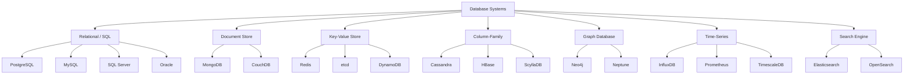

# 🗄 Databases

> **Choosing the right database is one of the most impactful architectural decisions you'll make.** This section covers relational and NoSQL databases, their strengths, trade-offs, and practical usage for production systems.

---

## 📑 Table of Contents

- [Database Landscape](#-database-landscape)
- [SQL vs NoSQL](#-sql-vs-nosql)
- [CAP Theorem & Databases](#-cap-theorem--databases)
- [Choosing the Right Database](#-choosing-the-right-database)
- [Topics](#-topics)
- [Quick Reference](#-quick-reference)
- [Related Topics](#-related-topics)

---

## 🧠 Database Landscape



---

## ⚖️ SQL vs NoSQL

| Feature | SQL (Relational) | NoSQL |
|---------|-----------------|-------|
| **Schema** | Fixed schema (tables, columns, types) | Flexible schema (JSON, key-value) |
| **Query language** | SQL (standardized) | Varies by database |
| **Relationships** | First-class (JOINs, foreign keys) | Application-level or denormalized |
| **Transactions** | Full ACID support | Varies (some support ACID) |
| **Scaling** | Primarily vertical | Designed for horizontal scaling |
| **Consistency** | Strong by default | Eventual or tunable |
| **Best for** | Complex queries, relationships, transactions | High throughput, flexible schema, scale |

### When to Choose SQL

- Complex relationships between entities (users → orders → products)
- Need for ACID transactions (financial systems, inventory)
- Complex queries with JOINs, aggregations, window functions
- Data integrity is critical
- Schema is well-defined and stable

### When to Choose NoSQL

- High write throughput requirements
- Schema evolves frequently
- Data is naturally denormalized (documents, events)
- Horizontal scaling across many nodes
- Simple access patterns (key lookup, time-series append)

---

## 📐 CAP Theorem & Databases

| Database | Type | CAP | Consistency Model |
|----------|------|-----|-------------------|
| **PostgreSQL** | Relational | CP | Strong (single node), configurable replication |
| **MySQL** | Relational | CP | Strong (single node) |
| **MongoDB** | Document | CP (default) | Strong (single doc), tunable |
| **Redis** | Key-Value | CP (Sentinel) / AP (Cluster) | Eventual (async replication) |
| **Cassandra** | Column-Family | AP | Tunable (ONE to ALL) |
| **DynamoDB** | Key-Value/Document | AP (default) | Eventually consistent, optional strong |
| **CockroachDB** | Distributed SQL | CP | Serializable |
| **etcd** | Key-Value | CP | Linearizable |
| **Elasticsearch** | Search | AP | Near real-time (refresh interval) |

---

## 🎯 Choosing the Right Database

| Use Case | Recommended | Why |
|----------|-------------|-----|
| General-purpose OLTP | **PostgreSQL** | Feature-rich, reliable, extensible |
| High-speed caching | **Redis** | In-memory, sub-millisecond latency |
| Full-text search | **Elasticsearch / OpenSearch** | Inverted index, relevance scoring |
| Time-series metrics | **TimescaleDB / InfluxDB** | Optimized for time-series workloads |
| Document storage | **MongoDB** | Flexible schema, rich queries |
| Wide-column / IoT | **Cassandra / ScyllaDB** | High write throughput, horizontal scale |
| Graph relationships | **Neo4j** | Optimized for traversal queries |
| Distributed SQL | **CockroachDB / Spanner** | Global distribution, strong consistency |
| Session storage | **Redis** | Fast reads, TTL support |
| Configuration | **etcd / Consul** | Strong consistency, watch support |

### Decision Framework

```text
1. What are your access patterns?
   └── Key lookup → Key-Value (Redis, DynamoDB)
   └── Complex queries/JOINs → Relational (PostgreSQL)
   └── Full-text search → Search engine (Elasticsearch)
   └── Graph traversal → Graph (Neo4j)

2. What are your consistency requirements?
   └── Strong consistency → PostgreSQL, etcd, CockroachDB
   └── Eventual consistency is OK → Cassandra, DynamoDB, Redis

3. What are your scale requirements?
   └── Single node is fine → PostgreSQL, MySQL
   └── Need horizontal scaling → Cassandra, DynamoDB, MongoDB

4. What's your read/write ratio?
   └── Read-heavy → PostgreSQL + Redis cache
   └── Write-heavy → Cassandra, Kafka + consumer
   └── Balanced → MongoDB, DynamoDB
```

---

## 📚 Topics

| Topic | Description | Key Features |
|-------|-------------|-------------|
| [PostgreSQL](postgresql/) | Advanced relational database | MVCC, JSONB, extensions, window functions |
| [Redis](redis/) | In-memory data structure store | Caching, pub/sub, streams, sorted sets |

---

## ⚡ Quick Reference

### Database Port Defaults

| Database | Default Port |
|----------|-------------|
| PostgreSQL | 5432 |
| MySQL | 3306 |
| MongoDB | 27017 |
| Redis | 6379 |
| Elasticsearch | 9200 |
| Cassandra | 9042 |
| etcd | 2379 |

### Common Operations Comparison

| Operation | PostgreSQL | MongoDB | Redis |
|-----------|-----------|---------|-------|
| Create | `INSERT INTO users ...` | `db.users.insertOne({...})` | `SET user:1 {...}` |
| Read | `SELECT * FROM users WHERE id=1` | `db.users.findOne({_id: 1})` | `GET user:1` |
| Update | `UPDATE users SET ... WHERE id=1` | `db.users.updateOne({_id:1}, ...)` | `SET user:1 {...}` |
| Delete | `DELETE FROM users WHERE id=1` | `db.users.deleteOne({_id: 1})` | `DEL user:1` |
| Count | `SELECT COUNT(*) FROM users` | `db.users.countDocuments()` | `DBSIZE` |

---

## 🔗 Related Topics

- [Distributed Systems — Consensus](../distributed-systems/consensus/) — CAP theorem and consistency models
- [Distributed Systems — Caching](../distributed-systems/caching/) — Caching strategies with databases
- [Search — Elasticsearch](../search/elasticsearch/) — Full-text search capabilities
- [Security — Vault](../security/vault/) — Dynamic database credentials
- [System Design](../system-design/) — Database selection in system design

---

> **There is no one-size-fits-all database.** The best database depends on your data model, access patterns, consistency requirements, and scale needs. Many production systems use multiple databases for different purposes — this is called polyglot persistence.
