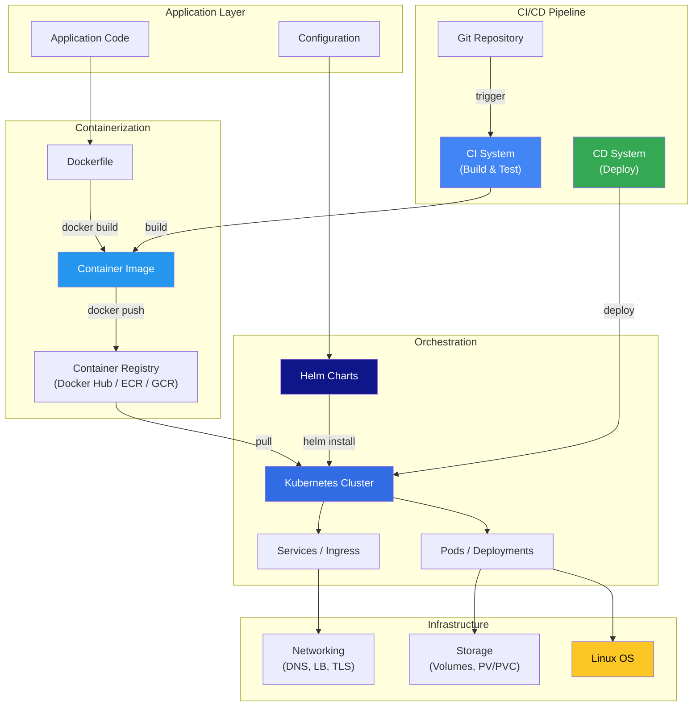
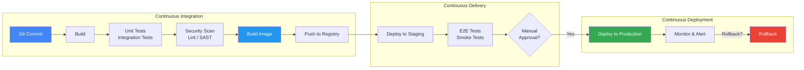

# 🚀 DevOps — Comprehensive Knowledge Base

> **Infrastructure, automation, and operations.** From containers and orchestration to networking, Linux internals, and CI/CD — everything a DevOps engineer needs to build, deploy, and operate production systems.

---

## 📑 Table of Contents

- [Overview](#-overview)
- [Technology Landscape](#-technology-landscape)
- [Subsections](#-subsections)
- [How Technologies Relate](#-how-technologies-relate)
- [CI/CD Pipeline Flow](#-cicd-pipeline-flow)
- [Quick Reference](#-quick-reference)
- [Learning Path](#-learning-path)
- [Related Topics](#-related-topics)

---

## 💡 Overview

DevOps bridges development and operations through automation, infrastructure as code, continuous integration/delivery, and monitoring. This section covers the core technologies and concepts every DevOps engineer must understand:

| Pillar | Description | Key Technologies |
|--------|-------------|-----------------|
| **Containerization** | Package and isolate applications | Docker, containerd, OCI |
| **Orchestration** | Manage containers at scale | Kubernetes, Helm |
| **Infrastructure** | Manage servers and networks | Linux, networking, storage |
| **CI/CD** | Automate build, test, deploy | GitHub Actions, Jenkins, GitLab CI, ArgoCD |
| **Observability** | Monitor and alert on systems | Prometheus, Grafana, OpenTelemetry |
| **Security** | Secure infrastructure and apps | TLS, RBAC, secrets management, Vault |

---

## 📂 Subsections

| Section | Description | Key Topics |
|---------|-------------|------------|
| [🐳 Docker](docker/) | Container runtime deep-dive | Images, networking, storage, Compose, security |
| [☸️ Kubernetes](kubernetes/) | Container orchestration | Pods, services, deployments, RBAC, networking |
| [⎈ Helm](helm/) | Kubernetes package manager | Charts, templates, values, hooks, releases |
| [🌐 Networking](networking/) | Network fundamentals | OSI, TCP/IP, DNS, TLS, load balancing, proxies |
| [🐧 Linux](linux/) | Linux for DevOps | Filesystem, processes, systemd, performance, security |

---

## 🗺️ How Technologies Relate



---

## 🔄 CI/CD Pipeline Flow



### CI/CD Stages Explained

| Stage | Purpose | Tools |
|-------|---------|-------|
| **Build** | Compile code, resolve dependencies | Docker, Maven, npm, go build |
| **Test** | Run unit and integration tests | pytest, go test, Jest, JUnit |
| **Scan** | Check for vulnerabilities and code quality | Trivy, Snyk, SonarQube, checkov |
| **Package** | Build container image | Docker, Buildah, kaniko |
| **Push** | Store image in registry | Docker Hub, ECR, GCR, Harbor |
| **Deploy Staging** | Deploy to non-production environment | Helm, kubectl, ArgoCD, Flux |
| **E2E Test** | Validate end-to-end functionality | Cypress, Selenium, k6 |
| **Deploy Production** | Release to users | Helm, ArgoCD, Spinnaker |
| **Monitor** | Observe health and performance | Prometheus, Grafana, Datadog |

---

## ⚡ Quick Reference

### Docker Essentials

```bash
docker build -t myapp:1.0 .          # Build image
docker run -d -p 8080:80 myapp:1.0   # Run container
docker compose up -d                  # Start stack
docker system prune -a                # Clean up
```

→ [Full Docker Reference](docker/) | [Docker CLI](../cli/docker/)

### Kubernetes Essentials

```bash
kubectl apply -f deployment.yaml      # Apply manifest
kubectl get pods -A                   # All pods
kubectl logs <pod> -f                 # Follow logs
kubectl exec -it <pod> -- sh          # Shell into pod
```

→ [Full Kubernetes Reference](kubernetes/) | [kubectl CLI](../cli/kubectl/)

### Helm Essentials

```bash
helm install myapp ./chart            # Install chart
helm upgrade myapp ./chart            # Upgrade release
helm rollback myapp 1                 # Rollback
helm list -A                          # List releases
```

→ [Full Helm Reference](helm/) | [Helm CLI](../cli/helm/)

---

## 🎯 Learning Path

### Beginner → Intermediate → Advanced

```
1. Linux Fundamentals        → cli/linux/, devops/linux/
2. Networking Basics         → devops/networking/
3. Docker & Containers       → devops/docker/, cli/docker/
4. Kubernetes Basics         → devops/kubernetes/, cli/kubectl/
5. Helm & Package Management → devops/helm/, cli/helm/
6. CI/CD Pipelines           → devops/ (this page)
7. Observability             → observability/
8. Security                  → security/
9. System Design             → system-design/
```

| Milestone | You Should Be Able To |
|-----------|----------------------|
| **Level 1** | Write Dockerfiles, run containers, understand Linux basics |
| **Level 2** | Deploy to Kubernetes, create Helm charts, set up CI pipelines |
| **Level 3** | Design production-grade infrastructure, debug distributed systems, implement GitOps |

---

## 🔗 Related Topics

| Topic | Link |
|-------|------|
| Docker CLI Reference | [cli/docker/](../cli/docker/) |
| kubectl CLI Reference | [cli/kubectl/](../cli/kubectl/) |
| Helm CLI Reference | [cli/helm/](../cli/helm/) |
| Linux CLI Reference | [cli/linux/](../cli/linux/) |
| Networking CLI Reference | [cli/networking/](../cli/networking/) |
| Observability | [observability/](../observability/) |
| Security | [security/](../security/) |
| Troubleshooting | [troubleshooting/](../troubleshooting/) |
| System Design | [system-design/](../system-design/) |
| Learning Paths | [learning/devops-engineer.md](../learning/devops-engineer.md) |

---

> **Next:** Start with [Docker](docker/) if you're new to containers, or jump to [Kubernetes](kubernetes/) if you already know Docker.
