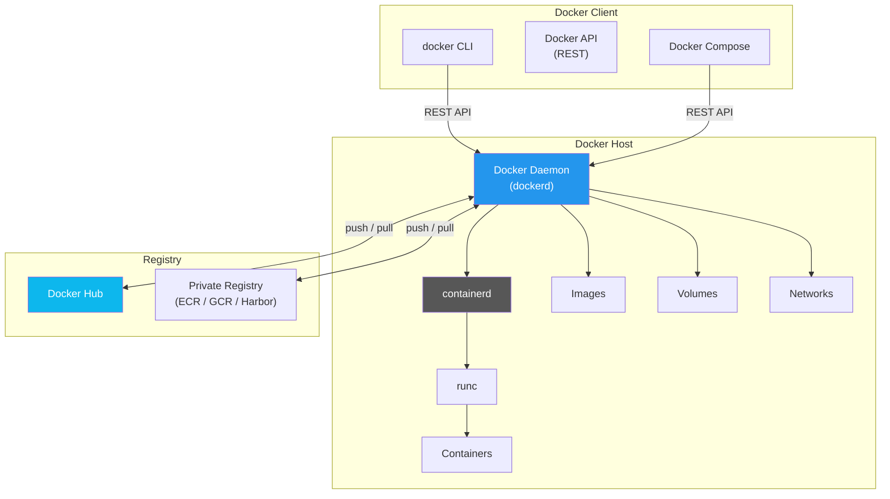
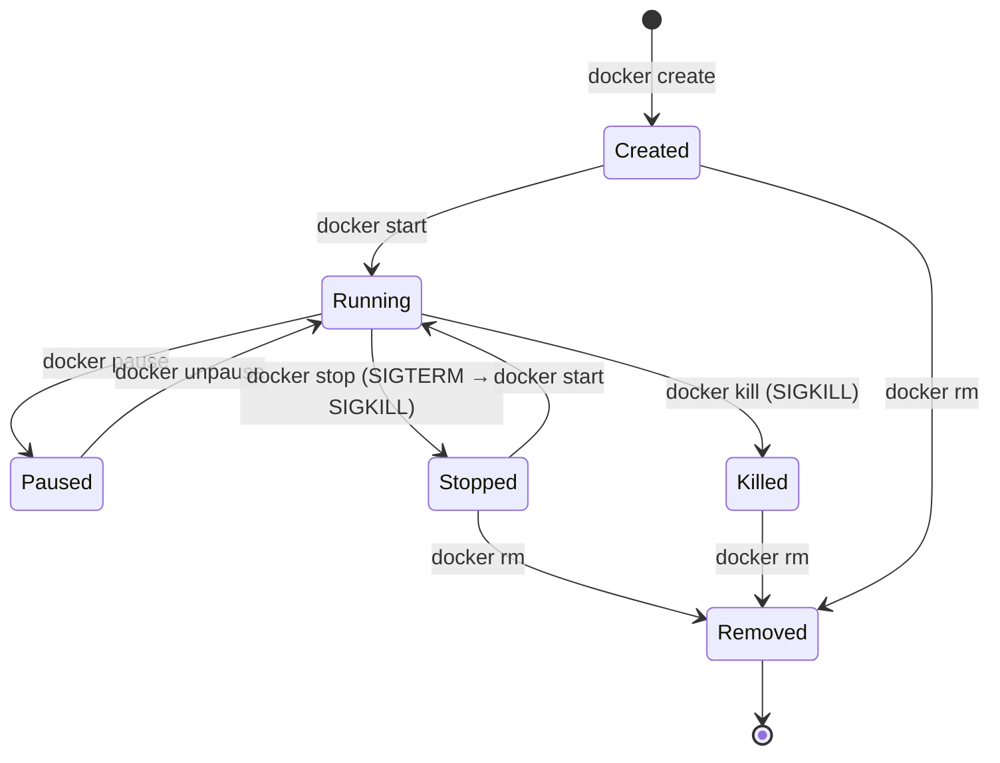
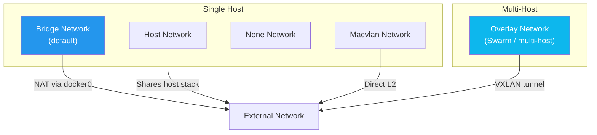

# 🐳 Docker — Deep Dive

> **Containerization concepts, architecture, and production best practices.** This guide covers Docker from fundamentals to advanced production patterns. For CLI commands and syntax, see [cli/docker/](../../cli/docker/).

---

## 📑 Table of Contents

- [What is Docker?](#-what-is-docker)
- [Docker vs Virtual Machines](#-docker-vs-virtual-machines)
- [Architecture](#-architecture)
- [Images](#-images)
- [Image Layers & Build Cache](#-image-layers--build-cache)
- [Containers](#-containers)
- [Container Lifecycle](#-container-lifecycle)
- [Resource Limits](#-resource-limits)
- [Health Checks](#-health-checks)
- [Networking](#-networking)
- [Storage](#-storage)
- [Docker Compose](#-docker-compose)
- [Dockerfile Best Practices](#-dockerfile-best-practices)
- [Multi-stage Builds](#-multi-stage-builds)
- [Security](#-security)
- [Registry & Image Management](#-registry--image-management)
- [Production Considerations](#-production-considerations)
- [Troubleshooting](#-troubleshooting)
- [Related Topics](#-related-topics)

---

## 💡 What is Docker?

Docker is a platform for building, shipping, and running applications in **containers** — lightweight, standalone packages that include everything needed to run an application: code, runtime, system tools, libraries, and settings.

### Containerization Concepts

| Concept | Description |
|---------|-------------|
| **Container** | An isolated process running on a shared OS kernel with its own filesystem, networking, and process space |
| **Image** | A read-only template containing application code, dependencies, and configuration — the blueprint for containers |
| **Dockerfile** | A text file with instructions to build an image layer by layer |
| **Registry** | A storage and distribution service for container images (Docker Hub, ECR, GCR, Harbor) |
| **OCI** | Open Container Initiative — industry standard for container formats and runtimes |

### Key Principles

- **Containers are processes, not VMs.** They share the host kernel and exit when the main process completes.
- **Images are immutable.** Once built, an image never changes. New changes create new images.
- **Containers are ephemeral.** Treat them as disposable. Persist data using volumes, not the container filesystem.
- **One process per container.** Each container should run a single concern (web server, database, queue worker).

---

## ⚖️ Docker vs Virtual Machines

```
┌─────────────────────────────────────────────────────────┐
│                   Virtual Machines                       │
│  ┌──────────┐  ┌──────────┐  ┌──────────┐              │
│  │   App A  │  │   App B  │  │   App C  │              │
│  │  Bins/Lib│  │  Bins/Lib│  │  Bins/Lib│              │
│  │ Guest OS │  │ Guest OS │  │ Guest OS │              │
│  └──────────┘  └──────────┘  └──────────┘              │
│  ┌─────────────────────────────────────────┐            │
│  │             Hypervisor                   │            │
│  └─────────────────────────────────────────┘            │
│  ┌─────────────────────────────────────────┐            │
│  │             Host OS                      │            │
│  └─────────────────────────────────────────┘            │
└─────────────────────────────────────────────────────────┘

┌─────────────────────────────────────────────────────────┐
│                     Containers                           │
│  ┌──────────┐  ┌──────────┐  ┌──────────┐              │
│  │   App A  │  │   App B  │  │   App C  │              │
│  │  Bins/Lib│  │  Bins/Lib│  │  Bins/Lib│              │
│  └──────────┘  └──────────┘  └──────────┘              │
│  ┌─────────────────────────────────────────┐            │
│  │          Container Runtime (Docker)      │            │
│  └─────────────────────────────────────────┘            │
│  ┌─────────────────────────────────────────┐            │
│  │             Host OS (Shared Kernel)      │            │
│  └─────────────────────────────────────────┘            │
└─────────────────────────────────────────────────────────┘
```

| Aspect | Containers | Virtual Machines |
|--------|-----------|-----------------|
| **Startup Time** | Milliseconds to seconds | Minutes |
| **Size** | MBs (image layers) | GBs (full OS) |
| **Isolation** | Process-level (cgroups, namespaces) | Hardware-level (hypervisor) |
| **OS** | Shares host kernel | Own kernel per VM |
| **Performance** | Near-native | Overhead from hypervisor |
| **Density** | Hundreds per host | Tens per host |
| **Security** | Good (can be hardened) | Stronger isolation by default |
| **Use Case** | Microservices, CI/CD, dev environments | Legacy apps, different OS kernels, strict isolation |

> **They complement each other.** Many production setups run containers inside VMs for defense-in-depth isolation.

---

## 🏗️ Architecture



### Component Responsibilities

| Component | Role |
|-----------|------|
| **Docker Client** | CLI that sends commands to the daemon via REST API |
| **Docker Daemon (dockerd)** | Manages images, containers, networks, and volumes. Listens on a Unix socket or TCP |
| **containerd** | Industry-standard container runtime. Manages the complete container lifecycle |
| **runc** | Low-level OCI runtime that creates and runs containers using Linux kernel features |
| **Registry** | Stores and distributes container images. Docker Hub is the default public registry |

### Communication Flow

1. User runs `docker run nginx`
2. Docker CLI sends request to daemon via REST API
3. Daemon checks for image locally; pulls from registry if missing
4. Daemon instructs containerd to create container
5. containerd uses runc to create the container process with namespaces and cgroups
6. Container runs as an isolated process on the host

---

## 📦 Images

An image is a read-only, layered filesystem that contains everything needed to run an application.

### Image Identification

```bash
# Full image reference format
[registry/][repository/]name[:tag|@digest]

# Examples
nginx                                    # Docker Hub, latest tag (implicit)
nginx:1.25-alpine                        # Docker Hub, specific tag
docker.io/library/nginx:1.25             # Fully qualified
myregistry.com/team/myapp:v2.1.0         # Private registry
myapp@sha256:abc123...                   # Pinned by digest (immutable)
```

### Image Tagging Strategy

| Strategy | Example | Use Case |
|----------|---------|----------|
| **Semantic Versioning** | `myapp:1.2.3` | Production releases |
| **Git SHA** | `myapp:a1b2c3d` | CI/CD traceability |
| **Branch + SHA** | `myapp:main-a1b2c3d` | Development builds |
| **Date-based** | `myapp:2026-08-31` | Nightly builds |
| **Latest** | `myapp:latest` | Development only (never in production) |

> ⚠️ **Never use `latest` in production.** It's mutable and makes rollbacks impossible. Always use specific, immutable tags or digests.

---

## 🧅 Image Layers & Build Cache

Every instruction in a Dockerfile creates a **layer**. Layers are cached and reused across builds and images.

```dockerfile
FROM python:3.12-slim          # Layer 1: Base image
WORKDIR /app                   # Layer 2: Set working directory
COPY requirements.txt .        # Layer 3: Copy requirements
RUN pip install -r requirements.txt  # Layer 4: Install dependencies
COPY . .                       # Layer 5: Copy application code
CMD ["python", "app.py"]       # Layer 6: Set default command
```

### How Layer Caching Works

```
Build 1 (cold):
  Layer 1: FROM python:3.12-slim    → Downloaded
  Layer 2: WORKDIR /app             → Created
  Layer 3: COPY requirements.txt .  → Created
  Layer 4: RUN pip install ...      → Created (slow)
  Layer 5: COPY . .                 → Created
  Layer 6: CMD [...]                → Created

Build 2 (code change only):
  Layer 1: FROM python:3.12-slim    → CACHED ✓
  Layer 2: WORKDIR /app             → CACHED ✓
  Layer 3: COPY requirements.txt .  → CACHED ✓ (file unchanged)
  Layer 4: RUN pip install ...      → CACHED ✓ (previous layer cached)
  Layer 5: COPY . .                 → REBUILT (code changed)
  Layer 6: CMD [...]                → REBUILT (layer above changed)
```

**Key Rule:** When a layer is invalidated, all subsequent layers are also invalidated. Order your Dockerfile instructions from least-frequently-changed to most-frequently-changed.

### Optimizing Layer Cache

```dockerfile
# ❌ Bad: Any code change invalidates dependency installation
COPY . .
RUN pip install -r requirements.txt

# ✅ Good: Dependencies only reinstall when requirements.txt changes
COPY requirements.txt .
RUN pip install -r requirements.txt
COPY . .
```

---

## 📦 Containers

### Container Lifecycle



| State | Description |
|-------|-------------|
| **Created** | Container exists but main process hasn't started |
| **Running** | Main process is executing |
| **Paused** | Process frozen (SIGSTOP via cgroup freezer) |
| **Stopped** | Process exited (gracefully or with error) |
| **Removed** | Container deleted from host |

### Graceful Shutdown

When `docker stop` is called:
1. Docker sends **SIGTERM** to PID 1 in the container
2. Waits for the **stop timeout** (default: 10 seconds)
3. If still running, sends **SIGKILL** (forced kill)

```bash
# Custom stop timeout
docker stop --time 30 mycontainer

# Your application must handle SIGTERM
# Python example:
# signal.signal(signal.SIGTERM, graceful_shutdown)
```

> ⚠️ If your container runs a shell script as PID 1, signals may not propagate to child processes. Use `exec` to replace the shell process or use `tini` as an init system.

---

## 🔒 Resource Limits

Containers can consume unlimited host resources by default. Always set limits in production.

```bash
# CPU limits
docker run --cpus="1.5" myapp          # Limit to 1.5 CPU cores
docker run --cpu-shares=512 myapp       # Relative weight (default: 1024)
docker run --cpuset-cpus="0,1" myapp    # Pin to specific cores

# Memory limits
docker run --memory="512m" myapp        # Hard memory limit
docker run --memory="512m" --memory-swap="1g" myapp  # Memory + swap limit
docker run --memory-reservation="256m" myapp          # Soft limit

# Combined
docker run -d \
  --cpus="2" \
  --memory="1g" \
  --memory-swap="2g" \
  --pids-limit=100 \
  myapp:1.0
```

| Flag | Description |
|------|-------------|
| `--cpus` | Number of CPUs (e.g., 1.5 = 1.5 cores) |
| `--cpu-shares` | Relative CPU weight (only under contention) |
| `--memory` | Hard memory limit (OOM killed if exceeded) |
| `--memory-reservation` | Soft limit (enforced under memory pressure) |
| `--memory-swap` | Total memory + swap limit |
| `--pids-limit` | Maximum number of processes |

---

## 🏥 Health Checks

Health checks let Docker monitor whether a container's application is working correctly, not just whether the process is running.

```dockerfile
# Dockerfile HEALTHCHECK
HEALTHCHECK --interval=30s --timeout=5s --start-period=10s --retries=3 \
  CMD curl -f http://localhost:8080/health || exit 1
```

```bash
# Runtime health check
docker run -d \
  --health-cmd="curl -f http://localhost:8080/health || exit 1" \
  --health-interval=30s \
  --health-timeout=5s \
  --health-retries=3 \
  --health-start-period=10s \
  myapp:1.0
```

| Parameter | Default | Description |
|-----------|---------|-------------|
| `--interval` | 30s | Time between health checks |
| `--timeout` | 30s | Time before check is considered failed |
| `--start-period` | 0s | Grace period for container startup |
| `--retries` | 3 | Consecutive failures before marking unhealthy |

Health check states: `starting` → `healthy` → `unhealthy`

```bash
# Check health status
docker inspect --format='{{.State.Health.Status}}' mycontainer
docker inspect --format='{{json .State.Health}}' mycontainer | jq
```

---

## 🌐 Networking

Docker creates isolated network environments for containers. Understanding networking is crucial for multi-container applications.

### Network Drivers



| Driver | Isolation | Performance | Use Case |
|--------|-----------|-------------|----------|
| **bridge** | Container-level | Good | Default for single-host containers |
| **host** | None (shares host) | Best | Performance-sensitive applications |
| **overlay** | Container-level | Good | Multi-host communication (Swarm) |
| **macvlan** | Container-level | Excellent | Containers needing direct L2 access |
| **none** | Complete | N/A | Security-sensitive containers (no networking) |

### Bridge Networking (Default)

```bash
# Default bridge — containers communicate by IP only
docker run -d --name web nginx
docker run -d --name app myapp

# Custom bridge — containers communicate by name (DNS)
docker network create mynet
docker run -d --name web --network mynet nginx
docker run -d --name app --network mynet myapp
# 'app' can reach 'web' at http://web:80
```

> **Always use custom bridge networks.** The default bridge doesn't provide DNS resolution between containers.

### DNS Resolution in Custom Networks

Docker's embedded DNS server (127.0.0.11) resolves container names to IP addresses within the same custom network:

```bash
# Inside 'app' container on 'mynet':
nslookup web         # Resolves to web container's IP
ping web             # Works by container name
curl http://web:80   # HTTP request by name
```

### Port Mapping

```bash
# Map host port to container port
docker run -d -p 8080:80 nginx          # Host 8080 → Container 80
docker run -d -p 127.0.0.1:8080:80 nginx  # Bind to localhost only
docker run -d -p 8080:80/udp nginx       # UDP port mapping
docker run -d -P nginx                   # Map all exposed ports to random host ports
```

### Host Networking

```bash
# Container shares host's network stack — no isolation, no port mapping needed
docker run -d --network host nginx
# Nginx listens directly on host:80
```

> ⚠️ Host networking removes network isolation. The container can access all host network interfaces and ports. Use only when network performance is critical.

### Network Inspection & Debugging

```bash
docker network ls                              # List networks
docker network inspect mynet                   # Inspect network details
docker inspect --format='{{json .NetworkSettings.Networks}}' mycontainer | jq
docker exec mycontainer cat /etc/resolv.conf   # Check DNS config
docker exec mycontainer ping other-container   # Test connectivity
```

---

## 💾 Storage

By default, data written inside a container is lost when the container is removed. Docker provides three mechanisms for persistent and shared storage.

### Storage Types

```
┌────────────────────────────────────────────────────────┐
│                    Docker Host                          │
│                                                        │
│  ┌──────────┐  ┌──────────┐  ┌──────────┐             │
│  │  Volume   │  │   Bind   │  │  tmpfs   │             │
│  │  Mount    │  │  Mount   │  │  Mount   │             │
│  └─────┬────┘  └─────┬────┘  └─────┬────┘             │
│        │              │              │                  │
│  /var/lib/docker/  /home/user/    (in memory)          │
│  volumes/mydata    project/                            │
└────────────────────────────────────────────────────────┘
```

| Type | Managed by Docker | Persistence | Performance | Use Case |
|------|:-----------------:|:-----------:|:-----------:|----------|
| **Volume** | ✅ | ✅ | Good | Database data, application state |
| **Bind Mount** | ❌ | ✅ | Good | Development (live code reloading) |
| **tmpfs** | ✅ | ❌ (in RAM) | Excellent | Temporary data, secrets, caches |

### Volumes (Preferred)

```bash
# Create and use named volume
docker volume create mydata
docker run -d -v mydata:/app/data myapp

# Anonymous volume (harder to manage)
docker run -d -v /app/data myapp

# Inspect volume
docker volume inspect mydata

# Volume with specific driver and options
docker volume create --driver local \
  --opt type=nfs \
  --opt o=addr=192.168.1.100,rw \
  --opt device=:/export/data \
  nfs-volume
```

### Bind Mounts

```bash
# Mount host directory into container
docker run -d -v /host/path:/container/path myapp
docker run -d -v $(pwd)/src:/app/src myapp

# Read-only bind mount
docker run -d -v $(pwd)/config:/app/config:ro myapp
```

> ⚠️ Bind mounts depend on the host filesystem structure and have security implications — the container can access and modify host files.

### tmpfs Mounts

```bash
# Temporary in-memory storage (not persisted, not written to host filesystem)
docker run -d --tmpfs /app/temp:rw,size=100m myapp

# Useful for secrets or sensitive data that shouldn't touch disk
docker run -d --tmpfs /run/secrets:rw,noexec,nosuid,size=64k myapp
```

---

## 🐙 Docker Compose

Docker Compose defines and runs multi-container applications using a YAML file.

### Basic Example

```yaml
# compose.yaml (or docker-compose.yml)
services:
  web:
    build: ./web
    ports:
      - "8080:80"
    environment:
      - DATABASE_URL=postgresql://db:5432/mydb
    depends_on:
      db:
        condition: service_healthy
    networks:
      - frontend
      - backend

  api:
    build: ./api
    ports:
      - "3000:3000"
    env_file:
      - .env
    volumes:
      - ./api/src:/app/src  # Development: live reload
    depends_on:
      db:
        condition: service_healthy
      redis:
        condition: service_started
    networks:
      - backend

  db:
    image: postgres:16-alpine
    environment:
      POSTGRES_DB: mydb
      POSTGRES_USER: user
      POSTGRES_PASSWORD: secret  # Use secrets in production
    volumes:
      - pgdata:/var/lib/postgresql/data
    healthcheck:
      test: ["CMD-SHELL", "pg_isready -U user -d mydb"]
      interval: 10s
      timeout: 5s
      retries: 5
    networks:
      - backend

  redis:
    image: redis:7-alpine
    command: redis-server --maxmemory 256mb --maxmemory-policy allkeys-lru
    volumes:
      - redis-data:/data
    networks:
      - backend

volumes:
  pgdata:
  redis-data:

networks:
  frontend:
  backend:
```

### Compose Features

| Feature | Description |
|---------|-------------|
| `depends_on` | Service startup order (with optional health check conditions) |
| `healthcheck` | Define health check for a service |
| `profiles` | Group services that only start when profile is active |
| `env_file` | Load environment variables from file |
| `networks` | Isolate services into network segments |
| `volumes` | Named volumes for persistent data |
| `deploy` | Resource limits and replicas (Swarm mode / `docker compose` with limits) |

### Compose Profiles

```yaml
services:
  web:
    build: .
    # Always starts (no profile)

  debug-tools:
    image: busybox
    profiles:
      - debug
    # Only starts with: docker compose --profile debug up

  monitoring:
    image: prometheus
    profiles:
      - monitoring
    # Only starts with: docker compose --profile monitoring up
```

```bash
docker compose up -d                          # Start default services only
docker compose --profile debug up -d          # Start default + debug services
docker compose --profile debug --profile monitoring up -d  # Multiple profiles
```

### Environment Variable Precedence

1. Compose CLI `--env` flags
2. Shell environment variables
3. `.env` file in project directory
4. `env_file` directive in compose.yaml
5. `environment` directive in compose.yaml
6. Dockerfile `ENV` instructions

---

## 📝 Dockerfile Best Practices

### 1. Use Specific Base Image Tags

```dockerfile
# ❌ Bad: Mutable tag, unpredictable builds
FROM python:latest

# ✅ Good: Specific version, reproducible
FROM python:3.12.4-slim-bookworm

# ✅ Best: Pinned by digest for maximum reproducibility
FROM python:3.12.4-slim-bookworm@sha256:abc123...
```

### 2. Minimize Layers and Image Size

```dockerfile
# ❌ Bad: Each RUN creates a layer, leftover cache
RUN apt-get update
RUN apt-get install -y curl
RUN apt-get install -y wget
RUN rm -rf /var/lib/apt/lists/*

# ✅ Good: Single layer, clean up in same layer
RUN apt-get update && \
    apt-get install -y --no-install-recommends \
      curl \
      wget && \
    rm -rf /var/lib/apt/lists/*
```

### 3. Run as Non-Root User

```dockerfile
# Create non-root user
RUN groupadd -r appuser && useradd -r -g appuser -d /app -s /sbin/nologin appuser

# Set ownership
COPY --chown=appuser:appuser . /app/

# Switch to non-root user
USER appuser

CMD ["python", "app.py"]
```

### 4. Use .dockerignore

```
# .dockerignore
.git
.gitignore
node_modules
__pycache__
*.pyc
.env
.vscode
Dockerfile
docker-compose.yml
README.md
tests/
docs/
```

### 5. COPY vs ADD

```dockerfile
# Use COPY for simple file copying (preferred)
COPY requirements.txt .
COPY src/ /app/src/

# Use ADD only for auto-extraction of archives or remote URLs
ADD archive.tar.gz /app/    # Auto-extracts
```

> **Prefer COPY over ADD.** ADD has implicit behaviors (auto-extraction, URL fetching) that can be surprising. Use `curl` or `wget` in RUN for remote files.

### 6. Use HEALTHCHECK

```dockerfile
HEALTHCHECK --interval=30s --timeout=5s --start-period=10s --retries=3 \
  CMD curl -f http://localhost:8080/health || exit 1
```

### 7. Label Your Images

```dockerfile
LABEL maintainer="team@example.com"
LABEL version="1.2.3"
LABEL description="API service"
LABEL org.opencontainers.image.source="https://github.com/org/repo"
```

---

## 🔧 Multi-stage Builds

Multi-stage builds dramatically reduce final image size by separating the build environment from the runtime environment.

### Go Application

```dockerfile
# Stage 1: Build
FROM golang:1.22-alpine AS builder
WORKDIR /app
COPY go.mod go.sum ./
RUN go mod download
COPY . .
RUN CGO_ENABLED=0 GOOS=linux go build -ldflags="-s -w" -o /app/server ./cmd/server

# Stage 2: Runtime (scratch = empty image, ~0 bytes)
FROM scratch
COPY --from=builder /app/server /server
COPY --from=builder /etc/ssl/certs/ca-certificates.crt /etc/ssl/certs/
EXPOSE 8080
ENTRYPOINT ["/server"]
```

**Result:** Final image is ~10-15 MB instead of ~300+ MB with the Go SDK.

### Python Application

```dockerfile
# Stage 1: Build dependencies
FROM python:3.12-slim-bookworm AS builder
WORKDIR /app
RUN pip install --no-cache-dir --upgrade pip
COPY requirements.txt .
RUN pip install --no-cache-dir --prefix=/install -r requirements.txt

# Stage 2: Runtime
FROM python:3.12-slim-bookworm
WORKDIR /app

# Copy installed packages from builder
COPY --from=builder /install /usr/local

# Create non-root user
RUN groupadd -r appuser && useradd -r -g appuser appuser

COPY --chown=appuser:appuser . .
USER appuser

EXPOSE 8000
CMD ["gunicorn", "--bind", "0.0.0.0:8000", "--workers", "4", "app:create_app()"]
```

### Node.js Application

```dockerfile
# Stage 1: Install dependencies
FROM node:20-alpine AS deps
WORKDIR /app
COPY package.json package-lock.json ./
RUN npm ci --only=production

# Stage 2: Build
FROM node:20-alpine AS builder
WORKDIR /app
COPY package.json package-lock.json ./
RUN npm ci
COPY . .
RUN npm run build

# Stage 3: Runtime
FROM node:20-alpine
WORKDIR /app
RUN addgroup -S appgroup && adduser -S appuser -G appgroup

COPY --from=deps /app/node_modules ./node_modules
COPY --from=builder /app/dist ./dist
COPY package.json .

USER appuser
EXPOSE 3000
CMD ["node", "dist/index.js"]
```

### Multi-stage Build Patterns

| Pattern | Description |
|---------|-------------|
| **Builder pattern** | Build in one stage, copy artifact to minimal runtime |
| **Test stage** | Run tests in a build stage, only proceed if tests pass |
| **Security scan** | Run vulnerability scanning before producing the final image |
| **Dev vs Prod** | Use `--target` to build specific stages for different environments |

```bash
# Build only up to a specific stage
docker build --target builder -t myapp:build .
docker build --target production -t myapp:prod .
```

---

## 🔐 Security

### Run Containers as Non-Root

```dockerfile
# Create non-root user in Dockerfile
RUN groupadd -r appuser && useradd -r -g appuser -d /app -s /sbin/nologin appuser
USER appuser
```

```bash
# Override at runtime
docker run --user 1000:1000 myapp
```

### Rootless Docker

```bash
# Run Docker daemon without root privileges
# Install rootless Docker
dockerd-rootless-setuptool.sh install

# Use rootless Docker
export DOCKER_HOST=unix://$XDG_RUNTIME_DIR/docker.sock
docker run hello-world
```

### User Namespaces

```json
// /etc/docker/daemon.json
{
  "userns-remap": "default"
}
```

Maps container UID 0 (root) to a high unprivileged UID on the host, providing an additional isolation layer.

### Read-Only Filesystem

```bash
# Prevent filesystem writes (combine with tmpfs for writable directories)
docker run --read-only --tmpfs /tmp --tmpfs /run myapp
```

### Drop Capabilities

```bash
# Drop all capabilities, add only what's needed
docker run --cap-drop=ALL --cap-add=NET_BIND_SERVICE myapp
```

### Security Profiles

```bash
# Seccomp profile — restrict system calls
docker run --security-opt seccomp=profile.json myapp

# AppArmor profile
docker run --security-opt apparmor=my-custom-profile myapp

# No new privileges (prevent privilege escalation)
docker run --security-opt=no-new-privileges myapp
```

### Build Secrets (BuildKit)

```dockerfile
# syntax=docker/dockerfile:1
FROM python:3.12-slim

# Mount secret during build — not stored in image layers
RUN --mount=type=secret,id=pip_conf,target=/etc/pip.conf \
    pip install --no-cache-dir -r requirements.txt
```

```bash
# Pass secret at build time
DOCKER_BUILDKIT=1 docker build --secret id=pip_conf,src=./pip.conf -t myapp .
```

### Docker Secrets (Swarm)

```bash
# Create secret
echo "my-password" | docker secret create db_password -

# Use in service
docker service create --name myapp --secret db_password myapp
# Secret available at /run/secrets/db_password inside container
```

### Image Scanning

```bash
# Scan image for vulnerabilities
docker scout cves myapp:1.0
docker scout recommendations myapp:1.0

# Third-party scanners
trivy image myapp:1.0
grype myapp:1.0
```

---

## 🏛️ Registry & Image Management

### Registry Types

| Registry | Type | Description |
|----------|------|-------------|
| **Docker Hub** | Public/Private | Default registry, free tier with rate limits |
| **Amazon ECR** | Private | AWS native, IAM integration |
| **Google GCR / Artifact Registry** | Private | GCP native, IAM integration |
| **Azure ACR** | Private | Azure native |
| **GitHub Container Registry** | Public/Private | GitHub integration |
| **Harbor** | Private (self-hosted) | Open-source, vulnerability scanning, RBAC |

### Working with Registries

```bash
# Login to registry
docker login
docker login myregistry.com
docker login --username AWS --password-stdin <account>.dkr.ecr.<region>.amazonaws.com

# Tag for private registry
docker tag myapp:1.0 myregistry.com/team/myapp:1.0

# Push to registry
docker push myregistry.com/team/myapp:1.0

# Pull from registry
docker pull myregistry.com/team/myapp:1.0
```

### Image Tagging Strategy for CI/CD

```bash
# Build and tag with multiple tags
docker build \
  -t myapp:1.2.3 \
  -t myapp:1.2 \
  -t myapp:latest \
  -t myapp:$(git rev-parse --short HEAD) \
  .
```

---

## 🏭 Production Considerations

### Logging Drivers

```bash
# JSON file (default) — good for development
docker run --log-driver=json-file --log-opt max-size=10m --log-opt max-file=3 myapp

# Syslog — centralized logging
docker run --log-driver=syslog --log-opt syslog-address=tcp://logserver:514 myapp

# Fluentd — structured logging
docker run --log-driver=fluentd --log-opt fluentd-address=localhost:24224 myapp

# awslogs — AWS CloudWatch
docker run --log-driver=awslogs \
  --log-opt awslogs-region=us-east-1 \
  --log-opt awslogs-group=myapp \
  --log-opt awslogs-stream=web myapp
```

### Restart Policies

```bash
docker run -d --restart=no myapp           # Never restart (default)
docker run -d --restart=always myapp       # Always restart (including on boot)
docker run -d --restart=unless-stopped myapp  # Restart unless manually stopped
docker run -d --restart=on-failure:5 myapp # Restart up to 5 times on failure
```

| Policy | On Failure | On Docker Restart | On `docker stop` |
|--------|:----------:|:-----------------:|:-----------------:|
| `no` | ❌ | ❌ | ❌ |
| `always` | ✅ | ✅ | ❌ (restarts when daemon restarts) |
| `unless-stopped` | ✅ | ✅ (if running before) | ❌ |
| `on-failure:N` | ✅ (up to N) | ❌ | ❌ |

### Resource Constraints in Production

```bash
docker run -d \
  --name myapp \
  --cpus="2" \
  --memory="1g" \
  --memory-swap="2g" \
  --pids-limit=200 \
  --restart=unless-stopped \
  --health-cmd="curl -f http://localhost:8080/health || exit 1" \
  --health-interval=30s \
  --log-driver=json-file \
  --log-opt max-size=50m \
  --log-opt max-file=5 \
  --read-only \
  --tmpfs /tmp \
  --security-opt=no-new-privileges \
  --cap-drop=ALL \
  myapp:1.2.3
```

### Production Checklist

- [ ] Use specific image tags (never `latest`)
- [ ] Run as non-root user
- [ ] Set memory and CPU limits
- [ ] Configure health checks
- [ ] Set logging driver with rotation
- [ ] Use restart policies
- [ ] Drop unnecessary capabilities
- [ ] Use read-only filesystem where possible
- [ ] Scan images for vulnerabilities
- [ ] Use multi-stage builds for minimal images
- [ ] Sign images (Docker Content Trust)
- [ ] Use `.dockerignore` to exclude secrets and unnecessary files

---

## 🐛 Troubleshooting

### Common Errors

| Error | Cause | Solution |
|-------|-------|----------|
| `Cannot connect to Docker daemon` | Docker daemon not running | `sudo systemctl start docker` |
| `Permission denied` | User not in docker group | `sudo usermod -aG docker $USER` then re-login |
| `No space left on device` | Docker storage full | `docker system prune -a` |
| `Port already allocated` | Port in use on host | Check with `ss -tlnp \| grep <port>` |
| `OOMKilled` | Container exceeded memory limit | Increase `--memory` or fix memory leak |
| `Exec format error` | Architecture mismatch (e.g., arm image on amd64) | Build for correct platform: `--platform linux/amd64` |
| `COPY failed: file not found` | File not in build context or excluded by .dockerignore | Check `.dockerignore` and file paths |

### Debugging Containers

```bash
# Inspect a stopped container
docker inspect <container>
docker logs <container> --tail 100

# Run a shell in a running container
docker exec -it <container> sh

# Run a debug container with same network
docker run -it --rm --network container:<target> nicolaka/netshoot

# Override entrypoint for debugging
docker run -it --entrypoint sh myapp:1.0

# Check container resource usage
docker stats <container>
docker top <container>

# Check why a container exited
docker inspect --format='{{.State.ExitCode}}' <container>
docker inspect --format='{{.State.OOMKilled}}' <container>

# Export filesystem for analysis
docker export <container> | tar -tf - | head -50
```

### Exit Codes

| Code | Meaning |
|------|---------|
| 0 | Success |
| 1 | Application error |
| 125 | Docker daemon error |
| 126 | Command cannot be invoked |
| 127 | Command not found |
| 137 | OOMKilled (128 + SIGKILL=9) |
| 139 | Segmentation fault (128 + SIGSEGV=11) |
| 143 | Graceful termination (128 + SIGTERM=15) |

---

## 🔗 Related Topics

| Topic | Link |
|-------|------|
| Docker CLI Reference | [cli/docker/](../../cli/docker/) |
| Docker Troubleshooting | [troubleshooting/docker/](../../troubleshooting/docker/) |
| Kubernetes (orchestrating containers) | [devops/kubernetes/](../kubernetes/) |
| Helm (packaging for Kubernetes) | [devops/helm/](../helm/) |
| Networking Fundamentals | [devops/networking/](../networking/) |
| Linux Fundamentals | [devops/linux/](../linux/) |
| Security | [security/](../../security/) |

---

> **Next:** Once you're comfortable with Docker, move on to [Kubernetes](../kubernetes/) to learn how to orchestrate containers at scale.
