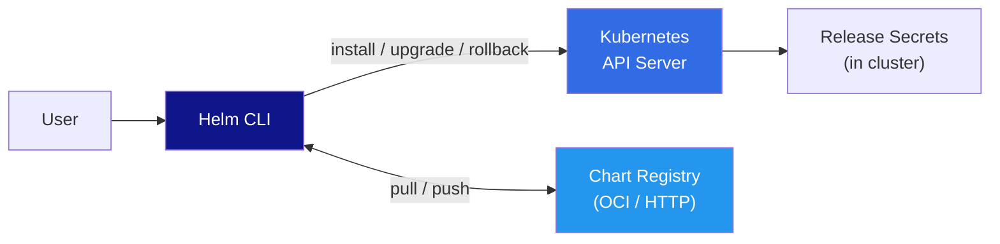

# ⎈ Helm — Deep Dive

> **The package manager for Kubernetes.** Chart structure, template language, values, hooks, dependencies, and production best practices. For CLI commands, see [cli/helm/](../../cli/helm/).

---

## 📑 Table of Contents

- [What is Helm?](#-what-is-helm)
- [Helm 3 Architecture](#-helm-3-architecture)
- [Chart Structure](#-chart-structure)
- [Template Language](#-template-language)
- [Values](#-values)
- [Dependencies](#-dependencies)
- [Hooks](#-hooks)
- [Chart Development Workflow](#-chart-development-workflow)
- [Release Management](#-release-management)
- [Testing](#-testing)
- [Best Practices](#-best-practices)
- [Production Tips](#-production-tips)
- [Troubleshooting](#-troubleshooting)
- [Related Topics](#-related-topics)

---

## 💡 What is Helm?

Helm is the package manager for Kubernetes. It bundles Kubernetes manifests into reusable, versioned, configurable packages called **charts**.

### Why Helm?

| Problem | How Helm Solves It |
|---------|-------------------|
| Managing many YAML files | Package them as a single chart |
| Configuration varies per environment | Use `values.yaml` with overrides |
| Deploying the same app multiple times | Install multiple releases from one chart |
| Tracking what's deployed | Release history with rollback capability |
| Sharing Kubernetes configurations | Publish charts to registries (like Docker images) |
| Dependencies between services | Chart dependencies and sub-charts |

### Core Terminology

| Term | Description |
|------|-------------|
| **Chart** | A Helm package containing all Kubernetes resource definitions |
| **Release** | An instance of a chart running in a cluster |
| **Repository** | A place where charts are stored and shared |
| **Values** | Configuration data passed to chart templates |
| **Template** | Kubernetes manifests with Go template directives |
| **Revision** | A specific version of a release (increments on each upgrade) |

---

## 🏗️ Helm 3 Architecture



### Helm 3 vs Helm 2

| Aspect | Helm 2 | Helm 3 |
|--------|--------|--------|
| **Tiller** | Required (cluster-side component) | Removed — direct API access |
| **Security** | Tiller had cluster-admin by default | Uses kubeconfig RBAC |
| **Release storage** | ConfigMaps (default) | Secrets (default) |
| **Chart dependencies** | `requirements.yaml` | `Chart.yaml` dependencies |
| **3-way merge** | 2-way (manifest + chart) | 3-way (live state + manifest + chart) |
| **Namespace** | Releases were cluster-scoped | Releases are namespace-scoped |

---

## 📁 Chart Structure

```
mychart/
├── Chart.yaml              # Chart metadata (name, version, dependencies)
├── Chart.lock              # Locked dependency versions
├── values.yaml             # Default configuration values
├── values.schema.json      # JSON Schema for values validation (optional)
├── .helmignore             # Files to exclude from chart package
├── templates/              # Kubernetes manifest templates
│   ├── _helpers.tpl        # Template helper functions
│   ├── NOTES.txt           # Post-install usage notes (displayed to user)
│   ├── deployment.yaml
│   ├── service.yaml
│   ├── ingress.yaml
│   ├── configmap.yaml
│   ├── secret.yaml
│   ├── hpa.yaml
│   ├── serviceaccount.yaml
│   └── tests/
│       └── test-connection.yaml
├── charts/                 # Dependency charts (downloaded or local)
│   └── postgresql/
└── crds/                   # Custom Resource Definitions (applied before templates)
```

### Chart.yaml

```yaml
apiVersion: v2               # v2 for Helm 3 charts
name: myapp
description: A web application chart
type: application            # application or library
version: 1.2.3               # Chart version (SemVer)
appVersion: "2.0.0"          # Application version (informational)

# Chart maintainers
maintainers:
  - name: Team Name
    email: team@example.com

# Keywords for search
keywords:
  - web
  - api

# Source and documentation
home: https://example.com
sources:
  - https://github.com/org/myapp

# Dependencies
dependencies:
  - name: postgresql
    version: "13.x"
    repository: https://charts.bitnami.com/bitnami
    condition: postgresql.enabled      # Enable/disable via values
    tags:
      - database
  - name: redis
    version: "18.x"
    repository: https://charts.bitnami.com/bitnami
    condition: redis.enabled
```

---

## 📝 Template Language

Helm templates use **Go templates** with additional functions from the Sprig library.

### Built-in Objects

| Object | Description |
|--------|-------------|
| `.Release` | Release information (name, namespace, revision, isInstall, isUpgrade) |
| `.Values` | Values from values.yaml and user overrides |
| `.Chart` | Chart.yaml contents |
| `.Template` | Current template info (Name, BasePath) |
| `.Capabilities` | Cluster capabilities (API versions, K8s version) |
| `.Files` | Access to non-template files in the chart |

### Template Basics

```yaml
# templates/deployment.yaml
apiVersion: apps/v1
kind: Deployment
metadata:
  name: {{ include "myapp.fullname" . }}
  labels:
    {{- include "myapp.labels" . | nindent 4 }}
spec:
  replicas: {{ .Values.replicaCount }}
  selector:
    matchLabels:
      {{- include "myapp.selectorLabels" . | nindent 6 }}
  template:
    metadata:
      labels:
        {{- include "myapp.selectorLabels" . | nindent 8 }}
      annotations:
        # Force rollout on config change
        checksum/config: {{ include (print $.Template.BasePath "/configmap.yaml") . | sha256sum }}
    spec:
      serviceAccountName: {{ include "myapp.serviceAccountName" . }}
      containers:
        - name: {{ .Chart.Name }}
          image: "{{ .Values.image.repository }}:{{ .Values.image.tag | default .Chart.AppVersion }}"
          imagePullPolicy: {{ .Values.image.pullPolicy }}
          ports:
            - name: http
              containerPort: {{ .Values.service.targetPort | default 8080 }}
          {{- with .Values.resources }}
          resources:
            {{- toYaml . | nindent 12 }}
          {{- end }}
          {{- if .Values.probes.liveness.enabled }}
          livenessProbe:
            httpGet:
              path: {{ .Values.probes.liveness.path }}
              port: http
            initialDelaySeconds: {{ .Values.probes.liveness.initialDelaySeconds }}
            periodSeconds: {{ .Values.probes.liveness.periodSeconds }}
          {{- end }}
```

### Common Template Functions

```yaml
# String functions
{{ .Values.name | upper }}                    # MYAPP
{{ .Values.name | lower }}                    # myapp
{{ .Values.name | title }}                    # Myapp
{{ .Values.name | quote }}                    # "myapp"
{{ .Values.name | trim }}                     # Remove whitespace
{{ printf "%s-%s" .Release.Name .Chart.Name }} # Format string
{{ .Values.name | trunc 63 | trimSuffix "-" }}  # DNS-safe name

# Default values
{{ .Values.image.tag | default .Chart.AppVersion }}
{{ .Values.logLevel | default "info" }}

# Conditional
{{- if .Values.ingress.enabled }}
...
{{- else }}
...
{{- end }}

# Loops
{{- range .Values.env }}
- name: {{ .name }}
  value: {{ .value | quote }}
{{- end }}

# With (change scope)
{{- with .Values.nodeSelector }}
nodeSelector:
  {{- toYaml . | nindent 8 }}
{{- end }}

# toYaml — convert to YAML string
{{- toYaml .Values.resources | nindent 12 }}

# Required — fail if value is missing
image: {{ required "image.repository is required" .Values.image.repository }}

# Whitespace control
{{-  — trim left whitespace
-}}  — trim right whitespace
nindent N — new line + indent N spaces
indent N — indent N spaces (no new line)
```

### _helpers.tpl — Named Templates

```yaml
# templates/_helpers.tpl

{{/*
Expand the name of the chart.
*/}}
{{- define "myapp.name" -}}
{{- default .Chart.Name .Values.nameOverride | trunc 63 | trimSuffix "-" }}
{{- end }}

{{/*
Create a fully qualified app name.
*/}}
{{- define "myapp.fullname" -}}
{{- if .Values.fullnameOverride }}
{{- .Values.fullnameOverride | trunc 63 | trimSuffix "-" }}
{{- else }}
{{- $name := default .Chart.Name .Values.nameOverride }}
{{- if contains $name .Release.Name }}
{{- .Release.Name | trunc 63 | trimSuffix "-" }}
{{- else }}
{{- printf "%s-%s" .Release.Name $name | trunc 63 | trimSuffix "-" }}
{{- end }}
{{- end }}
{{- end }}

{{/*
Common labels
*/}}
{{- define "myapp.labels" -}}
helm.sh/chart: {{ include "myapp.chart" . }}
{{ include "myapp.selectorLabels" . }}
app.kubernetes.io/version: {{ .Chart.AppVersion | quote }}
app.kubernetes.io/managed-by: {{ .Release.Service }}
{{- end }}

{{/*
Selector labels
*/}}
{{- define "myapp.selectorLabels" -}}
app.kubernetes.io/name: {{ include "myapp.name" . }}
app.kubernetes.io/instance: {{ .Release.Name }}
{{- end }}

{{/*
ServiceAccount name
*/}}
{{- define "myapp.serviceAccountName" -}}
{{- if .Values.serviceAccount.create }}
{{- default (include "myapp.fullname" .) .Values.serviceAccount.name }}
{{- else }}
{{- default "default" .Values.serviceAccount.name }}
{{- end }}
{{- end }}
```

---

## 📋 Values

### values.yaml

```yaml
# Default values for myapp

replicaCount: 2

image:
  repository: myregistry.com/myapp
  pullPolicy: IfNotPresent
  tag: ""                          # Defaults to Chart.appVersion

nameOverride: ""
fullnameOverride: ""

serviceAccount:
  create: true
  name: ""
  annotations: {}

service:
  type: ClusterIP
  port: 80
  targetPort: 8080

ingress:
  enabled: false
  className: nginx
  annotations: {}
  hosts:
    - host: myapp.example.com
      paths:
        - path: /
          pathType: Prefix
  tls: []

resources:
  requests:
    cpu: 100m
    memory: 128Mi
  limits:
    cpu: 500m
    memory: 256Mi

probes:
  liveness:
    enabled: true
    path: /health/live
    initialDelaySeconds: 15
    periodSeconds: 20
  readiness:
    enabled: true
    path: /health/ready
    initialDelaySeconds: 5
    periodSeconds: 10

autoscaling:
  enabled: false
  minReplicas: 2
  maxReplicas: 10
  targetCPUUtilizationPercentage: 70

env: []
  # - name: LOG_LEVEL
  #   value: "info"

# Dependency toggles
postgresql:
  enabled: true
redis:
  enabled: false
```

### Values Hierarchy (Override Order)

```
1. Child chart values.yaml (lowest priority)
2. Parent chart values.yaml
3. -f / --values file (can specify multiple, last wins)
4. --set / --set-string / --set-file (highest priority)
```

```bash
# Override with file
helm install myapp ./chart -f production-values.yaml

# Override with --set
helm install myapp ./chart \
  --set replicaCount=5 \
  --set image.tag=v2.0.0 \
  --set "ingress.hosts[0].host=prod.example.com"

# Multiple value files (last wins)
helm install myapp ./chart \
  -f values.yaml \
  -f values-production.yaml \
  -f values-secrets.yaml
```

### Values Schema Validation

```json
{
  "$schema": "https://json-schema.org/draft/2020-12/schema",
  "type": "object",
  "required": ["image", "replicaCount"],
  "properties": {
    "replicaCount": {
      "type": "integer",
      "minimum": 1,
      "maximum": 50
    },
    "image": {
      "type": "object",
      "required": ["repository"],
      "properties": {
        "repository": {
          "type": "string",
          "pattern": "^[a-z0-9/.-]+$"
        },
        "tag": {
          "type": "string"
        },
        "pullPolicy": {
          "type": "string",
          "enum": ["Always", "IfNotPresent", "Never"]
        }
      }
    }
  }
}
```

When `values.schema.json` exists, Helm validates values on `install`, `upgrade`, `lint`, and `template`.

---

## 🔗 Dependencies

### Declaring Dependencies

```yaml
# Chart.yaml
dependencies:
  - name: postgresql
    version: "13.2.x"               # SemVer range
    repository: "https://charts.bitnami.com/bitnami"
    condition: postgresql.enabled    # Toggle via values
    tags:
      - database

  - name: redis
    version: "~18.1.0"
    repository: "https://charts.bitnami.com/bitnami"
    condition: redis.enabled
    tags:
      - cache

  - name: common
    version: "2.x"
    repository: "https://charts.bitnami.com/bitnami"
    tags:
      - library
```

### Managing Dependencies

```bash
# Download dependencies to charts/ directory
helm dependency update ./mychart

# List dependencies
helm dependency list ./mychart

# Build dependencies (use Chart.lock)
helm dependency build ./mychart
```

### Overriding Dependency Values

```yaml
# Parent values.yaml — prefix with dependency name
postgresql:
  enabled: true
  auth:
    database: myapp
    username: appuser
    existingSecret: postgres-secret
  primary:
    resources:
      requests:
        cpu: 250m
        memory: 256Mi
  persistence:
    size: 50Gi

redis:
  enabled: false
```

### Conditions vs Tags

| Mechanism | Scope | Behavior |
|-----------|-------|----------|
| **condition** | Single dependency | Enable/disable one dependency via value path |
| **tags** | Group of dependencies | Enable/disable a group of dependencies together |

```yaml
# values.yaml
tags:
  database: true    # Enables all deps tagged "database"
  cache: false      # Disables all deps tagged "cache"

postgresql:
  enabled: true     # Condition overrides tags
```

### Umbrella Charts

An umbrella chart has no templates — it only aggregates dependencies:

```yaml
# Chart.yaml for umbrella chart
apiVersion: v2
name: my-platform
version: 1.0.0
dependencies:
  - name: frontend
    version: "1.x"
    repository: "file://../frontend-chart"
  - name: backend
    version: "1.x"
    repository: "file://../backend-chart"
  - name: postgresql
    version: "13.x"
    repository: "https://charts.bitnami.com/bitnami"
```

---

## 🪝 Hooks

Hooks allow you to run actions at specific points in the release lifecycle.

### Hook Types

| Hook | Trigger |
|------|---------|
| `pre-install` | Before any resources are created |
| `post-install` | After all resources are created |
| `pre-delete` | Before any resources are deleted |
| `post-delete` | After all resources are deleted |
| `pre-upgrade` | Before any resources are upgraded |
| `post-upgrade` | After all resources are upgraded |
| `pre-rollback` | Before any resources are rolled back |
| `post-rollback` | After all resources are rolled back |
| `test` | When `helm test` is invoked |

### Hook Example: Database Migration

```yaml
apiVersion: batch/v1
kind: Job
metadata:
  name: {{ include "myapp.fullname" . }}-migrate
  annotations:
    "helm.sh/hook": pre-upgrade,pre-install
    "helm.sh/hook-weight": "-5"          # Lower weight runs first
    "helm.sh/hook-delete-policy": before-hook-creation,hook-succeeded
spec:
  backoffLimit: 3
  activeDeadlineSeconds: 300
  template:
    spec:
      restartPolicy: Never
      containers:
        - name: migrate
          image: "{{ .Values.image.repository }}:{{ .Values.image.tag }}"
          command: ["python", "manage.py", "migrate"]
          env:
            - name: DATABASE_URL
              valueFrom:
                secretKeyRef:
                  name: db-secret
                  key: url
```

### Hook Weights

Hooks with the same hook type run in weight order (ascending). Default weight is `0`.

```yaml
annotations:
  "helm.sh/hook": pre-install
  "helm.sh/hook-weight": "-10"    # Runs first
---
annotations:
  "helm.sh/hook": pre-install
  "helm.sh/hook-weight": "0"     # Runs second
---
annotations:
  "helm.sh/hook": pre-install
  "helm.sh/hook-weight": "10"    # Runs third
```

### Hook Deletion Policies

| Policy | Behavior |
|--------|----------|
| `before-hook-creation` | Delete previous hook resource before creating new one (default) |
| `hook-succeeded` | Delete after hook succeeds |
| `hook-failed` | Delete after hook fails |

---

## 🔧 Chart Development Workflow

### 1. Create Chart

```bash
# Scaffold a new chart
helm create mychart

# Remove scaffolded content you don't need
rm -rf mychart/templates/tests
rm mychart/templates/hpa.yaml    # If not needed
```

### 2. Develop Templates

```bash
# Render templates locally (without installing)
helm template myrelease ./mychart -f custom-values.yaml

# Render specific template
helm template myrelease ./mychart -s templates/deployment.yaml

# Debug mode — show computed values
helm template myrelease ./mychart --debug
```

### 3. Lint

```bash
# Check chart for issues
helm lint ./mychart
helm lint ./mychart -f production-values.yaml

# Strict mode
helm lint ./mychart --strict
```

### 4. Test Locally

```bash
# Install with dry-run (validate against cluster API)
helm install myrelease ./mychart --dry-run

# Install in development namespace
helm install myrelease ./mychart -n development --create-namespace

# Run chart tests
helm test myrelease
```

### 5. Package and Publish

```bash
# Package chart into .tgz archive
helm package ./mychart

# Push to OCI registry
helm push mychart-1.2.3.tgz oci://myregistry.com/charts

# Push to ChartMuseum
curl --data-binary "@mychart-1.2.3.tgz" https://chartmuseum.example.com/api/charts

# Generate index for static hosting
helm repo index . --url https://charts.example.com
```

---

## 🚀 Release Management

### Install

```bash
helm install myapp ./chart -n production --create-namespace \
  -f values-production.yaml \
  --set image.tag=v2.0.0 \
  --wait \
  --timeout 5m
```

### Upgrade

```bash
helm upgrade myapp ./chart -n production \
  -f values-production.yaml \
  --set image.tag=v2.1.0 \
  --wait \
  --timeout 5m \
  --atomic              # Rollback on failure
```

### Rollback

```bash
# View release history
helm history myapp -n production

# Rollback to previous revision
helm rollback myapp -n production

# Rollback to specific revision
helm rollback myapp 3 -n production --wait
```

### Diff (helm-diff plugin)

```bash
# Install plugin
helm plugin install https://github.com/databus23/helm-diff

# Preview changes before upgrade
helm diff upgrade myapp ./chart -n production \
  -f values-production.yaml \
  --set image.tag=v2.1.0
```

---

## 🧪 Testing

### Chart Tests

```yaml
# templates/tests/test-connection.yaml
apiVersion: v1
kind: Pod
metadata:
  name: "{{ include "myapp.fullname" . }}-test-connection"
  annotations:
    "helm.sh/hook": test
    "helm.sh/hook-delete-policy": before-hook-creation,hook-succeeded
spec:
  restartPolicy: Never
  containers:
    - name: wget
      image: busybox:1.36
      command: ['wget']
      args: ['{{ include "myapp.fullname" . }}:{{ .Values.service.port }}/health']
```

```bash
# Run tests
helm test myapp -n production
helm test myapp -n production --logs    # Show test pod logs
```

### CI Pipeline Testing

```bash
# Lint → Template → Dry-run → Install → Test → Cleanup
helm lint ./chart --strict
helm template test ./chart -f test-values.yaml > /dev/null
helm install test ./chart --dry-run --namespace ci-test
helm install test ./chart --namespace ci-test --create-namespace --wait --timeout 3m
helm test test --namespace ci-test --logs
helm uninstall test --namespace ci-test
```

---

## ✅ Best Practices

### Naming Conventions

```yaml
# Chart names: lowercase, hyphen-separated
name: my-web-app          # ✅
name: My_Web_App          # ❌

# Template names: chartname.purpose
{{- define "myapp.fullname" -}}
{{- define "myapp.labels" -}}
{{- define "myapp.selectorLabels" -}}
```

### Versioning

```yaml
# Chart version — SemVer, incremented on every chart change
version: 1.2.3

# App version — version of the application in the chart
appVersion: "2.0.0"
```

| Change Type | Chart Version Bump | Example |
|-------------|-------------------|---------|
| Breaking change to values | Major | 1.0.0 → 2.0.0 |
| New feature, backward compatible | Minor | 1.0.0 → 1.1.0 |
| Bug fix or patch | Patch | 1.0.0 → 1.0.1 |

### NOTES.txt

```
# templates/NOTES.txt
Thank you for installing {{ .Chart.Name }}!

Your release "{{ .Release.Name }}" has been deployed to namespace "{{ .Release.Namespace }}".

To get the application URL:
{{- if .Values.ingress.enabled }}
  http{{ if .Values.ingress.tls }}s{{ end }}://{{ (index .Values.ingress.hosts 0).host }}
{{- else }}
  kubectl port-forward svc/{{ include "myapp.fullname" . }} {{ .Values.service.port }}:{{ .Values.service.port }} -n {{ .Release.Namespace }}
  Then visit: http://localhost:{{ .Values.service.port }}
{{- end }}
```

### Labels

Always include standard Kubernetes labels:

```yaml
app.kubernetes.io/name: {{ include "myapp.name" . }}
app.kubernetes.io/instance: {{ .Release.Name }}
app.kubernetes.io/version: {{ .Chart.AppVersion | quote }}
app.kubernetes.io/managed-by: {{ .Release.Service }}
helm.sh/chart: {{ include "myapp.chart" . }}
```

---

## 🏭 Production Tips

### GitOps with Helm

```yaml
# ArgoCD Application
apiVersion: argoproj.io/v1alpha1
kind: Application
metadata:
  name: myapp
  namespace: argocd
spec:
  project: default
  source:
    repoURL: https://github.com/org/helm-charts
    targetRevision: main
    path: charts/myapp
    helm:
      valueFiles:
        - values-production.yaml
  destination:
    server: https://kubernetes.default.svc
    namespace: production
  syncPolicy:
    automated:
      prune: true
      selfHeal: true
```

### Helmfile — Managing Multiple Releases

```yaml
# helmfile.yaml
repositories:
  - name: bitnami
    url: https://charts.bitnami.com/bitnami

releases:
  - name: myapp
    namespace: production
    chart: ./charts/myapp
    version: 1.2.3
    values:
      - values/production.yaml
    secrets:
      - secrets/production.yaml    # Encrypted with SOPS/age
    wait: true
    timeout: 300

  - name: postgresql
    namespace: production
    chart: bitnami/postgresql
    version: 13.2.24
    values:
      - values/postgresql-production.yaml
```

```bash
helmfile sync                  # Install or upgrade all releases
helmfile diff                  # Show pending changes
helmfile apply                 # Diff then sync
helmfile destroy               # Uninstall all releases
```

### Managing Secrets

```bash
# Option 1: External secret manager (recommended)
# Use External Secrets Operator, Sealed Secrets, or SOPS

# Option 2: Helm secrets plugin (SOPS encryption)
helm plugin install https://github.com/jkroepke/helm-secrets
helm secrets encrypt secrets.yaml
helm secrets install myapp ./chart -f values.yaml -f secrets://secrets.yaml

# Option 3: --set from CI/CD environment
helm upgrade myapp ./chart \
  --set secrets.dbPassword="${DB_PASSWORD}"
```

### Chart Repository Management

```bash
# OCI Registry (recommended for Helm 3.8+)
helm push mychart-1.0.0.tgz oci://myregistry.com/charts
helm install myapp oci://myregistry.com/charts/mychart --version 1.0.0

# ChartMuseum (HTTP-based)
helm repo add myrepo https://chartmuseum.example.com
helm repo update
helm install myapp myrepo/mychart --version 1.0.0

# GitHub Pages (static hosting)
# Host chart packages + index.yaml in a gh-pages branch
helm repo add myrepo https://org.github.io/helm-charts
```

---

## 🐛 Troubleshooting

### Common Issues

| Issue | Cause | Solution |
|-------|-------|----------|
| Template rendering error | Syntax error in template | `helm template --debug`, check whitespace |
| Values not applied | Wrong value path or override order | `helm get values <release>`, check hierarchy |
| Release stuck in `pending-install` | Previous install failed midway | `helm uninstall <release>`, reinstall |
| Hook timeout | Hook job takes too long | Increase `--timeout`, check hook resources |
| `UPGRADE FAILED: another operation is in progress` | Previous operation didn't complete | Wait or `helm rollback` |
| Schema validation error | Values don't match schema | Check `values.schema.json`, fix values |
| Dependency not found | Missing `helm dependency update` | Run `helm dependency update ./chart` |

### Debugging Commands

```bash
# Render templates without installing
helm template myrelease ./chart --debug

# Dry-run against cluster
helm install myrelease ./chart --dry-run --debug

# Get rendered values of a release
helm get values myrelease -n production
helm get values myrelease -n production --all    # Include defaults

# Get rendered manifests of a release
helm get manifest myrelease -n production

# Get all release info
helm get all myrelease -n production

# Check release history
helm history myrelease -n production
```

---

## 🔗 Related Topics

| Topic | Link |
|-------|------|
| Helm CLI Reference | [cli/helm/](../../cli/helm/) |
| Kubernetes Deep Dive | [devops/kubernetes/](../kubernetes/) |
| kubectl CLI Reference | [cli/kubectl/](../../cli/kubectl/) |
| Docker Deep Dive | [devops/docker/](../docker/) |
| Security (secrets management) | [security/](../../security/) |

---

> **Next:** If you're new to Kubernetes, start with [Kubernetes Deep Dive](../kubernetes/). For network fundamentals that support K8s services, see [Networking](../networking/).
