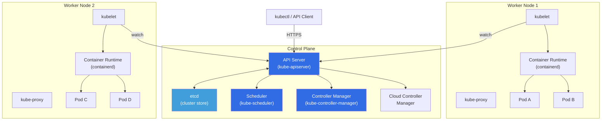
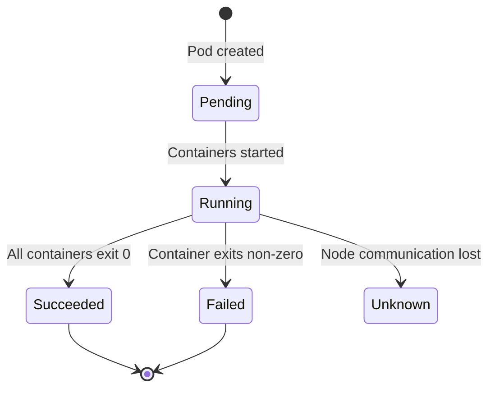
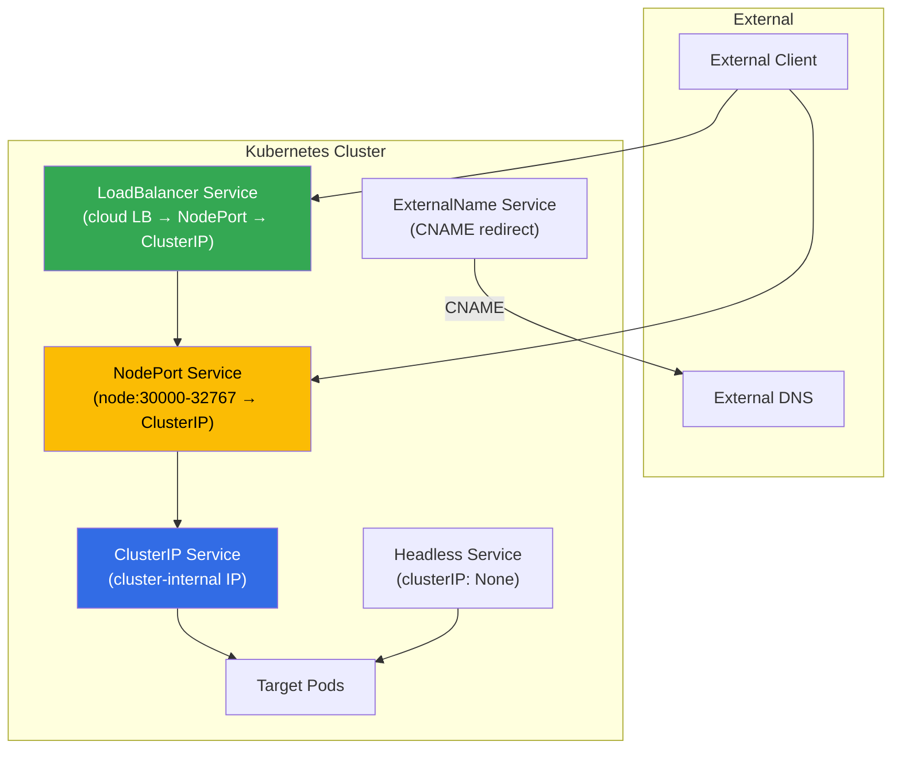
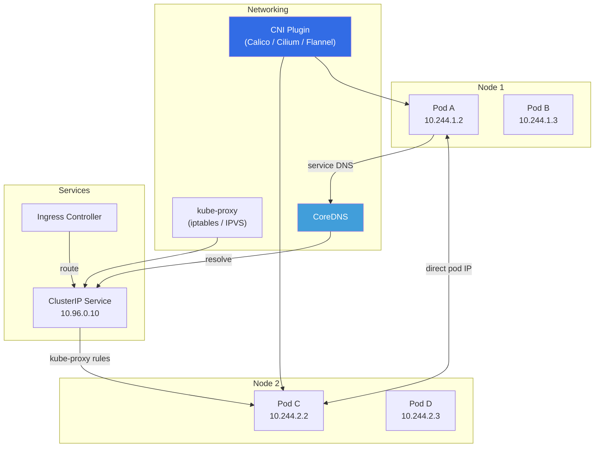

# ☸️ Kubernetes — Deep Dive

> **Container orchestration at scale.** Architecture, workloads, networking, storage, security, and production best practices. For CLI commands, see [cli/kubectl/](../../cli/kubectl/).

---

## 📑 Table of Contents

- [What is Kubernetes?](#-what-is-kubernetes)
- [Architecture](#-architecture)
- [Core Concepts](#-core-concepts)
- [Workloads: Pods](#-workloads-pods)
- [Workloads: Deployments](#-workloads-deployments)
- [Workloads: StatefulSets](#-workloads-statefulsets)
- [Workloads: DaemonSets, Jobs, CronJobs](#-workloads-daemonsets-jobs-cronjobs)
- [Services](#-services)
- [Ingress](#-ingress)
- [ConfigMaps & Secrets](#-configmaps--secrets)
- [Storage: PV, PVC, StorageClass](#-storage-pv-pvc-storageclass)
- [RBAC](#-rbac)
- [Scheduling](#-scheduling)
- [Resource Management](#-resource-management)
- [Probes](#-probes)
- [Networking](#-networking)
- [Debugging Guide](#-debugging-guide)
- [Production Best Practices](#-production-best-practices)
- [Related Topics](#-related-topics)

---

## 💡 What is Kubernetes?

Kubernetes (K8s) is an open-source container orchestration platform that automates deployment, scaling, and management of containerized applications. Originally developed by Google (based on Borg), now maintained by the CNCF.

### What Kubernetes Provides

| Capability | Description |
|------------|-------------|
| **Service discovery & load balancing** | Expose containers via DNS names or IPs, distribute traffic |
| **Storage orchestration** | Automatically mount storage systems (local, cloud, network) |
| **Automated rollouts & rollbacks** | Declare desired state, K8s handles the transition |
| **Self-healing** | Restart failed containers, replace unhealthy nodes, kill unresponsive pods |
| **Secret & config management** | Store and manage sensitive information separately from images |
| **Horizontal scaling** | Scale pods up/down based on metrics (CPU, memory, custom) |
| **Bin packing** | Efficiently schedule containers based on resource requirements |

### What Kubernetes Does NOT Do

- Does not build or deploy your source code (that's CI/CD)
- Does not provide application-level services (logging, monitoring, alerting — you add these)
- Does not dictate your application framework or language
- Is not a PaaS — it provides building blocks, not opinions

---

## 🏗️ Architecture



### Control Plane Components

| Component | Role |
|-----------|------|
| **kube-apiserver** | Front door to the cluster. All communication goes through the API server. Validates and processes REST requests, updates etcd. |
| **etcd** | Distributed key-value store. Single source of truth for all cluster state. Must be backed up regularly. |
| **kube-scheduler** | Watches for unscheduled pods, selects the best node based on resource requirements, affinity, taints, and constraints. |
| **kube-controller-manager** | Runs controllers (Deployment, ReplicaSet, Node, Job, etc.) that watch cluster state and make changes toward desired state. |
| **cloud-controller-manager** | Integrates with cloud provider APIs (load balancers, routes, instances). Only present in cloud-managed clusters. |

### Node Components

| Component | Role |
|-----------|------|
| **kubelet** | Agent on each node. Ensures pods are running and healthy. Reports node status to API server. |
| **kube-proxy** | Maintains network rules on nodes. Implements Service abstraction (iptables/IPVS rules). |
| **Container Runtime** | Runs containers (containerd, CRI-O). Must implement the Container Runtime Interface (CRI). |

### How a Deployment Works (End to End)

1. User runs `kubectl apply -f deployment.yaml`
2. API server validates the manifest and stores it in etcd
3. Deployment controller notices new Deployment, creates a ReplicaSet
4. ReplicaSet controller notices new ReplicaSet, creates Pod objects
5. Scheduler notices unscheduled Pods, assigns them to nodes
6. Kubelet on assigned node notices new Pod, pulls image, starts containers
7. Kube-proxy updates network rules to route traffic to new pods

---

## 🧩 Core Concepts

### The Kubernetes Object Model

Every Kubernetes resource follows this pattern:

```yaml
apiVersion: apps/v1          # API group and version
kind: Deployment             # Resource type
metadata:
  name: myapp                # Object name (unique within namespace)
  namespace: default         # Namespace (default if omitted)
  labels:                    # Key-value pairs for identification
    app: myapp
    env: production
  annotations:               # Non-identifying metadata
    description: "Main application"
spec:                        # Desired state (you define this)
  replicas: 3
  # ...
status:                      # Current state (Kubernetes manages this)
  availableReplicas: 3
  # ...
```

### Labels and Selectors

Labels are key-value pairs attached to objects. Selectors filter objects by labels.

```yaml
# On the resource
metadata:
  labels:
    app: myapp
    tier: frontend
    env: production

# Selecting resources
selector:
  matchLabels:
    app: myapp
    tier: frontend
```

```bash
# Query by label
kubectl get pods -l app=myapp
kubectl get pods -l "env in (production, staging)"
kubectl get pods -l app=myapp,tier=frontend
```

### Namespaces

Namespaces provide logical isolation within a cluster.

| Namespace | Purpose |
|-----------|---------|
| `default` | Default namespace for objects with no namespace |
| `kube-system` | Kubernetes system components |
| `kube-public` | Publicly readable data (e.g., cluster info) |
| `kube-node-lease` | Node heartbeat leases |

```bash
kubectl create namespace staging
kubectl get pods -n staging
kubectl get pods -A             # All namespaces
```

---

## 🟢 Workloads: Pods

A Pod is the smallest deployable unit in Kubernetes — a group of one or more containers that share networking and storage.

### Pod Lifecycle



| Phase | Description |
|-------|-------------|
| **Pending** | Pod accepted but containers not yet running (image pulling, scheduling) |
| **Running** | At least one container is running or starting |
| **Succeeded** | All containers terminated successfully (exit code 0) |
| **Failed** | At least one container terminated with error |
| **Unknown** | Pod state cannot be determined (usually node communication failure) |

### Basic Pod

```yaml
apiVersion: v1
kind: Pod
metadata:
  name: myapp
  labels:
    app: myapp
spec:
  containers:
    - name: app
      image: myapp:1.0.0
      ports:
        - containerPort: 8080
      resources:
        requests:
          cpu: "100m"
          memory: "128Mi"
        limits:
          cpu: "500m"
          memory: "256Mi"
      env:
        - name: DATABASE_URL
          valueFrom:
            secretKeyRef:
              name: db-secret
              key: url
```

### Init Containers

Init containers run before the main application containers. They run sequentially and must complete successfully.

```yaml
spec:
  initContainers:
    - name: wait-for-db
      image: busybox:1.36
      command: ['sh', '-c', 'until nc -z db-service 5432; do echo waiting for db; sleep 2; done']

    - name: migrate-db
      image: myapp:1.0.0
      command: ['python', 'manage.py', 'migrate']

  containers:
    - name: app
      image: myapp:1.0.0
```

**Use cases:** Wait for dependencies, run migrations, populate shared volumes, clone git repos.

### Multi-Container Patterns

| Pattern | Description | Example |
|---------|-------------|---------|
| **Sidecar** | Helper container that extends the main container | Log shipper, proxy, TLS terminator |
| **Ambassador** | Proxy that simplifies accessing external services | Connection proxy to database |
| **Adapter** | Transforms output of the main container | Prometheus metrics exporter |

```yaml
# Sidecar pattern: log shipper
spec:
  containers:
    - name: app
      image: myapp:1.0.0
      volumeMounts:
        - name: logs
          mountPath: /var/log/app

    - name: log-shipper
      image: fluentd:v1.16
      volumeMounts:
        - name: logs
          mountPath: /var/log/app
          readOnly: true

  volumes:
    - name: logs
      emptyDir: {}
```

---

## 🚀 Workloads: Deployments

Deployments manage ReplicaSets, which manage Pods. They provide declarative updates, rolling deployments, and rollback capabilities.

```yaml
apiVersion: apps/v1
kind: Deployment
metadata:
  name: myapp
  labels:
    app: myapp
spec:
  replicas: 3
  revisionHistoryLimit: 10
  selector:
    matchLabels:
      app: myapp
  strategy:
    type: RollingUpdate
    rollingUpdate:
      maxUnavailable: 1        # Max pods that can be unavailable during update
      maxSurge: 1              # Max extra pods created during update
  template:
    metadata:
      labels:
        app: myapp
    spec:
      containers:
        - name: app
          image: myapp:1.2.0
          ports:
            - containerPort: 8080
          resources:
            requests:
              cpu: "100m"
              memory: "128Mi"
            limits:
              cpu: "500m"
              memory: "256Mi"
          readinessProbe:
            httpGet:
              path: /health/ready
              port: 8080
            initialDelaySeconds: 5
            periodSeconds: 10
          livenessProbe:
            httpGet:
              path: /health/live
              port: 8080
            initialDelaySeconds: 15
            periodSeconds: 20
```

### Deployment Strategies

| Strategy | Description | Downtime | Use Case |
|----------|-------------|:--------:|----------|
| **RollingUpdate** | Gradually replaces old pods with new | No | Default, most workloads |
| **Recreate** | Kills all old pods, then creates new | Yes | When running two versions is problematic |

### Rolling Update Process

```
Initial state:   [v1] [v1] [v1]

maxSurge=1, maxUnavailable=1:
Step 1:           [v1] [v1] [v2]  ← new pod created (surge)
Step 2:           [v1] [v2] [v2]  ← old pod terminated, new started
Step 3:           [v2] [v2] [v2]  ← update complete
```

### Rollbacks

```bash
# Check rollout status
kubectl rollout status deployment/myapp

# View rollout history
kubectl rollout history deployment/myapp
kubectl rollout history deployment/myapp --revision=2

# Rollback to previous version
kubectl rollout undo deployment/myapp

# Rollback to specific revision
kubectl rollout undo deployment/myapp --to-revision=2

# Pause / Resume rollout
kubectl rollout pause deployment/myapp
kubectl rollout resume deployment/myapp
```

---

## 🗄️ Workloads: StatefulSets

StatefulSets manage stateful applications that need stable identities, persistent storage, and ordered operations.

```yaml
apiVersion: apps/v1
kind: StatefulSet
metadata:
  name: postgres
spec:
  serviceName: postgres-headless    # Required: headless service
  replicas: 3
  selector:
    matchLabels:
      app: postgres
  template:
    metadata:
      labels:
        app: postgres
    spec:
      containers:
        - name: postgres
          image: postgres:16-alpine
          ports:
            - containerPort: 5432
          volumeMounts:
            - name: data
              mountPath: /var/lib/postgresql/data
          env:
            - name: POSTGRES_PASSWORD
              valueFrom:
                secretKeyRef:
                  name: postgres-secret
                  key: password
  volumeClaimTemplates:              # Each pod gets its own PVC
    - metadata:
        name: data
      spec:
        accessModes: ["ReadWriteOnce"]
        storageClassName: gp3
        resources:
          requests:
            storage: 50Gi
```

### StatefulSet Guarantees

| Feature | Description |
|---------|-------------|
| **Stable network identity** | Pods get predictable names: `postgres-0`, `postgres-1`, `postgres-2` |
| **Stable storage** | Each pod gets its own PersistentVolumeClaim that survives rescheduling |
| **Ordered deployment** | Pods are created sequentially: 0 → 1 → 2 |
| **Ordered termination** | Pods are deleted in reverse order: 2 → 1 → 0 |
| **Ordered rolling updates** | Updates proceed in reverse ordinal order |

### Headless Service (Required for StatefulSets)

```yaml
apiVersion: v1
kind: Service
metadata:
  name: postgres-headless
spec:
  clusterIP: None           # Headless — no load balancing, returns pod IPs
  selector:
    app: postgres
  ports:
    - port: 5432
```

DNS entries created:
- `postgres-headless.default.svc.cluster.local` → all pod IPs
- `postgres-0.postgres-headless.default.svc.cluster.local` → pod-0 IP
- `postgres-1.postgres-headless.default.svc.cluster.local` → pod-1 IP

---

## ⚙️ Workloads: DaemonSets, Jobs, CronJobs

### DaemonSets

Run exactly one pod on every node (or a subset of nodes). Used for node-level services.

```yaml
apiVersion: apps/v1
kind: DaemonSet
metadata:
  name: node-exporter
spec:
  selector:
    matchLabels:
      app: node-exporter
  template:
    metadata:
      labels:
        app: node-exporter
    spec:
      tolerations:
        - key: node-role.kubernetes.io/control-plane
          effect: NoSchedule        # Run on control plane nodes too
      containers:
        - name: node-exporter
          image: prom/node-exporter:v1.7.0
          ports:
            - containerPort: 9100
              hostPort: 9100
```

**Use cases:** Log collection (Fluentd), monitoring (node-exporter), networking (CNI), storage (CSI).

### Jobs

Run a task to completion. Pods are not restarted after successful completion.

```yaml
apiVersion: batch/v1
kind: Job
metadata:
  name: db-migration
spec:
  backoffLimit: 3              # Retry up to 3 times on failure
  activeDeadlineSeconds: 300   # Timeout after 5 minutes
  ttlSecondsAfterFinished: 3600  # Clean up 1 hour after completion
  template:
    spec:
      restartPolicy: Never     # Required: Never or OnFailure
      containers:
        - name: migrate
          image: myapp:1.0.0
          command: ["python", "manage.py", "migrate"]
```

### Parallel Jobs

```yaml
spec:
  completions: 10      # Total tasks to complete
  parallelism: 3       # Run 3 pods at a time
```

### CronJobs

```yaml
apiVersion: batch/v1
kind: CronJob
metadata:
  name: backup
spec:
  schedule: "0 2 * * *"        # Every day at 2 AM
  concurrencyPolicy: Forbid     # Don't run if previous is still running
  successfulJobsHistoryLimit: 3
  failedJobsHistoryLimit: 3
  startingDeadlineSeconds: 200  # If missed by 200s, skip this run
  jobTemplate:
    spec:
      template:
        spec:
          restartPolicy: OnFailure
          containers:
            - name: backup
              image: backup-tool:1.0
              command: ["/backup.sh"]
```

| ConcurrencyPolicy | Behavior |
|-------------------|----------|
| `Allow` | Multiple jobs can run simultaneously (default) |
| `Forbid` | Skip new job if previous is still running |
| `Replace` | Cancel running job and start new one |

---

## 🌐 Services

Services provide stable networking for a set of pods. Pods are ephemeral; Services give them a stable identity.

### Service Types



| Type | Access | Use Case |
|------|--------|----------|
| **ClusterIP** | Cluster internal only | Default, internal communication between services |
| **NodePort** | External via node IP:port (30000-32767) | Development, testing, on-prem |
| **LoadBalancer** | External via cloud load balancer | Production external access (cloud) |
| **ExternalName** | DNS CNAME to external service | Access external services from within cluster |
| **Headless** | Direct pod IPs (no load balancing) | StatefulSets, client-side load balancing |

### ClusterIP Service

```yaml
apiVersion: v1
kind: Service
metadata:
  name: myapp
spec:
  type: ClusterIP              # Default
  selector:
    app: myapp
  ports:
    - port: 80                 # Service port
      targetPort: 8080         # Container port
      protocol: TCP
```

Accessible at: `myapp.default.svc.cluster.local:80`

### LoadBalancer Service

```yaml
apiVersion: v1
kind: Service
metadata:
  name: myapp-external
  annotations:
    service.beta.kubernetes.io/aws-load-balancer-type: "nlb"
    service.beta.kubernetes.io/aws-load-balancer-scheme: "internet-facing"
spec:
  type: LoadBalancer
  selector:
    app: myapp
  ports:
    - port: 443
      targetPort: 8080
```

### Service DNS

```
<service>.<namespace>.svc.cluster.local

# Examples:
myapp.default.svc.cluster.local      # Full FQDN
myapp.default                        # Short form (within cluster)
myapp                                # Within same namespace
```

---

## 🚪 Ingress

Ingress exposes HTTP/HTTPS routes from outside the cluster to services within the cluster. Requires an Ingress Controller (NGINX, Traefik, HAProxy, AWS ALB, etc.).

```yaml
apiVersion: networking.k8s.io/v1
kind: Ingress
metadata:
  name: myapp-ingress
  annotations:
    nginx.ingress.kubernetes.io/rewrite-target: /
    nginx.ingress.kubernetes.io/ssl-redirect: "true"
    cert-manager.io/cluster-issuer: letsencrypt-prod
spec:
  ingressClassName: nginx
  tls:
    - hosts:
        - myapp.example.com
      secretName: myapp-tls
  rules:
    - host: myapp.example.com
      http:
        paths:
          - path: /api
            pathType: Prefix
            backend:
              service:
                name: api-service
                port:
                  number: 80
          - path: /
            pathType: Prefix
            backend:
              service:
                name: web-service
                port:
                  number: 80
```

### Path Types

| Type | Matching |
|------|----------|
| `Exact` | Exact path match only |
| `Prefix` | Path prefix match (path element boundary) |
| `ImplementationSpecific` | Matching depends on the IngressClass |

### Common Ingress Controllers

| Controller | Provider | Notes |
|------------|----------|-------|
| **NGINX Ingress** | Community/F5 | Most popular, wide feature set |
| **Traefik** | Traefik Labs | Auto-discovery, Let's Encrypt, middleware |
| **AWS ALB Ingress** | AWS | Native ALB integration |
| **Istio Gateway** | Istio | Service mesh integration |
| **Contour** | VMware | Envoy-based, multi-team support |

---

## ⚙️ ConfigMaps & Secrets

### ConfigMaps

Store non-sensitive configuration data as key-value pairs.

```yaml
apiVersion: v1
kind: ConfigMap
metadata:
  name: app-config
data:
  # Simple key-value
  DATABASE_HOST: "db-service"
  DATABASE_PORT: "5432"
  LOG_LEVEL: "info"

  # File-like content
  nginx.conf: |
    server {
      listen 80;
      location / {
        proxy_pass http://backend:8080;
      }
    }
```

### Using ConfigMaps

```yaml
spec:
  containers:
    - name: app
      image: myapp:1.0.0
      # As environment variables
      envFrom:
        - configMapRef:
            name: app-config         # All keys as env vars
      env:
        - name: DB_HOST
          valueFrom:
            configMapKeyRef:
              name: app-config
              key: DATABASE_HOST     # Single key as env var

      # As mounted files
      volumeMounts:
        - name: config-volume
          mountPath: /etc/nginx/nginx.conf
          subPath: nginx.conf        # Mount single file (not entire dir)
  volumes:
    - name: config-volume
      configMap:
        name: app-config
```

### Secrets

Store sensitive data (passwords, tokens, certificates). Base64-encoded at rest (use encryption at rest for real security).

```yaml
apiVersion: v1
kind: Secret
metadata:
  name: db-secret
type: Opaque
data:
  # Values must be base64 encoded
  username: cG9zdGdyZXM=        # echo -n "postgres" | base64
  password: bXlwYXNzd29yZA==    # echo -n "mypassword" | base64
---
# Alternative: stringData (plaintext, converted to base64 by K8s)
apiVersion: v1
kind: Secret
metadata:
  name: db-secret
type: Opaque
stringData:
  username: postgres
  password: mypassword
```

### Secret Types

| Type | Description |
|------|-------------|
| `Opaque` | Arbitrary key-value data (default) |
| `kubernetes.io/tls` | TLS certificate and key |
| `kubernetes.io/dockerconfigjson` | Docker registry credentials |
| `kubernetes.io/basic-auth` | Basic authentication credentials |
| `kubernetes.io/ssh-auth` | SSH private key |
| `kubernetes.io/service-account-token` | Service account token |

> ⚠️ **Kubernetes Secrets are NOT encrypted by default** — they're base64-encoded. Enable encryption at rest, use external secret managers (Vault, AWS Secrets Manager, sealed-secrets), and apply RBAC to restrict access.

---

## 💾 Storage: PV, PVC, StorageClass

### Storage Architecture

```
StorageClass (defines "how" to provision)
    ↓
PersistentVolume (PV) — actual storage resource
    ↓ (bound)
PersistentVolumeClaim (PVC) — request for storage
    ↓ (mounted)
Pod — uses the storage
```

### StorageClass

```yaml
apiVersion: storage.k8s.io/v1
kind: StorageClass
metadata:
  name: fast-ssd
provisioner: ebs.csi.aws.com       # CSI driver
parameters:
  type: gp3
  iops: "5000"
  throughput: "250"
reclaimPolicy: Retain               # What happens when PVC is deleted
volumeBindingMode: WaitForFirstConsumer  # Bind when pod is scheduled
allowVolumeExpansion: true
```

### PersistentVolumeClaim

```yaml
apiVersion: v1
kind: PersistentVolumeClaim
metadata:
  name: myapp-data
spec:
  accessModes:
    - ReadWriteOnce
  storageClassName: fast-ssd
  resources:
    requests:
      storage: 20Gi
```

### Access Modes

| Mode | Abbreviation | Description |
|------|:------------:|-------------|
| `ReadWriteOnce` | RWO | One node can mount read-write |
| `ReadOnlyMany` | ROX | Many nodes can mount read-only |
| `ReadWriteMany` | RWX | Many nodes can mount read-write |
| `ReadWriteOncePod` | RWOP | Only one pod can mount read-write |

### Reclaim Policies

| Policy | Behavior |
|--------|----------|
| `Retain` | PV remains after PVC deletion (manual cleanup) |
| `Delete` | PV and backing storage deleted with PVC |
| `Recycle` | Deprecated. Basic scrub (`rm -rf /volume/*`) |

### Using PVC in a Pod

```yaml
spec:
  containers:
    - name: app
      image: myapp:1.0.0
      volumeMounts:
        - name: data
          mountPath: /app/data
  volumes:
    - name: data
      persistentVolumeClaim:
        claimName: myapp-data
```

---

## 🔐 RBAC

Role-Based Access Control restricts who can do what in the cluster.

### RBAC Model

```
User / Group / ServiceAccount
    ↓ (bound by)
RoleBinding / ClusterRoleBinding
    ↓ (references)
Role / ClusterRole
    ↓ (defines)
Rules (apiGroups, resources, verbs)
```

### Role (Namespace-scoped)

```yaml
apiVersion: rbac.authorization.k8s.io/v1
kind: Role
metadata:
  name: pod-reader
  namespace: production
rules:
  - apiGroups: [""]
    resources: ["pods", "pods/log"]
    verbs: ["get", "list", "watch"]
  - apiGroups: ["apps"]
    resources: ["deployments"]
    verbs: ["get", "list"]
```

### ClusterRole (Cluster-scoped)

```yaml
apiVersion: rbac.authorization.k8s.io/v1
kind: ClusterRole
metadata:
  name: secret-reader
rules:
  - apiGroups: [""]
    resources: ["secrets"]
    verbs: ["get", "list"]
```

### RoleBinding

```yaml
apiVersion: rbac.authorization.k8s.io/v1
kind: RoleBinding
metadata:
  name: read-pods
  namespace: production
subjects:
  - kind: User
    name: alice
    apiGroup: rbac.authorization.k8s.io
  - kind: ServiceAccount
    name: monitoring-sa
    namespace: monitoring
roleRef:
  kind: Role
  name: pod-reader
  apiGroup: rbac.authorization.k8s.io
```

### ServiceAccount

```yaml
apiVersion: v1
kind: ServiceAccount
metadata:
  name: myapp-sa
  namespace: default
  annotations:
    # AWS IRSA
    eks.amazonaws.com/role-arn: arn:aws:iam::123456789:role/myapp-role
```

```yaml
# Use in Pod
spec:
  serviceAccountName: myapp-sa
  automountServiceAccountToken: false    # Disable if not needed
```

### RBAC Verbs

| Verb | HTTP Method | Description |
|------|------------|-------------|
| `get` | GET | Read a single resource |
| `list` | GET | List resources |
| `watch` | GET (streaming) | Watch for changes |
| `create` | POST | Create resource |
| `update` | PUT | Replace resource |
| `patch` | PATCH | Partial update |
| `delete` | DELETE | Delete resource |
| `deletecollection` | DELETE | Delete multiple resources |

---

## 📅 Scheduling

### nodeSelector

Simple node selection by label:

```yaml
spec:
  nodeSelector:
    disktype: ssd
    topology.kubernetes.io/zone: us-east-1a
```

### Node Affinity

More expressive node selection:

```yaml
spec:
  affinity:
    nodeAffinity:
      requiredDuringSchedulingIgnoredDuringExecution:    # Hard requirement
        nodeSelectorTerms:
          - matchExpressions:
              - key: topology.kubernetes.io/zone
                operator: In
                values:
                  - us-east-1a
                  - us-east-1b
      preferredDuringSchedulingIgnoredDuringExecution:   # Soft preference
        - weight: 80
          preference:
            matchExpressions:
              - key: node-type
                operator: In
                values:
                  - high-memory
```

### Pod Anti-Affinity

Spread pods across nodes/zones:

```yaml
spec:
  affinity:
    podAntiAffinity:
      requiredDuringSchedulingIgnoredDuringExecution:
        - labelSelector:
            matchExpressions:
              - key: app
                operator: In
                values:
                  - myapp
          topologyKey: kubernetes.io/hostname    # One pod per node
```

### Taints and Tolerations

Taints repel pods from nodes. Tolerations allow pods on tainted nodes.

```bash
# Taint a node
kubectl taint nodes node1 gpu=true:NoSchedule
kubectl taint nodes node1 dedicated=high-memory:NoExecute
```

```yaml
# Tolerate the taint
spec:
  tolerations:
    - key: "gpu"
      operator: "Equal"
      value: "true"
      effect: "NoSchedule"
    - key: "dedicated"
      operator: "Equal"
      value: "high-memory"
      effect: "NoExecute"
      tolerationSeconds: 3600    # Evict after 1 hour if taint changes
```

| Taint Effect | Behavior |
|-------------|----------|
| `NoSchedule` | Don't schedule new pods (existing stay) |
| `PreferNoSchedule` | Try to avoid scheduling (soft) |
| `NoExecute` | Evict existing pods + don't schedule new |

---

## 📊 Resource Management

### Requests and Limits

```yaml
spec:
  containers:
    - name: app
      resources:
        requests:
          cpu: "250m"          # 0.25 CPU cores — used for scheduling
          memory: "256Mi"      # Used for scheduling
        limits:
          cpu: "1"             # Max CPU — throttled if exceeded
          memory: "512Mi"      # Max memory — OOMKilled if exceeded
```

| Resource | Request (minimum guarantee) | Limit (maximum allowed) |
|----------|:---------------------------:|:-----------------------:|
| **CPU** | Scheduling & guaranteed minimum | Throttled above limit (not killed) |
| **Memory** | Scheduling & guaranteed minimum | OOMKilled if exceeded |

### CPU Units

| Value | Equivalent |
|-------|-----------|
| `1` | 1 vCPU / 1 core |
| `500m` | 0.5 CPU (500 millicores) |
| `100m` | 0.1 CPU |
| `250m` | 0.25 CPU |

### QoS Classes

Kubernetes assigns QoS classes based on requests/limits configuration:

| QoS Class | Condition | OOM Priority |
|-----------|-----------|:------------:|
| **Guaranteed** | requests == limits for all containers | Last to be evicted |
| **Burstable** | At least one request or limit set, but not equal | Middle |
| **BestEffort** | No requests or limits set | First to be evicted |

### LimitRange

Set default and max/min limits per namespace:

```yaml
apiVersion: v1
kind: LimitRange
metadata:
  name: default-limits
  namespace: production
spec:
  limits:
    - type: Container
      default:            # Default limits if not specified
        cpu: "500m"
        memory: "256Mi"
      defaultRequest:     # Default requests if not specified
        cpu: "100m"
        memory: "128Mi"
      max:
        cpu: "4"
        memory: "4Gi"
      min:
        cpu: "50m"
        memory: "64Mi"
```

### ResourceQuota

Limit total resource consumption per namespace:

```yaml
apiVersion: v1
kind: ResourceQuota
metadata:
  name: production-quota
  namespace: production
spec:
  hard:
    requests.cpu: "20"
    requests.memory: "40Gi"
    limits.cpu: "40"
    limits.memory: "80Gi"
    pods: "100"
    services: "20"
    persistentvolumeclaims: "30"
    secrets: "50"
    configmaps: "50"
```

---

## 🏥 Probes

Probes detect the health state of containers. Kubernetes uses them to decide when to route traffic and when to restart.

### Probe Types

| Probe | Purpose | Action on Failure |
|-------|---------|-------------------|
| **Liveness** | Is the container still running correctly? | Restart the container |
| **Readiness** | Is the container ready to serve traffic? | Remove from service endpoints |
| **Startup** | Has the container finished starting? | Blocks liveness/readiness until success |

### Probe Methods

```yaml
# HTTP GET probe
livenessProbe:
  httpGet:
    path: /health/live
    port: 8080
    httpHeaders:
      - name: X-Custom-Header
        value: probe
  initialDelaySeconds: 15
  periodSeconds: 20
  timeoutSeconds: 5
  failureThreshold: 3
  successThreshold: 1

# TCP Socket probe
readinessProbe:
  tcpSocket:
    port: 5432
  initialDelaySeconds: 5
  periodSeconds: 10

# Exec probe
livenessProbe:
  exec:
    command:
      - cat
      - /tmp/healthy
  initialDelaySeconds: 5
  periodSeconds: 5

# gRPC probe (K8s 1.24+)
livenessProbe:
  grpc:
    port: 50051
  initialDelaySeconds: 10
```

### Probe Configuration

| Parameter | Default | Description |
|-----------|---------|-------------|
| `initialDelaySeconds` | 0 | Wait before first probe |
| `periodSeconds` | 10 | How often to probe |
| `timeoutSeconds` | 1 | Timeout for each probe |
| `failureThreshold` | 3 | Failures before action |
| `successThreshold` | 1 | Successes to be considered healthy (readiness) |

### Best Practices

```yaml
# Recommended probe setup
spec:
  containers:
    - name: app
      # Startup probe — protect slow-starting containers
      startupProbe:
        httpGet:
          path: /health/started
          port: 8080
        failureThreshold: 30       # 30 × 10s = 5 minutes to start
        periodSeconds: 10

      # Liveness probe — detect deadlocks/hangs
      livenessProbe:
        httpGet:
          path: /health/live
          port: 8080
        periodSeconds: 15
        failureThreshold: 3

      # Readiness probe — traffic routing
      readinessProbe:
        httpGet:
          path: /health/ready
          port: 8080
        periodSeconds: 5
        failureThreshold: 3
```

> ⚠️ **Liveness probes should be simple and lightweight.** Don't check dependencies in liveness probes — a database being down should make the pod "not ready" (readiness), not trigger a restart (liveness).

---

## 🌐 Networking

### Kubernetes Networking Model

Every pod gets its own IP address. Fundamental requirements:
1. **Pod-to-Pod:** All pods can communicate without NAT
2. **Pod-to-Service:** Services provide stable IPs for pod groups
3. **External-to-Service:** External traffic reaches pods via Services/Ingress



### CNI Plugins

| Plugin | Features |
|--------|----------|
| **Calico** | L3 networking, NetworkPolicy, BGP, eBPF dataplane |
| **Cilium** | eBPF-based, advanced NetworkPolicy, observability, service mesh |
| **Flannel** | Simple overlay (VXLAN), no NetworkPolicy |
| **AWS VPC CNI** | Pods get real VPC IPs, high performance |
| **Weave Net** | Mesh networking, encryption, simple setup |

### DNS (CoreDNS)

```
# Service DNS
<service>.<namespace>.svc.cluster.local

# Pod DNS
<pod-ip-dashed>.<namespace>.pod.cluster.local
# e.g., 10-244-1-2.default.pod.cluster.local

# StatefulSet Pod DNS
<pod-name>.<headless-service>.<namespace>.svc.cluster.local
# e.g., postgres-0.postgres-headless.default.svc.cluster.local
```

### NetworkPolicy

Restrict traffic between pods (default: all traffic allowed).

```yaml
apiVersion: networking.k8s.io/v1
kind: NetworkPolicy
metadata:
  name: api-policy
  namespace: production
spec:
  podSelector:
    matchLabels:
      app: api
  policyTypes:
    - Ingress
    - Egress
  ingress:
    - from:
        - podSelector:
            matchLabels:
              app: web
        - namespaceSelector:
            matchLabels:
              name: monitoring
      ports:
        - protocol: TCP
          port: 8080
  egress:
    - to:
        - podSelector:
            matchLabels:
              app: database
      ports:
        - protocol: TCP
          port: 5432
    - to:                          # Allow DNS
        - namespaceSelector: {}
      ports:
        - protocol: UDP
          port: 53
        - protocol: TCP
          port: 53
```

### Default Deny All

```yaml
# Deny all ingress traffic in a namespace
apiVersion: networking.k8s.io/v1
kind: NetworkPolicy
metadata:
  name: default-deny-all
  namespace: production
spec:
  podSelector: {}        # Apply to all pods
  policyTypes:
    - Ingress
    - Egress
```

> Start with deny-all, then add specific allow policies. This is the safest approach for production namespaces.

---

## 🐛 Debugging Guide

### Systematic Debugging Approach

```
1. Check pod status          → kubectl get pods
2. Check pod events          → kubectl describe pod <pod>
3. Check container logs      → kubectl logs <pod> [-c container]
4. Check previous logs       → kubectl logs <pod> --previous
5. Check service endpoints   → kubectl get endpoints <service>
6. Check networking          → kubectl exec <pod> -- nslookup <service>
7. Check resource usage      → kubectl top pods
8. Check node status         → kubectl get nodes / kubectl describe node
```

### Common Pod Issues

| Status | Common Cause | Debug Steps |
|--------|-------------|-------------|
| **Pending** | Insufficient resources, node selector, taint | `kubectl describe pod` → check Events |
| **ImagePullBackOff** | Wrong image name, auth failure, registry issue | Check image name, imagePullSecrets |
| **CrashLoopBackOff** | App crashing, misconfiguration, missing deps | `kubectl logs --previous`, check exit code |
| **OOMKilled** | Memory limit too low or memory leak | Increase limits or fix app memory usage |
| **Evicted** | Node under resource pressure | Check node conditions, set resource requests |
| **CreateContainerConfigError** | Missing ConfigMap/Secret | Verify ConfigMap/Secret exists |

### Debug Commands

```bash
# Pod-level debugging
kubectl get pod <pod> -o yaml          # Full pod spec and status
kubectl describe pod <pod>             # Events and conditions
kubectl logs <pod> -c <container>      # Specific container logs
kubectl logs <pod> --previous          # Previous container logs (crashed)
kubectl logs <pod> --all-containers    # All container logs

# Run debug container in pod's namespace
kubectl debug <pod> -it --image=nicolaka/netshoot --target=app

# Run ephemeral debug container on node
kubectl debug node/<node> -it --image=ubuntu

# Service debugging
kubectl get endpoints <service>        # Check if endpoints exist
kubectl describe service <service>     # Service details

# Network debugging
kubectl exec <pod> -- nslookup <service>
kubectl exec <pod> -- curl -v http://<service>:<port>/health
kubectl exec <pod> -- wget -qO- http://<service>:<port>/health

# Resource debugging
kubectl top pods -n <namespace>
kubectl top nodes
kubectl describe node <node>           # Check Allocatable vs Allocated
```

---

## 🏭 Production Best Practices

### Namespace Strategy

```yaml
# Environment-based
namespaces: [production, staging, development]

# Team-based
namespaces: [team-a, team-b, platform]

# Combination
namespaces: [team-a-prod, team-a-staging, platform-prod]
```

### Label Standards

```yaml
metadata:
  labels:
    app.kubernetes.io/name: myapp
    app.kubernetes.io/instance: myapp-prod
    app.kubernetes.io/version: "1.2.3"
    app.kubernetes.io/component: api
    app.kubernetes.io/part-of: myplatform
    app.kubernetes.io/managed-by: helm
```

### Pod Disruption Budgets

Protect availability during voluntary disruptions (node drain, cluster upgrades):

```yaml
apiVersion: policy/v1
kind: PodDisruptionBudget
metadata:
  name: myapp-pdb
spec:
  minAvailable: 2              # At least 2 pods must be running
  # OR
  # maxUnavailable: 1          # At most 1 pod can be down
  selector:
    matchLabels:
      app: myapp
```

### Horizontal Pod Autoscaler

```yaml
apiVersion: autoscaling/v2
kind: HorizontalPodAutoscaler
metadata:
  name: myapp-hpa
spec:
  scaleTargetRef:
    apiVersion: apps/v1
    kind: Deployment
    name: myapp
  minReplicas: 3
  maxReplicas: 20
  metrics:
    - type: Resource
      resource:
        name: cpu
        target:
          type: Utilization
          averageUtilization: 70
    - type: Resource
      resource:
        name: memory
        target:
          type: Utilization
          averageUtilization: 80
  behavior:
    scaleDown:
      stabilizationWindowSeconds: 300    # Wait 5 min before scaling down
      policies:
        - type: Percent
          value: 10
          periodSeconds: 60
    scaleUp:
      stabilizationWindowSeconds: 30
      policies:
        - type: Percent
          value: 50
          periodSeconds: 60
```

### Production Deployment Checklist

- [ ] Resource requests and limits set for all containers
- [ ] Liveness, readiness, and startup probes configured
- [ ] PodDisruptionBudget defined (minAvailable or maxUnavailable)
- [ ] HorizontalPodAutoscaler configured
- [ ] Pod anti-affinity for spreading across nodes/zones
- [ ] Network policies restrict traffic
- [ ] RBAC with least-privilege ServiceAccounts
- [ ] Secrets managed via external secret manager
- [ ] ConfigMaps for all configuration (no hardcoded values)
- [ ] Proper labels and annotations
- [ ] Image tags are immutable (use digests or semver, never `latest`)
- [ ] `automountServiceAccountToken: false` unless needed
- [ ] Security context: `runAsNonRoot: true`, `readOnlyRootFilesystem: true`
- [ ] Resource quotas and limit ranges per namespace

### Security Context

```yaml
spec:
  securityContext:
    runAsNonRoot: true
    runAsUser: 1000
    runAsGroup: 1000
    fsGroup: 1000
    seccompProfile:
      type: RuntimeDefault
  containers:
    - name: app
      securityContext:
        allowPrivilegeEscalation: false
        readOnlyRootFilesystem: true
        capabilities:
          drop:
            - ALL
```

---

## 🔗 Related Topics

| Topic | Link |
|-------|------|
| kubectl CLI Reference | [cli/kubectl/](../../cli/kubectl/) |
| Helm (Kubernetes package manager) | [devops/helm/](../helm/) |
| Docker (container runtime) | [devops/docker/](../docker/) |
| Kubernetes Troubleshooting | [troubleshooting/kubernetes/](../../troubleshooting/kubernetes/) |
| Networking Fundamentals | [devops/networking/](../networking/) |
| Linux Fundamentals | [devops/linux/](../linux/) |
| Distributed Systems | [distributed-systems/](../../distributed-systems/) |
| Security | [security/](../../security/) |

---

> **Next:** Learn [Helm](../helm/) for packaging and deploying Kubernetes applications, or dive into [Networking](../networking/) for a deeper understanding of how cluster communication works.
