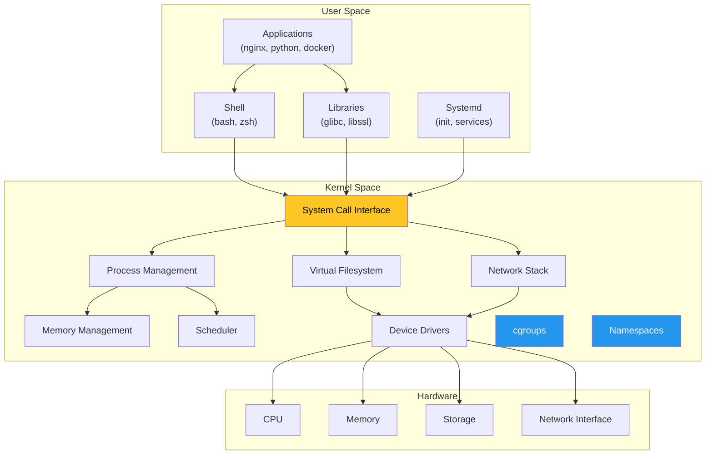

# 🐧 Linux — Deep Dive for DevOps

> **Linux fundamentals every DevOps engineer must master.** Architecture, filesystem, processes, systemd, networking, performance, security, and how containers leverage Linux primitives. For CLI commands, see [cli/linux/](../../cli/linux/).

---

## 📑 Table of Contents

- [Linux Architecture](#-linux-architecture)
- [File System Hierarchy](#-file-system-hierarchy)
- [Users & Permissions](#-users--permissions)
- [Process Management](#-process-management)
- [Systemd](#-systemd)
- [Networking](#-networking)
- [Package Management](#-package-management)
- [Performance Monitoring](#-performance-monitoring)
- [Cgroups & Namespaces](#-cgroups--namespaces)
- [Storage](#-storage)
- [Security](#-security)
- [Troubleshooting Checklist](#-troubleshooting-checklist)
- [Related Topics](#-related-topics)

---

## 🏗️ Linux Architecture



### Key Concepts

| Concept | Description |
|---------|-------------|
| **Kernel** | Core of the OS. Manages hardware, processes, memory, and networking. Runs in privileged mode (ring 0). |
| **User Space** | Everything that runs outside the kernel — applications, shells, libraries. Communicates with kernel via syscalls. |
| **System Calls (syscalls)** | Interface between user space and kernel. Examples: `open()`, `read()`, `write()`, `fork()`, `exec()`, `socket()`. |
| **Everything is a file** | Devices, processes, network sockets — Linux represents almost everything as files in a virtual filesystem. |

---

## 📁 File System Hierarchy

```
/                     Root of the filesystem
├── /bin              Essential user binaries (ls, cat, cp) — often symlinked to /usr/bin
├── /sbin             System binaries (fdisk, iptables) — often symlinked to /usr/sbin
├── /etc              System configuration files
│   ├── /etc/hosts              Static hostname resolution
│   ├── /etc/resolv.conf        DNS resolver config
│   ├── /etc/fstab              Filesystem mount table
│   ├── /etc/passwd             User accounts
│   ├── /etc/shadow             Encrypted passwords
│   ├── /etc/group              Group definitions
│   ├── /etc/sudoers            Sudo configuration
│   ├── /etc/ssh/               SSH configuration
│   ├── /etc/systemd/           Systemd configuration
│   └── /etc/crontab            System cron jobs
├── /home             User home directories
├── /root             Root user's home directory
├── /var              Variable data (logs, caches, spool)
│   ├── /var/log/               System and application logs
│   ├── /var/lib/               Application state data
│   │   └── /var/lib/docker/    Docker data (images, containers, volumes)
│   ├── /var/run → /run         Runtime data (PID files, sockets)
│   └── /var/cache/             Application caches
├── /tmp              Temporary files (cleared on reboot)
├── /opt              Optional/third-party software
├── /usr              User system resources (read-only)
│   ├── /usr/bin/               User binaries
│   ├── /usr/sbin/              System binaries
│   ├── /usr/lib/               Libraries
│   ├── /usr/local/             Locally installed software
│   └── /usr/share/             Architecture-independent data
├── /proc             Virtual filesystem — process and kernel info
│   ├── /proc/cpuinfo           CPU information
│   ├── /proc/meminfo           Memory information
│   ├── /proc/loadavg           System load averages
│   ├── /proc/[PID]/            Per-process information
│   └── /proc/sys/              Tunable kernel parameters
├── /sys              Virtual filesystem — hardware/driver info
│   └── /sys/fs/cgroup/         Cgroup filesystem (container resource limits)
├── /dev              Device files
│   ├── /dev/null               Discard output
│   ├── /dev/zero               Infinite zero bytes
│   ├── /dev/random             Random data (blocking)
│   ├── /dev/urandom            Random data (non-blocking)
│   ├── /dev/sda                First disk
│   └── /dev/nvme0n1            First NVMe disk
├── /run              Runtime data (PID files, sockets, tmpfs)
└── /mnt, /media      Mount points for external filesystems
```

### Important Files for DevOps

| File | Purpose |
|------|---------|
| `/etc/hosts` | Static DNS overrides — checked before DNS |
| `/etc/resolv.conf` | DNS resolver configuration |
| `/etc/fstab` | Persistent mount configuration |
| `/etc/sysctl.conf` | Kernel parameter tuning |
| `/proc/sys/net/` | Network tuning parameters |
| `/var/log/syslog` or `/var/log/messages` | System log |
| `/var/log/auth.log` or `/var/log/secure` | Authentication log |

---

## 👤 Users & Permissions

### User Management

```bash
# Create user
useradd -m -s /bin/bash -G docker,sudo username
# -m: create home directory
# -s: set shell
# -G: add to supplementary groups

# Set password
passwd username

# Modify user
usermod -aG docker username    # Add to group (without removing from existing)
usermod -L username            # Lock account
usermod -U username            # Unlock account

# Delete user
userdel -r username            # -r: remove home directory

# View user info
id username                    # UID, GID, groups
groups username                # Group membership
```

### File Permissions

```
Permission format: type | owner | group | others
                   d      rwx     r-x     r-x

Type: - (file), d (directory), l (symlink)
r = read (4), w = write (2), x = execute (1)
```

```bash
# Numeric permissions
chmod 755 file     # rwxr-xr-x  (owner: all, group/others: read+execute)
chmod 644 file     # rw-r--r--  (owner: read+write, group/others: read)
chmod 600 file     # rw-------  (owner only — use for private keys)
chmod 700 dir      # rwx------  (owner only — use for sensitive directories)

# Symbolic permissions
chmod u+x file     # Add execute for owner
chmod g+w file     # Add write for group
chmod o-r file     # Remove read for others
chmod a+r file     # Add read for all

# Change ownership
chown user:group file
chown -R user:group directory    # Recursive

# Default permissions for new files
umask 022          # Default: files 644, directories 755
umask 077          # Restrictive: files 600, directories 700
```

### Special Permissions

| Permission | Numeric | Effect |
|------------|:-------:|--------|
| **SUID** | 4000 | File executes as the file owner (e.g., `/usr/bin/passwd`) |
| **SGID** | 2000 | File executes as the group. On directories, new files inherit group. |
| **Sticky Bit** | 1000 | Only file owner can delete in directory (e.g., `/tmp`) |

```bash
# Find SUID files (security audit)
find / -perm -4000 -type f 2>/dev/null

# Set sticky bit
chmod 1755 /shared-directory
```

### sudoers

```bash
# Edit sudoers safely
visudo

# Common entries in /etc/sudoers or /etc/sudoers.d/
username ALL=(ALL:ALL) ALL                    # Full sudo access
%docker  ALL=(ALL:ALL) NOPASSWD: /usr/bin/docker  # Group-based, no password for docker
deploy   ALL=(ALL) NOPASSWD: /usr/bin/systemctl restart myapp  # Specific command only
```

---

## ⚙️ Process Management

### Process Hierarchy

```
PID 1 (init/systemd)
├── PID 100 (sshd)
│   └── PID 200 (bash)
│       └── PID 300 (python app.py)
├── PID 101 (dockerd)
│   ├── PID 400 (containerd)
│   │   └── PID 500 (container process)
│   └── PID 401 (containerd-shim)
└── PID 102 (cron)
```

### Process States

| State | Symbol | Description |
|-------|:------:|-------------|
| Running | R | Currently executing or in run queue |
| Sleeping | S | Waiting for an event (interruptible) |
| Disk Sleep | D | Waiting for I/O (uninterruptible — cannot be killed) |
| Stopped | T | Stopped by signal (SIGSTOP/SIGTSTP) |
| Zombie | Z | Finished but parent hasn't read exit status |

### Signals

| Signal | Number | Default Action | Description |
|--------|:------:|----------------|-------------|
| `SIGHUP` | 1 | Terminate | Hangup — often used for reload config |
| `SIGINT` | 2 | Terminate | Interrupt (Ctrl+C) |
| `SIGQUIT` | 3 | Core dump | Quit with core dump (Ctrl+\\) |
| `SIGKILL` | 9 | Terminate | Force kill — cannot be caught or ignored |
| `SIGTERM` | 15 | Terminate | Graceful termination — default signal for `kill` |
| `SIGSTOP` | 19 | Stop | Pause process — cannot be caught |
| `SIGCONT` | 18 | Continue | Resume stopped process |
| `SIGUSR1` | 10 | Terminate | User-defined signal 1 |
| `SIGUSR2` | 12 | Terminate | User-defined signal 2 |
| `SIGCHLD` | 17 | Ignore | Child process status changed |

```bash
# Send signals
kill PID              # SIGTERM (graceful)
kill -9 PID           # SIGKILL (force)
kill -HUP PID         # SIGHUP (reload)
killall python        # By name
pkill -f "python app" # By pattern
```

### Zombie and Orphan Processes

| Type | Cause | Solution |
|------|-------|---------|
| **Zombie** | Child exited, parent hasn't called `wait()` | Fix parent to reap children; kill parent |
| **Orphan** | Parent exited, child still running | Adopted by PID 1 (systemd); usually harmless |

```bash
# Find zombie processes
ps aux | awk '{if ($8=="Z") print}'

# Find parent of zombie
ps -o ppid= -p <zombie_pid>
```

> In containers, if PID 1 doesn't reap children (e.g., a shell script), zombie processes accumulate. Use `tini` or `dumb-init` as PID 1.

---

## 🔧 Systemd

Systemd is the init system and service manager for modern Linux. It starts and manages system services, timers, mounts, and targets.

### Unit File Structure

```ini
# /etc/systemd/system/myapp.service
[Unit]
Description=My Application Service
Documentation=https://docs.example.com
After=network.target postgresql.service
Requires=postgresql.service
Wants=redis.service

[Service]
Type=simple
User=appuser
Group=appgroup
WorkingDirectory=/opt/myapp
Environment=NODE_ENV=production
EnvironmentFile=/opt/myapp/.env
ExecStartPre=/opt/myapp/migrate.sh
ExecStart=/opt/myapp/bin/server --port 8080
ExecStop=/bin/kill -SIGTERM $MAINPID
ExecReload=/bin/kill -SIGHUP $MAINPID
Restart=on-failure
RestartSec=5
TimeoutStartSec=30
TimeoutStopSec=30

# Security hardening
NoNewPrivileges=true
ProtectSystem=strict
ProtectHome=true
PrivateTmp=true
ReadWritePaths=/var/lib/myapp /var/log/myapp

# Resource limits
LimitNOFILE=65536
MemoryMax=1G
CPUQuota=200%

[Install]
WantedBy=multi-user.target
```

### Service Types

| Type | PID Tracking | Description |
|------|-------------|-------------|
| `simple` | ExecStart PID | Default. Process in ExecStart is the main process. |
| `exec` | ExecStart PID | Like simple, but waits for binary to execute. |
| `forking` | PIDFile | Main process forks, parent exits. Must set `PIDFile`. |
| `oneshot` | None | Runs a command and exits (like a script). |
| `notify` | sd_notify PID | Process signals readiness via `sd_notify()`. |
| `idle` | ExecStart PID | Like simple, but waits until all jobs finish. |

### Service Management

```bash
# Control services
systemctl start myapp
systemctl stop myapp
systemctl restart myapp
systemctl reload myapp          # Send SIGHUP (if supported)
systemctl enable myapp          # Start on boot
systemctl disable myapp         # Don't start on boot
systemctl status myapp          # Current status

# List services
systemctl list-units --type=service
systemctl list-units --type=service --state=failed
systemctl list-unit-files --type=service

# Reload after editing unit files
systemctl daemon-reload
```

### Systemd Timers (cron replacement)

```ini
# /etc/systemd/system/backup.timer
[Unit]
Description=Run backup daily

[Timer]
OnCalendar=*-*-* 02:00:00      # Daily at 2 AM
Persistent=true                  # Catch up on missed runs
RandomizedDelaySec=300           # Jitter up to 5 minutes

[Install]
WantedBy=timers.target
```

```ini
# /etc/systemd/system/backup.service
[Unit]
Description=Backup service

[Service]
Type=oneshot
ExecStart=/opt/scripts/backup.sh
User=backup
```

```bash
systemctl enable --now backup.timer
systemctl list-timers --all
```

### Journal (Logging)

```bash
# View logs
journalctl -u myapp                    # Logs for a service
journalctl -u myapp -f                 # Follow (like tail -f)
journalctl -u myapp --since "1 hour ago"
journalctl -u myapp --since "2026-08-31 10:00" --until "2026-08-31 12:00"
journalctl -u myapp -p err             # Only errors
journalctl -b                          # Current boot
journalctl -b -1                       # Previous boot
journalctl --disk-usage                # Log storage usage

# Priority levels: emerg, alert, crit, err, warning, notice, info, debug
```

### Targets (Runlevels)

| Target | Equivalent | Description |
|--------|-----------|-------------|
| `poweroff.target` | runlevel 0 | Shutdown |
| `rescue.target` | runlevel 1 | Single-user mode |
| `multi-user.target` | runlevel 3 | Multi-user, no GUI (servers) |
| `graphical.target` | runlevel 5 | Multi-user with GUI |
| `reboot.target` | runlevel 6 | Reboot |

---

## 🌐 Networking

### Network Configuration

```bash
# View interfaces
ip addr show
ip -br addr                    # Brief format
ip link show

# Configure IP
ip addr add 192.168.1.100/24 dev eth0
ip addr del 192.168.1.100/24 dev eth0

# Enable/disable interface
ip link set eth0 up
ip link set eth0 down
```

### Routing

```bash
# View routing table
ip route show
route -n

# Add/delete routes
ip route add 10.0.0.0/8 via 192.168.1.1 dev eth0
ip route del 10.0.0.0/8
ip route add default via 192.168.1.1
```

### iptables / nftables

```bash
# iptables — list rules
iptables -L -n -v
iptables -t nat -L -n -v       # NAT table (Docker uses this)

# Common iptables rules
iptables -A INPUT -p tcp --dport 22 -j ACCEPT        # Allow SSH
iptables -A INPUT -p tcp --dport 80 -j ACCEPT        # Allow HTTP
iptables -A INPUT -p tcp --dport 443 -j ACCEPT       # Allow HTTPS
iptables -A INPUT -m state --state ESTABLISHED,RELATED -j ACCEPT
iptables -A INPUT -j DROP                              # Drop everything else

# nftables (modern replacement)
nft list ruleset
nft add table inet filter
nft add chain inet filter input { type filter hook input priority 0 \; }
nft add rule inet filter input tcp dport 22 accept
```

### firewalld

```bash
# Zone-based firewall management
firewall-cmd --state
firewall-cmd --list-all
firewall-cmd --add-service=http --permanent
firewall-cmd --add-port=8080/tcp --permanent
firewall-cmd --reload
firewall-cmd --list-ports
```

---

## 📦 Package Management

### Debian/Ubuntu (apt)

```bash
apt update                           # Update package index
apt upgrade                          # Upgrade installed packages
apt install nginx=1.24.0-1           # Install specific version
apt remove nginx                     # Remove package
apt purge nginx                      # Remove package + config files
apt autoremove                       # Remove orphaned dependencies
apt search nginx                     # Search packages
apt show nginx                       # Package details
dpkg -l | grep nginx                 # List installed packages
```

### RHEL/CentOS/Fedora (dnf/yum)

```bash
dnf check-update                     # Check for updates
dnf update                           # Update all packages
dnf install nginx-1.24.0             # Install specific version
dnf remove nginx                     # Remove package
dnf search nginx                     # Search packages
dnf info nginx                       # Package details
rpm -qa | grep nginx                 # List installed RPMs
```

### Snap & Flatpak

```bash
# Snap
snap install code --classic          # Install with classic confinement
snap list                            # List installed
snap refresh                         # Update all

# Flatpak
flatpak install flathub org.gimp.GIMP
flatpak list
flatpak update
```

---

## 📊 Performance Monitoring

### CPU

```bash
# Overview
top                              # Interactive process viewer
htop                             # Improved interactive viewer
uptime                           # Load averages

# Detailed CPU
mpstat -P ALL 1                  # Per-CPU usage every 1 second
sar -u 1 5                      # CPU usage, 5 samples, 1 second apart
pidstat -u 1                     # Per-process CPU usage

# Load average interpretation
# Load average: 1.5, 1.2, 0.8 (1 min, 5 min, 15 min)
# On a 4-core system: load 4.0 = 100% utilization
# Load > number of cores = processes waiting for CPU
```

### Memory

```bash
# Overview
free -h                          # Human-readable memory usage
vmstat 1 5                       # Virtual memory stats

# What "available" means:
#   Total = Used + Free + Buffers/Cache
#   Available = Free + Reclaimable buffers/cache
#   Available is what matters for new processes

# Per-process memory
ps aux --sort=-%mem | head -20   # Top memory consumers
pidstat -r 1                     # Per-process memory stats
smem -t                          # Per-process with shared memory

# Check for OOM events
dmesg | grep -i "oom"
journalctl -k | grep -i "oom"
```

### Disk I/O

```bash
# Overview
df -h                            # Filesystem usage
df -i                            # Inode usage (can run out before space)
du -sh /var/log/*                # Directory sizes

# I/O performance
iostat -xz 1                     # Disk I/O statistics
iotop -o                         # Top I/O consumers (only active)
pidstat -d 1                     # Per-process I/O

# Key metrics:
#   await  = average I/O wait time (ms) — high = slow disk
#   %util  = device utilization — 100% = saturated
#   r/s, w/s = reads/writes per second
```

### Network

```bash
# Connections
ss -tlnp                         # Listening TCP ports
ss -tanp                         # All TCP connections
ss -s                            # Connection summary

# Bandwidth
iftop                            # Real-time bandwidth per connection
nload                            # Real-time bandwidth per interface
sar -n DEV 1                     # Network interface statistics

# Packet analysis
tcpdump -i eth0 -nn port 80     # Capture HTTP traffic
tcpdump -i any -w capture.pcap   # Save capture to file
```

### Quick Performance Triage

```bash
# The "USE Method" — for each resource, check:
# Utilization, Saturation, Errors

# 1. CPU
uptime                    # Load averages (saturation)
mpstat -P ALL 1           # Per-CPU utilization
dmesg | tail              # CPU errors

# 2. Memory
free -h                   # Utilization
vmstat 1                  # Swap in/out (saturation)
dmesg | grep -i oom       # OOM errors

# 3. Disk
df -h                     # Space utilization
iostat -xz 1              # I/O utilization and saturation
dmesg | grep -i error     # Disk errors

# 4. Network
ss -s                     # Connection counts
sar -n DEV 1              # Interface utilization
dmesg | grep -i "link"    # Network errors
```

---

## 📦 Cgroups & Namespaces

These two Linux kernel features are the foundation of containers.

### Cgroups (Control Groups)

Limit, account for, and isolate resource usage (CPU, memory, disk I/O, network) of process groups.

```bash
# View cgroup hierarchy (cgroups v2)
ls /sys/fs/cgroup/

# Docker container cgroups
ls /sys/fs/cgroup/system.slice/docker-<container-id>.scope/

# Key cgroup files
cat /sys/fs/cgroup/.../cpu.max           # CPU limit (quota period)
cat /sys/fs/cgroup/.../memory.max        # Memory limit
cat /sys/fs/cgroup/.../memory.current    # Current memory usage
cat /sys/fs/cgroup/.../pids.max          # Max number of processes
```

| Cgroup Controller | What It Limits |
|-------------------|---------------|
| `cpu` | CPU time allocation |
| `memory` | Memory usage (RAM + swap) |
| `pids` | Number of processes |
| `io` | Block device I/O |
| `cpuset` | CPU and memory node assignment |

### Namespaces

Isolate what a process can see. Each container gets its own set of namespaces.

| Namespace | Isolates | Flag |
|-----------|----------|------|
| **PID** | Process IDs (PID 1 inside container) | `CLONE_NEWPID` |
| **Network** | Network interfaces, routing, ports | `CLONE_NEWNET` |
| **Mount** | Filesystem mount points | `CLONE_NEWNS` |
| **UTS** | Hostname and domain name | `CLONE_NEWUTS` |
| **IPC** | Inter-process communication | `CLONE_NEWIPC` |
| **User** | User and group IDs | `CLONE_NEWUSER` |
| **Cgroup** | Cgroup root directory | `CLONE_NEWCGROUP` |

```bash
# View namespaces of a process
ls -la /proc/<PID>/ns/

# Enter a container's namespace
nsenter -t <PID> -n -p -m       # Enter network, PID, and mount namespaces
# Equivalent to docker exec — but works with any process
```

### How Docker Uses These

```
docker run --cpus="2" --memory="1g" -p 8080:80 nginx

1. Create new namespaces (PID, NET, MNT, UTS, IPC, USER)
2. Set up cgroup limits:
   - cpu.max = "200000 100000" (2 CPUs)
   - memory.max = 1073741824 (1 GiB)
3. Set up network namespace:
   - Create veth pair (container ↔ bridge)
   - Add iptables NAT rule for port 8080→80
4. Mount container filesystem (overlay2)
5. Start process as PID 1 inside the container
```

---

## 💾 Storage

### LVM (Logical Volume Manager)

```
Physical Disks → Physical Volumes (PV) → Volume Group (VG) → Logical Volumes (LV) → Filesystem
```

```bash
# Create LVM
pvcreate /dev/sdb /dev/sdc                    # Create physical volumes
vgcreate data-vg /dev/sdb /dev/sdc            # Create volume group
lvcreate -L 100G -n app-data data-vg          # Create logical volume
mkfs.ext4 /dev/data-vg/app-data               # Create filesystem
mount /dev/data-vg/app-data /mnt/data          # Mount

# Extend
lvextend -L +50G /dev/data-vg/app-data        # Add 50G
resize2fs /dev/data-vg/app-data               # Resize ext4 filesystem
# For XFS: xfs_growfs /mnt/data
```

### Filesystems

| Filesystem | Use Case | Features |
|------------|----------|----------|
| **ext4** | General purpose (default) | Journaling, mature, reliable |
| **XFS** | Large files, high throughput | Parallel I/O, online resize (grow only) |
| **btrfs** | Snapshots, checksums | Copy-on-write, compression |
| **tmpfs** | In-memory temporary data | RAM-based, fast, volatile |
| **overlay2** | Docker default storage driver | Union filesystem for container layers |

### fstab

```bash
# /etc/fstab — persistent mounts
# <device>                <mountpoint>    <type>  <options>              <dump> <fsck>
/dev/data-vg/app-data     /mnt/data       ext4    defaults,noatime       0      2
UUID=abc-123-def          /mnt/backup     xfs     defaults               0      2
tmpfs                     /tmp            tmpfs   defaults,size=2G       0      0
//nas/share               /mnt/nas        cifs    credentials=/etc/cred  0      0
```

```bash
# Apply fstab changes without reboot
mount -a

# Find UUID of a device
blkid /dev/sdb1
```

---

## 🔐 Security

### SELinux (RHEL/CentOS)

```bash
# Check status
getenforce                        # Enforcing, Permissive, or Disabled
sestatus                          # Detailed status

# Modes
setenforce 0                      # Set permissive (temporary)
setenforce 1                      # Set enforcing (temporary)
# Permanent: edit /etc/selinux/config

# Troubleshooting
ausearch -m avc --start recent    # Recent SELinux denials
sealert -a /var/log/audit/audit.log  # Analyze denials

# Fix file contexts
restorecon -Rv /var/www/html      # Restore default contexts
semanage fcontext -a -t httpd_sys_content_t "/myapp(/.*)?"
restorecon -Rv /myapp
```

### AppArmor (Ubuntu/Debian)

```bash
# Check status
aa-status                         # Show loaded profiles

# Modes
aa-enforce /etc/apparmor.d/usr.sbin.nginx    # Enforce profile
aa-complain /etc/apparmor.d/usr.sbin.nginx   # Complain mode (log only)
aa-disable /etc/apparmor.d/usr.sbin.nginx    # Disable profile
```

### sysctl (Kernel Tuning)

```bash
# View all parameters
sysctl -a

# Common tuning for servers
sysctl -w net.core.somaxconn=65535                 # Max socket backlog
sysctl -w net.ipv4.tcp_max_syn_backlog=65535       # SYN queue size
sysctl -w net.ipv4.ip_local_port_range="1024 65535"  # Ephemeral port range
sysctl -w net.ipv4.tcp_tw_reuse=1                  # Reuse TIME_WAIT sockets
sysctl -w vm.swappiness=10                         # Reduce swap tendency
sysctl -w fs.file-max=2097152                      # Max open files system-wide
sysctl -w vm.overcommit_memory=0                   # Heuristic overcommit

# Persist changes
echo "net.core.somaxconn = 65535" >> /etc/sysctl.d/99-custom.conf
sysctl --system                                    # Apply all config files
```

### Audit System

```bash
# Install and configure auditd
apt install auditd              # Debian/Ubuntu
dnf install audit               # RHEL/Fedora

# Watch file access
auditctl -w /etc/passwd -p wa -k passwd_changes
auditctl -w /etc/shadow -p wa -k shadow_changes
auditctl -w /etc/sudoers -p wa -k sudoers_changes

# Search audit logs
ausearch -k passwd_changes
ausearch -m execve -ui 0        # Commands run as root
aureport --summary               # Audit summary
```

---

## 🐛 Troubleshooting Checklist

A systematic approach to diagnosing Linux server issues:

### 1. System Overview

```bash
uptime                    # How long running? Load averages?
dmesg | tail -20          # Recent kernel messages?
journalctl -p err -b      # Recent errors this boot?
```

### 2. CPU

```bash
top -bn1 | head -20       # CPU usage? Which processes?
mpstat -P ALL 1 3         # Per-CPU breakdown?
pidstat -u 1 3            # Per-process CPU?
```

### 3. Memory

```bash
free -h                   # How much available? Using swap?
vmstat 1 5                # Swapping? (si/so columns)
pidstat -r 1 3            # Per-process memory?
dmesg | grep -i oom       # OOM kills?
```

### 4. Disk

```bash
df -h                     # Filesystems full?
df -i                     # Inodes exhausted?
iostat -xz 1 3            # Disk saturated? High await?
lsof +D /var/log          # What's using disk?
```

### 5. Network

```bash
ss -s                     # Connection counts?
ss -tlnp                  # Expected services listening?
ping -c3 gateway          # Network reachable?
curl -v http://service    # Application reachable?
```

### 6. Process Issues

```bash
ps aux --sort=-%cpu | head     # Top CPU consumers?
ps aux --sort=-%mem | head     # Top memory consumers?
ps aux | grep Z                # Zombie processes?
```

### 7. Logs

```bash
journalctl -u myservice -n 50  # Recent service logs?
tail -f /var/log/syslog         # System log?
tail -f /var/log/auth.log       # Auth issues?
```

### Quick Decision Tree

```
System slow?
├── High CPU? → top → identify process → strace/perf for root cause
├── High memory? → free → swap usage → identify process → fix leak or increase
├── High disk I/O? → iostat → iotop → identify process → optimize queries/logging
├── High disk usage? → df -h → du → find large files → clean up or expand
├── Network issue? → ss/ping/curl → DNS? firewall? service down?
└── Process crashing? → journalctl → check logs → fix app → check resources
```

---

## 🔗 Related Topics

| Topic | Link |
|-------|------|
| Linux CLI Reference | [cli/linux/](../../cli/linux/) |
| Networking Fundamentals | [devops/networking/](../networking/) |
| Docker (uses cgroups & namespaces) | [devops/docker/](../docker/) |
| Kubernetes (runs on Linux) | [devops/kubernetes/](../kubernetes/) |
| Linux Troubleshooting | [troubleshooting/linux/](../../troubleshooting/linux/) |
| CPU Troubleshooting | [troubleshooting/cpu/](../../troubleshooting/cpu/) |
| Memory Troubleshooting | [troubleshooting/memory/](../../troubleshooting/memory/) |
| SSH Reference | [cli/ssh/](../../cli/ssh/) |

---

> **Next:** For command-line details and examples, see [Linux CLI Reference](../../cli/linux/). To understand how containers leverage Linux, see [Docker Deep Dive](../docker/).
