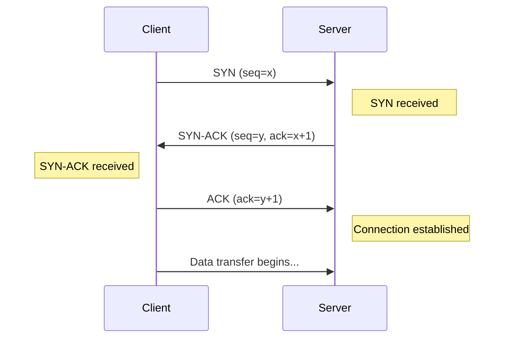
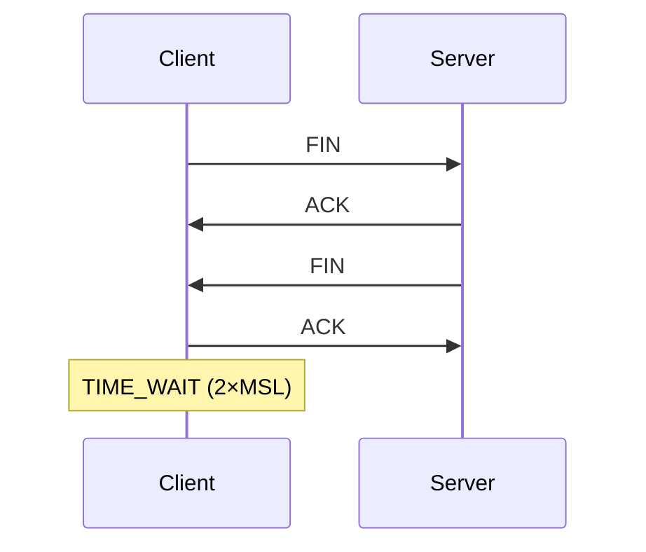
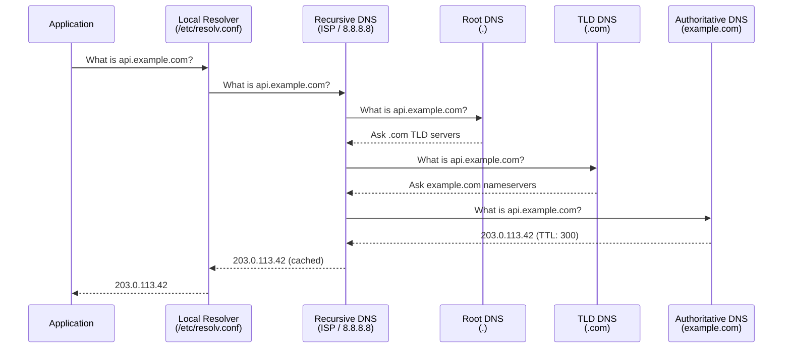
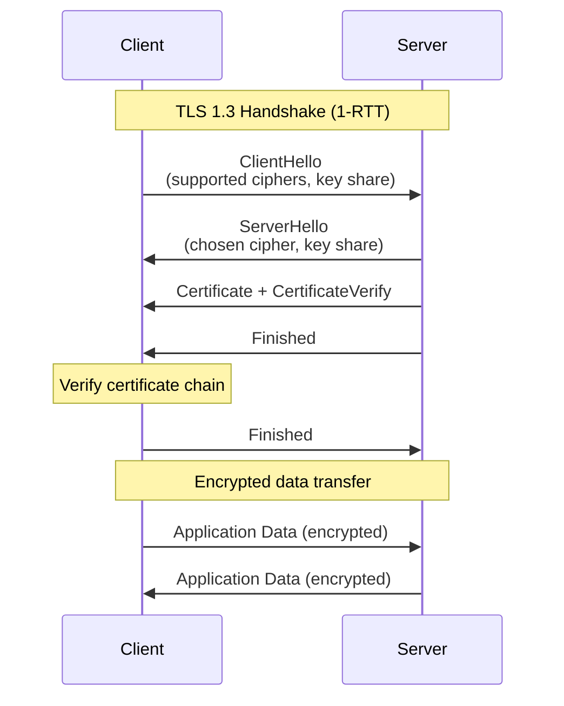

# 🌐 Networking — Fundamentals for DevOps

> **Network concepts every DevOps engineer must understand.** OSI model, TCP/IP, DNS, HTTP/TLS, load balancing, proxies, and container/Kubernetes networking. For CLI tools, see [cli/networking/](../../cli/networking/).

---

## 📑 Table of Contents

- [OSI Model](#-osi-model)
- [TCP/IP](#-tcpip)
- [DNS](#-dns)
- [HTTP/HTTPS](#-httphttps)
- [TLS/SSL](#-tlsssl)
- [Load Balancing](#-load-balancing)
- [Proxies](#-proxies)
- [Container Networking](#-container-networking)
- [Kubernetes Networking](#-kubernetes-networking)
- [Common Network Issues](#-common-network-issues)
- [Related Topics](#-related-topics)

---

## 🧅 OSI Model

The OSI (Open Systems Interconnection) model describes how data flows through a network in seven layers. DevOps engineers primarily work with Layers 3, 4, and 7.

```
┌─────────────────────────────────────────────────┐
│  Layer 7 — Application    │ HTTP, DNS, SMTP     │ ← You configure this
│  Layer 6 — Presentation   │ TLS/SSL, encoding   │ ← TLS termination
│  Layer 5 — Session        │ Sockets, sessions    │
├───────────────────────────┼─────────────────────┤
│  Layer 4 — Transport      │ TCP, UDP             │ ← Load balancers (L4)
├───────────────────────────┼─────────────────────┤
│  Layer 3 — Network        │ IP, ICMP, routing    │ ← Routing, firewalls
│  Layer 2 — Data Link      │ Ethernet, MAC, ARP   │ ← Switches, VLANs
│  Layer 1 — Physical       │ Cables, radio, fiber │
└─────────────────────────────────────────────────┘
```

### DevOps-Relevant Layers

| Layer | What You Manage | Tools |
|-------|----------------|-------|
| **Layer 7 (Application)** | HTTP routing, API gateways, Ingress rules, DNS records | curl, Ingress controllers, ALB |
| **Layer 4 (Transport)** | TCP/UDP port exposure, health checks, L4 load balancers | ss, netstat, NLB, iptables |
| **Layer 3 (Network)** | IP addressing, routing, subnets, VPCs, firewalls | ip, route, traceroute, VPC |

### TCP vs UDP

| Aspect | TCP | UDP |
|--------|-----|-----|
| **Connection** | Connection-oriented (handshake) | Connectionless |
| **Reliability** | Guaranteed delivery, ordering | Best effort, no guarantees |
| **Speed** | Slower (overhead) | Faster (minimal overhead) |
| **Use Cases** | HTTP, databases, SSH, SMTP | DNS, video streaming, gaming, metrics |

---

## 🔌 TCP/IP

### Three-Way Handshake



### Connection Termination (Four-Way)



### TCP Connection States

| State | Description |
|-------|-------------|
| `LISTEN` | Server waiting for connections |
| `SYN_SENT` | Client initiated connection |
| `SYN_RECEIVED` | Server received SYN, sent SYN-ACK |
| `ESTABLISHED` | Connection active |
| `FIN_WAIT_1` | Initiator sent FIN |
| `FIN_WAIT_2` | Initiator received ACK for FIN |
| `TIME_WAIT` | Waiting for stale packets to expire (2×MSL ≈ 60s) |
| `CLOSE_WAIT` | Received FIN, waiting for app to close |
| `LAST_ACK` | Sent FIN, waiting for final ACK |

> ⚠️ **TIME_WAIT accumulation** is a common issue on high-traffic servers. Thousands of TIME_WAIT connections can exhaust ephemeral ports. Tune `net.ipv4.tcp_tw_reuse` or use connection pooling.

### Common Ports

| Port | Service | Protocol |
|------|---------|----------|
| 22 | SSH | TCP |
| 53 | DNS | TCP/UDP |
| 80 | HTTP | TCP |
| 443 | HTTPS | TCP |
| 5432 | PostgreSQL | TCP |
| 3306 | MySQL | TCP |
| 6379 | Redis | TCP |
| 27017 | MongoDB | TCP |
| 9090 | Prometheus | TCP |
| 9100 | Node Exporter | TCP |
| 2379 | etcd client | TCP |
| 6443 | Kubernetes API | TCP |
| 10250 | kubelet API | TCP |

### Debugging TCP Connections

```bash
# List listening ports
ss -tlnp
netstat -tlnp

# Count connections by state
ss -s
ss -tan | awk '{print $1}' | sort | uniq -c | sort -rn

# Check connectivity
nc -zv host 443                # Test TCP connection
telnet host 443                # Interactive test
curl -v telnet://host:443      # Via curl
```

---

## 🌍 DNS

DNS (Domain Name System) translates human-readable domain names to IP addresses.

### DNS Resolution Process



### DNS Record Types

| Type | Purpose | Example |
|------|---------|---------|
| **A** | Domain → IPv4 address | `api.example.com → 203.0.113.42` |
| **AAAA** | Domain → IPv6 address | `api.example.com → 2001:db8::1` |
| **CNAME** | Alias to another domain | `www.example.com → example.com` |
| **MX** | Mail server routing | `example.com → mail.example.com (priority 10)` |
| **TXT** | Arbitrary text (SPF, DKIM, verification) | `example.com → "v=spf1 include:_spf.google.com"` |
| **SRV** | Service location (port + host) | `_http._tcp.example.com → 0 5 80 web.example.com` |
| **PTR** | Reverse lookup (IP → domain) | `42.113.0.203.in-addr.arpa → api.example.com` |
| **NS** | Nameserver delegation | `example.com → ns1.dnshost.com` |
| **SOA** | Zone authority and metadata | Serial number, refresh intervals, admin email |
| **CAA** | Certificate authority authorization | `example.com → 0 issue "letsencrypt.org"` |

### DNS in Kubernetes

```
# Cluster DNS (CoreDNS) resolution order:
1. <service>                                    # Same namespace
2. <service>.<namespace>                        # Cross-namespace
3. <service>.<namespace>.svc.cluster.local      # Full FQDN

# Pod DNS config in /etc/resolv.conf:
nameserver 10.96.0.10           # CoreDNS ClusterIP
search default.svc.cluster.local svc.cluster.local cluster.local
options ndots:5
```

> **ndots:5** means any name with fewer than 5 dots is searched against all search domains first. This can cause excessive DNS queries. For external domains, use trailing dots (`api.example.com.`) or reduce ndots.

### DNS Debugging

```bash
# Lookup
nslookup example.com
dig example.com
dig @8.8.8.8 example.com A       # Query specific DNS server
dig example.com +short            # Short output
dig example.com MX                # Specific record type

# Trace full resolution
dig example.com +trace

# Reverse lookup
dig -x 203.0.113.42

# Check DNS in Kubernetes
kubectl exec <pod> -- nslookup myservice
kubectl exec <pod> -- cat /etc/resolv.conf
kubectl exec <pod> -- nslookup kubernetes.default.svc.cluster.local
```

---

## 🌐 HTTP/HTTPS

### HTTP Versions

| Version | Key Features |
|---------|-------------|
| **HTTP/1.1** | Persistent connections, chunked transfer, Host header. One request per connection (head-of-line blocking). |
| **HTTP/2** | Multiplexed streams (multiple requests per connection), header compression (HPACK), server push, binary framing. |
| **HTTP/3** | QUIC (UDP-based), eliminates TCP head-of-line blocking, 0-RTT connection resumption, built-in encryption. |

### HTTP Methods

| Method | Idempotent | Safe | Use Case |
|--------|:----------:|:----:|----------|
| `GET` | ✅ | ✅ | Retrieve resource |
| `HEAD` | ✅ | ✅ | Like GET but no body |
| `POST` | ❌ | ❌ | Create resource |
| `PUT` | ✅ | ❌ | Replace resource |
| `PATCH` | ❌ | ❌ | Partial update |
| `DELETE` | ✅ | ❌ | Delete resource |
| `OPTIONS` | ✅ | ✅ | CORS preflight, list methods |

### HTTP Status Codes

| Range | Category | Common Codes |
|-------|----------|-------------|
| **1xx** | Informational | `101 Switching Protocols` (WebSocket) |
| **2xx** | Success | `200 OK`, `201 Created`, `204 No Content` |
| **3xx** | Redirection | `301 Moved Permanently`, `302 Found`, `304 Not Modified` |
| **4xx** | Client Error | `400 Bad Request`, `401 Unauthorized`, `403 Forbidden`, `404 Not Found`, `429 Too Many Requests` |
| **5xx** | Server Error | `500 Internal Server Error`, `502 Bad Gateway`, `503 Service Unavailable`, `504 Gateway Timeout` |

### Key HTTP Headers

| Header | Direction | Purpose |
|--------|-----------|---------|
| `Content-Type` | Both | Media type (`application/json`, `text/html`) |
| `Authorization` | Request | Auth credentials (`Bearer <token>`, `Basic <b64>`) |
| `Cache-Control` | Both | Caching directives (`max-age=3600`, `no-cache`) |
| `X-Request-ID` | Both | Request tracing across services |
| `X-Forwarded-For` | Request | Client IP behind proxies/load balancers |
| `X-Forwarded-Proto` | Request | Original protocol (http/https) behind proxy |
| `Retry-After` | Response | When to retry (with 429/503) |
| `Strict-Transport-Security` | Response | Force HTTPS (HSTS) |

---

## 🔒 TLS/SSL

TLS (Transport Layer Security) encrypts communication between client and server. SSL is the deprecated predecessor — when people say "SSL", they usually mean TLS.

### TLS Handshake (TLS 1.3)



### Certificate Chain

```
Root CA (trusted, in browser/OS store)
  └── Intermediate CA (signed by Root)
        └── Server Certificate (signed by Intermediate)
              - Subject: api.example.com
              - SAN: api.example.com, *.example.com
              - Valid: 2026-01-01 to 2027-01-01
```

### Certificate Types

| Type | Validation | Trust Level | Use Case |
|------|-----------|:-----------:|----------|
| **DV** (Domain Validated) | Domain ownership only | Low | Basic encryption (Let's Encrypt) |
| **OV** (Organization Validated) | Domain + organization | Medium | Business websites |
| **EV** (Extended Validation) | Domain + org + legal | High | Banking, e-commerce |
| **Self-signed** | None | None | Development, internal testing |

### mTLS (Mutual TLS)

Both client and server present certificates. The server verifies the client's identity, and the client verifies the server's identity.

```
Standard TLS:  Client verifies Server certificate
mTLS:          Client verifies Server certificate
               AND Server verifies Client certificate
```

Used in: Service meshes (Istio, Linkerd), zero-trust networking, API authentication between services.

### TLS Debugging

```bash
# Check server certificate
openssl s_client -connect example.com:443 -servername example.com

# View certificate details
echo | openssl s_client -connect example.com:443 2>/dev/null | openssl x509 -text -noout

# Check certificate expiry
echo | openssl s_client -connect example.com:443 2>/dev/null | openssl x509 -dates -noout

# Test TLS versions
curl -v --tlsv1.3 https://example.com
openssl s_client -connect example.com:443 -tls1_3

# Verify certificate chain
openssl verify -CAfile ca-bundle.crt server.crt
```

---

## ⚖️ Load Balancing

Load balancers distribute traffic across multiple servers to improve availability, reliability, and performance.

### L4 vs L7 Load Balancing

| Aspect | L4 (Transport) | L7 (Application) |
|--------|----------------|-------------------|
| **Operates on** | TCP/UDP (IP + port) | HTTP (headers, path, host) |
| **Speed** | Faster (no payload inspection) | Slower (inspects content) |
| **Routing** | IP hash, round robin, least connections | Path, host, header, cookie-based |
| **TLS** | Pass-through or terminate | Terminate and inspect |
| **Health checks** | TCP connection | HTTP request/response |
| **Examples** | AWS NLB, HAProxy (TCP mode) | AWS ALB, NGINX, Traefik, Envoy |
| **Use case** | Database, non-HTTP protocols, raw TCP | HTTP APIs, microservices, WebSocket |

### Load Balancing Algorithms

| Algorithm | Description | Best For |
|-----------|-------------|----------|
| **Round Robin** | Distribute evenly in rotation | Equal-capacity backends |
| **Weighted Round Robin** | Proportional distribution by weight | Mixed-capacity backends |
| **Least Connections** | Route to server with fewest active connections | Long-lived connections |
| **IP Hash** | Consistent routing by client IP | Session persistence (stateful) |
| **Random** | Random server selection | Simple, surprisingly effective |
| **Least Response Time** | Route to fastest server | Performance-sensitive apps |

### Health Checks

```
Active Health Checks:
  Load balancer periodically sends probe to each backend
  → HTTP GET /health → 200 OK = healthy
  → Failed N times in a row = remove from pool

Passive Health Checks:
  Monitor actual traffic for errors
  → Too many 5xx responses = mark unhealthy
  → Automatically re-add after recovery
```

### AWS Load Balancers

| Type | Layer | Protocol | Use Case |
|------|-------|----------|----------|
| **ALB** (Application) | L7 | HTTP/HTTPS, gRPC, WebSocket | Web APIs, microservices |
| **NLB** (Network) | L4 | TCP, UDP, TLS | High-performance, non-HTTP |
| **CLB** (Classic) | L4/L7 | Legacy | Deprecated, migrate to ALB/NLB |
| **GLB** (Gateway) | L3 | IP | Firewalls, IDS/IPS appliances |

---

## 🔄 Proxies

### Forward Proxy

Client → Forward Proxy → Internet

```
Use cases:
- Internet access control (corporate networks)
- Caching (Squid)
- Anonymity
- Content filtering

The server sees the proxy's IP, not the client's.
```

### Reverse Proxy

Client → Reverse Proxy → Backend Servers

```
Use cases:
- Load balancing (NGINX, HAProxy, Envoy)
- TLS termination
- Caching
- Compression
- Rate limiting
- Authentication

The client sees the proxy's IP, not the backend's.
```

### Common Reverse Proxies

| Tool | Strengths |
|------|----------|
| **NGINX** | Web server + reverse proxy, widely adopted, mature |
| **Envoy** | Modern L7 proxy, service mesh sidecar (Istio), observability |
| **HAProxy** | High-performance L4/L7, reliable under extreme load |
| **Traefik** | Auto-discovery, Let's Encrypt, Docker/K8s native |
| **Caddy** | Automatic HTTPS, simple config, modern defaults |

### SOCKS Proxy

Operates at Layer 5 (session). Forwards any TCP traffic, not just HTTP.

```bash
# SSH SOCKS proxy
ssh -D 1080 user@server
# All traffic through localhost:1080 is forwarded through the SSH server

# Use with curl
curl --socks5 localhost:1080 https://example.com
```

---

## 🐳 Container Networking

### Docker Bridge Network

```
┌────────────────────────────────────────────────────┐
│  Docker Host                                        │
│  ┌──────────────────────────────────────────────┐  │
│  │  docker0 bridge (172.17.0.1)                  │  │
│  │  ┌────────┐  ┌────────┐  ┌────────┐         │  │
│  │  │  veth   │  │  veth   │  │  veth   │        │  │
│  │  └───┬────┘  └───┬────┘  └───┬────┘         │  │
│  └──────┼────────────┼──────────┼───────────────┘  │
│         │            │          │                   │
│    ┌────┴───┐  ┌────┴───┐ ┌───┴────┐              │
│    │ Container│ │ Container│ │Container│             │
│    │ .17.0.2 │ │ .17.0.3 │ │ .17.0.4│             │
│    └────────┘  └────────┘ └────────┘              │
│                                                    │
│  iptables NAT → eth0 (host) → Internet             │
└────────────────────────────────────────────────────┘
```

### Overlay Network (Multi-Host)

```
┌─────────────────┐              ┌─────────────────┐
│  Host A          │              │  Host B          │
│  ┌────────────┐  │   VXLAN     │  ┌────────────┐  │
│  │ Container 1│  │◄──tunnel──►│  │ Container 2│  │
│  │ 10.0.1.2   │  │   (UDP     │  │ 10.0.1.3   │  │
│  └────────────┘  │    4789)    │  └────────────┘  │
└─────────────────┘              └─────────────────┘
```

Overlay networks encapsulate container traffic in VXLAN tunnels, allowing containers on different hosts to communicate as if on the same L2 network.

### CNI (Container Network Interface)

CNI is a specification for configuring network interfaces in Linux containers. Kubernetes uses CNI plugins to set up pod networking.

| Plugin | Method | Features |
|--------|--------|----------|
| **Calico** | L3 (BGP) or overlay (VXLAN) | NetworkPolicy, high performance |
| **Cilium** | eBPF | Advanced policies, observability, encryption |
| **Flannel** | Overlay (VXLAN) | Simple, no NetworkPolicy |
| **AWS VPC CNI** | Native VPC IPs | Pods get real ENI IPs, security groups |
| **Weave** | Mesh overlay | Encryption, DNS, simple |

---

## ☸️ Kubernetes Networking

### Pod-to-Pod Communication

Every pod gets a unique IP address. All pods can reach each other without NAT across all nodes.

```
Node 1 (10.0.1.0/24)          Node 2 (10.0.2.0/24)
┌─────────────────┐           ┌─────────────────┐
│ Pod A: 10.244.1.2│           │ Pod C: 10.244.2.2│
│ Pod B: 10.244.1.3│◄────────►│ Pod D: 10.244.2.3│
└─────────────────┘  (CNI)    └─────────────────┘
```

### Service Networking

Services provide stable virtual IPs (ClusterIP) that front a set of pods.

```
Client Pod → ClusterIP (10.96.0.42:80) → kube-proxy rules → Pod IP:targetPort
```

kube-proxy implements Services using:
- **iptables mode** (default): iptables DNAT rules with random selection
- **IPVS mode**: Linux IPVS kernel module with real load balancing algorithms
- **nftables mode** (K8s 1.29+): Modern replacement for iptables

### Ingress Traffic Flow

```
Internet → LoadBalancer → Ingress Controller Pod → Service → App Pods
```

### NetworkPolicy

NetworkPolicies are Kubernetes-native firewalls that restrict pod-to-pod traffic. They are enforced by the CNI plugin (Calico, Cilium — not Flannel).

```yaml
# Allow only web pods to talk to api pods on port 8080
apiVersion: networking.k8s.io/v1
kind: NetworkPolicy
metadata:
  name: allow-web-to-api
spec:
  podSelector:
    matchLabels:
      app: api
  ingress:
    - from:
        - podSelector:
            matchLabels:
              app: web
      ports:
        - port: 8080
```

---

## 🐛 Common Network Issues

### DNS Failures

| Symptom | Possible Cause | Solution |
|---------|---------------|---------|
| `Name resolution failed` | DNS server unreachable | Check `/etc/resolv.conf`, CoreDNS pods |
| Slow DNS resolution | ndots:5 causing excessive queries | Use FQDN with trailing dot, reduce ndots |
| Intermittent DNS failures | CoreDNS overloaded | Scale CoreDNS, enable cache, check resource limits |
| External DNS fails in K8s | Missing egress NetworkPolicy for DNS | Allow UDP/TCP port 53 in egress policies |

### Connection Timeouts

| Symptom | Possible Cause | Solution |
|---------|---------------|---------|
| Connection timed out | Firewall/security group blocking | Check security groups, NetworkPolicy, iptables |
| Connection refused | Service not listening on port | Check `ss -tlnp`, service port mapping |
| Intermittent timeouts | Overloaded backend, health check failures | Check backend health, scale up, check limits |
| Proxy timeout | Upstream too slow | Increase proxy timeout, optimize backend |

### Port Conflicts

```bash
# Find what's using a port
ss -tlnp | grep :8080
lsof -i :8080
fuser 8080/tcp

# Kill process on a port
fuser -k 8080/tcp
```

### MTU Issues

```bash
# Symptoms: large packets dropped, partial page loads, SSH works but SCP fails

# Check MTU
ip link show eth0               # Default: 1500
ping -M do -s 1472 target      # Test MTU (1472 + 28 = 1500)

# VXLAN/overlay networks need smaller MTU
# Container MTU = Host MTU - VXLAN overhead (50 bytes)
# 1500 - 50 = 1450 for container interfaces

# Fix: set MTU on container network
# Docker: --mtu=1450 in daemon.json
# Calico: MTU_INTERFACE_PATTERN env var
```

### Debugging Toolkit

```bash
# Comprehensive network debugging pod
kubectl run netshoot --rm -it --image=nicolaka/netshoot -- bash

# Inside the pod:
nslookup myservice                    # DNS
curl -v http://myservice:8080/health  # HTTP connectivity
tcpdump -i eth0 -nn port 8080        # Packet capture
mtr myservice                         # Traceroute + ping
iperf3 -c target -p 5201             # Bandwidth test
ss -s                                 # Socket stats
ip route show                         # Routing table
iptables -L -n                        # Firewall rules
```

---

## 🔗 Related Topics

| Topic | Link |
|-------|------|
| Networking CLI Tools | [cli/networking/](../../cli/networking/) |
| TLS & Certificates | [security/tls/](../../security/tls/) |
| Kubernetes Deep Dive | [devops/kubernetes/](../kubernetes/) |
| Docker Networking | [devops/docker/](../docker/#-networking) |
| Linux Networking | [devops/linux/](../linux/#-networking) |
| DNS Troubleshooting | [troubleshooting/dns/](../../troubleshooting/dns/) |
| Network Troubleshooting | [troubleshooting/networking/](../../troubleshooting/networking/) |

---

> **Next:** For hands-on networking commands, see [CLI Networking Tools](../../cli/networking/). For deeper TLS knowledge, see [Security — TLS](../../security/tls/).
