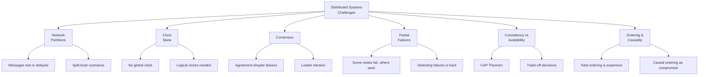
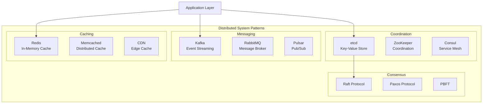

# 🌐 Distributed Systems

> **Understanding distributed systems is essential for building reliable, scalable, and fault-tolerant software.** A distributed system is a collection of independent computers that appears to its users as a single coherent system. These systems power everything from web search to banking to social media.

---

## 📑 Table of Contents

- [What Are Distributed Systems?](#-what-are-distributed-systems)
- [Why Distributed Systems?](#-why-distributed-systems)
- [Core Challenges](#-core-challenges)
- [Architecture Overview](#-architecture-overview)
- [Key Concepts](#-key-concepts)
- [Topics](#-topics)
- [Quick Reference](#-quick-reference)
- [Related Topics](#-related-topics)

---

## 🧠 What Are Distributed Systems?

A distributed system is a system whose components are located on different networked computers, which communicate and coordinate their actions by passing messages to one another. The components interact with one another to achieve a common goal.

**Key characteristics:**

- **Concurrency** — Components execute simultaneously and independently
- **No global clock** — Nodes cannot perfectly synchronize their clocks
- **Independent failures** — Components can fail independently without total system failure
- **Message passing** — Communication happens via network messages, not shared memory
- **Heterogeneity** — Different hardware, OS, and programming languages can coexist

---

## 💡 Why Distributed Systems?

| Motivation | Description |
|------------|-------------|
| **Scalability** | Handle more load by adding more machines (horizontal scaling) |
| **Reliability** | Survive hardware failures through redundancy and replication |
| **Performance** | Reduce latency by placing data/computation closer to users |
| **Geography** | Serve users across multiple regions and time zones |
| **Cost** | Commodity hardware is cheaper than a single supercomputer |
| **Modularity** | Independent teams can build, deploy, and scale services independently |

---

## ⚡ Core Challenges



### Network Partitions

Networks are unreliable. Messages can be lost, duplicated, delayed, or delivered out of order. A network partition splits the system into groups that cannot communicate with each other.

```text
Before partition:              During partition:
┌───┐   ┌───┐   ┌───┐        ┌───┐   ┌───┐ ╳ ┌───┐
│ A │───│ B │───│ C │        │ A │───│ B │   │ C │
└───┘   └───┘   └───┘        └───┘   └───┘   └───┘
                               Group 1         Group 2
```

### Clock Skew

Physical clocks on different machines drift apart. Even with NTP synchronization, clock differences of milliseconds to seconds are common. This makes it impossible to determine the exact ordering of events across nodes.

**Solutions:**
- **Logical clocks** (Lamport timestamps) — capture causal ordering
- **Vector clocks** — capture concurrent events
- **Hybrid logical clocks** — combine physical and logical time
- **TrueTime** (Google Spanner) — bounded clock uncertainty

### Consensus

Getting multiple nodes to agree on a value is fundamentally hard when nodes can fail and messages can be lost. The **FLP impossibility result** proves that no deterministic consensus protocol can guarantee progress in an asynchronous system with even one faulty node.

**Practical solutions:** Raft, Paxos, ZAB (ZooKeeper), Viewstamped Replication

### The Eight Fallacies of Distributed Computing

1. The network is reliable
2. Latency is zero
3. Bandwidth is infinite
4. The network is secure
5. Topology doesn't change
6. There is one administrator
7. Transport cost is zero
8. The network is homogeneous

---

## 🏗 Architecture Overview



---

## 🔑 Key Concepts

### CAP Theorem

You can only have two of three guarantees in a distributed system:

| Property | Description | Example |
|----------|-------------|---------|
| **Consistency** | Every read receives the most recent write | CP: etcd, ZooKeeper |
| **Availability** | Every request receives a response | AP: Cassandra, DynamoDB |
| **Partition Tolerance** | System operates despite network partitions | Required in practice |

> **In practice**, partition tolerance is mandatory (networks *will* fail), so the real choice is between **CP** (consistency + partition tolerance) and **AP** (availability + partition tolerance).

### Consistency Models

| Model | Guarantee | Example |
|-------|-----------|---------|
| **Strong (Linearizability)** | Reads always return the latest write | etcd, Spanner |
| **Sequential** | All nodes see operations in the same order | ZooKeeper |
| **Causal** | Causally related operations are ordered | MongoDB (causal reads) |
| **Eventual** | All replicas converge eventually | Cassandra, DynamoDB |

### Replication Strategies

| Strategy | Description | Trade-off |
|----------|-------------|-----------|
| **Single-leader** | One node accepts writes, replicates to followers | Simple, but leader is bottleneck |
| **Multi-leader** | Multiple nodes accept writes | Better availability, conflict resolution needed |
| **Leaderless** | Any node accepts reads/writes (quorum-based) | Highly available, eventual consistency |

---

## 📚 Topics

| Topic | Description | Key Technologies |
|-------|-------------|-----------------|
| [etcd](etcd/) | Distributed key-value store | Raft consensus, Kubernetes backbone |
| [Kafka](kafka/) | Distributed event streaming platform | Topics, partitions, consumer groups |
| [Consensus](consensus/) | Agreement protocols for distributed systems | Raft, Paxos, CAP theorem, quorums |
| [Caching](caching/) | Distributed caching strategies | Cache-aside, write-through, invalidation |

---

## ⚡ Quick Reference

### Consistency vs Availability Decision

```text
Question: Can I tolerate stale reads?

YES → Choose AP system (Cassandra, DynamoDB, CouchDB)
  ├── Use eventual consistency
  ├── Design for conflict resolution
  └── Optimize for availability and partition tolerance

NO → Choose CP system (etcd, ZooKeeper, PostgreSQL)
  ├── Accept higher latency
  ├── Accept potential unavailability during partitions
  └── Get strong consistency guarantees
```

### Common Distributed System Patterns

| Pattern | Use Case | Example |
|---------|----------|---------|
| **Leader Election** | Single coordinator | etcd, ZooKeeper |
| **Distributed Lock** | Mutual exclusion | Redis Redlock, etcd |
| **Service Discovery** | Finding services | Consul, etcd, DNS |
| **Event Sourcing** | Audit trail, replay | Kafka + event store |
| **CQRS** | Read/write separation | Kafka + read replicas |
| **Saga** | Distributed transactions | Orchestrator or choreography |
| **Circuit Breaker** | Failure isolation | Hystrix, resilience4j |

---

## 🔗 Related Topics

- [DevOps — Kubernetes](../devops/kubernetes/) — Container orchestration using distributed systems principles
- [Databases — PostgreSQL](../databases/postgresql/) — Replication and distributed SQL
- [Databases — Redis](../databases/redis/) — Distributed caching and data structures
- [Observability](../observability/) — Monitoring distributed systems
- [System Design](../system-design/) — Architecture patterns for distributed systems
- [Security](../security/) — Securing distributed communication

---

> **Distributed systems are inherently complex.** The key to building reliable systems is understanding the trade-offs, choosing the right consistency model for your use case, and designing for failure from the start.
