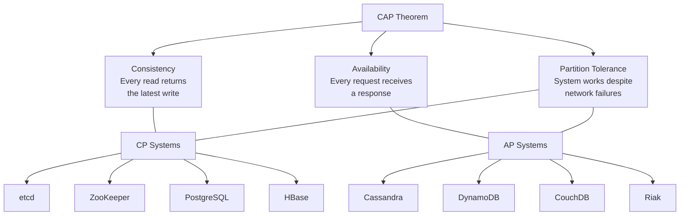
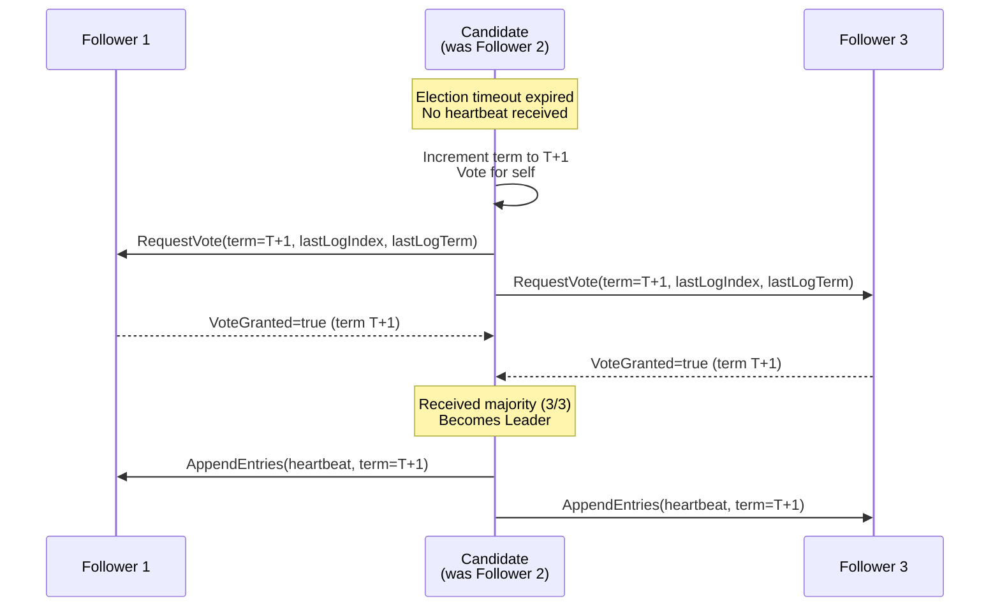
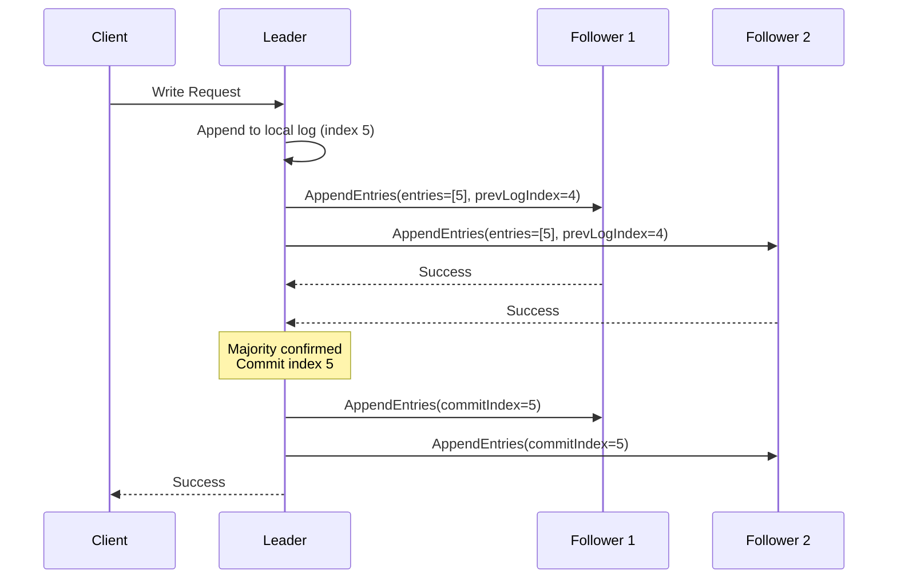

# 🤝 Consensus in Distributed Systems

> **Consensus is the fundamental problem of getting multiple nodes to agree on a single value, even when some nodes fail or messages are lost.** It's the foundation of distributed databases, coordination services, and replicated state machines.

---

## 📑 Table of Contents

- [What is Consensus?](#-what-is-consensus)
- [Why Consensus is Hard](#-why-consensus-is-hard)
- [CAP Theorem](#-cap-theorem)
- [Raft Protocol](#-raft-protocol)
- [Paxos](#-paxos)
- [Leader Election](#-leader-election)
- [Quorums](#-quorums)
- [Related Concepts](#-related-concepts)
- [Comparison of Consensus Systems](#-comparison-of-consensus-systems)
- [Related Topics](#-related-topics)

---

## 🧠 What is Consensus?

In a distributed system, consensus means all nodes agree on the same value or sequence of operations, even when:

- Some nodes crash or become unresponsive
- Messages are delayed, reordered, or lost
- Network partitions split the cluster

**Formal requirements:**

| Property | Description |
|----------|-------------|
| **Agreement** | All non-faulty nodes decide on the same value |
| **Validity** | The decided value was proposed by some node |
| **Termination** | All non-faulty nodes eventually decide |
| **Integrity** | Each node decides at most once |

**Where consensus is used:**

- **Replicated state machines** — etcd, ZooKeeper, CockroachDB
- **Leader election** — Choosing a single coordinator
- **Atomic broadcast** — Delivering messages in the same order to all nodes
- **Distributed locking** — Mutual exclusion across processes
- **Transaction commit** — Agreeing on whether to commit or abort

---

## ⚡ Why Consensus is Hard

### FLP Impossibility (1985)

Fischer, Lynch, and Paterson proved that **no deterministic consensus protocol can guarantee progress in an asynchronous system with even one faulty process**.

```text
Asynchronous system = no bound on message delivery time or processing speed

This means you cannot distinguish between:
- A crashed node
- A very slow node
- A node with network delay

If you wait forever → no termination
If you time out → might exclude a live node
```

**Practical implication:** All real consensus protocols use timeouts (partial synchrony assumption) to make progress. They sacrifice guaranteed liveness under complete asynchrony in exchange for safety (never deciding incorrectly).

### Byzantine Failures

| Failure Type | Description | Handling |
|-------------|-------------|----------|
| **Crash failures** | Node stops responding | Raft, Paxos (f+1 of 2f+1 nodes needed) |
| **Omission failures** | Node drops messages | Covered by crash-tolerant protocols |
| **Byzantine failures** | Node behaves arbitrarily (lies, corrupts) | BFT protocols (3f+1 nodes needed) |

> Most internal systems assume crash failures only. Byzantine fault tolerance is needed for blockchain and untrusted environments.

---

## 📐 CAP Theorem

### The Theorem

Proposed by Eric Brewer (2000), proved by Gilbert and Lynch (2002):

> In the presence of a network partition, a distributed system must choose between **Consistency** and **Availability**. You cannot have both.



### Real-World Examples

**CP System (etcd) — Partition scenario:**

```text
Cluster: 5 nodes, Node A is leader

Network partition splits: {A, B, C} and {D, E}

Majority side {A, B, C}:
  ✓ Can still form quorum (3/5)
  ✓ Accepts reads and writes
  ✓ Consistent

Minority side {D, E}:
  ✗ Cannot form quorum (2/5)
  ✗ Rejects writes
  ✗ Reads may be stale or rejected
  = UNAVAILABLE (chose consistency over availability)
```

**AP System (Cassandra) — Partition scenario:**

```text
Cluster: 5 nodes, replication factor 3

Network partition splits: {A, B, C} and {D, E}

Both sides:
  ✓ Accept reads and writes
  ✓ System remains available
  ✗ Writes on different sides may conflict
  = INCONSISTENT (chose availability over consistency)

After partition heals:
  → Conflict resolution (last-write-wins, vector clocks, etc.)
```

### PACELC Extension

When there is **no partition** (normal operation), you must still choose between **latency** and **consistency**:

```text
PACELC: If Partition → choose A or C
        Else        → choose L or C

┌──────────────────┬───────────────────────────────┐
│ System           │ PACELC Classification          │
├──────────────────┼───────────────────────────────┤
│ PostgreSQL       │ PC/EC (consistency always)      │
│ etcd             │ PC/EC (consistency always)      │
│ Cassandra        │ PA/EL (availability + latency)  │
│ DynamoDB         │ PA/EL (availability + latency)  │
│ MongoDB          │ PA/EC (available, but consistent │
│                  │        in normal operation)      │
│ Spanner          │ PC/EC (consistency, but global)  │
└──────────────────┴───────────────────────────────┘
```

---

## 🔄 Raft Protocol

Raft was designed by Diego Ongaro and John Ousterhout (2013) as an understandable alternative to Paxos. It's used in etcd, CockroachDB, TiKV, Consul, and many more.

### Overview

Raft decomposes consensus into three sub-problems:

1. **Leader Election** — Choosing one leader among nodes
2. **Log Replication** — Leader replicates operations to followers
3. **Safety** — Ensuring all nodes have the same log

### Node States

```text
                    starts as
                    ┌──────────┐
                    │ Follower │
                    └────┬─────┘
                         │
             election timeout expired
             (no heartbeat from leader)
                         │
                         ▼
                    ┌──────────┐
                    │ Candidate│──── receives majority votes ──►┌────────┐
                    └────┬─────┘                                │ Leader │
                         │                                      └────┬───┘
                    discovers leader                                 │
                    or higher term                            discovers higher
                         │                                    term or steps down
                         ▼                                          │
                    ┌──────────┐                                    │
                    │ Follower │◄───────────────────────────────────┘
                    └──────────┘
```

### Leader Election (Detailed)



**Election rules:**
- Each node votes for **at most one candidate** per term
- Candidate must have log at least as up-to-date as voter's log
- Randomized election timeouts (150-300ms) prevent split votes
- If no winner, new election with incremented term

### Log Replication



**Log structure:**

```text
Leader log:
┌─────┬─────┬─────┬─────┬─────┬─────┐
│ T:1 │ T:1 │ T:2 │ T:3 │ T:3 │ T:3 │
│ x=1 │ y=2 │ x=3 │ y=4 │ z=5 │ x=6 │
├─────┼─────┼─────┼─────┼─────┼─────┤
│  1  │  2  │  3  │  4  │  5  │  6  │
└─────┴─────┴─────┴─────┴─────┴─────┘
                              ▲
                         commit index = 5
                    (replicated to majority)
```

### Safety Properties

| Property | Guarantee |
|----------|-----------|
| **Election Safety** | At most one leader per term |
| **Leader Append-Only** | Leader never overwrites or deletes its log entries |
| **Log Matching** | If two logs have an entry with the same index and term, all preceding entries are identical |
| **Leader Completeness** | If an entry is committed in a given term, it will be present in all leaders for higher terms |
| **State Machine Safety** | If a node applies a log entry at a given index, no other node applies a different entry at that index |

---

## 📜 Paxos

Paxos was described by Leslie Lamport (1989, published 1998). It's the theoretical foundation for many consensus systems but is notoriously difficult to understand and implement.

### Basic Paxos (Single-Decree)

Roles: **Proposers**, **Acceptors**, **Learners**

```text
Phase 1: Prepare
  Proposer → Acceptors: "Prepare(n)" where n is proposal number
  Acceptors → Proposer: "Promise(n)" + any previously accepted value

Phase 2: Accept
  Proposer → Acceptors: "Accept(n, value)"
  Acceptors → Proposer: "Accepted(n, value)"

Phase 3: Learn
  Acceptors → Learners: "Decided(value)"
```

### Multi-Paxos

For agreeing on a sequence of values (log entries), Multi-Paxos optimizes by:

1. Electing a stable leader (reduces Phase 1 to once)
2. Leader assigns consecutive log slots
3. Only Phase 2 needed for each new entry

### Raft vs Paxos

| Aspect | Raft | Paxos |
|--------|------|-------|
| **Understandability** | Designed for clarity | Notoriously complex |
| **Leader** | Strong leader required | Multi-Paxos has leader optimization |
| **Log** | Contiguous log, no gaps | Gaps possible in basic Paxos |
| **Membership changes** | Joint consensus or single-server | Not well-defined in basic Paxos |
| **Implementations** | etcd, Consul, CockroachDB, TiKV | Chubby, Spanner, ZooKeeper (ZAB variant) |
| **Real-world usage** | Most new systems choose Raft | Legacy systems, Google infrastructure |

---

## 👑 Leader Election

### Mechanisms

| Mechanism | How It Works | Used By |
|-----------|-------------|---------|
| **Raft election** | Timeout → candidate → majority votes | etcd, Consul |
| **Bully algorithm** | Highest-ID node wins | Simple systems |
| **ZAB (ZooKeeper)** | Epoch-based, similar to Raft | ZooKeeper |
| **Lease-based** | Leader holds time-bounded lease | Chubby, some databases |

### Fencing Tokens

Prevent stale leaders from making changes after a new leader is elected:

```text
Problem: "Split-brain" without fencing

Time →
Leader A:  [holds lock]────[network delay]────[thinks it's still leader]──[WRITES!]
Leader B:               [elected]────────────[also writes]

Both leaders write → DATA CORRUPTION

Solution: Fencing tokens (monotonically increasing)

Leader A: token=33 → [lock] → [network delay] → write(token=33) → REJECTED (34 > 33)
Leader B: token=34 → [lock] → write(token=34) → ACCEPTED
```

### Split-Brain Prevention

```text
5-node cluster: {A, B, C, D, E}

Partition: {A, B} | {C, D, E}

Without quorum:
  A thinks it's leader → accepts writes
  C thinks it's leader → accepts writes
  = SPLIT BRAIN (two leaders, divergent state)

With quorum (majority = 3):
  {A, B} → only 2 nodes, cannot form quorum → A steps down
  {C, D, E} → 3 nodes, forms quorum → C elected leader
  = SAFE (single leader)
```

---

## 🗳 Quorums

### Read/Write Quorums

For a system with **N** replicas:

```text
Write quorum: W nodes must acknowledge a write
Read quorum:  R nodes must respond to a read

For strong consistency: W + R > N

Example: N=5
  W=3, R=3 → 3+3=6 > 5 → consistent (overlap guaranteed)
  W=2, R=4 → 2+4=6 > 5 → consistent (read-heavy optimization)
  W=4, R=2 → 4+2=6 > 5 → consistent (write-optimized reads)
  W=2, R=2 → 2+2=4 < 5 → NOT consistent (possible stale reads)
```

### Quorum Intersection

```text
N=5 nodes: {A, B, C, D, E}

Write W=3 to: {A, B, C}        Read R=3 from: {C, D, E}
              ┌───┐                            ┌───┐
              │ A │ ←write                     │ D │ ←read
              └───┘                            └───┘
              ┌───┐     ┌───┐                  ┌───┐
              │ B │ ←wr │ C │ ←write AND read  │ E │ ←read
              └───┘     └───┘                  └───┘
                     ↑
              Intersection: at least one node (C)
              has the latest write → read returns fresh data
```

### Sloppy Quorums

Used in systems like Dynamo/Cassandra for higher availability:

```text
Strict quorum: Write must go to designated replicas for key
Sloppy quorum: Write can go to any N nodes (including non-designated)

Trade-off: Higher availability, but reads may not find the latest write
           → Needs read repair and anti-entropy for eventual consistency
```

---

## 🧩 Related Concepts

### Distributed Locking

```text
Using etcd:
1. Create key with lease (TTL)
2. Use transaction: if key doesn't exist → create (acquire lock)
3. Watch for key deletion (wait for lock)
4. Delete key to release lock

Using Redis (Redlock):
1. Acquire lock on N/2+1 Redis nodes
2. If acquired on majority within timeout → lock acquired
3. Release on all nodes when done
```

**Dangers of distributed locks:**
- Lock holder may crash → need TTL/lease expiration
- GC pause or network delay → lock may expire while processing
- Always use fencing tokens for correctness

### Idempotency

Making operations safe to retry:

```text
Non-idempotent: "Add $10 to balance"
  Retry = balance increases by $20 (double-applied!)

Idempotent: "Set balance to $110 if version = 5"
  Retry = same result (version check prevents double-apply)

Strategies:
- Unique request IDs (deduplication)
- Version numbers / ETags
- Database upserts (INSERT ... ON CONFLICT UPDATE)
```

### Generation / Epoch Numbers

```text
Term (Raft) / Epoch (ZooKeeper) / Ballot (Paxos):

Monotonically increasing number that identifies a "reign":

Term 1: Leader A → operations 1, 2, 3
Term 2: Leader B → operations 4, 5       (A failed, B elected)
Term 3: Leader A → operations 6, 7       (A recovered, re-elected)

Any message from Term 1 is rejected if current term is 3.
Prevents stale leaders from causing harm.
```

### Consistency Models Spectrum

```text
Strongest                                                    Weakest
←──────────────────────────────────────────────────────────────→
Linearizable → Sequential → Causal → PRAM → Eventual → None
    |              |           |        |        |
  etcd         ZooKeeper   MongoDB  Dynamo   DNS cache
  Spanner      (writes)    (causal   (per-
                            reads)    client)
```

---

## 📊 Comparison of Consensus Systems

| System | Protocol | Consistency | Failure Model | Use Case |
|--------|----------|------------|---------------|----------|
| **etcd** | Raft | Linearizable | Crash | Kubernetes state, config |
| **ZooKeeper** | ZAB | Sequential | Crash | Hadoop coordination, Kafka |
| **Consul** | Raft | Linearizable | Crash | Service discovery, KV store |
| **CockroachDB** | Raft (per-range) | Serializable | Crash | Distributed SQL |
| **TiKV** | Raft (per-region) | Linearizable | Crash | Distributed KV (TiDB) |
| **Spanner** | Paxos | External | Crash | Global distributed SQL |
| **Tendermint** | PBFT variant | BFT | Byzantine | Blockchain, Cosmos |

---

## 🔗 Related Topics

- [Distributed Systems — etcd](../etcd/) — Raft consensus in practice
- [Distributed Systems — Kafka](../kafka/) — Replication and ISR (not Raft-based)
- [Distributed Systems — Caching](../caching/) — Cache consistency challenges
- [Databases — PostgreSQL](../../databases/postgresql/) — Replication and consistency in RDBMS
- [Databases — Redis](../../databases/redis/) — Redis Sentinel and Cluster consensus
- [System Design — Fundamentals](../../system-design/fundamentals.md) — Trade-offs in system design

---

> **Consensus is solved in theory but endlessly nuanced in practice.** The right protocol depends on your failure model, consistency requirements, and performance needs. Most systems should use an existing implementation (etcd, ZooKeeper) rather than building their own.
