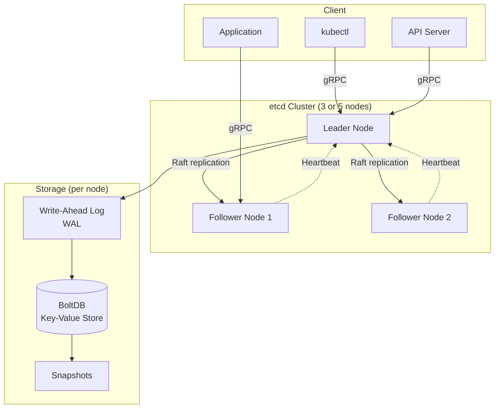
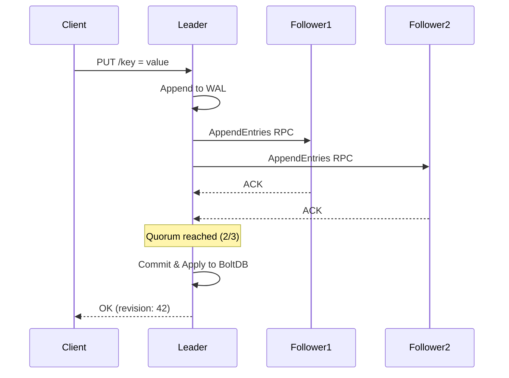

# 🔑 etcd

> **The backbone of Kubernetes and many distributed systems.** etcd is a strongly consistent, distributed key-value store that provides a reliable way to store data across a cluster of machines. It's the source of truth for Kubernetes cluster state, configuration, and service discovery.

---

## 📑 Table of Contents

- [What is etcd?](#-what-is-etcd)
- [Architecture](#-architecture)
- [Data Model](#-data-model)
- [Key Operations](#-key-operations)
- [CLI Reference (etcdctl)](#-cli-reference-etcdctl)
- [Cluster Management](#-cluster-management)
- [Authentication & Authorization](#-authentication--authorization)
- [Performance](#-performance)
- [Backup & Restore](#-backup--restore)
- [Kubernetes Integration](#-kubernetes-integration)
- [Monitoring](#-monitoring)
- [Troubleshooting](#-troubleshooting)
- [Production Tips](#-production-tips)
- [Related Topics](#-related-topics)

---

## 🧠 What is etcd?

etcd (pronounced "et-see-dee") is a distributed, reliable key-value store for the most critical data of a distributed system. The name comes from the UNIX `/etc` directory (where configuration is stored) + "d" for distributed.

**Key characteristics:**

- **Strongly consistent** — Uses Raft consensus; every read returns the most recent write
- **Highly available** — Tolerates minority node failures (e.g., 2 of 5 nodes can fail)
- **Watch support** — Clients can subscribe to key changes in real time
- **Transactional** — Supports atomic compare-and-swap operations
- **Secure** — Built-in TLS for client-server and peer-to-peer communication
- **Fast** — Benchmarked at 10,000+ writes/sec on modest hardware

**Use cases:**

| Use Case | Description |
|----------|-------------|
| **Kubernetes state store** | Stores all cluster state (pods, services, configs, secrets) |
| **Service discovery** | Register and discover services dynamically |
| **Distributed locking** | Coordinate access to shared resources |
| **Leader election** | Choose a single leader among distributed processes |
| **Configuration management** | Centralized, versioned configuration |
| **Feature flags** | Dynamic feature toggles with watch notifications |

---

## 🏗 Architecture



### Raft Consensus in etcd

etcd uses the **Raft consensus protocol** to replicate data across all nodes:

1. **Leader Election** — One node is elected leader; it handles all write requests
2. **Log Replication** — The leader appends entries to its log and replicates to followers
3. **Commit** — Once a majority (quorum) acknowledges, the entry is committed
4. **Apply** — Committed entries are applied to the state machine (BoltDB)



### Cluster Sizing

| Cluster Size | Quorum | Fault Tolerance | Recommended For |
|-------------|--------|-----------------|-----------------|
| 1 | 1 | 0 failures | Development only |
| 3 | 2 | 1 failure | Small production |
| 5 | 3 | 2 failures | Standard production |
| 7 | 4 | 3 failures | Large critical systems |

> **Rule of thumb:** Always use odd numbers. Even-numbered clusters don't improve fault tolerance but increase quorum requirements.

---

## 📊 Data Model

### Key-Value Store

etcd stores data as flat key-value pairs with a hierarchical namespace (using `/` as separator by convention):

```text
Key                              Value
────────────────────────────────────────────────────
/services/web/server1            {"host": "10.0.1.1", "port": 8080}
/services/web/server2            {"host": "10.0.1.2", "port": 8080}
/services/api/server1            {"host": "10.0.2.1", "port": 9090}
/config/database/host            "db.example.com"
/config/database/port            "5432"
```

### Revisions

Every modification to the key-value store increments a global **revision** number. This enables:

- **MVCC** (Multi-Version Concurrency Control) — Historical versions are accessible
- **Watch from revision** — Subscribe to changes starting from a specific point
- **Consistent reads** — Read at a specific revision for snapshot isolation

```text
Revision  Key              Value        Action
────────────────────────────────────────────────
1         /config/db       "host-a"     PUT
2         /config/port     "5432"       PUT
3         /config/db       "host-b"     PUT (update)
4         /config/port     -            DELETE
5         /config/db       "host-c"     PUT (update)
```

### Compaction

Over time, old revisions accumulate. **Compaction** removes revisions before a specified point:

```bash
# Compact all revisions before revision 1000
etcdctl compaction 1000

# Auto-compaction (retain last 1 hour)
# Set in etcd config: --auto-compaction-retention=1h
# Or periodic mode: --auto-compaction-mode=periodic --auto-compaction-retention=24h
```

### Key Leases

Leases provide TTL (time-to-live) for keys — useful for ephemeral registrations:

```bash
# Grant a lease with 60 second TTL
etcdctl lease grant 60
# Output: lease 694d7c91c1b4a50b granted with TTL(60s)

# Attach key to lease
etcdctl put --lease=694d7c91c1b4a50b /services/web/server1 '{"host":"10.0.1.1"}'

# Keep lease alive (heartbeat)
etcdctl lease keep-alive 694d7c91c1b4a50b

# Revoke lease (immediately deletes all attached keys)
etcdctl lease revoke 694d7c91c1b4a50b

# List leases
etcdctl lease list

# Get lease TTL and attached keys
etcdctl lease timetolive --keys 694d7c91c1b4a50b
```

---

## 🔧 Key Operations

### Put (Write)

```bash
# Simple put
etcdctl put /config/database/host "db.example.com"

# Put with lease (auto-expire)
etcdctl put --lease=694d7c91c1b4a50b /services/web/server1 "alive"

# Put only if key doesn't exist (using txn)
etcdctl txn <<EOF
compare:
  create("/lock/mylock") = "0"
success:
  put /lock/mylock "owner-1"
failure:
  get /lock/mylock
EOF
```

### Get (Read)

```bash
# Get single key
etcdctl get /config/database/host

# Get key (value only)
etcdctl get /config/database/host --print-value-only

# Get all keys with prefix
etcdctl get /config/ --prefix

# Get all keys
etcdctl get "" --prefix

# Get with revision (historical read)
etcdctl get /config/database/host --rev=42

# Get keys in range [key1, key2)
etcdctl get /config/a /config/z

# Count keys with prefix
etcdctl get /services/ --prefix --count-only

# Get with output format
etcdctl get /config/ --prefix -w json | jq
etcdctl get /config/ --prefix -w table
```

### Delete

```bash
# Delete single key
etcdctl del /config/database/host

# Delete all keys with prefix
etcdctl del /config/ --prefix

# Delete with previous value returned
etcdctl del /config/database/host --prev-kv

# Delete range
etcdctl del /config/a /config/z
```

### Watch

```bash
# Watch a single key
etcdctl watch /config/database/host

# Watch all keys with prefix
etcdctl watch /config/ --prefix

# Watch from specific revision
etcdctl watch /config/ --prefix --rev=42

# Watch with previous value
etcdctl watch /config/ --prefix --prev-kv

# Watch multiple keys
etcdctl watch -i
# Then type: watch /key1
# And: watch /key2
```

### Transactions (Compare-and-Swap)

```bash
# Atomic transaction
etcdctl txn --interactive
# compares:
# value("/config/version") = "1"
# 
# success requests:
# put /config/version "2"
# put /config/database/host "new-host.example.com"
# 
# failure requests:
# get /config/version

# One-liner transaction
etcdctl txn <<<'compare: value("/lock") = "" success: put /lock "owner-1" failure: get /lock'
```

---

## 📋 CLI Reference (etcdctl)

> **Important:** Set `ETCDCTL_API=3` to use the v3 API (default in etcd 3.4+).

### Environment Setup

```bash
# API version (always use v3)
export ETCDCTL_API=3

# TLS configuration
export ETCDCTL_CACERT=/etc/etcd/ca.crt
export ETCDCTL_CERT=/etc/etcd/client.crt
export ETCDCTL_KEY=/etc/etcd/client.key
export ETCDCTL_ENDPOINTS=https://etcd-1.example.com:2379,https://etcd-2.example.com:2379,https://etcd-3.example.com:2379
```

### Member Management

```bash
# List cluster members
etcdctl member list -w table

# Add a new member
etcdctl member add etcd-4 --peer-urls=https://etcd-4.example.com:2380

# Add a learner (non-voting member)
etcdctl member add etcd-4 --peer-urls=https://etcd-4.example.com:2380 --learner

# Promote learner to voting member
etcdctl member promote <member-id>

# Remove a member
etcdctl member remove <member-id>

# Update member peer URLs
etcdctl member update <member-id> --peer-urls=https://new-url.example.com:2380
```

### Endpoint Operations

```bash
# Check endpoint health
etcdctl endpoint health -w table

# Check endpoint status (leader, db size, raft index)
etcdctl endpoint status -w table

# Output example:
# +----------------------------+------------------+---------+---------+-----------+...
# |          ENDPOINT          |        ID        | VERSION | DB SIZE | IS LEADER |...
# +----------------------------+------------------+---------+---------+-----------+...
# | https://etcd-1:2379        | 8e9e05c52164694d |  3.5.12 |  5.6 MB |      true |...
# | https://etcd-2:2379        | b6f7e8a3c2d14e5f |  3.5.12 |  5.6 MB |     false |...
# | https://etcd-3:2379        | c4d5e6f7a8b9c0d1 |  3.5.12 |  5.6 MB |     false |...
# +----------------------------+------------------+---------+---------+-----------+...

# Check endpoint hash (data integrity)
etcdctl endpoint hashkv -w table
```

### Snapshot Operations

```bash
# Save snapshot
etcdctl snapshot save /backup/etcd-$(date +%Y%m%d-%H%M%S).db

# Check snapshot status
etcdctl snapshot status /backup/etcd-20250101-120000.db -w table

# Restore snapshot (creates new data directory)
etcdctl snapshot restore /backup/etcd-20250101-120000.db \
  --name etcd-1 \
  --initial-cluster etcd-1=https://etcd-1.example.com:2380,etcd-2=https://etcd-2.example.com:2380,etcd-3=https://etcd-3.example.com:2380 \
  --initial-cluster-token etcd-cluster-1 \
  --initial-advertise-peer-urls https://etcd-1.example.com:2380 \
  --data-dir /var/lib/etcd-restored
```

### Maintenance Operations

```bash
# Defragment (reclaim disk space after compaction)
etcdctl defrag --endpoints=https://etcd-1.example.com:2379

# Defragment all cluster members
etcdctl defrag --cluster

# Compact revisions (remove old revisions)
etcdctl compaction 1000

# Compact with physical deletion
etcdctl compaction --physical 1000

# Move leader to a different member
etcdctl move-leader <member-id>

# Alarm list (check for alarms)
etcdctl alarm list

# Alarm disarm (clear alarms)
etcdctl alarm disarm
```

### Auth Commands

```bash
# Enable authentication
etcdctl auth enable

# Disable authentication
etcdctl auth disable

# User management
etcdctl user add myuser
etcdctl user delete myuser
etcdctl user list
etcdctl user get myuser
etcdctl user passwd myuser
etcdctl user grant-role myuser myrole
etcdctl user revoke-role myuser myrole

# Role management
etcdctl role add myrole
etcdctl role delete myrole
etcdctl role list
etcdctl role get myrole
etcdctl role grant-permission myrole readwrite /config/ --prefix
etcdctl role revoke-permission myrole /config/ --prefix
```

---

## 🔄 Cluster Management

### Bootstrapping a New Cluster

#### Static Configuration

```bash
# Node 1
etcd --name etcd-1 \
  --initial-advertise-peer-urls https://etcd-1.example.com:2380 \
  --listen-peer-urls https://0.0.0.0:2380 \
  --listen-client-urls https://0.0.0.0:2379 \
  --advertise-client-urls https://etcd-1.example.com:2379 \
  --initial-cluster-token etcd-cluster-1 \
  --initial-cluster etcd-1=https://etcd-1.example.com:2380,etcd-2=https://etcd-2.example.com:2380,etcd-3=https://etcd-3.example.com:2380 \
  --initial-cluster-state new \
  --data-dir /var/lib/etcd \
  --cert-file /etc/etcd/server.crt \
  --key-file /etc/etcd/server.key \
  --peer-cert-file /etc/etcd/peer.crt \
  --peer-key-file /etc/etcd/peer.key \
  --trusted-ca-file /etc/etcd/ca.crt \
  --peer-trusted-ca-file /etc/etcd/ca.crt \
  --client-cert-auth \
  --peer-client-cert-auth
```

#### Discovery-Based

```bash
# Using etcd discovery service
etcd --name etcd-1 \
  --discovery https://discovery.etcd.io/<token> \
  --initial-advertise-peer-urls https://etcd-1.example.com:2380 \
  --listen-peer-urls https://0.0.0.0:2380 \
  --listen-client-urls https://0.0.0.0:2379 \
  --advertise-client-urls https://etcd-1.example.com:2379
```

### Adding a New Member

```bash
# Step 1: Add member to cluster (from existing member)
etcdctl member add etcd-4 --peer-urls=https://etcd-4.example.com:2380

# Step 2: Start the new member with --initial-cluster-state=existing
etcd --name etcd-4 \
  --initial-advertise-peer-urls https://etcd-4.example.com:2380 \
  --listen-peer-urls https://0.0.0.0:2380 \
  --listen-client-urls https://0.0.0.0:2379 \
  --advertise-client-urls https://etcd-4.example.com:2379 \
  --initial-cluster etcd-1=https://etcd-1.example.com:2380,...,etcd-4=https://etcd-4.example.com:2380 \
  --initial-cluster-state existing \
  --data-dir /var/lib/etcd
```

### Learner Nodes

Learner nodes receive log replication but don't vote in elections. Use them to safely add members:

```bash
# Add as learner
etcdctl member add etcd-4 --peer-urls=https://etcd-4.example.com:2380 --learner

# Monitor learner progress
etcdctl endpoint status -w table

# Promote to voting member (once caught up)
etcdctl member promote <member-id>
```

### Removing a Member

```bash
# List members to find the ID
etcdctl member list -w table

# Remove the member
etcdctl member remove <member-id>

# Clean up data directory on the removed node
rm -rf /var/lib/etcd
```

---

## 🔐 Authentication & Authorization

### Setup Authentication

```bash
# Step 1: Create root user (required)
etcdctl user add root
# Enter password

# Step 2: Grant root role to root user
etcdctl user grant-role root root

# Step 3: Create application users
etcdctl user add app-user
etcdctl user add readonly-user

# Step 4: Create roles with permissions
etcdctl role add app-readwrite
etcdctl role grant-permission app-readwrite readwrite /app/ --prefix

etcdctl role add app-readonly
etcdctl role grant-permission app-readonly read /app/ --prefix

# Step 5: Assign roles to users
etcdctl user grant-role app-user app-readwrite
etcdctl user grant-role readonly-user app-readonly

# Step 6: Enable authentication
etcdctl auth enable
```

### Permission Types

| Permission | Operations Allowed |
|------------|-------------------|
| `read` | Get, range get, watch |
| `write` | Put, delete |
| `readwrite` | All of the above |

```bash
# Grant permission for exact key
etcdctl role grant-permission myrole readwrite /config/database

# Grant permission for prefix (all keys under /config/)
etcdctl role grant-permission myrole read /config/ --prefix

# Grant permission for range
etcdctl role grant-permission myrole read /config/a /config/z
```

### Authenticating

```bash
# Using --user flag
etcdctl --user=app-user get /app/config

# Using --user=name:password
etcdctl --user=app-user:mypassword get /app/config

# Using environment variable
export ETCDCTL_USER=app-user:mypassword
```

---

## ⚡ Performance

### Benchmarking

```bash
# Benchmark write performance
benchmark --endpoints=https://etcd-1.example.com:2379 \
  --conns=100 --clients=1000 \
  put --key-size=8 --val-size=256 --total=100000

# Benchmark read performance
benchmark --endpoints=https://etcd-1.example.com:2379 \
  --conns=100 --clients=1000 \
  range / --prefix --total=100000

# Benchmark with TLS
benchmark --endpoints=https://etcd-1.example.com:2379 \
  --cacert=/etc/etcd/ca.crt \
  --cert=/etc/etcd/client.crt \
  --key=/etc/etcd/client.key \
  put --key-size=8 --val-size=256 --total=100000
```

### Performance Tuning

| Parameter | Recommendation | Why |
|-----------|---------------|-----|
| **Storage** | NVMe or SSD | WAL and BoltDB are I/O intensive |
| **Disk IOPS** | ≥ 1000 sequential | WAL fsync is latency-sensitive |
| **Disk latency** | < 10ms p99 fsync | Raft depends on WAL durability |
| **Network latency** | < 10ms between peers | Raft heartbeats and replication |
| **CPU** | 2-4 cores dedicated | BoltDB compaction, gRPC handling |
| **Memory** | 8 GB+ recommended | BoltDB mmap, watch channels |
| **DB size** | < 8 GB (default limit) | Larger DBs increase latency |

### Key Configuration Options

```bash
# Increase heartbeat interval for high-latency networks (default: 100ms)
--heartbeat-interval=250

# Increase election timeout (must be 5-10x heartbeat, default: 1000ms)
--election-timeout=2500

# Set maximum database size (default: 2GB, max: 8GB)
--quota-backend-bytes=8589934592

# Snapshot count (number of applied Raft entries to trigger snapshot, default: 100000)
--snapshot-count=100000

# Auto compaction (retain 1 hour of history)
--auto-compaction-retention=1h
--auto-compaction-mode=periodic

# Maximum number of operations in a single txn (default: 128)
--max-txn-ops=128

# Maximum request size (default: 1.5MB)
--max-request-bytes=1572864
```

---

## 💾 Backup & Restore

### Backup Strategy

```bash
# Take a snapshot backup
etcdctl snapshot save /backup/etcd-$(date +%Y%m%d-%H%M%S).db

# Verify the snapshot
etcdctl snapshot status /backup/etcd-20250101-120000.db -w table
# Output:
# +----------+----------+------------+------------+
# |   HASH   | REVISION | TOTAL KEYS | TOTAL SIZE |
# +----------+----------+------------+------------+
# | 45c87412 |   142850 |       1039 |     5.6 MB |
# +----------+----------+------------+------------+

# Automated backup script (cron job)
# 0 */6 * * * /usr/local/bin/etcd-backup.sh
```

**Backup script example:**

```bash
#!/bin/bash
set -euo pipefail

BACKUP_DIR="/backup/etcd"
RETENTION_DAYS=7
TIMESTAMP=$(date +%Y%m%d-%H%M%S)
BACKUP_FILE="${BACKUP_DIR}/etcd-${TIMESTAMP}.db"

# Take snapshot
etcdctl snapshot save "${BACKUP_FILE}"

# Verify snapshot
etcdctl snapshot status "${BACKUP_FILE}" -w table

# Upload to remote storage (optional)
# aws s3 cp "${BACKUP_FILE}" s3://my-backups/etcd/

# Clean up old backups
find "${BACKUP_DIR}" -name "etcd-*.db" -mtime +${RETENTION_DAYS} -delete

echo "Backup completed: ${BACKUP_FILE}"
```

### Disaster Recovery

```bash
# Step 1: Stop all etcd nodes

# Step 2: Restore on each node (from the same snapshot)
# Node 1:
etcdctl snapshot restore /backup/etcd-20250101-120000.db \
  --name etcd-1 \
  --initial-cluster etcd-1=https://etcd-1.example.com:2380,etcd-2=https://etcd-2.example.com:2380,etcd-3=https://etcd-3.example.com:2380 \
  --initial-cluster-token etcd-cluster-restored \
  --initial-advertise-peer-urls https://etcd-1.example.com:2380 \
  --data-dir /var/lib/etcd-restored

# Node 2:
etcdctl snapshot restore /backup/etcd-20250101-120000.db \
  --name etcd-2 \
  --initial-cluster etcd-1=https://etcd-1.example.com:2380,etcd-2=https://etcd-2.example.com:2380,etcd-3=https://etcd-3.example.com:2380 \
  --initial-cluster-token etcd-cluster-restored \
  --initial-advertise-peer-urls https://etcd-2.example.com:2380 \
  --data-dir /var/lib/etcd-restored

# Node 3:
etcdctl snapshot restore /backup/etcd-20250101-120000.db \
  --name etcd-3 \
  --initial-cluster etcd-1=https://etcd-1.example.com:2380,etcd-2=https://etcd-2.example.com:2380,etcd-3=https://etcd-3.example.com:2380 \
  --initial-cluster-token etcd-cluster-restored \
  --initial-advertise-peer-urls https://etcd-3.example.com:2380 \
  --data-dir /var/lib/etcd-restored

# Step 3: Update data-dir in etcd config to point to restored directory
# Step 4: Start all etcd nodes
# Step 5: Verify cluster health
etcdctl endpoint health -w table
```

---

## ☸️ Kubernetes Integration

### How Kubernetes Uses etcd

Kubernetes stores all cluster state in etcd:

```text
/registry/pods/default/nginx-7854d8b4c-xyz           # Pod objects
/registry/services/specs/default/kubernetes            # Service objects
/registry/deployments/default/nginx                    # Deployment objects
/registry/configmaps/kube-system/coredns               # ConfigMaps
/registry/secrets/default/my-secret                    # Secrets (encrypted at rest)
/registry/namespaces/default                           # Namespaces
/registry/serviceaccounts/default/default              # Service accounts
/registry/nodes/worker-1                               # Node objects
/registry/leases/kube-system/kube-controller-manager   # Leader election leases
```

### Examining etcd in Kubernetes

```bash
# Access etcd pod (kubeadm clusters)
kubectl -n kube-system exec -it etcd-control-plane -- sh

# Check etcd health via kubectl
kubectl -n kube-system exec etcd-control-plane -- etcdctl \
  --endpoints=https://127.0.0.1:2379 \
  --cacert=/etc/kubernetes/pki/etcd/ca.crt \
  --cert=/etc/kubernetes/pki/etcd/healthcheck-client.crt \
  --key=/etc/kubernetes/pki/etcd/healthcheck-client.key \
  endpoint health

# List all keys in etcd (Kubernetes cluster)
kubectl -n kube-system exec etcd-control-plane -- etcdctl \
  --endpoints=https://127.0.0.1:2379 \
  --cacert=/etc/kubernetes/pki/etcd/ca.crt \
  --cert=/etc/kubernetes/pki/etcd/healthcheck-client.crt \
  --key=/etc/kubernetes/pki/etcd/healthcheck-client.key \
  get / --prefix --keys-only | head -20

# Count all keys
kubectl -n kube-system exec etcd-control-plane -- etcdctl \
  --endpoints=https://127.0.0.1:2379 \
  --cacert=/etc/kubernetes/pki/etcd/ca.crt \
  --cert=/etc/kubernetes/pki/etcd/healthcheck-client.crt \
  --key=/etc/kubernetes/pki/etcd/healthcheck-client.key \
  get / --prefix --count-only

# Check database size
kubectl -n kube-system exec etcd-control-plane -- etcdctl \
  --endpoints=https://127.0.0.1:2379 \
  --cacert=/etc/kubernetes/pki/etcd/ca.crt \
  --cert=/etc/kubernetes/pki/etcd/healthcheck-client.crt \
  --key=/etc/kubernetes/pki/etcd/healthcheck-client.key \
  endpoint status -w table
```

### etcd Encryption at Rest (for Kubernetes Secrets)

```yaml
# /etc/kubernetes/encryption-config.yaml
apiVersion: apiserver.config.k8s.io/v1
kind: EncryptionConfiguration
resources:
  - resources:
      - secrets
    providers:
      - aescbc:
          keys:
            - name: key1
              secret: <base64-encoded-32-byte-key>
      - identity: {}
```

---

## 📊 Monitoring

### Key Metrics to Monitor

| Metric | Description | Alert Threshold |
|--------|-------------|-----------------|
| `etcd_server_leader_changes_seen_total` | Number of leader changes | > 3 in 1 hour |
| `etcd_server_proposals_failed_total` | Failed Raft proposals | Any increase |
| `etcd_server_proposals_pending` | Pending Raft proposals | > 5 sustained |
| `etcd_mvcc_db_total_size_in_bytes` | Database size | > 80% of quota |
| `etcd_disk_wal_fsync_duration_seconds` | WAL fsync latency | p99 > 10ms |
| `etcd_disk_backend_commit_duration_seconds` | Backend commit latency | p99 > 25ms |
| `etcd_network_peer_round_trip_time_seconds` | Peer RTT | p99 > 50ms |
| `etcd_server_slow_apply_total` | Slow apply operations | Any increase |
| `etcd_server_slow_read_indexes_total` | Slow read operations | Any increase |
| `etcd_server_has_leader` | Whether node has a leader | = 0 |
| `etcd_server_is_leader` | Whether this node is leader | (informational) |
| `process_resident_memory_bytes` | Memory usage | > 80% of limit |

### Prometheus Scrape Configuration

```yaml
scrape_configs:
  - job_name: 'etcd'
    scheme: https
    tls_config:
      ca_file: /etc/prometheus/etcd-ca.crt
      cert_file: /etc/prometheus/etcd-client.crt
      key_file: /etc/prometheus/etcd-client.key
    static_configs:
      - targets:
          - 'etcd-1.example.com:2379'
          - 'etcd-2.example.com:2379'
          - 'etcd-3.example.com:2379'
```

### Grafana Dashboard Panels

Key panels for an etcd dashboard:

- **Leader changes rate** — `rate(etcd_server_leader_changes_seen_total[5m])`
- **DB size** — `etcd_mvcc_db_total_size_in_bytes`
- **WAL fsync duration** — `histogram_quantile(0.99, rate(etcd_disk_wal_fsync_duration_seconds_bucket[5m]))`
- **Peer RTT** — `histogram_quantile(0.99, rate(etcd_network_peer_round_trip_time_seconds_bucket[5m]))`
- **Active watchers** — `etcd_debugging_mvcc_watcher_total`
- **gRPC request rate** — `rate(grpc_server_started_total[5m])`

---

## 🐛 Troubleshooting

### Leader Election Issues

**Symptoms:** Frequent leader changes, requests timing out

```bash
# Check if cluster has a leader
etcdctl endpoint status -w table

# Check leader change rate
# Prometheus: rate(etcd_server_leader_changes_seen_total[1h])

# Common causes:
# 1. High disk latency (check WAL fsync)
etcdctl check perf

# 2. Network issues between peers
# Check: etcd_network_peer_round_trip_time_seconds

# 3. Resource starvation (CPU, memory)
# Check: process_cpu_seconds_total, process_resident_memory_bytes

# Fix: Ensure dedicated SSDs, adequate resources, low network latency
```

### High Latency

**Symptoms:** Slow reads/writes, client timeouts

```bash
# Check disk performance
fio --name=etcd-test --ioengine=sync --rw=write --bs=2300 \
  --numjobs=1 --size=100M --fsync=1 --fdatasync=1 --directory=/var/lib/etcd

# Check WAL fsync latency in metrics
# Should be < 10ms p99

# Check backend commit latency
# etcd_disk_backend_commit_duration_seconds

# Check pending proposals (indicates overload)
# etcd_server_proposals_pending > 0 sustained

# Solutions:
# - Use faster storage (NVMe SSD)
# - Reduce request size
# - Enable auto-compaction
# - Defragment database
etcdctl defrag --cluster
```

### Disk Space Issues

**Symptoms:** NOSPACE alarm, writes failing

```bash
# Check for alarms
etcdctl alarm list
# Output: memberID:XXXXX alarm:NOSPACE

# Step 1: Get current revision
rev=$(etcdctl endpoint status --write-out="json" | jq '.[0].Status.header.revision')

# Step 2: Compact old revisions
etcdctl compaction $rev

# Step 3: Defragment
etcdctl defrag --cluster

# Step 4: Disarm the alarm
etcdctl alarm disarm

# Step 5: Verify
etcdctl endpoint status -w table
```

### Member List Issues

```bash
# Unhealthy member
etcdctl endpoint health --cluster -w table

# Member shows as unstarted
# Check: Is the data directory correct?
# Check: Does the initial-cluster match?

# Remove and re-add a problematic member
etcdctl member remove <member-id>
# Clean data dir on problematic node, then re-add
etcdctl member add etcd-X --peer-urls=https://etcd-X.example.com:2380
```

### Database Corruption

```bash
# Check consistency
etcdctl endpoint hashkv -w table
# All members should have the same hash

# If hashes differ:
# 1. Take snapshot from healthy member
etcdctl --endpoints=https://healthy-member:2379 snapshot save /tmp/etcd-good.db

# 2. Restore all members from this snapshot
# (follow disaster recovery procedure above)

# Prevention:
# - Use reliable storage (no network-attached storage)
# - Regular backups
# - Monitor disk health
```

---

## 🏭 Production Tips

### Infrastructure

- **Use dedicated SSDs (NVMe preferred)** — etcd is I/O sensitive; shared storage causes latency spikes
- **Separate etcd from other workloads** — Don't co-locate with I/O-heavy applications
- **Anti-affinity rules** — Spread etcd nodes across different physical machines/racks/zones
- **3 or 5 nodes** — 3 for most clusters, 5 for critical production environments
- **Dedicated network** — Low-latency network between etcd peers (< 10ms RTT)

### Operations

- **Regular backups** — Snapshot every 6 hours minimum; store off-cluster
- **Auto-compaction** — Enable periodic compaction (e.g., 1-hour retention)
- **Defragmentation** — Schedule regular defrag during low-traffic periods
- **Monitor DB size** — Alert at 80% of quota; default quota is 2GB
- **Alarm monitoring** — Alert immediately on any etcd alarms (NOSPACE, CORRUPT)

### Security

- **Enable TLS** — For both client-server and peer-to-peer communication
- **Enable client certificate auth** — `--client-cert-auth` flag
- **Enable RBAC** — Restrict access by user/role with least privilege
- **Encrypt secrets at rest** — Configure Kubernetes encryption provider for secrets
- **Network policies** — Restrict etcd port access (2379, 2380) to authorized clients only

### Capacity Planning

| Cluster Scale | etcd Nodes | CPU | Memory | Disk | Backup Frequency |
|--------------|------------|-----|--------|------|------------------|
| Small (< 100 nodes) | 3 | 2 cores | 8 GB | 50 GB SSD | Every 6 hours |
| Medium (100-500 nodes) | 3-5 | 4 cores | 16 GB | 100 GB SSD | Every 4 hours |
| Large (500+ nodes) | 5 | 8 cores | 32 GB | 200 GB NVMe | Every 2 hours |

### Pre-Deployment Checklist

```text
□ Odd number of nodes (3 or 5)
□ NVMe or SSD storage for data directory
□ TLS certificates for client and peer communication
□ Anti-affinity rules across failure domains
□ Backup automation configured and tested
□ Monitoring and alerting configured
□ Auto-compaction enabled
□ Resource limits set (CPU, memory)
□ Network latency < 10ms between peers
□ Tested disaster recovery procedure
□ RBAC configured with least privilege
□ Encryption at rest for sensitive data
```

---

## 🔗 Related Topics

- [Distributed Systems — Consensus](../consensus/) — Raft protocol and consensus theory
- [DevOps — Kubernetes](../../devops/kubernetes/) — Kubernetes cluster architecture and management
- [Security — TLS](../../security/tls/) — TLS certificate management for etcd
- [Observability — Prometheus](../../observability/prometheus/) — Monitoring etcd metrics
- [Observability — Grafana](../../observability/grafana/) — Dashboard creation for etcd

---

> **etcd is the heart of your Kubernetes cluster.** Treat it with the respect it deserves: dedicated resources, regular backups, comprehensive monitoring, and tested recovery procedures. A healthy etcd cluster is a healthy Kubernetes cluster.
