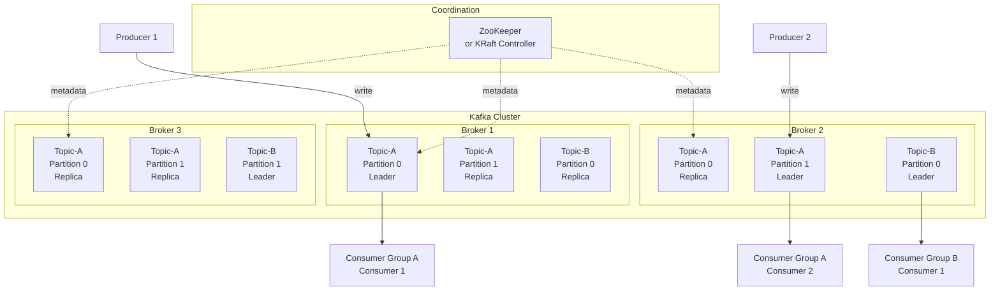
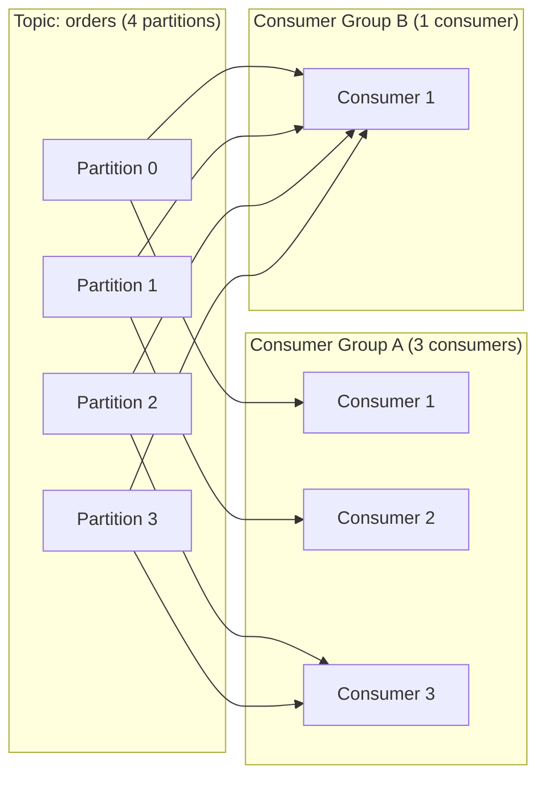

# 📨 Apache Kafka

> **The industry standard for distributed event streaming.** Apache Kafka is a distributed event streaming platform capable of handling trillions of events per day. It's used for building real-time data pipelines, streaming analytics, data integration, and mission-critical applications.

---

## 📑 Table of Contents

- [What is Kafka?](#-what-is-kafka)
- [Architecture](#-architecture)
- [Core Concepts](#-core-concepts)
- [Topics & Partitions](#-topics--partitions)
- [Producer Configuration](#-producer-configuration)
- [Consumer Configuration](#-consumer-configuration)
- [Message Delivery Guarantees](#-message-delivery-guarantees)
- [Replication](#-replication)
- [CLI Commands](#-cli-commands)
- [Performance](#-performance)
- [Monitoring](#-monitoring)
- [Troubleshooting](#-troubleshooting)
- [Production Tips](#-production-tips)
- [Related Topics](#-related-topics)

---

## 🧠 What is Kafka?

Apache Kafka was originally developed at LinkedIn in 2010 and became an Apache top-level project in 2012. It's designed as a distributed commit log — an ordered, immutable sequence of records that can be appended to but not modified.

**Key characteristics:**

- **High throughput** — Millions of messages per second on commodity hardware
- **Low latency** — Sub-millisecond message delivery from producer to consumer
- **Durability** — Messages are persisted to disk and replicated across brokers
- **Scalability** — Horizontal scaling by adding brokers and partitions
- **Fault tolerant** — Automatic failover with replication
- **Ordering guarantees** — Per-partition ordering of messages

**Common use cases:**

| Use Case | Description | Examples |
|----------|-------------|---------|
| **Event streaming** | Real-time event processing | Clickstream, IoT sensors, financial trades |
| **Message queue** | Decouple producers and consumers | Order processing, email notifications |
| **Log aggregation** | Collect logs from multiple services | Centralized logging pipeline |
| **Change data capture** | Stream database changes | Database replication, cache invalidation |
| **Stream processing** | Real-time data transformation | Fraud detection, recommendations |
| **Event sourcing** | Store all state changes as events | Audit logs, CQRS architectures |
| **Metrics pipeline** | Collect and route operational metrics | Monitoring, alerting |

---

## 🏗 Architecture



### Key Components

| Component | Description |
|-----------|-------------|
| **Broker** | A Kafka server that stores data and serves clients |
| **Topic** | A named feed/category of messages |
| **Partition** | An ordered, immutable log within a topic |
| **Replica** | A copy of a partition for fault tolerance |
| **Producer** | A client that publishes messages to topics |
| **Consumer** | A client that reads messages from topics |
| **Consumer Group** | A set of consumers that cooperatively consume a topic |
| **ZooKeeper / KRaft** | Cluster metadata management and coordination |

### ZooKeeper vs KRaft

| Feature | ZooKeeper Mode | KRaft Mode (3.3+) |
|---------|---------------|-------------------|
| **Metadata** | Stored in ZooKeeper | Stored in Kafka itself |
| **Dependencies** | External ZK cluster required | Self-contained |
| **Scalability** | Limited by ZK | Better partition scalability |
| **Recovery** | Slower (ZK dependency) | Faster metadata recovery |
| **Operational** | Two systems to manage | Single system |
| **Status** | Deprecated (removal in 4.0) | Production-ready (3.3+) |

---

## 🔑 Core Concepts

### Producers

Producers publish messages to topics. Each message is a key-value pair with optional headers:

```text
Message Structure:
┌──────────────────────────────────────┐
│ Key (optional): "user-123"           │
│ Value: {"event": "purchase", ...}    │
│ Headers (optional): {"trace-id": ..} │
│ Timestamp: 1234567890                │
│ Partition: 3 (assigned by producer)  │
│ Offset: 42 (assigned by broker)      │
└──────────────────────────────────────┘
```

**Partition assignment:**
- **No key** → Round-robin across partitions (Kafka 2.4+: sticky partitioner for batching)
- **With key** → `hash(key) % num_partitions` — same key always goes to same partition
- **Custom** → Implement a custom `Partitioner` class

### Consumers and Consumer Groups



**Key rules:**
- Each partition is consumed by **exactly one consumer** in a consumer group
- A consumer can consume from **multiple partitions**
- Different consumer groups consume independently (each gets all messages)
- **Max parallelism** = number of partitions (extra consumers are idle)

### Offsets

```text
Partition 0:
┌────┬────┬────┬────┬────┬────┬────┬────┬────┬────┐
│  0 │  1 │  2 │  3 │  4 │  5 │  6 │  7 │  8 │  9 │
└────┴────┴────┴────┴────┴────┴────┴────┴────┴────┘
                          ▲                    ▲
                   committed offset     latest offset (LEO)
                   (last processed)     (log end offset)

Consumer lag = LEO - committed offset = 9 - 5 = 4 messages
```

- **Committed offset** — Last offset acknowledged by the consumer
- **Log End Offset (LEO)** — Last message offset in the partition
- **Consumer lag** — Difference between LEO and committed offset

### Rebalancing

When consumers join, leave, or partitions change, Kafka triggers a **rebalance** to reassign partitions:

```text
Before: Consumer 1 → [P0, P1, P2, P3]  (1 consumer, 4 partitions)

Consumer 2 joins → Rebalance triggered

After:  Consumer 1 → [P0, P1]
        Consumer 2 → [P2, P3]
```

**Rebalance strategies:**
- **Eager** — Revoke all partitions, reassign (causes downtime)
- **Cooperative (Incremental)** — Only move partitions that need to move (Kafka 2.4+)

---

## 📂 Topics & Partitions

### Creating Topics

```bash
# Create a topic
kafka-topics.sh --bootstrap-server localhost:9092 \
  --create --topic orders \
  --partitions 12 \
  --replication-factor 3

# Create with configuration
kafka-topics.sh --bootstrap-server localhost:9092 \
  --create --topic events \
  --partitions 24 \
  --replication-factor 3 \
  --config retention.ms=604800000 \
  --config cleanup.policy=delete \
  --config min.insync.replicas=2
```

### Partition Strategy

| Consideration | Guideline |
|---------------|-----------|
| **Throughput** | More partitions = more parallelism = more throughput |
| **Ordering** | Ordering guaranteed only within a partition |
| **Consumer parallelism** | Max consumers per group = number of partitions |
| **Overhead** | Each partition has overhead (file handles, memory, replication) |
| **Recommended** | Start with `max(throughput / partition_throughput, max_consumers)` |
| **Rule of thumb** | 6-12 partitions per topic for most use cases |

### Key-Based Routing

```text
Messages with the same key always go to the same partition:

Key: "user-123" → hash("user-123") % 12 = Partition 7
Key: "user-456" → hash("user-456") % 12 = Partition 3
Key: "user-123" → hash("user-123") % 12 = Partition 7  (same!)

⚠️ Changing partition count breaks key routing!
```

### Topic Configuration

```bash
# List all topics
kafka-topics.sh --bootstrap-server localhost:9092 --list

# Describe a topic
kafka-topics.sh --bootstrap-server localhost:9092 --describe --topic orders

# Alter topic partitions (can only increase, NOT decrease)
kafka-topics.sh --bootstrap-server localhost:9092 \
  --alter --topic orders --partitions 24

# Alter topic configuration
kafka-configs.sh --bootstrap-server localhost:9092 \
  --alter --entity-type topics --entity-name orders \
  --add-config retention.ms=259200000

# Delete a topic
kafka-topics.sh --bootstrap-server localhost:9092 \
  --delete --topic old-topic
```

---

## 📤 Producer Configuration

### Key Settings

| Setting | Default | Recommended | Description |
|---------|---------|-------------|-------------|
| `acks` | `all` (Kafka 3.0+) | `all` | Wait for all ISR replicas to acknowledge |
| `retries` | `MAX_INT` | `MAX_INT` | Number of retries on transient errors |
| `enable.idempotence` | `true` (3.0+) | `true` | Exactly-once per partition |
| `max.in.flight.requests.per.connection` | `5` | `5` (with idempotence) | Concurrent requests per connection |
| `batch.size` | `16384` | `32768-65536` | Batch size in bytes |
| `linger.ms` | `0` | `5-100` | Wait time to fill batches |
| `compression.type` | `none` | `lz4` or `zstd` | Message compression |
| `buffer.memory` | `33554432` | Adjust per load | Total memory for buffering |
| `max.block.ms` | `60000` | `60000` | Block time when buffer is full |

### Producer Delivery Semantics

```text
acks=0:  "Fire and forget"
┌──────┐     ┌──────────┐
│ Prod  │────│ Broker   │  Producer doesn't wait for acknowledgment
└──────┘     └──────────┘  Fastest, but messages can be lost

acks=1:  "Leader acknowledged"
┌──────┐     ┌──────────┐     ┌─────────┐
│ Prod  │────│ Leader   │─ ─ ─│ Replica │  Leader confirms, replica async
└──────┘     └──────────┘     └─────────┘  Leader failure = potential loss

acks=all: "All in-sync replicas acknowledged"
┌──────┐     ┌──────────┐     ┌─────────┐
│ Prod  │────│ Leader   │─────│ Replica │  All ISR replicas confirm
└──────┘     └──────────┘     └─────────┘  Safest, highest latency
```

### Idempotent Producer

```text
Without idempotence:
Producer → [msg-1] → Broker     ✓
Producer → [msg-1] → Broker     ✓ (retry after timeout = DUPLICATE)

With idempotence (enable.idempotence=true):
Producer → [msg-1, PID=1, seq=0] → Broker     ✓
Producer → [msg-1, PID=1, seq=0] → Broker     DUPLICATE DETECTED → ignored
```

### Exactly-Once Semantics (Transactions)

```java
// Java producer with transactions
producer.initTransactions();
try {
    producer.beginTransaction();
    producer.send(new ProducerRecord<>("topic-a", "key", "value1"));
    producer.send(new ProducerRecord<>("topic-b", "key", "value2"));
    // Commit offsets as part of transaction
    producer.sendOffsetsToTransaction(offsets, consumerGroupId);
    producer.commitTransaction();
} catch (Exception e) {
    producer.abortTransaction();
}
```

---

## 📥 Consumer Configuration

### Key Settings

| Setting | Default | Recommended | Description |
|---------|---------|-------------|-------------|
| `group.id` | - | Required | Consumer group identifier |
| `auto.offset.reset` | `latest` | `earliest` or `latest` | Where to start when no committed offset |
| `enable.auto.commit` | `true` | `false` for at-least-once | Auto-commit offsets periodically |
| `auto.commit.interval.ms` | `5000` | - | Auto-commit interval |
| `max.poll.records` | `500` | `100-1000` | Max records per poll |
| `max.poll.interval.ms` | `300000` | Adjust per processing time | Max time between polls |
| `session.timeout.ms` | `45000` | `10000-30000` | Consumer heartbeat timeout |
| `heartbeat.interval.ms` | `3000` | `session.timeout / 3` | Heartbeat frequency |
| `fetch.min.bytes` | `1` | `1-1048576` | Min bytes to fetch |
| `fetch.max.wait.ms` | `500` | `100-500` | Max wait when fetch.min.bytes not met |
| `partition.assignment.strategy` | `RangeAssignor` | `CooperativeStickyAssignor` | Rebalance strategy |
| `isolation.level` | `read_uncommitted` | `read_committed` for EOS | Transaction isolation |

### Offset Commit Strategies

```text
Strategy 1: Auto-commit (at-most-once risk)
┌─────────────────────────────────────────────────────┐
│ poll() → process → [auto-commit] → poll() → ...    │
│ ⚠️ If crash after commit but before processing done │
│    = messages lost (at-most-once)                    │
└─────────────────────────────────────────────────────┘

Strategy 2: Manual commit after processing (at-least-once)
┌──────────────────────────────────────────────────────┐
│ poll() → process all → commitSync() → poll() → ...  │
│ ⚠️ If crash after processing but before commit       │
│    = messages reprocessed (at-least-once)             │
└──────────────────────────────────────────────────────┘

Strategy 3: Manual commit per record (fine-grained)
┌──────────────────────────────────────────────────────┐
│ poll() → for each record:                            │
│   process(record) → commitSync(offset) → next        │
│ Most control, but slower due to frequent commits      │
└──────────────────────────────────────────────────────┘
```

---

## 🔄 Message Delivery Guarantees

| Guarantee | How to Achieve | Trade-off |
|-----------|---------------|-----------|
| **At-most-once** | `acks=0` or auto-commit before processing | Messages may be lost, no duplicates |
| **At-least-once** | `acks=all` + manual commit after processing | No message loss, possible duplicates |
| **Exactly-once** | Idempotent producer + transactions + `read_committed` | No loss, no duplicates, highest overhead |

### Exactly-Once Configuration

```properties
# Producer
acks=all
enable.idempotence=true
transactional.id=my-transactional-producer
max.in.flight.requests.per.connection=5

# Consumer
isolation.level=read_committed
enable.auto.commit=false
group.id=my-consumer-group

# Broker
min.insync.replicas=2
transaction.state.log.replication.factor=3
transaction.state.log.min.isr=2
```

---

## 🔁 Replication

### In-Sync Replicas (ISR)

```text
Topic: orders, Partition 0, Replication Factor: 3

Leader (Broker 1):     [0][1][2][3][4][5][6][7][8][9]  ← LEO = 10
Follower (Broker 2):   [0][1][2][3][4][5][6][7][8]     ← LEO = 9  (in ISR)
Follower (Broker 3):   [0][1][2][3][4][5]               ← LEO = 6  (fell behind → removed from ISR)

High Watermark (HW) = min(ISR LEOs) = min(10, 9) = 9
Consumers can only read up to HW (offset 8)
```

### Key Replication Settings

| Setting | Default | Recommended | Description |
|---------|---------|-------------|-------------|
| `replication.factor` | `1` | `3` | Number of replicas per partition |
| `min.insync.replicas` | `1` | `2` | Minimum ISR for `acks=all` to succeed |
| `unclean.leader.election.enable` | `false` | `false` | Allow non-ISR replica to become leader |
| `replica.lag.time.max.ms` | `30000` | `10000-30000` | Max lag before removing from ISR |

### Leader Election

```text
Normal operation:           Leader fails:
┌────────┐                  ┌────────┐
│Leader  │ ──replicate──►   │Leader  │ ✗ (crashed)
│Broker 1│                  │Broker 1│
└────────┘                  └────────┘
    │                           
    ▼                       ┌────────┐
┌────────┐                  │Follower│ → Promoted to Leader
│Follower│                  │Broker 2│   (was in ISR)
│Broker 2│                  └────────┘
└────────┘                      
    │                       ┌────────┐
    ▼                       │Follower│ → Stays follower
┌────────┐                  │Broker 3│   (replicates from new leader)
│Follower│                  └────────┘
│Broker 3│
└────────┘

⚠️ unclean.leader.election.enable=true → allows non-ISR replica to become leader
   This can cause DATA LOSS! Only use if availability > durability.
```

---

## 💻 CLI Commands

### kafka-topics.sh

```bash
# List all topics
kafka-topics.sh --bootstrap-server localhost:9092 --list

# Create a topic
kafka-topics.sh --bootstrap-server localhost:9092 \
  --create --topic my-topic --partitions 6 --replication-factor 3

# Describe a topic (partitions, replicas, ISR)
kafka-topics.sh --bootstrap-server localhost:9092 \
  --describe --topic my-topic

# Describe topics with under-replicated partitions
kafka-topics.sh --bootstrap-server localhost:9092 \
  --describe --under-replicated-partitions

# Delete a topic
kafka-topics.sh --bootstrap-server localhost:9092 \
  --delete --topic my-topic
```

### kafka-console-producer.sh

```bash
# Simple producer
kafka-console-producer.sh --bootstrap-server localhost:9092 \
  --topic my-topic

# Producer with key
kafka-console-producer.sh --bootstrap-server localhost:9092 \
  --topic my-topic \
  --property "key.separator=:" \
  --property "parse.key=true"
# Input: key1:value1

# Producer with acks=all
kafka-console-producer.sh --bootstrap-server localhost:9092 \
  --topic my-topic \
  --producer-property acks=all
```

### kafka-console-consumer.sh

```bash
# Consume from latest
kafka-console-consumer.sh --bootstrap-server localhost:9092 \
  --topic my-topic

# Consume from beginning
kafka-console-consumer.sh --bootstrap-server localhost:9092 \
  --topic my-topic --from-beginning

# Consume with consumer group
kafka-console-consumer.sh --bootstrap-server localhost:9092 \
  --topic my-topic --group my-group

# Consume with key and timestamp
kafka-console-consumer.sh --bootstrap-server localhost:9092 \
  --topic my-topic --from-beginning \
  --property print.key=true \
  --property print.timestamp=true \
  --property key.separator=,

# Consume specific partition and offset
kafka-console-consumer.sh --bootstrap-server localhost:9092 \
  --topic my-topic --partition 0 --offset 42

# Consume max messages
kafka-console-consumer.sh --bootstrap-server localhost:9092 \
  --topic my-topic --from-beginning --max-messages 10
```

### kafka-consumer-groups.sh

```bash
# List all consumer groups
kafka-consumer-groups.sh --bootstrap-server localhost:9092 --list

# Describe consumer group (lag, offsets, assignments)
kafka-consumer-groups.sh --bootstrap-server localhost:9092 \
  --describe --group my-group

# Output:
# GROUP     TOPIC     PARTITION  CURRENT-OFFSET  LOG-END-OFFSET  LAG    CONSUMER-ID     HOST
# my-group  orders    0          1234            1250            16     consumer-1-...   /10.0.1.5
# my-group  orders    1          5678            5680            2      consumer-2-...   /10.0.1.6

# Reset offsets to earliest
kafka-consumer-groups.sh --bootstrap-server localhost:9092 \
  --group my-group --topic my-topic \
  --reset-offsets --to-earliest --execute

# Reset offsets to specific timestamp
kafka-consumer-groups.sh --bootstrap-server localhost:9092 \
  --group my-group --topic my-topic \
  --reset-offsets --to-datetime 2025-01-01T00:00:00.000 --execute

# Reset offsets to specific offset
kafka-consumer-groups.sh --bootstrap-server localhost:9092 \
  --group my-group --topic my-topic:0 \
  --reset-offsets --to-offset 1000 --execute

# Delete consumer group (must be empty/inactive)
kafka-consumer-groups.sh --bootstrap-server localhost:9092 \
  --delete --group my-group
```

### Other Useful Commands

```bash
# Check broker configuration
kafka-configs.sh --bootstrap-server localhost:9092 \
  --describe --entity-type brokers --entity-name 0

# Log directories (disk usage per topic/partition)
kafka-log-dirs.sh --bootstrap-server localhost:9092 \
  --describe --topic-list orders

# Preferred replica election
kafka-leader-election.sh --bootstrap-server localhost:9092 \
  --election-type preferred --all-topic-partitions

# Reassign partitions
kafka-reassign-partitions.sh --bootstrap-server localhost:9092 \
  --generate --topics-to-move-json-file topics.json \
  --broker-list "0,1,2"
```

---

## ⚡ Performance

### Throughput Tuning

| Area | Tuning | Impact |
|------|--------|--------|
| **Producer batching** | `linger.ms=20`, `batch.size=65536` | More messages per request |
| **Compression** | `compression.type=lz4` | Smaller network/disk usage |
| **Partition count** | Increase partitions | More consumer parallelism |
| **Consumer fetch** | `fetch.min.bytes=1048576` | Fewer requests, more data per fetch |
| **Broker threads** | `num.io.threads`, `num.network.threads` | More concurrent I/O |
| **OS page cache** | More free RAM on brokers | More data served from cache |

### Partition Sizing

```text
Target throughput: 100 MB/s

Single partition throughput (measured): ~10 MB/s
Required partitions: 100 / 10 = 10 partitions minimum

Add headroom for:
- Consumer parallelism requirements
- Future growth
- Uneven distribution

Recommended: 12-20 partitions
```

### Log Compaction

```text
cleanup.policy=compact:

Before compaction:                After compaction:
Key  Offset  Value               Key  Offset  Value
─────────────────                ─────────────────
A    0       v1                  B    1       v2
B    1       v2                  A    2       v3
A    2       v3                  C    4       v5
C    3       v4                  
C    4       v5                  Only latest value per key retained
```

Configuration:

```properties
# Topic-level
cleanup.policy=compact            # Enable compaction
min.cleanable.dirty.ratio=0.5    # When to trigger compaction
delete.retention.ms=86400000     # How long to keep tombstones
```

---

## 📊 Monitoring

### Key Metrics

| Metric | Description | Alert Threshold |
|--------|-------------|-----------------|
| **UnderReplicatedPartitions** | Partitions without full replication | > 0 |
| **OfflinePartitionsCount** | Partitions without a leader | > 0 (critical) |
| **ActiveControllerCount** | Active controllers in cluster | ≠ 1 |
| **ISRShrinkRate** | Rate of ISR shrinks | Increasing trend |
| **ConsumerLag** | Consumer offset behind log end | Depends on SLA |
| **RequestsPerSec** | Produce/fetch request rates | Baseline-dependent |
| **BytesInPerSec** | Incoming message rate | Capacity threshold |
| **BytesOutPerSec** | Outgoing message rate | Capacity threshold |
| **RequestLatency (p99)** | Produce/fetch latency | > 100ms |
| **LogFlushLatency** | Time to flush to disk | > 10ms p99 |
| **NetworkProcessorIdlePercent** | Network thread idle % | < 30% |
| **RequestHandlerIdlePercent** | Request thread idle % | < 30% |

### JMX Metrics (Common)

```text
# Broker metrics
kafka.server:type=BrokerTopicMetrics,name=MessagesInPerSec
kafka.server:type=BrokerTopicMetrics,name=BytesInPerSec
kafka.server:type=BrokerTopicMetrics,name=BytesOutPerSec
kafka.server:type=ReplicaManager,name=UnderReplicatedPartitions
kafka.controller:type=KafkaController,name=OfflinePartitionsCount
kafka.controller:type=KafkaController,name=ActiveControllerCount

# Consumer metrics
kafka.consumer:type=consumer-fetch-manager-metrics,client-id=*,attribute=records-lag-max
kafka.consumer:type=consumer-coordinator-metrics,client-id=*,attribute=rebalance-rate-per-hour
```

---

## 🐛 Troubleshooting

### Consumer Lag

**Symptoms:** Growing lag, delayed processing, consumers falling behind

```bash
# Check consumer group lag
kafka-consumer-groups.sh --bootstrap-server localhost:9092 \
  --describe --group my-group

# Common causes and solutions:
# 1. Processing too slow
#    → Increase partitions and consumers
#    → Optimize processing logic
#    → Use async processing

# 2. Too few consumers
#    → Add consumers (max = partition count)
#    → Check for idle consumers (uneven partition assignment)

# 3. Consumer rebalancing too often
#    → Increase max.poll.interval.ms
#    → Reduce max.poll.records
#    → Use CooperativeStickyAssignor

# 4. Network issues
#    → Check fetch.min.bytes and fetch.max.wait.ms
#    → Monitor network bandwidth
```

### Rebalancing Storms

**Symptoms:** Consumers constantly rebalancing, throughput drops to zero during rebalance

```bash
# Diagnose
# Check consumer group state
kafka-consumer-groups.sh --bootstrap-server localhost:9092 \
  --describe --group my-group --state

# Common causes:
# 1. Processing takes longer than max.poll.interval.ms
#    → Increase max.poll.interval.ms
#    → Reduce max.poll.records
#    → Process messages faster

# 2. GC pauses causing session timeout
#    → Increase session.timeout.ms
#    → Tune JVM garbage collector

# 3. Frequent consumer restarts
#    → Fix crash root cause
#    → Use static group membership (group.instance.id)

# Fix: Use cooperative rebalancing
partition.assignment.strategy=org.apache.kafka.clients.consumer.CooperativeStickyAssignor
```

### Disk Full

**Symptoms:** Brokers stop accepting writes, errors in broker logs

```bash
# Check disk usage per topic
kafka-log-dirs.sh --bootstrap-server localhost:9092 --describe

# Solutions:
# 1. Reduce retention
kafka-configs.sh --bootstrap-server localhost:9092 \
  --alter --entity-type topics --entity-name big-topic \
  --add-config retention.ms=86400000

# 2. Delete old/unused topics
kafka-topics.sh --bootstrap-server localhost:9092 \
  --delete --topic unused-topic

# 3. Add more brokers and rebalance partitions

# 4. Set log.retention.bytes per topic to limit size
kafka-configs.sh --bootstrap-server localhost:9092 \
  --alter --entity-type topics --entity-name big-topic \
  --add-config retention.bytes=10737418240
```

### Under-Replicated Partitions

**Symptoms:** `UnderReplicatedPartitions` metric > 0

```bash
# Find under-replicated partitions
kafka-topics.sh --bootstrap-server localhost:9092 \
  --describe --under-replicated-partitions

# Common causes:
# 1. Broker is down → Restart broker
# 2. Broker is slow (disk/CPU) → Check resource usage
# 3. Network issues → Check connectivity between brokers
# 4. Uneven load → Rebalance partitions across brokers

# Trigger preferred leader election
kafka-leader-election.sh --bootstrap-server localhost:9092 \
  --election-type preferred --all-topic-partitions
```

---

## 🏭 Production Tips

### Cluster Configuration

- **Minimum 3 brokers** — For replication factor 3 and fault tolerance
- **Replication factor 3** — Standard for production data durability
- **`min.insync.replicas=2`** — With `acks=all`, ensures at least 2 replicas confirm writes
- **`unclean.leader.election.enable=false`** — Prevent data loss from out-of-sync replicas becoming leader
- **Separate disks** — Dedicated disks for Kafka logs, avoid shared storage

### Security

```properties
# Enable SASL/SSL
listeners=SASL_SSL://0.0.0.0:9093
security.inter.broker.protocol=SASL_SSL
sasl.mechanism.inter.broker.protocol=SCRAM-SHA-256
sasl.enabled.mechanisms=SCRAM-SHA-256

# TLS configuration
ssl.keystore.location=/etc/kafka/kafka.keystore.jks
ssl.truststore.location=/etc/kafka/kafka.truststore.jks

# ACLs
authorizer.class.name=kafka.security.authorizer.AclAuthorizer
super.users=User:admin
```

```bash
# Create ACL (allow producer to write to topic)
kafka-acls.sh --bootstrap-server localhost:9092 \
  --add --allow-principal User:producer-1 \
  --operation Write --topic orders

# Create ACL (allow consumer group to read)
kafka-acls.sh --bootstrap-server localhost:9092 \
  --add --allow-principal User:consumer-1 \
  --operation Read --topic orders --group my-group
```

### Rack Awareness

```properties
# Broker configuration
broker.rack=us-east-1a  # or rack-1, zone-a, etc.

# Topic will distribute replicas across racks
# replica.selector.class=org.apache.kafka.common.replica.RackAwareReplicaSelector
```

### Quotas

```bash
# Set producer quota (bytes/sec)
kafka-configs.sh --bootstrap-server localhost:9092 \
  --alter --entity-type users --entity-name producer-1 \
  --add-config 'producer_byte_rate=10485760'

# Set consumer quota
kafka-configs.sh --bootstrap-server localhost:9092 \
  --alter --entity-type users --entity-name consumer-1 \
  --add-config 'consumer_byte_rate=20971520'
```

### Pre-Deployment Checklist

```text
□ Minimum 3 brokers with replication factor 3
□ min.insync.replicas=2 with acks=all
□ unclean.leader.election.enable=false
□ TLS encryption enabled for client and inter-broker
□ Authentication (SASL) and authorization (ACLs) configured
□ Monitoring configured (UnderReplicatedPartitions, consumer lag)
□ Log retention configured per topic
□ Separate disks for Kafka data
□ JVM heap sized properly (6-8 GB typical)
□ OS page cache tuned (leave 50%+ RAM for page cache)
□ Network bandwidth sufficient for replication traffic
□ Rack awareness configured for multi-AZ deployments
□ Backup strategy for critical topics (MirrorMaker 2)
□ Tested broker failure and recovery procedure
```

---

## 🔗 Related Topics

- [Distributed Systems — Consensus](../consensus/) — Raft and leader election theory
- [Distributed Systems — etcd](../etcd/) — Comparison with KV-store coordination
- [Distributed Systems — Caching](../caching/) — Cache invalidation via Kafka events
- [Databases — Redis](../../databases/redis/) — Redis Streams as lightweight alternative
- [Observability — Prometheus](../../observability/prometheus/) — Monitoring Kafka with JMX exporter
- [DevOps — Kubernetes](../../devops/kubernetes/) — Running Kafka on Kubernetes (Strimzi)

---

> **Kafka is a powerful tool, but it's not a silver bullet.** Use it when you need durable, high-throughput event streaming with ordering guarantees. For simple request-reply patterns, consider HTTP. For complex routing, consider RabbitMQ. For lightweight pub/sub, consider Redis Streams.
