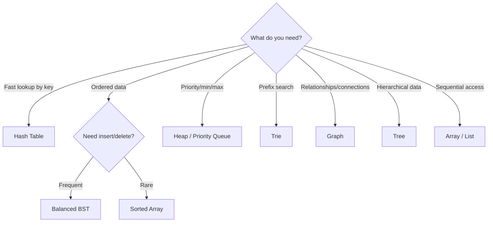

# 🧠 Data Structures & Algorithms

> **The foundation of efficient software.** DSA isn't just for interviews — it's the difference between a system that handles 100 users and one that handles 100 million. Understanding data structures and algorithms helps you make informed decisions about performance, memory, and scalability in every line of code you write.

---

## 📑 Table of Contents

- [Why DSA Matters](#-why-dsa-matters)
- [Topics](#-topics)
- [Complexity Cheat Sheet](#-complexity-cheat-sheet)
- [When to Use Which Data Structure](#-when-to-use-which-data-structure)
- [Related Topics](#-related-topics)

---

## 🧠 Why DSA Matters

**Beyond interviews:**

- Choosing the right data structure makes the difference between O(n²) and O(n) — that's 1 second vs 10,000 seconds for 100K items
- Database indexes are B-trees, caching uses hash tables, network routing uses graphs
- Understanding algorithms helps you read and contribute to open-source code, libraries, and frameworks
- System design decisions (sharding, consistent hashing, leader election) are built on DSA concepts

**In production:**

| Scenario | Wrong Choice | Right Choice | Impact |
|----------|-------------|-------------|--------|
| Frequent lookups | Linear search (O(n)) | Hash map (O(1)) | 1000x faster at scale |
| Sorted data with inserts | Array (O(n) insert) | BST/Balanced tree (O(log n)) | Scales with growth |
| Shortest path routing | BFS on weighted graph | Dijkstra's algorithm | Correct results |
| Priority processing | Sorted array (O(n) insert) | Heap (O(log n) insert) | Efficient queue |
| Autocomplete | Linear search | Trie (O(k) where k=word length) | Real-time response |

---

## 📚 Topics

| Topic | Description | Key Concepts |
|-------|-------------|--------------|
| [Complexity Analysis](complexity.md) | Big-O notation and analysis | Time/space complexity, amortized analysis |
| [Arrays](arrays/) | Contiguous memory, random access | Two pointers, sliding window, prefix sum |
| [Hash Tables](hash-table/) | Key-value lookup in O(1) | Hashing, collision resolution, frequency counting |
| [Trees](tree/) | Hierarchical data | BST, BFS/DFS, trie, heap, balanced trees |
| [Graphs](graph/) | Networks of connected nodes | BFS, DFS, Dijkstra, topological sort, union-find |
| [Dynamic Programming](dynamic-programming/) | Optimal substructure problems | Memoization, tabulation, state machines |

---

## ⚡ Complexity Cheat Sheet

### Big-O Comparison

| Complexity | Name | Example | n=10 | n=1,000 | n=1,000,000 |
|-----------|------|---------|------|---------|-------------|
| O(1) | Constant | Hash lookup | 1 | 1 | 1 |
| O(log n) | Logarithmic | Binary search | 3 | 10 | 20 |
| O(n) | Linear | Array scan | 10 | 1,000 | 1,000,000 |
| O(n log n) | Linearithmic | Merge sort | 33 | 10,000 | 20,000,000 |
| O(n²) | Quadratic | Bubble sort | 100 | 1,000,000 | 10¹² ☠️ |
| O(2ⁿ) | Exponential | Subsets | 1,024 | ☠️ | ☠️ |
| O(n!) | Factorial | Permutations | 3,628,800 | ☠️ | ☠️ |

### Data Structure Operations

| Data Structure | Access | Search | Insert | Delete | Space |
|---------------|--------|--------|--------|--------|-------|
| Array | O(1) | O(n) | O(n) | O(n) | O(n) |
| Dynamic Array | O(1) | O(n) | O(1)* | O(n) | O(n) |
| Linked List | O(n) | O(n) | O(1) | O(1) | O(n) |
| Hash Table | — | O(1)* | O(1)* | O(1)* | O(n) |
| BST (balanced) | — | O(log n) | O(log n) | O(log n) | O(n) |
| Heap | — | O(n) | O(log n) | O(log n) | O(n) |
| Trie | — | O(k) | O(k) | O(k) | O(n×k) |

*Amortized or average case. Worst case may differ.

→ See [Complexity Analysis](complexity.md) for detailed explanations

---

## 🔍 When to Use Which Data Structure

### Decision Guide

| Need | Best Data Structure | Why |
|------|-------------------|-----|
| Key-value storage | Hash table | O(1) average for all operations |
| Sorted order + fast insert/delete | Balanced BST (TreeMap) | O(log n) for all operations, maintains order |
| FIFO processing | Queue (deque) | O(1) enqueue/dequeue |
| LIFO processing | Stack | O(1) push/pop |
| Priority-based processing | Min/Max Heap | O(log n) insert, O(1) peek |
| Autocomplete / prefix matching | Trie | O(k) search where k = key length |
| Shortest path | Graph + BFS/Dijkstra | Standard algorithms |
| Connectivity / grouping | Graph + Union-Find | Near O(1) union and find |
| Range queries | Segment tree / BIT | O(log n) update and query |
| Cache (LRU) | Hash table + doubly linked list | O(1) for all cache operations |

---

## 🔗 Related Topics

- [System Design](../system-design/) — Apply DSA in system design (consistent hashing, caching, indexing)
- [Architecture](../architecture/) — Architectural patterns that leverage efficient data structures
- [Databases](../databases/) — Database internals use B-trees, hash indexes, LSM trees
- [Languages: Python](../languages/python/) — Python built-in data structures
- [Languages: Go](../languages/go/) — Go slices, maps, and data structures
- [Engineering](../engineering/) — Performance optimization using correct data structures

---

> **Learn DSA to write better production code.** Every database query plan, every caching strategy, every routing algorithm is built on the foundations of data structures and algorithms. Understanding them makes you a better engineer, not just a better interviewee.
