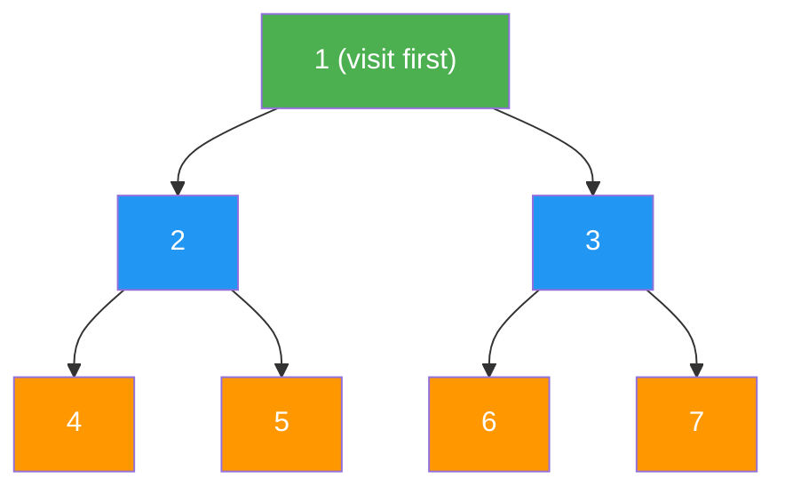
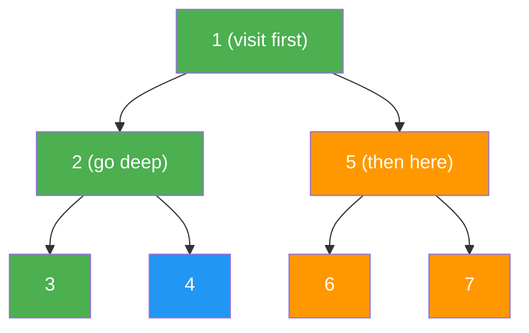

# Trees

> **Hierarchical data structures for efficient search, sort, and organization.** Trees model parent-child relationships and enable O(log n) operations — powering everything from databases (B-trees) to autocomplete (tries) to priority queues (heaps).

---

## 📑 Table of Contents

- [What are Trees?](#-what-are-trees)
- [Binary Trees](#-binary-trees)
- [Binary Search Tree (BST)](#-binary-search-tree-bst)
- [BFS vs DFS](#-bfs-vs-dfs)
- [Balanced Trees](#-balanced-trees)
- [Trie (Prefix Tree)](#-trie-prefix-tree)
- [Heap / Priority Queue](#-heap--priority-queue)
- [Common Patterns](#-common-patterns)
- [When to Use Which Tree](#-when-to-use-which-tree)
- [Related Topics](#-related-topics)

---

## 🧠 What are Trees?

A tree is a hierarchical data structure consisting of nodes connected by edges. Each tree has a root node, and every node has zero or more child nodes.

### Terminology

```text
        A          ← Root (depth 0)
       / \
      B   C        ← Internal nodes (depth 1)
     / \   \
    D   E   F      ← Leaves have no children (depth 2)
       /
      G            ← Leaf (depth 3)
```

| Term | Definition |
|------|-----------|
| **Root** | Top node with no parent |
| **Leaf** | Node with no children |
| **Internal node** | Node with at least one child |
| **Parent** | Direct ancestor |
| **Child** | Direct descendant |
| **Sibling** | Nodes with the same parent |
| **Depth** | Distance from root to node |
| **Height** | Distance from node to deepest leaf |
| **Tree height** | Height of the root node |
| **Subtree** | Tree formed by a node and all its descendants |
| **Balanced** | Left and right subtree heights differ by at most 1 |

---

## 🌲 Binary Trees

Each node has at most **two children** (left and right).

### Types of Binary Trees

```text
Full Binary Tree:           Complete Binary Tree:      Perfect Binary Tree:
Every node has 0 or 2       All levels filled except   All levels fully filled
children                    possibly the last (left)

       A                         A                         A
      / \                       / \                       / \
     B   C                     B   C                     B   C
    / \                       / \   \                   / \ / \
   D   E                    D   E   F                 D  E F  G
```

| Type | Property |
|------|----------|
| **Full** | Every node has 0 or 2 children |
| **Complete** | All levels filled except last (filled left to right) |
| **Perfect** | All internal nodes have 2 children, all leaves at same level |
| **Balanced** | Heights of left and right subtrees differ by at most 1 |
| **Degenerate** | Each node has only one child (effectively a linked list) |

### Node Definition

```python
class TreeNode:
    """Binary tree node."""
    def __init__(self, val: int = 0, left: 'TreeNode' = None, right: 'TreeNode' = None):
        self.val = val
        self.left = left
        self.right = right
```

```go
type TreeNode struct {
    Val   int
    Left  *TreeNode
    Right *TreeNode
}
```

---

## 🔍 Binary Search Tree (BST)

A binary tree where for every node: **left subtree values < node value < right subtree values**.

```text
        8
       / \
      3   10
     / \    \
    1   6    14
       / \   /
      4   7 13
```

### BST Operations

#### Search

```python
def search_bst(root: TreeNode, target: int) -> TreeNode | None:
    """Search BST. O(log n) balanced, O(n) worst."""
    if not root or root.val == target:
        return root
    if target < root.val:
        return search_bst(root.left, target)
    return search_bst(root.right, target)
```

```go
func searchBST(root *TreeNode, target int) *TreeNode {
    if root == nil || root.Val == target {
        return root
    }
    if target < root.Val {
        return searchBST(root.Left, target)
    }
    return searchBST(root.Right, target)
}
```

#### Insert

```python
def insert_bst(root: TreeNode, val: int) -> TreeNode:
    """Insert into BST. O(log n) balanced."""
    if not root:
        return TreeNode(val)
    if val < root.val:
        root.left = insert_bst(root.left, val)
    elif val > root.val:
        root.right = insert_bst(root.right, val)
    return root
```

#### Delete

```python
def delete_bst(root: TreeNode, key: int) -> TreeNode | None:
    """Delete from BST. O(log n) balanced."""
    if not root:
        return None
    if key < root.val:
        root.left = delete_bst(root.left, key)
    elif key > root.val:
        root.right = delete_bst(root.right, key)
    else:
        # Node found
        if not root.left:
            return root.right
        if not root.right:
            return root.left
        # Node has two children — replace with in-order successor
        successor = root.right
        while successor.left:
            successor = successor.left
        root.val = successor.val
        root.right = delete_bst(root.right, successor.val)
    return root
```

### Traversals

```text
Tree:    4
        / \
       2   6
      / \ / \
     1  3 5  7

In-order (L, Root, R):   1, 2, 3, 4, 5, 6, 7  ← Sorted order for BST!
Pre-order (Root, L, R):  4, 2, 1, 3, 6, 5, 7  ← Used for serialization
Post-order (L, R, Root): 1, 3, 2, 5, 7, 6, 4  ← Used for deletion
```

```python
def inorder(root: TreeNode) -> list[int]:
    """In-order traversal: left → root → right."""
    if not root:
        return []
    return inorder(root.left) + [root.val] + inorder(root.right)

def preorder(root: TreeNode) -> list[int]:
    """Pre-order traversal: root → left → right."""
    if not root:
        return []
    return [root.val] + preorder(root.left) + preorder(root.right)

def postorder(root: TreeNode) -> list[int]:
    """Post-order traversal: left → right → root."""
    if not root:
        return []
    return postorder(root.left) + postorder(root.right) + [root.val]
```

---

## 🔀 BFS vs DFS

### Breadth-First Search (BFS) — Level Order

Visit all nodes at depth d before visiting nodes at depth d+1. Uses a **queue**.



```python
from collections import deque

def level_order(root: TreeNode) -> list[list[int]]:
    """BFS level-order traversal. O(n) time, O(n) space."""
    if not root:
        return []
    result = []
    queue = deque([root])
    while queue:
        level = []
        for _ in range(len(queue)):
            node = queue.popleft()
            level.append(node.val)
            if node.left:
                queue.append(node.left)
            if node.right:
                queue.append(node.right)
        result.append(level)
    return result
```

```go
func levelOrder(root *TreeNode) [][]int {
    if root == nil {
        return nil
    }
    var result [][]int
    queue := []*TreeNode{root}
    for len(queue) > 0 {
        size := len(queue)
        level := make([]int, 0, size)
        for i := 0; i < size; i++ {
            node := queue[0]
            queue = queue[1:]
            level = append(level, node.Val)
            if node.Left != nil {
                queue = append(queue, node.Left)
            }
            if node.Right != nil {
                queue = append(queue, node.Right)
            }
        }
        result = append(result, level)
    }
    return result
}
```

### Depth-First Search (DFS)

Go as deep as possible before backtracking. Uses a **stack** (or recursion).



### BFS vs DFS Comparison

| Feature | BFS | DFS |
|---------|-----|-----|
| Data structure | Queue | Stack (or recursion) |
| Space complexity | O(w) where w = max width | O(h) where h = height |
| Finds shortest path? | Yes (unweighted) | No |
| Complete search? | Yes | Yes |
| Best for | Shortest path, level-order | Path finding, cycle detection, topological sort |
| Tree memory | O(n/2) worst (wide tree) | O(log n) balanced, O(n) degenerate |

---

## ⚖️ Balanced Trees

Balanced trees maintain O(log n) height guarantees, preventing degeneration into linked lists.

### AVL Tree

**Self-balancing BST** where the height difference between left and right subtrees is at most 1 for every node.

```text
Balance factor = height(left) - height(right)
Valid: -1, 0, +1

Unbalanced (balance factor = 2):     After rotation:
      3                                    2
     /                                    / \
    2          → Right rotate →          1   3
   /
  1
```

**Rotations:** Left rotation, right rotation, left-right, right-left.
**Use when:** Lookups are more frequent than inserts/deletes (AVL is more strictly balanced than Red-Black).

### Red-Black Tree

**Self-balancing BST** with color properties that ensure O(log n) height.

**Properties:**
1. Every node is red or black
2. Root is black
3. Every leaf (NIL) is black
4. Red nodes have only black children
5. All paths from root to leaves have the same number of black nodes

**Use when:** Inserts/deletes are frequent (less strict balancing = fewer rotations than AVL).

**In practice:** Java TreeMap/TreeSet, C++ std::map, Linux kernel — all use Red-Black trees.

### Comparison

| Feature | AVL | Red-Black |
|---------|-----|-----------|
| Balancing | Stricter (height diff ≤ 1) | Looser |
| Lookup | Slightly faster | Slightly slower |
| Insert/Delete | More rotations | Fewer rotations |
| Height | ~1.44 log n | ~2 log n |
| Use case | Read-heavy | Write-heavy |

---

## 🔤 Trie (Prefix Tree)

A tree where each node represents a character. Used for prefix matching, autocomplete, and spell checking.

```text
Words: "cat", "car", "card", "care", "do", "dog"

        root
       /    \
      c      d
      |      |
      a      o
     / \      \
    t   r      g
       / \
      d   e
```

### Implementation

```python
class TrieNode:
    def __init__(self):
        self.children: dict[str, 'TrieNode'] = {}
        self.is_end: bool = False


class Trie:
    def __init__(self):
        self.root = TrieNode()

    def insert(self, word: str) -> None:
        """Insert a word. O(k) where k = word length."""
        node = self.root
        for char in word:
            if char not in node.children:
                node.children[char] = TrieNode()
            node = node.children[char]
        node.is_end = True

    def search(self, word: str) -> bool:
        """Search for exact word. O(k)."""
        node = self._find_node(word)
        return node is not None and node.is_end

    def starts_with(self, prefix: str) -> bool:
        """Check if any word starts with prefix. O(k)."""
        return self._find_node(prefix) is not None

    def _find_node(self, prefix: str) -> TrieNode | None:
        node = self.root
        for char in prefix:
            if char not in node.children:
                return None
            node = node.children[char]
        return node
```

```go
type TrieNode struct {
    Children map[byte]*TrieNode
    IsEnd    bool
}

type Trie struct {
    Root *TrieNode
}

func NewTrie() *Trie {
    return &Trie{Root: &TrieNode{Children: make(map[byte]*TrieNode)}}
}

func (t *Trie) Insert(word string) {
    node := t.Root
    for i := 0; i < len(word); i++ {
        ch := word[i]
        if _, ok := node.Children[ch]; !ok {
            node.Children[ch] = &TrieNode{Children: make(map[byte]*TrieNode)}
        }
        node = node.Children[ch]
    }
    node.IsEnd = true
}

func (t *Trie) Search(word string) bool {
    node := t.findNode(word)
    return node != nil && node.IsEnd
}

func (t *Trie) StartsWith(prefix string) bool {
    return t.findNode(prefix) != nil
}

func (t *Trie) findNode(prefix string) *TrieNode {
    node := t.Root
    for i := 0; i < len(prefix); i++ {
        if _, ok := node.Children[prefix[i]]; !ok {
            return nil
        }
        node = node.Children[prefix[i]]
    }
    return node
}
```

---

## 🏔 Heap / Priority Queue

A complete binary tree where every parent is smaller (min-heap) or larger (max-heap) than its children.

```text
Min-Heap:              Max-Heap:
     1                      9
    / \                    / \
   3   2                  7   8
  / \                    / \
 7   4                  3   5

Array representation (min-heap): [1, 3, 2, 7, 4]
Parent of i: (i-1) // 2
Left child of i: 2i + 1
Right child of i: 2i + 2
```

### Heap Operations

```python
import heapq

# Python heapq is a min-heap

# Create heap from list
nums = [4, 1, 7, 3, 8, 2]
heapq.heapify(nums)  # O(n) — [1, 3, 2, 4, 8, 7]

# Push: O(log n)
heapq.heappush(nums, 0)  # [0, 3, 1, 4, 8, 7, 2]

# Pop minimum: O(log n)
smallest = heapq.heappop(nums)  # 0

# Peek minimum: O(1)
print(nums[0])  # 1

# Push and pop in one operation: O(log n)
result = heapq.heappushpop(nums, 5)

# Get k smallest/largest: O(n + k log n)
top_3 = heapq.nsmallest(3, nums)
bottom_3 = heapq.nlargest(3, nums)

# Max-heap trick: negate values
max_heap = []
heapq.heappush(max_heap, -5)
heapq.heappush(max_heap, -3)
heapq.heappush(max_heap, -8)
largest = -heapq.heappop(max_heap)  # 8
```

```go
import "container/heap"

// Go requires implementing the heap.Interface

type MinHeap []int

func (h MinHeap) Len() int           { return len(h) }
func (h MinHeap) Less(i, j int) bool { return h[i] < h[j] }
func (h MinHeap) Swap(i, j int)      { h[i], h[j] = h[j], h[i] }

func (h *MinHeap) Push(x interface{}) {
    *h = append(*h, x.(int))
}

func (h *MinHeap) Pop() interface{} {
    old := *h
    n := len(old)
    x := old[n-1]
    *h = old[0 : n-1]
    return x
}

// Usage:
// h := &MinHeap{4, 1, 7}
// heap.Init(h)
// heap.Push(h, 2)
// min := heap.Pop(h)
```

### Heap Complexity

| Operation | Time | Notes |
|-----------|------|-------|
| Build heap | O(n) | Heapify all elements |
| Push | O(log n) | Bubble up |
| Pop (min/max) | O(log n) | Bubble down |
| Peek | O(1) | Top of heap |
| Search | O(n) | Heap is not ordered for search |

---

## 🔄 Common Patterns

### Invert Binary Tree

```python
def invert_tree(root: TreeNode) -> TreeNode | None:
    """Mirror a binary tree. O(n)."""
    if not root:
        return None
    root.left, root.right = root.right, root.left
    invert_tree(root.left)
    invert_tree(root.right)
    return root
```

### Validate BST

```python
def is_valid_bst(root: TreeNode, min_val=float('-inf'), max_val=float('inf')) -> bool:
    """Check if tree is a valid BST. O(n)."""
    if not root:
        return True
    if root.val <= min_val or root.val >= max_val:
        return False
    return (is_valid_bst(root.left, min_val, root.val) and
            is_valid_bst(root.right, root.val, max_val))
```

### Lowest Common Ancestor (LCA)

```python
def lowest_common_ancestor(root: TreeNode, p: TreeNode, q: TreeNode) -> TreeNode:
    """Find LCA of two nodes. O(n)."""
    if not root or root == p or root == q:
        return root
    left = lowest_common_ancestor(root.left, p, q)
    right = lowest_common_ancestor(root.right, p, q)
    if left and right:
        return root  # p and q are on different sides
    return left if left else right
```

### Maximum Depth

```python
def max_depth(root: TreeNode) -> int:
    """Find maximum depth of tree. O(n)."""
    if not root:
        return 0
    return 1 + max(max_depth(root.left), max_depth(root.right))
```

### Diameter of Binary Tree

```python
def diameter_of_binary_tree(root: TreeNode) -> int:
    """Longest path between any two nodes. O(n)."""
    diameter = 0

    def depth(node: TreeNode) -> int:
        nonlocal diameter
        if not node:
            return 0
        left_depth = depth(node.left)
        right_depth = depth(node.right)
        diameter = max(diameter, left_depth + right_depth)
        return 1 + max(left_depth, right_depth)

    depth(root)
    return diameter
```

### Path Sum

```python
def has_path_sum(root: TreeNode, target_sum: int) -> bool:
    """Check if root-to-leaf path with given sum exists. O(n)."""
    if not root:
        return False
    if not root.left and not root.right:
        return root.val == target_sum
    remaining = target_sum - root.val
    return (has_path_sum(root.left, remaining) or
            has_path_sum(root.right, remaining))
```

### Zigzag Level Order

```python
def zigzag_level_order(root: TreeNode) -> list[list[int]]:
    """BFS with alternating direction. O(n)."""
    if not root:
        return []
    result = []
    queue = deque([root])
    left_to_right = True
    while queue:
        level = []
        for _ in range(len(queue)):
            node = queue.popleft()
            level.append(node.val)
            if node.left:
                queue.append(node.left)
            if node.right:
                queue.append(node.right)
        if not left_to_right:
            level.reverse()
        result.append(level)
        left_to_right = not left_to_right
    return result
```

---

## 🤔 When to Use Which Tree

| Need | Tree Type | Why |
|------|-----------|-----|
| Sorted data with fast operations | Balanced BST (AVL/Red-Black) | O(log n) for all ops |
| Priority queue / scheduling | Heap | O(log n) insert, O(1) peek |
| Prefix search / autocomplete | Trie | O(k) search, k = word length |
| Database indexes | B-tree / B+ tree | Optimized for disk I/O |
| Hierarchical data | General tree / N-ary tree | Natural parent-child model |
| Expression parsing | Binary tree | Operator at root, operands as children |
| File system | N-ary tree / Trie | Directory hierarchy |
| Interval queries | Segment tree | O(log n) range queries |
| IP routing | Trie (binary) | Longest prefix matching |

---

## 🔗 Related Topics

- [Complexity Analysis](../complexity.md) — Tree operation complexity
- [Arrays](../arrays/) — Array representation of heaps
- [Hash Tables](../hash-table/) — Hash tables vs BSTs for lookups
- [Graphs](../graph/) — Trees are special cases of graphs
- [Dynamic Programming](../dynamic-programming/) — DP on trees
- [Databases](../../databases/) — B-trees in database indexes
- [System Design](../../system-design/) — Tries in autocomplete, heaps in schedulers

---

> **Trees are everywhere in computing.** File systems, databases, compilers, network routing, AI game trees — understanding tree data structures and traversal algorithms is essential for any serious software engineer.
