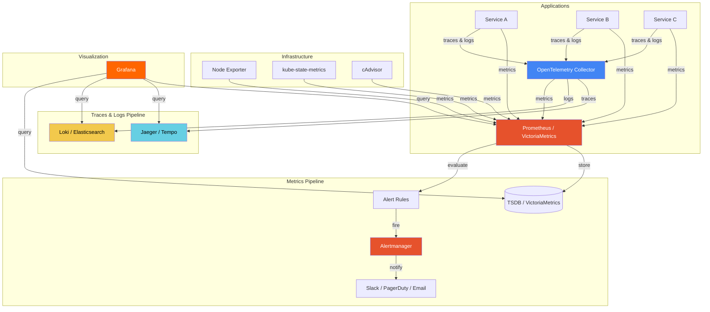

# 📊 Observability

> **Understanding what your systems are doing, why they're doing it, and what's about to go wrong.** Observability is not just monitoring — it's the ability to ask arbitrary questions about your system's internal state using externally available signals.

---

## 📑 Table of Contents

- [What is Observability?](#-what-is-observability)
- [The Three Pillars](#-the-three-pillars)
- [Observability Stack](#-observability-stack)
- [Tool Comparison](#-tool-comparison)
- [Subsections](#-subsections)
- [Getting Started](#-getting-started)
- [Key Concepts](#-key-concepts)
- [Best Practices](#-best-practices)
- [Related Topics](#-related-topics)

---

## 🧠 What is Observability?

Observability is the measure of how well you can understand a system's internal state from its external outputs. It goes beyond traditional monitoring (which checks known failure modes) by enabling you to explore unknown-unknowns.

**Monitoring vs Observability:**

| Aspect | Monitoring | Observability |
|--------|-----------|---------------|
| Approach | Predefined checks and dashboards | Ad-hoc querying and exploration |
| Questions | Known questions, known answers | Unknown questions, unknown answers |
| Failure Mode | Detects expected failures | Helps diagnose unexpected failures |
| Data Model | Predefined metrics and thresholds | High-cardinality, high-dimensionality data |
| Example | "Is CPU above 80%?" | "Why are requests from region X slow only for user type Y?" |

> **Key insight:** Monitoring tells you _when_ something is wrong. Observability helps you understand _why_.

---

## 🏛 The Three Pillars

### 1. Metrics

Numeric measurements collected over time. Lightweight, aggregatable, ideal for dashboards and alerting.

- **What:** Counters, gauges, histograms, summaries
- **When:** Tracking trends, SLIs/SLOs, alerting on thresholds
- **Tools:** Prometheus, VictoriaMetrics, Datadog, CloudWatch
- **Example:** Request rate, error rate, latency percentiles (RED method)

```text
http_requests_total{method="GET", status="200"} 1234
http_request_duration_seconds_bucket{le="0.5"} 890
```

### 2. Logs

Discrete, timestamped records of events. Rich context but high volume.

- **What:** Structured or unstructured text records
- **When:** Debugging specific requests, audit trails, error details
- **Tools:** Loki, Elasticsearch, Fluentd, CloudWatch Logs
- **Example:** Error stack traces, request payloads, state transitions

```json
{
  "timestamp": "2024-01-15T10:30:00Z",
  "level": "ERROR",
  "service": "payment-api",
  "trace_id": "abc123def456",
  "message": "Payment processing failed",
  "error": "timeout after 30s"
}
```

### 3. Traces

End-to-end request flow across services. Essential for distributed systems debugging.

- **What:** Spans forming a trace tree across service boundaries
- **When:** Latency analysis, dependency mapping, root cause in microservices
- **Tools:** Jaeger, Zipkin, Tempo, AWS X-Ray, OpenTelemetry
- **Example:** HTTP request → API Gateway → Auth Service → Database → Response

```text
Trace: abc123def456
├── [200ms] api-gateway /api/v1/orders
│   ├── [15ms]  auth-service validate-token
│   ├── [150ms] order-service create-order
│   │   ├── [50ms]  inventory-service check-stock
│   │   └── [80ms]  database INSERT orders
│   └── [10ms]  notification-service send-email
```

---

## 🏗 Observability Stack



---

## 🔧 Tool Comparison

### Metrics Storage

| Feature | Prometheus | VictoriaMetrics | Thanos | Mimir |
|---------|-----------|-----------------|--------|-------|
| Query Language | PromQL | MetricsQL (PromQL superset) | PromQL | PromQL |
| Long-Term Storage | Limited (local) | Built-in | Object storage | Object storage |
| High Availability | Manual (2 replicas) | Cluster mode | Sidecar + Store | Built-in |
| Multi-Tenancy | No | Yes | Limited | Yes |
| Compression | Good | Excellent (~70x) | Depends on backend | Good |
| Global View | Federation | Cluster query | Global query | Global query |
| Operational Complexity | Low | Low–Medium | High | Medium–High |
| Best For | Single cluster | Cost-effective long-term | Existing Prometheus HA | Large-scale multi-tenant |

### Log Aggregation

| Feature | Loki | Elasticsearch | Fluentd/Fluent Bit |
|---------|------|--------------|-------------------|
| Indexing | Labels only | Full-text | N/A (forwarder) |
| Storage Cost | Low | High | N/A |
| Query Language | LogQL | KQL / Lucene | N/A |
| Grafana Integration | Native | Plugin | N/A |
| Best For | Kubernetes-native | Full-text search | Log forwarding |

### Tracing

| Feature | Jaeger | Tempo | Zipkin | AWS X-Ray |
|---------|--------|-------|--------|-----------|
| Storage Backend | Elasticsearch, Cassandra | Object storage | Elasticsearch, MySQL | AWS managed |
| Sampling | Head-based | Head + Tail | Head-based | Head-based |
| Grafana Integration | Plugin | Native | Plugin | Limited |
| Search | Tags + duration | TraceQL | Tags | Filter expressions |
| Best For | General purpose | Grafana stack | Simple setups | AWS-native |

---

## 📂 Subsections

| Section | Description |
|---------|-------------|
| [🔥 Prometheus](prometheus/) | Metrics collection, scraping, alerting, storage |
| [📐 PromQL](promql/) | Query language for Prometheus and compatible systems |
| [📈 VictoriaMetrics](victoriametrics/) | High-performance, cost-effective long-term metrics storage |
| [📊 Grafana](grafana/) | Visualization, dashboards, alerting |
| [🔭 OpenTelemetry](opentelemetry/) | Unified instrumentation framework for traces, metrics, logs |

---

## 🚀 Getting Started

### Minimal Local Stack

```bash
# Start Prometheus + Grafana with Docker Compose
cat > docker-compose.yml <<'EOF'
version: '3.8'
services:
  prometheus:
    image: prom/prometheus:v2.50.0
    ports:
      - "9090:9090"
    volumes:
      - ./prometheus.yml:/etc/prometheus/prometheus.yml

  grafana:
    image: grafana/grafana:10.3.0
    ports:
      - "3000:3000"
    environment:
      - GF_SECURITY_ADMIN_PASSWORD=admin
EOF

# Minimal Prometheus config
cat > prometheus.yml <<'EOF'
global:
  scrape_interval: 15s

scrape_configs:
  - job_name: 'prometheus'
    static_configs:
      - targets: ['localhost:9090']
EOF

docker compose up -d
```

- Prometheus UI: `http://localhost:9090`
- Grafana UI: `http://localhost:3000` (admin/admin)

### What to Instrument First

1. **RED metrics** for every service: Request rate, Error rate, Duration
2. **USE metrics** for infrastructure: Utilization, Saturation, Errors
3. **Four Golden Signals** (Google SRE): Latency, Traffic, Errors, Saturation

---

## 🧠 Key Concepts

### RED Method (Request-Driven)

For every microservice, track:
- **R**ate — Requests per second
- **E**rrors — Failed requests per second
- **D**uration — Distribution of request latency

### USE Method (Resource-Driven)

For every resource (CPU, memory, disk, network), track:
- **U**tilization — Percentage of resource busy
- **S**aturation — Queue depth / work waiting
- **E**rrors — Error events on the resource

### SLI / SLO / SLA

| Term | Definition | Example |
|------|-----------|---------|
| **SLI** (Service Level Indicator) | A measurable metric | 99.2% of requests complete in <500ms |
| **SLO** (Service Level Objective) | Target value for an SLI | 99.9% availability over 30 days |
| **SLA** (Service Level Agreement) | Contract with consequences | 99.95% uptime or credits issued |

### Error Budget

```text
Error Budget = 1 - SLO
If SLO = 99.9%, Error Budget = 0.1%
In 30 days: 0.1% × 43,200 min = 43.2 minutes of allowed downtime
```

---

## ✅ Best Practices

1. **Instrument at the application level** — Don't rely solely on infrastructure metrics
2. **Use structured logging** — JSON logs with trace IDs enable correlation
3. **Correlate across pillars** — Link metrics → traces → logs via trace IDs
4. **Alert on symptoms, not causes** — Alert on high error rate, not high CPU
5. **Define SLOs early** — They drive what you measure and alert on
6. **Use recording rules** — Pre-compute expensive queries for dashboard performance
7. **Control cardinality** — High-cardinality labels (user IDs, request IDs) in logs and traces, not metrics
8. **Standardize naming** — Use consistent metric names across services
9. **Dashboard hierarchy** — Overview → Service → Component (drill-down)
10. **Test your alerting** — Regularly verify alerts fire and route correctly

---

## 🔗 Related Topics

- [🧰 CLI Tools](../cli/) — kubectl, docker, curl for debugging
- [🚀 DevOps](../devops/) — Infrastructure and deployment
- [🐛 Troubleshooting](../troubleshooting/) — Symptom-based debugging guides
- [🏗 System Design](../system-design/) — Architecture and scalability patterns
- [🔐 Security](../security/) — TLS, authentication, access control

---

> **Observability is a property of your system, not a product you buy.** Good observability comes from thoughtful instrumentation, meaningful metrics, correlated signals, and a culture of data-driven debugging.
