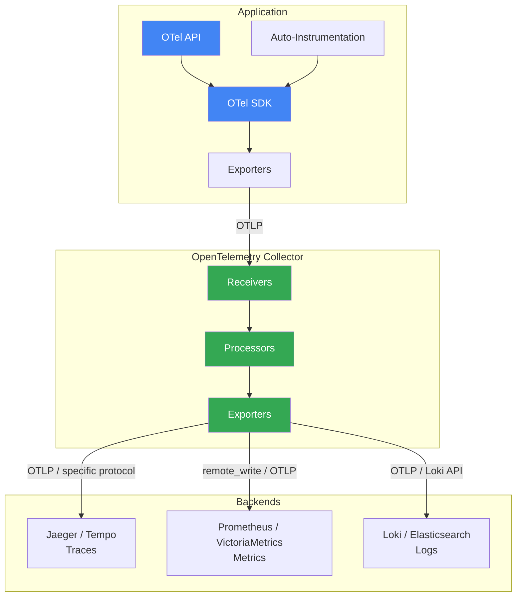
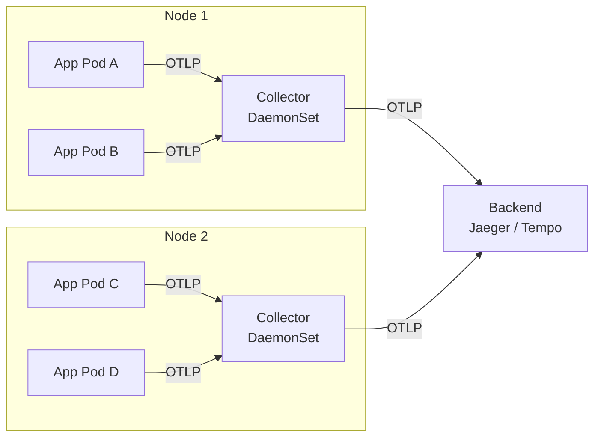
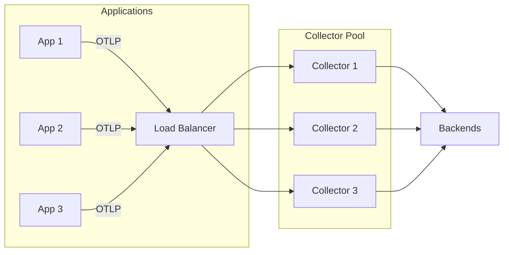
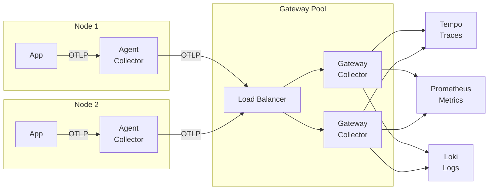

# 🔭 OpenTelemetry

> **The vendor-neutral standard for instrumentation.** OpenTelemetry (OTel) provides a single set of APIs, SDKs, and tools to generate, collect, and export telemetry data (traces, metrics, and logs). It's the CNCF's second most active project after Kubernetes, and the future of observability instrumentation.

---

## 📑 Table of Contents

- [What is OpenTelemetry?](#-what-is-opentelemetry)
- [Architecture](#-architecture)
- [Collector](#-collector)
- [Traces](#-traces)
- [Metrics](#-metrics)
- [Logs](#-logs)
- [Instrumentation](#-instrumentation)
- [Language Examples](#-language-examples)
- [Context Propagation](#-context-propagation)
- [Deployment Patterns](#-deployment-patterns)
- [Production Considerations](#-production-considerations)
- [Integration with Backends](#-integration-with-backends)
- [Troubleshooting](#-troubleshooting)
- [Related Topics](#-related-topics)

---

## 🧠 What is OpenTelemetry?

OpenTelemetry is a collection of tools, APIs, and SDKs that standardize how telemetry data is generated and collected from applications and infrastructure. It was formed by merging OpenTracing and OpenCensus.

**Three signals:**

| Signal | Purpose | Status |
|--------|---------|--------|
| **Traces** | Request flow across services | Stable |
| **Metrics** | Numeric measurements over time | Stable |
| **Logs** | Discrete event records | Stable (as of 2024) |

**What OTel is and is NOT:**

| OTel IS | OTel is NOT |
|---------|-------------|
| Instrumentation standard | A backend/storage system |
| Data collection framework | A visualization tool |
| Vendor-neutral API/SDK | A replacement for Prometheus or Jaeger |
| Data pipeline (Collector) | A monitoring platform |

**Key principle:** Instrument once, send to any backend. Switch from Jaeger to Tempo, or from Prometheus to VictoriaMetrics, without changing application code.

---

## 🏗 Architecture



### Components

| Component | Description |
|-----------|-------------|
| **API** | Defines how to create telemetry data. Vendor-neutral interfaces. No-op by default. |
| **SDK** | Implements the API. Handles sampling, batching, resource detection. |
| **Exporters** | Send data to backends (OTLP, Jaeger, Prometheus, Zipkin, etc.) |
| **Collector** | Standalone service that receives, processes, and exports telemetry |
| **Auto-instrumentation** | Libraries/agents that instrument frameworks automatically |
| **OTLP** | OpenTelemetry Protocol — the native wire format (gRPC + HTTP) |

### OTLP (OpenTelemetry Protocol)

The native protocol for transmitting telemetry data:

| Transport | Default Port | Use Case |
|-----------|-------------|----------|
| gRPC | 4317 | High-throughput, bidirectional |
| HTTP/protobuf | 4318 | Simpler setup, firewall-friendly |

---

## 📡 Collector

The Collector is the core component for receiving, processing, and exporting telemetry data.

### Pipeline Architecture

```text
┌─────────────────────────────────────────────┐
│              OTel Collector                   │
│                                              │
│  ┌──────────┐  ┌───────────┐  ┌──────────┐  │
│  │Receivers │→│Processors │→│Exporters │  │
│  └──────────┘  └───────────┘  └──────────┘  │
│                                              │
│  Traces pipeline:    otlp → batch → jaeger   │
│  Metrics pipeline:   otlp → batch → prometheus│
│  Logs pipeline:      otlp → batch → loki     │
└─────────────────────────────────────────────┘
```

### Collector Configuration

```yaml
# otel-collector-config.yml
receivers:
  otlp:
    protocols:
      grpc:
        endpoint: 0.0.0.0:4317
      http:
        endpoint: 0.0.0.0:4318

  # Scrape Prometheus metrics
  prometheus:
    config:
      scrape_configs:
        - job_name: "otel-collector"
          scrape_interval: 15s
          static_configs:
            - targets: ["localhost:8888"]

  # Receive Jaeger-format traces
  jaeger:
    protocols:
      grpc:
        endpoint: 0.0.0.0:14250
      thrift_http:
        endpoint: 0.0.0.0:14268

  # Host metrics (CPU, memory, disk)
  hostmetrics:
    collection_interval: 30s
    scrapers:
      cpu:
      memory:
      disk:
      filesystem:
      network:
      load:

processors:
  # Batch for efficiency
  batch:
    send_batch_size: 8192
    send_batch_max_size: 16384
    timeout: 5s

  # Add resource attributes
  resource:
    attributes:
      - key: environment
        value: production
        action: upsert
      - key: service.namespace
        value: my-platform
        action: upsert

  # Memory limiter (prevent OOM)
  memory_limiter:
    check_interval: 1s
    limit_mib: 1024
    spike_limit_mib: 256

  # Filter unwanted telemetry
  filter:
    traces:
      span:
        - 'attributes["http.target"] == "/health"'
        - 'attributes["http.target"] == "/ready"'

  # Tail sampling (Collector-level)
  tail_sampling:
    decision_wait: 10s
    num_traces: 100000
    policies:
      # Always sample errors
      - name: errors
        type: status_code
        status_code:
          status_codes: [ERROR]
      # Sample slow requests
      - name: slow-requests
        type: latency
        latency:
          threshold_ms: 1000
      # Probabilistic sampling for the rest
      - name: probabilistic
        type: probabilistic
        probabilistic:
          sampling_percentage: 10

  # Attribute processing
  attributes:
    actions:
      - key: db.statement
        action: hash    # Hash sensitive data
      - key: http.request.header.authorization
        action: delete  # Remove sensitive headers

exporters:
  # OTLP to another Collector or backend
  otlp:
    endpoint: tempo:4317
    tls:
      insecure: true

  # Prometheus remote write
  prometheusremotewrite:
    endpoint: http://victoriametrics:8428/api/v1/write

  # Prometheus exporter (pull-based)
  prometheus:
    endpoint: 0.0.0.0:8889
    namespace: otel

  # Jaeger
  jaeger:
    endpoint: jaeger:14250
    tls:
      insecure: true

  # Loki
  loki:
    endpoint: http://loki:3100/loki/api/v1/push

  # Debug (stdout)
  debug:
    verbosity: detailed

  # File exporter (for debugging)
  file:
    path: /tmp/otel-output.json

service:
  pipelines:
    traces:
      receivers: [otlp, jaeger]
      processors: [memory_limiter, batch, resource, tail_sampling]
      exporters: [otlp]

    metrics:
      receivers: [otlp, prometheus, hostmetrics]
      processors: [memory_limiter, batch, resource]
      exporters: [prometheusremotewrite]

    logs:
      receivers: [otlp]
      processors: [memory_limiter, batch, resource]
      exporters: [loki]

  telemetry:
    logs:
      level: info
    metrics:
      address: 0.0.0.0:8888
```

### Key Receivers

| Receiver | Purpose |
|----------|---------|
| `otlp` | OTLP gRPC/HTTP (primary) |
| `jaeger` | Jaeger protocol (migration) |
| `zipkin` | Zipkin protocol |
| `prometheus` | Scrape Prometheus targets |
| `hostmetrics` | Host-level CPU, memory, disk |
| `filelog` | Read log files |
| `kafka` | Consume from Kafka topics |
| `k8s_events` | Kubernetes events |

### Key Processors

| Processor | Purpose |
|-----------|---------|
| `batch` | Batch for efficiency |
| `memory_limiter` | Prevent OOM |
| `resource` | Add/modify resource attributes |
| `attributes` | Add/modify span/metric attributes |
| `filter` | Drop unwanted telemetry |
| `tail_sampling` | Sample based on complete traces |
| `transform` | Transform using OTTL |
| `k8sattributes` | Enrich with Kubernetes metadata |
| `redaction` | Remove sensitive data |

### Key Exporters

| Exporter | Purpose |
|----------|---------|
| `otlp` | OTLP to any OTLP-compatible backend |
| `prometheusremotewrite` | Prometheus remote write |
| `prometheus` | Expose /metrics endpoint |
| `jaeger` | Send traces to Jaeger |
| `loki` | Send logs to Loki |
| `debug` | Print to stdout (debugging) |

---

## 🔍 Traces

### Concepts

```text
Trace
└── Span A (root): API Gateway - POST /api/orders  [200ms]
    ├── Span B: Auth Service - validate-token        [15ms]
    ├── Span C: Order Service - create-order          [150ms]
    │   ├── Span D: Inventory - check-stock           [50ms]
    │   └── Span E: Database - INSERT orders          [80ms]
    └── Span F: Notification - send-email             [10ms]
```

### Span Attributes

| Attribute | Description | Example |
|-----------|-------------|---------|
| `trace_id` | Unique trace identifier | `4bf92f3577b34da6a3ce929d0e0e4736` |
| `span_id` | Unique span identifier | `00f067aa0ba902b7` |
| `parent_span_id` | Parent span (empty for root) | `b7ad6b7169203331` |
| `name` | Operation name | `GET /api/users` |
| `kind` | Span kind | `SERVER`, `CLIENT`, `PRODUCER`, `CONSUMER`, `INTERNAL` |
| `status` | Status code | `OK`, `ERROR`, `UNSET` |
| `start_time` | Start timestamp | ISO 8601 |
| `end_time` | End timestamp | ISO 8601 |
| `attributes` | Key-value metadata | `http.method=GET`, `db.system=postgresql` |
| `events` | Timestamped annotations | Exceptions, log messages |
| `links` | Related traces | Batch processing links |

### Span Kind

| Kind | Description | Example |
|------|-------------|---------|
| `SERVER` | Handles incoming request | HTTP server handler |
| `CLIENT` | Makes outgoing request | HTTP client call, DB query |
| `PRODUCER` | Creates async message | Kafka producer |
| `CONSUMER` | Processes async message | Kafka consumer |
| `INTERNAL` | Internal operation | Business logic function |

### Sampling

| Strategy | Description | Use Case |
|----------|-------------|----------|
| **Always On** | Sample 100% | Development, low traffic |
| **Always Off** | Sample nothing | Disable tracing |
| **TraceIdRatio** | Probabilistic (e.g., 10%) | Production (head sampling) |
| **ParentBased** | Follow parent's decision | Default for child spans |
| **Tail Sampling** | Decide after trace completes | Error/latency-based (Collector) |

---

## 📊 Metrics

### Instrument Types

| Instrument | Sync/Async | Aggregation | Example |
|------------|-----------|-------------|---------|
| **Counter** | Sync | Sum | Request count |
| **UpDownCounter** | Sync | Sum | Active connections |
| **Histogram** | Sync | ExplicitBucketHistogram | Request duration |
| **ObservableCounter** | Async | Sum | CPU time |
| **ObservableUpDownCounter** | Async | Sum | Queue size |
| **ObservableGauge** | Async | LastValue | Temperature |

### Metric Data Model

```text
Metric:
  name: http.server.request.duration
  description: Duration of HTTP server requests
  unit: s
  type: histogram
  data_points:
    - attributes: {http.method: GET, http.route: /api/users}
      start_time: 2024-01-15T10:00:00Z
      time: 2024-01-15T10:00:15Z
      count: 150
      sum: 12.5
      bucket_counts: [50, 80, 15, 4, 1]
      explicit_bounds: [0.005, 0.01, 0.05, 0.1, 0.5]
```

### Semantic Conventions for Metrics

OTel defines standard metric names:

| Metric | Description |
|--------|-------------|
| `http.server.request.duration` | Server request latency |
| `http.server.active_requests` | Active server requests |
| `http.client.request.duration` | Client request latency |
| `db.client.operation.duration` | Database operation latency |
| `messaging.process.duration` | Message processing latency |
| `rpc.server.duration` | RPC server request latency |

---

## 📝 Logs

### Structured Logging with OTel

OTel logs bridge existing logging frameworks with the OpenTelemetry ecosystem.

```text
Log Record:
  timestamp: 2024-01-15T10:30:00.000Z
  severity: ERROR
  body: "Payment processing failed"
  attributes:
    service.name: payment-api
    trace_id: 4bf92f3577b34da6a3ce929d0e0e4736
    span_id: 00f067aa0ba902b7
    user.id: "12345"
    error.type: "TimeoutError"
```

### Log Correlation with Traces

The key value of OTel logs is automatic trace correlation:

```json
{
  "timestamp": "2024-01-15T10:30:00Z",
  "severity": "ERROR",
  "body": "Payment processing failed",
  "resource": {
    "service.name": "payment-api",
    "service.version": "1.2.3"
  },
  "attributes": {
    "error.type": "TimeoutError"
  },
  "traceId": "4bf92f3577b34da6a3ce929d0e0e4736",
  "spanId": "00f067aa0ba902b7"
}
```

In Grafana, this enables clicking from a log line directly to the corresponding trace.

---

## 🔧 Instrumentation

### Auto-Instrumentation

Automatic instrumentation of common frameworks and libraries with zero code changes.

| Language | Method | Common Frameworks |
|----------|--------|-------------------|
| Java | Java agent (`-javaagent:`) | Spring, JAX-RS, JDBC, gRPC |
| Python | `opentelemetry-instrument` CLI | Flask, Django, FastAPI, requests |
| Node.js | `@opentelemetry/auto-instrumentations-node` | Express, Koa, HTTP, gRPC |
| .NET | .NET agent | ASP.NET Core, HttpClient, EF Core |
| Go | Manual (no agent) | Use OTel contrib packages |

### Manual Instrumentation

When auto-instrumentation isn't sufficient, add custom spans and attributes.

---

## 💻 Language Examples

### Python

```python
# Install:
# pip install opentelemetry-api opentelemetry-sdk opentelemetry-exporter-otlp
# pip install opentelemetry-instrumentation-flask opentelemetry-instrumentation-requests

from opentelemetry import trace, metrics
from opentelemetry.sdk.trace import TracerProvider
from opentelemetry.sdk.trace.export import BatchSpanProcessor
from opentelemetry.sdk.metrics import MeterProvider
from opentelemetry.sdk.metrics.export import PeriodicExportingMetricReader
from opentelemetry.exporter.otlp.proto.grpc.trace_exporter import OTLPSpanExporter
from opentelemetry.exporter.otlp.proto.grpc.metric_exporter import OTLPMetricExporter
from opentelemetry.sdk.resources import Resource

# Setup resource
resource = Resource.create({
    "service.name": "payment-api",
    "service.version": "1.2.3",
    "deployment.environment": "production",
})

# Setup tracing
tracer_provider = TracerProvider(resource=resource)
tracer_provider.add_span_processor(
    BatchSpanProcessor(OTLPSpanExporter(endpoint="http://collector:4317"))
)
trace.set_tracer_provider(tracer_provider)
tracer = trace.get_tracer(__name__)

# Setup metrics
metric_reader = PeriodicExportingMetricReader(
    OTLPMetricExporter(endpoint="http://collector:4317"),
    export_interval_millis=15000,
)
meter_provider = MeterProvider(resource=resource, metric_readers=[metric_reader])
metrics.set_meter_provider(meter_provider)
meter = metrics.get_meter(__name__)

# Create instruments
request_counter = meter.create_counter(
    name="http.server.request.count",
    description="Total HTTP requests",
    unit="1",
)

request_duration = meter.create_histogram(
    name="http.server.request.duration",
    description="HTTP request duration",
    unit="s",
)

# Use in application
import time

def handle_request(method: str, path: str) -> None:
    """Handle an HTTP request with tracing and metrics."""
    with tracer.start_as_current_span(
        f"{method} {path}",
        attributes={
            "http.method": method,
            "http.route": path,
        },
    ) as span:
        start = time.time()
        try:
            # Business logic
            result = process_payment()
            span.set_attribute("payment.status", "success")
            request_counter.add(1, {"http.method": method, "http.status_code": "200"})
        except Exception as e:
            span.set_status(trace.StatusCode.ERROR, str(e))
            span.record_exception(e)
            request_counter.add(1, {"http.method": method, "http.status_code": "500"})
            raise
        finally:
            duration = time.time() - start
            request_duration.record(duration, {"http.method": method, "http.route": path})


# Auto-instrumentation for Flask
# opentelemetry-instrument --service_name payment-api flask run
```

### Go

```go
package main

import (
    "context"
    "log"
    "time"

    "go.opentelemetry.io/otel"
    "go.opentelemetry.io/otel/attribute"
    "go.opentelemetry.io/otel/exporters/otlp/otlptrace/otlptracegrpc"
    "go.opentelemetry.io/otel/metric"
    "go.opentelemetry.io/otel/sdk/resource"
    sdktrace "go.opentelemetry.io/otel/sdk/trace"
    semconv "go.opentelemetry.io/otel/semconv/v1.24.0"
    "go.opentelemetry.io/otel/trace"
)

func initTracer(ctx context.Context) (*sdktrace.TracerProvider, error) {
    exporter, err := otlptracegrpc.New(ctx,
        otlptracegrpc.WithEndpoint("collector:4317"),
        otlptracegrpc.WithInsecure(),
    )
    if err != nil {
        return nil, err
    }

    res, err := resource.New(ctx,
        resource.WithAttributes(
            semconv.ServiceNameKey.String("order-service"),
            semconv.ServiceVersionKey.String("1.0.0"),
            attribute.String("environment", "production"),
        ),
    )
    if err != nil {
        return nil, err
    }

    tp := sdktrace.NewTracerProvider(
        sdktrace.WithBatcher(exporter),
        sdktrace.WithResource(res),
        sdktrace.WithSampler(sdktrace.TraceIDRatioBased(0.1)), // 10% sampling
    )
    otel.SetTracerProvider(tp)
    return tp, nil
}

func handleOrder(ctx context.Context) error {
    tracer := otel.Tracer("order-service")

    ctx, span := tracer.Start(ctx, "handleOrder",
        trace.WithAttributes(
            attribute.String("order.type", "standard"),
        ),
    )
    defer span.End()

    // Call downstream service
    if err := checkInventory(ctx); err != nil {
        span.RecordError(err)
        span.SetStatus(codes.Error, err.Error())
        return err
    }

    span.AddEvent("order.created", trace.WithAttributes(
        attribute.String("order.id", "ORD-12345"),
    ))

    return nil
}

func checkInventory(ctx context.Context) error {
    tracer := otel.Tracer("order-service")
    ctx, span := tracer.Start(ctx, "checkInventory")
    defer span.End()

    // ... inventory check logic ...
    time.Sleep(50 * time.Millisecond)
    return nil
}
```

### Java (Spring Boot)

```java
// build.gradle
// implementation 'io.opentelemetry:opentelemetry-api:1.35.0'
// implementation 'io.opentelemetry:opentelemetry-sdk:1.35.0'
// implementation 'io.opentelemetry:opentelemetry-exporter-otlp:1.35.0'

// Or use the Java agent for auto-instrumentation:
// java -javaagent:opentelemetry-javaagent.jar \
//   -Dotel.service.name=payment-api \
//   -Dotel.exporter.otlp.endpoint=http://collector:4317 \
//   -jar myapp.jar

import io.opentelemetry.api.GlobalOpenTelemetry;
import io.opentelemetry.api.trace.Span;
import io.opentelemetry.api.trace.Tracer;
import io.opentelemetry.api.common.Attributes;
import io.opentelemetry.api.metrics.Meter;
import io.opentelemetry.api.metrics.LongCounter;

public class OrderService {
    private static final Tracer tracer = GlobalOpenTelemetry.getTracer("order-service");
    private static final Meter meter = GlobalOpenTelemetry.getMeter("order-service");

    private static final LongCounter orderCounter = meter
        .counterBuilder("orders.created.total")
        .setDescription("Total orders created")
        .build();

    public void createOrder(String orderId) {
        Span span = tracer.spanBuilder("createOrder")
            .setAttribute("order.id", orderId)
            .startSpan();

        try (var scope = span.makeCurrent()) {
            // Business logic
            processPayment(orderId);
            orderCounter.add(1, Attributes.builder()
                .put("order.type", "standard")
                .build());
            span.addEvent("order.created");
        } catch (Exception e) {
            span.recordException(e);
            span.setStatus(StatusCode.ERROR, e.getMessage());
            throw e;
        } finally {
            span.end();
        }
    }
}
```

---

## 🌐 Context Propagation

Context propagation ensures trace context is carried across service boundaries.

### W3C TraceContext (Default)

```http
# HTTP headers
traceparent: 00-4bf92f3577b34da6a3ce929d0e0e4736-00f067aa0ba902b7-01
tracestate: congo=t61rcWkgMzE

# Format: version-trace_id-parent_id-trace_flags
# 00     - version
# 4bf9...- 32 hex chars trace ID
# 00f0...- 16 hex chars parent span ID
# 01     - trace flags (01 = sampled)
```

### B3 (Zipkin)

```http
# Single header format
b3: 4bf92f3577b34da6a3ce929d0e0e4736-00f067aa0ba902b7-1

# Multi-header format
X-B3-TraceId: 4bf92f3577b34da6a3ce929d0e0e4736
X-B3-SpanId: 00f067aa0ba902b7
X-B3-Sampled: 1
X-B3-ParentSpanId: b7ad6b7169203331
```

### Configuration

```python
# Python — Set propagator
from opentelemetry.propagators.b3 import B3MultiFormat
from opentelemetry import propagate

# Use W3C (default) + B3 for compatibility
from opentelemetry.propagators.composite import CompositePropagator
propagate.set_global_textmap(CompositePropagator([
    TraceContextTextMapPropagator(),
    B3MultiFormat(),
]))
```

```yaml
# Collector — propagators config
# Environment variable
OTEL_PROPAGATORS=tracecontext,baggage,b3multi
```

---

## 🏗 Deployment Patterns

### Agent Pattern (Sidecar / DaemonSet)



**Use case:** Lightweight data collection on each node. Collector handles batching, retry, and export.

### Gateway Pattern



**Use case:** Centralized processing, tail sampling, routing. Good for multi-tenant setups.

### Agent + Gateway (Recommended for Production)



**Use case:** Best of both worlds. Agents handle local buffering and basic processing, gateways handle sampling, enrichment, and routing.

### Kubernetes DaemonSet Deployment

```yaml
apiVersion: apps/v1
kind: DaemonSet
metadata:
  name: otel-collector-agent
spec:
  selector:
    matchLabels:
      app: otel-collector
  template:
    metadata:
      labels:
        app: otel-collector
    spec:
      containers:
        - name: collector
          image: otel/opentelemetry-collector-contrib:0.95.0
          args: ["--config=/conf/config.yaml"]
          ports:
            - containerPort: 4317  # OTLP gRPC
            - containerPort: 4318  # OTLP HTTP
            - containerPort: 8888  # Metrics
          resources:
            limits:
              memory: 512Mi
              cpu: 500m
            requests:
              memory: 256Mi
              cpu: 100m
          volumeMounts:
            - name: config
              mountPath: /conf
      volumes:
        - name: config
          configMap:
            name: otel-collector-config
```

---

## 🏭 Production Considerations

### Sampling Strategies

| Strategy | Pros | Cons | When to Use |
|----------|------|------|-------------|
| **Head sampling (app-level)** | Simple, low overhead | Can't make decisions based on full trace | Low traffic, development |
| **Tail sampling (Collector)** | Intelligent decisions (errors, latency) | Requires stateful Collector, more resources | Production |
| **Probabilistic** | Simple, predictable volume | Misses rare events | High traffic, general purpose |
| **Rate limiting** | Predictable costs | May miss bursts | Cost control |

### Tail Sampling Configuration

```yaml
processors:
  tail_sampling:
    decision_wait: 10s          # Wait for all spans of a trace
    num_traces: 100000          # Max traces in memory
    policies:
      # Always keep errors
      - name: errors-policy
        type: status_code
        status_code:
          status_codes: [ERROR]

      # Always keep slow traces
      - name: latency-policy
        type: latency
        latency:
          threshold_ms: 2000

      # Sample 5% of everything else
      - name: probabilistic-policy
        type: probabilistic
        probabilistic:
          sampling_percentage: 5

      # Always keep specific operations
      - name: important-operations
        type: string_attribute
        string_attribute:
          key: http.route
          values: ["/api/checkout", "/api/payment"]
```

### Data Volume Management

```text
Estimation:
  Traces: ~1 KB per span average
  1000 req/sec × 5 spans/req × 1 KB = 5 MB/sec = 432 GB/day (unsampled!)

  With 10% sampling: 43.2 GB/day
  With 1% sampling:  4.3 GB/day

Strategies:
  1. Sample aggressively (1-10% for high-traffic services)
  2. Always capture errors and slow requests (tail sampling)
  3. Drop health check / readiness spans
  4. Set short retention (7-14 days for traces)
  5. Use Collector filtering to drop noisy spans
  6. Use attribute limits to control span size
```

### Resource Attributes

Always set these on your services:

```python
resource = Resource.create({
    "service.name": "payment-api",         # Required
    "service.version": "1.2.3",           # Strongly recommended
    "service.namespace": "ecommerce",     # Recommended
    "deployment.environment": "production", # Recommended
    "host.name": "pod-abc123",            # Auto-detected
    "k8s.pod.name": "payment-api-xyz",    # Auto-detected with k8s resource detector
})
```

### Collector Resource Limits

```yaml
processors:
  memory_limiter:
    check_interval: 1s
    limit_mib: 2048        # Hard limit
    spike_limit_mib: 512   # Spike tolerance

  batch:
    send_batch_size: 8192
    timeout: 5s

# Always put memory_limiter first in processor chain
service:
  pipelines:
    traces:
      processors: [memory_limiter, batch, ...]
```

---

## 🔗 Integration with Backends

### Prometheus

```yaml
# Collector exports metrics to Prometheus
exporters:
  prometheusremotewrite:
    endpoint: http://prometheus:9090/api/v1/write

  # Or expose /metrics for Prometheus to scrape
  prometheus:
    endpoint: 0.0.0.0:8889
```

### Grafana Tempo (Traces)

```yaml
exporters:
  otlp:
    endpoint: tempo:4317
    tls:
      insecure: true
```

### Grafana Loki (Logs)

```yaml
exporters:
  loki:
    endpoint: http://loki:3100/loki/api/v1/push
    default_labels_enabled:
      exporter: false
      job: true
```

### Jaeger

```yaml
exporters:
  otlp:
    endpoint: jaeger:4317
    tls:
      insecure: true
```

### Grafana: Traces → Logs → Metrics Correlation

In Grafana, configure data source links:

1. **Tempo → Loki:** Auto-link traces to logs via `trace_id`
2. **Loki → Tempo:** Click on `trace_id` in logs to open trace
3. **Prometheus → Tempo:** Exemplars link metrics to trace IDs

---

## 🐛 Troubleshooting

### No Traces Arriving

```bash
# 1. Check Collector is running
curl http://collector:13133/    # Health check

# 2. Check Collector metrics
curl http://collector:8888/metrics | grep otelcol_receiver
# Look for: otelcol_receiver_accepted_spans > 0

# 3. Enable debug exporter
exporters:
  debug:
    verbosity: detailed
service:
  pipelines:
    traces:
      exporters: [debug, otlp]

# 4. Check SDK configuration
# Verify OTEL_EXPORTER_OTLP_ENDPOINT is set correctly
echo $OTEL_EXPORTER_OTLP_ENDPOINT

# 5. Check sampling
# If TraceIdRatio = 0.01, only 1% of traces are captured
# Temporarily set to 1.0 for debugging

# 6. Check network connectivity
curl -v http://collector:4318/v1/traces

# 7. Check Collector logs
docker logs otel-collector 2>&1 | grep -i error
```

### Collector Memory Issues

```bash
# Check Collector memory
curl http://collector:8888/metrics | grep process_runtime_total_alloc_bytes

# Symptoms: OOM kills, high memory usage
# Solutions:
# 1. Add memory_limiter processor
# 2. Reduce tail_sampling num_traces
# 3. Reduce batch sizes
# 4. Add filtering to drop unwanted data
# 5. Increase Collector resources
```

### Missing Attributes

```text
Problem: Spans arrive but missing expected attributes

1. Check semantic conventions — attribute names may have changed
   Old: http.method → New: http.request.method (semconv 1.24+)

2. Check auto-instrumentation version
   Different versions capture different attributes

3. Check Collector processors
   attributes processor might be dropping/renaming them

4. Check SDK resource detection
   Resource attributes (service.name) need explicit configuration
```

### Environment Variables Reference

```bash
# Common OTel SDK environment variables
OTEL_SERVICE_NAME=my-service
OTEL_EXPORTER_OTLP_ENDPOINT=http://collector:4317
OTEL_EXPORTER_OTLP_PROTOCOL=grpc    # or http/protobuf
OTEL_TRACES_SAMPLER=traceidratio
OTEL_TRACES_SAMPLER_ARG=0.1
OTEL_PROPAGATORS=tracecontext,baggage
OTEL_RESOURCE_ATTRIBUTES=deployment.environment=production,service.version=1.2.3
OTEL_LOG_LEVEL=debug                 # For SDK debug logging
```

---

## 🔗 Related Topics

- [🔥 Prometheus](../prometheus/) — Metrics storage backend
- [📊 Grafana](../grafana/) — Visualization and dashboards
- [📐 PromQL](../promql/) — Query language for metrics
- [📊 Observability Overview](../) — Three pillars and tool comparison

---

> **OpenTelemetry is the future of observability instrumentation.** Adopt it for new services, migrate existing instrumentation gradually, and use the Collector as your telemetry pipeline. Instrument once, export to any backend, and switch vendors without touching application code.
