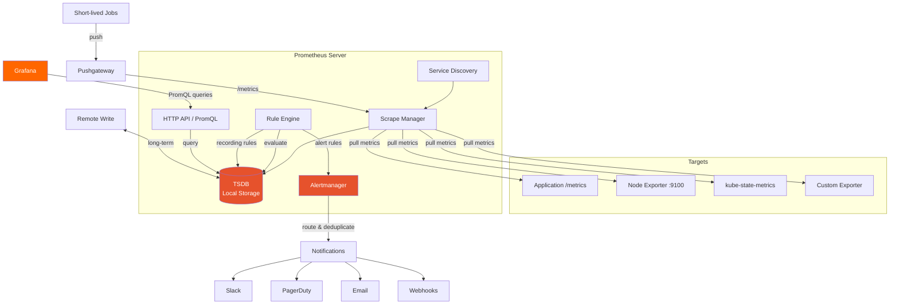

# 🔥 Prometheus

> **The de facto standard for metrics collection in cloud-native environments.** Prometheus is an open-source systems monitoring and alerting toolkit that uses a pull-based model to scrape metrics from instrumented targets, store them in a time-series database, and evaluate alerting rules.

---

## 📑 Table of Contents

- [What is Prometheus?](#-what-is-prometheus)
- [Architecture](#-architecture)
- [Data Model](#-data-model)
- [Configuration](#-configuration)
- [Service Discovery](#-service-discovery)
- [Scraping](#-scraping)
- [Recording Rules](#-recording-rules)
- [Alert Rules](#-alert-rules)
- [Storage](#-storage)
- [Federation](#-federation)
- [Instrumentation](#-instrumentation)
- [Exporters](#-exporters)
- [Performance](#-performance)
- [Production Deployment](#-production-deployment)
- [Troubleshooting](#-troubleshooting)
- [Related Topics](#-related-topics)

---

## 🧠 What is Prometheus?

Prometheus was originally built at SoundCloud in 2012 and became the second project to graduate from the Cloud Native Computing Foundation (CNCF) after Kubernetes. It's the standard metrics solution for Kubernetes and cloud-native environments.

**Key characteristics:**

- **Pull-based model** — Prometheus scrapes metrics from targets via HTTP
- **Multi-dimensional data model** — Time series identified by metric name + key/value labels
- **PromQL** — Powerful, flexible query language for aggregation and analysis
- **Autonomous** — Each server operates independently, no distributed storage dependency
- **Service discovery** — Native integration with Kubernetes, Consul, EC2, and more
- **Alerting** — Built-in alert evaluation with Alertmanager for routing and deduplication

**What Prometheus is NOT:**

- Not a long-term storage solution (default 15-day retention)
- Not a log aggregation system
- Not a tracing system
- Not designed for 100% accuracy billing/counting (eventual consistency)

---

## 🏗 Architecture



**Core components:**

| Component | Purpose | Port |
|-----------|---------|------|
| Prometheus Server | Scrapes, stores, queries, evaluates rules | 9090 |
| Alertmanager | Routes, deduplicates, silences alerts | 9093 |
| Pushgateway | Accepts pushed metrics from short-lived jobs | 9091 |
| Node Exporter | Exposes host-level hardware/OS metrics | 9100 |
| kube-state-metrics | Exposes Kubernetes object state metrics | 8080 |

---

## 📊 Data Model

Prometheus stores all data as **time series** — streams of timestamped values belonging to the same metric and set of labels.

### Time Series Notation

```text
<metric_name>{<label_name>=<label_value>, ...}
```

Example:

```text
http_requests_total{method="GET", handler="/api/users", status="200"}  →  value: 1234 @ timestamp
```

### Metric Types

#### Counter

A cumulative metric that only increases (or resets to zero on restart).

```text
# HELP http_requests_total Total number of HTTP requests
# TYPE http_requests_total counter
http_requests_total{method="GET", status="200"} 1234
http_requests_total{method="POST", status="201"} 567
http_requests_total{method="GET", status="500"} 12
```

**Use for:** Request counts, errors, bytes sent, tasks completed
**Query with:** `rate()`, `increase()` — never use raw counter values

#### Gauge

A metric that can go up and down.

```text
# HELP node_memory_available_bytes Available memory in bytes
# TYPE node_memory_available_bytes gauge
node_memory_available_bytes 4294967296
```

**Use for:** Temperature, memory usage, queue size, active connections
**Query with:** Direct value, `avg_over_time()`, `max_over_time()`

#### Histogram

Samples observations and counts them in configurable buckets. Also provides sum and count.

```text
# HELP http_request_duration_seconds HTTP request latency
# TYPE http_request_duration_seconds histogram
http_request_duration_seconds_bucket{le="0.005"} 1000
http_request_duration_seconds_bucket{le="0.01"}  1200
http_request_duration_seconds_bucket{le="0.025"} 1400
http_request_duration_seconds_bucket{le="0.05"}  1500
http_request_duration_seconds_bucket{le="0.1"}   1550
http_request_duration_seconds_bucket{le="0.25"}  1600
http_request_duration_seconds_bucket{le="0.5"}   1620
http_request_duration_seconds_bucket{le="1.0"}   1630
http_request_duration_seconds_bucket{le="+Inf"}  1635
http_request_duration_seconds_sum 456.78
http_request_duration_seconds_count 1635
```

**Use for:** Request duration, response size — anything where you need percentiles
**Query with:** `histogram_quantile()`, `rate()` on `_bucket`, `_sum`, `_count`

> **Tip:** Choose bucket boundaries based on your SLO. For an SLO of "99% of requests < 500ms", include buckets at 0.1, 0.25, 0.5, 1.0 seconds.

#### Summary

Similar to histogram but calculates quantiles client-side. Generally prefer histograms.

```text
# HELP rpc_duration_seconds RPC latency
# TYPE rpc_duration_seconds summary
rpc_duration_seconds{quantile="0.5"}  0.045
rpc_duration_seconds{quantile="0.9"}  0.08
rpc_duration_seconds{quantile="0.99"} 0.15
rpc_duration_seconds_sum 234.56
rpc_duration_seconds_count 5000
```

**Histogram vs Summary:**

| Feature | Histogram | Summary |
|---------|-----------|---------|
| Quantile calculation | Server-side (PromQL) | Client-side |
| Aggregatable | Yes (across instances) | No |
| Accuracy | Depends on bucket boundaries | Configurable error |
| Cost | More time series (per bucket) | Fixed time series count |
| Recommendation | **Preferred in most cases** | Rarely needed |

### Labels

Labels are key-value pairs that create dimensional data:

```text
http_requests_total{method="GET", handler="/api/users", status="200", instance="web-1:8080"}
```

**Label rules:**
- Labels starting with `__` are internal (removed after scraping)
- Keep cardinality manageable (avoid user IDs, request IDs as label values)
- Use labels for dimensions you need to filter/aggregate on
- `job` and `instance` labels are added automatically by Prometheus

**Reserved labels:**

| Label | Source | Purpose |
|-------|--------|---------|
| `job` | Scrape config `job_name` | Identifies the scrape job |
| `instance` | Target address | Identifies the specific target |
| `__address__` | Service discovery | Target host:port (internal) |
| `__metrics_path__` | Service discovery | Metrics endpoint path (internal) |
| `__scheme__` | Service discovery | HTTP or HTTPS (internal) |

---

## ⚙️ Configuration

### prometheus.yml — Full Structure

```yaml
# Global configuration
global:
  scrape_interval: 15s          # How often to scrape targets (default: 1m)
  scrape_timeout: 10s           # Scrape timeout (default: 10s)
  evaluation_interval: 15s      # How often to evaluate rules (default: 1m)
  external_labels:              # Labels added to all time series and alerts
    cluster: production
    region: us-east-1

# Alertmanager configuration
alerting:
  alertmanagers:
    - static_configs:
        - targets:
            - alertmanager-1:9093
            - alertmanager-2:9093
      # Optional: Alertmanager-level relabeling
      # alert_relabel_configs:
      #   - source_labels: [__name__]
      #     regex: expensive_.*
      #     action: drop

# Rule files (recording rules + alert rules)
rule_files:
  - "rules/recording/*.yml"
  - "rules/alerting/*.yml"

# Scrape configurations
scrape_configs:
  # Scrape Prometheus itself
  - job_name: "prometheus"
    static_configs:
      - targets: ["localhost:9090"]

  # Scrape Node Exporters
  - job_name: "node"
    static_configs:
      - targets:
          - "node-1:9100"
          - "node-2:9100"
          - "node-3:9100"
    # Override global scrape interval for this job
    scrape_interval: 30s

  # Scrape with basic auth
  - job_name: "authenticated-target"
    basic_auth:
      username: prometheus
      password_file: /etc/prometheus/password
    static_configs:
      - targets: ["secure-app:8080"]

  # Scrape with TLS
  - job_name: "tls-target"
    scheme: https
    tls_config:
      ca_file: /etc/prometheus/ca.pem
      cert_file: /etc/prometheus/cert.pem
      key_file: /etc/prometheus/key.pem
    static_configs:
      - targets: ["secure-app:8443"]

  # Scrape with metrics path override
  - job_name: "custom-path"
    metrics_path: "/actuator/prometheus"
    static_configs:
      - targets: ["spring-app:8080"]
```

### Configuration Reload

```bash
# Send SIGHUP to Prometheus process
kill -HUP $(pidof prometheus)

# Or use the /-/reload endpoint (requires --web.enable-lifecycle flag)
curl -X POST http://localhost:9090/-/reload

# Validate configuration before applying
promtool check config prometheus.yml
promtool check rules rules/*.yml
```

---

## 🔍 Service Discovery

Prometheus can dynamically discover scrape targets.

### Static Config

```yaml
scrape_configs:
  - job_name: "my-app"
    static_configs:
      - targets: ["app-1:8080", "app-2:8080"]
        labels:
          env: production
          team: backend
```

### Kubernetes Service Discovery

```yaml
scrape_configs:
  # Discover pods with prometheus.io annotations
  - job_name: "kubernetes-pods"
    kubernetes_sd_configs:
      - role: pod
    relabel_configs:
      # Only scrape pods with prometheus.io/scrape=true
      - source_labels: [__meta_kubernetes_pod_annotation_prometheus_io_scrape]
        action: keep
        regex: true
      # Use custom port from annotation
      - source_labels: [__meta_kubernetes_pod_annotation_prometheus_io_port]
        action: replace
        regex: (\d+)
        target_label: __address__
        replacement: ${1}
      # Use custom path from annotation
      - source_labels: [__meta_kubernetes_pod_annotation_prometheus_io_path]
        action: replace
        target_label: __metrics_path__
        regex: (.+)
      # Add namespace label
      - source_labels: [__meta_kubernetes_namespace]
        action: replace
        target_label: namespace
      # Add pod label
      - source_labels: [__meta_kubernetes_pod_name]
        action: replace
        target_label: pod

  # Discover service endpoints
  - job_name: "kubernetes-service-endpoints"
    kubernetes_sd_configs:
      - role: endpoints
    relabel_configs:
      - source_labels: [__meta_kubernetes_service_annotation_prometheus_io_scrape]
        action: keep
        regex: true
      - source_labels: [__meta_kubernetes_service_name]
        action: replace
        target_label: service

  # Discover nodes (kubelet metrics)
  - job_name: "kubernetes-nodes"
    kubernetes_sd_configs:
      - role: node
    scheme: https
    tls_config:
      ca_file: /var/run/secrets/kubernetes.io/serviceaccount/ca.crt
    bearer_token_file: /var/run/secrets/kubernetes.io/serviceaccount/token
    relabel_configs:
      - action: labelmap
        regex: __meta_kubernetes_node_label_(.+)
```

### File-Based Service Discovery

```yaml
scrape_configs:
  - job_name: "file-sd"
    file_sd_configs:
      - files:
          - "/etc/prometheus/targets/*.json"
        refresh_interval: 5m
```

Target file (`/etc/prometheus/targets/apps.json`):

```json
[
  {
    "targets": ["app-1:8080", "app-2:8080"],
    "labels": {
      "env": "production",
      "team": "backend"
    }
  }
]
```

### Consul Service Discovery

```yaml
scrape_configs:
  - job_name: "consul"
    consul_sd_configs:
      - server: "consul:8500"
        services: ["web", "api", "worker"]
    relabel_configs:
      - source_labels: [__meta_consul_tags]
        regex: .*,prometheus,.*
        action: keep
```

### EC2 Service Discovery

```yaml
scrape_configs:
  - job_name: "ec2"
    ec2_sd_configs:
      - region: us-east-1
        port: 9100
        filters:
          - name: tag:Environment
            values: ["production"]
          - name: tag:monitoring
            values: ["enabled"]
    relabel_configs:
      - source_labels: [__meta_ec2_tag_Name]
        target_label: instance_name
      - source_labels: [__meta_ec2_instance_id]
        target_label: instance_id
```

---

## 📡 Scraping

### How Scraping Works

1. Prometheus discovers targets via service discovery
2. At each `scrape_interval`, Prometheus sends HTTP GET to `<target>/metrics`
3. Target responds with metrics in Prometheus exposition format
4. Prometheus parses metrics, adds `job` and `instance` labels, stores in TSDB
5. Prometheus adds synthetic metrics for each scrape:

```text
up{job="my-app", instance="app-1:8080"}                    1     # 1=success, 0=failed
scrape_duration_seconds{job="my-app", instance="app-1:8080"} 0.015
scrape_samples_scraped{job="my-app", instance="app-1:8080"}  142
scrape_series_added{job="my-app", instance="app-1:8080"}     0
```

### /metrics Endpoint Example

```text
# HELP process_cpu_seconds_total Total user and system CPU time spent in seconds.
# TYPE process_cpu_seconds_total counter
process_cpu_seconds_total 123.45

# HELP process_resident_memory_bytes Resident memory size in bytes.
# TYPE process_resident_memory_bytes gauge
process_resident_memory_bytes 52428800

# HELP http_requests_total Total number of HTTP requests.
# TYPE http_requests_total counter
http_requests_total{method="GET",handler="/api/users",status="200"} 10000
http_requests_total{method="POST",handler="/api/users",status="201"} 500
http_requests_total{method="GET",handler="/api/users",status="500"} 23

# HELP http_request_duration_seconds HTTP request latency in seconds.
# TYPE http_request_duration_seconds histogram
http_request_duration_seconds_bucket{handler="/api/users",le="0.01"} 8000
http_request_duration_seconds_bucket{handler="/api/users",le="0.05"} 9500
http_request_duration_seconds_bucket{handler="/api/users",le="0.1"} 9800
http_request_duration_seconds_bucket{handler="/api/users",le="0.5"} 10200
http_request_duration_seconds_bucket{handler="/api/users",le="1"} 10400
http_request_duration_seconds_bucket{handler="/api/users",le="+Inf"} 10523
http_request_duration_seconds_sum{handler="/api/users"} 456.78
http_request_duration_seconds_count{handler="/api/users"} 10523
```

### Scrape Interval vs Scrape Timeout

```yaml
global:
  scrape_interval: 15s   # How often to scrape (frequency)
  scrape_timeout: 10s    # Max time to wait for scrape response

# Per-job override
scrape_configs:
  - job_name: "slow-target"
    scrape_interval: 60s   # Scrape less frequently
    scrape_timeout: 30s    # Allow more time for response
```

> **Rule of thumb:** `scrape_timeout` should always be less than `scrape_interval`. A 15s interval with 10s timeout is a good default.

---

## 📏 Recording Rules

Recording rules pre-compute frequently used or expensive expressions and save the result as a new time series.

### Why Use Recording Rules?

- **Dashboard performance** — Pre-computed results load instantly
- **Alert evaluation** — Complex alert expressions become simple lookups
- **Consistency** — Same computation used everywhere
- **Cost reduction** — Reduce query load on Prometheus

### Naming Convention

```text
level:metric:operations
```

- **level** — Aggregation level (`job`, `instance`, `namespace`, `cluster`)
- **metric** — Original metric name
- **operations** — List of operations applied (`rate5m`, `sum`, `ratio`)

### Recording Rules Syntax

```yaml
# rules/recording/http.yml
groups:
  - name: http_recording_rules
    interval: 15s    # Override global evaluation_interval
    rules:
      # Request rate per job
      - record: job:http_requests_total:rate5m
        expr: sum by (job) (rate(http_requests_total[5m]))

      # Error ratio per job
      - record: job:http_requests_errors:ratio_rate5m
        expr: |
          sum by (job) (rate(http_requests_total{status=~"5.."}[5m]))
          /
          sum by (job) (rate(http_requests_total[5m]))

      # P99 latency per handler
      - record: handler:http_request_duration_seconds:p99_rate5m
        expr: |
          histogram_quantile(0.99,
            sum by (handler, le) (rate(http_request_duration_seconds_bucket[5m]))
          )

      # Average request duration
      - record: job:http_request_duration_seconds:avg_rate5m
        expr: |
          sum by (job) (rate(http_request_duration_seconds_sum[5m]))
          /
          sum by (job) (rate(http_request_duration_seconds_count[5m]))

  - name: node_recording_rules
    rules:
      # CPU usage per node
      - record: instance:node_cpu_utilisation:ratio_rate5m
        expr: |
          1 - avg by (instance) (rate(node_cpu_seconds_total{mode="idle"}[5m]))

      # Memory usage per node
      - record: instance:node_memory_utilisation:ratio
        expr: |
          1 - (
            node_memory_MemAvailable_bytes
            /
            node_memory_MemTotal_bytes
          )
```

### Validate Rules

```bash
promtool check rules rules/recording/http.yml
```

---

## 🚨 Alert Rules

### Alert Rule Syntax

```yaml
# rules/alerting/general.yml
groups:
  - name: general_alerts
    rules:
      # High error rate
      - alert: HighErrorRate
        expr: job:http_requests_errors:ratio_rate5m > 0.05
        for: 5m
        labels:
          severity: critical
          team: backend
        annotations:
          summary: "High error rate on {{ $labels.job }}"
          description: >
            Error rate is {{ printf "%.2f" $value }}%
            for job {{ $labels.job }}.
          runbook_url: https://wiki.example.com/runbooks/high-error-rate
          dashboard_url: https://grafana.example.com/d/http-overview

      # Target down
      - alert: TargetDown
        expr: up == 0
        for: 3m
        labels:
          severity: warning
        annotations:
          summary: "Target {{ $labels.instance }} is down"
          description: "{{ $labels.job }}/{{ $labels.instance }} has been down for more than 3 minutes."

      # High memory usage
      - alert: HighMemoryUsage
        expr: instance:node_memory_utilisation:ratio > 0.9
        for: 10m
        labels:
          severity: warning
        annotations:
          summary: "High memory usage on {{ $labels.instance }}"
          description: "Memory usage is {{ printf \"%.1f\" (mul $value 100) }}% on {{ $labels.instance }}."

      # Disk space low
      - alert: DiskSpaceLow
        expr: |
          (node_filesystem_avail_bytes{fstype!~"tmpfs|overlay"}
          / node_filesystem_size_bytes{fstype!~"tmpfs|overlay"}) < 0.1
        for: 15m
        labels:
          severity: critical
        annotations:
          summary: "Disk space critically low on {{ $labels.instance }}"
          description: "Only {{ printf \"%.1f\" (mul $value 100) }}% disk space remaining on {{ $labels.mountpoint }}."

      # Pod crash looping
      - alert: PodCrashLooping
        expr: rate(kube_pod_container_status_restarts_total[15m]) * 60 * 5 > 0
        for: 15m
        labels:
          severity: warning
        annotations:
          summary: "Pod {{ $labels.namespace }}/{{ $labels.pod }} is crash looping"
```

### Alert Rule Fields

| Field | Required | Description |
|-------|----------|-------------|
| `alert` | Yes | Alert name |
| `expr` | Yes | PromQL expression (fires when result > 0) |
| `for` | No | Duration expression must be true before firing |
| `labels` | No | Additional labels to attach to alert |
| `annotations` | No | Informational fields (summary, description, runbook) |

### Alertmanager Configuration

```yaml
# alertmanager.yml
global:
  resolve_timeout: 5m
  slack_api_url: "https://hooks.slack.com/services/xxx/yyy/zzz"

route:
  receiver: "default"
  group_by: ["alertname", "namespace"]
  group_wait: 30s          # Wait before sending first notification
  group_interval: 5m       # Wait before sending updated notification
  repeat_interval: 4h      # Resend if alert still firing
  routes:
    - match:
        severity: critical
      receiver: "pagerduty-critical"
      continue: true
    - match:
        severity: critical
      receiver: "slack-critical"
    - match:
        severity: warning
      receiver: "slack-warnings"
    - match:
        team: backend
      receiver: "slack-backend"

receivers:
  - name: "default"
    slack_configs:
      - channel: "#alerts-default"

  - name: "pagerduty-critical"
    pagerduty_configs:
      - service_key: "<service-key>"
        severity: critical

  - name: "slack-critical"
    slack_configs:
      - channel: "#alerts-critical"
        title: '{{ .GroupLabels.alertname }}'
        text: '{{ range .Alerts }}{{ .Annotations.summary }}{{ end }}'

  - name: "slack-warnings"
    slack_configs:
      - channel: "#alerts-warnings"

  - name: "slack-backend"
    slack_configs:
      - channel: "#backend-alerts"

inhibit_rules:
  - source_match:
      severity: critical
    target_match:
      severity: warning
    equal: ["alertname", "namespace"]
```

---

## 💾 Storage

### Local Storage (TSDB)

Prometheus stores data in a custom time-series database on local disk.

```text
data/
├── 01BKGTZQ1HHWHV8FBJXW1Y3W0K/    # Block (2h chunk)
│   ├── chunks/                       # Sample data
│   │   └── 000001
│   ├── tombstones                    # Deleted series
│   ├── index                         # Label index
│   └── meta.json                     # Block metadata
├── 01BKGTZQ1SYQJTR4PB43C8PD98/     # Another block
├── chunks_head/                      # Current (uncompacted) data
├── wal/                              # Write-ahead log
│   ├── 00000001
│   └── 00000002
└── lock
```

### Retention Configuration

```bash
# Time-based retention (default: 15d)
prometheus --storage.tsdb.retention.time=30d

# Size-based retention
prometheus --storage.tsdb.retention.size=50GB

# Both (whichever triggers first)
prometheus --storage.tsdb.retention.time=30d --storage.tsdb.retention.size=50GB
```

### Remote Write / Remote Read

For long-term storage, Prometheus can forward data to external systems.

```yaml
# prometheus.yml
remote_write:
  - url: "http://victoriametrics:8428/api/v1/write"
    queue_config:
      max_samples_per_send: 10000
      batch_send_deadline: 5s
      max_shards: 30
      min_shards: 1
      capacity: 10000
    # Optional: write relabeling to reduce what gets forwarded
    write_relabel_configs:
      - source_labels: [__name__]
        regex: "go_.*"
        action: drop

remote_read:
  - url: "http://victoriametrics:8428/api/v1/read"
    read_recent: false    # Don't read recent data from remote (use local)
```

### Storage Sizing

```text
Disk usage ≈ samples_per_second × bytes_per_sample × retention_seconds

With 1-2 bytes per sample (compressed):
- 100 targets × 500 metrics × (1/15s) = ~3,333 samples/sec
- 3,333 × 1.5 bytes × 86400 × 15 days ≈ 6.5 GB

Rule of thumb: Plan for 1-2 bytes per sample after compression
```

---

## 🌐 Federation

Federation allows one Prometheus server to scrape selected metrics from another.

### Hierarchical Federation

```text
┌─────────────────────┐
│  Global Prometheus   │ ← Aggregated metrics from all DCs
└──────┬──────┬───────┘
       │      │
┌──────┴──┐ ┌─┴────────┐
│ DC-East │ │ DC-West   │ ← DC-level Prometheus
└────┬────┘ └────┬──────┘
     │           │
  [targets]   [targets]
```

```yaml
# Global Prometheus config
scrape_configs:
  - job_name: "federate-dc-east"
    honor_labels: true
    metrics_path: "/federate"
    params:
      match[]:
        - '{job="api-server"}'
        - 'job:http_requests_total:rate5m'
    static_configs:
      - targets: ["prometheus-dc-east:9090"]
        labels:
          dc: east

  - job_name: "federate-dc-west"
    honor_labels: true
    metrics_path: "/federate"
    params:
      match[]:
        - '{job="api-server"}'
        - 'job:http_requests_total:rate5m'
    static_configs:
      - targets: ["prometheus-dc-west:9090"]
        labels:
          dc: west
```

> **Best practice:** Federate recording rules (aggregated metrics), not raw metrics. This keeps the global Prometheus manageable.

---

## 🔧 Instrumentation

### Go Client

```go
package main

import (
    "net/http"
    "github.com/prometheus/client_golang/prometheus"
    "github.com/prometheus/client_golang/prometheus/promauto"
    "github.com/prometheus/client_golang/prometheus/promhttp"
)

var (
    httpRequestsTotal = promauto.NewCounterVec(
        prometheus.CounterOpts{
            Name: "http_requests_total",
            Help: "Total number of HTTP requests",
        },
        []string{"method", "handler", "status"},
    )

    httpRequestDuration = promauto.NewHistogramVec(
        prometheus.HistogramOpts{
            Name:    "http_request_duration_seconds",
            Help:    "HTTP request latency in seconds",
            Buckets: []float64{0.01, 0.05, 0.1, 0.25, 0.5, 1.0, 2.5, 5.0},
        },
        []string{"method", "handler"},
    )

    activeConnections = promauto.NewGauge(
        prometheus.GaugeOpts{
            Name: "active_connections",
            Help: "Number of active connections",
        },
    )
)

func handler(w http.ResponseWriter, r *http.Request) {
    timer := prometheus.NewTimer(httpRequestDuration.WithLabelValues(r.Method, r.URL.Path))
    defer timer.ObserveDuration()

    activeConnections.Inc()
    defer activeConnections.Dec()

    // ... handle request ...

    httpRequestsTotal.WithLabelValues(r.Method, r.URL.Path, "200").Inc()
    w.WriteHeader(http.StatusOK)
}

func main() {
    http.Handle("/metrics", promhttp.Handler())
    http.HandleFunc("/api/users", handler)
    http.ListenAndServe(":8080", nil)
}
```

### Python Client

```python
from prometheus_client import Counter, Histogram, Gauge, start_http_server
import time

# Define metrics
REQUEST_COUNT = Counter(
    'http_requests_total',
    'Total HTTP requests',
    ['method', 'handler', 'status']
)

REQUEST_LATENCY = Histogram(
    'http_request_duration_seconds',
    'HTTP request latency',
    ['method', 'handler'],
    buckets=[0.01, 0.05, 0.1, 0.25, 0.5, 1.0, 2.5, 5.0]
)

ACTIVE_CONNECTIONS = Gauge(
    'active_connections',
    'Number of active connections'
)

# Use decorators
@REQUEST_LATENCY.labels(method='GET', handler='/api/users').time()
def handle_request():
    ACTIVE_CONNECTIONS.inc()
    try:
        # ... handle request ...
        REQUEST_COUNT.labels(method='GET', handler='/api/users', status='200').inc()
    finally:
        ACTIVE_CONNECTIONS.dec()

if __name__ == '__main__':
    start_http_server(8080)  # Expose /metrics on port 8080
    while True:
        handle_request()
        time.sleep(0.1)
```

### Java Client (Micrometer)

```java
import io.micrometer.core.instrument.Counter;
import io.micrometer.core.instrument.MeterRegistry;
import io.micrometer.core.instrument.Timer;

public class ApiService {
    private final Counter requestCounter;
    private final Timer requestTimer;

    public ApiService(MeterRegistry registry) {
        this.requestCounter = Counter.builder("http.requests.total")
            .tag("method", "GET")
            .tag("handler", "/api/users")
            .register(registry);

        this.requestTimer = Timer.builder("http.request.duration")
            .tag("method", "GET")
            .tag("handler", "/api/users")
            .publishPercentiles(0.5, 0.95, 0.99)
            .register(registry);
    }

    public void handleRequest() {
        requestTimer.record(() -> {
            // ... handle request ...
            requestCounter.increment();
        });
    }
}
```

---

## 📦 Exporters

Exporters expose metrics from third-party systems in Prometheus format.

### Key Exporters

| Exporter | Purpose | Default Port |
|----------|---------|-------------|
| `node_exporter` | Host-level metrics (CPU, memory, disk, network) | 9100 |
| `kube-state-metrics` | Kubernetes object state (pods, deployments, etc.) | 8080 |
| `blackbox_exporter` | Probe endpoints (HTTP, DNS, TCP, ICMP) | 9115 |
| `mysqld_exporter` | MySQL server metrics | 9104 |
| `postgres_exporter` | PostgreSQL metrics | 9187 |
| `redis_exporter` | Redis metrics | 9121 |
| `nginx_exporter` | NGINX metrics | 9113 |
| `cAdvisor` | Container resource usage | 8080 |

### Blackbox Exporter Configuration

```yaml
# blackbox.yml
modules:
  http_2xx:
    prober: http
    timeout: 5s
    http:
      valid_http_versions: ["HTTP/1.1", "HTTP/2.0"]
      valid_status_codes: [200]
      method: GET
      follow_redirects: true

  http_post_2xx:
    prober: http
    timeout: 5s
    http:
      method: POST

  tcp_connect:
    prober: tcp
    timeout: 5s

  dns_lookup:
    prober: dns
    timeout: 5s
    dns:
      query_name: "example.com"
      query_type: "A"
```

```yaml
# prometheus.yml — Blackbox scraping
scrape_configs:
  - job_name: "blackbox-http"
    metrics_path: /probe
    params:
      module: [http_2xx]
    static_configs:
      - targets:
          - https://example.com
          - https://api.example.com/health
    relabel_configs:
      - source_labels: [__address__]
        target_label: __param_target
      - source_labels: [__param_target]
        target_label: instance
      - target_label: __address__
        replacement: blackbox-exporter:9115
```

---

## ⚡ Performance

### Cardinality

Cardinality = the number of unique time series. The #1 performance concern.

```text
High cardinality example:
  http_requests_total{user_id="..."}    ← Millions of unique user IDs = millions of series

Good:
  http_requests_total{method="GET", status="200", handler="/api/users"}  ← Bounded values
```

**Check cardinality:**

```bash
# Top 10 metrics by series count
curl -s http://localhost:9090/api/v1/status/tsdb | jq '.data.seriesCountByMetricName[:10]'

# Total series count
curl -s http://localhost:9090/api/v1/status/tsdb | jq '.data.headStats.numSeries'

# Prometheus own metric
prometheus_tsdb_head_series
```

### Relabeling for Performance

Drop unnecessary metrics and labels before storage:

```yaml
scrape_configs:
  - job_name: "my-app"
    static_configs:
      - targets: ["app:8080"]
    metric_relabel_configs:
      # Drop Go runtime metrics you don't need
      - source_labels: [__name__]
        regex: "go_gc_.*|go_memstats_.*"
        action: drop

      # Drop high-cardinality label
      - regex: "request_id"
        action: labeldrop

      # Keep only specific metrics
      - source_labels: [__name__]
        regex: "http_requests_total|http_request_duration_seconds_.*|up"
        action: keep
```

### Sample Limits

Protect Prometheus from targets that expose too many metrics:

```yaml
scrape_configs:
  - job_name: "untrusted-app"
    sample_limit: 5000         # Max samples per scrape
    target_limit: 100          # Max number of targets
    label_limit: 30            # Max labels per sample
    label_name_length_limit: 200
    label_value_length_limit: 1000
    static_configs:
      - targets: ["app:8080"]
```

---

## 🏭 Production Deployment

### High Availability

Run two identical Prometheus servers scraping the same targets:

```text
┌─────────────┐  ┌─────────────┐
│ Prometheus A │  │ Prometheus B │  ← Both scrape same targets
└──────┬──────┘  └──────┬──────┘
       │                │
       └────┬───────────┘
            │
     ┌──────┴──────┐
     │ Alertmanager │ ← Deduplicates alerts from both
     │   Cluster    │
     └─────────────┘
```

> **Note:** Prometheus HA produces slightly different data between replicas (different scrape timestamps). Use Thanos or VictoriaMetrics for deduplicated long-term storage.

### Thanos Integration

```text
┌─────────────┐     ┌─────────────┐
│ Prometheus A │     │ Prometheus B │
│ + Thanos     │     │ + Thanos     │
│   Sidecar    │     │   Sidecar    │
└──────┬──────┘     └──────┬──────┘
       │                   │
       └─────┬─────────────┘
             │
      ┌──────┴──────┐
      │ Thanos Query │  ← Deduplicated global view
      └──────┬──────┘
             │
      ┌──────┴──────┐
      │ Thanos Store │  ← Reads from object storage
      └──────┬──────┘
             │
      ┌──────┴──────┐
      │ Object Store │  ← S3 / GCS / Azure Blob
      │  (long-term) │
      └─────────────┘
```

### Sizing Guidelines

| Scale | Targets | Series | Memory | CPU | Disk |
|-------|---------|--------|--------|-----|------|
| Small | <100 | <100K | 2-4 GB | 1-2 cores | 20 GB |
| Medium | 100-500 | 100K-1M | 8-16 GB | 4-8 cores | 100 GB |
| Large | 500-2000 | 1M-10M | 32-64 GB | 8-16 cores | 500 GB |
| Very Large | 2000+ | 10M+ | 64+ GB | 16+ cores | 1+ TB |

**Key formula:**

```text
Memory ≈ number_of_series × 2KB (for head block)
1 million series ≈ 2 GB RAM for head block alone
```

### Prometheus Startup Flags

```bash
prometheus \
  --config.file=/etc/prometheus/prometheus.yml \
  --storage.tsdb.path=/prometheus \
  --storage.tsdb.retention.time=15d \
  --storage.tsdb.retention.size=50GB \
  --storage.tsdb.min-block-duration=2h \
  --storage.tsdb.max-block-duration=2h \    # Required for Thanos
  --web.enable-lifecycle \                   # Enable /-/reload
  --web.enable-admin-api \                   # Enable admin API
  --web.listen-address=:9090 \
  --web.external-url=https://prometheus.example.com \
  --query.max-concurrency=20 \
  --query.timeout=2m \
  --query.max-samples=50000000
```

---

## 🐛 Troubleshooting

### Missing Metrics

```bash
# 1. Check if target is up
curl http://localhost:9090/api/v1/targets | jq '.data.activeTargets[] | select(.health != "up")'

# 2. Scrape target directly
curl http://<target>:8080/metrics | grep <metric_name>

# 3. Check for scrape errors
curl http://localhost:9090/api/v1/targets | jq '.data.activeTargets[] | select(.lastError != "")'

# 4. Check if metric is dropped by relabeling
# Review metric_relabel_configs in your scrape config

# 5. Check sample limits
scrape_samples_scraped          # How many samples were scraped
scrape_samples_post_metric_relabeling  # After relabeling
```

### High Cardinality

```bash
# Find high-cardinality metrics
curl -s http://localhost:9090/api/v1/status/tsdb | python3 -m json.tool

# PromQL to find large metrics
count by (__name__) ({__name__=~".+"}) > 1000

# Identify label values causing cardinality
count(http_requests_total) by (handler)
```

**Fix:** Remove high-cardinality labels, use metric_relabel_configs to drop, or move to logs/traces.

### Prometheus OOM

```bash
# Check current memory usage
process_resident_memory_bytes / 1024 / 1024  # MB

# Check number of series
prometheus_tsdb_head_series

# Check WAL size
du -sh /prometheus/wal/

# Solutions:
# 1. Increase memory
# 2. Reduce series count (drop metrics, reduce targets)
# 3. Reduce scrape frequency
# 4. Use remote_write and shorter local retention
```

### Slow Queries

```bash
# Check query log
# Enable with --query.log-file=/var/log/prometheus/query.log

# PromQL to find slow queries
prometheus_engine_query_duration_seconds{quantile="0.99"}

# Common causes:
# 1. High cardinality in selectors
# 2. Long time ranges without recording rules
# 3. Regex matchers on high-cardinality labels
# 4. Missing recording rules for dashboard queries
```

### Configuration Validation

```bash
# Validate Prometheus config
promtool check config prometheus.yml

# Validate rules
promtool check rules rules/*.yml

# Test PromQL expressions
promtool query instant http://localhost:9090 'up'
promtool query range http://localhost:9090 'rate(http_requests_total[5m])' --start=1h --end=now --step=15s

# Unit test rules
promtool test rules test.yml
```

### Rule Unit Testing

```yaml
# test.yml
rule_files:
  - rules/recording/http.yml
  - rules/alerting/general.yml

evaluation_interval: 1m

tests:
  - interval: 1m
    input_series:
      - series: 'http_requests_total{job="api", status="200"}'
        values: "0+100x10"   # Start at 0, increment by 100, 10 times
      - series: 'http_requests_total{job="api", status="500"}'
        values: "0+10x10"
    alert_rule_test:
      - eval_time: 10m
        alertname: HighErrorRate
        exp_alerts: []          # Expect no alert (error rate ~9%)
    promql_expr_test:
      - expr: job:http_requests_total:rate5m
        eval_time: 5m
        exp_samples:
          - labels: 'job:http_requests_total:rate5m{job="api"}'
            value: 1.8333       # (100+10)/60 ≈ 1.833 per second
```

---

## 🔗 Related Topics

- [📐 PromQL](../promql/) — Query language deep dive
- [📈 VictoriaMetrics](../victoriametrics/) — Long-term storage alternative
- [📊 Grafana](../grafana/) — Visualization and dashboards
- [🔭 OpenTelemetry](../opentelemetry/) — Unified instrumentation framework
- [📊 Observability Overview](../) — Three pillars and tool comparison
- [🐛 Troubleshooting](../../troubleshooting/) — Symptom-based debugging guides
- [🚀 DevOps](../../devops/) — Docker, Kubernetes, CI/CD

---

> **Prometheus is the foundation of cloud-native monitoring.** Master its data model, learn to write good recording and alerting rules, keep cardinality under control, and use remote storage for long-term retention.
