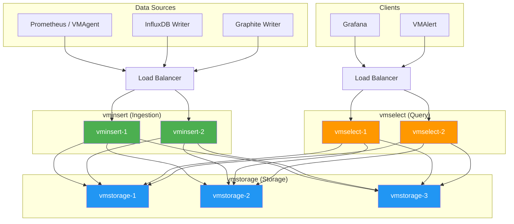

# 📈 VictoriaMetrics

> **High-performance, cost-effective time series database and monitoring solution.** VictoriaMetrics is a fast, scalable, and resource-efficient alternative to Prometheus for long-term metrics storage, offering superior compression, lower operational overhead, and a PromQL-compatible query language with powerful extensions.

---

## 📑 Table of Contents

- [What is VictoriaMetrics?](#-what-is-victoriametrics)
- [Architecture](#-architecture)
- [Data Ingestion](#-data-ingestion)
- [Querying: MetricsQL](#-querying-metricsql)
- [VMAgent](#-vmagent)
- [VMAlert](#-vmalert)
- [Storage](#-storage)
- [Configuration](#-configuration)
- [Monitoring VictoriaMetrics](#-monitoring-victoriametrics)
- [Production Deployment](#-production-deployment)
- [Comparison with Prometheus](#-comparison-with-prometheus)
- [Migration from Prometheus](#-migration-from-prometheus)
- [Troubleshooting](#-troubleshooting)
- [Related Topics](#-related-topics)

---

## 🧠 What is VictoriaMetrics?

VictoriaMetrics (VM) is an open-source time series database designed as a long-term remote storage for Prometheus and as a standalone monitoring solution. It was built to address Prometheus limitations around long-term storage, resource efficiency, and scalability.

**Key features:**

- **High compression** — Up to 70× compression ratio, significantly reducing disk usage
- **Fast ingestion** — Handles millions of samples per second
- **PromQL-compatible** — Supports PromQL plus MetricsQL extensions
- **Multi-protocol** — Ingests from Prometheus, InfluxDB, OpenTSDB, Graphite, Datadog
- **Simple operations** — Single binary deployment, minimal configuration
- **Two deployment modes** — Single-node and cluster

### Single-Node vs Cluster

| Feature | Single-Node | Cluster |
|---------|-------------|---------|
| Deployment | Single binary | vminsert + vmselect + vmstorage |
| Scalability | Vertical only | Horizontal |
| HA | No built-in | Replication support |
| Use case | Up to ~30M active time series | 30M+ active time series |
| Operational cost | Minimal | Medium |
| Best for | Most deployments | Very large scale |

> **Start with single-node.** It handles surprisingly large workloads (millions of metrics/sec). Only move to cluster when you genuinely need horizontal scaling or HA.

---

## 🏗 Architecture

### Single-Node

```text
┌───────────────────────────────────────────┐
│              VictoriaMetrics               │
│            (single binary)                 │
│                                            │
│  ┌──────────┐ ┌──────────┐ ┌───────────┐  │
│  │ Ingestion│ │  Query   │ │  Storage   │  │
│  │  Engine  │ │  Engine  │ │  Engine    │  │
│  └──────────┘ └──────────┘ └───────────┘  │
│       ↑            ↑                       │
│  /api/v1/write  /api/v1/query              │
└───────────────────────────────────────────┘
```

### Cluster Mode



**Component roles:**

| Component | Role | Stateful? | Scales |
|-----------|------|-----------|--------|
| **vminsert** | Accepts incoming data, shards across vmstorage | No | Horizontally |
| **vmselect** | Executes queries across all vmstorage nodes | No | Horizontally |
| **vmstorage** | Stores time series data on disk | Yes | Horizontally (add nodes) |

---

## 📥 Data Ingestion

VictoriaMetrics supports multiple ingestion protocols:

### Prometheus remote_write

```yaml
# prometheus.yml
remote_write:
  - url: http://victoriametrics:8428/api/v1/write
    queue_config:
      max_samples_per_send: 10000
      batch_send_deadline: 5s
      capacity: 10000
      max_shards: 30
```

### InfluxDB Line Protocol

```bash
# Write via InfluxDB protocol
curl -d 'cpu_usage,host=server1,region=us-east value=0.64 1609459200000000000' \
  http://victoriametrics:8428/write

# Bulk write
curl -d @metrics.txt http://victoriametrics:8428/write
```

### Graphite Protocol

```bash
# Write via Graphite plaintext protocol
echo "servers.web1.cpu.usage 42.5 $(date +%s)" | nc victoriametrics 2003
```

### DataDog Protocol

```bash
# Write via DataDog API
curl -X POST http://victoriametrics:8428/datadog/api/v1/series \
  -H "Content-Type: application/json" \
  -d '{
    "series": [{
      "metric": "cpu.usage",
      "points": [[1609459200, 42.5]],
      "host": "server1",
      "tags": ["region:us-east"]
    }]
  }'
```

### OpenTSDB Protocol

```bash
# HTTP API
curl -X POST http://victoriametrics:8428/opentsdb/api/put \
  -d '{"metric":"cpu.usage","timestamp":1609459200,"value":42.5,"tags":{"host":"server1"}}'
```

### JSON Import

```bash
# Import JSON lines
curl -d '{"metric":{"__name__":"cpu_usage","host":"server1"},"values":[0.64],"timestamps":[1609459200000]}' \
  http://victoriametrics:8428/api/v1/import
```

---

## 🔍 Querying: MetricsQL

MetricsQL is a PromQL-compatible query language with additional functions and improvements.

### PromQL Compatibility

All valid PromQL queries work in MetricsQL. VictoriaMetrics can be used as a drop-in Prometheus replacement for Grafana.

### MetricsQL Extensions

| Function | Description | Example |
|----------|-------------|---------|
| `range_first(q[d])` | First value in range | `range_first(temperature[1h])` |
| `range_last(q[d])` | Last value in range | `range_last(cpu_usage[1h])` |
| `running_sum(q)` | Cumulative sum | `running_sum(requests_total)` |
| `running_max(q)` | Running maximum | `running_max(response_time)` |
| `running_min(q)` | Running minimum | `running_min(available_memory)` |
| `running_avg(q)` | Running average | `running_avg(cpu_usage)` |
| `range_median(q[d])` | Median in range | `range_median(latency[1h])` |
| `range_quantile(φ, q[d])` | Quantile in range | `range_quantile(0.95, latency[1h])` |
| `range_stddev(q[d])` | StdDev in range | `range_stddev(cpu_usage[1h])` |
| `range_stdvar(q[d])` | Variance in range | `range_stdvar(cpu_usage[1h])` |
| `range_sum(q[d])` | Sum over range | `range_sum(errors_total[1h])` |
| `range_avg(q[d])` | Average over range | `range_avg(latency[1h])` |
| `range_min(q[d])` | Minimum in range | `range_min(free_disk[1d])` |
| `range_max(q[d])` | Maximum in range | `range_max(cpu_usage[1d])` |
| `range_linear_regression(q[d])` | Linear regression | `range_linear_regression(disk_used[7d])` |
| `count_eq_over_time(q[d], N)` | Count values equal to N | `count_eq_over_time(status[1h], 0)` |
| `count_ne_over_time(q[d], N)` | Count values not equal to N | `count_ne_over_time(status[1h], 0)` |
| `count_gt_over_time(q[d], N)` | Count values greater than N | `count_gt_over_time(latency[1h], 1)` |
| `count_le_over_time(q[d], N)` | Count values ≤ N | `count_le_over_time(error_rate[1h], 0.01)` |
| `share_gt_over_time(q[d], N)` | Share of values > N | `share_gt_over_time(latency[1h], 0.5)` |
| `share_le_over_time(q[d], N)` | Share of values ≤ N | `share_le_over_time(latency[1h], 0.1)` |
| `median_over_time(q[d])` | Median value | `median_over_time(latency[1h])` |
| `mad_over_time(q[d])` | Median absolute deviation | `mad_over_time(latency[1h])` |
| `lag(q[d])` | Time since last sample | `lag(up{job="api"}[5m])` |
| `lifetime(q[d])` | Lifetime of time series | `lifetime(up{job="api"}[1h])` |
| `scrape_interval(q[d])` | Estimated scrape interval | `scrape_interval(up{job="api"}[5m])` |
| `interpolate_linear(q)` | Fill gaps with linear interpolation | `interpolate_linear(temperature)` |
| `keep_last_value(q)` | Fill gaps with last value | `keep_last_value(sensor_reading)` |
| `keep_next_value(q)` | Fill gaps with next value | `keep_next_value(sensor_reading)` |
| `limit_offset(N, offset, q)` | Pagination | `limit_offset(10, 0, sort_desc(cpu_usage))` |
| `union(q1, q2, ...)` | Merge multiple queries | `union(cpu_usage, memory_usage)` |

### MetricsQL Improvements over PromQL

```promql
# Automatic rate() detection — no need to wrap counters in rate() in some contexts
# MetricsQL handles counter resets more gracefully

# default operator — replace NaN/missing values
rate(http_requests_total{status="500"}[5m]) / rate(http_requests_total[5m]) default 0

# if/ifnot operators
rate(http_requests_total[5m]) if up == 1

# Label filters with regex optimization
# MetricsQL optimizes regex matching for better performance

# Extended keep_metric_names
# Preserves metric names through mathematical operations
rate(http_requests_total[5m]) keep_metric_names
```

---

## 🤖 VMAgent

VMAgent is a lightweight agent for collecting metrics and forwarding them to VictoriaMetrics (or any Prometheus-compatible remote storage).

### Why VMAgent over Prometheus for Scraping?

- **Lower resource usage** — Uses significantly less CPU and memory
- **Scalable scraping** — Can horizontally shard scrape targets
- **Multiple remote write endpoints** — Send to multiple backends
- **Persistent queue** — Buffers data on disk during remote write failures
- **Drop-in replacement** — Uses same scrape configs as Prometheus

### VMAgent Configuration

```yaml
# vmagent scrape config (same format as prometheus.yml)
global:
  scrape_interval: 15s

scrape_configs:
  - job_name: "my-app"
    kubernetes_sd_configs:
      - role: pod
    relabel_configs:
      - source_labels: [__meta_kubernetes_pod_annotation_prometheus_io_scrape]
        action: keep
        regex: true
```

```bash
# Run VMAgent
vmagent \
  -promscrape.config=scrape.yml \
  -remoteWrite.url=http://victoriametrics:8428/api/v1/write \
  -remoteWrite.tmpDataPath=/tmp/vmagent-buffer \
  -remoteWrite.maxDiskUsagePerURL=1GB
```

### VMAgent Key Flags

| Flag | Description | Default |
|------|-------------|---------|
| `-promscrape.config` | Scrape configuration file | — |
| `-remoteWrite.url` | Remote write endpoint(s) | — |
| `-remoteWrite.tmpDataPath` | Buffer directory for failed writes | — |
| `-remoteWrite.maxDiskUsagePerURL` | Max disk buffer per endpoint | 0 (unlimited) |
| `-remoteWrite.queues` | Number of concurrent queues | 4 |
| `-remoteWrite.maxBlockSize` | Max uncompressed block size | 8MB |
| `-promscrape.maxScrapeSize` | Max scrape response size | 16MB |
| `-promscrape.cluster.membersCount` | Total VMAgent instances | 1 |
| `-promscrape.cluster.memberNum` | This instance's number (0-based) | 0 |

### Horizontal Sharding

```bash
# Instance 0 of 3
vmagent -promscrape.config=scrape.yml \
  -promscrape.cluster.membersCount=3 \
  -promscrape.cluster.memberNum=0 \
  -remoteWrite.url=http://vm:8428/api/v1/write

# Instance 1 of 3
vmagent -promscrape.config=scrape.yml \
  -promscrape.cluster.membersCount=3 \
  -promscrape.cluster.memberNum=1 \
  -remoteWrite.url=http://vm:8428/api/v1/write

# Instance 2 of 3
vmagent -promscrape.config=scrape.yml \
  -promscrape.cluster.membersCount=3 \
  -promscrape.cluster.memberNum=2 \
  -remoteWrite.url=http://vm:8428/api/v1/write
```

---

## 🚨 VMAlert

VMAlert evaluates alerting and recording rules against VictoriaMetrics and sends alerts to Alertmanager.

### Configuration

```bash
vmalert \
  -datasource.url=http://victoriametrics:8428 \
  -remoteRead.url=http://victoriametrics:8428 \
  -remoteWrite.url=http://victoriametrics:8428 \
  -notifier.url=http://alertmanager:9093 \
  -rule="rules/*.yml" \
  -evaluationInterval=15s
```

### Rule Format (Prometheus-compatible)

```yaml
# rules/alerting.yml
groups:
  - name: critical_alerts
    interval: 15s
    rules:
      - alert: HighErrorRate
        expr: |
          sum(rate(http_requests_total{status=~"5.."}[5m]))
          /
          sum(rate(http_requests_total[5m])) > 0.05
        for: 5m
        labels:
          severity: critical
        annotations:
          summary: "High error rate: {{ $value | printf \"%.2f\" }}"

  - name: recording_rules
    rules:
      - record: job:http_requests:rate5m
        expr: sum by (job) (rate(http_requests_total[5m]))
```

### VMAlert Key Flags

| Flag | Description |
|------|-------------|
| `-datasource.url` | VictoriaMetrics URL for rule evaluation |
| `-remoteRead.url` | URL for restoring alert state on restart |
| `-remoteWrite.url` | URL for writing recording rule results |
| `-notifier.url` | Alertmanager URL(s) |
| `-rule` | Path to rule files (glob supported) |
| `-evaluationInterval` | How often to evaluate rules |
| `-external.url` | External URL for alert links |

---

## 💾 Storage

### Compression

VictoriaMetrics achieves excellent compression through:

- **Delta-of-delta encoding** for timestamps
- **Gorilla-style XOR encoding** for values
- **ZSTD compression** on top

Typical compression: **0.5–1.5 bytes per sample** (vs Prometheus ~1.5–2 bytes).

### Retention

```bash
# Set retention period
victoriametrics -retentionPeriod=6months

# Supported units: h (hours), d (days), w (weeks), y (years)
# Default: 1 month
```

### Deduplication

```bash
# Deduplicate samples within 30-second windows
# Useful when multiple Prometheus instances scrape the same targets
victoriametrics -dedup.minScrapeInterval=30s
```

### Data Migration

```bash
# Export data
curl 'http://source-vm:8428/api/v1/export?match={job="my-app"}&start=2024-01-01&end=2024-02-01' > data.jsonl

# Import data
curl -d @data.jsonl http://target-vm:8428/api/v1/import

# Streaming export/import (for large datasets)
curl -s 'http://source:8428/api/v1/export?match={__name__!=""}' | \
  curl -d @- http://target:8428/api/v1/import

# Native format (faster, smaller)
curl 'http://source:8428/api/v1/export/native?match={job="api"}' > data.bin
curl -X POST http://target:8428/api/v1/import/native -T data.bin
```

### Downsampling

VictoriaMetrics Enterprise supports automatic downsampling:

```bash
# Downsample data older than 30 days to 5-minute resolution
# and data older than 180 days to 1-hour resolution
victoriametrics \
  -downsampling.period=30d:5m,180d:1h
```

---

## ⚙️ Configuration

### Single-Node Key Flags

```bash
victoriametrics \
  -retentionPeriod=3months \
  -storageDataPath=/var/lib/victoriametrics \
  -httpListenAddr=:8428 \
  -maxLabelsPerTimeseries=30 \
  -search.maxUniqueTimeseries=300000 \
  -search.maxSamplesPerQuery=1000000000 \
  -search.maxPointsPerTimeseries=86400 \
  -search.latencyOffset=30s \
  -search.maxQueryDuration=60s \
  -memory.allowedPercent=80 \
  -dedup.minScrapeInterval=15s
```

### Cluster Mode Flags

```bash
# vmstorage
vmstorage \
  -storageDataPath=/var/lib/vmstorage \
  -retentionPeriod=3months \
  -vminsertAddr=:8400 \
  -vmselectAddr=:8401 \
  -httpListenAddr=:8482

# vminsert
vminsert \
  -storageNode=vmstorage-1:8400,vmstorage-2:8400,vmstorage-3:8400 \
  -httpListenAddr=:8480 \
  -replicationFactor=2

# vmselect
vmselect \
  -storageNode=vmstorage-1:8401,vmstorage-2:8401,vmstorage-3:8401 \
  -httpListenAddr=:8481 \
  -dedup.minScrapeInterval=15s \
  -search.maxQueryDuration=60s
```

### Resource Allocation

| Component | Memory Rule | CPU Rule |
|-----------|------------|----------|
| Single-node | ~1GB per 10M active series | 1 core per 500K inserts/sec |
| vmstorage | ~1GB per 10M active series | Disk I/O bound |
| vminsert | Minimal (~200MB base) | 1 core per 500K inserts/sec |
| vmselect | Depends on query complexity | CPU-bound for complex queries |

---

## 📊 Monitoring VictoriaMetrics

### Key Metrics to Watch

```promql
# Ingestion rate (rows/sec)
rate(vm_rows_inserted_total[5m])

# Active time series
vm_cache_entries{type="storage/metricName"}

# Query duration
histogram_quantile(0.99, sum by (le) (rate(vm_request_duration_seconds_bucket[5m])))

# Disk usage
vm_data_size_bytes{type="storage/big"}
vm_data_size_bytes{type="storage/small"}

# Merge lag (compaction backlog)
vm_parts{type="storage/big"}

# Memory usage
process_resident_memory_bytes

# Slow inserts (should be 0)
rate(vm_slow_row_inserts_total[5m])

# Rejected rows (should be 0)
rate(vm_rows_ignored_total[5m])

# Remote write receive rate
rate(vm_promscrape_scraped_samples_total[5m])  # VMAgent
```

### Health Check

```bash
# Health endpoint
curl http://victoriametrics:8428/health

# Detailed flags
curl http://victoriametrics:8428/flags

# Active queries
curl http://victoriametrics:8428/api/v1/status/active_queries

# TSDB status
curl http://victoriametrics:8428/api/v1/status/tsdb

# Top queries (by duration and frequency)
curl http://victoriametrics:8428/api/v1/status/top_queries
```

---

## 🏭 Production Deployment

### Sizing Guidelines

| Scale | Active Series | Ingest Rate | vmstorage RAM | vmstorage Disk |
|-------|--------------|-------------|---------------|----------------|
| Small | <1M | <100K/sec | 2-4 GB | 50 GB |
| Medium | 1-10M | 100K-1M/sec | 8-16 GB | 200 GB-1 TB |
| Large | 10-50M | 1-5M/sec | 32-64 GB | 1-5 TB |
| Very Large | 50M+ | 5M+/sec | 128+ GB | 5+ TB |

### High Availability (Cluster Mode)

```text
                    ┌─────────┐ ┌─────────┐
                    │vminsert-1│ │vminsert-2│
                    └────┬─────┘ └────┬─────┘
                         │            │
         ┌───────────────┼────────────┼───────────────┐
         │               │            │               │
    ┌────┴────┐    ┌────┴────┐  ┌───┴─────┐    ┌────┴────┐
    │storage-1│    │storage-2│  │storage-3│    │storage-4│
    └────┬────┘    └────┬────┘  └───┬─────┘    └────┬────┘
         │               │          │               │
         └───────────────┼──────────┼───────────────┘
                         │          │
                    ┌────┴────┐ ┌──┴──────┐
                    │vmselect-1│ │vmselect-2│
                    └──────────┘ └──────────┘
```

Set replication factor for data redundancy:

```bash
vminsert -replicationFactor=2 -storageNode=s1:8400,s2:8400,s3:8400,s4:8400
vmselect -dedup.minScrapeInterval=15s -storageNode=s1:8401,s2:8401,s3:8401,s4:8401
```

### Backup and Restore

```bash
# Create snapshot
curl http://victoriametrics:8428/snapshot/create
# Returns: {"status":"ok","snapshot":"20240115120000-abc123def456"}

# Backup snapshot to S3
vmbackup \
  -storageDataPath=/var/lib/victoriametrics \
  -snapshot.createURL=http://victoriametrics:8428/snapshot/create \
  -dst=s3://my-bucket/vm-backups/

# Restore from backup
vmrestore \
  -src=s3://my-bucket/vm-backups/latest/ \
  -storageDataPath=/var/lib/victoriametrics

# Incremental backups (only new data since last backup)
vmbackup \
  -storageDataPath=/var/lib/victoriametrics \
  -snapshot.createURL=http://victoriametrics:8428/snapshot/create \
  -dst=s3://my-bucket/vm-backups/ \
  -origin=s3://my-bucket/vm-backups/previous/

# List snapshots
curl http://victoriametrics:8428/snapshot/list

# Delete snapshot
curl http://victoriametrics:8428/snapshot/delete?snapshot=20240115120000-abc123def456
```

---

## ⚖️ Comparison with Prometheus

| Feature | Prometheus | VictoriaMetrics |
|---------|-----------|-----------------|
| **Query Language** | PromQL | MetricsQL (PromQL superset) |
| **Storage** | Local TSDB | Custom storage engine |
| **Compression** | ~1.5-2 bytes/sample | ~0.5-1.5 bytes/sample |
| **Long-term Retention** | Limited (15d default) | Months/years natively |
| **Multi-protocol Ingestion** | Prometheus only | Prometheus, InfluxDB, Graphite, OpenTSDB, DataDog |
| **HA** | Run 2 instances | Cluster mode with replication |
| **Global View** | Federation / Thanos | Cluster mode |
| **Scraping** | Built-in | Via VMAgent (recommended) |
| **Alerting** | Alertmanager | VMAlert + Alertmanager |
| **Community** | Massive, CNCF graduated | Growing, strong |
| **Memory Usage** | Higher | Lower (for same workload) |
| **Disk Usage** | Higher | Significantly lower |
| **Remote Write/Read** | Yes | Yes (also ingestion endpoint) |
| **Downsampling** | No | Enterprise only |
| **Multi-tenancy** | No | Yes |

### When to Choose VictoriaMetrics

- Need long-term metrics retention (months/years)
- High cardinality workloads
- Multiple data source protocols
- Cost-sensitive (lower resource requirements)
- Already using Prometheus and need better storage

### When to Stay with Prometheus

- Simple setups with short retention
- Maximum community support and ecosystem
- Need built-in scraping and alerting in one binary
- Organizational preference for CNCF-graduated projects

---

## 🔄 Migration from Prometheus

### Step 1: Add Remote Write

```yaml
# prometheus.yml — Add remote_write to existing Prometheus
remote_write:
  - url: http://victoriametrics:8428/api/v1/write
```

### Step 2: Configure Grafana

```text
# Add VictoriaMetrics as a Prometheus data source in Grafana
URL: http://victoriametrics:8428
Type: Prometheus
```

### Step 3: Backfill Historical Data

```bash
# Export from Prometheus
curl -s 'http://prometheus:9090/api/v1/export?match={__name__!=""}' > export.jsonl

# Import to VictoriaMetrics
curl -d @export.jsonl http://victoriametrics:8428/api/v1/import

# Or use vmctl for migration
vmctl prometheus \
  --prom-snapshot=/path/to/prometheus/data \
  --vm-addr=http://victoriametrics:8428
```

### Step 4: Replace Prometheus Scraping with VMAgent

```bash
# VMAgent uses the same scrape config format
vmagent \
  -promscrape.config=prometheus.yml \
  -remoteWrite.url=http://victoriametrics:8428/api/v1/write
```

### Step 5: Migrate Alert Rules to VMAlert

```bash
# VMAlert uses the same rule format
vmalert \
  -datasource.url=http://victoriametrics:8428 \
  -notifier.url=http://alertmanager:9093 \
  -rule="rules/*.yml"
```

---

## 🐛 Troubleshooting

### Ingestion Issues

```bash
# Check for rejected rows
curl http://victoriametrics:8428/metrics | grep vm_rows_ignored

# Check for slow inserts
curl http://victoriametrics:8428/metrics | grep vm_slow_row_inserts

# Check active ingestion rate
curl 'http://victoriametrics:8428/api/v1/query?query=rate(vm_rows_inserted_total[5m])'

# Common causes of ingestion failure:
# 1. Disk full → add disk space, reduce retention
# 2. Too many active time series → increase -memory.allowedPercent
# 3. Network issues → check VMAgent buffer: -remoteWrite.tmpDataPath
# 4. Label limits exceeded → increase -maxLabelsPerTimeseries
```

### Query Timeout

```bash
# Check slow queries
curl http://victoriametrics:8428/api/v1/status/top_queries

# Increase query timeout
victoriametrics -search.maxQueryDuration=120s

# Limit query results
victoriametrics -search.maxUniqueTimeseries=500000

# Use recording rules for expensive queries
# Check if query touches too many time series
count({__name__=~"my_metric.*"})
```

### Disk Space

```bash
# Check disk usage
du -sh /var/lib/victoriametrics/data/

# Check via metrics
curl 'http://victoriametrics:8428/api/v1/query?query=vm_data_size_bytes'

# Force merge (compaction) — use carefully
curl http://victoriametrics:8428/internal/force_merge

# Reduce retention
victoriametrics -retentionPeriod=1month

# Delete specific time series
curl -d 'match[]={job="old-app"}' http://victoriametrics:8428/api/v1/admin/tsdb/delete_series
```

### Memory Issues

```bash
# Check memory usage
curl 'http://victoriametrics:8428/api/v1/query?query=process_resident_memory_bytes'

# Check cache sizes
curl http://victoriametrics:8428/metrics | grep vm_cache

# Reduce memory usage:
# 1. Lower -memory.allowedPercent (default 60)
# 2. Reduce -search.maxUniqueTimeseries
# 3. Enable deduplication: -dedup.minScrapeInterval=15s
# 4. Reduce active time series (drop unnecessary metrics at VMAgent level)
```

---

## 🔗 Related Topics

- [🔥 Prometheus](../prometheus/) — Prometheus architecture and configuration
- [📐 PromQL](../promql/) — Query language (compatible with MetricsQL)
- [📊 Grafana](../grafana/) — Visualization and dashboards
- [📊 Observability Overview](../) — Three pillars and tool comparison

---

> **VictoriaMetrics is the practical choice for long-term metrics storage.** It handles Prometheus-scale workloads at a fraction of the resource cost, supports the same query language, and integrates seamlessly with existing Prometheus + Grafana stacks. Start with single-node, add VMAgent for scraping, and grow to cluster mode only when needed.
