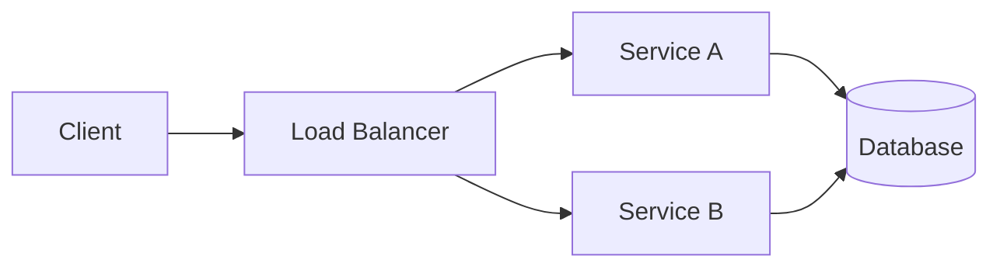

# 🛠️ Developer Tools

> **Essential tools for productive development — from editors to terminal utilities to Kubernetes dashboards.**

---

## 📋 Table of Contents

- [IDE & Editors](#ide--editors)
- [Terminal Tools](#terminal-tools)
- [API Testing](#api-testing)
- [Database Tools](#database-tools)
- [Container & Kubernetes](#container--kubernetes)
- [Monitoring & Observability](#monitoring--observability)
- [Diagramming](#diagramming)
- [Productivity](#productivity)

---

## IDE & Editors

### VS Code

| | |
|---|---|
| **What** | Free, extensible code editor by Microsoft |
| **Why** | Huge extension ecosystem, integrated terminal, Git, debugger, and remote development |
| **Install** | `snap install code --classic` or [code.visualstudio.com](https://code.visualstudio.com) |

**Essential extensions:**
- GitLens — enhanced Git blame/history
- Docker — container management
- Kubernetes — cluster explorer
- Remote SSH — edit files on remote machines
- Pylance / Go / ESLint — language support
- REST Client — send HTTP requests from editor

### IntelliJ IDEA

| | |
|---|---|
| **What** | Full-featured IDE by JetBrains |
| **Why** | Best-in-class Java/Kotlin support, powerful refactoring, database tools built in |
| **Install** | [jetbrains.com/idea](https://www.jetbrains.com/idea/) or Toolbox App |

Community edition is free. Ultimate adds database tools, Spring support, and web frameworks. GoLand and PyCharm are language-specific variants.

### Vim / Neovim

| | |
|---|---|
| **What** | Terminal-based text editor with modal editing |
| **Why** | Available everywhere, incredibly fast for text manipulation, highly customizable |
| **Install** | `sudo apt install neovim` / `brew install neovim` |

**Getting started:** Run `vimtutor` for an interactive tutorial. Modern Neovim with Lua config and LSP is a full IDE experience.

**Popular distributions:** LazyVim, AstroNvim, NvChad — pre-configured Neovim setups.

---

## Terminal Tools

### tmux — Terminal Multiplexer

| | |
|---|---|
| **What** | Terminal multiplexer: split panes, multiple windows, persistent sessions |
| **Why** | SSH sessions survive disconnects, multiple panes for parallel work |
| **Install** | `sudo apt install tmux` / `brew install tmux` |

```bash
tmux new -s dev          # New session named "dev"
# Ctrl+b %              # Split vertical
# Ctrl+b "              # Split horizontal
# Ctrl+b d              # Detach
tmux attach -t dev       # Reattach
```

### Oh My Zsh — Zsh Framework

| | |
|---|---|
| **What** | Framework for managing Zsh configuration with themes and plugins |
| **Why** | Better autocompletion, syntax highlighting, Git integration, hundreds of plugins |
| **Install** | `sh -c "$(curl -fsSL https://raw.github.com/ohmyzsh/ohmyzsh/master/tools/install.sh)"` |

**Essential plugins:** `git`, `docker`, `kubectl`, `zsh-autosuggestions`, `zsh-syntax-highlighting`

### Starship — Cross-Shell Prompt

| | |
|---|---|
| **What** | Fast, customizable shell prompt showing Git, language versions, Kubernetes context |
| **Why** | Works with any shell (bash, zsh, fish), fast (Rust-based), informative without being cluttered |
| **Install** | `curl -sS https://starship.rs/install.sh \| sh` |

### fzf — Fuzzy Finder

| | |
|---|---|
| **What** | Command-line fuzzy finder for files, history, processes |
| **Why** | Search anything instantly: Ctrl+R for history, Ctrl+T for files, Alt+C for directories |
| **Install** | `sudo apt install fzf` / `brew install fzf` |

```bash
# Search command history
Ctrl+R               # Fuzzy search history

# Find files
Ctrl+T               # Fuzzy find files in current dir

# Search and preview
fzf --preview 'cat {}'
```

### ripgrep (rg) — Fast Search

| | |
|---|---|
| **What** | Extremely fast text search (like grep but faster), respects .gitignore |
| **Why** | 5-10x faster than grep, smart defaults, respects .gitignore automatically |
| **Install** | `sudo apt install ripgrep` / `brew install ripgrep` |

```bash
rg "TODO"                    # Search for "TODO" recursively
rg -i "error" --type py      # Case-insensitive, Python files only
rg -l "deprecated"           # List files containing match
```

→ Related: [CLI / grep](../cli/grep/)

### bat — Better cat

| | |
|---|---|
| **What** | `cat` with syntax highlighting, line numbers, and Git integration |
| **Why** | Instantly see file contents with context, syntax colored |
| **Install** | `sudo apt install bat` / `brew install bat` |

```bash
bat README.md                # Syntax highlighted output
bat -l yaml config.yml       # Force language
bat --diff file.py           # Show Git changes
```

### eza — Better ls

| | |
|---|---|
| **What** | Modern replacement for `ls` with colors, icons, Git status, tree view |
| **Why** | Better visual output, Git integration, tree view built-in |
| **Install** | `cargo install eza` / `brew install eza` |

```bash
eza -la                      # Long list with hidden files
eza --tree --level=2         # Tree view
eza -la --git                # Show Git status
```

### jq — JSON Processor

| | |
|---|---|
| **What** | Command-line JSON parser and transformer |
| **Why** | Essential for working with JSON APIs, logs, and configuration |
| **Install** | `sudo apt install jq` / `brew install jq` |

→ Related: [CLI / jq](../cli/jq/)

### yq — YAML Processor

| | |
|---|---|
| **What** | jq for YAML files — parse, query, and modify YAML |
| **Why** | Essential for Kubernetes manifests, Helm values, CI config |
| **Install** | `snap install yq` / `brew install yq` |

---

## API Testing

### curl — HTTP Client

| | |
|---|---|
| **What** | Command-line HTTP client, supports all protocols |
| **Why** | Universal, scriptable, available everywhere |
| **Install** | Pre-installed on most systems |

→ Related: [CLI / curl](../cli/curl/)

### HTTPie — Human-Friendly HTTP Client

| | |
|---|---|
| **What** | Modern HTTP client with colored output, JSON support, and intuitive syntax |
| **Why** | Much friendlier than curl for interactive API exploration |
| **Install** | `pip install httpie` / `brew install httpie` |

```bash
http GET api.example.com/users         # GET request
http POST api.example.com/users name=Alice email=alice@example.com  # POST JSON
http -a user:pass GET api.example.com/admin  # Basic auth
```

### Postman

| | |
|---|---|
| **What** | GUI-based API development and testing platform |
| **Why** | Collections, environments, automated tests, team collaboration |
| **Install** | [postman.com](https://www.postman.com/downloads/) |

Best for: Teams that need shared API collections, environment management, and test automation.

### Insomnia

| | |
|---|---|
| **What** | Open-source API client with REST, GraphQL, and gRPC support |
| **Why** | Lightweight alternative to Postman, good GraphQL support |
| **Install** | [insomnia.rest](https://insomnia.rest/) |

---

## Database Tools

### DBeaver — Universal Database Client

| | |
|---|---|
| **What** | Free, universal database GUI supporting 80+ databases |
| **Why** | Works with PostgreSQL, MySQL, MongoDB, Redis, and many more. ER diagrams, data export, SQL editor. |
| **Install** | `snap install dbeaver-ce` / [dbeaver.io](https://dbeaver.io/) |

### pgcli — PostgreSQL CLI

| | |
|---|---|
| **What** | PostgreSQL CLI with auto-completion and syntax highlighting |
| **Why** | Much better than plain `psql` — autocompletes tables, columns, and SQL keywords |
| **Install** | `pip install pgcli` / `brew install pgcli` |

```bash
pgcli -h localhost -U postgres -d mydb
# Auto-completes table names, column names, and SQL keywords
```

### Redis Commander / RedisInsight

| | |
|---|---|
| **What** | Web-based Redis management tools |
| **Why** | Browse keys, view data structures, monitor commands |
| **Install** | `npm install -g redis-commander` / [redis.com/redis-enterprise/redis-insight](https://redis.com/redis-enterprise/redis-insight/) |

### mongosh — MongoDB Shell

| | |
|---|---|
| **What** | Modern MongoDB shell with syntax highlighting and autocomplete |
| **Why** | Replaces the legacy `mongo` shell with better UX |
| **Install** | `brew install mongosh` / [mongodb.com/docs/mongodb-shell](https://www.mongodb.com/docs/mongodb-shell/) |

---

## Container & Kubernetes

### k9s — Kubernetes TUI

| | |
|---|---|
| **What** | Terminal-based Kubernetes dashboard |
| **Why** | Navigate clusters, view logs, exec into pods, monitor resources — all from terminal |
| **Install** | `brew install derailed/k9s/k9s` / `snap install k9s` |

```bash
k9s                          # Launch
# :pods                      # View pods
# :deploy                    # View deployments
# :svc                       # View services
# /pattern                   # Filter
# l                          # View logs
# s                          # Shell into pod
# Ctrl+d                     # Delete resource
```

→ Related: [CLI / kubectl](../cli/kubectl/)

### Lens — Kubernetes IDE

| | |
|---|---|
| **What** | Desktop application for Kubernetes cluster management |
| **Why** | GUI for cluster exploration, log viewing, resource editing. Good for teams less comfortable with CLI. |
| **Install** | [k8slens.dev](https://k8slens.dev/) |

### kubectx / kubens — Context & Namespace Switching

| | |
|---|---|
| **What** | Fast switching between Kubernetes contexts and namespaces |
| **Why** | Much faster than `kubectl config use-context` and `kubectl config set-context` |
| **Install** | `brew install kubectx` / from [GitHub](https://github.com/ahmetb/kubectx) |

```bash
kubectx                      # List contexts
kubectx production           # Switch to production
kubens                       # List namespaces
kubens kube-system           # Switch to kube-system
```

### stern — Multi-Pod Log Tailing

| | |
|---|---|
| **What** | Tail logs from multiple pods and containers simultaneously |
| **Why** | Color-coded output from multiple pods, regex filtering — much better than kubectl logs |
| **Install** | `brew install stern` / from [GitHub](https://github.com/stern/stern) |

```bash
stern "order-service"        # All pods matching pattern
stern -n production ".*"     # All pods in namespace
stern order-service -s 5m    # Last 5 minutes
```

### Docker Compose

| | |
|---|---|
| **What** | Multi-container application orchestration |
| **Why** | Define and run multi-container setups for local development |
| **Install** | Included with Docker Desktop, or `sudo apt install docker-compose-plugin` |

→ Related: [DevOps / Docker](../devops/docker/)

---

## Monitoring & Observability

### Grafana

| | |
|---|---|
| **What** | Open-source metrics visualization and dashboarding platform |
| **Why** | Beautiful dashboards, supports Prometheus, Loki, Elasticsearch, and 50+ data sources |
| **Install** | `docker run -d -p 3000:3000 grafana/grafana` |

→ Related: [Observability / Grafana](../observability/grafana/)

### Prometheus

| | |
|---|---|
| **What** | Open-source monitoring and alerting toolkit |
| **Why** | Pull-based metrics collection, powerful PromQL query language, industry standard |
| **Install** | `docker run -d -p 9090:9090 prom/prometheus` |

→ Related: [Observability / Prometheus](../observability/prometheus/)

### lazydocker — Docker TUI

| | |
|---|---|
| **What** | Terminal UI for Docker — containers, images, volumes, logs |
| **Why** | View all Docker resources at a glance without remembering commands |
| **Install** | `brew install lazydocker` / `go install github.com/jesseduffield/lazydocker@latest` |

---

## Diagramming

### Mermaid — Diagrams as Code

| | |
|---|---|
| **What** | Text-based diagramming (flowcharts, sequence diagrams, ER diagrams) |
| **Why** | Lives in Markdown, version-controlled, renders in GitHub/GitLab |
| **Install** | Built into GitHub Markdown, or use [mermaid.live](https://mermaid.live/) |



### draw.io (diagrams.net)

| | |
|---|---|
| **What** | Free web-based diagramming tool |
| **Why** | Rich library of shapes (AWS, GCP, Azure, Kubernetes), exports to PNG/SVG/PDF |
| **Install** | [app.diagrams.net](https://app.diagrams.net/) or VS Code extension |

### Excalidraw

| | |
|---|---|
| **What** | Hand-drawn style whiteboard tool |
| **Why** | Perfect for informal architecture discussions, brainstorming, design reviews |
| **Install** | [excalidraw.com](https://excalidraw.com/) (web) or VS Code extension |

---

## Productivity

### lazygit — Git TUI

| | |
|---|---|
| **What** | Terminal UI for Git operations |
| **Why** | Visual staging, interactive rebasing, branch management — all without remembering commands |
| **Install** | `brew install lazygit` / `go install github.com/jesseduffield/lazygit@latest` |

### tldr — Simplified Man Pages

| | |
|---|---|
| **What** | Community-maintained, simplified command examples |
| **Why** | Practical examples instead of verbose man pages |
| **Install** | `npm install -g tldr` / `pip install tldr` / `brew install tldr` |

```bash
tldr tar                     # Practical tar examples
tldr kubectl                 # Practical kubectl examples
```

### direnv — Directory-Based Environment

| | |
|---|---|
| **What** | Load/unload environment variables based on current directory |
| **Why** | Automatic environment switching per project (AWS profiles, DB connections, API keys) |
| **Install** | `sudo apt install direnv` / `brew install direnv` |

```bash
# Create .envrc in project root
echo 'export DATABASE_URL="postgresql://localhost/mydb"' > .envrc
direnv allow                 # Approve the .envrc
# Variables are set when you cd into the directory
```

---

## 🔗 Related Topics

- [📖 Recommended Books](books.md) — Reading list
- [🧰 CLI](../cli/) — Command-line tool references
- [🎯 Learning Paths](../learning/) — Structured learning paths
- [📊 Observability](../observability/) — Monitoring stack details

---

> **Tool tip:** Don't install everything at once. Start with the tools for your current workflow bottleneck. Master one tool before adding the next. A few well-known tools beat a dozen half-learned ones.
