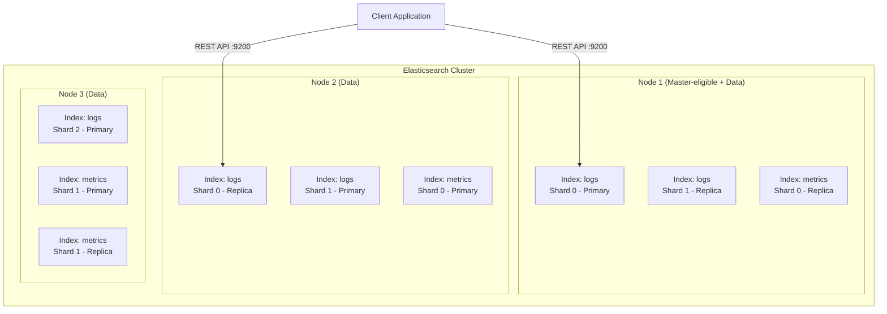

# 🔎 Elasticsearch

> **Elasticsearch is a distributed, RESTful search and analytics engine.** Built on Apache Lucene, it enables full-text search, structured search, analytics, and logging at scale. It stores data as JSON documents and provides near-real-time search capabilities across massive datasets.

---

## 📑 Table of Contents

- [What is Elasticsearch?](#-what-is-elasticsearch)
- [Architecture](#-architecture)
- [Data Model](#-data-model)
- [Mapping](#-mapping)
- [Document API — Single Document](#-document-api--single-document)
- [Document API — Multi Document](#-document-api--multi-document)
- [Search API & Query DSL](#-search-api--query-dsl)
- [CAT API](#-cat-api)
- [Cluster Management](#-cluster-management)
- [Index Management](#-index-management)
- [Administration](#-administration)
- [Practical Examples](#-practical-examples)
- [Performance](#-performance)
- [Benchmarking (ES Rally)](#-benchmarking-es-rally)
- [Troubleshooting](#-troubleshooting)
- [Production Tips](#-production-tips)
- [Related Topics](#-related-topics)

---

## 🧠 What is Elasticsearch?

Elasticsearch runs on port **9200** (HTTP API) and **9300** (transport/inter-node). Data is saved as JSON documents, making it schemaless by default but with the ability to define explicit mappings.

**Key characteristics:**

- **Distributed** — Data is sharded and replicated across nodes automatically
- **Near real-time** — Documents are searchable within ~1 second of indexing
- **RESTful** — All operations via HTTP/JSON API
- **Schema-free** — Dynamic mapping auto-detects field types
- **Scalable** — Horizontal scaling by adding nodes
- **Full-text search** — Powered by Apache Lucene's inverted index

**Common use cases:**

| Use Case | Description |
|----------|-------------|
| Full-text search | Product search, document search, website search |
| Log analytics | Centralized logging (ELK/EFK stack) |
| Metrics & monitoring | Infrastructure and application metrics |
| Security analytics | SIEM, threat detection |
| Business analytics | Real-time dashboards and aggregations |

---

## 🏗 Architecture



### Key Components

| Component | Description |
|-----------|-------------|
| **Cluster** | Collection of one or more nodes that together holds the entire data and provides federated indexing and search capabilities |
| **Node** | A single server in the cluster, identified by a UUID (Universal Unique Identifier) |
| **Index** | A collection of documents with similar characteristics (like a database in RDBMS) |
| **Shard** | A subdivision of an index; data is distributed across shards for horizontal scaling |
| **Replica** | A copy of a shard for fault tolerance; if a shard fails, its replica takes over |

### Node Roles

| Role | Description | Typical Deployment |
|------|-------------|-------------------|
| **Master** | Cluster state management, index creation/deletion | 3 dedicated master nodes |
| **Data** | Stores data and executes queries | Scale based on data volume |
| **Ingest** | Pre-processes documents before indexing | 2+ for pipeline-heavy workloads |
| **Coordinating** | Routes requests, aggregates results | For heavy search workloads |
| **ML** | Machine learning jobs | If using ML features |

---

## 📊 Data Model

### RDBMS vs Elasticsearch Comparison

| RDBMS | Elasticsearch | Description |
|-------|--------------|-------------|
| Database | **Index** | Container for related documents |
| Table | **Type** (deprecated in 7.x+) | Category within an index |
| Row / Record | **Document** | A single JSON data entry |
| Column | **Field** | A key-value pair within a document |
| Schema | **Mapping** | Definition of how fields are stored and indexed |

> **Note:** Types were deprecated in Elasticsearch 7.x and removed in 8.x. Each index now contains a single mapping type (`_doc`).

### Document Structure

```json
{
  "_index": "employee-details",
  "_type": "_doc",
  "_id": "106",
  "_source": {
    "EmpUserId": 106,
    "EmpName": "Jane Smith",
    "Age": 25,
    "Gender": "female",
    "Department": "Engineering",
    "Address": [
      {
        "AddressID": 111,
        "AddressNumber": 198
      }
    ]
  }
}
```

---

## 📐 Mapping

Mapping defines how a document and its fields are stored and indexed.

```bash
# View mapping of an index
curl -X GET "localhost:9200/employee-details/_mapping?pretty"

# Create index with explicit mapping
curl -X PUT "localhost:9200/employee-details" -H 'Content-Type: application/json' -d '
{
  "mappings": {
    "properties": {
      "EmpUserId":  { "type": "integer" },
      "EmpName":    { "type": "text", "fields": { "keyword": { "type": "keyword" } } },
      "Age":        { "type": "integer" },
      "Gender":     { "type": "keyword" },
      "Department": { "type": "keyword" },
      "Address":    { "type": "nested",
        "properties": {
          "AddressID":     { "type": "integer" },
          "AddressNumber": { "type": "integer" }
        }
      }
    }
  }
}'
```

### Common Field Types

| Type | Description | Use Case |
|------|-------------|----------|
| `text` | Analyzed full-text | Search fields (descriptions, names) |
| `keyword` | Exact value, not analyzed | Filtering, sorting, aggregations |
| `integer` / `long` | Numeric | Counts, IDs |
| `float` / `double` | Decimal | Prices, scores |
| `date` | Date/time | Timestamps |
| `boolean` | True/false | Flags |
| `nested` | Nested JSON objects | Arrays of objects with relationships |
| `geo_point` | Latitude/longitude | Location data |

---

## 📝 Document API — Single Document

### Index API (Create/Update Document)

The Index API adds or updates a JSON document in a specific index, making it searchable.

```bash
# Index a document with explicit ID
curl -X POST "localhost:9200/employee-details/_doc/106" -H 'Content-Type: application/json' -d '
{
  "EmpUserId": 106,
  "EmpName": "Jane Smith",
  "Age": 25,
  "Gender": "female",
  "Address": [{"AddressID": 111, "AddressNumber": 198}]
}'

# Index a document with auto-generated ID
curl -X POST "localhost:9200/employee-details/_doc" -H 'Content-Type: application/json' -d '
{
  "EmpUserId": 107,
  "EmpName": "John Doe",
  "Age": 30,
  "Gender": "male"
}'

# Create only (fail if document already exists)
curl -X PUT "localhost:9200/employee-details/_create/106" -H 'Content-Type: application/json' -d '
{
  "EmpUserId": 106,
  "EmpName": "Jane Smith"
}'
```

### GET API (Retrieve Document)

```bash
# Get all documents in an index
curl -X GET "localhost:9200/employee-details/_search?pretty"

# Get with custom result size (default is 10)
curl -X GET "localhost:9200/employee-details/_search?size=1000&pretty"

# Get a specific document by ID
curl -X GET "localhost:9200/employee-details/_doc/106?pretty"

# Get document count
curl -X GET "localhost:9200/employee-details/_count?pretty"

# Get index mapping (structure/schema)
curl -X GET "localhost:9200/employee-details/_mapping?pretty"

# Get with scroll (for large result sets)
curl -X GET "localhost:9200/employee-details/_search?scroll=10m&size=50&pretty"
```

### UPDATE API (Modify Document)

```bash
# Partial update using doc (simplest method)
curl -X POST "localhost:9200/employee-details/_update/106" -H 'Content-Type: application/json' -d '
{
  "doc": {
    "EmpName": "Jane D. Smith"
  }
}'

# Update using script (Painless scripting language)
curl -X POST "localhost:9200/employee-details/_update/106" -H 'Content-Type: application/json' -d '
{
  "script": {
    "source": "ctx._source.Age = params.val",
    "lang": "painless",
    "params": {
      "val": 26
    }
  }
}'

# Full document replacement using script
curl -X POST "localhost:9200/employee-details/_update/106" -H 'Content-Type: application/json' -d '
{
  "script": {
    "source": "ctx._source = params.val",
    "lang": "painless",
    "params": {
      "val": {
        "EmpUserId": 106,
        "EmpName": "Jane D. Smith",
        "Age": 26,
        "Gender": "female"
      }
    }
  }
}'

# Add to nested array
curl -X POST "localhost:9200/employee-details/_update/106" -H 'Content-Type: application/json' -d '
{
  "script": {
    "source": "ctx._source.Address.add(params.tag)",
    "lang": "painless",
    "params": {
      "tag": {
        "AddressID": 144,
        "AddressNumber": 458
      }
    }
  }
}'
```

### DELETE API (Remove Document)

```bash
# Delete a specific document by ID
curl -X DELETE "localhost:9200/employee-details/_doc/106?pretty"
```

---

## 📦 Document API — Multi Document

### Multi-GET API

Retrieve multiple documents by ID in a single request.

```bash
curl -X GET "localhost:9200/_mget?pretty" -H 'Content-Type: application/json' -d '
{
  "docs": [
    {
      "_index": "employee-details",
      "_id": "101"
    },
    {
      "_index": "employee-details",
      "_id": "102"
    }
  ]
}'
```

### BULK API

Perform multiple index/create/update/delete operations in a single request.

```bash
curl -X POST "localhost:9200/_bulk" -H 'Content-Type: application/json' -d '
{"index": {"_index": "test", "_id": "1"}}
{"field1": "value1"}
{"delete": {"_index": "test", "_id": "2"}}
{"create": {"_index": "test", "_id": "3"}}
{"field1": "value3"}
{"update": {"_index": "test", "_id": "1"}}
{"doc": {"field2": "value2"}}
'
```

> **Note:** Each line must be on its own line terminated by `\n`. The BULK API is essential for high-throughput indexing.

### Delete by Query API

Delete documents matching a query.

```bash
# Delete all documents where EmpName matches "Jane Smith"
curl -X POST "localhost:9200/employee-details/_delete_by_query" -H 'Content-Type: application/json' -d '
{
  "query": {
    "match": {
      "EmpName": "Jane Smith"
    }
  }
}'

# Delete by exact match (keyword)
curl -X POST "localhost:9200/my-index/_delete_by_query" -H 'Content-Type: application/json' -d '
{
  "query": {
    "match": {
      "status.keyword": "inactive"
    }
  }
}'

# Delete by ID match
curl -X POST "localhost:9200/active-alarms/_delete_by_query" -H 'Content-Type: application/json' -d '
{
  "query": {
    "match": {
      "_id": "alarm-12345"
    }
  }
}'
```

### Update by Query API

Update multiple documents matching a query.

```bash
# Update a field for all matching documents
curl -X POST "localhost:9200/employee-details/_update_by_query" -H 'Content-Type: application/json' -d '
{
  "query": {
    "match": {
      "EmpName": "Jane Smith"
    }
  },
  "script": {
    "source": "ctx._source.Department = params.val",
    "lang": "painless",
    "params": {
      "val": "Senior Engineering"
    }
  }
}'

# Update IP address across all matching documents
curl -X POST "localhost:9200/assets/_update_by_query" -H 'Content-Type: application/json' -d '
{
  "query": {
    "match": {
      "ip": "10.0.0.20"
    }
  },
  "script": {
    "source": "ctx._source.ip = params.newValue",
    "lang": "painless",
    "params": {
      "newValue": "10.0.0.25"
    }
  }
}'
```

### Reindex API

Copy documents from one index to another.

```bash
curl -X POST "localhost:9200/_reindex" -H 'Content-Type: application/json' -d '
{
  "source": {
    "index": "old-index"
  },
  "dest": {
    "index": "new-index"
  }
}'

# Reindex with query filter
curl -X POST "localhost:9200/_reindex" -H 'Content-Type: application/json' -d '
{
  "source": {
    "index": "logs-2024",
    "query": {
      "range": {
        "@timestamp": {
          "gte": "2024-12-01"
        }
      }
    }
  },
  "dest": {
    "index": "logs-2024-december"
  }
}'
```

---

## 🔍 Search API & Query DSL

### Basic Search

```bash
# Search all documents in an index
curl -X GET "localhost:9200/my-index/_search?pretty"

# Search with URL parameters
curl -X GET "localhost:9200/my-index/_search?q=field:value&pretty"

# Search with pagination
curl -X GET "localhost:9200/my-index/_search?from=40&size=20&pretty"
```

### Match Query

```bash
# Full-text match (analyzed, finds "quick brown fox" for "brown fox")
curl -X GET "localhost:9200/my-index/_search?pretty" -H 'Content-Type: application/json' -d '
{
  "query": {
    "match": {
      "content": "brown fox"
    }
  }
}'

# Match with keyword (exact match, not analyzed)
curl -X GET "localhost:9200/my-index/_search?pretty" -H 'Content-Type: application/json' -d '
{
  "query": {
    "match": {
      "status.keyword": "active"
    }
  }
}'
```

### Bool Query (Compound)

The most powerful query type — combines multiple conditions.

```bash
curl -X GET "localhost:9200/assets/_search?pretty" -H 'Content-Type: application/json' -d '
{
  "query": {
    "bool": {
      "must": [
        { "match": { "datasourceId": "ds-abc-123" } },
        { "match": { "subType": "switch" } }
      ],
      "must_not": [
        { "match": { "status": "decommissioned" } }
      ],
      "should": [
        { "match": { "region": "us-east" } }
      ],
      "filter": [
        { "range": { "created_at": { "gte": "2024-01-01" } } }
      ]
    }
  }
}'
```

| Clause | Description | Affects Score? |
|--------|-------------|---------------|
| `must` | Must match (AND) | ✅ Yes |
| `must_not` | Must not match (NOT) | ❌ No |
| `should` | Should match (OR, boosts score) | ✅ Yes |
| `filter` | Must match but doesn't affect score | ❌ No (cached, faster) |

### Term Query (Exact Match)

```bash
# Exact match (not analyzed — use for keywords, IDs, enums)
curl -X GET "localhost:9200/my-index/_search?pretty" -H 'Content-Type: application/json' -d '
{
  "query": {
    "term": {
      "user.id": "kimchy"
    }
  }
}'
```

### Range Query

```bash
curl -X GET "localhost:9200/my-index/_search?pretty" -H 'Content-Type: application/json' -d '
{
  "query": {
    "range": {
      "age": {
        "gte": 25,
        "lte": 35
      }
    }
  }
}'
```

### Wildcard & Prefix

```bash
# Wildcard
{ "query": { "wildcard": { "name": "jan*" } } }

# Prefix
{ "query": { "prefix": { "name": "jan" } } }
```

### Aggregations

```bash
# Terms aggregation (group by)
curl -X GET "localhost:9200/assets/_search?pretty" -H 'Content-Type: application/json' -d '
{
  "size": 0,
  "aggs": {
    "datasources": {
      "terms": {
        "field": "datasourceId.keyword",
        "size": 1000
      }
    }
  }
}'

# Date histogram
{
  "size": 0,
  "aggs": {
    "events_per_day": {
      "date_histogram": {
        "field": "@timestamp",
        "calendar_interval": "day"
      }
    }
  }
}

# Stats aggregation
{
  "size": 0,
  "aggs": {
    "age_stats": {
      "stats": { "field": "age" }
    }
  }
}
```

---

## 📋 CAT API

The CAT (Compact and Aligned Text) API provides human-readable cluster information.

```bash
# Cluster health
curl -X GET "localhost:9200/_cat/health?v"
# Output: epoch timestamp cluster status node.total node.data shards pri relo init unassign

# List all indices
curl -X GET "localhost:9200/_cat/indices?v"
# Output: health status index uuid pri rep docs.count docs.deleted store.size

# List indices sorted by name
curl -X GET "localhost:9200/_cat/indices?v&s=index"

# List indices as JSON
curl -X GET "localhost:9200/_cat/indices?v&format=json"

# Node information
curl -X GET "localhost:9200/_cat/nodes?v"

# Node JVM heap info
curl -X GET "localhost:9200/_cat/nodes?v&h=name,node*,heap*"

# Shard status
curl -X GET "localhost:9200/_cat/shards?v"

# Detailed shard info with unassigned reasons
curl -X GET "localhost:9200/_cat/shards?h=index,shard,prirep,state,unassigned.reason,node&s=node"

# Find unassigned shards
curl -X GET "localhost:9200/_cat/shards?v" | grep UNASSIGNED

# Count unassigned shards
curl -X GET "localhost:9200/_cat/shards?h=state" | grep -c UNASSIGNED

# Aliases
curl -X GET "localhost:9200/_cat/aliases?v"

# Disk allocation per node
curl -X GET "localhost:9200/_cat/allocation?v"

# Detailed disk allocation
curl -X GET "localhost:9200/_cat/allocation?v&h=disk.used,disk.avail,disk.total,disk.percent,node"
```

---

## 🔧 Cluster Management

### Cluster Health

```bash
# Cluster health (green/yellow/red)
curl -X GET "localhost:9200/_cluster/health?pretty"

# Response:
# {
#   "cluster_name": "my-cluster",
#   "status": "green",           ← green: all shards assigned
#   "number_of_nodes": 3,            yellow: replicas unassigned
#   "number_of_data_nodes": 3,       red: primary shards unassigned
#   "active_primary_shards": 15,
#   "active_shards": 30,
#   "unassigned_shards": 0
# }
```

| Status | Meaning | Action |
|--------|---------|--------|
| **Green** | All primary and replica shards are assigned | Normal operation |
| **Yellow** | All primaries assigned, some replicas unassigned | Check node count vs replica settings |
| **Red** | Some primary shards are unassigned | **Urgent** — data unavailable |

### Cluster Settings

```bash
# View cluster settings
curl -X GET "localhost:9200/_cluster/settings?pretty"

# Disable shard allocation (before maintenance)
curl -X PUT "localhost:9200/_cluster/settings" -H 'Content-Type: application/json' -d '
{
  "persistent": {
    "cluster.routing.allocation.enable": "none"
  }
}'

# Re-enable shard allocation (after maintenance)
curl -X PUT "localhost:9200/_cluster/settings" -H 'Content-Type: application/json' -d '
{
  "persistent": {
    "cluster.routing.allocation.enable": "all"
  }
}'

# Transient settings (lost on restart)
curl -X PUT "localhost:9200/_cluster/settings" -H 'Content-Type: application/json' -d '
{
  "transient": {
    "cluster.routing.allocation.enable": "none"
  }
}'

# Clear all transient and persistent overrides
curl -X PUT "localhost:9200/_cluster/settings" -H 'Content-Type: application/json' -d '
{
  "persistent": {},
  "transient": {}
}'
```

### Shard Reroute

Manually move shards between nodes.

```bash
# Move a shard from one node to another
curl -X POST "localhost:9200/_cluster/reroute" -H 'Content-Type: application/json' -d '
{
  "commands": [
    {
      "move": {
        "index": "my-index",
        "shard": 0,
        "from_node": "data-node-1",
        "to_node": "data-node-2"
      }
    }
  ]
}'

# Force allocate an unassigned primary shard (data loss risk!)
curl -X POST "localhost:9200/_cluster/reroute" -H 'Content-Type: application/json' -d '
{
  "commands": [
    {
      "allocate_stale_primary": {
        "index": "my-index",
        "shard": 0,
        "node": "data-node-1",
        "accept_data_loss": true
      }
    }
  ]
}'
```

### Allocation Explain

Diagnose why a shard is unassigned.

```bash
curl -X GET "localhost:9200/_cluster/allocation/explain?pretty"
```
