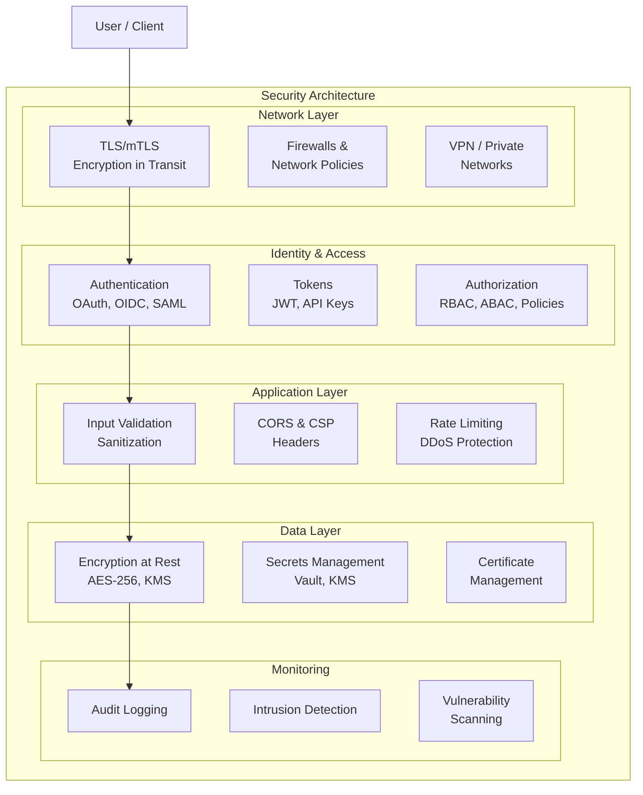

# 🔐 Security

> **Security is not a feature — it's a foundation.** Every system, API, and service must be designed with security in mind from the start. This section covers cryptographic protocols, authentication, authorization, secret management, and secure communication patterns used in modern infrastructure.

---

## 📑 Table of Contents

- [Security Overview](#-security-overview)
- [Security Layers](#-security-layers)
- [Topics](#-topics)
- [Security Principles](#-security-principles)
- [Quick Reference](#-quick-reference)
- [Related Topics](#-related-topics)

---

## 🧠 Security Overview

Modern application security is multi-layered. No single mechanism provides complete protection — instead, multiple overlapping controls create **defense in depth**.

**Core security goals (CIA Triad):**

| Goal | Description | Controls |
|------|-------------|----------|
| **Confidentiality** | Data accessible only to authorized parties | Encryption (TLS, AES), access controls, secrets management |
| **Integrity** | Data not modified by unauthorized parties | Digital signatures, HMAC, checksums, audit logs |
| **Availability** | Systems accessible when needed | Redundancy, rate limiting, DDoS protection |

Additional goals:
- **Authentication** — Verify identity ("who are you?")
- **Authorization** — Verify permissions ("what can you do?")
- **Non-repudiation** — Cannot deny actions (audit trails, digital signatures)
- **Accountability** — Actions are traceable to an identity

---

## 🏗 Security Layers



---

## 📚 Topics

| Topic | Description | Key Concepts |
|-------|-------------|-------------|
| [TLS](tls/) | Transport Layer Security | Handshake, certificates, mTLS, cipher suites |
| [JWT](jwt/) | JSON Web Tokens | Claims, signing, verification, token lifecycle |
| [OAuth 2.0](oauth/) | Authorization framework | Grant types, PKCE, OIDC, scopes |
| [Vault](vault/) | Secrets management | Dynamic secrets, encryption, PKI, policies |

---

## 🔑 Security Principles

### Defense in Depth

```text
Layer 1: Network      → Firewalls, network policies, TLS
Layer 2: Identity     → Authentication (OAuth/OIDC)
Layer 3: Authorization→ RBAC, policies, scopes
Layer 4: Application  → Input validation, output encoding
Layer 5: Data         → Encryption at rest, secrets management
Layer 6: Monitoring   → Audit logs, anomaly detection

Attacker must bypass ALL layers to compromise the system
```

### Principle of Least Privilege

Grant only the minimum permissions needed:

```text
✗ Bad:  "admin" role for all service accounts
✓ Good: "read-only" on specific resources for specific services
```

### Zero Trust

Never trust, always verify — even inside the network:

| Traditional | Zero Trust |
|-------------|------------|
| Trust inside the perimeter | Verify every request |
| VPN = trusted | mTLS between all services |
| Flat internal network | Micro-segmentation |
| Long-lived credentials | Short-lived, rotated tokens |

---

## ⚡ Quick Reference

### Common Security Headers

```text
Strict-Transport-Security: max-age=31536000; includeSubDomains
Content-Security-Policy: default-src 'self'
X-Content-Type-Options: nosniff
X-Frame-Options: DENY
X-XSS-Protection: 1; mode=block
Referrer-Policy: strict-origin-when-cross-origin
Permissions-Policy: camera=(), microphone=(), geolocation=()
```

### OWASP Top 10 (2021)

| # | Category | Prevention |
|---|----------|-----------|
| 1 | Broken Access Control | RBAC, server-side checks, deny by default |
| 2 | Cryptographic Failures | Use TLS, encrypt at rest, strong algorithms |
| 3 | Injection | Parameterized queries, input validation |
| 4 | Insecure Design | Threat modeling, secure design patterns |
| 5 | Security Misconfiguration | Hardening, minimal installs, automated config |
| 6 | Vulnerable Components | Dependency scanning, updates, SBOMs |
| 7 | Auth & Identification Failures | MFA, rate limiting, secure session management |
| 8 | Software & Data Integrity | Signed artifacts, CI/CD pipeline security |
| 9 | Logging & Monitoring Failures | Audit logs, alerting, incident response |
| 10 | SSRF | Allowlist URLs, sanitize input, network segmentation |

---

## 🔗 Related Topics

- [DevOps — Kubernetes](../devops/kubernetes/) — Kubernetes RBAC, network policies, pod security
- [DevOps — Networking](../devops/networking/) — Network security, firewalls, mTLS
- [Distributed Systems — etcd](../distributed-systems/etcd/) — etcd authentication and TLS
- [Databases — PostgreSQL](../databases/postgresql/) — Database security, roles, encryption
- [Databases — Redis](../databases/redis/) — Redis AUTH, TLS, ACLs
- [CLI — SSH](../cli/ssh/) — SSH keys, tunnels, secure remote access

---

> **Security is everyone's responsibility.** Whether you're writing code, configuring infrastructure, or designing systems, always consider the security implications of your decisions.
