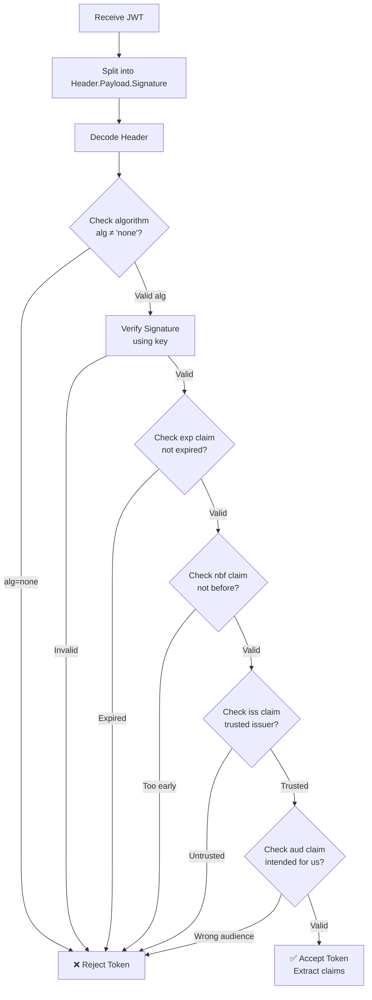
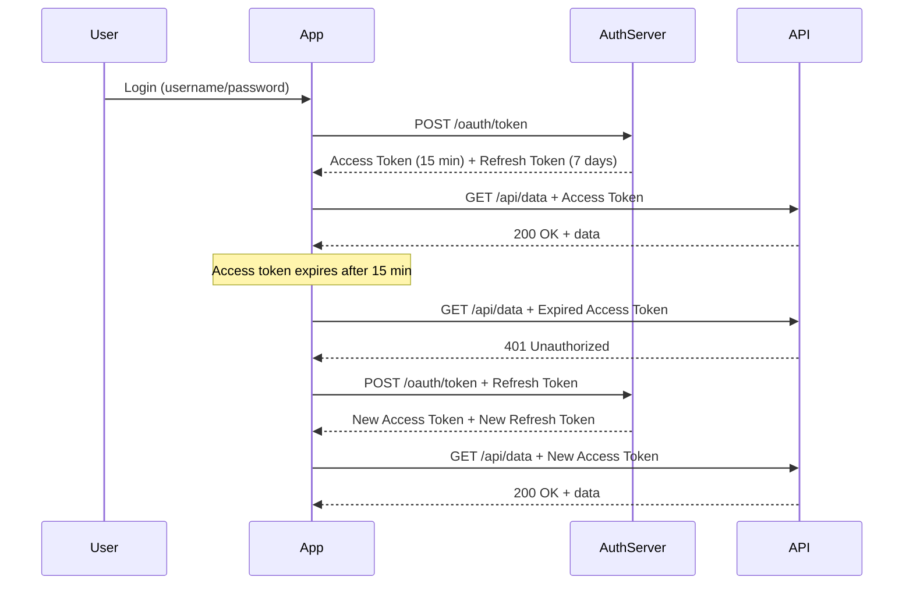

# 🎫 JSON Web Tokens (JWT)

> **JWT is the de facto standard for stateless authentication in modern web applications and APIs.** A JWT is a compact, URL-safe token that encodes claims (data) as a JSON object and is digitally signed to ensure integrity and authenticity.

---

## 📑 Table of Contents

- [What is JWT?](#-what-is-jwt)
- [JWT Structure](#-jwt-structure)
- [Claims](#-claims)
- [Signing Algorithms](#-signing-algorithms)
- [Verification Flow](#-verification-flow)
- [Access Tokens vs Refresh Tokens](#-access-tokens-vs-refresh-tokens)
- [Token Storage](#-token-storage)
- [Common Vulnerabilities](#-common-vulnerabilities)
- [Implementation Patterns](#-implementation-patterns)
- [Production Tips](#-production-tips)
- [Related Topics](#-related-topics)

---

## 🧠 What is JWT?

JSON Web Token (JWT, pronounced "jot") is defined in [RFC 7519](https://datatracker.ietf.org/doc/html/rfc7519). It's a self-contained token that carries information (claims) about the user or client, enabling stateless authentication.

### JWT vs Server-Side Sessions

| Feature | JWT | Server-Side Sessions |
|---------|-----|---------------------|
| **State** | Stateless (token contains all info) | Stateful (session stored on server) |
| **Storage** | Client-side (cookie/localStorage) | Server-side (memory/Redis/DB) |
| **Scalability** | Excellent (no shared state) | Requires shared session store |
| **Revocation** | Difficult (need blocklist) | Easy (delete from store) |
| **Size** | Larger (~1KB token) | Small (~32-byte session ID) |
| **Server load** | Lower (no session lookup) | Higher (session store queries) |
| **Security** | Token theft = access until expiry | Session ID theft = access until invalidated |
| **Best for** | Microservices, APIs, cross-domain | Traditional web apps, fine-grained control |

---

## 🔧 JWT Structure

A JWT consists of three Base64URL-encoded parts separated by dots:

```text
Header.Payload.Signature

eyJhbGciOiJSUzI1NiIsInR5cCI6IkpXVCJ9.
eyJzdWIiOiIxMjM0NTY3ODkwIiwibmFtZSI6IkpvaG4gRG9lIiwiYWRtaW4iOnRydWUsImlhdCI6MTUxNjIzOTAyMn0.
POstGetfAytaZS82wHcjoTyoqhMyxXiWdR7Nn7A29DNSl0EiXLdwJ6xC6AfgZWF1bOsS_TuYI3OG85AmiExREkrS6tDfTQ2B3WXlrr-wp5AokiRbz3_oB4OxG-W9KcEEbDRcZc0nH3L7LzYptiy1PtAylQGxHTWZXtGz4ht0bAecBgmpdgXMguEIcoqPJ1n3pIWk_dUZegpqx0Lka21H6XxUTxiy8OcaarA8zdnPUnV6AmNP3ecFawIFYdvJB_cm-GvpCSbr8G8y_Mllj8f4x9nBH8pQux89_6gUY618iYv7tuPWBFfEbLxtF2pZS6YC1aSfLQxaOoaBSTc-v9w0Sq8
```

### Header

```json
{
  "alg": "RS256",    // Signing algorithm
  "typ": "JWT",      // Token type
  "kid": "key-2025"  // Key ID (for key rotation)
}
```

### Payload (Claims)

```json
{
  "iss": "https://auth.example.com",    // Issuer
  "sub": "user-123",                     // Subject (user ID)
  "aud": "https://api.example.com",     // Audience
  "exp": 1735689600,                     // Expiration (Unix timestamp)
  "iat": 1735686000,                     // Issued at
  "nbf": 1735686000,                     // Not before
  "jti": "unique-token-id-abc",          // JWT ID (unique identifier)
  "name": "John Doe",                    // Custom claim
  "roles": ["admin", "user"],            // Custom claim
  "scope": "read write"                  // Custom claim
}
```

### Decode a JWT (Command Line)

```bash
# Decode header
echo 'eyJhbGciOiJSUzI1NiIsInR5cCI6IkpXVCJ9' | base64 -d 2>/dev/null | jq

# Decode payload
echo 'eyJzdWIiOiIxMjM0NTY3ODkwIiwibmFtZSI6IkpvaG4gRG9lIiwiYWRtaW4iOnRydWUsImlhdCI6MTUxNjIzOTAyMn0' | base64 -d 2>/dev/null | jq

# Full JWT decode script
decode_jwt() {
  local token=$1
  echo "=== Header ==="
  echo "$token" | cut -d. -f1 | base64 -d 2>/dev/null | jq
  echo "=== Payload ==="
  echo "$token" | cut -d. -f2 | base64 -d 2>/dev/null | jq
}
```

> ⚠️ **The payload is NOT encrypted** — it's only Base64-encoded. Anyone can read it. Never put sensitive data (passwords, credit cards) in a JWT.

---

## 📋 Claims

### Registered Claims (RFC 7519)

| Claim | Name | Description | Example |
|-------|------|-------------|---------|
| `iss` | Issuer | Who issued the token | `"https://auth.example.com"` |
| `sub` | Subject | Who the token is about | `"user-123"` |
| `aud` | Audience | Who the token is intended for | `"https://api.example.com"` |
| `exp` | Expiration | When the token expires (Unix timestamp) | `1735689600` |
| `nbf` | Not Before | Token not valid before this time | `1735686000` |
| `iat` | Issued At | When the token was created | `1735686000` |
| `jti` | JWT ID | Unique token identifier | `"abc-123-def"` |

### Public Claims

Defined in the [IANA JSON Web Token Claims Registry](https://www.iana.org/assignments/jwt/jwt.xhtml):

```json
{
  "name": "John Doe",
  "email": "john@example.com",
  "email_verified": true,
  "picture": "https://example.com/photo.jpg"
}
```

### Private Claims

Custom claims agreed upon by the parties:

```json
{
  "roles": ["admin", "editor"],
  "tenant_id": "tenant-abc",
  "permissions": ["users:read", "users:write"],
  "subscription_tier": "premium"
}
```

---

## 🔑 Signing Algorithms

| Algorithm | Type | Key | Use Case |
|-----------|------|-----|----------|
| **HS256** | Symmetric (HMAC) | Shared secret | Single service, simple setup |
| **HS384** | Symmetric (HMAC) | Shared secret | Higher security HMAC |
| **HS512** | Symmetric (HMAC) | Shared secret | Highest security HMAC |
| **RS256** | Asymmetric (RSA) | Public/private key pair | Microservices, API gateways |
| **RS384** | Asymmetric (RSA) | Public/private key pair | Higher security RSA |
| **RS512** | Asymmetric (RSA) | Public/private key pair | Highest security RSA |
| **ES256** | Asymmetric (ECDSA) | Public/private key pair | Modern, smaller keys |
| **ES384** | Asymmetric (ECDSA) | Public/private key pair | Higher security ECDSA |
| **PS256** | Asymmetric (RSA-PSS) | Public/private key pair | RSA with PSS padding |
| **EdDSA** | Asymmetric (Ed25519) | Public/private key pair | Modern, fast, small signatures |

### Symmetric vs Asymmetric

```text
Symmetric (HS256):
  Auth Server → sign with SECRET → JWT
  API Server  → verify with SAME SECRET
  ⚠️ Secret must be shared securely between all services

Asymmetric (RS256):
  Auth Server → sign with PRIVATE KEY → JWT
  API Server  → verify with PUBLIC KEY
  ✓ Private key stays on auth server
  ✓ Public key can be freely distributed
  ✓ Better for microservices (each service has public key)
```

### When to Use Which

| Scenario | Recommended | Why |
|----------|------------|-----|
| Single monolith | HS256 | Simple, fast, single secret |
| Microservices | RS256 or ES256 | Public key distribution |
| High throughput | ES256 | Smaller tokens, faster verification |
| Cross-organization | RS256 | Standard, well-supported |
| Mobile/IoT | ES256 | Smaller keys and tokens |

---

## ✅ Verification Flow



---

## 🔄 Access Tokens vs Refresh Tokens



| Property | Access Token | Refresh Token |
|----------|-------------|---------------|
| **Purpose** | Access protected resources | Obtain new access tokens |
| **Lifetime** | Short (5-30 minutes) | Long (hours to days) |
| **Sent to** | Resource servers (APIs) | Authorization server only |
| **Storage** | Memory or httpOnly cookie | httpOnly cookie (secure) |
| **Revocation** | Hard (wait for expiry) | Easy (server-side blocklist) |
| **Format** | JWT (typically) | JWT or opaque string |

---

## 🗄 Token Storage

### Browser Storage Options

| Storage | XSS Vulnerable | CSRF Vulnerable | Recommendation |
|---------|---------------|-----------------|----------------|
| **localStorage** | ✅ Yes (JS can read) | ❌ No | ⚠️ Avoid for sensitive tokens |
| **sessionStorage** | ✅ Yes (JS can read) | ❌ No | ⚠️ Avoid for sensitive tokens |
| **httpOnly Cookie** | ❌ No (JS can't read) | ✅ Yes (auto-sent) | ✅ Use with CSRF protection |
| **In-memory (variable)** | ❌ No (no persistence) | ❌ No | ✅ Best for SPAs (lost on refresh) |

### Recommended: httpOnly Cookie

```text
Set-Cookie: access_token=eyJ...; 
    HttpOnly;           # JavaScript cannot access
    Secure;             # Only sent over HTTPS
    SameSite=Strict;    # CSRF protection
    Path=/api;          # Only sent to API routes
    Max-Age=900         # 15 minutes
```

### SPA (Single Page Application) Pattern

```text
1. Login → Auth server returns access token (short-lived)
2. Store in memory (JavaScript variable)
3. Store refresh token in httpOnly cookie
4. Access token expires → use refresh token (via cookie) to get new one
5. Page refresh → access token lost → use refresh token to get new one
```

---

## ⚠️ Common Vulnerabilities

### 1. Algorithm None Attack

```json
// Attacker changes header to:
{"alg": "none", "typ": "JWT"}
// Then strips the signature

// Prevention: ALWAYS validate algorithm
// NEVER accept alg: "none"
// Whitelist allowed algorithms
```

### 2. Key Confusion (RS256 → HS256)

```text
Server uses RS256 (asymmetric):
  - Signs with PRIVATE key
  - Verifies with PUBLIC key

Attack: Change alg to HS256 (symmetric)
  - Attacker signs with PUBLIC key (which is public!)
  - Server verifies with PUBLIC key (treats it as HMAC secret)
  - Token passes verification!

Prevention:
  - Enforce algorithm: verify with explicit algorithm, not from token header
  - Use separate key stores for HMAC and RSA
```

### 3. Token Replay

```text
Attacker captures valid token → uses it from different location

Prevention:
  - Short token lifetime (5-15 minutes)
  - Bind to client IP or fingerprint (trade-off: breaks roaming)
  - Use jti claim for one-time-use tokens
  - Token binding (bind to TLS session)
```

### 4. Sensitive Data in Payload

```text
❌ BAD: Including sensitive data
{
  "sub": "user-123",
  "ssn": "123-45-6789",       // NEVER!
  "credit_card": "4111...",    // NEVER!
  "password_hash": "abc..."    // NEVER!
}

✅ GOOD: Minimal claims, reference IDs
{
  "sub": "user-123",
  "roles": ["user"],
  "scope": "read"
}
```

### 5. Not Validating Claims

```text
❌ Only checking signature, ignoring claims
✅ Must validate: exp, nbf, iss, aud, and custom claims

❌ Trusting client-provided token without verification
✅ Always verify server-side using proper keys
```

---

## 💻 Implementation Patterns

### Python (PyJWT)

```python
import jwt
from datetime import datetime, timedelta, timezone

SECRET_KEY = "your-secret-key"  # For HS256
# Or load RSA keys for RS256

# --- Create Token ---
def create_access_token(user_id: str, roles: list[str]) -> str:
    """Create a JWT access token."""
    payload = {
        "sub": user_id,
        "roles": roles,
        "iss": "https://auth.example.com",
        "aud": "https://api.example.com",
        "iat": datetime.now(timezone.utc),
        "exp": datetime.now(timezone.utc) + timedelta(minutes=15),
        "jti": str(uuid.uuid4()),
    }
    return jwt.encode(payload, SECRET_KEY, algorithm="HS256")

# --- Verify Token ---
def verify_access_token(token: str) -> dict:
    """Verify and decode a JWT access token."""
    try:
        payload = jwt.decode(
            token,
            SECRET_KEY,
            algorithms=["HS256"],  # Whitelist algorithms!
            audience="https://api.example.com",
            issuer="https://auth.example.com",
        )
        return payload
    except jwt.ExpiredSignatureError:
        raise AuthError("Token expired")
    except jwt.InvalidAudienceError:
        raise AuthError("Invalid audience")
    except jwt.InvalidIssuerError:
        raise AuthError("Invalid issuer")
    except jwt.InvalidTokenError:
        raise AuthError("Invalid token")
```

### Go (golang-jwt)

```go
package auth

import (
    "fmt"
    "time"
    "github.com/golang-jwt/jwt/v5"
)

var secretKey = []byte("your-secret-key")

type Claims struct {
    Roles []string `json:"roles"`
    jwt.RegisteredClaims
}

// CreateToken creates a JWT access token
func CreateToken(userID string, roles []string) (string, error) {
    claims := Claims{
        Roles: roles,
        RegisteredClaims: jwt.RegisteredClaims{
            Subject:   userID,
            Issuer:    "https://auth.example.com",
            Audience:  jwt.ClaimStrings{"https://api.example.com"},
            ExpiresAt: jwt.NewNumericDate(time.Now().Add(15 * time.Minute)),
            IssuedAt:  jwt.NewNumericDate(time.Now()),
            ID:        uuid.NewString(),
        },
    }
    
    token := jwt.NewWithClaims(jwt.SigningMethodHS256, claims)
    return token.SignedString(secretKey)
}

// VerifyToken verifies and decodes a JWT
func VerifyToken(tokenString string) (*Claims, error) {
    token, err := jwt.ParseWithClaims(tokenString, &Claims{},
        func(token *jwt.Token) (interface{}, error) {
            // Validate algorithm
            if _, ok := token.Method.(*jwt.SigningMethodHMAC); !ok {
                return nil, fmt.Errorf("unexpected signing method: %v", token.Header["alg"])
            }
            return secretKey, nil
        },
        jwt.WithAudience("https://api.example.com"),
        jwt.WithIssuer("https://auth.example.com"),
        jwt.WithValidMethods([]string{"HS256"}),
    )
    if err != nil {
        return nil, err
    }
    
    claims, ok := token.Claims.(*Claims)
    if !ok || !token.Valid {
        return nil, fmt.Errorf("invalid token")
    }
    return claims, nil
}
```

---

## 🏭 Production Tips

### Token Lifecycle

| Setting | Recommendation | Why |
|---------|---------------|-----|
| Access token expiry | 5-15 minutes | Limits damage from stolen tokens |
| Refresh token expiry | 1-7 days | Balance between UX and security |
| Refresh token rotation | Enable | Each use issues new refresh token |
| Token revocation | Maintain blocklist for critical cases | For logout, password change, suspicious activity |

### Key Rotation

```text
Key rotation flow:
1. Generate new signing key (kid: "key-2025-02")
2. Start signing new tokens with new key
3. Continue accepting old tokens (kid: "key-2025-01") for validation
4. After max token lifetime, remove old key from validation
5. Publish public keys via JWKS endpoint

JWKS endpoint: /.well-known/jwks.json
{
  "keys": [
    {
      "kid": "key-2025-02",
      "kty": "RSA",
      "use": "sig",
      "n": "...",
      "e": "AQAB"
    },
    {
      "kid": "key-2025-01",
      "kty": "RSA",
      "use": "sig",
      "n": "...",
      "e": "AQAB"
    }
  ]
}
```

### Security Checklist

```text
□ Always validate signature with whitelisted algorithms
□ Always check exp, iss, aud claims
□ Never accept alg: "none"
□ Use asymmetric algorithms (RS256/ES256) for microservices
□ Keep tokens short-lived (≤ 15 minutes for access tokens)
□ Store tokens securely (httpOnly cookies or in-memory)
□ Implement refresh token rotation
□ Have a token revocation strategy (blocklist)
□ Don't store sensitive data in the payload
□ Use HTTPS for all token transmission
□ Implement key rotation with JWKS
□ Log authentication failures for monitoring
```

---

## 🔗 Related Topics

- [Security — OAuth 2.0](../oauth/) — OAuth uses JWT for access tokens
- [Security — TLS](../tls/) — Secure transport for token transmission
- [Security — Vault](../vault/) — Secret storage for signing keys
- [Distributed Systems — Caching](../../distributed-systems/caching/) — Caching token validation results

---

> **JWT is a tool, not a solution.** It solves the stateless authentication problem well but introduces complexity around revocation, storage, and key management. Use it when you need scalable, cross-service authentication. For simpler apps, server-side sessions may be easier to manage securely.
