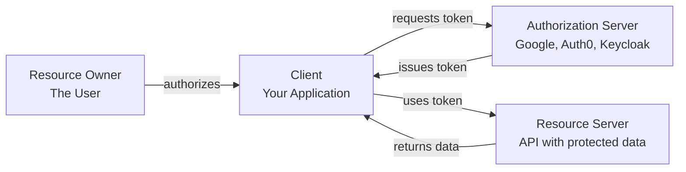
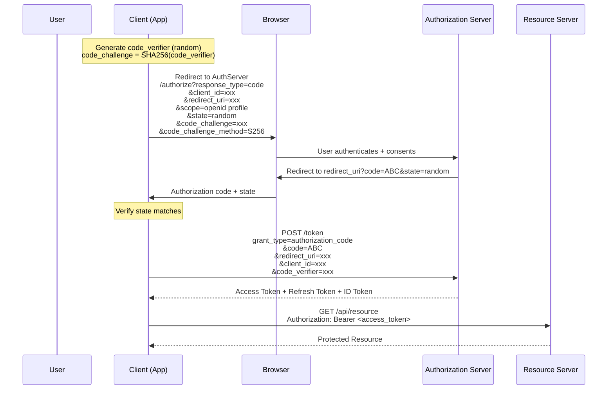
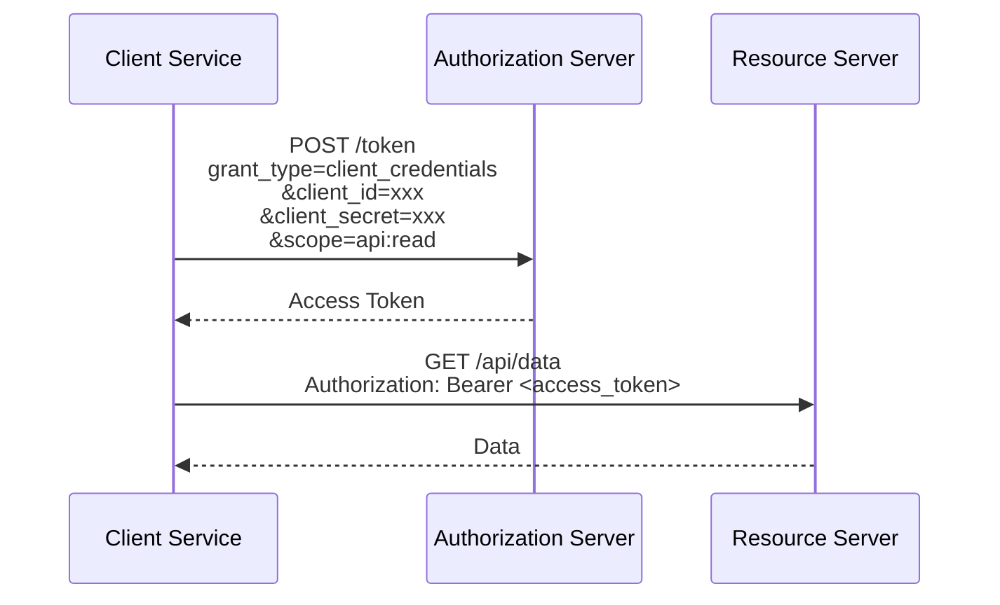
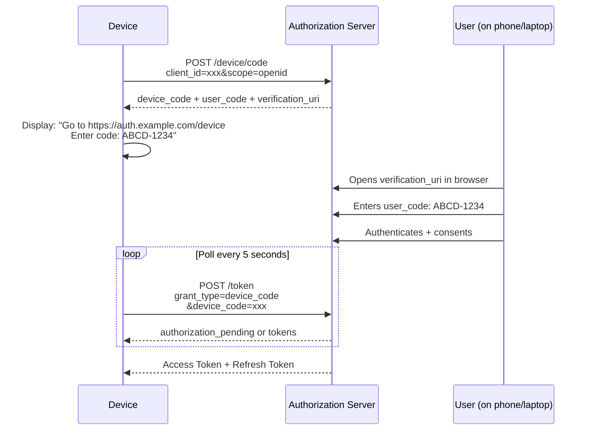

# 🔓 OAuth 2.0 & OpenID Connect

> **OAuth 2.0 is the industry-standard protocol for authorization.** It allows applications to obtain limited access to user accounts on third-party services without exposing credentials. OpenID Connect (OIDC) extends OAuth 2.0 to add authentication — verifying user identity.

---

## 📑 Table of Contents

- [What is OAuth 2.0?](#-what-is-oauth-20)
- [Roles](#-roles)
- [Grant Types](#-grant-types)
- [Scopes](#-scopes)
- [OpenID Connect (OIDC)](#-openid-connect-oidc)
- [Token Types](#-token-types)
- [Common Mistakes](#-common-mistakes)
- [Production Tips](#-production-tips)
- [Related Topics](#-related-topics)

---

## 🧠 What is OAuth 2.0?

OAuth 2.0 solves the **delegated authorization** problem: allowing a third-party application to access a user's resources without the user sharing their password.

**Example:** "Sign in with Google" — your app gets limited access to the user's Google profile without ever seeing their Google password.

**What OAuth 2.0 is NOT:**
- **Not authentication** — OAuth alone doesn't tell you *who* the user is (that's OIDC)
- **Not a protocol** — It's an authorization *framework* (flexible but requires careful implementation)
- **Not backward compatible** — OAuth 2.0 is completely different from OAuth 1.0

**Key terminology:**

| Term | Description |
|------|-------------|
| **Grant** | A method of obtaining an access token |
| **Scope** | Permission level requested (e.g., `read:email`) |
| **Consent** | User approving the requested permissions |
| **Token endpoint** | Server endpoint that issues tokens |
| **Authorization endpoint** | Server endpoint for user authentication/consent |
| **Redirect URI** | Where the user is sent after authorization |

---

## 👥 Roles



| Role | Description | Example |
|------|-------------|---------|
| **Resource Owner** | The user who owns the data | End user with a Google account |
| **Client** | The application requesting access | Your web or mobile app |
| **Authorization Server** | Issues tokens after authentication | Google, Auth0, Keycloak, Okta |
| **Resource Server** | Hosts protected resources (API) | Your API server |

---

## 🔑 Grant Types

### 1. Authorization Code (with PKCE) — Recommended

The most secure and widely used grant type. Suitable for web apps, mobile apps, and SPAs.



**PKCE (Proof Key for Code Exchange):**

```text
1. Client generates random code_verifier (43-128 chars)
2. Client computes code_challenge = BASE64URL(SHA256(code_verifier))
3. Authorization request includes code_challenge
4. Token request includes code_verifier
5. Server verifies: SHA256(code_verifier) == code_challenge

This prevents authorization code interception attacks.
PKCE is REQUIRED for public clients (SPAs, mobile apps).
RECOMMENDED for all clients (including confidential).
```

### 2. Client Credentials — Machine-to-Machine

For server-to-server communication where no user is involved.



```bash
# Example: Client credentials token request
curl -X POST https://auth.example.com/oauth/token \
  -H "Content-Type: application/x-www-form-urlencoded" \
  -d "grant_type=client_credentials" \
  -d "client_id=my-service" \
  -d "client_secret=my-secret" \
  -d "scope=api:read api:write"
```

**Use cases:** Backend services, cron jobs, microservice-to-microservice, CI/CD pipelines.

### 3. Device Code — Input-Constrained Devices

For devices without a browser or with limited input (smart TVs, CLI tools, IoT).



### Deprecated Grant Types

#### ❌ Implicit Grant (Deprecated)

```text
Tokens returned directly in URL fragment (#access_token=xxx).

Why deprecated:
- Token exposed in browser history and URL
- No refresh tokens
- Vulnerable to token interception
- Replace with: Authorization Code + PKCE
```

#### ❌ Resource Owner Password Credentials (Deprecated)

```text
User provides username/password directly to the client app.

Why deprecated:
- Client sees user's password (defeats OAuth's purpose)
- No support for MFA
- Trains users to enter passwords in third-party apps
- Replace with: Authorization Code + PKCE
```

---

## 🔒 Scopes

Scopes define what access the application is requesting:

```text
Authorization request:
  scope=openid profile email read:messages write:messages

Common scope patterns:
┌──────────────────────┬───────────────────────┐
│ Scope                │ Access Granted         │
├──────────────────────┼───────────────────────┤
│ openid               │ User's ID (OIDC)      │
│ profile              │ Name, picture, etc.    │
│ email                │ Email address          │
│ read:messages        │ Read messages          │
│ write:messages       │ Create/edit messages   │
│ admin                │ Administrative access  │
│ offline_access       │ Refresh token issued   │
└──────────────────────┴───────────────────────┘
```

**Best practices:**
- Use fine-grained scopes (`read:users` instead of `admin`)
- Follow the `resource:action` naming convention
- Request minimum necessary scopes (principle of least privilege)
- Document all available scopes in your API docs

---

## 🆔 OpenID Connect (OIDC)

OIDC is an identity layer built on top of OAuth 2.0. While OAuth tells you what you can do (authorization), OIDC tells you who you are (authentication).

### OIDC vs OAuth 2.0

| Feature | OAuth 2.0 | OIDC |
|---------|----------|------|
| **Purpose** | Authorization (access) | Authentication (identity) |
| **Answers** | "What can this app do?" | "Who is this user?" |
| **Tokens** | Access Token + Refresh Token | ID Token + Access Token + Refresh Token |
| **User info** | Not standardized | Standardized claims |
| **Discovery** | Not standardized | `.well-known/openid-configuration` |

### ID Token

An ID Token is a JWT containing identity claims:

```json
{
  "iss": "https://auth.example.com",
  "sub": "user-12345",
  "aud": "my-app-client-id",
  "exp": 1735689600,
  "iat": 1735686000,
  "nonce": "random-nonce-value",
  "auth_time": 1735685900,
  
  "name": "Jane Doe",
  "email": "jane@example.com",
  "email_verified": true,
  "picture": "https://example.com/jane.jpg"
}
```

### Discovery Endpoint

```bash
# Fetch OIDC configuration
curl https://auth.example.com/.well-known/openid-configuration | jq

# Returns:
{
  "issuer": "https://auth.example.com",
  "authorization_endpoint": "https://auth.example.com/authorize",
  "token_endpoint": "https://auth.example.com/oauth/token",
  "userinfo_endpoint": "https://auth.example.com/userinfo",
  "jwks_uri": "https://auth.example.com/.well-known/jwks.json",
  "scopes_supported": ["openid", "profile", "email"],
  "response_types_supported": ["code"],
  "grant_types_supported": ["authorization_code", "client_credentials", "refresh_token"],
  "id_token_signing_alg_values_supported": ["RS256"]
}
```

### UserInfo Endpoint

```bash
# Get user information
curl https://auth.example.com/userinfo \
  -H "Authorization: Bearer <access_token>"

# Response:
{
  "sub": "user-12345",
  "name": "Jane Doe",
  "email": "jane@example.com",
  "email_verified": true,
  "picture": "https://example.com/jane.jpg"
}
```

---

## 🎫 Token Types

| Token | Format | Purpose | Lifetime | Audience |
|-------|--------|---------|----------|----------|
| **Access Token** | JWT or opaque | Access protected resources | Short (5-60 min) | Resource server |
| **Refresh Token** | Opaque string | Obtain new access tokens | Long (hours-days) | Authorization server only |
| **ID Token** | JWT (always) | Prove user identity | Short (matches access token) | Client application |
| **Authorization Code** | Opaque string | Exchange for tokens | Very short (< 10 min) | Authorization server |

### Token Introspection

For opaque tokens, the resource server can verify with the authorization server:

```bash
# Introspect token
curl -X POST https://auth.example.com/oauth/introspect \
  -H "Content-Type: application/x-www-form-urlencoded" \
  -d "token=<access_token>" \
  -d "client_id=my-service" \
  -d "client_secret=my-secret"

# Response:
{
  "active": true,
  "sub": "user-12345",
  "client_id": "my-app",
  "scope": "openid profile email",
  "exp": 1735689600
}
```

---

## ⚠️ Common Mistakes

### 1. Not Validating Tokens Properly

```text
❌ Trusting token without verification
❌ Not checking iss (issuer) — accepting tokens from any server
❌ Not checking aud (audience) — accepting tokens meant for other services
❌ Not checking exp (expiry) — accepting expired tokens

✅ Always validate: signature, iss, aud, exp, nbf
✅ Use the JWKS endpoint for key retrieval
✅ Cache JWKS keys with appropriate TTL
```

### 2. Using Deprecated Flows

```text
❌ Implicit grant (tokens in URL fragment)
❌ Resource owner password grant (app sees password)

✅ Authorization Code + PKCE for all interactive flows
✅ Client Credentials for machine-to-machine
```

### 3. Storing Tokens Insecurely

```text
❌ Access token in localStorage (XSS vulnerable)
❌ Refresh token in localStorage
❌ Tokens in URL parameters

✅ Access token in memory or httpOnly cookie
✅ Refresh token in httpOnly, Secure, SameSite cookie
✅ Tokens only sent over HTTPS
```

### 4. Not Implementing Token Refresh

```text
❌ Using long-lived access tokens (hours/days)
❌ Forcing re-login when token expires

✅ Short-lived access tokens (5-15 min)
✅ Refresh tokens for seamless renewal
✅ Refresh token rotation (new refresh token on each use)
```

### 5. Over-Scoping

```text
❌ Requesting scope=* or admin for everything
❌ Using one token with all permissions everywhere

✅ Request minimum scopes needed
✅ Different tokens for different services
✅ Fine-grained scopes: read:users, write:users, delete:users
```

---

## 🏭 Production Tips

### Implementation Checklist

```text
Authorization Server Setup:
□ Use a proven implementation (Keycloak, Auth0, Okta, AWS Cognito)
□ Configure HTTPS on all endpoints
□ Set appropriate token lifetimes
□ Enable refresh token rotation
□ Configure CORS properly for SPAs
□ Set up PKCE requirement for public clients
□ Implement rate limiting on token endpoint
□ Enable audit logging for all authentication events

Client Application:
□ Use Authorization Code + PKCE
□ Validate state parameter to prevent CSRF
□ Store tokens securely (httpOnly cookies / memory)
□ Implement token refresh logic
□ Handle token expiry gracefully (silent refresh)
□ Validate ID token claims (iss, aud, exp, nonce)
□ Use exact redirect URI matching

Resource Server (API):
□ Validate access token on every request
□ Check iss, aud, exp, scope claims
□ Cache JWKS keys (with refresh on miss)
□ Return proper 401/403 responses
□ Log authentication failures
□ Use scope-based authorization for endpoints
```

### Security Recommendations

| Practice | Description |
|----------|-------------|
| **PKCE everywhere** | Even for confidential clients (defense in depth) |
| **Short token lifetimes** | Access: 5-15 min, Refresh: 1-7 days |
| **Refresh token rotation** | Issue new refresh token on each use |
| **Audience validation** | Each service checks `aud` matches itself |
| **Scope validation** | Endpoints check required scopes |
| **HTTPS only** | All OAuth endpoints must use TLS |
| **State parameter** | Random, unique per request, verified on callback |
| **Nonce** | For OIDC, prevents token replay |
| **Exact redirect URI** | No wildcards in redirect URIs |

### Provider Comparison

| Provider | Type | OIDC | Free Tier | Best For |
|----------|------|------|-----------|----------|
| **Keycloak** | Self-hosted | ✅ | Open source | Full control, enterprise |
| **Auth0** | SaaS | ✅ | 7,500 MAU | Fast setup, developer-friendly |
| **Okta** | SaaS | ✅ | 100 MAU | Enterprise, workforce identity |
| **AWS Cognito** | Cloud | ✅ | 50K MAU | AWS-native apps |
| **Google Identity** | SaaS | ✅ | Free | Google ecosystem |
| **Azure AD** | Cloud | ✅ | Free tier | Microsoft ecosystem |

---

## 🔗 Related Topics

- [Security — JWT](../jwt/) — JWT token format used in OAuth/OIDC
- [Security — TLS](../tls/) — TLS required for all OAuth endpoints
- [Security — Vault](../vault/) — Secure storage for client secrets
- [DevOps — Kubernetes](../../devops/kubernetes/) — OIDC authentication for Kubernetes

---

> **OAuth 2.0 is powerful but complex.** Use a proven authorization server (Keycloak, Auth0, Okta) rather than implementing from scratch. Always use PKCE, validate all tokens thoroughly, and follow the principle of least privilege with scopes.
