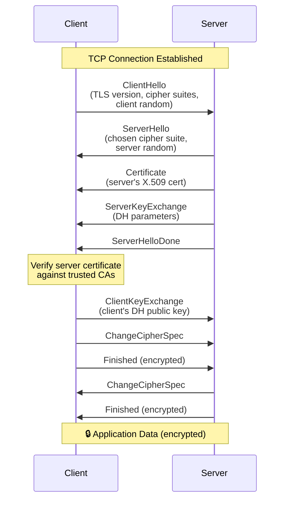
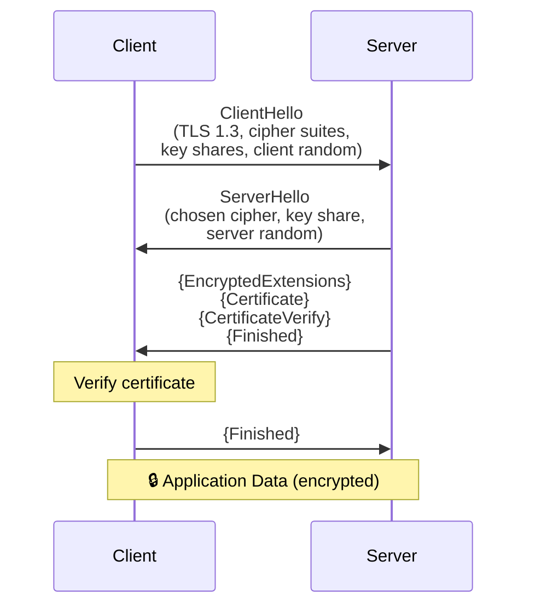
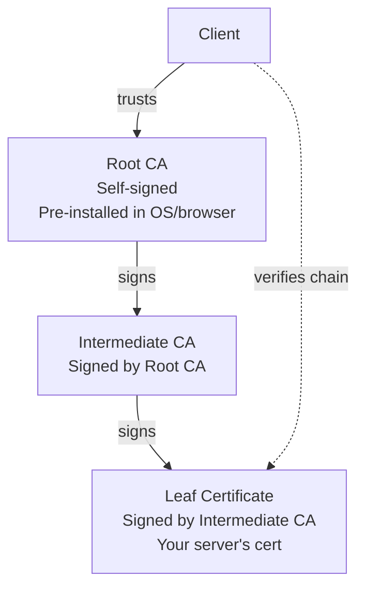
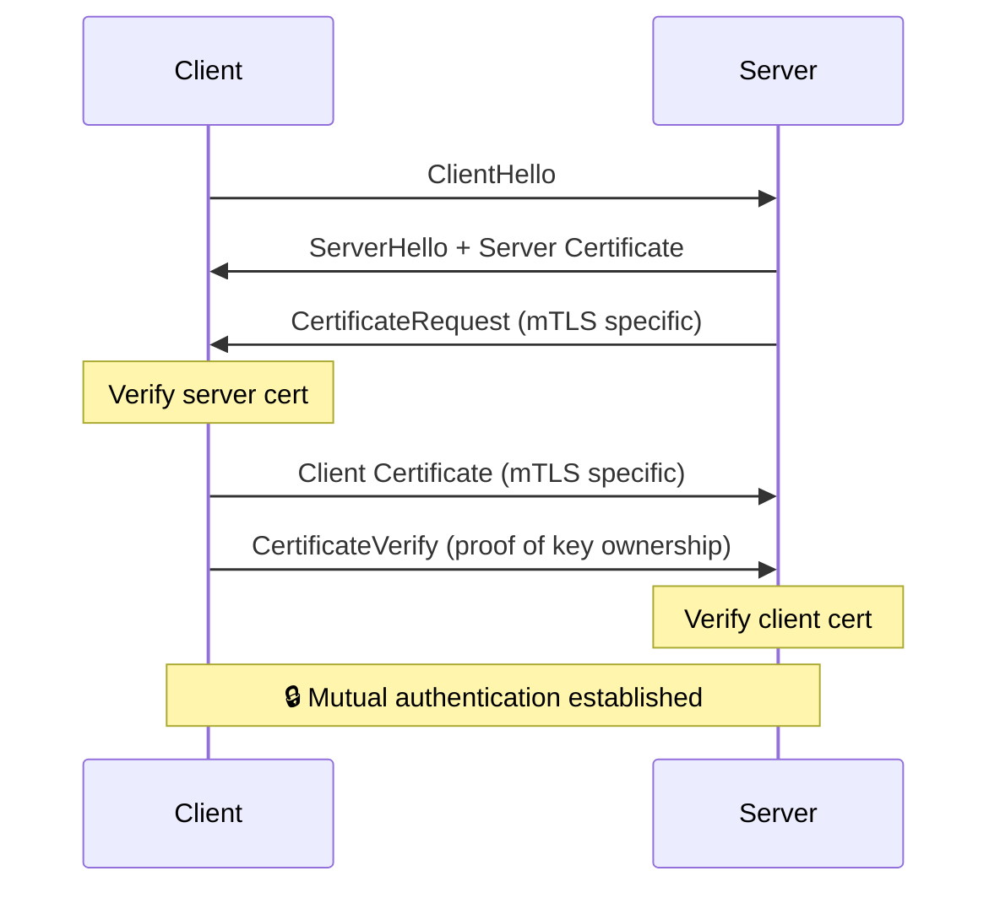

# 🔒 TLS (Transport Layer Security)

> **TLS is the foundation of secure communication on the internet.** It provides encryption, authentication, and integrity for data in transit. Every HTTPS connection, API call, database connection, and service-to-service communication in production should use TLS.

---

## 📑 Table of Contents

- [What is TLS?](#-what-is-tls)
- [How TLS Works](#-how-tls-works)
- [Certificates](#-certificates)
- [Certificate Types](#-certificate-types)
- [Certificate Management](#-certificate-management)
- [OpenSSL Commands](#-openssl-commands)
- [Mutual TLS (mTLS)](#-mutual-tls-mtls)
- [Common Issues](#-common-issues)
- [Troubleshooting](#-troubleshooting)
- [Production Tips](#-production-tips)
- [Related Topics](#-related-topics)

---

## 🧠 What is TLS?

TLS (Transport Layer Security) is a cryptographic protocol that provides:

- **Encryption** — Data cannot be read by third parties (confidentiality)
- **Authentication** — Server (and optionally client) identity is verified
- **Integrity** — Data cannot be tampered with in transit

**TLS version history:**

| Version | Year | Status | Notes |
|---------|------|--------|-------|
| SSL 2.0 | 1995 | ⛔ Deprecated | Fundamentally broken |
| SSL 3.0 | 1996 | ⛔ Deprecated | POODLE vulnerability |
| TLS 1.0 | 1999 | ⛔ Deprecated | BEAST vulnerability |
| TLS 1.1 | 2006 | ⛔ Deprecated | No modern cipher support |
| TLS 1.2 | 2008 | ✅ Supported | Widely used, secure with proper config |
| TLS 1.3 | 2018 | ✅ Recommended | Faster, more secure, simplified |

> **Recommendation:** Use TLS 1.3 where possible, TLS 1.2 as minimum. Disable all older versions.

---

## 🤝 How TLS Works

### TLS 1.2 Handshake



**TLS 1.2:** 2 round trips (4 messages each way) before encrypted data flows.

### TLS 1.3 Handshake



**TLS 1.3 improvements:**
- **1 round trip** (1-RTT) instead of 2 — 50% faster handshake
- **0-RTT resumption** — Send data on first message (with replay risk)
- **Removed insecure algorithms** — No RSA key exchange, RC4, SHA-1, etc.
- **Encrypted handshake** — Certificate is encrypted (privacy improvement)
- **Simplified cipher suites** — Fewer, safer choices

### TLS 1.2 vs 1.3 Comparison

| Feature | TLS 1.2 | TLS 1.3 |
|---------|---------|---------|
| **Handshake RTTs** | 2 | 1 (0 with resumption) |
| **Key exchange** | RSA or DHE/ECDHE | ECDHE only (forward secrecy mandatory) |
| **Certificate** | Plaintext | Encrypted |
| **Cipher suites** | ~37 options | 5 options |
| **Forward secrecy** | Optional | Mandatory |
| **0-RTT** | No | Yes (optional) |
| **Renegotiation** | Supported | Removed |

---

## 📜 Certificates

### X.509 Certificate Structure

```text
Certificate:
    Data:
        Version: 3
        Serial Number: 04:00:00:00:00:01:15:4b:5a:c3:94
        Signature Algorithm: sha256WithRSAEncryption
        Issuer: CN=Let's Encrypt Authority X3, O=Let's Encrypt, C=US
        Validity:
            Not Before: Jan  1 00:00:00 2025 GMT
            Not After:  Apr  1 00:00:00 2025 GMT
        Subject: CN=example.com
        Subject Public Key Info:
            Public Key Algorithm: rsaEncryption
            RSA Public-Key: (2048 bit)
        X509v3 Extensions:
            X509v3 Subject Alternative Name:
                DNS:example.com, DNS:*.example.com
            X509v3 Key Usage: critical
                Digital Signature, Key Encipherment
            X509v3 Extended Key Usage:
                TLS Web Server Authentication
```

### Certificate Chain (Chain of Trust)



```text
Certificate chain verification:
1. Client receives: [leaf cert] + [intermediate cert(s)]
2. Verify leaf cert signature using intermediate CA's public key
3. Verify intermediate cert signature using root CA's public key
4. Root CA is trusted (pre-installed in trust store)
5. Check: not expired, not revoked, hostname matches
```

**Common mistake:** Not including the intermediate certificate in the server configuration → "incomplete chain" errors.

---

## 📋 Certificate Types

| Type | Validation | What's Verified | Cost | Use Case |
|------|-----------|----------------|------|----------|
| **DV** (Domain Validation) | Domain ownership | DNS or HTTP challenge | Free-$$ | Websites, APIs |
| **OV** (Organization Validation) | Org identity + domain | Legal entity verification | $$ | Business websites |
| **EV** (Extended Validation) | Extensive org verification | Legal, physical, operational | $$$ | Banking, e-commerce |
| **Wildcard** | `*.example.com` | Single domain + all subdomains | $-$$$ | Multiple subdomains |
| **SAN** (Multi-domain) | Multiple domains in one cert | Multiple DNS names / IPs | $-$$$ | Load balancers, CDNs |
| **Self-signed** | None (no CA) | Nothing (trust must be configured) | Free | Development, internal |

---

## 🔧 Certificate Management

### Generate a Self-Signed Certificate

```bash
# Generate private key + self-signed certificate (one command)
openssl req -x509 -newkey rsa:4096 -keyout key.pem -out cert.pem \
  -sha256 -days 365 -nodes \
  -subj "/C=US/ST=State/L=City/O=Org/CN=localhost"

# With Subject Alternative Names (SAN)
openssl req -x509 -newkey rsa:4096 -keyout key.pem -out cert.pem \
  -sha256 -days 365 -nodes \
  -subj "/CN=myapp.example.com" \
  -addext "subjectAltName=DNS:myapp.example.com,DNS:*.myapp.example.com,IP:10.0.0.1"
```

### Generate a CSR (Certificate Signing Request)

```bash
# Generate private key
openssl genrsa -out server.key 4096

# Generate CSR
openssl req -new -key server.key -out server.csr \
  -subj "/C=US/ST=State/L=City/O=MyOrg/CN=myapp.example.com"

# Generate CSR with SAN
openssl req -new -key server.key -out server.csr \
  -config <(cat <<EOF
[req]
default_bits = 4096
prompt = no
distinguished_name = dn
req_extensions = v3_req

[dn]
CN = myapp.example.com
O = MyOrg
C = US

[v3_req]
subjectAltName = DNS:myapp.example.com,DNS:api.example.com,IP:10.0.0.1
EOF
)

# View CSR contents
openssl req -in server.csr -noout -text
```

### Let's Encrypt (Certbot)

```bash
# Install certbot
sudo apt install certbot

# Obtain certificate (standalone HTTP challenge)
sudo certbot certonly --standalone -d example.com -d www.example.com

# Obtain certificate (DNS challenge — for wildcards)
sudo certbot certonly --manual --preferred-challenges dns -d "*.example.com"

# Auto-renew (cron or systemd timer)
sudo certbot renew --quiet

# Certificates are stored at:
# /etc/letsencrypt/live/example.com/fullchain.pem  (cert + intermediate)
# /etc/letsencrypt/live/example.com/privkey.pem    (private key)
```

---

## 💻 OpenSSL Commands

### Inspect Certificates

```bash
# View certificate details
openssl x509 -in cert.pem -noout -text

# View expiry date
openssl x509 -in cert.pem -noout -dates

# View subject and issuer
openssl x509 -in cert.pem -noout -subject -issuer

# View SANs (Subject Alternative Names)
openssl x509 -in cert.pem -noout -ext subjectAltName

# View certificate fingerprint
openssl x509 -in cert.pem -noout -fingerprint -sha256

# Check if certificate matches private key
openssl x509 -in cert.pem -noout -modulus | openssl md5
openssl rsa -in key.pem -noout -modulus | openssl md5
# MD5 hashes should match
```

### Verify Certificates

```bash
# Verify certificate against CA
openssl verify -CAfile ca.pem cert.pem

# Verify certificate chain
openssl verify -CAfile root-ca.pem -untrusted intermediate.pem cert.pem

# Check certificate chain order
openssl crl2pkcs7 -nocrl -certfile fullchain.pem | \
  openssl pkcs7 -print_certs -noout
```

### Convert Formats

```bash
# PEM to DER
openssl x509 -in cert.pem -outform DER -out cert.der

# DER to PEM
openssl x509 -in cert.der -inform DER -outform PEM -out cert.pem

# PEM to PKCS#12 (PFX)
openssl pkcs12 -export -out cert.pfx -inkey key.pem -in cert.pem -certfile ca.pem

# PKCS#12 to PEM
openssl pkcs12 -in cert.pfx -out cert.pem -nodes

# Create JKS (Java KeyStore) from PEM
openssl pkcs12 -export -in cert.pem -inkey key.pem -out keystore.p12 -name myalias
keytool -importkeystore -deststorepass changeit -destkeystore keystore.jks \
  -srckeystore keystore.p12 -srcstoretype PKCS12
```

### Test Server Connection

```bash
# Connect to server and show certificate
openssl s_client -connect example.com:443 -servername example.com

# Show full certificate chain
openssl s_client -connect example.com:443 -showcerts

# Test with specific TLS version
openssl s_client -connect example.com:443 -tls1_2
openssl s_client -connect example.com:443 -tls1_3

# Test specific cipher suite
openssl s_client -connect example.com:443 -cipher ECDHE-RSA-AES256-GCM-SHA384

# Check certificate expiry of remote server
echo | openssl s_client -connect example.com:443 -servername example.com 2>/dev/null | \
  openssl x509 -noout -dates

# Check certificate with SNI (Server Name Indication)
openssl s_client -connect lb.example.com:443 -servername app1.example.com
```

---

## 🔐 Mutual TLS (mTLS)

### What is mTLS?

In standard TLS, only the server presents a certificate. In **mutual TLS**, both client and server present certificates and verify each other.



### When to Use mTLS

| Scenario | mTLS? | Why |
|----------|-------|-----|
| Service-to-service (microservices) | ✅ Yes | Authenticate services to each other |
| API gateway → backend | ✅ Yes | Only trusted services call backends |
| Database connections | ✅ Yes | Restrict database access to known clients |
| Public website | ❌ No | Users don't have client certificates |
| Mobile app → API | ❌ Usually no | Certificate management on devices is hard |

### Configure mTLS (Nginx Example)

```nginx
server {
    listen 443 ssl;
    server_name api.example.com;
    
    # Server certificate
    ssl_certificate /etc/nginx/certs/server.crt;
    ssl_certificate_key /etc/nginx/certs/server.key;
    
    # Client certificate verification (mTLS)
    ssl_client_certificate /etc/nginx/certs/ca.crt;  # CA that signed client certs
    ssl_verify_client on;  # Require client certificate
    # ssl_verify_client optional;  # Optional client cert (check in app)
    ssl_verify_depth 2;
    
    location / {
        # Pass client cert info to backend
        proxy_set_header X-Client-Cert-DN $ssl_client_s_dn;
        proxy_set_header X-Client-Cert-Verify $ssl_client_verify;
        proxy_pass http://backend;
    }
}
```

---

## ⚠️ Common Issues

### Expired Certificate

```text
Error: "certificate has expired"
Fix: Renew the certificate before expiry. Set up monitoring.

# Check expiry
openssl x509 -in cert.pem -noout -enddate
# notAfter=Jan 01 00:00:00 2025 GMT
```

### Incomplete Certificate Chain

```text
Error: "unable to verify the first certificate" or "certificate chain incomplete"
Fix: Include intermediate CA certificates in server config.

# Check chain
openssl s_client -connect example.com:443 -servername example.com
# Look for: "Verify return code: 21 (unable to verify the first certificate)"

# Fix: Concatenate leaf + intermediate into fullchain
cat server.crt intermediate.crt > fullchain.crt
```

### Hostname Mismatch

```text
Error: "hostname mismatch" or "certificate is not valid for name"
Fix: Ensure CN or SAN matches the hostname being accessed.

# Check what hostnames the cert covers
openssl x509 -in cert.pem -noout -ext subjectAltName
# X509v3 Subject Alternative Name:
#     DNS:example.com, DNS:*.example.com
```

### Cipher Suite Mismatch

```text
Error: "no shared cipher" or "handshake failure"
Fix: Ensure server and client support at least one common cipher suite.

# List supported ciphers
openssl ciphers -v 'HIGH:!aNULL:!MD5'

# Recommended TLS 1.3 ciphers (automatic)
# TLS_AES_256_GCM_SHA384
# TLS_CHACHA20_POLY1305_SHA256
# TLS_AES_128_GCM_SHA256
```

---

## 🐛 Troubleshooting

### Debug with openssl s_client

```bash
# Full connection debug
openssl s_client -connect example.com:443 -servername example.com -debug

# Show certificate chain
openssl s_client -connect example.com:443 -showcerts 2>/dev/null | \
  openssl x509 -noout -subject -issuer -dates

# Check supported protocols
for proto in tls1 tls1_1 tls1_2 tls1_3; do
  echo -n "$proto: "
  openssl s_client -connect example.com:443 -$proto < /dev/null 2>&1 | \
    grep -o "Protocol.*" || echo "NOT SUPPORTED"
done

# Check OCSP stapling
openssl s_client -connect example.com:443 -status 2>/dev/null | \
  grep -A 5 "OCSP Response"
```

### Debug with curl

```bash
# Verbose TLS connection info
curl -v https://example.com 2>&1 | grep -E "SSL|TLS|certificate"

# Skip certificate verification (debugging only!)
curl -k https://self-signed.example.com

# Use specific CA certificate
curl --cacert /path/to/ca.crt https://example.com

# Use client certificate (mTLS)
curl --cert client.crt --key client.key --cacert ca.crt https://api.example.com

# Check certificate expiry from CLI
curl -vI https://example.com 2>&1 | grep "expire date"
```

### Certificate Debugging Checklist

```text
□ Certificate not expired?
  → openssl x509 -in cert.pem -noout -dates
  
□ Certificate chain complete?
  → openssl s_client -connect host:443 -showcerts
  
□ Hostname matches CN or SAN?
  → openssl x509 -in cert.pem -noout -text | grep -A1 "Subject Alternative"
  
□ Private key matches certificate?
  → Compare modulus MD5 hashes
  
□ Certificate is trusted by client?
  → openssl verify -CAfile ca.pem cert.pem
  
□ Correct file permissions on private key?
  → ls -la key.pem  (should be 600 or 400)
  
□ Server configured with correct files?
  → Check cert, key, and chain paths in server config
```

---

## 🏭 Production Tips

### Certificate Rotation

```text
Rotation strategy:
1. Generate new certificate (with overlap period)
2. Deploy new certificate alongside old one
3. Verify new certificate works
4. Remove old certificate

For automated rotation:
- cert-manager (Kubernetes) — automatic renewal and deployment
- Vault PKI — dynamic certificate generation
- Let's Encrypt + certbot — auto-renew with cron/systemd
```

### Monitoring Certificate Expiry

```bash
# Script to check certificate expiry
#!/bin/bash
DOMAINS=("example.com" "api.example.com" "app.example.com")
WARN_DAYS=30

for domain in "${DOMAINS[@]}"; do
  expiry=$(echo | openssl s_client -connect "${domain}:443" -servername "$domain" 2>/dev/null | \
    openssl x509 -noout -enddate 2>/dev/null | cut -d= -f2)
  
  if [ -n "$expiry" ]; then
    expiry_epoch=$(date -d "$expiry" +%s)
    now_epoch=$(date +%s)
    days_left=$(( (expiry_epoch - now_epoch) / 86400 ))
    
    if [ "$days_left" -lt "$WARN_DAYS" ]; then
      echo "WARNING: $domain expires in $days_left days ($expiry)"
    else
      echo "OK: $domain expires in $days_left days"
    fi
  fi
done
```

### Security Best Practices

| Practice | Description |
|----------|-------------|
| **TLS 1.2+ only** | Disable SSL and TLS 1.0/1.1 |
| **HSTS** | `Strict-Transport-Security: max-age=31536000; includeSubDomains` |
| **OCSP stapling** | Faster certificate revocation checking |
| **Forward secrecy** | Use ECDHE key exchange (mandatory in TLS 1.3) |
| **Strong ciphers** | AES-256-GCM, CHACHA20-POLY1305 |
| **Certificate pinning** | Pin specific CAs or certificates (mobile apps) |
| **Short-lived certs** | 90 days (Let's Encrypt) or shorter |
| **Private key protection** | File permissions 0600, never in version control |
| **Automated renewal** | cert-manager, certbot, Vault PKI |
| **Monitor expiry** | Alert 30 days before expiration |

### Nginx TLS Configuration

```nginx
ssl_protocols TLSv1.2 TLSv1.3;
ssl_ciphers ECDHE-ECDSA-AES128-GCM-SHA256:ECDHE-RSA-AES128-GCM-SHA256:ECDHE-ECDSA-AES256-GCM-SHA384:ECDHE-RSA-AES256-GCM-SHA384:ECDHE-ECDSA-CHACHA20-POLY1305:ECDHE-RSA-CHACHA20-POLY1305;
ssl_prefer_server_ciphers off;  # Let client choose in TLS 1.3

ssl_session_timeout 1d;
ssl_session_cache shared:SSL:10m;
ssl_session_tickets off;  # Disable for forward secrecy

ssl_stapling on;
ssl_stapling_verify on;
resolver 8.8.8.8 8.8.4.4 valid=300s;

add_header Strict-Transport-Security "max-age=31536000; includeSubDomains" always;
```

---

## 🔗 Related Topics

- [Security — JWT](../jwt/) — Token-based authentication over TLS
- [Security — OAuth](../oauth/) — OAuth 2.0 requires TLS
- [Security — Vault](../vault/) — PKI certificate generation with Vault
- [DevOps — Networking](../../devops/networking/) — Network security and TLS termination
- [Distributed Systems — etcd](../../distributed-systems/etcd/) — TLS configuration for etcd
- [CLI — curl](../../cli/curl/) — Testing TLS connections with curl

---

> **TLS is non-negotiable in production.** There is no valid reason to transmit sensitive data without encryption. Use TLS 1.3 where possible, automate certificate management, and monitor for expiry before your users discover it.
