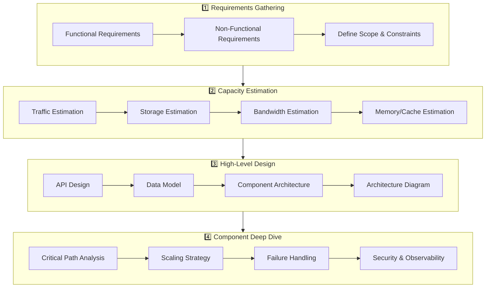

# 🏗 System Design

> **Designing systems that scale, perform, and survive the real world.** System design is the process of defining the architecture, components, modules, interfaces, and data flows to satisfy specified requirements.

---

## 📑 Table of Contents

- [What is System Design?](#-what-is-system-design)
- [How to Approach System Design](#-how-to-approach-system-design)
- [System Design Process](#-system-design-process)
- [Topics](#-topics)
- [Case Studies](#-case-studies)
- [Quick Reference](#-quick-reference)
- [Related Topics](#-related-topics)

---

## 🧠 What is System Design?

System design is the art and science of building software systems that meet functional requirements while satisfying constraints around performance, scalability, reliability, and cost. It bridges the gap between requirements and implementation — answering **how** a system should be built, not just **what** it should do.

**Why it matters:**

- Every production system faces scaling challenges eventually
- Poor architectural decisions are expensive to reverse
- Understanding trade-offs separates senior engineers from junior ones
- It's the most valuable skill for building real-world software

**System design is NOT about:**

- Finding the "perfect" solution (there isn't one)
- Memorizing architectures (understanding trade-offs matters more)
- Over-engineering (start simple, scale when needed)

---

## 🗺 How to Approach System Design

### Step-by-Step Framework

| Step | Focus | Key Questions |
|------|-------|---------------|
| **1. Requirements** | What does the system do? | Functional vs non-functional requirements? Who are the users? |
| **2. Estimation** | How big is the system? | Traffic, storage, bandwidth? Read-heavy or write-heavy? |
| **3. High-Level Design** | What are the major components? | API design, data model, architecture diagram |
| **4. Deep Dive** | How do critical components work? | Database schema, caching strategy, message flow |
| **5. Trade-offs** | What are the compromises? | Consistency vs availability? Latency vs throughput? |
| **6. Scaling** | How does the system grow? | Horizontal scaling, sharding, caching layers |

> **Pro tip:** Always start with requirements. A URL shortener serving 100 users/day is very different from one serving 100M users/day.

---

## 🔄 System Design Process

---

## 📚 Topics

### Core Concepts

| Topic | Description | Key Concepts |
|-------|-------------|--------------|
| [Fundamentals](fundamentals.md) | System design foundations | Requirements, estimation, latency, CAP theorem |
| [Scalability](scalability.md) | Scaling systems to handle growth | Horizontal/vertical, sharding, replication |
| [Caching](caching.md) | Speed up reads, reduce load | Cache-aside, write-through, invalidation |
| [Load Balancing](load-balancing.md) | Distribute traffic across servers | L4/L7, algorithms, health checks |
| [API Design](api-design.md) | Design robust APIs | REST, gRPC, GraphQL, versioning, rate limiting |

### Case Studies

| Case Study | Type | Key Challenges |
|------------|------|----------------|
| [URL Shortener](case-studies/url-shortener.md) | Read-heavy service | Key generation, caching, redirection |
| [Notification System](case-studies/notification-system.md) | Multi-channel messaging | Priority queues, rate limiting, delivery guarantees |

---

## ⚡ Quick Reference

### Key Numbers to Know

| Metric | Value |
|--------|-------|
| L1 cache reference | 0.5 ns |
| L2 cache reference | 7 ns |
| Main memory reference | 100 ns |
| SSD random read | 150 μs |
| HDD seek | 10 ms |
| Round trip within datacenter | 500 μs |
| Round trip cross-continent | 150 ms |

### Common Design Patterns

| Pattern | Use When |
|---------|----------|
| **Cache-aside** | Read-heavy workload, can tolerate stale data |
| **Write-behind** | Write-heavy, eventual consistency acceptable |
| **CQRS** | Separate read/write models needed |
| **Event sourcing** | Need full audit trail, event replay |
| **Saga** | Distributed transactions across services |
| **Circuit breaker** | Protect against cascading failures |

### Availability Targets

| Availability | Downtime/Year | Downtime/Month |
|-------------|---------------|----------------|
| 99% (two 9s) | 3.65 days | 7.31 hours |
| 99.9% (three 9s) | 8.77 hours | 43.83 minutes |
| 99.99% (four 9s) | 52.6 minutes | 4.38 minutes |
| 99.999% (five 9s) | 5.26 minutes | 26.3 seconds |

→ See [Fundamentals](fundamentals.md) for complete back-of-the-envelope calculations

---

## 🔗 Related Topics

- [🏛 Architecture](../architecture/) — Architecture patterns (microservices, event-driven, clean)
- [🌐 Distributed Systems](../distributed-systems/) — Kafka, etcd, consensus, replication
- [🗄 Databases](../databases/) — PostgreSQL, Redis, MongoDB, design patterns
- [📊 Observability](../observability/) — Monitoring, alerting, distributed tracing
- [🔐 Security](../security/) — TLS, JWT, OAuth, authentication patterns
- [🧠 DSA](../dsa/) — Data structures and algorithms for system internals
- [⚙️ Engineering](../engineering/) — Testing, logging, performance best practices
- [🐛 Troubleshooting](../troubleshooting/) — Debugging production systems

---

> **System design is about trade-offs, not perfect solutions.** Every decision favors some quality attribute at the expense of another. The best designs make these trade-offs explicit and aligned with business needs.
