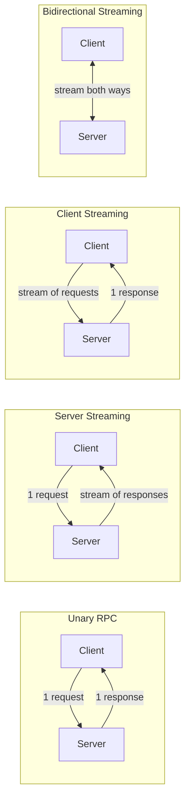
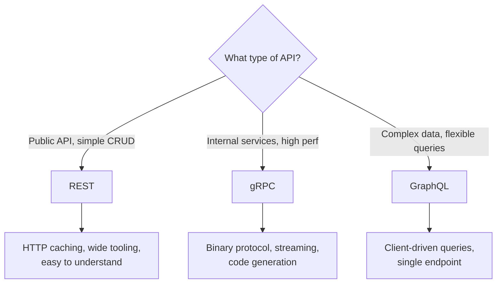
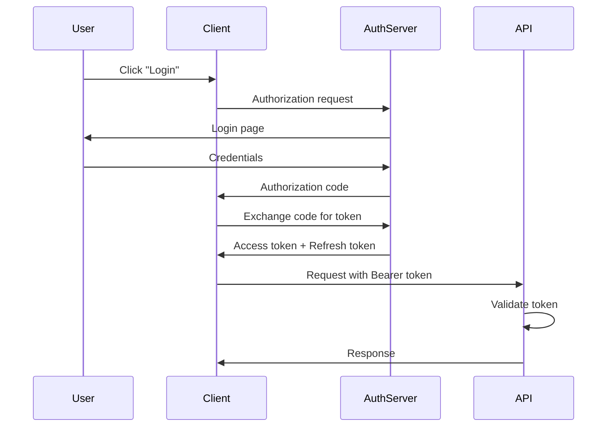

# API Design

> **The contract between your system and the world.** API design defines how clients interact with your system. A well-designed API is intuitive, consistent, scalable, and hard to misuse.

---

## 📑 Table of Contents

- [REST API Design](#-rest-api-design)
- [gRPC](#-grpc)
- [GraphQL](#-graphql)
- [Comparison: REST vs gRPC vs GraphQL](#-comparison-rest-vs-grpc-vs-graphql)
- [API Versioning](#-api-versioning)
- [Pagination](#-pagination)
- [Rate Limiting](#-rate-limiting)
- [Authentication](#-authentication)
- [Error Handling](#-error-handling)
- [API Documentation](#-api-documentation)
- [Related Topics](#-related-topics)

---

## 🌐 REST API Design

REST (Representational State Transfer) is the most common API style for web services.

### Resources and URLs

Design around **resources** (nouns), not actions (verbs).

```text
✅ Good:
GET    /api/v1/users          — List users
GET    /api/v1/users/123      — Get user 123
POST   /api/v1/users          — Create a user
PUT    /api/v1/users/123      — Replace user 123
PATCH  /api/v1/users/123      — Partially update user 123
DELETE /api/v1/users/123      — Delete user 123

❌ Bad:
GET    /api/v1/getUsers
POST   /api/v1/createUser
POST   /api/v1/deleteUser/123
GET    /api/v1/getUserOrders
```

### HTTP Methods

| Method | Purpose | Idempotent | Safe | Request Body |
|--------|---------|-----------|------|-------------|
| GET | Read resource | Yes | Yes | No |
| POST | Create resource | No | No | Yes |
| PUT | Replace resource | Yes | No | Yes |
| PATCH | Partial update | No* | No | Yes |
| DELETE | Delete resource | Yes | No | No |

*PATCH can be idempotent depending on implementation.

### HTTP Status Codes

| Code | Meaning | When to Use |
|------|---------|-------------|
| **200** | OK | Successful GET, PUT, PATCH |
| **201** | Created | Successful POST (resource created) |
| **204** | No Content | Successful DELETE |
| **301** | Moved Permanently | Resource URL changed permanently |
| **304** | Not Modified | Cached response is still valid |
| **400** | Bad Request | Invalid input, malformed JSON |
| **401** | Unauthorized | Missing or invalid authentication |
| **403** | Forbidden | Authenticated but not authorized |
| **404** | Not Found | Resource doesn't exist |
| **409** | Conflict | Duplicate resource, version conflict |
| **422** | Unprocessable Entity | Valid JSON but semantic errors |
| **429** | Too Many Requests | Rate limit exceeded |
| **500** | Internal Server Error | Unexpected server failure |
| **502** | Bad Gateway | Upstream service failure |
| **503** | Service Unavailable | Server overloaded or in maintenance |
| **504** | Gateway Timeout | Upstream service timeout |

### Nested Resources

```text
GET  /api/v1/users/123/orders          — Orders for user 123
GET  /api/v1/users/123/orders/456      — Order 456 for user 123
POST /api/v1/users/123/orders          — Create order for user 123
```

**Rule of thumb:** Don't nest more than 2 levels deep. If deeper, provide a flat endpoint:

```text
❌ /api/v1/users/123/orders/456/items/789/reviews
✅ /api/v1/order-items/789/reviews
```

### Filtering, Sorting, and Field Selection

```text
# Filtering
GET /api/v1/users?status=active&role=admin

# Sorting
GET /api/v1/users?sort=created_at&order=desc

# Field selection (sparse fieldsets)
GET /api/v1/users?fields=id,name,email

# Combined
GET /api/v1/users?status=active&sort=name&fields=id,name&page=2&size=20
```

### HATEOAS

Hypermedia As The Engine Of Application State — include links in responses to guide clients.

```json
{
  "id": 123,
  "name": "Alice",
  "email": "alice@example.com",
  "_links": {
    "self": { "href": "/api/v1/users/123" },
    "orders": { "href": "/api/v1/users/123/orders" },
    "update": { "href": "/api/v1/users/123", "method": "PUT" }
  }
}
```

**In practice:** Full HATEOAS is rarely implemented. Including `self` and `next`/`prev` links for pagination is common and pragmatic.

---

## ⚡ gRPC

Google's high-performance RPC framework using Protocol Buffers.

### Protocol Buffers (Protobuf)

Define your API contract with `.proto` files:

```protobuf
syntax = "proto3";

package user.v1;

service UserService {
  rpc GetUser(GetUserRequest) returns (User);
  rpc ListUsers(ListUsersRequest) returns (ListUsersResponse);
  rpc CreateUser(CreateUserRequest) returns (User);
  rpc UpdateUser(UpdateUserRequest) returns (User);
  rpc DeleteUser(DeleteUserRequest) returns (google.protobuf.Empty);
}

message User {
  string id = 1;
  string name = 2;
  string email = 3;
  int64 created_at = 4;
}

message GetUserRequest {
  string id = 1;
}

message ListUsersRequest {
  int32 page_size = 1;
  string page_token = 2;
}

message ListUsersResponse {
  repeated User users = 1;
  string next_page_token = 2;
}
```

### Streaming Modes



| Mode | Use Case | Example |
|------|----------|---------|
| **Unary** | Simple request/response | Get a user by ID |
| **Server streaming** | Server pushes multiple responses | Real-time price feed |
| **Client streaming** | Client sends multiple messages | File upload, telemetry |
| **Bidirectional** | Both sides stream simultaneously | Chat, collaborative editing |

### When to Use gRPC

**Good fit:**
- Internal service-to-service communication
- High-performance, low-latency requirements
- Strongly-typed contracts needed
- Streaming required
- Polyglot microservices (code generation for all languages)

**Not ideal for:**
- Browser clients (needs gRPC-Web proxy)
- Simple CRUD APIs with few clients
- When human readability matters (debugging)
- Public APIs consumed by third parties

---

## 📊 GraphQL

Query language that lets clients request exactly the data they need.

### Schema Definition

```graphql
type User {
  id: ID!
  name: String!
  email: String!
  orders: [Order!]!
  createdAt: DateTime!
}

type Order {
  id: ID!
  total: Float!
  status: OrderStatus!
  items: [OrderItem!]!
}

enum OrderStatus {
  PENDING
  CONFIRMED
  SHIPPED
  DELIVERED
}

type Query {
  user(id: ID!): User
  users(limit: Int, offset: Int): [User!]!
}

type Mutation {
  createUser(input: CreateUserInput!): User!
  updateUser(id: ID!, input: UpdateUserInput!): User!
}

type Subscription {
  orderStatusChanged(userId: ID!): Order!
}
```

### Queries and Mutations

```graphql
# Client requests exactly what it needs
query {
  user(id: "123") {
    name
    email
    orders(last: 5) {
      id
      total
      status
    }
  }
}

# No over-fetching: mobile client requests less
query {
  user(id: "123") {
    name
  }
}
```

### The N+1 Problem

```text
Query: { users { orders { items } } }

Without batching:
1. Fetch all users (1 query)
2. For each user, fetch orders (N queries)
3. For each order, fetch items (N×M queries)
Total: 1 + N + N×M queries 😰

With DataLoader (batching):
1. Fetch all users (1 query)
2. Batch-fetch all orders for these users (1 query)
3. Batch-fetch all items for these orders (1 query)
Total: 3 queries ✅
```

**Solution:** Use DataLoader or equivalent batching/caching library.

---

## ⚖️ Comparison: REST vs gRPC vs GraphQL

| Feature | REST | gRPC | GraphQL |
|---------|------|------|---------|
| **Protocol** | HTTP/1.1 or HTTP/2 | HTTP/2 | HTTP/1.1 or HTTP/2 |
| **Data format** | JSON (text) | Protobuf (binary) | JSON (text) |
| **Contract** | OpenAPI/Swagger (optional) | .proto files (required) | Schema (required) |
| **Type safety** | Weak (depends on tooling) | Strong | Strong |
| **Performance** | Good | Excellent | Good |
| **Browser support** | Native | Requires proxy | Native |
| **Streaming** | WebSocket/SSE | Built-in | Subscriptions |
| **Caching** | HTTP caching built-in | Custom | Complex |
| **Learning curve** | Low | Medium | Medium-High |
| **Over-fetching** | Common | No (typed responses) | Solved by design |
| **Under-fetching** | Common (multiple calls) | No | Solved by design |
| **Best for** | Public APIs, CRUD | Service-to-service | Complex data, frontend flexibility |



---

## 🔢 API Versioning

### Strategies

| Strategy | Example | Pros | Cons |
|----------|---------|------|------|
| **URL path** | `/api/v1/users` | Simple, explicit, easy to route | URL changes, not RESTful purists' preference |
| **Query parameter** | `/api/users?version=1` | Easy to default | Easy to forget, harder to cache |
| **Header** | `Accept: application/vnd.api.v1+json` | Clean URLs | Hidden, harder to test |
| **Content negotiation** | `Accept: application/vnd.api+json;version=1` | Standards-compliant | Complex |

**Recommendation:** URL path versioning (`/api/v1/...`) is the most common and practical approach.

### Versioning Best Practices

- Version the API, not individual endpoints
- Support at least 2 versions concurrently
- Provide migration guides and deprecation notices
- Set a deprecation timeline (e.g., 6-12 months)
- Use sunset headers: `Sunset: Sat, 01 Jan 2027 00:00:00 GMT`

---

## 📖 Pagination

### Offset-Based

```text
GET /api/v1/users?page=3&size=20

→ OFFSET 40 LIMIT 20
```

| Pros | Cons |
|------|------|
| Simple to implement | Slow for large offsets (OFFSET 1000000) |
| Random page access | Inconsistent with concurrent inserts/deletes |
| Page count available | |

### Cursor-Based

```text
GET /api/v1/users?cursor=eyJpZCI6MTIzfQ&size=20

→ WHERE id > 123 LIMIT 20
```

```json
{
  "data": [...],
  "pagination": {
    "next_cursor": "eyJpZCI6MTQzfQ",
    "has_more": true
  }
}
```

| Pros | Cons |
|------|------|
| Consistent with concurrent changes | No random page access |
| Efficient for any page (no OFFSET) | Opaque cursor for clients |
| Works well with infinite scroll | Harder to implement |

### Keyset-Based

Similar to cursor but uses the actual sort column values.

```text
GET /api/v1/users?after_id=123&size=20

→ WHERE id > 123 ORDER BY id LIMIT 20
```

**Recommendation:** Use cursor-based for most APIs. Offset-based only for admin dashboards or when page numbers are needed.

---

## 🚦 Rate Limiting

Protect your API from abuse and ensure fair usage.

### Algorithms

#### Token Bucket

```text
Bucket capacity: 10 tokens
Refill rate: 1 token/second

Request arrives:
  If tokens > 0 → Allow, tokens -= 1
  If tokens = 0 → Reject (429)
```

**Pros:** Allows bursts up to bucket capacity. Smooth rate limiting.

#### Leaky Bucket

```text
Queue capacity: 10
Process rate: 1 request/second

Request arrives:
  If queue not full → Add to queue, process at fixed rate
  If queue full → Reject (429)
```

**Pros:** Smooth, constant output rate. No bursts.

#### Fixed Window

```text
Window: 1 minute
Limit: 100 requests/minute

Count requests in current window.
If count > 100 → Reject
```

**Cons:** Burst at window boundaries (e.g., 100 at 0:59 + 100 at 1:00 = 200 in 2 seconds).

#### Sliding Window Log

```text
Track timestamp of each request in a sorted set.
Count requests in the last N seconds.
If count > limit → Reject.
```

**Pros:** Accurate. **Cons:** Memory-heavy (stores all timestamps).

#### Sliding Window Counter

Hybrid: weighted sum of current and previous window counts.

```text
Previous window count: 80
Current window count: 30
Current position: 40% through window

Weighted count = 80 × 0.6 + 30 = 78
Limit: 100 → Allow (78 < 100)
```

### Rate Limit Headers

```http
HTTP/1.1 429 Too Many Requests
X-RateLimit-Limit: 100
X-RateLimit-Remaining: 0
X-RateLimit-Reset: 1693500000
Retry-After: 30
```

### Rate Limiting Comparison

| Algorithm | Burst Handling | Memory | Accuracy | Complexity |
|-----------|---------------|--------|----------|-----------|
| Token bucket | Allows controlled bursts | Low | Good | Low |
| Leaky bucket | No bursts, smooth output | Low | Good | Low |
| Fixed window | Burst at boundaries | Low | Fair | Very low |
| Sliding window log | No boundary burst | High | Excellent | Medium |
| Sliding window counter | Smooth approximation | Low | Good | Medium |

---

## 🔐 Authentication

### API Keys

```http
GET /api/v1/users HTTP/1.1
X-API-Key: sk_live_abc123def456
```

**Use for:** Server-to-server, third-party integrations, simple identification.
**Risks:** No expiration, shared secrets, hard to rotate.

### OAuth 2.0



### JWT (JSON Web Token)

```text
Header: {"alg": "RS256", "typ": "JWT"}
Payload: {"sub": "user123", "role": "admin", "exp": 1693500000}
Signature: RSASHA256(base64(header) + "." + base64(payload), privateKey)
```

**Pros:** Stateless (no server lookup), carries claims, widely supported.
**Cons:** Can't revoke individual tokens easily, token size, need rotation strategy.

→ See [Security](../security/) for JWT, OAuth, and TLS deep dives

---

## ❌ Error Handling

### Standard Error Format

```json
{
  "error": {
    "code": "VALIDATION_ERROR",
    "message": "Invalid input data",
    "details": [
      {
        "field": "email",
        "message": "Invalid email format",
        "value": "not-an-email"
      },
      {
        "field": "age",
        "message": "Must be a positive integer",
        "value": -5
      }
    ],
    "request_id": "req_abc123",
    "documentation_url": "https://api.example.com/docs/errors#VALIDATION_ERROR"
  }
}
```

### Error Response Guidelines

- Always return a consistent error structure
- Include a machine-readable error code
- Include a human-readable message
- Include a request ID for debugging
- Never expose internal stack traces or sensitive information
- Use appropriate HTTP status codes

---

## 📝 API Documentation

### OpenAPI / Swagger

```yaml
openapi: 3.0.3
info:
  title: User API
  version: 1.0.0
paths:
  /api/v1/users:
    get:
      summary: List users
      parameters:
        - name: page
          in: query
          schema:
            type: integer
            default: 1
        - name: size
          in: query
          schema:
            type: integer
            default: 20
      responses:
        '200':
          description: Successful response
          content:
            application/json:
              schema:
                type: object
                properties:
                  data:
                    type: array
                    items:
                      $ref: '#/components/schemas/User'
```

**Tools:** Swagger UI, Redoc, Stoplight, Postman.

**Best practices:**
- Auto-generate from code when possible
- Include request/response examples
- Document all error responses
- Keep docs in version control alongside code

---

## 🔗 Related Topics

- [Fundamentals](fundamentals.md) — System design foundations
- [Scalability](scalability.md) — Scaling API services
- [Load Balancing](load-balancing.md) — API traffic distribution
- [Caching](caching.md) — API response caching
- [Microservices](../architecture/microservices.md) — API gateway, service communication
- [Security](../security/) — Authentication, authorization, TLS
- [URL Shortener](case-studies/url-shortener.md) — API design in practice
- [Notification System](case-studies/notification-system.md) — Multi-endpoint API design

---

> **A great API is one that developers love to use.** It's consistent, predictable, well-documented, and hard to misuse. Invest in API design early — it's your system's public interface and the hardest thing to change later.
