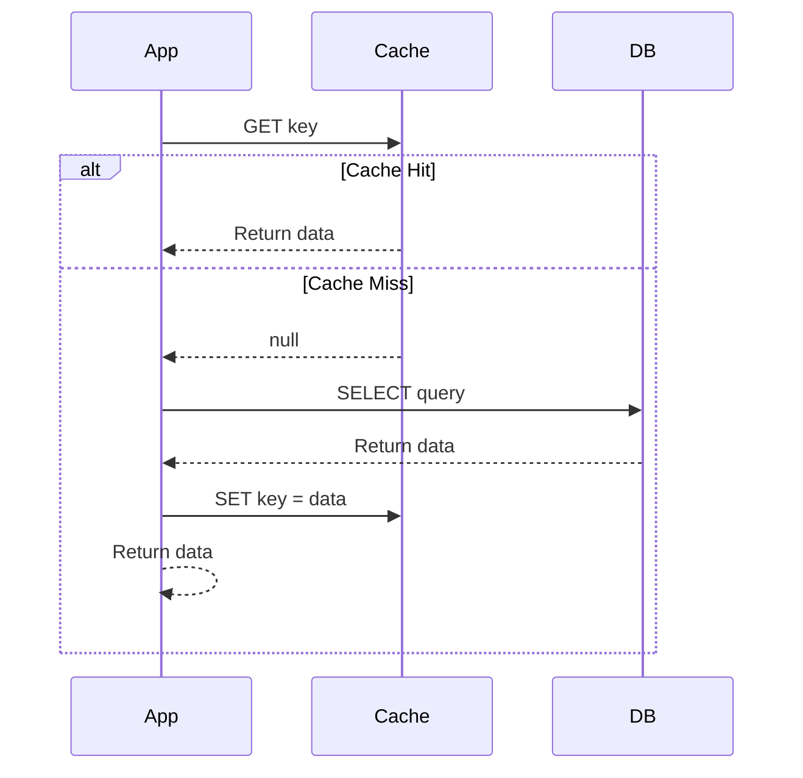
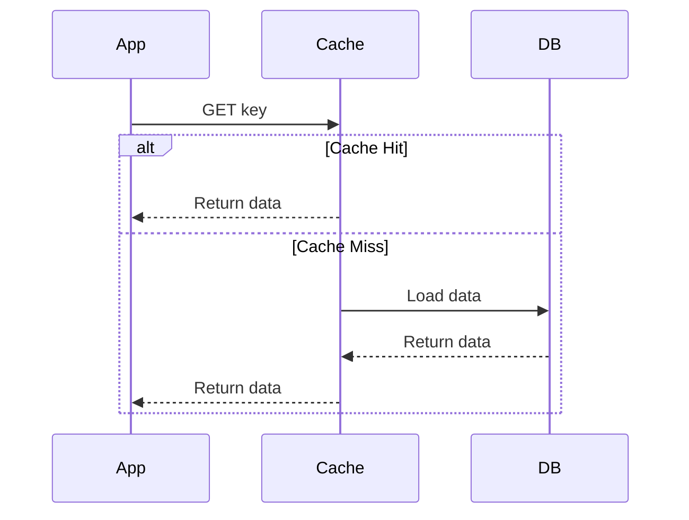
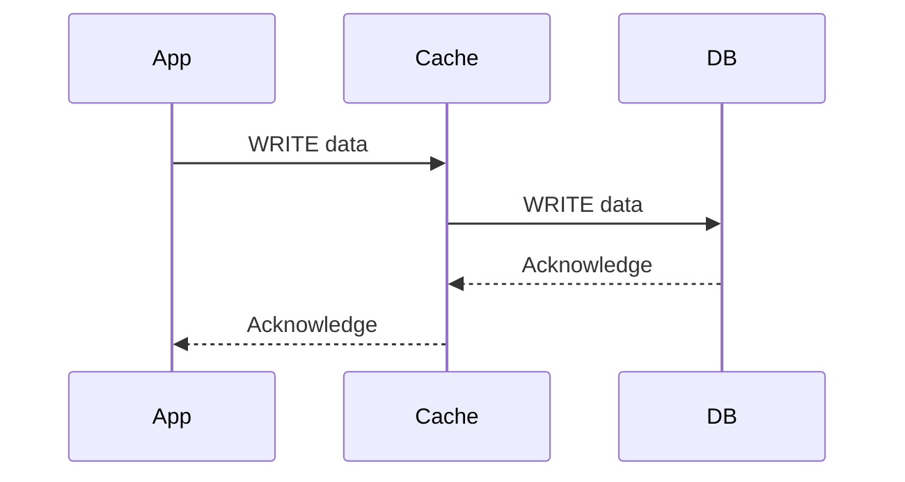
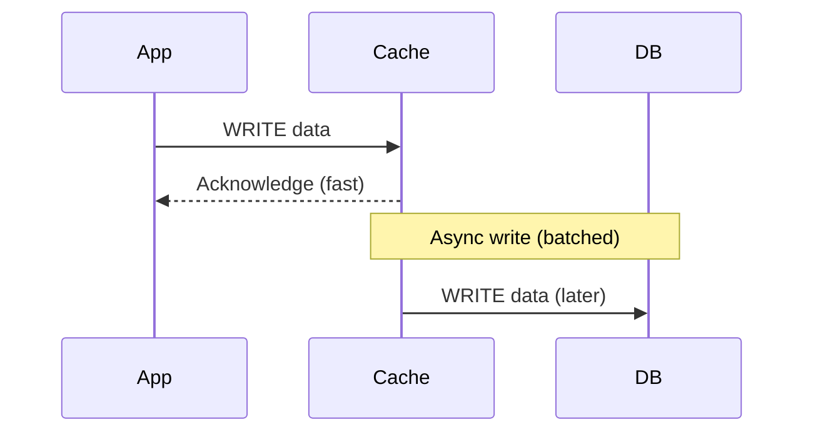
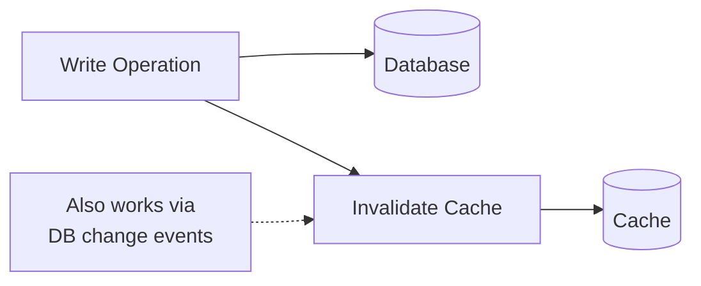
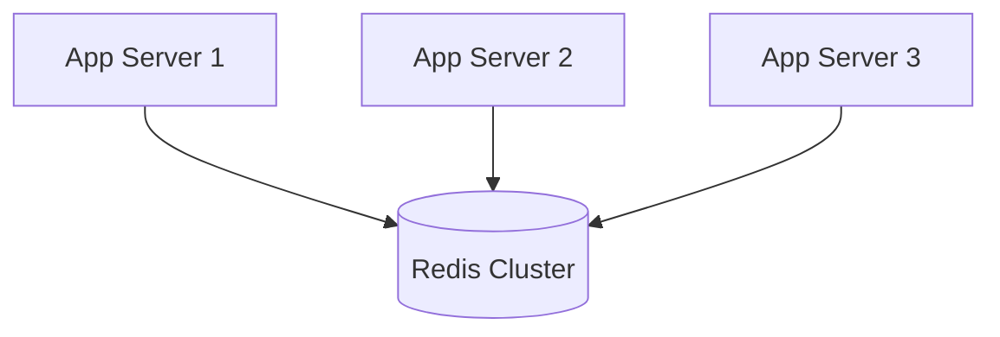
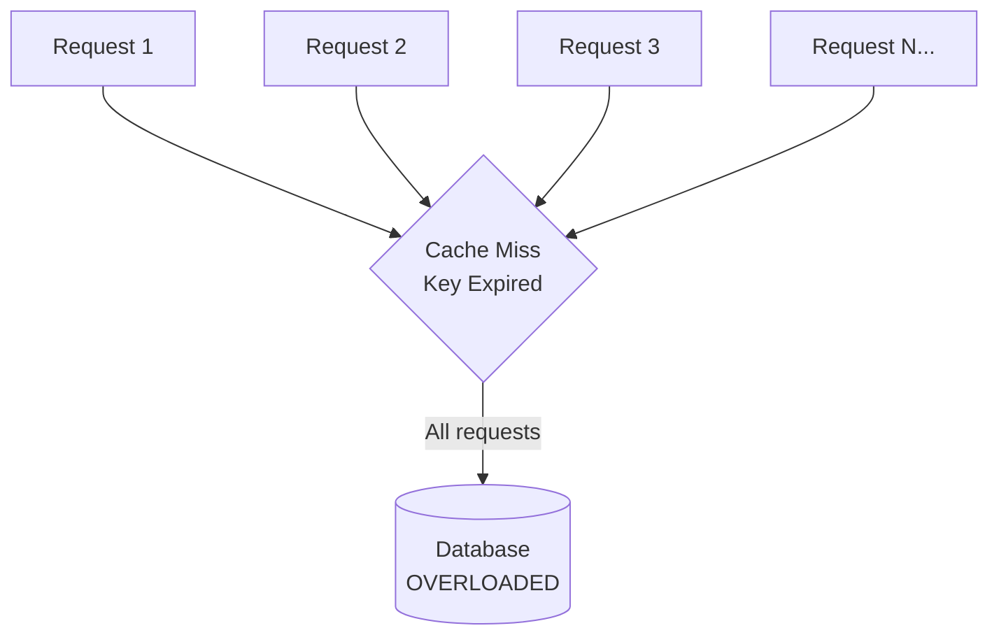

# Caching

> **Speed up reads, reduce load, and save money.** Caching stores frequently accessed data in a faster storage layer so subsequent requests can be served without hitting the slower origin. It's the single most impactful technique for improving system performance.

---

## 📑 Table of Contents

- [Why Caching?](#-why-caching)
- [Cache Strategies](#-cache-strategies)
- [Cache Invalidation](#-cache-invalidation)
- [Distributed Caching](#-distributed-caching)
- [CDN Caching](#-cdn-caching)
- [Application-level Caching](#-application-level-caching)
- [Cache Problems](#-cache-problems)
- [Related Topics](#-related-topics)

---

## 🧠 Why Caching?

```text
Without cache:   Client → App Server → Database (10-100ms)
With cache:      Client → App Server → Cache (0.1-1ms) → DB only on cache miss
```

**Impact of caching:**

| Metric | Without Cache | With Cache (90% hit rate) |
|--------|--------------|--------------------------|
| Average latency | 50ms | 6ms |
| DB queries/sec | 10,000 | 1,000 |
| DB cost | $$$ | $ |
| User experience | Acceptable | Fast |

---

## 🎯 Cache Strategies

### Cache-Aside (Lazy Loading)

The application manages the cache explicitly. Read from cache first; on miss, read from DB and populate cache.



```python
def get_user(user_id: str) -> dict:
    # 1. Check cache
    cached = cache.get(f"user:{user_id}")
    if cached:
        return cached

    # 2. Cache miss — read from DB
    user = db.query("SELECT * FROM users WHERE id = %s", (user_id,))

    # 3. Populate cache
    cache.set(f"user:{user_id}", user, ttl=3600)
    return user
```

**Pros:** Only requested data is cached; cache failures don't break the system.
**Cons:** Cache miss has triple penalty (cache check + DB read + cache write); data can become stale.

### Read-Through

The cache sits in front of the DB. The cache itself loads data from DB on a miss.



**Pros:** Application code is simpler (no cache management logic).
**Cons:** First request is always slow; cache library must support DB loading.

### Write-Through

Data is written to the cache and DB simultaneously. The cache is always consistent.



**Pros:** Cache is always consistent with DB; reads are always fast.
**Cons:** Write latency increases (two writes); cache may hold data that's never read.

### Write-Behind (Write-Back)

Data is written to the cache immediately, then asynchronously written to the DB.



**Pros:** Very fast writes; batching reduces DB load.
**Cons:** Risk of data loss if cache fails before DB write; added complexity.

### Strategy Comparison

| Strategy | Read Performance | Write Performance | Consistency | Complexity |
|----------|-----------------|-------------------|-------------|-----------|
| **Cache-aside** | Good (after warm-up) | N/A (writes go to DB) | Eventual | Low |
| **Read-through** | Good (after warm-up) | N/A | Eventual | Medium |
| **Write-through** | Excellent | Slower (sync write) | Strong | Medium |
| **Write-behind** | Excellent | Fastest | Eventual | High |

**When to use what:**

| Scenario | Recommended Strategy |
|----------|---------------------|
| Read-heavy, stale data OK | Cache-aside |
| Read-heavy, consistency needed | Write-through + read-through |
| Write-heavy | Write-behind |
| Mixed, simple implementation | Cache-aside |

---

## 🔄 Cache Invalidation

> "There are only two hard things in Computer Science: cache invalidation and naming things." — Phil Karlton

### TTL (Time-to-Live)

Set an expiration time on cached data. Simplest approach.

```python
# Set key with 1-hour TTL
cache.set("user:123", user_data, ttl=3600)

# Redis command
# SET user:123 "{...}" EX 3600
```

**Choosing TTL values:**

| Data Type | Suggested TTL | Rationale |
|-----------|--------------|-----------|
| User profile | 5-15 minutes | Moderate change frequency |
| Product catalog | 1-4 hours | Changes are batched |
| Configuration | 1-5 minutes | Needs to propagate quickly |
| Session data | 30 minutes | Security consideration |
| Static content | 24 hours+ | Rarely changes |
| Analytics/counters | 30-60 seconds | Near-real-time acceptable |

### Event-Based Invalidation

Invalidate cache when the underlying data changes.



```python
def update_user(user_id: str, data: dict):
    # 1. Update database
    db.execute("UPDATE users SET ... WHERE id = %s", (user_id,))

    # 2. Invalidate cache
    cache.delete(f"user:{user_id}")
    # Next read will cache-miss and fetch fresh data
```

**Pattern: Delete vs Update cache?**

| Approach | Pros | Cons |
|----------|------|------|
| **Delete on write** | Simple, no stale data risk | Next read has cache miss |
| **Update on write** | No cache miss penalty | Race conditions possible |

**Recommended:** Delete on write (cache-aside). Simpler and avoids race conditions.

### Version-Based Invalidation

Include a version number in the cache key.

```python
# Version is incremented on data change
cache_key = f"user:{user_id}:v{version}"

# When data changes, increment version
# Old cache entries expire naturally via TTL
```

---

## 🌐 Distributed Caching

### Redis

In-memory data store used as a distributed cache, message broker, and more.



**Key features:**

- Data structures: strings, hashes, lists, sets, sorted sets
- Persistence: RDB snapshots, AOF logging
- Clustering: automatic sharding across nodes
- Pub/sub: real-time messaging
- Lua scripting: atomic operations

**Redis cluster modes:**

| Mode | Description | Use When |
|------|-------------|----------|
| Standalone | Single node | Development, small scale |
| Sentinel | Automatic failover | HA without sharding |
| Cluster | Sharding + HA | Large datasets, high throughput |

### Memcached

Simple, high-performance distributed cache. Key-value only.

**Redis vs Memcached:**

| Feature | Redis | Memcached |
|---------|-------|-----------|
| Data structures | Rich (strings, hashes, lists, sets, sorted sets) | Key-value only |
| Persistence | Yes (RDB, AOF) | No |
| Clustering | Built-in | Client-side |
| Pub/sub | Yes | No |
| Lua scripting | Yes | No |
| Multi-threaded | Single-threaded (I/O threads in 6.0+) | Multi-threaded |
| Memory efficiency | Less (overhead for data structures) | More (simple slab allocator) |
| Use case | Feature-rich caching, sessions, queues | Simple, high-throughput caching |

**When to choose Memcached:** Simple key-value caching at very high throughput, multi-threaded performance.

**When to choose Redis:** Complex data structures, persistence, pub/sub, or Lua scripting.

---

## 🌍 CDN Caching

Cache content at edge servers geographically close to users.


**Cache-Control headers:**

```http
# Cache for 1 hour, allow CDN caching
Cache-Control: public, max-age=3600

# Cache for 1 hour, but revalidate with origin
Cache-Control: public, max-age=3600, must-revalidate

# Don't cache at all
Cache-Control: no-store

# Cache privately (browser only, not CDN)
Cache-Control: private, max-age=600

# Stale content OK while revalidating
Cache-Control: public, max-age=3600, stale-while-revalidate=60
```

**What to CDN-cache:**

| Content Type | Cache Strategy | TTL |
|-------------|---------------|-----|
| Static assets (JS, CSS) | Immutable with versioned URLs | 1 year |
| Images | Long TTL with cache busting | 1-30 days |
| HTML pages | Short TTL or no-cache | 0-5 minutes |
| API responses (public) | Short TTL | 1-60 seconds |
| API responses (private) | Don't CDN-cache | — |

---

## 💻 Application-level Caching

### In-Memory Cache

For data that's expensive to compute and doesn't change often.

```python
from functools import lru_cache

@lru_cache(maxsize=1024)
def expensive_computation(param: str) -> dict:
    """Cache results of expensive computation."""
    # This result is cached in application memory
    return compute_heavy_result(param)
```

```go
// Go: simple in-memory cache with sync.Map
var cache sync.Map

func GetConfig(key string) (string, bool) {
    if val, ok := cache.Load(key); ok {
        return val.(string), true
    }
    // Cache miss — load from source
    val := loadFromSource(key)
    cache.Store(key, val)
    return val, true
}
```

**When to use in-memory caching:**

- Configuration data (loaded at startup, refreshed periodically)
- Computed results that are expensive and deterministic
- Small reference data (country codes, feature flags)

**When NOT to use:**

- Data that must be consistent across multiple instances
- Large datasets that don't fit in memory
- Data that changes frequently

### Multi-Level Caching

```text
Request → L1 (Local Memory) → L2 (Redis) → L3 (Database)

L1: ~0.1ms, small, per-instance
L2: ~1ms, large, shared across instances
L3: ~10-100ms, source of truth
```

---

## ⚠️ Cache Problems

### Cache Stampede (Thundering Herd)

Many requests arrive simultaneously for the same expired cache key, all hitting the database at once.



**Solutions:**

| Solution | How It Works |
|----------|-------------|
| **Locking** | First request acquires lock and populates cache; others wait |
| **Early expiration** | Refresh cache before TTL expires (probabilistic early expiration) |
| **Stale-while-revalidate** | Serve stale data while refreshing in background |
| **Request coalescing** | Collapse duplicate concurrent requests into one |

```python
import threading

_locks = {}

def get_with_lock(key: str) -> dict:
    cached = cache.get(key)
    if cached:
        return cached

    # Acquire a per-key lock
    if key not in _locks:
        _locks[key] = threading.Lock()

    with _locks[key]:
        # Double-check after acquiring lock
        cached = cache.get(key)
        if cached:
            return cached

        # Only one request hits DB
        data = db.query(key)
        cache.set(key, data, ttl=3600)
        return data
```

### Cold Start

Cache is empty (after restart, deployment, or new cache node), causing all requests to hit the database.

**Solutions:**

- **Cache warming:** Pre-populate cache with hot data during startup
- **Gradual rollout:** Shift traffic to new cache nodes gradually
- **Fallback:** Use old cache while new cache warms up

### Cache Penetration

Requests for data that doesn't exist (neither in cache nor DB), bypassing cache every time.

**Solutions:**

| Solution | How It Works |
|----------|-------------|
| **Cache null values** | Store "key: null" with short TTL |
| **Bloom filter** | Check if key possibly exists before querying |
| **Input validation** | Reject obviously invalid requests at API level |

```python
def get_user(user_id: str) -> dict | None:
    cached = cache.get(f"user:{user_id}")
    if cached is not None:
        return cached if cached != "NULL" else None

    user = db.query("SELECT * FROM users WHERE id = %s", (user_id,))
    if user:
        cache.set(f"user:{user_id}", user, ttl=3600)
    else:
        # Cache the "not found" result with short TTL
        cache.set(f"user:{user_id}", "NULL", ttl=300)
    return user
```

### Cache Inconsistency

Cache and database have different values.

**Common causes:**

- Race condition: two writes interleave, cache has old value
- Failed cache invalidation
- Replication lag (reading from replica, cache from primary)

**Solutions:**

- Use TTL as a safety net (eventually consistent)
- Delete cache on write (not update)
- Use change data capture (CDC) for cache invalidation
- Accept eventual consistency where possible

### Cache Breakdown

A single very popular key expires, causing a burst of DB requests.

**Solutions:** Same as cache stampede — locking, early refresh, stale-while-revalidate. For extremely hot keys, consider never expiring them and refreshing in background.

---

## 📊 Cache Metrics to Monitor

| Metric | Target | Alert When |
|--------|--------|-----------|
| Hit rate | > 90% | < 80% |
| Miss rate | < 10% | > 20% |
| Latency (p99) | < 5ms | > 10ms |
| Eviction rate | Low | Spike (needs more memory) |
| Memory usage | < 80% capacity | > 90% |
| Connection count | Stable | Sudden increase |

---

## 🔗 Related Topics

- [Fundamentals](fundamentals.md) — System design foundations and estimation
- [Scalability](scalability.md) — Caching as part of scaling strategy
- [Load Balancing](load-balancing.md) — Distributing cached requests
- [URL Shortener](case-studies/url-shortener.md) — Caching in a real system design
- [Databases](../databases/) — Database query optimization
- [Distributed Systems](../distributed-systems/) — Distributed cache consistency
- [Observability](../observability/) — Monitoring cache performance

---

> **Cache is a trade-off between speed and freshness.** The best caching strategy depends on your consistency requirements, access patterns, and how much complexity you can manage. Start with cache-aside and TTL — add complexity only when needed.
