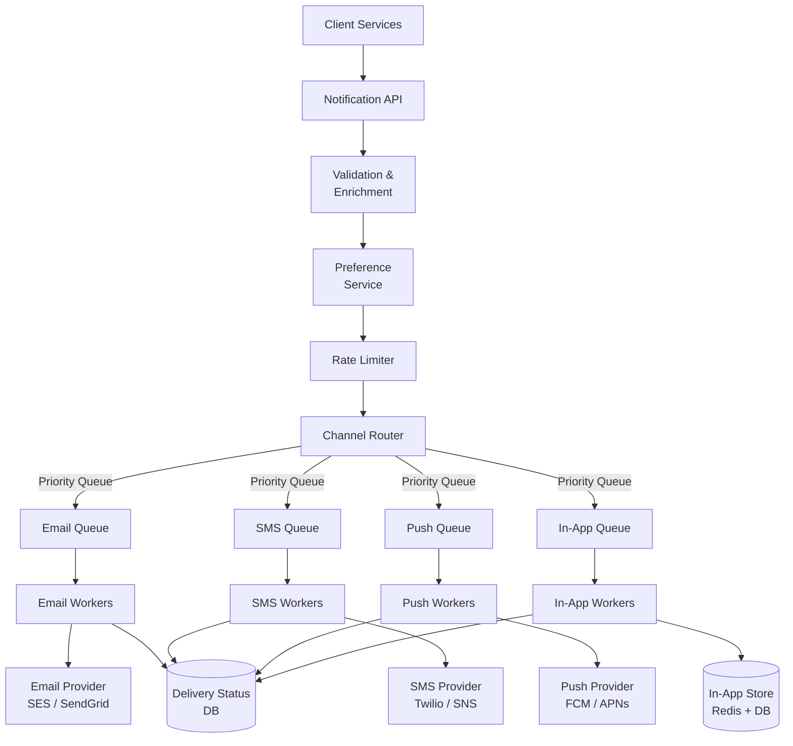
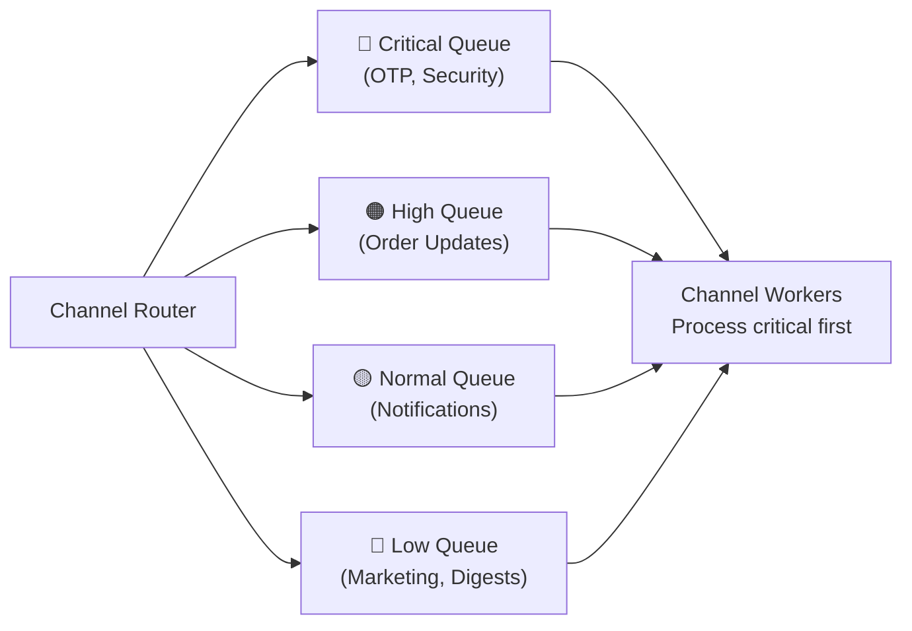
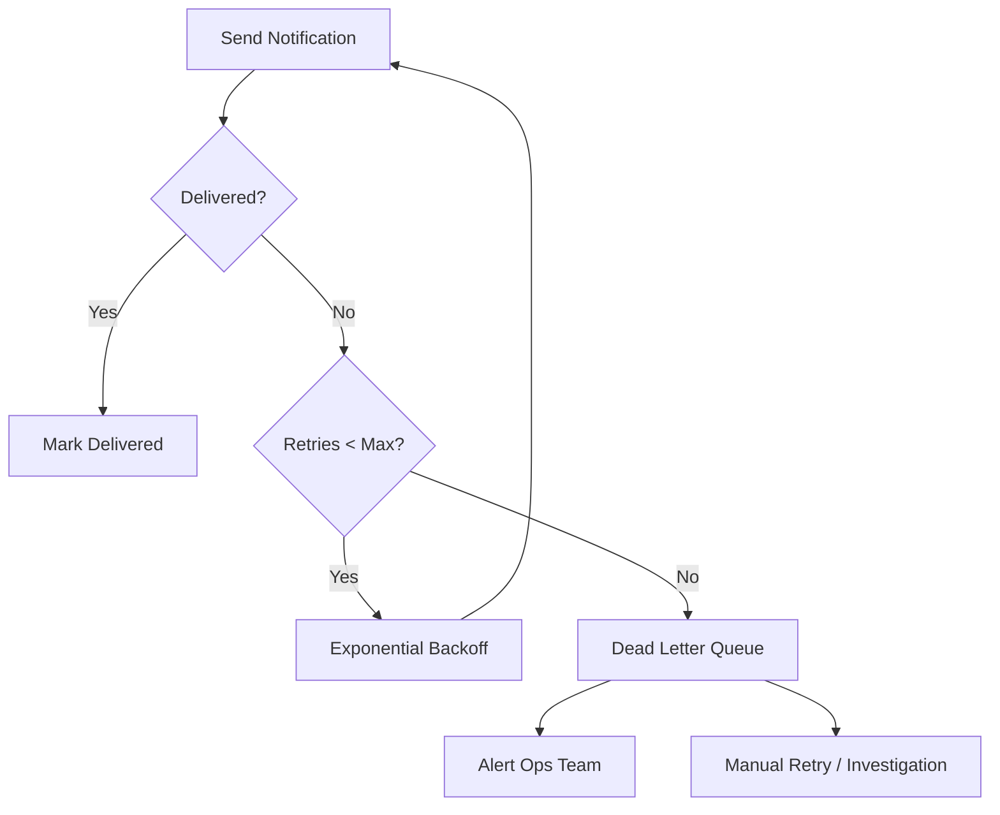
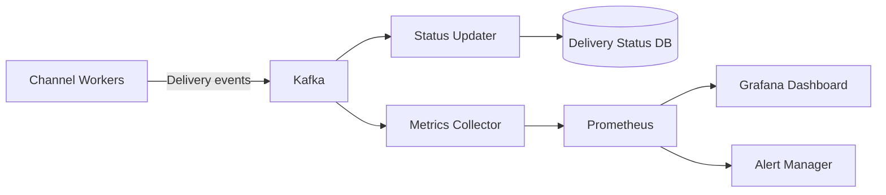

# Case Study: Notification System

> **Design a scalable, multi-channel notification system** that delivers messages via email, SMS, push notification, and in-app channels — with priority handling, templates, rate limiting, and delivery guarantees.

---

## 📑 Table of Contents

- [Requirements](#-requirements)
- [Capacity Estimation](#-capacity-estimation)
- [High-Level Architecture](#-high-level-architecture)
- [API Design](#-api-design)
- [Components Deep Dive](#-components-deep-dive)
- [Data Model](#-data-model)
- [Message Queue Design](#-message-queue-design)
- [Rate Limiting and Deduplication](#-rate-limiting-and-deduplication)
- [Failure Handling](#-failure-handling)
- [Scaling](#-scaling)
- [Observability](#-observability)
- [Trade-offs](#-trade-offs)
- [Related Topics](#-related-topics)

---

## 📋 Requirements

### Functional Requirements

1. **Multi-channel delivery:** Email, SMS, push notification, in-app
2. **Priority levels:** Critical (OTP, security alerts), high (order updates), normal (marketing), low (digests)
3. **Templates:** Support parameterized message templates per channel
4. **User preferences:** Users can opt-in/out per channel and notification type
5. **Scheduling:** Send now or schedule for future delivery
6. **Rate limiting:** Per-user and per-channel rate limits
7. **Delivery tracking:** Track sent, delivered, failed, clicked status

### Non-Functional Requirements

- **Availability:** 99.99% for critical notifications (OTP, security), 99.9% for normal
- **Latency:** Critical notifications delivered within 5 seconds, normal within 30 seconds
- **Throughput:** 1 billion notifications per day across all channels
- **Durability:** No notification loss for critical messages
- **Scalability:** Handle 10x during peak events (Black Friday, marketing campaigns)
- **At-least-once delivery:** For critical, exactly-once where possible

### Out of Scope

- Notification content creation tools
- A/B testing framework
- User analytics dashboard
- Billing for SMS/email

---

## 📊 Capacity Estimation

```text
Daily notifications: 1 billion
  - Email:       400M (40%)
  - Push:        350M (35%)
  - SMS:         100M (10%)
  - In-app:      150M (15%)

Average RPS: 1B / 86,400 ≈ 11,600 notifications/second
Peak (5x): ~58,000 notifications/second

Storage per notification record: ~500 bytes
Daily storage: 1B × 500 bytes = 500 GB/day
Monthly: 15 TB (with 30-day retention for delivery logs)
```

---

## 🏗 High-Level Architecture



---

## 🔌 API Design

### Send Notification

```text
POST /api/v1/notifications
```

**Request:**

```json
{
  "user_id": "user_123",
  "type": "order_shipped",
  "priority": "high",
  "channels": ["email", "push", "in_app"],
  "template_id": "tmpl_order_shipped",
  "template_data": {
    "order_id": "ORD-456",
    "tracking_url": "https://tracking.example.com/ORD-456",
    "estimated_delivery": "2026-09-03"
  },
  "scheduled_at": null,
  "idempotency_key": "order_shipped_ORD-456"
}
```

**Response (202 Accepted):**

```json
{
  "notification_id": "notif_abc123",
  "status": "queued",
  "channels": ["email", "push", "in_app"],
  "created_at": "2026-08-31T12:00:00Z"
}
```

### Get Notification Status

```text
GET /api/v1/notifications/{notification_id}
```

**Response:**

```json
{
  "notification_id": "notif_abc123",
  "user_id": "user_123",
  "type": "order_shipped",
  "status": "partially_delivered",
  "channels": {
    "email": { "status": "delivered", "delivered_at": "2026-08-31T12:00:05Z" },
    "push": { "status": "sent", "sent_at": "2026-08-31T12:00:02Z" },
    "in_app": { "status": "delivered", "delivered_at": "2026-08-31T12:00:01Z" }
  }
}
```

### Update User Preferences

```text
PUT /api/v1/users/{user_id}/notification-preferences
```

```json
{
  "channels": {
    "email": { "enabled": true, "quiet_hours": { "start": "22:00", "end": "08:00" } },
    "sms": { "enabled": false },
    "push": { "enabled": true },
    "in_app": { "enabled": true }
  },
  "types": {
    "marketing": { "enabled": false },
    "order_updates": { "enabled": true, "channels": ["email", "push"] },
    "security_alerts": { "enabled": true, "channels": ["email", "sms", "push"] }
  }
}
```

---

## 🔍 Components Deep Dive

### Notification API

- **Responsibility:** Accept notification requests, validate input, return immediately
- **Pattern:** Accept and queue — never block on delivery
- **Technology:** Go or Python (FastAPI), stateless, horizontally scalable
- **Idempotency:** Use `idempotency_key` to prevent duplicate sends

### Preference Service

- **Responsibility:** Check user opt-ins, quiet hours, channel preferences
- **Data store:** Redis (cached) backed by PostgreSQL
- **Logic flow:**

```text
1. Get user preferences from cache/DB
2. Filter channels based on user opt-in
3. Check quiet hours (suppress non-critical during quiet hours)
4. Return allowed channels
```

### Template Engine

- **Responsibility:** Render notification content for each channel
- **Templates:** Stored in DB, cached in memory
- **Multi-channel rendering:**

```text
Template: "order_shipped"
  Email: Full HTML with tracking link, images, footer
  SMS: "Your order {{order_id}} has shipped! Track: {{tracking_url}}"
  Push: Title: "Order Shipped" Body: "Track your order {{order_id}}"
  In-app: Structured JSON with action buttons
```

### Channel Workers

Each channel has dedicated worker pools:

| Channel | Provider | Considerations |
|---------|----------|---------------|
| **Email** | AWS SES, SendGrid | Batch sending, bounce handling, DKIM/SPF |
| **SMS** | Twilio, AWS SNS | Cost per message, international routing |
| **Push** | FCM (Android), APNs (iOS) | Token management, silent push, payload limits |
| **In-App** | Direct to Redis/DB | WebSocket for real-time, polling fallback |

---

## 🗄 Data Model

### Notifications Table

```sql
CREATE TABLE notifications (
    id              UUID PRIMARY KEY DEFAULT gen_random_uuid(),
    user_id         UUID NOT NULL,
    type            VARCHAR(100) NOT NULL,
    priority        VARCHAR(10) NOT NULL DEFAULT 'normal',
    template_id     VARCHAR(100),
    template_data   JSONB,
    idempotency_key VARCHAR(255) UNIQUE,
    status          VARCHAR(20) DEFAULT 'pending',
    created_at      TIMESTAMP WITH TIME ZONE DEFAULT NOW(),
    scheduled_at    TIMESTAMP WITH TIME ZONE
);

CREATE INDEX idx_notifications_user ON notifications(user_id, created_at DESC);
CREATE INDEX idx_notifications_status ON notifications(status) WHERE status != 'delivered';
```

### Delivery Attempts Table

```sql
CREATE TABLE delivery_attempts (
    id              BIGSERIAL PRIMARY KEY,
    notification_id UUID NOT NULL REFERENCES notifications(id),
    channel         VARCHAR(20) NOT NULL,
    status          VARCHAR(20) NOT NULL,
    provider        VARCHAR(50),
    provider_id     VARCHAR(255),
    error_message   TEXT,
    attempted_at    TIMESTAMP WITH TIME ZONE DEFAULT NOW(),
    delivered_at    TIMESTAMP WITH TIME ZONE
);

CREATE INDEX idx_delivery_notification ON delivery_attempts(notification_id);
CREATE INDEX idx_delivery_status ON delivery_attempts(status) WHERE status = 'failed';
```

### User Preferences Table

```sql
CREATE TABLE user_notification_preferences (
    user_id         UUID PRIMARY KEY,
    preferences     JSONB NOT NULL DEFAULT '{}',
    updated_at      TIMESTAMP WITH TIME ZONE DEFAULT NOW()
);
```

### Templates Table

```sql
CREATE TABLE notification_templates (
    id              VARCHAR(100) PRIMARY KEY,
    name            VARCHAR(255) NOT NULL,
    channels        JSONB NOT NULL,
    -- channels: { "email": { "subject": "...", "body_html": "..." }, "sms": { "body": "..." }, ... }
    version         INTEGER DEFAULT 1,
    active          BOOLEAN DEFAULT true,
    created_at      TIMESTAMP WITH TIME ZONE DEFAULT NOW()
);
```

---

## 📨 Message Queue Design

### Priority Queues



**Implementation with Kafka:**

```text
Topics per channel with priority:
  - notifications.email.critical
  - notifications.email.high
  - notifications.email.normal
  - notifications.email.low

Workers consume in priority order:
  1. Poll critical queue first
  2. If empty, poll high queue
  3. If empty, poll normal queue
  4. If empty, poll low queue
```

### Retry with Exponential Backoff

```text
Attempt 1: Immediate
Attempt 2: Wait 1 second
Attempt 3: Wait 4 seconds
Attempt 4: Wait 16 seconds
Attempt 5: Wait 60 seconds (capped)

After 5 failures → Dead Letter Queue (DLQ)
```

```python
import time

def calculate_backoff(attempt: int, base: float = 1.0, cap: float = 60.0) -> float:
    """Calculate exponential backoff with jitter."""
    delay = min(base * (2 ** attempt), cap)
    jitter = delay * 0.1 * random.random()  # 10% jitter
    return delay + jitter
```

---

## 🚦 Rate Limiting and Deduplication

### Per-User Rate Limiting

```text
Rules:
  - Max 5 SMS per user per hour
  - Max 20 push notifications per user per day
  - Max 3 marketing emails per user per week
  - No limits for critical notifications (OTP, security)
```

**Implementation (Redis):**

```python
def check_rate_limit(user_id: str, channel: str) -> bool:
    """Check if user has exceeded rate limit for channel."""
    key = f"ratelimit:{channel}:{user_id}"
    window = RATE_LIMITS[channel]["window"]  # e.g., 3600 for hourly
    limit = RATE_LIMITS[channel]["limit"]    # e.g., 5 for SMS

    current = redis.incr(key)
    if current == 1:
        redis.expire(key, window)
    return current <= limit
```

### Deduplication

Prevent the same notification from being sent twice:

```text
1. Use idempotency_key from the API request
2. Check Redis: SETNX idempotency:{key} 1 EX 86400
3. If key exists → duplicate, skip
4. If key doesn't exist → new notification, process
```

---

## 🔧 Failure Handling

### Retry Strategy



### Dead Letter Queue (DLQ)

Messages that fail all retry attempts go to a DLQ for investigation:

```text
DLQ message contains:
  - Original notification
  - All delivery attempts with timestamps
  - Error messages from each attempt
  - Channel and provider information
```

### Circuit Breaker

Protect against provider outages:

```text
States:
  CLOSED → Normal operation, requests pass through
  OPEN   → Provider is down, fail fast (don't even try)
  HALF-OPEN → Test with limited requests to check recovery

Transitions:
  CLOSED → OPEN: 5 failures in 60 seconds
  OPEN → HALF-OPEN: After 30 seconds
  HALF-OPEN → CLOSED: 3 consecutive successes
  HALF-OPEN → OPEN: Any failure
```

### Fallback Strategy

```text
If primary email provider (SES) fails:
  → Try secondary provider (SendGrid)

If push notification fails (token expired):
  → Fall back to in-app notification

If all channels fail for critical notification:
  → Alert on-call team immediately
```

---

## 📈 Scaling

### Per-Channel Worker Scaling

```text
Email Workers:  Scale based on email queue depth
SMS Workers:    Scale based on SMS queue depth (rate limited by provider)
Push Workers:   Scale based on push queue depth
In-App Workers: Scale based on WebSocket connections

Auto-scaling triggers:
  - Queue depth > 10,000 messages → Scale up
  - Queue depth < 100 messages → Scale down
  - Worker CPU > 70% → Scale up
```

### Partitioned Queues

```text
Kafka partitions per channel:
  - Email: 32 partitions (highest volume)
  - Push: 24 partitions
  - In-App: 16 partitions
  - SMS: 8 partitions (lower volume, provider rate-limited)

Partition key: user_id
  → Ensures ordering per user within a channel
  → Enables per-user rate limiting in workers
```

### Database Scaling

```text
Notifications table: Partitioned by created_at (monthly)
Delivery attempts: Partitioned by attempted_at (weekly)
Retention: 30 days for delivery logs, 90 days for notifications
Archive: Move old data to cold storage (S3 + Athena for queries)
```

---

## 📊 Observability

### Key Metrics

| Metric | Description | Alert Threshold |
|--------|-------------|----------------|
| Delivery rate | Successful deliveries / total sent | < 95% (per channel) |
| Delivery latency (p99) | Time from API call to delivered | > 10s critical, > 60s normal |
| Queue depth | Pending messages per channel | > 50,000 |
| Error rate | Failed deliveries / total attempts | > 5% |
| DLQ depth | Messages in dead letter queue | > 100 |
| Provider error rate | Errors per provider | > 2% |
| Rate limit hits | Users hitting rate limits | Spike detection |

### Delivery Tracking Pipeline



### Logging

```text
Every notification event logged with:
  - notification_id (correlation ID)
  - user_id
  - channel
  - status (queued, sent, delivered, failed)
  - timestamp
  - provider response

Structured logging format (JSON) for easy querying.
```

→ See [Observability](../../observability/) for Prometheus, Grafana, and OpenTelemetry setup

---

## ⚖️ Trade-offs

| Decision | Chose | Over | Rationale |
|----------|-------|------|-----------|
| Processing | Async (queue-based) | Sync (API blocks) | Don't block on delivery, handle spikes |
| Queue | Kafka | RabbitMQ | Replay, ordering, high throughput |
| Worker model | Per-channel workers | Unified workers | Independent scaling, isolation |
| Delivery guarantee | At-least-once | Exactly-once | Simpler; deduplication handles duplicates |
| Priority | Separate queues | Single queue with priority field | Prevents low-priority flood blocking critical |
| Template storage | DB + in-memory cache | File-based | Dynamic updates, versioning |

### What Would Change at 10x Scale

- **Regional deployment:** Deploy notification services in multiple regions
- **Dedicated provider connections:** Pool connections to email/SMS providers
- **Streaming delivery status:** Replace polling with WebSocket/SSE for real-time status
- **ML-based channel optimization:** Predict which channel has highest engagement per user
- **Tiered storage:** Hot (Redis) → Warm (PostgreSQL) → Cold (S3) for notification history

---

## 🔗 Related Topics

- [Fundamentals](../fundamentals.md) — System design process and estimation
- [Scalability](../scalability.md) — Scaling patterns used in this design
- [Caching](../caching.md) — Caching user preferences and templates
- [Load Balancing](../load-balancing.md) — Traffic distribution to API servers
- [API Design](../api-design.md) — REST API patterns, rate limiting
- [URL Shortener](url-shortener.md) — Another system design case study
- [Event-Driven Architecture](../../architecture/event-driven.md) — Queue-based processing
- [Microservices](../../architecture/microservices.md) — Service decomposition patterns
- [Distributed Systems](../../distributed-systems/) — Kafka, message ordering
- [Observability](../../observability/) — Monitoring and alerting

---

> **A notification system is a study in trade-offs.** Speed vs reliability, simplicity vs flexibility, cost vs coverage. The key insight: treat notification delivery as an asynchronous pipeline, not a synchronous request. This enables independent scaling, graceful degradation, and reliable delivery.
