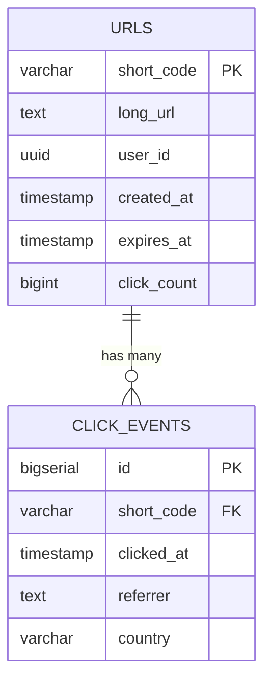
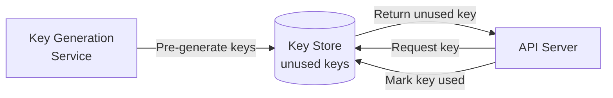
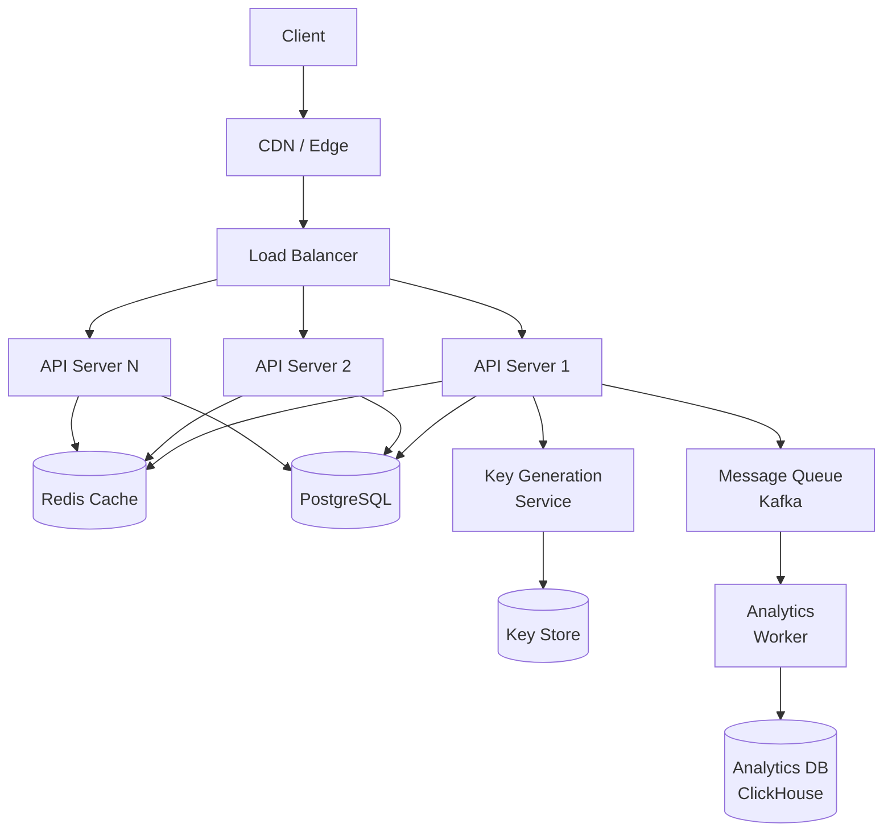
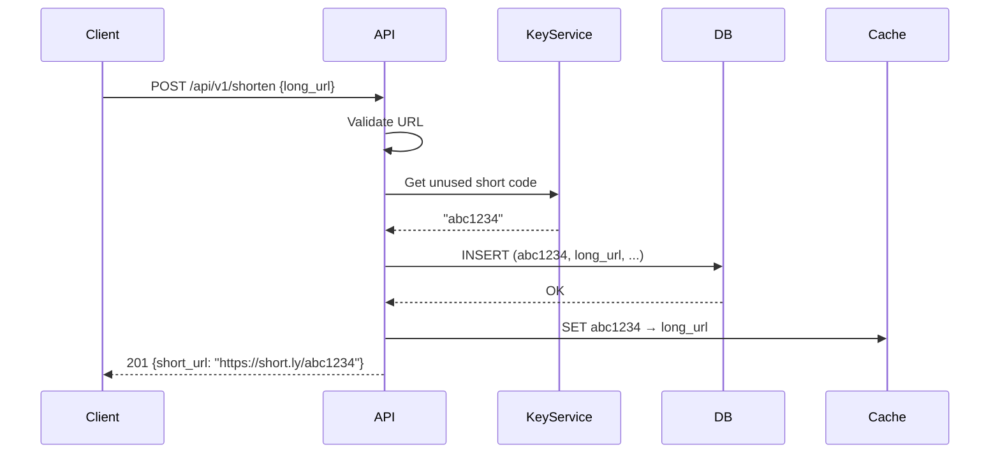
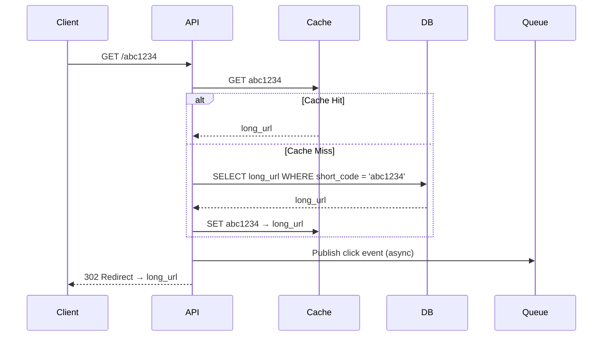
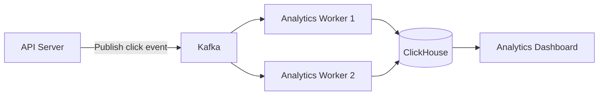

# Case Study: URL Shortener

> **A classic system design problem — simple on the surface, rich in engineering decisions underneath.** Design a service that takes long URLs and generates short, unique URLs that redirect to the original.

---

## 📑 Table of Contents

- [Requirements](#-requirements)
- [Capacity Estimation](#-capacity-estimation)
- [API Design](#-api-design)
- [Data Model](#-data-model)
- [Short Code Generation](#-short-code-generation)
- [High-Level Architecture](#-high-level-architecture)
- [Components Deep Dive](#-components-deep-dive)
- [Read and Write Flows](#-read-and-write-flows)
- [Scaling](#-scaling)
- [Analytics](#-analytics)
- [Failure Scenarios](#-failure-scenarios)
- [Trade-offs](#-trade-offs)
- [Related Topics](#-related-topics)

---

## 📋 Requirements

### Functional Requirements

1. **Shorten:** Given a long URL, generate a short unique URL
2. **Redirect:** Given a short URL, redirect to the original long URL
3. **Custom codes:** Users can optionally provide a custom short code
4. **Expiration:** URLs can have a configurable TTL (default: 5 years)
5. **Analytics:** Track click count, referrer, geo location, timestamp

### Non-Functional Requirements

- **Availability:** 99.99% uptime (read path is critical)
- **Latency:** p99 < 50ms for redirects, p99 < 200ms for shortening
- **Throughput:** Handle 10B+ redirects per month
- **Durability:** No data loss — once created, a URL must always resolve
- **Scalability:** Support 100M new URLs per month, growing 20% yearly
- **Consistency:** Eventual consistency for analytics, strong for URL creation

### Out of Scope

- User authentication system
- Rate limiting (covered separately in [API Design](../api-design.md))
- Admin dashboard
- Spam/abuse detection

---

## 📊 Capacity Estimation

### Traffic

```text
New URLs: 100M per month = ~40 writes/second
Redirects (100:1 read:write ratio): 10B per month = ~4,000 reads/second
Peak (3x): ~120 writes/sec, ~12,000 reads/sec
```

### Storage

```text
Per URL record:
  short_code:    7 bytes
  long_url:      200 bytes (average)
  user_id:       8 bytes (optional)
  created_at:    8 bytes
  expires_at:    8 bytes
  click_count:   8 bytes
  metadata:      50 bytes
  Total:         ~290 bytes

Monthly: 100M × 290 bytes = 29 GB
5 years: 29 GB × 60 = 1.74 TB
With 3x replication + 30% index overhead: ~7 TB
```

### Bandwidth

```text
Write: 40/sec × 290 bytes = 11.6 KB/s (negligible)
Read:  4,000/sec × 290 bytes = 1.16 MB/s
       Including HTTP headers (~500 bytes): 4,000 × 790 = 3.16 MB/s
```

### Cache

```text
80/20 rule: 20% of URLs get 80% of traffic
Daily unique URLs accessed: ~100M
Cache 20%: 20M × 290 bytes ≈ 5.8 GB → easily fits in Redis
```

---

## 🔌 API Design

### Shorten URL

```text
POST /api/v1/shorten
```

**Request:**

```json
{
  "long_url": "https://example.com/very/long/path?with=params",
  "custom_code": "my-link",
  "expires_in": 86400
}
```

**Response (201 Created):**

```json
{
  "short_url": "https://short.ly/abc1234",
  "short_code": "abc1234",
  "long_url": "https://example.com/very/long/path?with=params",
  "created_at": "2026-08-31T12:00:00Z",
  "expires_at": "2026-09-01T12:00:00Z"
}
```

### Redirect

```text
GET /{shortCode}
```

**Response (301/302 Redirect):**

```http
HTTP/1.1 301 Moved Permanently
Location: https://example.com/very/long/path?with=params
```

**301 vs 302:**

| Code | Type | Browser Caches? | Analytics Impact |
|------|------|----------------|-----------------|
| 301 | Permanent | Yes | Misses subsequent clicks |
| 302 | Temporary | No | Captures every click |

**Choice:** Use **302** if analytics matter, **301** if SEO and caching matter.

### Get Analytics

```text
GET /api/v1/analytics/{shortCode}
```

**Response:**

```json
{
  "short_code": "abc1234",
  "total_clicks": 15234,
  "clicks_today": 142,
  "top_referrers": ["google.com", "twitter.com"],
  "top_countries": ["US", "UK", "DE"],
  "created_at": "2026-08-31T12:00:00Z"
}
```

---

## 🗄 Data Model

### URL Table

```sql
CREATE TABLE urls (
    short_code   VARCHAR(16) PRIMARY KEY,
    long_url     TEXT NOT NULL,
    user_id      UUID,
    created_at   TIMESTAMP WITH TIME ZONE DEFAULT NOW(),
    expires_at   TIMESTAMP WITH TIME ZONE,
    click_count  BIGINT DEFAULT 0
);

-- Index for cleanup of expired URLs
CREATE INDEX idx_urls_expires_at ON urls(expires_at) WHERE expires_at IS NOT NULL;

-- Index for user lookups
CREATE INDEX idx_urls_user_id ON urls(user_id) WHERE user_id IS NOT NULL;
```

### Click Events Table (Analytics)

```sql
CREATE TABLE click_events (
    id           BIGSERIAL PRIMARY KEY,
    short_code   VARCHAR(16) NOT NULL,
    clicked_at   TIMESTAMP WITH TIME ZONE DEFAULT NOW(),
    referrer     TEXT,
    user_agent   TEXT,
    ip_address   INET,
    country      VARCHAR(2),
    city         VARCHAR(100)
);

-- Partition by month for efficient querying and cleanup
-- CREATE TABLE click_events_2026_08 PARTITION OF click_events
--     FOR VALUES FROM ('2026-08-01') TO ('2026-09-01');

CREATE INDEX idx_click_events_short_code ON click_events(short_code, clicked_at);
```

### Entity Relationship



---

## 🔑 Short Code Generation

The core challenge: generate short, unique, hard-to-predict codes.

### Approach 1: Hash-Based

```text
hash(long_url) → take first 7 characters → short_code
```

```python
import hashlib
import base64

def generate_hash_code(long_url: str) -> str:
    """Generate short code using MD5 hash + base62 encoding."""
    md5_hash = hashlib.md5(long_url.encode()).digest()
    # Base64 encode and take first 7 chars
    b64 = base64.urlsafe_b64encode(md5_hash).decode()
    return b64[:7].replace("-", "a").replace("_", "b")
```

**Pros:** Same URL always gets the same code (deduplication).
**Cons:** Collisions possible (need retry logic), predictable.

### Approach 2: Counter-Based (Auto-increment)

```text
counter = 1, 2, 3, ...
short_code = base62_encode(counter)
```

```python
BASE62_CHARS = "0123456789ABCDEFGHIJKLMNOPQRSTUVWXYZabcdefghijklmnopqrstuvwxyz"

def base62_encode(num: int) -> str:
    """Encode integer to base62 string."""
    if num == 0:
        return BASE62_CHARS[0]
    result = []
    while num > 0:
        result.append(BASE62_CHARS[num % 62])
        num //= 62
    return "".join(reversed(result))

# base62_encode(1000000) → "4C92"
# base62_encode(56800235583) → "zzzzzz" (max 6-char code)
```

**Pros:** Simple, no collisions, sequential.
**Cons:** Predictable (users can guess next code), single counter bottleneck.

### Approach 3: Pre-Generated Key Service (Recommended)



**How it works:**

1. Offline service generates random 7-char base62 codes
2. Stores them in a key database (unused pool)
3. When API needs a new code, it takes one from the unused pool
4. Key is atomically moved from unused to used

```text
Code space: 62^7 = 3.5 trillion possible codes
At 100M/month, this lasts ~35,000 years → no exhaustion risk
```

**Pros:** No collisions, unpredictable, fast (just a DB lookup).
**Cons:** Need to maintain key service, storage for pre-generated keys.

### Comparison

| Approach | Collisions | Predictability | Performance | Complexity |
|----------|-----------|---------------|-------------|-----------|
| Hash-based | Possible | Medium | Fast | Low |
| Counter-based | None | High (sequential) | Fast | Low |
| Pre-generated keys | None | Low | Fast | Medium |

---

## 🏗 High-Level Architecture



---

## 🔍 Components Deep Dive

### API Server

- **Technology:** Go or Python (FastAPI) — stateless, horizontally scalable
- **Responsibility:** Handle shorten requests and redirects
- **Scaling:** Horizontal, behind load balancer
- **Concurrency:** Handle 12K+ RPS per instance

### Cache Layer (Redis)

- **Caching strategy:** Cache-aside with TTL
- **What to cache:** `short_code → long_url` mapping
- **TTL:** 24 hours for active URLs, shorter for less popular
- **Eviction:** LRU (least recently used)
- **Size:** ~6 GB for hot URLs

### Database (PostgreSQL)

- **Primary store:** URL mappings, user data
- **Read replicas:** Distribute read load
- **Partitioning:** By creation date or hash of short_code
- **Backup:** Continuous WAL archiving, point-in-time recovery

### Key Generation Service

- **Pre-generates** batches of random 7-character codes
- Loads batches into memory for fast allocation
- Uses distributed coordination (e.g., ZooKeeper range allocation) if running multiple instances

---

## 🔄 Read and Write Flows

### Write Flow (Shorten URL)



### Read Flow (Redirect)



**Key points:**

- Redirect is on the hot path — must be < 50ms
- Cache hit ratio target: > 95%
- Analytics event publishing is asynchronous (doesn't block redirect)

---

## 📈 Scaling

### Cache Layer Scaling

```text
Single Redis: handles ~6 GB, 100K+ ops/sec
Redis Cluster: shard across multiple nodes for larger datasets

Hot key mitigation:
- Replicate extremely popular URLs across multiple cache nodes
- Use local in-memory cache (L1) for the hottest keys
```

### Database Scaling

```text
Phase 1: Single primary + 2 read replicas
  → Handles initial traffic easily

Phase 2: Partitioning by short_code hash
  → Shard across 4-8 database instances
  → Each shard handles a range of hash values

Phase 3: Separate analytics storage
  → Move click_events to ClickHouse or similar OLAP database
  → Time-partitioned, columnar storage for fast aggregation
```

### CDN for Redirects

For extremely popular short URLs, the CDN can handle redirects at the edge:

```text
User → CDN Edge (cache redirect for popular URLs) → Origin (only on cache miss)
```

**Cache-Control for redirects:**

```http
Cache-Control: public, max-age=3600
Location: https://example.com/original
```

---

## 📊 Analytics

### Async Click Tracking



**Click event payload:**

```json
{
  "short_code": "abc1234",
  "timestamp": "2026-08-31T12:34:56Z",
  "referrer": "https://twitter.com/post/123",
  "user_agent": "Mozilla/5.0...",
  "ip_address": "203.0.113.42",
  "country": "US",
  "city": "San Francisco"
}
```

**Why async:** Click tracking must not slow down redirects. Publishing to Kafka adds < 1ms.

### Real-time Counters

Use Redis `INCR` for real-time click counts:

```text
INCR click:abc1234:total
INCR click:abc1234:2026-08-31
```

Periodically flush to the database for durability.

---

## ⚠️ Failure Scenarios

| Failure | Impact | Mitigation |
|---------|--------|-----------|
| **Cache failure** | Increased DB load, higher latency | Cache-aside pattern; DB can handle full load |
| **Database failure** | Cannot create new URLs, redirects may fail | Read replicas for reads; failover for primary |
| **Key service failure** | Cannot generate new short codes | Keep buffer of pre-fetched codes on API servers |
| **Kafka failure** | Analytics events lost | Buffer events locally; retry when Kafka recovers |
| **API server crash** | Partial service disruption | Multiple instances behind LB; health checks |
| **CDN failure** | Slower redirects | Fall back to origin directly |
| **Short code collision** | Overwrite existing URL | Uniqueness constraint in DB; retry with new code |
| **Hot key (viral URL)** | Cache/server overload | Local cache, multiple replicas, CDN caching |

---

## ⚖️ Trade-offs

| Decision | Chose | Over | Rationale |
|----------|-------|------|-----------|
| Key generation | Pre-generated keys | Hash-based | No collisions, unpredictable, fast |
| Redirect code | 302 Temporary | 301 Permanent | Captures analytics for every click |
| Cache strategy | Cache-aside | Write-through | Simpler; not all URLs will be read |
| Analytics | Async via Kafka | Sync in request path | Don't slow down redirects |
| Database | PostgreSQL | NoSQL | ACID for URL creation; familiar tooling |
| Code length | 7 characters | 6 characters | 62^7 = 3.5T codes vs 62^6 = 56B codes |

### What Would Change at 10x Scale

- **Database:** Shard by short_code hash across 10+ nodes
- **Cache:** Redis Cluster with dedicated hot-key handling
- **CDN:** Cache redirect responses at edge for top URLs
- **Analytics:** Dedicated ClickHouse cluster with real-time ingestion
- **Key service:** Multiple instances with pre-allocated ranges
- **Geo-distribution:** Multi-region deployment with DNS-based routing

---

## 🔗 Related Topics

- [Fundamentals](../fundamentals.md) — System design process and estimation
- [Scalability](../scalability.md) — Scaling patterns used in this design
- [Caching](../caching.md) — Cache-aside pattern, Redis
- [Load Balancing](../load-balancing.md) — Traffic distribution
- [API Design](../api-design.md) — REST API design, rate limiting
- [Notification System](notification-system.md) — Another system design case study
- [Databases](../../databases/) — PostgreSQL, partitioning
- [Distributed Systems](../../distributed-systems/) — Kafka for analytics pipeline
- [Observability](../../observability/) — Monitoring redirects and analytics

---

> **The URL shortener is deceptively simple.** The core functionality is straightforward, but production-grade concerns — key generation, caching, analytics, scaling, and failure handling — reveal the depth of system design thinking required for any seemingly simple service.
