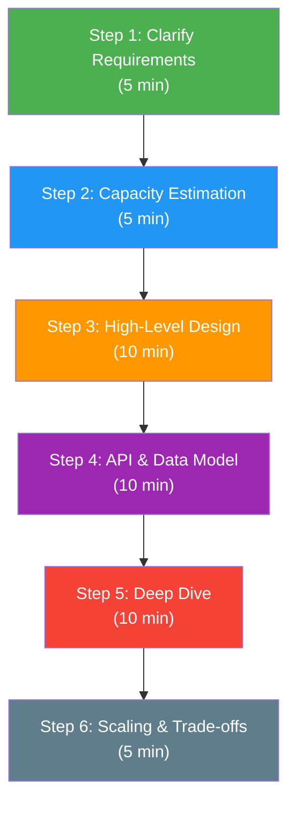
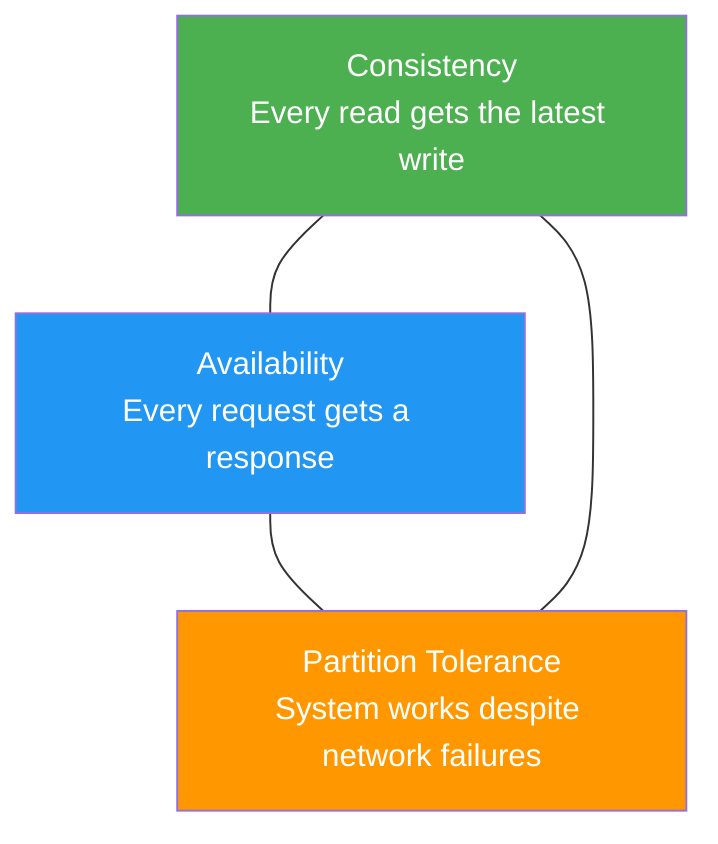
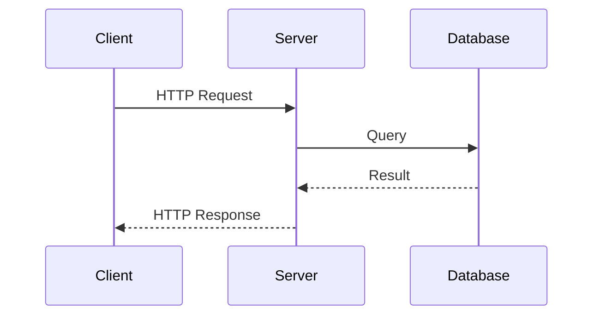
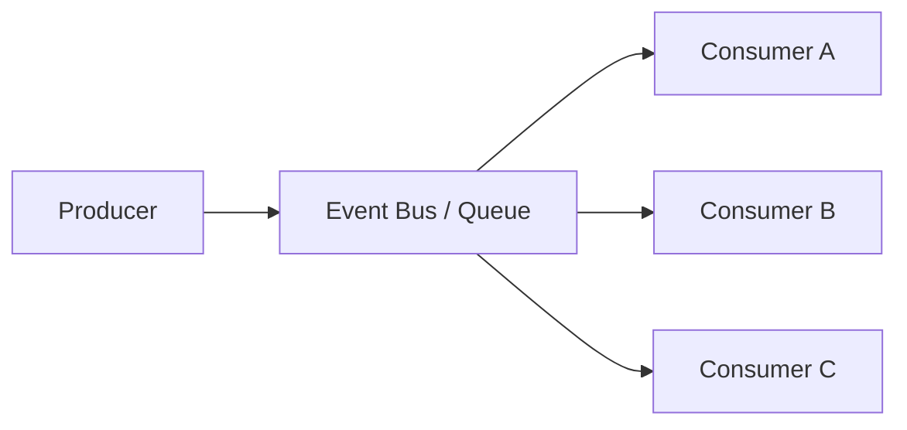
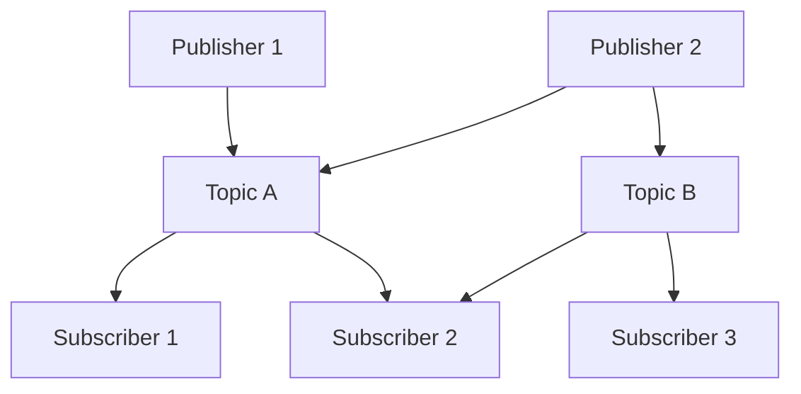
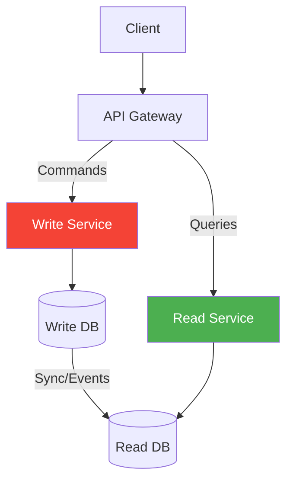
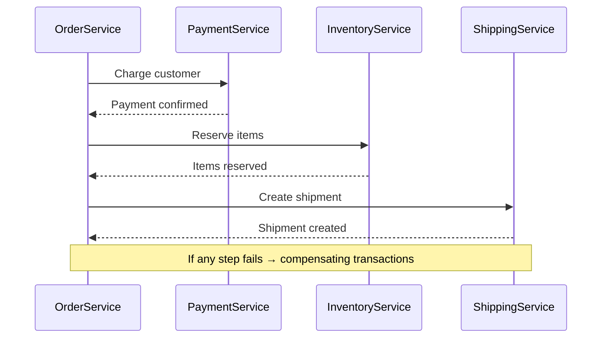

# System Design Fundamentals

> **The building blocks of every system design.** Before diving into architecture diagrams, master the fundamentals — requirements gathering, capacity estimation, key concepts, and design patterns that underpin every scalable system.

---

## 📑 Table of Contents

- [Requirements Gathering](#-requirements-gathering)
- [Capacity Estimation](#-capacity-estimation)
- [System Design Process](#-system-design-process)
- [Key Concepts](#-key-concepts)
- [Back-of-the-Envelope Calculations](#-back-of-the-envelope-calculations)
- [Design Patterns](#-design-patterns)
- [Related Topics](#-related-topics)

---

## 📋 Requirements Gathering

The first and most important step. A system designed for the wrong requirements is a failed system regardless of how elegant the architecture is.

### Functional Requirements

**What the system must do** — the features and capabilities.

Questions to ask:
- Who are the users? (end users, internal services, third-party integrations)
- What are the core use cases?
- What does the user input and what do they expect back?
- What data does the system store?
- Are there real-time requirements?
- What are the read vs write patterns?

**Example — URL Shortener:**

1. Given a long URL, generate a short unique URL
2. Given a short URL, redirect to the original URL
3. Users can optionally set custom short codes
4. Users can see click analytics for their URLs
5. URLs expire after a configurable time

### Non-Functional Requirements

**How the system should behave** — quality attributes and constraints.

| Category | Questions to Ask | Example Targets |
|----------|-----------------|-----------------|
| **Availability** | What uptime is required? Can users tolerate downtime? | 99.9% (8.77h/year downtime) |
| **Latency** | What response time is acceptable? | p99 < 200ms for reads |
| **Throughput** | How many requests per second? | 10,000 RPS |
| **Consistency** | Is eventual consistency acceptable? | Strong for writes, eventual for reads |
| **Durability** | Can we lose data? | No data loss after write acknowledgment |
| **Scalability** | How much growth is expected? | 10x in 2 years |
| **Security** | Authentication, authorization, encryption? | OAuth2, TLS, encryption at rest |
| **Cost** | Budget constraints? | Optimize for cost at lower scale |

### Questions to Always Ask

```text
1. Who are the users and how many?
2. What is the expected read:write ratio?
3. What is the data retention policy?
4. What are the peak traffic patterns?
5. Is the system read-heavy or write-heavy?
6. What consistency model is acceptable?
7. Are there geographic distribution requirements?
8. What are the SLA requirements?
9. What is the expected growth rate?
10. Are there regulatory or compliance requirements?
```

### Scope Definition

Always define what's **in scope** and **out of scope**:

```text
✅ In Scope:
- Core URL shortening and redirection
- Basic click analytics
- API access

❌ Out of Scope:
- User authentication system
- Admin dashboard
- Billing and payments
- Mobile applications
```

---

## 📊 Capacity Estimation

Back-of-the-envelope calculations determine the scale of the system and drive architectural decisions.

### Traffic Estimation

**Framework:**

```text
1. Start with monthly active users (MAU) or daily active users (DAU)
2. Estimate actions per user per day
3. Calculate requests per second (RPS)
4. Identify read:write ratio
5. Account for peak traffic (typically 2-5x average)
```

**Example — URL Shortener:**

```text
Assumptions:
- 100M new URLs created per month
- Read:Write ratio = 100:1 (reads are redirects)
- Average URL click rate: each URL clicked 100 times over its lifetime

Write traffic:
- 100M / (30 days × 24 hours × 3600 seconds) ≈ 40 URLs/second

Read traffic:
- 40 × 100 = 4,000 redirects/second

Peak traffic (3x average):
- Write: ~120 URLs/second
- Read: ~12,000 redirects/second
```

### Storage Estimation

**Framework:**

```text
1. Calculate the size of a single record
2. Multiply by number of records per day/month/year
3. Account for indexes, metadata, and replication
4. Factor in data retention policy
```

**Example — URL Shortener:**

```text
Per URL record:
- Short code: 7 bytes
- Long URL: 200 bytes (average)
- User ID: 8 bytes
- Timestamps: 16 bytes
- Metadata: 50 bytes
- Total: ~280 bytes per record

Monthly storage:
- 100M × 280 bytes = 28 GB/month

5-year storage:
- 28 GB × 60 months = 1.68 TB
- With 3x replication: ~5 TB
- With indexes (30% overhead): ~6.5 TB
```

### Bandwidth Estimation

```text
Ingress (writes):
- 40 writes/sec × 280 bytes = 11.2 KB/s

Egress (reads):
- 4,000 reads/sec × 280 bytes = 1.12 MB/s
- Including HTTP headers (~500 bytes): 4,000 × 780 = 3.12 MB/s
```

### Memory Estimation (Cache Sizing)

**80/20 rule:** Cache the top 20% of hot data.

```text
Daily read requests: 4,000/sec × 86,400 sec = 345.6M requests/day
Unique URLs accessed daily (assume 20%): 69.12M URLs

Cache size:
- 69.12M × 280 bytes ≈ 19.4 GB
- With overhead: ~25 GB → fits in a single Redis instance
```

---

## 🔄 System Design Process

### Step-by-Step Framework



### Step 1: Clarify Requirements (5 min)

- Ask clarifying questions
- Define functional and non-functional requirements
- Establish scope boundaries
- Identify key constraints

### Step 2: Capacity Estimation (5 min)

- Estimate traffic (RPS for reads and writes)
- Estimate storage needs (1 year, 5 years)
- Estimate bandwidth and cache requirements
- Identify if system is read-heavy or write-heavy

### Step 3: High-Level Design (10 min)

- Draw the major components
- Show data flow between components
- Identify the database(s) and cache
- Show external integrations

### Step 4: API & Data Model (10 min)

- Define the key API endpoints
- Design the database schema
- Choose SQL vs NoSQL
- Plan indexing strategy

### Step 5: Deep Dive (10 min)

- Pick 2-3 critical components
- Explain algorithms and data structures used
- Discuss failure modes and handling
- Address consistency and concurrency

### Step 6: Scaling & Trade-offs (5 min)

- Discuss horizontal scaling
- Caching strategy
- Database sharding
- Summarize key trade-offs

---

## 🧠 Key Concepts

### Latency

The time it takes for a request to travel from client to server and back.

```text
Latency breakdown for a typical web request:
├── DNS lookup:          1-50 ms
├── TCP handshake:       10-50 ms
├── TLS handshake:       20-100 ms
├── Request transfer:    1-10 ms
├── Server processing:   5-500 ms
├── Response transfer:   1-100 ms
└── Total:               38-810 ms
```

**Percentiles matter more than averages:**

| Percentile | Meaning | Why It Matters |
|-----------|---------|----------------|
| p50 (median) | 50% of requests are faster | General performance |
| p90 | 90% of requests are faster | Most users' experience |
| p99 | 99% of requests are faster | Worst-case for normal users |
| p99.9 | 99.9% of requests are faster | Tail latency, affects at scale |

### Throughput

The number of operations a system can handle per unit of time.

```text
Throughput measures:
- Requests per second (RPS)
- Transactions per second (TPS)
- Queries per second (QPS)
- Messages per second
- Bytes per second (bandwidth)
```

**Throughput vs Latency trade-off:** Increasing throughput (via batching, for example) often increases latency for individual requests.

### Availability

The percentage of time a system is operational and accessible.

```text
Availability = Uptime / (Uptime + Downtime)
```

| Availability | Annual Downtime | Monthly Downtime | Common Name |
|-------------|----------------|-----------------|-------------|
| 99% | 3.65 days | 7.31 hours | Two nines |
| 99.9% | 8.77 hours | 43.83 minutes | Three nines |
| 99.95% | 4.38 hours | 21.92 minutes | Three and a half nines |
| 99.99% | 52.6 minutes | 4.38 minutes | Four nines |
| 99.999% | 5.26 minutes | 26.3 seconds | Five nines |

**Combined availability** of components in series:

```text
System = Service A (99.9%) → Service B (99.9%) → Database (99.99%)
Overall = 0.999 × 0.999 × 0.9999 = 99.8%
```

**Improving availability:**

- Redundancy (replicas, multi-AZ, multi-region)
- Failover mechanisms (automatic, manual)
- Health checks and circuit breakers
- Graceful degradation

### Consistency

How up-to-date the data seen by clients is.

| Model | Guarantee | Latency | Use Cases |
|-------|-----------|---------|-----------|
| **Strong consistency** | All reads see the latest write | Higher | Banking, inventory |
| **Eventual consistency** | Reads will eventually see the latest write | Lower | Social feeds, analytics |
| **Causal consistency** | Reads respect causal ordering | Medium | Chat, collaborative editing |
| **Read-your-writes** | A client sees its own writes | Medium | User profile updates |

### CAP Theorem

In a distributed system, you can only guarantee **two of three** properties:



**In practice:** Network partitions are inevitable, so the real choice is between **CP** (consistency + partition tolerance) and **AP** (availability + partition tolerance).

| Type | Behavior During Partition | Examples |
|------|--------------------------|----------|
| **CP** | Rejects requests to maintain consistency | etcd, ZooKeeper, HBase |
| **AP** | Serves requests with potentially stale data | Cassandra, DynamoDB, CouchDB |

> **Note:** CAP applies during network partitions. In the normal case (no partition), you get all three.

### PACELC Theorem

An extension of CAP: **P**artition → choose **A** or **C**; **E**lse (no partition) → choose **L**atency or **C**onsistency.

```text
If (Partition) → choose Availability or Consistency
Else           → choose Latency or Consistency

Examples:
- DynamoDB: PA/EL (Available during partition, Low latency otherwise)
- PostgreSQL: PC/EC (Consistent always, higher latency)
- Cassandra: PA/EL (Available, low latency — tunable per query)
```

---

## 🔢 Back-of-the-Envelope Calculations

### Powers of 2

| Power | Exact Value | Approximate | Size |
|-------|------------|-------------|------|
| 2^10 | 1,024 | ~1 thousand | 1 KB |
| 2^20 | 1,048,576 | ~1 million | 1 MB |
| 2^30 | 1,073,741,824 | ~1 billion | 1 GB |
| 2^40 | 1,099,511,627,776 | ~1 trillion | 1 TB |
| 2^50 | — | ~1 quadrillion | 1 PB |

### Latency Numbers Every Developer Should Know

| Operation | Latency | Notes |
|-----------|---------|-------|
| L1 cache reference | 0.5 ns | |
| Branch mispredict | 5 ns | |
| L2 cache reference | 7 ns | |
| Mutex lock/unlock | 25 ns | |
| Main memory reference | 100 ns | |
| Compress 1KB with Snappy | 3 μs | |
| Send 1 KB over 1 Gbps network | 10 μs | |
| Read 4 KB randomly from SSD | 150 μs | |
| Read 1 MB sequentially from memory | 250 μs | |
| Round trip within same datacenter | 500 μs | |
| Read 1 MB sequentially from SSD | 1 ms | |
| HDD disk seek | 10 ms | |
| Read 1 MB sequentially from HDD | 20 ms | |
| Send packet CA → Netherlands → CA | 150 ms | |

**Key takeaways:**

- Memory is ~100x faster than SSD
- SSD is ~100x faster than HDD
- Network within datacenter is fast (~500 μs)
- Cross-continent is slow (~150 ms)
- Compression is fast — compress before sending over network

### Common Estimates

| Question | Quick Answer |
|----------|-------------|
| Seconds in a day | 86,400 ≈ ~100,000 |
| Seconds in a month | ~2.5 million |
| Seconds in a year | ~31.5 million |
| 1 million requests/day | ~12 RPS |
| 1 billion requests/day | ~12,000 RPS |
| 1 million bytes | 1 MB |
| Avg tweet/message size | ~250 bytes |
| Avg web page size | ~2 MB |
| Avg image size | ~200 KB |
| Avg video minute | ~50 MB (compressed) |

### Quick Estimation Template

```text
Daily Active Users (DAU): ______
Actions per user per day: ______
Daily requests: DAU × actions = ______
Requests per second: daily / 86,400 = ______
Peak RPS: average × 3 = ______

Storage per record: ______ bytes
Daily new records: ______
Daily storage: records × size = ______
Annual storage: daily × 365 = ______
5-year storage (with replication): annual × 5 × 3 = ______

Cache (20% of daily data): daily unique × size × 0.2 = ______
```

---

## 🏗 Design Patterns

### Request-Response

The simplest pattern. Client sends a request, server processes it, returns a response.



**Use when:** Simple CRUD operations, synchronous workflows, low latency required.

**Limitations:** Client blocks while waiting, doesn't scale well for long-running operations.

### Event-Driven

Components communicate by producing and consuming events asynchronously.



**Use when:** Decoupled services, eventual consistency acceptable, need to fan-out to multiple consumers.

→ See [Event-Driven Architecture](../architecture/event-driven.md) for deep dive

### Publish-Subscribe (Pub/Sub)

A specialization of event-driven where publishers emit messages to topics, and subscribers receive messages from topics they're interested in.



**Use when:** Multiple consumers for same events, broadcast notifications, loose coupling between services.

**Technologies:** Kafka, RabbitMQ, Redis Pub/Sub, AWS SNS/SQS, Google Pub/Sub

### CQRS (Command Query Responsibility Segregation)

Separate the read model from the write model.



**Use when:**
- Read and write patterns are very different
- Need to optimize reads and writes independently
- Complex domain with different read/write models

**Trade-offs:**
- ✅ Optimized read/write performance independently
- ✅ Scale reads and writes separately
- ❌ Increased complexity
- ❌ Eventual consistency between read and write models

### Saga Pattern

Manage distributed transactions across multiple services without two-phase commit.



**Two types:**

| Type | Coordination | Pros | Cons |
|------|-------------|------|------|
| **Choreography** | Each service listens for events and reacts | Loose coupling, simple | Hard to track, circular deps |
| **Orchestration** | Central coordinator manages the flow | Easy to understand, centralized logic | Single point of failure, coupling to orchestrator |

**Use when:** Distributed transactions, microservices, long-running business processes.

→ See [Microservices](../architecture/microservices.md) for more on distributed data management

---

## 🔗 Related Topics

- [Scalability](scalability.md) — Scaling strategies and patterns
- [Caching](caching.md) — Cache strategies and distributed caching
- [Load Balancing](load-balancing.md) — Traffic distribution and algorithms
- [API Design](api-design.md) — REST, gRPC, GraphQL, versioning
- [URL Shortener Case Study](case-studies/url-shortener.md) — Apply fundamentals to a real design
- [Notification System Case Study](case-studies/notification-system.md) — Multi-component system design
- [Microservices](../architecture/microservices.md) — Microservice architecture patterns
- [Event-Driven Architecture](../architecture/event-driven.md) — Event-based system design
- [Distributed Systems](../distributed-systems/) — Consensus, replication, partitioning
- [Databases](../databases/) — Database design and scaling patterns

---

> **Master the fundamentals.** Complex systems are built from simple, well-understood components. Know your latency numbers, estimation techniques, and design patterns — they're the vocabulary of system design.
