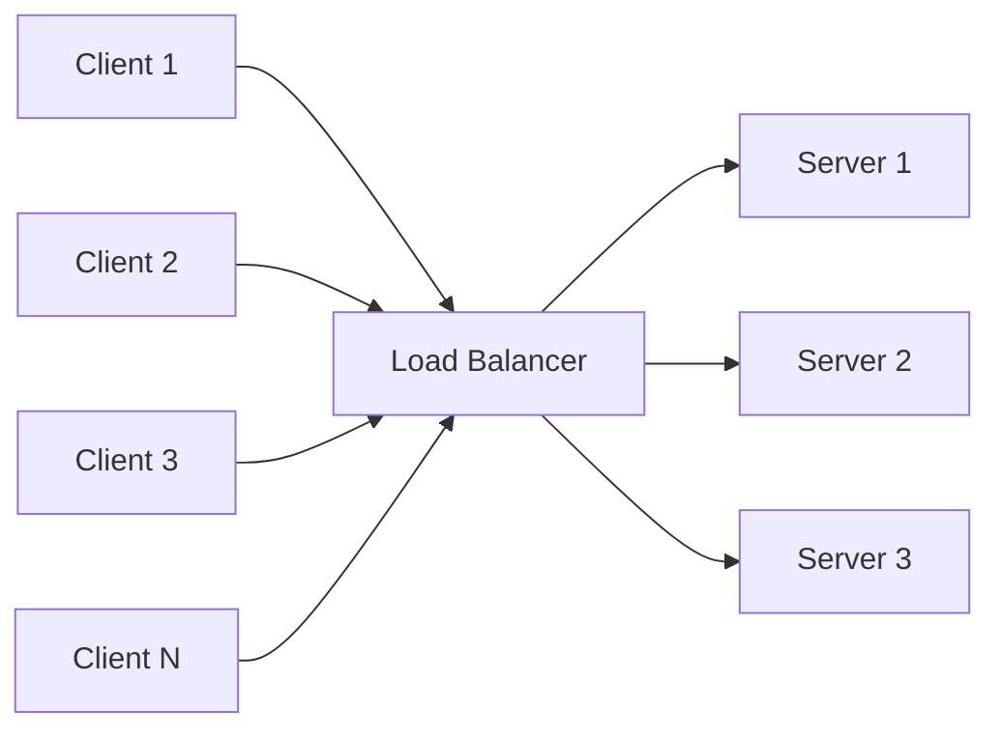
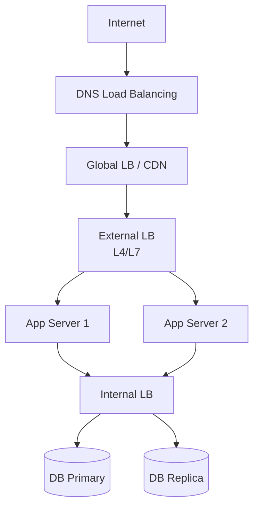
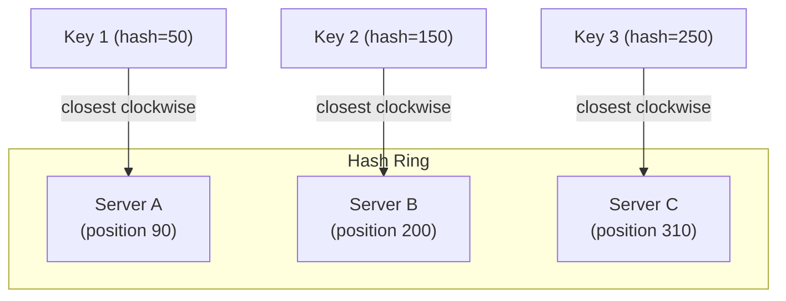
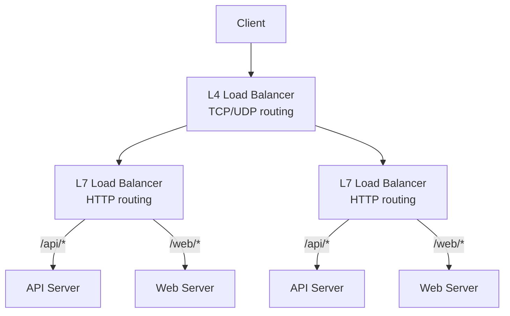
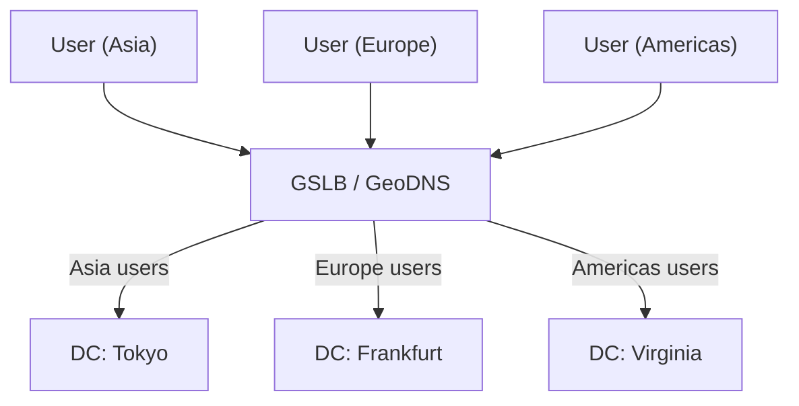
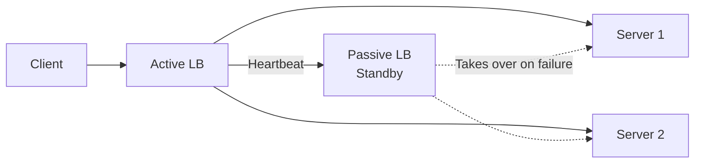
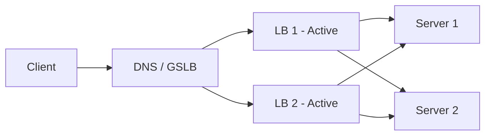

# Load Balancing

> **Distribute traffic, prevent overload, enable scaling.** A load balancer sits between clients and servers, distributing incoming requests across multiple backend servers to ensure no single server becomes a bottleneck.

---

## 📑 Table of Contents

- [What is Load Balancing?](#-what-is-load-balancing)
- [Load Balancing Algorithms](#-load-balancing-algorithms)
- [L4 vs L7 Load Balancing](#-l4-vs-l7-load-balancing)
- [Health Checks](#-health-checks)
- [DNS Load Balancing](#-dns-load-balancing)
- [Global Server Load Balancing](#-global-server-load-balancing-gslb)
- [Technologies](#-technologies)
- [Related Topics](#-related-topics)

---

## 🧠 What is Load Balancing?



**Why you need load balancing:**

| Problem | How LB Solves It |
|---------|-----------------|
| Single server overloaded | Distributes requests across multiple servers |
| Single point of failure | Routes around failed servers |
| Uneven server utilization | Balances load based on capacity |
| Geographic latency | Routes to nearest server |
| Maintenance | Drain traffic from server before maintenance |

**Where load balancers sit:**



---

## ⚖️ Load Balancing Algorithms

### Round Robin

Distribute requests sequentially across servers.

```text
Request 1 → Server A
Request 2 → Server B
Request 3 → Server C
Request 4 → Server A  (cycles back)
```

**Pros:** Simple, even distribution when servers are identical.
**Cons:** Doesn't account for server load or capacity differences.

### Weighted Round Robin

Like round robin, but servers with higher weights get more requests.

```text
Weights: Server A=5, Server B=3, Server C=2

Distribution (out of 10 requests):
Server A: 5 requests (50%)
Server B: 3 requests (30%)
Server C: 2 requests (20%)
```

**Use when:** Servers have different capacities (e.g., different CPU/memory).

### Least Connections

Route to the server with the fewest active connections.

```text
Active connections: Server A=15, Server B=8, Server C=12

Next request → Server B (fewest connections)
```

**Use when:** Requests have variable processing times; prevents slow requests from overloading a server.

### Weighted Least Connections

Combines least connections with server weights.

```text
Score = active_connections / weight
Server A: 15/5 = 3.0
Server B: 8/3 = 2.67  ← lowest score, gets next request
Server C: 12/2 = 6.0
```

### IP Hash

Hash the client IP to consistently route the same client to the same server.

```text
hash(client_ip) % num_servers = server_index

Client 10.0.0.1 → always goes to Server B
Client 10.0.0.2 → always goes to Server A
```

**Use when:** Need session affinity without cookies; simple sticky sessions.
**Cons:** Uneven distribution; removing a server remaps many clients.

### Consistent Hashing

Distribute requests using a hash ring. Minimizes redistribution when servers are added/removed.



**How it works:**

1. Servers and keys are placed on a virtual ring (0 to 2^32-1)
2. Each key is routed to the first server found clockwise on the ring
3. When a server is added/removed, only ~1/N keys need to move

**Use when:** Distributed caches, sharded databases, any system where minimizing redistribution matters.

→ See [Distributed Systems](../distributed-systems/) for consistent hashing in depth

### Algorithm Comparison

| Algorithm | Even Distribution | Session Affinity | Server Awareness | Complexity |
|-----------|------------------|-----------------|-----------------|-----------|
| Round robin | Good (equal servers) | No | No | Very low |
| Weighted round robin | Good | No | Capacity-aware | Low |
| Least connections | Excellent | No | Load-aware | Medium |
| IP hash | Moderate | Yes | No | Low |
| Consistent hashing | Good | Yes | No | Medium |
| Random | Acceptable at scale | No | No | Very low |

---

## 🔀 L4 vs L7 Load Balancing

### Layer 4 (Transport Layer)

Operates at TCP/UDP level. Routes based on IP address and port number without inspecting packet content.

```text
Client → [TCP SYN] → L4 LB → [TCP SYN] → Backend Server
       ← [TCP SYN-ACK] ←    ← [TCP SYN-ACK] ←
       → [Data] →            → [Data] →
```

### Layer 7 (Application Layer)

Operates at HTTP/HTTPS level. Can inspect headers, URLs, cookies, and request body.

```text
Client → [HTTP GET /api/users] → L7 LB → [Routes based on URL path]
                                        → /api/* → API servers
                                        → /static/* → CDN
                                        → /admin/* → Admin servers
```

### Comparison Table

| Feature | L4 Load Balancer | L7 Load Balancer |
|---------|-----------------|-----------------|
| **OSI Layer** | Transport (TCP/UDP) | Application (HTTP/HTTPS) |
| **Routing basis** | IP, port | URL, headers, cookies, body |
| **SSL termination** | Pass-through or terminate | Typically terminates |
| **Content awareness** | No | Yes |
| **Performance** | Higher (less processing) | Lower (packet inspection) |
| **Sticky sessions** | IP-based only | Cookie-based, header-based |
| **URL routing** | No | Yes |
| **Header manipulation** | No | Yes (add, remove, modify) |
| **WebSocket support** | Pass-through | Full support with upgrade |
| **Cost** | Lower | Higher |
| **Use cases** | TCP services, databases, high throughput | HTTP APIs, web apps, microservices |



**When to use L4:** High-throughput TCP traffic, database connections, non-HTTP protocols, when content inspection isn't needed.

**When to use L7:** HTTP-based applications, URL-based routing, header-based routing, SSL termination, rate limiting by API key.

---

## 🏥 Health Checks

Health checks determine if a backend server is healthy and can receive traffic.

### Active Health Checks

The load balancer periodically probes backend servers.

```text
LB → GET /health → Server A → 200 OK (healthy)
LB → GET /health → Server B → 503 (unhealthy) → Remove from pool
LB → GET /health → Server C → timeout → Remove from pool
```

**Configuration parameters:**

| Parameter | Description | Typical Value |
|-----------|-------------|---------------|
| Interval | Time between checks | 5-30 seconds |
| Timeout | Max time to wait for response | 3-5 seconds |
| Unhealthy threshold | Consecutive failures before marking unhealthy | 2-3 |
| Healthy threshold | Consecutive successes before marking healthy | 2-3 |
| Path | HTTP endpoint to check | `/health` or `/healthz` |

### Passive Health Checks

The load balancer monitors actual traffic for errors.

```text
Server A responds with 5xx for 5 consecutive requests
→ LB marks Server A as unhealthy
→ Stops sending traffic to Server A
→ Resumes after recovery period
```

### Health Check Endpoint Design

```python
# Good health check — checks actual dependencies
@app.get("/health")
def health_check():
    checks = {
        "database": check_database(),
        "cache": check_cache(),
        "disk_space": check_disk_space(),
    }
    all_healthy = all(checks.values())
    status_code = 200 if all_healthy else 503
    return JSONResponse(
        content={"status": "healthy" if all_healthy else "unhealthy", "checks": checks},
        status_code=status_code,
    )
```

**Liveness vs Readiness:**

| Check | Purpose | Failure Action |
|-------|---------|---------------|
| **Liveness** | "Is the process alive?" | Restart the instance |
| **Readiness** | "Can it serve traffic?" | Remove from LB pool |

→ See [Kubernetes](../devops/kubernetes/) for liveness and readiness probes

---

## 🌐 DNS Load Balancing

Use DNS to distribute traffic across multiple IP addresses.

```text
dig api.example.com

;; ANSWER SECTION:
api.example.com.  300  IN  A  10.0.1.1
api.example.com.  300  IN  A  10.0.2.1
api.example.com.  300  IN  A  10.0.3.1
```

**How it works:**

- DNS returns multiple A records
- Clients choose one (usually the first)
- DNS server rotates the order (round robin)
- TTL controls how long clients cache the result

**Pros:** Simple, no additional infrastructure, works globally.

**Cons:**
- No health checks (DNS doesn't know if a server is down)
- Client-side caching makes changes slow to propagate
- Limited algorithms (mostly round robin)
- Uneven distribution (clients may all cache the same record)

**Best practice:** Use DNS for geographic routing, then hardware/software LBs for per-datacenter balancing.

---

## 🌍 Global Server Load Balancing (GSLB)

Route users to the nearest healthy datacenter.



**Routing strategies:**

| Strategy | How It Works | Use When |
|----------|-------------|----------|
| **Geographic** | Route to nearest datacenter by client location | Latency-sensitive applications |
| **Latency-based** | Route to datacenter with lowest measured latency | Variable network conditions |
| **Failover** | Route to backup DC when primary is down | Disaster recovery |
| **Weighted** | Distribute percentage of traffic to each DC | Gradual migrations, A/B testing |

**Technologies:** AWS Route 53, Cloudflare, Akamai GTM, Google Cloud DNS.

---

## 🛠 Technologies

### Nginx

The most popular open-source reverse proxy and load balancer.

```nginx
# Layer 7 load balancing
upstream api_servers {
    least_conn;
    server 10.0.1.1:8080 weight=3;
    server 10.0.1.2:8080 weight=2;
    server 10.0.1.3:8080 weight=1;
}

server {
    listen 80;
    location /api/ {
        proxy_pass http://api_servers;
        proxy_set_header X-Real-IP $remote_addr;
        proxy_set_header Host $host;
    }
}
```

### HAProxy

High-performance TCP/HTTP load balancer.

```text
Strengths:
- Very high performance (millions of connections)
- Advanced health checks
- Detailed statistics dashboard
- Both L4 and L7
- Rich ACL-based routing
```

### AWS Load Balancers

| Type | Layer | Use Case |
|------|-------|----------|
| **ALB** (Application) | L7 | HTTP/HTTPS, path-based routing, gRPC |
| **NLB** (Network) | L4 | TCP/UDP, ultra-low latency, static IPs |
| **CLB** (Classic) | L4/L7 | Legacy (prefer ALB/NLB) |
| **GWLB** (Gateway) | L3 | Third-party appliances (firewalls, IDS) |

### Kubernetes Services and Ingress

```text
Service (ClusterIP): Internal L4 load balancing via kube-proxy
Service (NodePort):  Expose service on each node's IP
Service (LoadBalancer): Provision external cloud LB
Ingress: L7 routing (host/path-based) via Ingress Controller (Nginx, Traefik, etc.)
```

→ See [Kubernetes](../devops/kubernetes/) for service and ingress configuration

### Technology Comparison

| Feature | Nginx | HAProxy | AWS ALB | AWS NLB |
|---------|-------|---------|---------|---------|
| Layer | L7 (L4 stream) | L4 and L7 | L7 | L4 |
| Performance | Very high | Extremely high | Managed (scales) | Ultra-low latency |
| SSL termination | Yes | Yes | Yes | TLS pass-through or termination |
| WebSocket | Yes | Yes | Yes | Yes (pass-through) |
| gRPC | Yes | Yes | Yes | Yes |
| Cost | Free / Nginx Plus | Free / Enterprise | Pay-per-use | Pay-per-use |
| Management | Self-managed | Self-managed | Fully managed | Fully managed |

---

## 📐 Load Balancing Patterns

### Active-Passive (Failover)



### Active-Active



---

## 🔗 Related Topics

- [Fundamentals](fundamentals.md) — System design foundations
- [Scalability](scalability.md) — Scaling strategies using load balancers
- [Caching](caching.md) — Cache layer behind load balancers
- [API Design](api-design.md) — API gateway patterns
- [Microservices](../architecture/microservices.md) — Service discovery and API gateways
- [Kubernetes](../devops/kubernetes/) — Kubernetes services, ingress, and load balancing
- [Networking](../devops/networking/) — TCP/IP, DNS, HTTP fundamentals
- [Nginx](../cli/networking/) — Nginx configuration and commands

---

> **Load balancing is foundational infrastructure.** Almost every production system uses it. Understand the algorithms, know when to use L4 vs L7, and always configure health checks. A load balancer is only as good as its ability to detect and route around failures.
