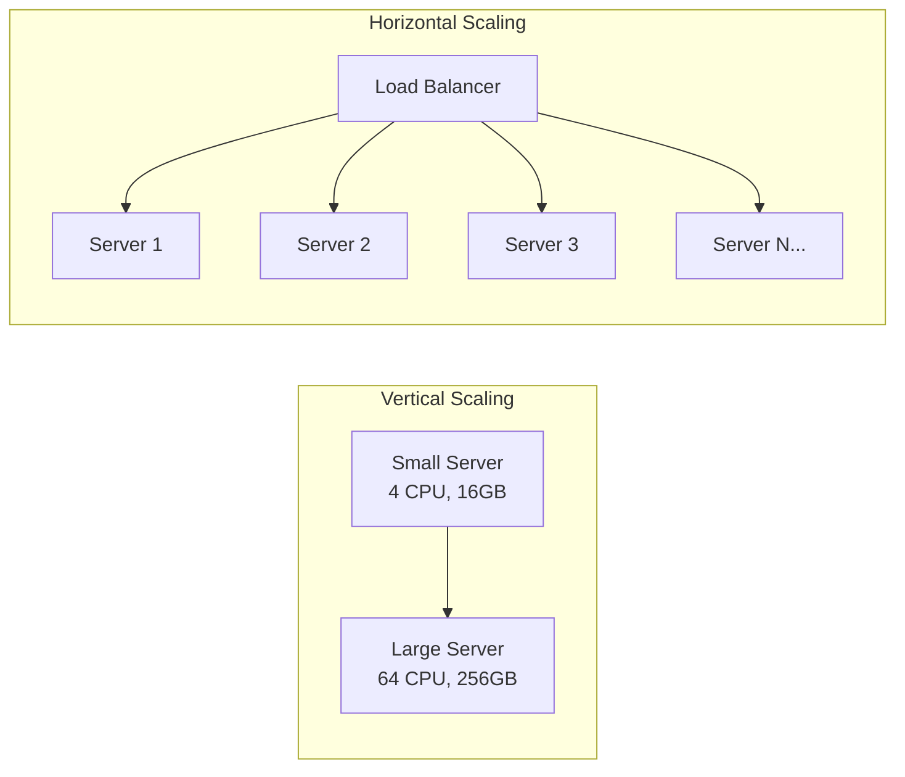
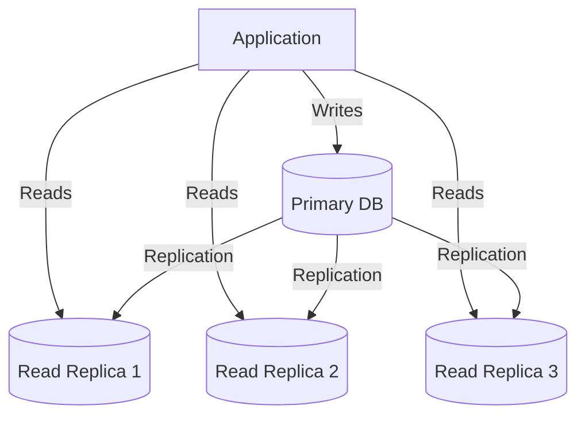
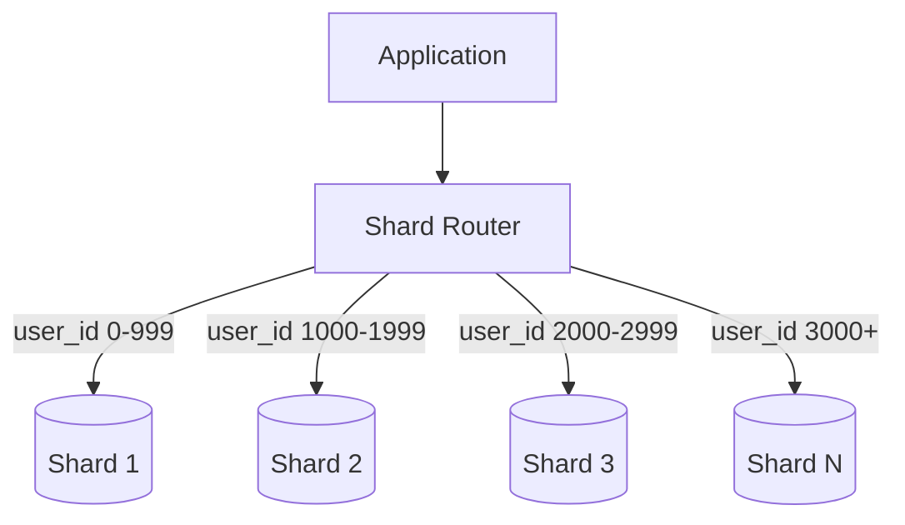
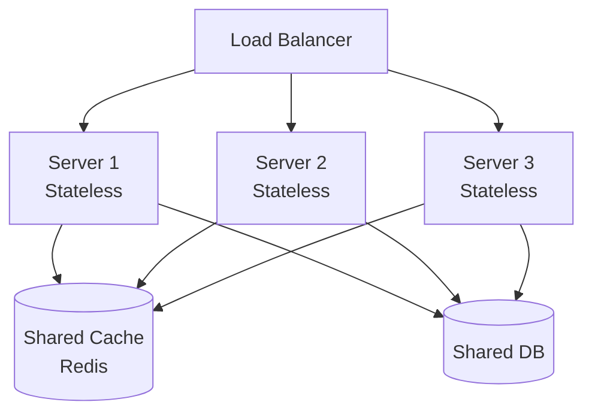
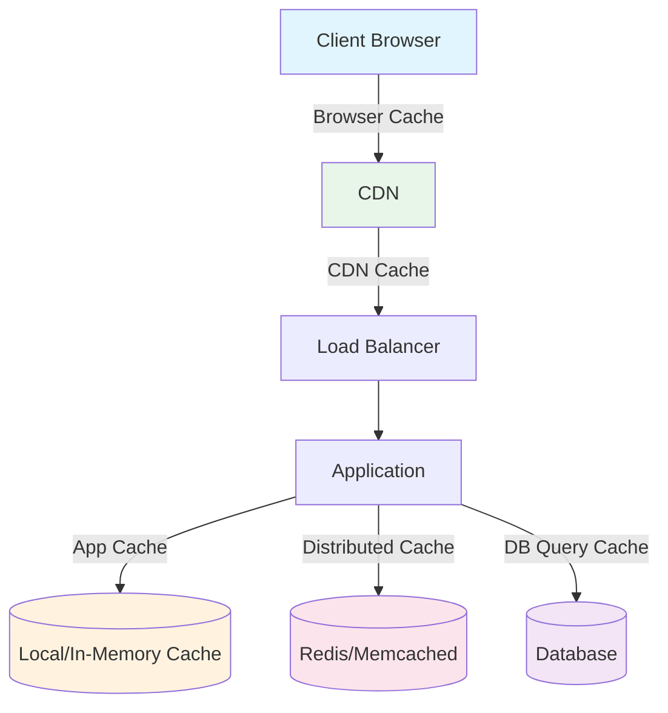
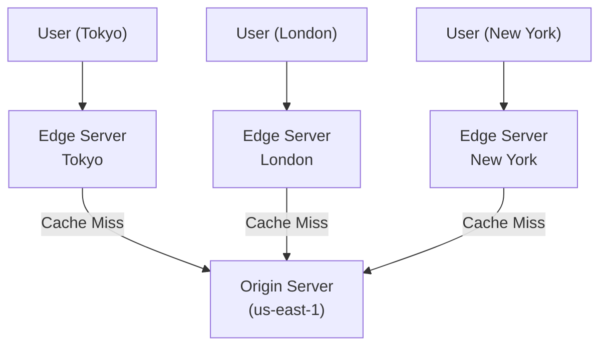
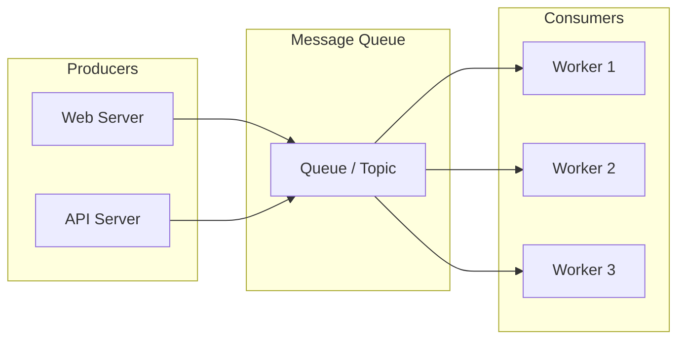
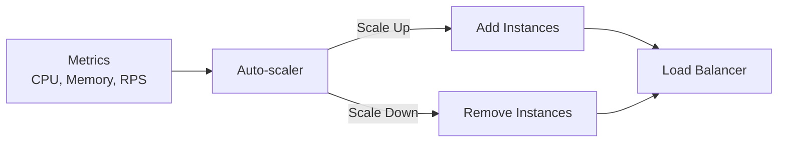
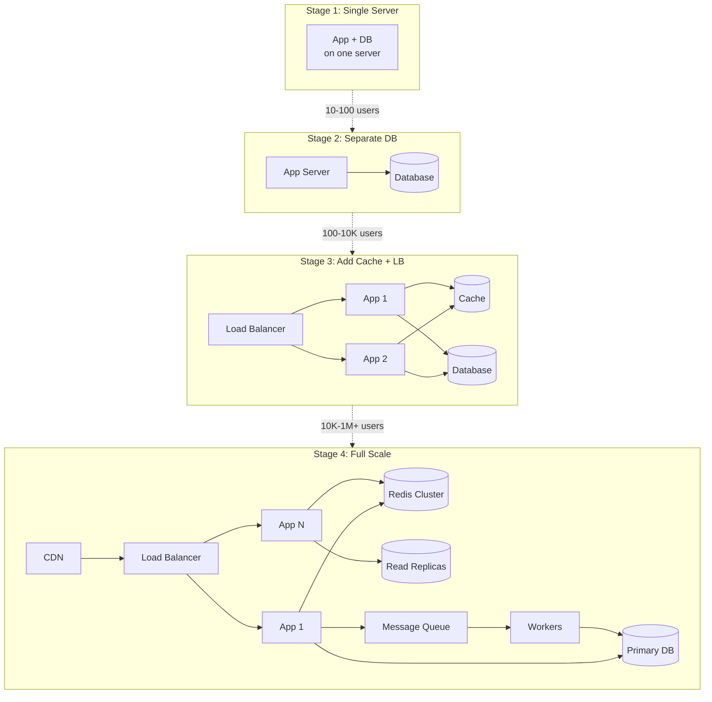

# Scalability

> **Designing systems that handle growth gracefully.** Scalability is the ability of a system to handle increased load by adding resources — without degrading performance or requiring a complete redesign.

---

## 📑 Table of Contents

- [What is Scalability?](#-what-is-scalability)
- [Vertical vs Horizontal Scaling](#-vertical-vs-horizontal-scaling)
- [Database Scaling](#-database-scaling)
- [Application Scaling](#-application-scaling)
- [Caching at Every Layer](#-caching-at-every-layer)
- [CDN (Content Delivery Network)](#-cdn-content-delivery-network)
- [Message Queues for Decoupling](#-message-queues-for-decoupling)
- [Auto-scaling Patterns](#-auto-scaling-patterns)
- [Related Topics](#-related-topics)

---

## 🧠 What is Scalability?

A system is scalable if it can handle growing amounts of work by adding resources proportionally. The goal: as load doubles, you should be able to roughly double capacity without rewriting the system.

**Types of scalability:**

| Type | Description | Example |
|------|-------------|---------|
| **Load scalability** | Handle more requests | 1,000 → 100,000 RPS |
| **Data scalability** | Handle more data | 1 GB → 1 TB |
| **Geographic scalability** | Serve users globally | Single region → multi-region |

---

## ⬆️ Vertical vs Horizontal Scaling

### Vertical Scaling (Scale Up)

Add more power to an existing machine (CPU, RAM, storage).

```text
Before: 4 CPU, 16 GB RAM, 500 GB SSD
After:  64 CPU, 256 GB RAM, 4 TB SSD
```

### Horizontal Scaling (Scale Out)

Add more machines to distribute the load.

```text
Before: 1 server handling all traffic
After:  10 servers behind a load balancer
```

### Comparison

| Aspect | Vertical | Horizontal |
|--------|----------|-----------|
| **Complexity** | Simple, no code changes | Requires distributed architecture |
| **Cost** | Expensive at high end | Cost-effective with commodity hardware |
| **Limits** | Hardware ceiling | Practically unlimited |
| **Downtime** | Usually requires restart | Zero-downtime scaling |
| **Single point of failure** | Yes | No (with redundancy) |
| **Data consistency** | Easy (single machine) | Harder (distributed state) |



> **Best practice:** Start vertical (simpler), move horizontal when you hit limits or need high availability.

---

## 🗄 Database Scaling

Databases are often the first bottleneck. Scale them strategically.

### Read Replicas

Distribute read queries across multiple copies of the database.



**How it works:**

- All writes go to the primary (leader) database
- Changes are replicated to read replicas (followers)
- Read queries are distributed across replicas
- Replication can be synchronous or asynchronous

**Trade-offs:**

| Replication Type | Consistency | Latency | Durability |
|-----------------|-------------|---------|-----------|
| Synchronous | Strong | Higher (waits for replica) | No data loss |
| Asynchronous | Eventual | Lower | Possible data loss |
| Semi-synchronous | Near-strong | Medium | Minimal data loss |

**When to use:** Read-heavy workloads (read:write ratio > 5:1).

### Sharding (Horizontal Partitioning)

Split data across multiple databases, each holding a subset of the data.



**Sharding strategies:**

| Strategy | How It Works | Pros | Cons |
|----------|-------------|------|------|
| **Range-based** | Shard by value ranges (e.g., A-M, N-Z) | Simple, range queries | Hot spots if uneven distribution |
| **Hash-based** | Shard by hash of key | Even distribution | No range queries, resharding pain |
| **Directory-based** | Lookup table maps keys to shards | Flexible | Lookup table is a bottleneck |
| **Geographic** | Shard by region | Data locality | Cross-region queries are expensive |

**Consistent hashing** minimizes data movement when adding/removing shards:

```text
Without consistent hashing:
  Add 1 shard → ~50-75% of data needs to move

With consistent hashing:
  Add 1 shard → only ~1/N of data needs to move (N = number of shards)
```

**Challenges:**

- **Cross-shard queries:** JOINs across shards are expensive
- **Rebalancing:** Moving data when shards are uneven
- **Auto-increment IDs:** Must use distributed ID generation
- **Transactions:** Distributed transactions are complex

### Vertical Partitioning

Split a table's columns across different databases.

```text
Users table → Split into:
  - users_core:     (id, name, email)        → Fast, frequently accessed
  - users_profile:  (id, bio, avatar_url)     → Larger, less frequent
  - users_activity: (id, last_login, settings) → Write-heavy
```

**When to use:** Tables with many columns, some accessed far more frequently than others.

---

## 🚀 Application Scaling

### Stateless Services

The key to horizontal scaling — no server-specific state.



**Rules for stateless services:**

- No in-memory session data
- No local file system state
- Store all state in external stores (database, cache, object storage)
- Any server can handle any request

### Session Management

| Approach | Description | Pros | Cons |
|----------|-------------|------|------|
| **Sticky sessions** | Route user to same server | Simple | Not truly stateless, failover issues |
| **Session store (Redis)** | Store sessions in external cache | Scalable, resilient | Network hop for every request |
| **JWT tokens** | Client carries state in signed token | No server state, scalable | Token size, revocation is hard |
| **Database sessions** | Store sessions in DB | Persistent, reliable | Slow, DB load |

**Recommended:** JWT for authentication, Redis for session data that changes frequently.

### Connection Pooling

Reuse database connections instead of creating new ones for each request.

```text
Without pooling:
  Each request → new TCP connection → TLS handshake → auth → query → close
  Cost: ~50-100ms overhead per request

With pooling:
  Requests share a pool of pre-established connections
  Cost: <1ms to acquire a connection from the pool
```

**Tools:** PgBouncer (PostgreSQL), ProxySQL (MySQL), built-in connection pools in most frameworks.

---

## 🗃 Caching at Every Layer



| Layer | What to Cache | TTL | Technology |
|-------|--------------|-----|-----------|
| **Browser** | Static assets, API responses | Minutes to days | HTTP headers (Cache-Control) |
| **CDN** | Static assets, cacheable API responses | Minutes to hours | CloudFront, Cloudflare |
| **Application** | Computed results, config | Seconds to minutes | In-memory (dict, LRU) |
| **Distributed Cache** | DB query results, session data, hot objects | Seconds to hours | Redis, Memcached |
| **Database** | Query results, buffer pool | Automatic | Built-in query cache, buffer pool |

→ See [Caching](caching.md) for detailed cache strategies and patterns

---

## 🌍 CDN (Content Delivery Network)

Serve content from servers geographically close to users.



**What to serve from CDN:**

- Static assets (JS, CSS, images, fonts)
- Pre-rendered pages
- Video and media content
- Cacheable API responses (public data)

**CDN strategies:**

| Strategy | Description | Use When |
|----------|-------------|----------|
| **Pull** | CDN fetches from origin on cache miss | Default for most use cases |
| **Push** | You upload content directly to CDN | Large files, content you control |

**Providers:** CloudFront (AWS), Cloudflare, Akamai, Fastly, Google Cloud CDN.

---

## 📨 Message Queues for Decoupling

Decouple producers from consumers to handle traffic spikes and enable asynchronous processing.



**Benefits:**

- **Buffering:** Handle traffic spikes without dropping requests
- **Decoupling:** Producers and consumers are independent
- **Retry:** Failed messages can be retried
- **Scaling:** Add more consumers to increase throughput
- **Ordering:** Guaranteed ordering within partitions (Kafka)

**When to use message queues:**

| Scenario | Example |
|----------|---------|
| Async processing | Email sending, image processing |
| Load leveling | Absorb traffic spikes |
| Fan-out | One event triggers multiple actions |
| Cross-service communication | Microservice events |
| Batch processing | Aggregate events before processing |

**Technologies comparison:**

| Feature | Kafka | RabbitMQ | SQS | Redis Streams |
|---------|-------|----------|-----|---------------|
| Throughput | Very high | High | High | High |
| Ordering | Per-partition | Per-queue | Best-effort (FIFO available) | Per-stream |
| Persistence | Yes (configurable) | Optional | Yes | Optional |
| Consumer groups | Yes | Yes | Yes | Yes |
| Replay | Yes | No | No | Yes |
| Complexity | High | Medium | Low (managed) | Low |

→ See [Distributed Systems](../distributed-systems/) for Kafka deep dive

---

## ⚡ Auto-scaling Patterns

### Reactive Auto-scaling

Scale based on observed metrics.



**Common metrics for scaling:**

| Metric | Scale Up When | Scale Down When |
|--------|--------------|----------------|
| CPU utilization | > 70% | < 30% |
| Memory utilization | > 80% | < 40% |
| Request rate | > threshold | < threshold |
| Queue depth | > 1000 messages | < 100 messages |
| Response time (p99) | > 500ms | < 100ms |

### Predictive Auto-scaling

Scale based on predicted future load (using historical patterns).

```text
Example:
- Traffic spikes every day at 9 AM
- Scale up at 8:45 AM (before the spike)
- Scale down at 6 PM (after traffic drops)
```

### Scheduled Auto-scaling

Scale based on a known schedule.

```text
Example (e-commerce):
- Normal: 5 instances
- Black Friday: 50 instances (pre-scheduled)
- Post-holiday: back to 5 instances
```

### Kubernetes Auto-scaling

```text
Horizontal Pod Autoscaler (HPA):
- Scales number of pods based on CPU/memory/custom metrics

Vertical Pod Autoscaler (VPA):
- Adjusts CPU/memory requests for pods

Cluster Autoscaler:
- Adds/removes nodes based on pending pods
```

→ See [Kubernetes](../devops/kubernetes/) for HPA/VPA configuration

### Auto-scaling Best Practices

1. **Set appropriate cooldown periods** — Avoid thrashing (scaling up/down repeatedly)
2. **Scale on the right metric** — CPU isn't always the bottleneck
3. **Test scaling limits** — Know how fast instances can start
4. **Set min and max bounds** — Prevent runaway scaling (cost protection)
5. **Use health checks** — Don't route to instances that aren't ready
6. **Warm up instances** — Pre-populate caches, establish connections
7. **Monitor scaling events** — Track scaling history for optimization

---

## 📐 Scaling Architecture Example

**Evolution of a typical web application:**



---

## 🔗 Related Topics

- [Fundamentals](fundamentals.md) — System design foundations and estimation
- [Caching](caching.md) — Detailed cache strategies and distributed caching
- [Load Balancing](load-balancing.md) — Traffic distribution and algorithms
- [API Design](api-design.md) — Designing scalable APIs
- [Microservices](../architecture/microservices.md) — Scaling with microservice architecture
- [Event-Driven Architecture](../architecture/event-driven.md) — Scaling with async events
- [Databases](../databases/) — Database scaling patterns
- [Kubernetes](../devops/kubernetes/) — Container orchestration and auto-scaling
- [Docker](../devops/docker/) — Containerization for deployable units

---

> **Scale when you need to, not before.** Premature optimization adds complexity. Start simple, measure bottlenecks, and scale the parts that need it. Every scaling decision is a trade-off between complexity and capacity.
