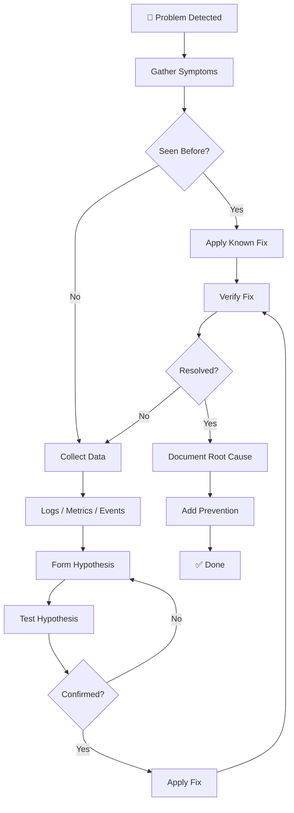

# 🐛 Troubleshooting Guide

> **Systematic debugging for production systems — from symptoms to root cause to prevention.**

---

## 🧠 The Debugging Mindset

Effective troubleshooting follows the scientific method. Don't guess — observe, hypothesize, test, and verify.

### The Five-Step Process

```
Observe → Hypothesize → Test → Fix → Prevent
```

1. **Observe** — Gather symptoms, logs, metrics, and error messages. What changed recently?
2. **Hypothesize** — Based on symptoms, form theories about the root cause.
3. **Test** — Validate or eliminate each hypothesis with specific commands and checks.
4. **Fix** — Apply the minimal change that resolves the root cause (not just the symptom).
5. **Prevent** — Add monitoring, alerts, tests, or automation to prevent recurrence.

### Debugging Flowchart



---

## 🔍 Quick Diagnosis by Symptom

### Application Symptoms

| Symptom | Likely Area | Start Here |
|---------|-------------|------------|
| Application won't start | Container, config, dependencies | [Docker](docker/) · [Kubernetes](kubernetes/) |
| Application crashes repeatedly | Memory, code bugs, config | [Kubernetes](kubernetes/) · [Memory](memory/) |
| Slow response times | CPU, memory, database, network | [CPU](cpu/) · [Memory](memory/) · [Networking](networking/) |
| Intermittent errors | Network, DNS, resource limits | [Networking](networking/) · [DNS](dns/) |
| Connection refused | Service down, port wrong, firewall | [Networking](networking/) · [Docker](docker/) |
| Out of memory | Memory limits, leaks | [Memory](memory/) · [Kubernetes](kubernetes/) |

### Infrastructure Symptoms

| Symptom | Likely Area | Start Here |
|---------|-------------|------------|
| Pod CrashLoopBackOff | Application, config, resources | [Kubernetes](kubernetes/#pod-crashloopbackoff) |
| Pod Pending | Resources, scheduling, PVC | [Kubernetes](kubernetes/#pod-pending) |
| Node NotReady | Kubelet, disk, memory, PID | [Kubernetes](kubernetes/#node-notready) |
| Container exits immediately | Entrypoint, CMD, config | [Docker](docker/#container-exits-immediately) |
| DNS resolution fails | CoreDNS, config, network | [Networking](networking/#dns-resolution-failures) |
| Certificate errors | Expired cert, chain, hostname | [Networking](networking/#ssltls-errors) |
| High CPU usage | Process, throttling, load | [CPU](cpu/) |
| High memory usage | Leak, cache, OOM | [Memory](memory/) |
| Disk full | Logs, images, temp files | [Docker](docker/#disk-space-issues) |

---

## 📚 Troubleshooting Guides

| Guide | Description | Key Topics |
|-------|-------------|------------|
| [🚀 Kubernetes](kubernetes/) | Pod, service, node, and cluster issues | CrashLoopBackOff, Pending, ImagePull, DNS |
| [🐳 Docker](docker/) | Container, image, network, and storage issues | Exit codes, build failures, volumes, networking |
| [🌐 Networking](networking/) | DNS, connectivity, TLS, and latency | DNS, timeouts, TLS errors, packet loss |
| [💻 CPU](cpu/) | CPU usage, throttling, and load | top, perf, cgroups, load average |
| [🧠 Memory](memory/) | Memory usage, OOM, leaks, and swap | free, OOMKiller, profiling, cgroups |

---

## 🛠️ Essential Diagnostic Commands

### Quick System Health Check

```bash
# System overview
uptime                              # Load average
free -h                             # Memory usage
df -h                               # Disk usage
top -bn1 | head -20                 # CPU and process overview

# Network
ss -tlnp                            # Listening ports
ping -c 3 <host>                    # Basic connectivity
dig <domain>                        # DNS resolution

# Kubernetes
kubectl get pods -A | grep -v Running  # Non-running pods
kubectl get nodes                      # Node status
kubectl top pods                       # Resource usage

# Docker
docker ps -a                        # All containers
docker stats --no-stream            # Resource usage
docker system df                    # Disk usage
```

### Log Collection

```bash
# System logs
journalctl -u <service> --since "1 hour ago"
dmesg | tail -50                    # Kernel messages (OOM, hardware)

# Kubernetes logs
kubectl logs <pod> --tail=100       # Recent logs
kubectl logs <pod> --previous       # Previous container logs
kubectl describe pod <pod>          # Events and status

# Docker logs
docker logs <container> --tail=100  # Recent logs
docker inspect <container>          # Full container config
```

---

## 📋 Incident Response Checklist

When something goes wrong in production:

- [ ] **Assess impact** — How many users/services affected?
- [ ] **Check monitoring** — Dashboards, alerts, metrics
- [ ] **Review recent changes** — Deployments, config changes, infrastructure
- [ ] **Collect evidence** — Logs, metrics, screenshots, timestamps
- [ ] **Communicate** — Update stakeholders, status page
- [ ] **Mitigate** — Rollback, restart, failover (stop the bleeding)
- [ ] **Root cause** — Investigate after mitigation
- [ ] **Fix** — Apply permanent fix
- [ ] **Prevent** — Add monitoring, tests, automation
- [ ] **Document** — Write incident report with timeline and lessons

---

## 🔗 Related Topics

- [🚀 DevOps](../devops/) — Infrastructure and operations
- [📊 Observability](../observability/) — Monitoring and alerting
- [⚙️ Engineering](../engineering/) — Development practices
- [📝 Real-World](../real-world/) — Production incidents and lessons learned
- [🧰 CLI](../cli/) — Command-line tool references

---

> **Remember:** The best debugging is prevention. Good monitoring, testing, and deployment practices catch most issues before they become production incidents. When they do happen, a systematic approach gets you to the root cause faster than guessing.
