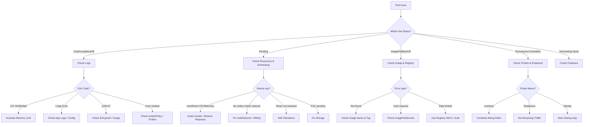

# 🚀 Kubernetes Troubleshooting

> **Symptom-driven debugging for Kubernetes clusters — from pod failures to network issues to node problems.**

---

## 📋 Table of Contents

- [Pod Troubleshooting Decision Tree](#pod-troubleshooting-decision-tree)
- [Pod CrashLoopBackOff](#pod-crashloopbackoff)
- [Pod Pending](#pod-pending)
- [ImagePullBackOff](#imagepullbackoff)
- [Container Restarting](#container-restarting)
- [Service Unreachable](#service-unreachable)
- [Node NotReady](#node-notready)
- [DNS Failures in Pods](#dns-failures-in-pods)
- [PVC Pending](#pvc-pending)
- [General Diagnostic Commands](#general-diagnostic-commands)

---

## Pod Troubleshooting Decision Tree



---

## Pod CrashLoopBackOff

A pod is repeatedly crashing and Kubernetes keeps restarting it with exponential backoff.

### Symptoms

```bash
$ kubectl get pods
NAME                    READY   STATUS             RESTARTS      AGE
myapp-7d9b5c8f-x4k2z   0/1     CrashLoopBackOff   5 (30s ago)   3m
```

The pod status alternates between `CrashLoopBackOff` and `Error`. Restart count keeps increasing.

### Possible Causes

| Cause | Exit Code | Indicator |
|-------|-----------|-----------|
| Out of Memory (OOMKilled) | 137 | `reason: OOMKilled` in describe output |
| Application error | 1 | Stack trace or error in logs |
| Missing config/secret | 1 | ConfigMap or Secret reference error in events |
| Bad command/entrypoint | 126, 127 | `exec format error` or `not found` |
| Image issue | 126, 127 | Wrong architecture, corrupt image |
| Liveness probe failure | 137 | `Liveness probe failed` in events |
| Missing dependency | 1 | Connection refused in logs (database, API) |
| Permission denied | 1, 126 | File permission or security context issue |

### Diagnostic Commands

```bash
# Step 1: Check pod status and restart count
kubectl get pod <pod> -o wide

# Step 2: Check events for clues
kubectl describe pod <pod>
# Look for:
#   - "Back-off restarting failed container"
#   - "OOMKilled"
#   - "Liveness probe failed"
#   - "Error: configmaps/secrets not found"

# Step 3: Check container exit code
kubectl get pod <pod> -o jsonpath='{.status.containerStatuses[0].lastState.terminated.exitCode}'
# 137 = OOMKilled or killed by signal 9
# 1   = Application error
# 126 = Permission problem
# 127 = Command not found
# 0   = Completed successfully (wrong restartPolicy?)

# Step 4: Check logs
kubectl logs <pod>                     # Current attempt
kubectl logs <pod> --previous          # Previous crashed container

# Step 5: Check resource usage (if pod briefly runs)
kubectl top pod <pod>

# Step 6: For OOMKilled, check memory limits
kubectl get pod <pod> -o jsonpath='{.spec.containers[0].resources}'

# Step 7: Debug with ephemeral container (Kubernetes 1.23+)
kubectl debug -it <pod> --image=busybox --target=<container>

# Step 8: Check if ConfigMaps/Secrets exist
kubectl get configmap <name>
kubectl get secret <name>
```

### Resolution by Cause

**OOMKilled (Exit Code 137):**

```yaml
# Increase memory limit
resources:
  requests:
    memory: "256Mi"
  limits:
    memory: "512Mi"    # Increase this
```

For JVM applications, ensure heap fits within container limit:

```yaml
env:
  - name: JAVA_OPTS
    value: "-Xmx384m -Xms256m"   # Leave ~128Mi for non-heap
resources:
  limits:
    memory: "512Mi"               # Xmx + overhead
```

**Application Error (Exit Code 1):**

```bash
# Check logs for the actual error
kubectl logs <pod> --previous

# Run interactively to debug
kubectl run debug --image=<image> --restart=Never -it -- /bin/sh

# Check environment variables are set
kubectl exec <pod> -- env | grep -i <expected_var>
```

**Missing Config/Secret:**

```bash
# Verify ConfigMap exists in the correct namespace
kubectl get configmap <name> -n <namespace>

# Verify Secret exists
kubectl get secret <name> -n <namespace>

# Check the volume mount references
kubectl get pod <pod> -o yaml | grep -A5 configMap
kubectl get pod <pod> -o yaml | grep -A5 secret
```

**Bad Entrypoint (Exit Code 126/127):**

```bash
# Check the image entrypoint
docker inspect <image> | jq '.[0].Config.Entrypoint'
docker inspect <image> | jq '.[0].Config.Cmd'

# Try running the image manually
docker run --rm -it <image> /bin/sh
```

**Liveness Probe Failure:**

```yaml
# Increase initialDelaySeconds for slow-starting apps
livenessProbe:
  httpGet:
    path: /healthz
    port: 8080
  initialDelaySeconds: 30    # Give app time to start
  periodSeconds: 10
  failureThreshold: 3        # Allow 3 failures before restart
  timeoutSeconds: 5          # Increase if health endpoint is slow

# Better: Use startupProbe for slow-starting apps
startupProbe:
  httpGet:
    path: /healthz
    port: 8080
  failureThreshold: 30
  periodSeconds: 10          # 30 x 10s = 5 min startup window
```

### Prevention

- Set appropriate resource requests and limits
- Use startup probes for applications with variable startup times
- Ensure all ConfigMaps and Secrets exist before deploying
- Test container images locally before deploying
- Monitor container restart counts with alerting

---

## Pod Pending

A pod is stuck in Pending state and not being scheduled to any node.

### Symptoms

```bash
$ kubectl get pods
NAME                    READY   STATUS    RESTARTS   AGE
myapp-7d9b5c8f-x4k2z   0/1     Pending   0          10m
```

### Possible Causes

| Cause | Event Message |
|-------|---------------|
| Insufficient CPU/memory | `Insufficient cpu` / `Insufficient memory` |
| No matching node selector | `didn't match Pod's node affinity/selector` |
| Taints not tolerated | `had taint {key=value:NoSchedule}` |
| PVC not bound | `persistentvolumeclaim "pvc-name" not found` or PVC Pending |
| Too many pods on node | `Too many pods` |
| Pod affinity/anti-affinity | `didn't match pod affinity rules` |
| Resource quota exceeded | `exceeded quota` |

### Diagnostic Commands

```bash
# Step 1: Check events (most important)
kubectl describe pod <pod>
# The Events section tells you WHY it's pending

# Step 2: Check node resources
kubectl describe nodes | grep -A5 "Allocated resources"

# Step 3: Check available nodes
kubectl get nodes -o wide
kubectl top nodes

# Step 4: Check if nodeSelector matches
kubectl get pod <pod> -o jsonpath='{.spec.nodeSelector}'
kubectl get nodes --show-labels | grep <label>

# Step 5: Check taints on nodes
kubectl get nodes -o json | jq '.items[] | {name: .metadata.name, taints: .spec.taints}'

# Step 6: Check PVC status
kubectl get pvc -n <namespace>

# Step 7: Check resource quotas
kubectl get resourcequota -n <namespace>
kubectl describe resourcequota -n <namespace>

# Step 8: Check pod priority
kubectl get pod <pod> -o jsonpath='{.spec.priorityClassName}'
```

### Resolution by Cause

**Insufficient Resources:**

```bash
# See what's available vs what's requested
kubectl describe node <node> | grep -A 10 "Allocated resources"

# Option 1: Reduce resource requests
# Option 2: Scale up the cluster (add nodes)
# Option 3: Remove or reschedule other workloads
```

```yaml
# Right-size your requests (don't over-request)
resources:
  requests:
    cpu: "100m"      # Only request what you need
    memory: "128Mi"
  limits:
    cpu: "500m"
    memory: "256Mi"
```

**Node Selector Mismatch:**

```bash
# Check what labels exist
kubectl get nodes --show-labels

# Add label to a node
kubectl label node <node> disktype=ssd

# Or fix the pod's nodeSelector to match existing labels
```

**Taints Not Tolerated:**

```yaml
# Add toleration to pod spec
tolerations:
  - key: "dedicated"
    operator: "Equal"
    value: "gpu"
    effect: "NoSchedule"
```

**PVC Pending:**

See [PVC Pending](#pvc-pending) section below.

### Prevention

- Use `kubectl describe` to check events immediately when a pod stays Pending
- Set resource requests based on actual usage (use VPA recommendations)
- Maintain cluster headroom (don't run at 100% capacity)
- Use pod disruption budgets and priority classes

---

## ImagePullBackOff

Kubernetes cannot pull the container image from the registry.

### Symptoms

```bash
$ kubectl get pods
NAME                    READY   STATUS             RESTARTS   AGE
myapp-7d9b5c8f-x4k2z   0/1     ImagePullBackOff   0          5m

$ kubectl describe pod myapp-7d9b5c8f-x4k2z
# Events:
#   Failed to pull image "myregistry.io/myapp:v1.2.3": ...
```

### Possible Causes

| Cause | Error Message |
|-------|---------------|
| Image doesn't exist | `manifest unknown` or `not found` |
| Wrong tag | `tag "v1.2.3" not found` |
| Auth required | `unauthorized: authentication required` |
| Private registry, no secret | `no basic auth credentials` |
| Rate limiting (Docker Hub) | `toomanyrequests: Rate exceeded` |
| Registry unreachable | `dial tcp: lookup registry.io: no such host` |
| Wrong image name | `repository does not exist` |

### Diagnostic Commands

```bash
# Step 1: Get the exact error message
kubectl describe pod <pod> | grep -A10 "Events"

# Step 2: Check the image reference
kubectl get pod <pod> -o jsonpath='{.spec.containers[0].image}'

# Step 3: Verify image exists (from a machine with access)
docker pull <image>
# or
crane manifest <image>       # If crane is installed

# Step 4: Check imagePullSecrets
kubectl get pod <pod> -o jsonpath='{.spec.imagePullSecrets}'
kubectl get secret <secret-name> -o jsonpath='{.data.\.dockerconfigjson}' | base64 -d

# Step 5: Test registry connectivity from a pod
kubectl run test --image=busybox --restart=Never -it -- \
  wget -q -O- https://registry.io/v2/ 2>&1

# Step 6: Check if secret is in the correct namespace
kubectl get secrets -n <namespace> | grep docker
```

### Resolution by Cause

**Image Not Found:**

```bash
# Verify exact image name and tag
docker pull myregistry.io/myapp:v1.2.3

# Common mistakes:
# - Typo in image name
# - Tag doesn't exist (was the CI build successful?)
# - Using "latest" which was never pushed
# - Wrong registry URL
```

**Authentication Required:**

```bash
# Create a docker registry secret
kubectl create secret docker-registry regcred \
  --docker-server=myregistry.io \
  --docker-username=<user> \
  --docker-password=<pass> \
  --docker-email=<email> \
  -n <namespace>
```

```yaml
# Reference it in the pod spec
spec:
  imagePullSecrets:
    - name: regcred
  containers:
    - name: myapp
      image: myregistry.io/myapp:v1.2.3
```

**Docker Hub Rate Limiting:**

```bash
# Authenticate to Docker Hub (even free tier gets higher limits)
kubectl create secret docker-registry dockerhub \
  --docker-server=https://index.docker.io/v1/ \
  --docker-username=<user> \
  --docker-password=<token>

# Better: Use a registry mirror or pull-through cache
# Best: Copy images to your own private registry
```

### Prevention

- Always use specific image tags, never `latest`
- Set up imagePullSecrets at the ServiceAccount level for automatic injection
- Use a private registry or pull-through cache to avoid rate limits
- Verify images exist in CI before deployment
- Use `imagePullPolicy: IfNotPresent` to reduce pull frequency

---

## Container Restarting

Containers restart repeatedly, often with OOMKilled or due to failing health checks.

### Symptoms

```bash
$ kubectl get pods
NAME                    READY   STATUS    RESTARTS      AGE
myapp-7d9b5c8f-x4k2z   1/1     Running   15 (2m ago)   1h

# High restart count with the pod currently Running
```

### Possible Causes

| Cause | How to Identify |
|-------|-----------------|
| OOMKilled | `kubectl describe pod` shows `OOMKilled` as last termination reason |
| Liveness probe failure | Events show `Liveness probe failed` |
| Application crash | Exit code 1 in last termination state |
| Deadlock | Application stops responding, liveness probe kills it |
| Resource exhaustion | CPU throttling causes probe timeouts |

### Diagnostic Commands

```bash
# Step 1: Check termination reason and exit code
kubectl get pod <pod> -o jsonpath='{.status.containerStatuses[0].lastState.terminated}'
# Output: {"exitCode":137,"reason":"OOMKilled","startedAt":"...","finishedAt":"..."}

# Step 2: Check events timeline
kubectl describe pod <pod> | tail -30

# Step 3: Watch restart pattern
kubectl get pod <pod> -w
# Is it restarting every 30s? Every 5m? After load?

# Step 4: Check resource usage right before restart
kubectl top pod <pod> --containers

# Step 5: Check logs from the previous container
kubectl logs <pod> --previous

# Step 6: Check probe configuration
kubectl get pod <pod> -o yaml | grep -A10 livenessProbe
kubectl get pod <pod> -o yaml | grep -A10 readinessProbe
```

### Resolution

**OOMKilled — Increase Memory or Fix Leak:**

```bash
# Check current limit
kubectl get pod <pod> -o jsonpath='{.spec.containers[0].resources.limits.memory}'

# Check actual usage pattern (run this over time)
kubectl top pod <pod> --containers
```

```yaml
# Increase limits
resources:
  requests:
    memory: "256Mi"
  limits:
    memory: "512Mi"
```

**Liveness Probe Killing Healthy Container:**

```yaml
# Common mistake: Too aggressive probes
# Bad:
livenessProbe:
  httpGet:
    path: /healthz
    port: 8080
  initialDelaySeconds: 5
  periodSeconds: 5
  failureThreshold: 1    # One failure = kill
  timeoutSeconds: 1      # Too short for GC pauses

# Good:
livenessProbe:
  httpGet:
    path: /healthz
    port: 8080
  initialDelaySeconds: 15
  periodSeconds: 10
  failureThreshold: 3     # Allow 3 failures
  timeoutSeconds: 5       # Allow for slow responses

startupProbe:              # Separate startup from liveness
  httpGet:
    path: /healthz
    port: 8080
  failureThreshold: 30
  periodSeconds: 10
```

### Prevention

- Monitor container memory usage trending (not just current)
- Set memory limits with headroom above normal usage
- Use startup probes for applications with variable startup times
- Liveness probes should be lightweight (don't check dependencies)
- Set appropriate `timeoutSeconds` for probes

---

## Service Unreachable

A Kubernetes Service is not routing traffic to its pods.

### Symptoms

```bash
# From inside the cluster
$ curl http://myservice:8080
curl: (7) Failed to connect to myservice port 8080: Connection refused

# Or timeouts
$ curl http://myservice:8080
curl: (28) Connection timed out
```

### Possible Causes

| Cause | Diagnostic |
|-------|------------|
| Selector doesn't match pod labels | `kubectl get endpoints` shows no endpoints |
| Pod not ready (readiness probe failing) | `kubectl get endpoints` shows 0 ready |
| Wrong port in Service | Service port doesn't match container port |
| NetworkPolicy blocking traffic | Policy denies ingress to the pod |
| Pod is in different namespace | Service FQDN needed |
| DNS not resolving | CoreDNS issue |

### Diagnostic Commands

```bash
# Step 1: Check if Service has endpoints
kubectl get endpoints <service>
# NAME        ENDPOINTS                          AGE
# myservice   10.244.1.5:8080,10.244.2.3:8080   5m
# If ENDPOINTS is empty, no pods match the selector

# Step 2: Compare Service selector with pod labels
kubectl get svc <service> -o jsonpath='{.spec.selector}'
kubectl get pods --show-labels | grep <app-label>

# Step 3: Check if pods are ready
kubectl get pods -l app=myapp
# All pods should show READY 1/1

# Step 4: Check Service port mapping
kubectl get svc <service> -o yaml
# Verify: spec.ports[].port matches what clients use
# Verify: spec.ports[].targetPort matches container port

# Step 5: Test from within the cluster
kubectl run test --image=busybox --restart=Never -it -- /bin/sh
# Then:
wget -qO- http://myservice.<namespace>.svc.cluster.local:8080
nslookup myservice.<namespace>.svc.cluster.local

# Step 6: Test the pod directly (bypass Service)
kubectl get pod <pod> -o wide   # Get pod IP
kubectl exec <other-pod> -- curl http://<pod-ip>:8080

# Step 7: Check NetworkPolicies
kubectl get networkpolicy -n <namespace>
kubectl describe networkpolicy <policy> -n <namespace>

# Step 8: Check if the container is listening
kubectl exec <pod> -- ss -tlnp
kubectl exec <pod> -- netstat -tlnp
```

### Resolution by Cause

**Selector Mismatch:**

```bash
# Service selector
kubectl get svc myservice -o jsonpath='{.spec.selector}'
# {"app":"myapp","version":"v1"}

# Pod labels (must match ALL selector labels)
kubectl get pods --show-labels
# myapp-xxx   app=myapp    <-- Missing version=v1 label!

# Fix: Update Service selector or pod labels
kubectl patch svc myservice -p '{"spec":{"selector":{"app":"myapp"}}}'
```

**Wrong Port:**

```yaml
# Service
spec:
  ports:
    - port: 80          # Port clients connect to
      targetPort: 8080  # Port container listens on — must match!
      protocol: TCP

# Container must listen on targetPort (8080)
```

**NetworkPolicy Blocking:**

```yaml
# Allow ingress from specific pods
apiVersion: networking.k8s.io/v1
kind: NetworkPolicy
metadata:
  name: allow-frontend
spec:
  podSelector:
    matchLabels:
      app: myapp
  ingress:
    - from:
        - podSelector:
            matchLabels:
              app: frontend
      ports:
        - port: 8080
```

### Prevention

- Always verify endpoints exist after deploying a Service
- Use consistent labeling conventions across Deployments and Services
- Test network connectivity as part of deployment verification
- Document NetworkPolicy rules and their intended effects

---

## Node NotReady

A cluster node is not accepting workloads.

### Symptoms

```bash
$ kubectl get nodes
NAME           STATUS     ROLES    AGE   VERSION
node-1         Ready      <none>   30d   v1.28.2
node-2         NotReady   <none>   30d   v1.28.2
node-3         Ready      <none>   30d   v1.28.2
```

### Possible Causes

| Cause | Condition |
|-------|-----------|
| Kubelet not running | `Ready: False`, message about kubelet |
| Disk pressure | `DiskPressure: True` |
| Memory pressure | `MemoryPressure: True` |
| PID pressure | `PIDPressure: True` |
| Network unreachable | Node stops reporting |
| Container runtime down | Docker/containerd not running |
| Certificate expired | Kubelet certificate expired |

### Diagnostic Commands

```bash
# Step 1: Check node conditions
kubectl describe node <node>
# Look at Conditions section:
#   Type             Status  Reason
#   ----             ------  ------
#   MemoryPressure   False   KubeletHasSufficientMemory
#   DiskPressure     True    KubeletHasDiskPressure
#   PIDPressure      False   KubeletHasSufficientPID
#   Ready            False   KubeletNotReady

# Step 2: SSH into the node and check kubelet
ssh <node>
systemctl status kubelet
journalctl -u kubelet --since "30 min ago" | tail -50

# Step 3: Check container runtime
systemctl status containerd    # or docker
crictl ps                      # List running containers

# Step 4: Check disk space
df -h
# Focus on /, /var, /var/lib/containerd

# Step 5: Check memory
free -h
dmesg | grep -i oom

# Step 6: Check PIDs
ls /proc | grep -c '[0-9]'    # Count of processes
cat /proc/sys/kernel/pid_max   # Max PIDs

# Step 7: Check certificates
openssl x509 -in /var/lib/kubelet/pki/kubelet-client-current.pem -noout -dates

# Step 8: Check network connectivity to API server
curl -k https://<api-server>:6443/healthz
```

### Resolution by Cause

**Kubelet Not Running:**

```bash
systemctl restart kubelet
journalctl -u kubelet -f       # Watch for errors
```

**Disk Pressure:**

```bash
# Find what's using disk space
du -sh /var/lib/containerd/*
du -sh /var/log/*

# Clean up container images
crictl rmi --prune

# Clean up old logs
journalctl --vacuum-time=3d
find /var/log -name "*.gz" -mtime +7 -delete
```

**Memory Pressure:**

```bash
# Find memory-hungry processes
ps aux --sort=-%mem | head -20

# Check for OOM kills
dmesg | grep -i "out of memory"

# If a process is leaking memory, restart it
# Long-term: fix the memory leak or add more memory
```

### Prevention

- Monitor node conditions with Prometheus alerts
- Set up disk usage alerts (e.g., >80% used)
- Configure log rotation on all nodes
- Use node auto-scaling to handle resource pressure
- Run node problem detector (NPD) for early detection

---

## DNS Failures in Pods

Pods cannot resolve DNS names, affecting service discovery and external connectivity.

### Symptoms

```bash
# From inside a pod
$ nslookup myservice
;; connection timed out; no servers could be reached

$ curl http://myservice:8080
curl: (6) Could not resolve host: myservice
```

### Possible Causes

| Cause | Diagnostic |
|-------|------------|
| CoreDNS pods not running | `kubectl get pods -n kube-system -l k8s-app=kube-dns` |
| CoreDNS overloaded | High latency, timeouts |
| NetworkPolicy blocking DNS | Policy blocks UDP/TCP 53 to kube-dns |
| ndots configuration | Short names resolved as FQDN too late |
| Node DNS misconfigured | `/etc/resolv.conf` on node is wrong |
| Search domain issues | Wrong namespace in search path |

### Diagnostic Commands

```bash
# Step 1: Check CoreDNS pods
kubectl get pods -n kube-system -l k8s-app=kube-dns
kubectl logs -n kube-system -l k8s-app=kube-dns --tail=50

# Step 2: Test DNS from a debug pod
kubectl run dnstest --image=busybox:1.36 --restart=Never -it -- /bin/sh
# Inside the pod:
nslookup kubernetes.default
nslookup myservice.mynamespace.svc.cluster.local
nslookup google.com
cat /etc/resolv.conf

# Step 3: Check resolv.conf in the failing pod
kubectl exec <pod> -- cat /etc/resolv.conf
# Expected:
# nameserver 10.96.0.10   (CoreDNS ClusterIP)
# search mynamespace.svc.cluster.local svc.cluster.local cluster.local
# options ndots:5

# Step 4: Test DNS directly against CoreDNS
kubectl exec <pod> -- nslookup myservice 10.96.0.10

# Step 5: Check CoreDNS Service
kubectl get svc -n kube-system kube-dns
kubectl get endpoints -n kube-system kube-dns

# Step 6: Check CoreDNS config
kubectl get configmap coredns -n kube-system -o yaml

# Step 7: Check NetworkPolicies that might block DNS
kubectl get networkpolicy -A
# DNS needs UDP and TCP port 53 to kube-dns pods
```

### Understanding ndots

The `ndots:5` setting (default in Kubernetes) means any name with fewer than 5 dots is treated as a relative name and searched through all search domains first.

```bash
# For: curl http://myservice
# With ndots:5, Kubernetes tries:
# 1. myservice.mynamespace.svc.cluster.local  (found = done)
# 2. myservice.svc.cluster.local
# 3. myservice.cluster.local
# 4. myservice.<node-search-domain>
# 5. myservice                                (absolute)

# For external domains like "api.example.com" (2 dots < 5):
# 1. api.example.com.mynamespace.svc.cluster.local  (wasted query)
# 2. api.example.com.svc.cluster.local               (wasted query)
# 3. api.example.com.cluster.local                    (wasted query)
# 4. api.example.com                                  (finally!)
```

**Optimization for external DNS-heavy workloads:**

```yaml
# Option 1: Use FQDN with trailing dot (avoids search)
env:
  - name: EXTERNAL_API
    value: "api.example.com."    # Trailing dot = absolute

# Option 2: Reduce ndots (may break short service names)
spec:
  dnsConfig:
    options:
      - name: ndots
        value: "2"
```

### Resolution

**CoreDNS Not Running:**

```bash
# Restart CoreDNS
kubectl rollout restart deployment coredns -n kube-system

# Check if CoreDNS has resource issues
kubectl top pods -n kube-system -l k8s-app=kube-dns
```

**NetworkPolicy Blocking DNS:**

```yaml
# Ensure DNS is allowed in your NetworkPolicy
apiVersion: networking.k8s.io/v1
kind: NetworkPolicy
metadata:
  name: allow-dns
spec:
  podSelector: {}   # Apply to all pods in namespace
  egress:
    - to:
        - namespaceSelector: {}
          podSelector:
            matchLabels:
              k8s-app: kube-dns
      ports:
        - protocol: UDP
          port: 53
        - protocol: TCP
          port: 53
```

### Prevention

- Always include DNS egress rules when using NetworkPolicies
- Monitor CoreDNS metrics (request latency, error rate, cache hit rate)
- Use node-local DNS cache for high-traffic clusters
- Use FQDN with trailing dot for external domains in high-QPS services
- Scale CoreDNS replicas based on cluster size

---

## PVC Pending

A PersistentVolumeClaim stays in Pending state, blocking pod scheduling.

### Symptoms

```bash
$ kubectl get pvc
NAME      STATUS    VOLUME   CAPACITY   ACCESS MODES   STORAGECLASS   AGE
my-pvc    Pending                                       standard       10m
```

### Possible Causes

| Cause | Event Message |
|-------|---------------|
| No matching PV | `no persistent volumes available for this claim` |
| StorageClass doesn't exist | `storageclass.storage.k8s.io "fast" not found` |
| Provisioner not running | No events on PVC |
| Wrong access mode | `no persistent volumes available` (access mode mismatch) |
| Capacity not available | Volume too large for available PVs |
| Zone mismatch | PV in different zone than pod |

### Diagnostic Commands

```bash
# Step 1: Check PVC events
kubectl describe pvc <pvc-name>

# Step 2: Check available StorageClasses
kubectl get storageclass

# Step 3: Check available PersistentVolumes
kubectl get pv

# Step 4: Check the provisioner pods (e.g., EBS CSI driver, NFS)
kubectl get pods -n kube-system | grep -i csi
kubectl get pods -n kube-system | grep -i provisioner

# Step 5: Check PVC spec vs PV spec
kubectl get pvc <pvc> -o yaml
kubectl get pv -o yaml

# Step 6: Check CSI driver logs
kubectl logs -n kube-system <csi-driver-pod>
```

### Resolution

**StorageClass Not Found:**

```bash
# List available storage classes
kubectl get sc

# Fix the PVC to use an existing StorageClass
# Or create the missing StorageClass
```

```yaml
apiVersion: storage.k8s.io/v1
kind: StorageClass
metadata:
  name: fast
provisioner: ebs.csi.aws.com
parameters:
  type: gp3
reclaimPolicy: Delete
volumeBindingMode: WaitForFirstConsumer
```

**Access Mode Mismatch:**

```yaml
# ReadWriteOnce (RWO) — single node read-write (most common)
# ReadOnlyMany (ROX) — multi-node read-only
# ReadWriteMany (RWX) — multi-node read-write (needs NFS/EFS/similar)

# EBS volumes only support RWO!
# If you need RWX, use EFS (AWS), NFS, or similar
spec:
  accessModes:
    - ReadWriteOnce   # Match what your storage supports
```

### Prevention

- Verify StorageClass exists before deploying StatefulSets
- Understand access mode limitations of your storage backend
- Use `volumeBindingMode: WaitForFirstConsumer` to avoid zone mismatches
- Monitor PVC status in deployment pipelines
- Set up alerts for PVCs stuck in Pending state

---

## General Diagnostic Commands

### Cluster Health

```bash
# Overall cluster status
kubectl cluster-info
kubectl get componentstatuses        # Deprecated but still useful
kubectl get nodes
kubectl top nodes

# All non-running pods
kubectl get pods -A --field-selector=status.phase!=Running

# Recent events across all namespaces
kubectl get events -A --sort-by='.lastTimestamp' | tail -30

# Resource usage summary
kubectl top pods -A --sort-by=memory | head -20
kubectl top pods -A --sort-by=cpu | head -20
```

### Pod Debugging

```bash
# Complete pod info
kubectl get pod <pod> -o yaml

# Pod events and conditions
kubectl describe pod <pod>

# Container logs (current and previous)
kubectl logs <pod> -c <container>
kubectl logs <pod> -c <container> --previous

# Execute commands in a pod
kubectl exec -it <pod> -- /bin/sh
kubectl exec <pod> -- env
kubectl exec <pod> -- cat /etc/resolv.conf

# Ephemeral debug container
kubectl debug -it <pod> --image=nicolaka/netshoot --target=<container>

# Copy files for analysis
kubectl cp <pod>:/path/to/file ./local-file
```

### Network Debugging

```bash
# Create a network debugging pod
kubectl run netshoot --image=nicolaka/netshoot --restart=Never -it -- /bin/bash

# Inside netshoot:
curl -v http://service:port           # HTTP test
dig service.namespace.svc.cluster.local  # DNS test
ping <ip>                             # ICMP test
traceroute <ip>                       # Route test
ss -tlnp                              # Listening ports
tcpdump -i eth0 port 8080             # Packet capture
```

### Resource Debugging

```bash
# Check resource requests vs limits vs actual
kubectl top pod <pod> --containers

# Check node allocatable vs allocated
kubectl describe node <node> | grep -A20 "Allocated resources"

# Check resource quotas
kubectl get resourcequota -n <namespace> -o yaml

# Check limit ranges
kubectl get limitrange -n <namespace> -o yaml
```

---

## 🔗 Related Topics

- [🚀 DevOps / Kubernetes](../../devops/kubernetes/) — Kubernetes concepts and operations
- [🧰 CLI / kubectl](../../cli/kubectl/) — kubectl command reference
- [🧰 CLI / Helm](../../cli/helm/) — Helm troubleshooting
- [🐳 Docker Troubleshooting](../docker/) — Container-specific issues
- [🌐 Network Troubleshooting](../networking/) — DNS, connectivity, TLS
- [🧠 Memory Troubleshooting](../memory/) — OOMKilled deep dive
- [💻 CPU Troubleshooting](../cpu/) — CPU throttling in containers
- [📝 Real-World Incidents](../../real-world/production-incidents/) — Real K8s incident examples

---

> **Pro tip:** When troubleshooting Kubernetes, always start with `kubectl describe` and read the Events section. 90% of issues are explained there. For the other 10%, check logs and resource usage.
