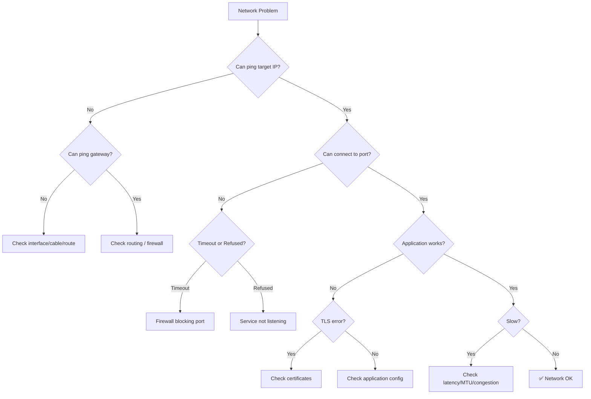

# 🌐 Network Troubleshooting

> **Layer-by-layer debugging for DNS, connectivity, TLS, latency, and packet loss issues.**

---

## 📋 Table of Contents

- [Systematic Network Debugging](#systematic-network-debugging)
- [Network Troubleshooting Decision Tree](#network-troubleshooting-decision-tree)
- [DNS Resolution Failures](#dns-resolution-failures)
- [Connection Timeout](#connection-timeout)
- [Connection Refused](#connection-refused)
- [SSL/TLS Errors](#ssltls-errors)
- [High Latency](#high-latency)
- [Packet Loss](#packet-loss)
- [Port in Use](#port-in-use)
- [General Network Diagnostic Tools](#general-network-diagnostic-tools)

---

## Systematic Network Debugging

Network issues are best debugged layer by layer, from the bottom up. Each layer depends on the one below it.

### The OSI Debugging Approach

```
Layer 7 — Application    HTTP, DNS queries, API calls
Layer 6 — Presentation   TLS/SSL, encryption
Layer 5 — Session        Connection state, keep-alive
Layer 4 — Transport      TCP/UDP, ports, firewalls
Layer 3 — Network        IP routing, MTU, traceroute
Layer 2 — Data Link      ARP, MAC, switch, VLAN
Layer 1 — Physical       Cable, NIC, link status
```

**Debugging order:**

1. **Physical/Link** — Is the interface up? `ip link show`
2. **Network** — Can we reach the gateway? `ping <gateway>`
3. **Transport** — Is the port open? `ss -tlnp`, `telnet <host> <port>`
4. **Application** — Does the service respond? `curl`, `dig`

---

## Network Troubleshooting Decision Tree



---

## DNS Resolution Failures

DNS resolution fails, preventing services from connecting by hostname.

### Symptoms

```bash
$ dig example.com
;; connection timed out; no servers could be reached

$ curl http://api.example.com
curl: (6) Could not resolve host: api.example.com

$ nslookup myservice.default.svc.cluster.local
** server can't find myservice.default.svc.cluster.local: NXDOMAIN
```

### Possible Causes

| Cause | Diagnostic |
|-------|------------|
| DNS server unreachable | `dig @<dns-server> example.com` |
| DNS server misconfigured | Check `/etc/resolv.conf` |
| Domain doesn't exist | `dig example.com` returns NXDOMAIN |
| DNS cache stale | `dig +trace example.com` |
| Firewall blocking DNS (port 53) | `telnet <dns-server> 53` |
| CoreDNS not running (Kubernetes) | `kubectl get pods -n kube-system -l k8s-app=kube-dns` |
| Search domain incorrect | Check `search` in resolv.conf |

### Diagnostic Commands

```bash
# Step 1: Check DNS configuration
cat /etc/resolv.conf
# nameserver 10.96.0.10          (In Kubernetes)
# nameserver 8.8.8.8             (On host)
# search default.svc.cluster.local svc.cluster.local cluster.local

# Step 2: Query DNS server directly
dig example.com                            # Default server
dig @8.8.8.8 example.com                  # Specific server
dig @10.96.0.10 myservice.default.svc.cluster.local  # CoreDNS

# Step 3: Trace DNS resolution path
dig +trace example.com
# Shows root → TLD → authoritative server → answer

# Step 4: Check for NXDOMAIN vs timeout
dig example.com +short
# Empty = NXDOMAIN (doesn't exist)
# No response = timeout (DNS server unreachable)

# Step 5: Test different record types
dig example.com A                  # IPv4
dig example.com AAAA               # IPv6
dig example.com CNAME              # Alias
dig example.com MX                 # Mail
dig example.com NS                 # Nameservers
dig example.com TXT                # TXT records

# Step 6: Reverse DNS
dig -x 10.0.1.5                    # PTR record lookup

# Step 7: Test with nslookup
nslookup example.com
nslookup example.com 8.8.8.8      # Specific server

# Step 8: Check DNS connectivity
nc -zv <dns-server> 53             # TCP
nc -zuv <dns-server> 53            # UDP
```

### Resolution

**DNS Server Unreachable:**

```bash
# Check if DNS server responds to ping
ping -c 3 8.8.8.8

# Temporarily set a working DNS server
echo "nameserver 8.8.8.8" | sudo tee /etc/resolv.conf

# For persistent change (systemd-resolved):
sudo systemctl status systemd-resolved
resolvectl status
# Edit /etc/systemd/resolved.conf to set DNS servers
```

**Stale DNS Cache:**

```bash
# Flush local DNS cache
# systemd-resolved:
sudo systemd-resolve --flush-caches
resolvectl flush-caches

# nscd:
sudo nscd -i hosts

# dnsmasq:
sudo killall -HUP dnsmasq

# Application-level caching (Java, etc.):
# Restart the application or configure TTL
```

**CoreDNS Issues (Kubernetes):**

```bash
# Check CoreDNS status
kubectl get pods -n kube-system -l k8s-app=kube-dns
kubectl logs -n kube-system -l k8s-app=kube-dns --tail=50

# Restart CoreDNS
kubectl rollout restart deployment coredns -n kube-system

# Check CoreDNS configuration
kubectl get configmap coredns -n kube-system -o yaml
```

### Prevention

- Monitor DNS resolution latency and error rates
- Use DNS caching appropriately (respect TTLs)
- Have fallback DNS servers configured
- In Kubernetes, use FQDN with trailing dot for external domains
- Test DNS resolution as part of health checks

---

## Connection Timeout

Connection attempts hang and eventually time out, indicating the packets aren't getting through.

### Symptoms

```bash
$ curl http://api.example.com:8080
curl: (28) Connection timed out after 30001 milliseconds

$ telnet api.example.com 8080
Trying 10.0.1.50...
# Hangs, no response
```

### Possible Causes

| Cause | Diagnostic |
|-------|------------|
| Firewall dropping packets | Timeout (no RST) = firewall, not service |
| Wrong routing | `traceroute` shows packets stop at a hop |
| Security group (cloud) | AWS SG, Azure NSG missing rule |
| NetworkPolicy (Kubernetes) | Policy denying egress/ingress |
| MTU issues | Packets too large, getting dropped silently |
| Service not listening on that interface | Bound to localhost only |
| Remote host unreachable | Network partition |

### Diagnostic Commands

```bash
# Step 1: Distinguish timeout from refused
# Timeout = packets dropped (firewall, routing)
# Refused = service not listening (fast RST)
curl -v --connect-timeout 5 http://<host>:<port>

# Step 2: Check basic connectivity
ping -c 3 <host>
# Ping works but port doesn't = firewall or service issue

# Step 3: Trace the route
traceroute <host>
traceroute -T -p <port> <host>    # TCP traceroute (better for firewalls)
mtr <host>                        # Continuous traceroute

# Step 4: Check firewall (local)
sudo iptables -L -n -v | grep <port>
sudo nft list ruleset | grep <port>     # nftables
sudo ufw status                         # UFW

# Step 5: Check if service is listening
ss -tlnp | grep <port>                  # Local check
# On remote: ssh <host> "ss -tlnp | grep <port>"

# Step 6: Check routing table
ip route show
ip route get <destination>

# Step 7: Test with nc (netcat)
nc -zv -w 5 <host> <port>
# -w 5 = 5 second timeout
# -z = scan only, don't send data

# Step 8: Check MTU
ping -c 3 -M do -s 1472 <host>    # Standard MTU test (1472 + 28 = 1500)
# If this fails, try smaller sizes:
ping -c 3 -M do -s 1400 <host>
```

### Resolution

**Firewall Blocking:**

```bash
# Open port in iptables
sudo iptables -A INPUT -p tcp --dport 8080 -j ACCEPT

# Open port in UFW
sudo ufw allow 8080/tcp

# In cloud: Check security groups / NACLs / firewall rules
```

**MTU Issues:**

```bash
# Find working MTU
ping -c 3 -M do -s 1472 <host>   # Try 1500
ping -c 3 -M do -s 1400 <host>   # Try 1428
ping -c 3 -M do -s 1200 <host>   # Try 1228

# Set MTU on interface
sudo ip link set dev eth0 mtu 1400

# In Docker/Kubernetes, MTU mismatches between overlay
# and underlay networks are a common cause
```

**Service Bound to Localhost:**

```bash
# Service listening on 127.0.0.1 only
ss -tlnp | grep <port>
# tcp  LISTEN  0  128  127.0.0.1:8080  *:*

# Fix: Bind to 0.0.0.0 (all interfaces)
# In application config: bind_address = "0.0.0.0"
```

### Prevention

- Document required ports and firewall rules
- Use infrastructure-as-code for firewall/security group rules
- Test connectivity from the client's perspective after deployment
- Monitor connection timeout rates in application metrics

---

## Connection Refused

The connection is immediately rejected (TCP RST), meaning the target is reachable but nothing is listening.

### Symptoms

```bash
$ curl http://api.example.com:8080
curl: (7) Failed to connect to api.example.com port 8080: Connection refused

$ telnet api.example.com 8080
Trying 10.0.1.50...
telnet: Unable to connect to remote host: Connection refused
```

### Possible Causes

| Cause | Diagnostic |
|-------|------------|
| Service not running | Process not started |
| Wrong port | Service on different port |
| Service crashed | Check logs, process list |
| Service bound to wrong interface | Listening on localhost only |
| Container port not exposed | Docker `-p` missing |

### Diagnostic Commands

```bash
# Step 1: Verify the port from the target
# On the target machine:
ss -tlnp | grep <port>
# Empty = nothing listening

# Step 2: Check if the process is running
ps aux | grep <service>
systemctl status <service>

# Step 3: Check service logs
journalctl -u <service> --since "10 min ago"
docker logs <container>

# Step 4: Verify the correct port
grep -r "port" /etc/<service>/    # Check config
ss -tlnp                          # All listening ports
```

### Resolution

```bash
# Start the service
systemctl start <service>

# If service crashes on start, check logs
journalctl -u <service> -f

# If wrong port, update configuration
# If bound to localhost, change bind address to 0.0.0.0
```

### Prevention

- Use health checks and monitoring for all services
- Configure process supervisors (systemd, supervisord) for auto-restart
- Validate service port configuration in deployment pipelines

---

## SSL/TLS Errors

TLS handshake failures preventing secure connections.

### Symptoms

```bash
$ curl https://api.example.com
curl: (60) SSL certificate problem: certificate has expired

$ curl https://api.example.com
curl: (35) error:14077410:SSL routines:SSL23_GET_SERVER_HELLO:sslv3 alert handshake failure

$ openssl s_client -connect api.example.com:443
CONNECTED(00000003)
verify error:num=20:unable to get local issuer certificate
```

### Possible Causes

| Cause | Error |
|-------|-------|
| Certificate expired | `certificate has expired` |
| Certificate chain incomplete | `unable to get local issuer certificate` |
| Hostname mismatch | `hostname mismatch` |
| Self-signed certificate | `self signed certificate` |
| Protocol/cipher mismatch | `handshake failure`, `no common cipher` |
| Wrong certificate served | `certificate verify failed` |
| Client certificate required | `certificate required` |

### Diagnostic Commands

```bash
# Step 1: Check certificate details
openssl s_client -connect <host>:443 -servername <host> </dev/null 2>/dev/null | \
  openssl x509 -noout -dates -subject -issuer

# Step 2: Check certificate chain
openssl s_client -connect <host>:443 -servername <host> -showcerts </dev/null
# Each certificate in the chain should be shown
# If intermediate certificates are missing, chain is incomplete

# Step 3: Check expiration
openssl s_client -connect <host>:443 -servername <host> </dev/null 2>/dev/null | \
  openssl x509 -noout -dates
# notBefore=Aug  1 00:00:00 2024 GMT
# notAfter=Oct 30 23:59:59 2024 GMT

# Step 4: Check hostname match (SAN)
openssl s_client -connect <host>:443 -servername <host> </dev/null 2>/dev/null | \
  openssl x509 -noout -ext subjectAltName
# X509v3 Subject Alternative Name:
#     DNS:example.com, DNS:*.example.com

# Step 5: Check supported protocols and ciphers
openssl s_client -connect <host>:443 -tls1_2
openssl s_client -connect <host>:443 -tls1_3

# Step 6: Full TLS diagnostic
curl -vI https://<host> 2>&1 | grep -E "SSL|TLS|subject|expire|issuer"

# Step 7: Check from a specific CA bundle
openssl s_client -connect <host>:443 -CAfile /path/to/ca-bundle.crt

# Step 8: Check certificate on disk
openssl x509 -in /path/to/cert.pem -noout -text
openssl x509 -in /path/to/cert.pem -noout -dates
openssl verify -CAfile ca.crt cert.pem
```

### Resolution by Cause

**Certificate Expired:**

```bash
# Renew with Let's Encrypt
sudo certbot renew

# Or replace with new certificate
sudo cp new-cert.pem /etc/ssl/certs/
sudo cp new-key.pem /etc/ssl/private/
sudo systemctl reload nginx
```

**Incomplete Certificate Chain:**

```bash
# Check which intermediate is missing
openssl s_client -connect <host>:443 -servername <host> </dev/null

# Download missing intermediate from the CA
# Concatenate: server cert + intermediate(s) + root
cat server.crt intermediate.crt > fullchain.pem

# In nginx:
# ssl_certificate /etc/ssl/fullchain.pem;    # Full chain, not just server cert
```

**Hostname Mismatch:**

```bash
# Certificate is for "www.example.com" but you're connecting to "example.com"
# Fix: Get a certificate with the correct SAN (Subject Alternative Name)
# Or use a wildcard certificate (*.example.com)
```

**Protocol/Cipher Mismatch:**

```bash
# Check what server supports
nmap --script ssl-enum-ciphers -p 443 <host>

# Ensure server supports TLS 1.2+ with modern ciphers
# In nginx:
# ssl_protocols TLSv1.2 TLSv1.3;
# ssl_ciphers ECDHE-ECDSA-AES128-GCM-SHA256:ECDHE-RSA-AES128-GCM-SHA256:...;
```

### Prevention

- Automate certificate renewal (Let's Encrypt + certbot, cert-manager in Kubernetes)
- Monitor certificate expiry dates (alert at 30, 14, and 7 days before expiry)
- Always include the full certificate chain
- Test TLS configuration with `ssllabs.com/ssltest` or `testssl.sh`
- Pin minimum TLS version to 1.2

---

## High Latency

Network responses are slow, affecting application performance.

### Symptoms

```bash
$ curl -o /dev/null -s -w "Time: %{time_total}s\n" http://api.example.com
Time: 2.345s   # Expected: <0.1s

$ ping api.example.com
64 bytes from 10.0.1.50: icmp_seq=1 ttl=64 time=150.2 ms  # Expected: <5ms for local
```

### Possible Causes

| Cause | Diagnostic |
|-------|------------|
| Network congestion | `mtr` shows high latency at specific hops |
| MTU issues | Large packets dropped, small ones work |
| DNS slow | High `time_namelookup` in curl |
| Routing suboptimal | `traceroute` shows unnecessary hops |
| Application slow | High `time_starttransfer` vs low `time_connect` |
| Geographic distance | Physical latency |
| Bandwidth saturation | `iftop` or `nload` shows high utilization |

### Diagnostic Commands

```bash
# Step 1: Break down latency components
curl -o /dev/null -s -w "\
DNS Lookup:  %{time_namelookup}s\n\
TCP Connect: %{time_connect}s\n\
TLS Setup:   %{time_appconnect}s\n\
First Byte:  %{time_starttransfer}s\n\
Total:       %{time_total}s\n" https://api.example.com

# DNS Lookup: 0.050s      ← DNS resolution
# TCP Connect: 0.055s     ← Network round trip
# TLS Setup: 0.120s       ← TLS handshake
# First Byte: 0.300s      ← Server processing
# Total: 0.310s           ← Complete transfer

# Step 2: Continuous traceroute with latency
mtr <host>
# Shows packet loss and latency at each hop

# Step 3: Traditional traceroute
traceroute <host>
traceroute -I <host>           # ICMP (may work better with firewalls)

# Step 4: Check network bandwidth
iftop                          # Real-time bandwidth per connection
nload                          # Real-time bandwidth per interface
iperf3 -c <host>               # Bandwidth test between two hosts

# Step 5: Check MTU path
ping -c 5 -M do -s 1472 <host>

# Step 6: Check for packet retransmissions
ss -ti dst <host>
# Look for retrans (retransmissions indicate packet loss)

# Step 7: Check interface errors
ip -s link show eth0
# Look for errors, dropped, overruns
```

### Resolution

**DNS Slow:**

```bash
# Use a faster DNS server
# Or cache DNS locally with systemd-resolved, dnsmasq, or unbound
# In applications: cache DNS lookups (connection pools help)
```

**MTU Issues:**

```bash
# Find optimal MTU
ping -c 3 -M do -s 1400 <host>
# Decrease until it works, then set:
sudo ip link set dev eth0 mtu 1400
```

**Bandwidth Saturation:**

```bash
# Identify top bandwidth consumers
iftop -i eth0

# Rate limit specific traffic if needed
# Or upgrade network capacity
```

### Prevention

- Monitor network latency (p50, p95, p99) continuously
- Set up alerts for latency anomalies
- Use CDNs for geographically distributed users
- Enable TCP keepalive and connection pooling
- Test performance under load before production deployment

---

## Packet Loss

Packets are being dropped, causing retransmissions, slowdowns, or connection failures.

### Symptoms

```bash
$ ping -c 100 api.example.com
100 packets transmitted, 95 received, 5% packet loss, time 99150ms

$ mtr --report api.example.com
HOST                  Loss%   Snt   Last   Avg  Best  Wrst StDev
1. gateway.local       0.0%    10    0.5   0.5   0.3   0.8   0.1
2. isp-router.net      2.0%    10    5.2   5.5   4.8   6.2   0.5
3. api.example.com     5.0%    10   15.2  14.5  12.8  18.2   2.1
```

### Possible Causes

| Cause | Diagnostic |
|-------|------------|
| Network congestion | Loss at specific hops in mtr |
| Interface errors | `ip -s link show` shows errors |
| Firewall rate limiting | Periodic packet drops |
| MTU mismatch | Large packets dropped |
| Hardware issues | Cable, NIC, switch |
| Wireless interference | WiFi packet loss |
| Buffer overflow | High traffic causing drops |

### Diagnostic Commands

```bash
# Step 1: Measure packet loss
ping -c 100 -i 0.2 <host>         # 100 pings, 0.2s interval

# Step 2: Continuous monitoring with mtr
mtr --report -c 100 <host>
# Shows loss percentage at each hop

# Step 3: Check interface errors
ip -s link show eth0
# RX errors, TX errors, drops = hardware or driver issue

# Step 4: Check network interface statistics
ethtool -S eth0 | grep -i error
ethtool -S eth0 | grep -i drop

# Step 5: Check for TCP retransmissions
netstat -s | grep retransmit
ss -ti | grep retrans

# Step 6: Check system buffers
sysctl net.core.rmem_max
sysctl net.core.wmem_max
sysctl net.ipv4.tcp_rmem
sysctl net.ipv4.tcp_wmem

# Step 7: Monitor in real-time
watch -n 1 'ip -s link show eth0'
```

### Resolution

```bash
# Increase network buffers
sudo sysctl -w net.core.rmem_max=16777216
sudo sysctl -w net.core.wmem_max=16777216
sudo sysctl -w net.core.netdev_max_backlog=5000

# Fix interface errors — check cables, replace NIC
# For congestion — upgrade bandwidth or implement QoS
```

### Prevention

- Monitor packet loss and interface errors continuously
- Set alerts for packet loss > 0.1%
- Ensure network infrastructure is properly sized
- Use redundant network paths for critical services
- Keep network firmware and drivers updated

---

## Port in Use

A port is already bound, preventing a service from starting.

### Symptoms

```bash
$ ./myapp
Error: listen tcp :8080: bind: address already in use

$ nginx
nginx: [emerg] bind() to 0.0.0.0:80 failed (98: Address already in use)
```

### Diagnostic Commands

```bash
# Find what's using the port
ss -tlnp | grep <port>
# LISTEN  0  128  *:8080  *:*  users:(("myapp",pid=12345,fd=3))

lsof -i :<port>
# COMMAND   PID USER  FD   TYPE DEVICE SIZE/OFF NODE NAME
# myapp   12345 user   3u  IPv6 123456      0t0  TCP *:8080 (LISTEN)

# Find PID on specific port
fuser <port>/tcp
# 8080/tcp:  12345

# Check if it's a Docker container
docker ps --format '{{.Names}}\t{{.Ports}}' | grep <port>
```

### Resolution

```bash
# Option 1: Stop the conflicting process
kill <pid>                           # Graceful (SIGTERM)
kill -9 <pid>                        # Force (SIGKILL) — last resort

# Option 2: Use a different port
# Update your application's configuration

# Option 3: Wait for TIME_WAIT to clear
ss -tn state time-wait | grep <port>
# If many TIME_WAIT connections, enable reuse:
sudo sysctl -w net.ipv4.tcp_tw_reuse=1

# Option 4: Set SO_REUSEADDR in your application
# Python: sock.setsockopt(socket.SOL_SOCKET, socket.SO_REUSEADDR, 1)
# Go: net.ListenConfig{Control: func(...) { syscall.SetsockoptInt(fd, ...) }}
```

### Prevention

- Use process managers that handle port cleanup on restart
- Set `SO_REUSEADDR` in applications
- Document port assignments for your services
- Use dynamic port assignment when possible
- Implement graceful shutdown to release ports cleanly

---

## General Network Diagnostic Tools

### Quick Reference

```bash
# Connectivity
ping <host>                           # ICMP echo
traceroute <host>                     # Route tracing
mtr <host>                            # Continuous traceroute
nc -zv <host> <port>                  # Port check
telnet <host> <port>                  # Port check (interactive)

# DNS
dig <domain>                          # DNS query
dig @<server> <domain>                # Query specific server
nslookup <domain>                     # Simple DNS lookup
host <domain>                         # Simple DNS lookup
resolvectl query <domain>             # systemd-resolved

# HTTP
curl -v <url>                         # Verbose HTTP request
curl -I <url>                         # Headers only
wget -O- <url>                        # Download to stdout

# TLS/SSL
openssl s_client -connect <host>:443  # TLS connection test
openssl x509 -in cert.pem -text      # Certificate details

# Ports and connections
ss -tlnp                              # Listening TCP ports
ss -ulnp                              # Listening UDP ports
ss -tn                                # Active TCP connections
lsof -i :<port>                       # What's using a port
netstat -tlnp                         # Listening ports (legacy)

# Traffic analysis
tcpdump -i eth0 port <port>           # Packet capture
tcpdump -i eth0 host <ip>             # Capture by host
wireshark                             # GUI packet analysis

# Bandwidth
iftop                                 # Real-time bandwidth per connection
nload                                 # Real-time bandwidth per interface
iperf3 -c <host>                      # Bandwidth test

# Interface
ip addr show                          # IP addresses
ip route show                         # Routing table
ip link show                          # Interface status
ethtool eth0                          # Interface details
```

---

## 🔗 Related Topics

- [🧰 CLI / Networking](../../cli/networking/) — Network command reference
- [🔐 Security / TLS](../../security/tls/) — TLS concepts and configuration
- [🚀 DevOps / Networking](../../devops/networking/) — Network infrastructure
- [🚀 Kubernetes Troubleshooting](../kubernetes/) — Kubernetes network issues
- [🐳 Docker Troubleshooting](../docker/) — Docker networking
- [📝 Real-World Incidents](../../real-world/production-incidents/) — DNS and TLS incidents

---

> **Pro tip:** When debugging network issues, always start by distinguishing between timeout (firewall/routing) and refused (service not listening). This single check eliminates half the possible causes immediately.
